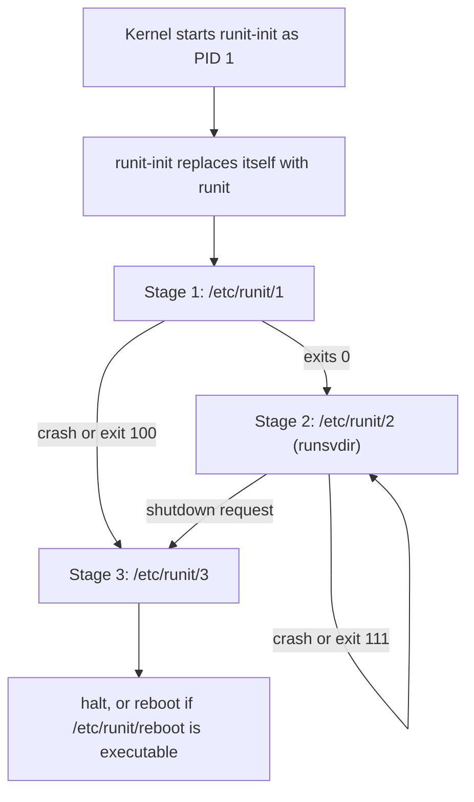

# runit — Boot Stages and Service Directories

## Overview

runit divides the life of the system into three stages, executed by the `runit` program as process 1, and then hands day-to-day work to a directory scanner that turns ordinary directories into supervised services. Understanding both halves — the fixed stage machine and the dynamic service directory format — is enough to understand everything runit does.

This page documents the stages exactly as specified in [runit(8)](http://smarden.org/runit/runit.8.html), the mechanics of `runsvdir` and `runsv`, the complete anatomy of a service directory, and the patterns real distributions (chiefly Void Linux) build on top. The philosophy and component overview are in [runit — Overview and Design Philosophy](./overview-philosophy.md); operating commands are in [sv, svlogd, chpst — Operating Services and Logs](./sv-logging.md).

## The Three Stages

### Stage 1 — `/etc/runit/1` (system bootstrap)

Stage 1 performs the system's one-time boot tasks. runit runs `/etc/runit/1` and waits for it to terminate; the script has full control of `/dev/console` so it can start an emergency shell if initialization fails. On a Void system stage 1 mounts the virtual filesystems, runs the ordered scripts under `/etc/runit/core-services` (hostname, loopback, udev/mdev, clock, and similar setup), using the knobs from `/etc/rc.conf` — the distribution's documented configuration points are `/etc/rc.conf`, `/etc/rc.local`, `/etc/rc.shutdown`, and `core-services` (see the [Void rc-files page](https://docs.voidlinux.org/config/rc-files.html)).

Failure semantics are precise and worth memorizing: if `/etc/runit/1` crashes, or exits with code 100, runit **skips stage 2 entirely and enters stage 3** — a failed bootstrap goes straight to shutdown rather than limping into a half-initialized system.

### Stage 2 — `/etc/runit/2` (the supervision loop)

Stage 2 is the "run" of the system: it must not return until shutdown. If it crashes, or exits 111, runit restarts it. Normally `/etc/runit/2` is a one-liner that execs the supervisor scanner:

```sh
#!/bin/sh
exec runsvdir -P /run/runit/service
```

This is the crucial mental model: **the runsvdir argument is runit's "runlevel"** — a directory whose entries (subdirectories or symlinks to directories) are the set of live services. Everything in it starts in parallel; everything in it stays supervised. There is no additional state, no priorities, no group semantics.

runit also handles the ctrl-alt-del keyboard request while in stage 2: if `/etc/runit/ctrlaltdel` exists and is executable by owner, runit runs it, waits for it to terminate, and then sends itself a CONT signal (which, depending on the `stopit` file, may then trigger shutdown).

### Stage 3 — `/etc/runit/3` (teardown)

Stage 3 runs when runit is told to shut down or when stage 2 returns. runit terminates the running stage 2, then runs `/etc/runit/3`, which performs the system's shutdown tasks: bringing down services is implicit (removing the service directories or the system going down stops supervision), so stage 3 typically unmounts filesystems, syncs, and requests the final halt or reboot through the kernel. Two file-based switches control the very end:

- `/etc/runit/reboot` — if it exists with the execute-by-owner permission set, the system reboots after stage 3; otherwise it halts.
- `/etc/runit/nosync` — if it exists, runit skips its final `sync()` (useful for UML/vserver-style environments where syncing is pointless or harmful).

### Controlling shutdown and reboot

The documented control path is the `runit-init` program, not raw signals. When `runit-init` is started as process 1 it immediately replaces itself with `runit`; when invoked later, it must be called as `init 0` or `init 6` ([runit-init(8)](https://manpages.debian.org/bookworm/runit/runit-init.8.en.html)):

- `init 0` (halt): removes all permissions from `/etc/runit/reboot` (`chmod 0`), sets execute-by-owner on `/etc/runit/stopit` (`chmod 100`), then sends runit a CONT signal.
- `init 6` (reboot): sets execute-by-owner on both `/etc/runit/reboot` and `/etc/runit/stopit`, then sends runit a CONT signal.

runit itself accepts signals only in stage 2, and the documented set is deliberately tiny: a CONT signal with `/etc/runit/stopit` executable means "shut down the system", and an INT signal triggers the ctrl-alt-del handling described above. In practice you use `runit-init 0` / `runit-init 6` (or your distribution's wrappers) rather than signaling runit by hand. Note how the entire state machine is file-driven — permissions on two files *are* the shutdown request, which makes it inspectable and scriptable with nothing but `chmod`.

The stage flow, with its two failure branches:



## runsvdir Mechanics

`runsvdir` is the scanner that gives stage 2 its life. Per [runsvdir(8)](https://manpages.debian.org/bookworm/runit/runsvdir.8.en.html):

- It starts one `runsv` process for each subdirectory, or symlink to a directory, in the services directory, up to a limit of 1000 entries. Names starting with a dot are skipped.
- At least every five seconds it checks whether the directory's last-modification time, inode, or device has changed. If so, it re-scans: a new entry causes a new `runsv` to start (which immediately brings the service up unless it has a `down` file); a removed entry causes the corresponding `runsv` to be sent TERM and dropped from monitoring (it is not restarted if it exits).
- If a `runsv` terminates on its own, `runsvdir` restarts it.
- The `-P` option runs each `runsv` in a new session and separate process group via `setsid(2)` — the standard choice, since it isolates services from terminal signals.
- An optional second argument (the "log") acts like daemontools' readproctitle: runsvdir's stderr is parked in a process title slot, visible in `ps` output, where error messages (e.g., from a bad service directory) can be read.

The five-second scan is why symlink operations feel "eventually consistent": `ln -s /etc/sv/foo /var/service/` starts the service within seconds, and `rm /var/service/foo` stops it the same way. No enable daemon, no reload — the filesystem is the control plane.

## Service Directory Anatomy

A service directory contains an executable `run` and, optionally, everything else below. This annotated tree shows the full shape:

```text
/etc/sv/sshd/
├── run                    # required: executable; execs the daemon in the foreground
├── log/
│   └── run                # optional: log service; runsv pipes service stdout to its stdin
├── finish                 # optional: cleanup on daemon exit (args: run's exit code, status byte)
├── check                  # optional: exit 0 = "service available" (used by sv start/restart)
├── down                   # optional: if present, runsv does not auto-start the service
├── conf                   # optional (Void convention): variables sourced by run
├── control/               # optional: custom control handlers (control/t, control/d, ...)
└── supervise/             # created by runsv at runtime: internal state
    ├── control            # named pipe: sv (or printf) writes single-char commands here
    ├── stat               # human-readable state ("run", "down", "finish", ...)
    ├── pid                # service PID when running
    └── status             # binary state (daemontools-supervise compatible)
```

The `run` script contract deserves spelling out. It must be executable, it should `exec` the daemon (not run it in the background), and the canonical idioms inside are:

```sh
#!/bin/sh
exec 2>&1                        # merge stderr into the log pipe
[ -r ./conf ] && . ./conf        # Void-style configuration file
exec chpst -u sshd:sshd /usr/sbin/sshd -D
```

- `exec 2>&1` redirects stderr into stdout, which runsv has already redirected into the log service's pipe — otherwise daemon error output would land on the console instead of the log.
- `chpst -u user:group` drops privileges before the exec; see [sv, svlogd, chpst](./sv-logging.md) for the full option set.

The `finish` script receives two arguments: `./run`'s exit code (or -1 if it did not exit normally) and the least significant byte of the wait status (the signal number if the process was killed). If `run` or `finish` exits immediately, runsv waits about one second before proceeding — a minimal built-in defense against tight restart loops.

The `control` pipe accepts single characters — the same commands `sv` sends. The full set is `u` (up), `d` (down), `o` (once), `p` (pause/STOP), `c` (continue/CONT), `h` (HUP), `a` (ALRM), `i` (INT), `q` (QUIT), `1`/`2` (USR1/USR2), `t` (TERM), `k` (KILL), `x` (exit: stop service and let runsv exit). Additionally, for any control character other than `o`, `d`, `x`, runsv first checks for an executable `control/c` handler script (e.g., `control/t`); if that handler exits 0, the signal itself is suppressed — the hook for graceful reloads. In day-to-day work you use `sv` rather than writing to the pipe directly; `printf t >/service/foo/supervise/control` is equivalent to `sv t foo` (and note that `printf` blocks if no runsv is running in that directory).

## Worked Service Examples

### nginx — the daemon-off pattern

```sh
#!/bin/sh
exec 2>&1
exec nginx -g 'daemon off;'
```

nginx wants to daemonize by default; `-g 'daemon off;'` overrides that so the supervised process *is* nginx. Rotation of nginx's own log files can be delegated: many setups point nginx's `access_log`/`error_log` at stdout/stderr and let svlogd handle everything, avoiding `sv hup` + reopen choreography entirely.

### sshd — foreground daemon with a conf file

```sh
#!/bin/sh
[ -r ./conf ] && . ./conf
exec /usr/sbin/sshd -D $OPTS
```

`-D` is sshd's "do not detach" flag. The `conf` file (Void convention) lets administrators set `OPTS="-p 2222"` without editing the packaged script — package updates can then overwrite the service directory safely. Void's Handbook documents this pattern as the standard way to customize services.

### A Python application with privilege drop, envdir, and logging

```sh
#!/bin/sh
exec 2>&1
exec chpst -u app:app -e ./envdir /srv/app/venv/bin/gunicorn -b 127.0.0.1:8000 app:application
```

with a `log/run`:

```sh
#!/bin/sh
exec chpst -u app:app svlogd -tt /var/log/app
```

`chpst -e ./envdir` imports environment variables from a directory of files (one file per variable), which is the envdir pattern inherited from daemontools — per-environment deployment configuration without touching the service script. The log service runs as the same unprivileged user so that the (root-created) pipe and log directory stay consistent.

### The oneshot problem — runit has none, by design

There is no service type that runs once and stays "done". Honest options, each with tradeoffs:

- **`sv once`**: start the service if it is not running and do not restart it when it exits. But runsv will still restart it if it is later commanded `up`, and a supervisor entry lingers.
- **`down` + `finish` trick**: a `run` script that does the work and exits, with a `finish` that touches `down` — so the next `runsvdir` scan does not bring it back. Fragile and surprising.
- **Move one-time work into stage 1**: Void does exactly this — `core-services` scripts are ordinary ordered shell scripts, supervised by nothing because they need no supervision. If your "service" is really boot-time configuration, this is the correct home for it.

The design stance is worth internalizing for interviews: runit's model is "a service is a long-running process", and anything else belongs in the boot stage or in an external scheduler. Systems that need first-class oneshots with dependency ordering (dinit, s6-rc, systemd) exist precisely because of this gap.

## Dependency Handling — or the Lack of It

runit has no dependency engine. Inside stage 2 all services start in parallel; nothing waits for anything. Real deployments use three patterns:

1. **`sv check` retry loops** in the dependent's `run` script:

   ```sh
   #!/bin/sh
   exec 2>&1
   while ! sv check database >/dev/null; do sleep 1; done
   exec myapp
   ```

   `sv check` waits (default up to 7 seconds) for the named service to be up and runs the service's `check` script if present, exiting 0 only when the service is genuinely available. Combined with the unconditional restart of a failing `run`, this turns runsv into a retry engine: the app keeps "crashing" until its dependency is ready, then starts for real.

2. **Wait-for-file/socket loops** — the same idea without the runit dependency: `while [ ! -S /run/postgresql/.s.PGSQL.5432 ]; do sleep 1; done`. Simple, but it bypasses supervision state entirely.

3. **Distro layering** — Void pushes all ordering-sensitive setup into stage 1 (`core-services` runs scripts in lexical order, unsupervised) so that stage 2 services can assume the world is ready. This is why Void's stage 1 looks "big" compared to runit's own minimalism: the ordering problem did not disappear, it was relocated to where it can be solved with plain shell.

## Void Linux Specifics

Void is the reference runit distribution, and its conventions are documented in the [Void Handbook services section](https://docs.voidlinux.org/config/services/index.html):

- **Service definitions live in `/etc/sv/`**, one directory per service, owned by packages. Never edit one in place — copy it and edit the copy, or package updates will clobber your changes.
- **Enabling is a symlink into the live runsvdir**: `ln -s /etc/sv/sshd /var/service/`. On a running system `/var/service` is a symlink to `/run/runit/runsvdir/current`, which points at the active runsvdir under `/etc/runit/runsvdir/` (`default` normally, `single` for rescue). Enabling while the system is offline can be done by linking directly into `/etc/runit/runsvdir/default/`.
- **Disabling is `rm /var/service/sshd`** — runsvdir's rescan stops the service as described above. There is no cache to update and no daemon to reload.
- **Preventing autostart without disabling** is the `down` file: `touch /etc/sv/sshd/down` keeps the service supervised but stopped; Void uses this mechanism to ship services that are installed but opt-in, and to let users disable the agetty-tty1..6 services persistently.
- **Core services** ship as ordinary service directories — the agetty instances for ttys 1 through 6, udevd, and network/daemon services among them — so agetty respawn (the classic init job) is just supervision like everything else.
- **A different runsvdir can be booted** by naming it on the kernel command line (`single` boots the rescue runsvdir, which runs sulogin); additional runsvdirs under `/etc/runit/runsvdir/` plus `runsvchdir` give a lightweight service-set switching mechanism — the closest runit comes to runlevels.
- **Per-user services** use the same primitives: a user runs `runsvdir ~/.runit/service` with their own `/etc/sv`-style directories; see [Void's per-user services guide](https://docs.voidlinux.org/config/services/user-services.html). Stage 2 of the user's tree is their own business — runit does not distinguish user from system services beyond paths.

## Interview Questions

### Q: Walk through exactly what happens between `ln -s /etc/sv/foo /var/service/` and the foo process running.

Within at most five seconds, runsvdir's periodic check notices the directory changed and re-scans. It sees a new symlink-to-directory and spawns a fresh `runsv` (in a new session, if `-P` is in use). runsv chdirs into the service directory, checks for a `down` file — none present — and forks and runs `./run`. The run script's `exec` replaces it with the daemon; runsv records the PID under `supervise/pid`, sets state to "run" in `supervise/stat`, and if a `log/` directory exists, it has already created the pipe and started `log/run` so output is captured from the first line.

### Q: Why does stage 1 exiting with code 100 skip stage 2, and stage 2 exiting with 111 get restarted?

The exit codes are conventions with distinct meanings baked into runit: 100 from the bootstrap script signals unrecoverable one-time-task failure, so runit goes directly to stage 3 and shuts the system down rather than starting an unreliable supervisor state; 111 from stage 2 signals "I died abnormally" (111 is the conventional supervise-suite error code — runit-init and runsv also use it), so runit restarts the stage. A deliberately asymmetric design: boot failures are fatal, runtime supervision failures are recoverable.

### Q: What is the difference between `sv down`, `sv once`, and a `down` file?

`sv down` stops a running service (TERM then CONT, honoring `finish`) and marks it administratively stopped — it will not restart until told `up`. `sv once` starts the service if it is not running but disables auto-restart until the next `up`. A `down` file present at runsv startup prevents the service from starting at all when the runsvdir scan picks it up; it is persistent configuration (it survives reboots and package updates live in the service directory), while the first two are runtime commands. To bring up a service with a `down` file you run `sv up foo`, which removes the down state for that run.

### Q: How would you make a service reload its configuration instead of restarting?

Two supported paths. If the daemon handles SIGHUP, `sv hup foo` sends it — and you can make that the default by writing a `control/h` handler script in the service directory. If the daemon needs a real restart, `sv restart foo` (which sends term/cont/up and waits up to 7 seconds, running `./check` if present to confirm availability). The `control/c` mechanism is the general hook: for any control character other than `o`, `d`, and `x`, an executable `control/<char>` runs first, and if it exits 0 the ordinary signal is suppressed — that is how you implement graceful reloads or draining.

### Q: Why does runit not implement runlevels, and what replaces them?

Because "runlevel" conflates two problems runit separates: which services exist (a set of directories) and who keeps them alive (supervisors, which do not care about levels). The replacement is mechanical: different service *sets* are different directories, switched by repointing the `current` symlink (`runsvchdir`) or by booting with a different set named on the kernel command line (Void's `single` runsvdir). Cross-service ordering — the other half of what runlevels encode — is handled in stage 1 or in service `run` scripts, as covered above.

### Q: A service is in a restart loop. How do you debug it with runit's own artifacts?

Read `supervise/stat` for the current state (`run`, `down`, `finish`), and check whether the loop is `run` failing instantly (runsv sleeps about one second between attempts, so a rapidly incrementing PID in `supervise/pid` is the tell). The `finish` script receives the exit code and signal — if you do not have one, add a trivial logging finish. Then run the `run` script by hand from the service directory (with the same `chpst` invocations) to see the actual error; the classic causes are a missing binary in PATH under the dropped user, a writable-directory problem, or the daemon daemonizing anyway. `sv d foo` stops the loop while you work.

## References

- [runit(8) — upstream](http://smarden.org/runit/runit.8.html) — authoritative stage description, ctrl-alt-del, and signal behavior
- [runit(8) — Debian man page](https://manpages.debian.org/bookworm/runit/runit.8.en.html)
- [runit-init(8) — Debian](https://manpages.debian.org/bookworm/runit/runit-init.8.en.html) — `init 0` / `init 6` mechanics and exit codes
- [runsvdir(8) — upstream](http://smarden.org/runit/runsvdir.8.html) — scan interval, 1000-entry limit, `-P`, readproctitle log
- [runsv(8) — upstream](http://smarden.org/runit/runsv.8.html) — run/finish/down contract, control characters, state files
- [runsvchdir(8) — upstream](http://smarden.org/runit/runsvchdir.8.html) — switching service sets via the `current` symlink
- [runit — how to install](http://smarden.org/runit/install.html) — layout of the source tree and service examples
- [Void Linux Handbook — Services and Daemons (runit)](https://docs.voidlinux.org/config/services/index.html) — enabling/disabling, service directory contents, conf files
- [Void Linux Handbook — rc.conf, rc.local and rc.shutdown](https://docs.voidlinux.org/config/rc-files.html) — stage 1 configuration files
- [Void Linux Handbook — Per-User Services](https://docs.voidlinux.org/config/services/user-services.html) — user-space runsvdir usage

## Cross-References

- [runit — Overview and Design Philosophy](./overview-philosophy.md) — the component map and design rationale behind these stages.
- [sv, svlogd, chpst — Operating Services and Logs](./sv-logging.md) — the commands you use against these directories daily.
- [SysVinit — inittab and the respawn field](../sysvinit/inittab.md) — the respawn analogy: agetty supervision by init vs by runsv.
- [systemd — Service Units](../systemd/service-units.md) — Restart=, Type=oneshot and the features runit deliberately lacks.
- [init-systems README](../README.md) — section hub.
- [BusyBox](../../binaries/busybox.md) — the embedded-init contrast: busybox init vs runit in minimal systems.
