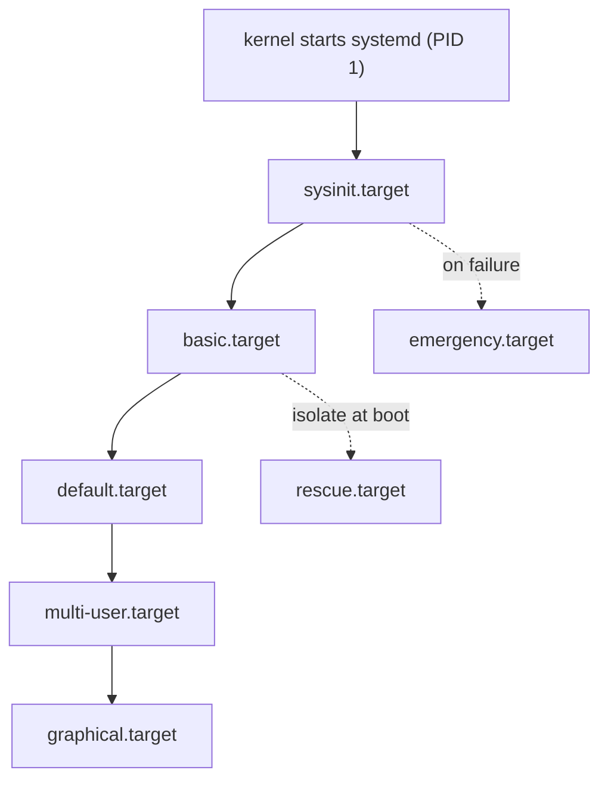

# The systemd Boot Process (bootup(7))

## Overview

A systemd boot is a short, well-defined pipeline: firmware, bootloader,
kernel, initrd, then the service manager as PID 1, which pulls in a
dependency-ordered graph of target units — `sysinit.target` for fundamental
OS initialization, `basic.target` for the unit substrate, and finally
`default.target` (usually `multi-user.target` or `graphical.target`). The
authoritative narrative is `bootup(7)`; this page walks it end to end,
including the initrd handover, what actually starts in each phase, boot-time
analysis with `systemd-analyze`, kernel command line escape hatches, the
rescue/emergency modes, and the shutdown sequence.

The single most important mental model: the manager does not execute a
script; it *computes a transaction*. When PID 1 starts it loads
`default.target`'s full dependency closure into a job graph and runs as much
of it in parallel as ordering edges allow. Everything else on this page is a
description of which nodes exist in that graph and in what order they are
pinned.

## From the Kernel to PID 1

Before systemd exists, the platform boot must succeed (see
[bios-uefi.md](../../../os/boot/bios-uefi.md) and
[bootloader.md](../../../os/boot/bootloader.md) for those phases). The
kernel's last act of early userspace is to spawn a single process:

1. With `init=` on the kernel command line, that path is used verbatim.
2. Without it, the kernel tries, in order: `/sbin/init`, `/etc/init`,
   `/bin/init` — and if none exists, it panics.
3. On systemd distributions, `/sbin/init` (or `/usr/sbin/init` post-merge)
   is a symlink to the systemd binary, so the default handover lands on the
   service manager.

The canonical paths on a modern merged-`/usr` system: the binary is
`/usr/lib/systemd/systemd` (Debian and older split-`/usr` setups keep
`/lib/systemd/systemd` as the real file or symlink), and `/sbin/init` points
at it. `init=/usr/lib/systemd/systemd` is the explicit override used in
rescue scenarios where the `/sbin/init` symlink or an alternative init
manager is involved — for example booting a systemd userland with a
busybox-based initrd that must exec the real init by full path.

Once running as PID 1, systemd immediately mounts nothing and starts nothing
blindly: it processes the kernel command line (recognizing its `systemd.*=`
options), prepares the cgroup hierarchy, and begins the boot transaction
described below. Kernel and manager logging are wired up first — the journal
socket is created before anything else starts so that no early output is lost.

## The initrd Phase

Most distributions boot through an initramfs, and modern initramfs
generators (dracut, mkinitcpio) can run systemd *inside* the initrd:

- The initrd's `/init` is systemd itself. It runs the same manager code with
  a reduced view of the world, driving the special `initrd.target`.
- Its jobs: load storage drivers, activate device-mapper/LUKS volumes
  (`cryptsetup@*.service` via `rd.*` kernel arguments), assemble arrays,
  and mount the real root at `/sysroot`.
- Completion is signaled by the `initrd-root-fs.target` /
  `initrd-fs.target` / `sysinit` chain, and then
  `initrd-switch-root.service` invokes `systemctl --no-block switch-root
  /sysroot`, which unmounts the initramfs contents and re-execs the *same*
  manager binary from the new root.

The elegant part of this design: it is one manager across the transition, so
units started in the initrd (notably journald and udevd) continue seamlessly
and no state is lost. Distributions that do not use systemd in the initrd run
a shell-based initramfs and hand over to PID 1 with a plain `exec switch_root`
— functionally equivalent but with duplicated early logging and udev setup.

Kernel arguments that matter in this phase are typically `rd.*` prefixed
(e.g. `rd.luks=`, `rd.lvm.lv=`, `rd.break` for a dracut emergency shell
inside the initrd). The deeper kernel-side story is in
[kernel-boot.md](../../kernel/core/kernel-boot.md).

## The Three-Phase Boot: sysinit, basic, default

`bootup(7)` structures the boot as a chain of well-known targets. Each
target is a synchronization point: units that must complete before the phase
is "reached" are ordered `Before=` it, units that belong to the phase are
pulled in by it.

```
 default.target (multi-user / graphical)
   |
 basic.target            <-- sockets, timers, paths, slices activated
   |
 sysinit.target          <-- mounts, udev, journald, swap, fsck, cryptsetup
   |                       sysctl, tmpfiles, sysusers, random seed
 emergency.service
   (early rescue shell, read-only /)
```



### sysinit.target

`sysinit.target` is "fundamental initialization of the OS". Its closure
contains (with their usual ordering hooks):

- `systemd-journald.service` plus its sockets (logging up first),
- `systemd-udevd.service` and the udev control/kernel sockets,
  `systemd-udev-trigger.service`, and (where used) `systemd-udev-settle.service`,
- low-level VFS mounts: `/proc`, `/sys`, `/dev` (devtmpfs),
  `dev-hugepages.mount`, `dev-mqueue.mount`, `sys-kernel-config.mount`,
  `sys-kernel-debug.mount`, `sys-fs-fuse-connections.mount`,
- `systemd-modules-load.service` (`modules-load.d`), `systemd-sysctl.service`
  (`sysctl.d`),
- `systemd-fsck-root.service`, `systemd-remount-fs.service`, and the
  `local-fs-pre.target`/`local-fs.target` chain plus `swap.target`,
  `cryptsetup.target` where applicable,
- `systemd-random-seed.service`, `systemd-sysusers.service`,
  `systemd-tmpfiles-setup.service`, `systemd-update-utmp.service`,
  `systemd-machine-id-commit.service`.

Units in this phase typically carry `DefaultDependencies=no` and are pinned
explicitly around `sysinit.target` — the standard dependency story is in
[dependency-management.md](./dependency-management.md).

### basic.target

`basic.target` is the point where "the unit substrate" exists: it
`Requires=`/`After=` `sysinit.target` and pulls in `sockets.target`,
`timers.target`, `paths.target` and `slices.target`, activating all
listening sockets, recurring timers, path watchers and the slice hierarchy
that do not opt out via `DefaultDependencies=no`. Services started from here
on can rely on `/run` being populated and on sockets being bound even if
their own start is deferred.

A common misconception: `basic.target` does **not** mean "services are
running". Plain services are *not* pulled in by basic; they are pulled in by
`multi-user.target` (or whatever the default target wants). basic is the
ordering anchor between OS plumbing and the default target's payload.

### default.target

`default.target` is an alias (a symlink) for the configured boot goal —
`graphical.target` on desktops, `multi-user.target` on servers. It pulls in
the system payload: `getty.target` (terminal logins), `network-online.target`
waiters, `sshd.service`, installed services' `[Install]` symlinks under
`/etc/systemd/system/multi-user.target.wants/`, and for graphical boots
`display-manager.service`. The details of these targets and the runlevel
compatibility layer are in [targets-runlevels.md](./targets-runlevels.md).

## What Starts When — Typical Server Boot

| Phase (approximate) | Units involved |
|---|---|
| kernel → PID 1 | kernel init, `/sbin/init` → `systemd`, cmdline processing |
| very early | `systemd-journald`, `systemd-udevd` + sockets, VFS mounts, `systemd-sysctl`, `systemd-modules-load` |
| sysinit | fsck + `local-fs.target`, `swap.target`, `cryptsetup@*`, `systemd-random-seed`, `systemd-sysusers`, `systemd-tmpfiles-setup`, `systemd-update-utmp` |
| basic | `sockets.target` (e.g. `sshd.socket` where used), `timers.target` (`logrotate.timer`, `fstrim.timer`), `paths.target`, `slices.target` |
| default | `networkd`/NetworkManager, `network-online.target` waiters, `sshd.service`, application services, `getty.target` (`getty@tty1`) |
| graphical only | `display-manager.service` (GDM/SDDM/LightDM), which pulls a full user session |

After logins begin, `systemd-logind` creates `session-N.scope` cgroups and
starts `user@UID.service` per user; `autovt@.service` (aliased to
`getty@.service`) spawns additional gettys on demand when a user switches VTs.
That session machinery is logind's domain — the hands-on coverage is in
[systemd.md](../../admin/systemd.md).

## Boot-Time Analysis with systemd-analyze

`systemd-analyze` is the built-in boot profiler; every subcommand reads the
manager's state (and, with `--user`, the user manager's):

```
$ systemd-analyze
Startup finished in 2.417s (kernel) + 1.802s (initrd) + 9.531s (userspace) = 13.750s
graphical.target reached after 9.401s in userspace

$ systemd-analyze blame | head -3
 4.102s dev-sda2.device
 1.955s systemd-journal-flush.service
 1.310s NetworkManager-wait-online.service

$ systemd-analyze critical-chain
graphical.target @9.401s
+-multi-user.target @9.401s
  +-sshd.service @8.972s
    +-network.target @6.900s
      ...
```

- `time` — the kernel/initrd/userspace split; the fastest "is it the firmware
  or is it us?" triage.
- `blame` — per-unit initialization time; note device units and waiters can
  dominate without being the *cause* of slowness.
- `critical-chain` — the chain of units that actually delayed the final
  target; each `@` is when the unit started, `+` is how long it took. This is
  the honest answer to "why is boot slow".
- `plot` — an SVG Gantt-style timeline (`systemd-analyze plot > boot.svg`),
  the visualization to attach to a performance report.
- `dot` — a Graphviz dependency graph of the loaded units.
- `verify`, `security`, `calendar`, `condition` — covered in
  [systemctl-cli.md](./systemctl-cli.md).

Remember that after the first boot of a session, `systemd-analyze` reports
the *previous* boot by default; use `systemd-analyze time` right after reboot
or pass a boot via `--boot=` against journal-backed data.

## Kernel Command Line Knobs

The manager parses its own parameters from `/proc/cmdline` at startup. The
ones worth memorizing:

| Argument | Effect |
|---|---|
| `systemd.unit=<name>` | Boot into an arbitrary unit instead of `default.target` (e.g. `systemd.unit=multi-user.target`) |
| `rescue` / `single` / `1` | Boot into `rescue.target` (local filesystems mounted, sulogin shell) |
| `emergency` / `-b` | Boot into `emergency.target` (most minimal: root mounted, sulogin) |
| `systemd.mask=<unit>` | Prevent a unit from being started this boot (as if `systemctl mask`) |
| `systemd.wants=<unit>` | Add a one-shot `Wants=` for a unit this boot (e.g. `systemd.wants=foo.service`) |
| `systemd.debug_shell=1` | Spawn `debug-shell.service`: an unauthenticated root shell on tty9 (Ctrl+Alt+F9) |
| `systemd.show_status=<bool\|auto>` | Force console status lines on/off (pairs with `quiet`) |
| `quiet` | Standard verbosity reduction; systemd suppresses most console messages |
| `systemd.log_level=debug`, `systemd.log_target=` | Manager debug logging; combine with `systemd.show_status=1` |
| `systemd.default_standard_output=journal+console` | Route all service output to both journal and console |
| `systemd.confirm_spawn=`, `systemd.crash_shell`, `systemd.crash_reboot` | Interactive/hardening knobs for a broken manager |

The `systemd.mask=`/`systemd.wants=`/`systemd.debug_shell=` trio is
implemented by `systemd-debug-generator`. For persistent (non-per-boot)
configuration, use `systemctl set-default`, masks under
`/etc/systemd/system`, or drop-ins — see [unit-files.md](./unit-files.md).

## Emergency Paths: rescue.target vs emergency.target

| Property | `emergency.target` | `rescue.target` |
|---|---|---|
| Reach | As early as possible, before `sysinit.target` completes | After `sysinit.target` / local filesystems are up |
| Environment | Root fs only, usually read-only; no `/var` guarantee | Local filesystems mounted; system services not started |
| Login | `sulogin` on the console (`emergency.service`) | `sulogin` on the console (`rescue.service`) |
| Typical cause | fsck failure, missing/broken `/etc/fstab`, cryptsetup failure | Admin-requested maintenance boot |
| Kernel arg | `emergency` (or `systemd.unit=emergency.target`) | `rescue`, `single`, `1` (or `systemd.unit=rescue.target`) |

At runtime both are reached with `systemctl isolate rescue.target` /
`emergency.target` (or the `systemctl rescue`/`emergency` verbs). Leaving is
the reverse: log out of the sulogin shell and `systemctl default` (or
`systemctl isolate default.target`) resumes the normal boot transaction; the
manager holds the boot transaction in a paused state while the rescue target
is active. Deeper interactive-repair workflows (systemd in the initrd,
`rd.break`, chrooting) are covered in [rescue.md](../../admin/rescue.md).

## Shutdown Sequence

`systemctl reboot` (or the classic `reboot(8)`/`poweroff(8)`/`halt(8)`/
`shutdown(8)` front-ends, which on systemd systems end up in the same place)
starts the mirror image of boot:

1. The chosen target (`reboot.target`, `poweroff.target`, `halt.target`,
   `kexec.target`) is started with job mode
   `replace-irreversibly --no-block`, after a wall message warns logged-in
   users.
2. Its `Conflicts=shutdown.target` + `Before=shutdown.target` default
   dependencies mean every normal unit receives a stop job — in reverse
   ordering: dependents stop before the units they depend on.
3. `umount.target` collects mount/automount/swap stop jobs; `final.target`
   marks "no more services, only cleanup".
4. The final service (`systemd-reboot.service` / `systemd-poweroff.service`
   / ...) runs, and PID 1 then execs `systemd-shutdown(1)`, which does what
   a shell-based shutdown cannot reliably do from userspace: unmount the
   root filesystem, detach loop and device-mapper devices, disable swaps,
   sync, and finally issue the `reboot(2)` system call. If an initrd is
   present, control can jump back to it first for storage teardown.

Two operational notes: `systemctl reboot --force` skips service stopping
(kills everything, unmounts, reboots) and `--force --force` executes
immediately from systemctl itself without contacting the manager — the
documented last resort when PID 1 is wedged. And `systemctl reboot --job-mode=...`
shows the general job mechanism at work: shutdown is just a transaction whose
jobs happen to be stop jobs.

## Interview Questions

### Q: Walk through the boot phases from kernel to login prompt on a systemd system.

The kernel mounts the root fs (via initrd where present) and spawns PID 1 —
either directly or after an initrd systemd performs `switch_root`. PID 1
processes its command-line options and starts `default.target`'s dependency
closure: `sysinit.target` brings up journald, udev, core mounts, fsck, swap
and cryptsetup; `basic.target` activates sockets, timers, paths and slices;
`default.target` (multi-user or graphical) starts the actual payload —
network, sshd, application services, `getty.target` and optionally the
display manager. Parallelism is the default; the `After=`/`Before=` edges and
the sysinit/basic chain are the only ordering. Login sessions appear when
getty or the display manager run, with logind creating session scopes and the
per-user `user@UID.service` manager.

### Q: What is the difference between sysinit.target and basic.target?

`sysinit.target` is fundamental OS initialization: logging, device
management, essential mounts, filesystem checks, swap, sysctls, tmpfiles —
the things everything else needs to exist. `basic.target` sits above it and
activates the manager's *substrate*: all configured sockets, timers, path
units and slices. Services are pulled in by neither; they are pulled in by
the default target. The practical consequence: a service ordered
`After=basic.target` can assume sockets are bound and `/run` is ready, but
must not assume any application service is running.

### Q: How do you debug slow boot, concretely?

`systemd-analyze time` first to split kernel/initrd/userspace; if userspace
dominates, `systemd-analyze critical-chain` to find the units that actually
delayed the final target, and `blame`/`plot` for per-unit detail. Common
findings: a `*-wait-online.service` blocking the default target on a dead
interface, a device unit waiting on slow storage, or a service whose
`TimeoutStartSec` is being consumed. Fixes are usually `Wants=network-online.target`
only where genuinely needed, `x-systemd.automount` for slow mounts, or
ordering corrections.

### Q: rescue.target vs emergency.target — when does the system land in each?

`emergency.target` is the minimal stop: the manager boots far enough to run
`sulogin` on the console with only the root filesystem (often read-only), and
it is reached automatically when early boot fails hard — failed fsck, broken
fstab, missing cryptsetup devices. `rescue.target` is the "single-user mode"
successor: `sysinit.target` and local filesystems are up, so you have a
writable system for repairs, but no network or services. Both are reachable
on demand (`systemctl isolate ...`, kernel args `emergency`/`rescue`/`single`),
and you return with `systemctl default`.

### Q: What does systemd do on shutdown that a SysVinit system did in scripts?

The mirror transaction: the poweroff/reboot target conflicts with and orders
before `shutdown.target`, so every unit gets a stop job in reverse dependency
order; `umount.target` unmounts filesystems; `final.target` gates the end;
then PID 1 execs `systemd-shutdown(1)`, which kills remaining processes,
performs the unmount of root, detaches loop/DM devices, disables swap and
syncs, and finally calls `reboot(2)`. The classic `shutdown`/`reboot`/
`poweroff`/`halt` commands still exist as front-ends, but there is no
numbered script run — stopping is derived from the same dependency graph that
started the system.

### Q: How would you boot a system once into a different target without changing the default?

Pass it on the kernel command line for that boot: `systemd.unit=rescue.target`
(or the shorthand `rescue`, `single`, `1`, `emergency`) at the
bootloader prompt — this affects only the current boot. To change the
persistent default, `systemctl set-default multi-user.target` rewrites the
`/etc/systemd/system/default.target` symlink. At runtime without rebooting,
`systemctl isolate rescue.target` switches immediately (stopping everything
not wanted by the new target), and `systemctl default` returns.

## References

- [bootup(7) — canonical description of the boot and shutdown phases](https://www.freedesktop.org/software/systemd/man/latest/bootup.html)
- [systemd-analyze(1) — boot time profiling subcommands](https://www.freedesktop.org/software/systemd/man/latest/systemd-analyze.html)
- [systemctl(1) — verbs including rescue/emergency/reboot semantics](https://www.freedesktop.org/software/systemd/man/latest/systemctl.html)
- [systemd-analyze(1) — Debian bookworm mirror](https://manpages.debian.org/bookworm/systemd/systemd-analyze.1.en.html)
- [systemctl(1) — Debian bookworm mirror](https://manpages.debian.org/bookworm/systemd/systemctl.1.en.html)
- [github.com/systemd/systemd — source; see src/basic/linux, units/ and NEWS](https://github.com/systemd/systemd)

## Cross-References

- [systemd overview and architecture](./overview-architecture.md) — the component map this boot process executes.
- [Targets and runlevel compatibility](./targets-runlevels.md) — the target units that structure each phase.
- [SysVinit boot sequence](../sysvinit/boot-sequence.md) — the sequential rc-script boot being contrasted.
- [systemd internals (admin)](../../admin/systemd-internals.md) — how the transaction engine computes the boot job set.
- [Rescue and recovery (admin)](../../admin/rescue.md) — hands-on repair including initrd breaks and chroot.
- [Kernel boot process](../../kernel/core/kernel-boot.md) — everything before userspace takes over.
- [Bootloaders](../../../os/boot/bootloader.md) — how the kernel and initrd are loaded and given cmdline args.
- [BIOS vs UEFI boot](../../../os/boot/bios-uefi.md) — the firmware phase feeding the bootloader.
