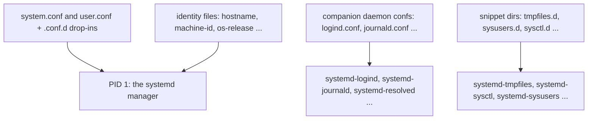

# Configuring systemd — Manager Confs, Snippet Dirs and Distro Identity

## Overview

Unit files — covered in [unit-files.md](./unit-files.md) and
[service-units.md](./service-units.md) — are only part of the systemd configuration surface. Around the unit model
sits a second, equally operational layer: the configuration of the *manager itself* and of its companion daemons
(`systemd-logind`, `systemd-journald`, `systemd-resolved`, ...), the `*.d` snippet mechanisms (`tmpfiles.d`,
`sysusers.d`, `sysctl.d`, ...) that replace boot-time imperative scripts, and small identity files (`hostname`,
`machine-id`, `os-release`, `locale.conf`) read at boot. None of these are unit files; all are files operators edit,
packages ship, and images provision.

Three structural ideas organize the surface. Every long-lived daemon has one central `*.conf` file plus a matching
`*.conf.d/` drop-in directory, so vendor defaults under `/usr/lib` are never edited, only overridden from `/etc` (or
`/run` for runtime state). The `*.d` snippet directories are one design pattern applied six times: same-named files
shadow each other in `/etc` > `/run` > `/usr/lib` precedence, and files apply in lexicographic order. And identity is
data: files such as `/etc/machine-id` and `/usr/lib/os-release` exist so tools can branch on them — and so cloned
images can defer them to first boot via `systemd-firstboot`.

By the end of this page you should be able to override manager-wide defaults (`DefaultTimeoutStopSec=`,
`DefaultEnvironment=`, start rate limits) with a drop-in instead of editing `system.conf`; configure session policy
in `logind.conf`; write `tmpfiles.d`, `sysctl.d` and `modules-load.d` snippets in place of boot scripts; regenerate a
machine ID on cloned images; and choose between `EnvironmentFile=` and `Environment=` for per-service configuration.

## The Configuration Map

| Layer | File / directory | Consumed by | Notes |
|---|---|---|---|
| PID-1 manager | `/etc/systemd/system.conf` + `system.conf.d/*.conf` | `systemd` (PID 1) | Manager-wide `Default*=` settings |
| PID-1 manager | `/etc/systemd/user.conf` + `user.conf.d/*.conf` | `systemd --user` | Per-user analog (also `~/.config/systemd/user.conf`) |
| Companion daemon | `/etc/systemd/logind.conf` + `logind.conf.d/` | `systemd-logind` | Session, seat, key handling |
| Companion daemon | `/etc/systemd/sleep.conf` + `sleep.conf.d/` | `systemd-sleep` | Suspend/hibernate mechanics |
| Companion daemon | `/etc/systemd/timesyncd.conf` + `timesyncd.conf.d/` | `systemd-timesyncd` | NTP servers, polling |
| Companion daemon | `/etc/systemd/coredump.conf` + `coredump.conf.d/` | `systemd-coredump` | Core storage policy |
| Companion daemon | `/etc/systemd/journald.conf` + `journald.conf.d/` | `systemd-journald` | Storage, rate limits — [journald.md](./journald.md) |
| Companion daemon | `/etc/systemd/resolved.conf` + `resolved.conf.d/` | `systemd-resolved` | DNS/LLMNR/DNSSEC — [networkd-resolved.md](./networkd-resolved.md) |
| Companion daemon | `/etc/udev/udev.conf` | `systemd-udevd` | Under `/etc/udev/`, not `/etc/systemd/` — [udevd.md](./udevd.md) |
| Snippet dir | `/etc/tmpfiles.d/*.conf` (+ `/run`, `/usr/lib`) | `systemd-tmpfiles` | Volatile paths, cleanup ages |
| Snippet dir | `/etc/sysusers.d/*.conf` (+ `/run`, `/usr/lib`) | `systemd-sysusers` | Declarative user/group provisioning |
| Snippet dir | `/etc/modules-load.d/*.conf` (+ `/run`, `/usr/lib`) | `systemd-modules-load.service` | Kernel modules at boot |
| Snippet dir | `/etc/sysctl.d/*.conf` (+ `/run`, `/usr/lib`) | `systemd-sysctl` | Kernel parameters at boot |
| Snippet dir | `/etc/binfmt.d/*.conf` (+ `/run`, `/usr/lib`) | `systemd-binfmt.service` | Misc binary format handlers |
| Snippet dir | `/etc/environment.d/*.conf` (+ `~/.config`, `/run`, `/usr/lib`) | user manager via generator | User-unit environment |
| Identity | `/etc/hostname` | PID 1, `systemd-hostnamed` | Static hostname, one token |
| Identity | `/etc/machine-id` | everything | 32-hex machine identity |
| Identity | `/usr/lib/os-release` (symlinked from `/etc/os-release`) | `systemd-firstboot`, tooling | Distro identification |
| Identity | `/etc/locale.conf` | PID 1, `systemd-localed` | System locale assignments |
| Identity | `/etc/vconsole.conf` | `systemd-vconsole-setup` | Virtual console keymap/font |
| Identity | `/etc/fstab` | `systemd-fstab-generator` | Rows become `.mount`/`.swap` units |



## The Manager: system.conf and user.conf

`system.conf` configures the *manager*, not any single unit: the `[Manager]` section holds defaults that per-unit
settings inherit.

| Directive | Default | Effect |
|---|---|---|
| `DefaultTimeoutStopSec=` | 90s | Default `TimeoutStopSec=` for units; the "A stop job is running" countdown |
| `DefaultStartLimitIntervalSec=` / `DefaultStartLimitBurst=` | 10s / 5 | Default unit start rate limiting |
| `DefaultEnvironment=` | unset | Environment passed to **all executed unit processes** |
| `ManagerEnvironment=` | unset | Environment of the **manager process itself**; on the system manager not inherited by unit processes — use `DefaultEnvironment=` for that (user managers *do* pass their environment to units) |
| `LogLevel=` / `LogTarget=` | `info` / `journal-or-kmsg` | The manager's own logging |
| `DumpCore=` | `yes` | Whether PID 1 dumps core on crash |

The drop-in workflow is the same as for units — never edit `/usr/lib/systemd/system.conf`, prefer a snippet:

```ini
# /etc/systemd/system.conf.d/50-timeout.conf
[Manager]
DefaultTimeoutStopSec=15s
DefaultEnvironment="DEPLOYMENT=prod" "TZ=UTC"
DefaultStartLimitIntervalSec=30s
DefaultStartLimitBurst=10
LogLevel=info
LogTarget=journal
DumpCore=yes
```

Apply with `systemctl daemon-reload`: the manager re-reads `system.conf` and its drop-ins, and `Default*=` values
apply to units loaded from then on. `systemctl daemon-reexec` re-executes PID 1 — the sledgehammer used after systemd
package upgrades. `user.conf` is the exact analog for the per-user manager (`systemd --user`): read from
`~/.config/systemd/user.conf` first, falling back to the system-wide `/etc/systemd/user.conf`, each with
`user.conf.d/` drop-ins. The same `[Manager]` directives apply — `DefaultTimeoutStopSec=` there governs a user's
units independently of the system value, because a user manager is a real manager with its own defaults, not a
sandboxed view of system state.

Reference: [systemd-system.conf(5)](https://manpages.debian.org/bookworm/systemd/systemd-system.conf.5.en.html).

## logind.conf — Session and Seat Policy

`/etc/systemd/logind.conf` governs `systemd-logind`: who handles the power and sleep keys, what happens when the
system goes idle, and what happens to a user's processes and IPC objects at logout. The key handlers in `[Login]`:

| Directive | Default | Meaning |
|---|---|---|
| `HandlePowerKey=` | `poweroff` | Physical power button press |
| `HandleRebootKey=` | `reboot` | Physical reboot key |
| `HandleSuspendKey=` | `suspend` | Physical suspend key |
| `HandleHibernateKey=` | `hibernate` | Physical hibernate key |
| `HandleLidSwitch=` | `suspend` | Lid close; `HandleLidSwitchExternalPower=`/`HandleLidSwitchDocked=` are ignored-by-default |

Each `Handle*=` accepts `ignore`, `poweroff`, `reboot`, `halt`, `kexec`, `suspend`, `hibernate`, `hybrid-sleep`,
`suspend-then-hibernate`, or `lock` — newer upstream builds add further actions such as `factory-reset`. `ignore`
leaves the event to X11/desktop (or to nothing on a headless box); `lock` screen-locks all running sessions. Only
input devices carrying the `power-switch` udev tag are watched. Two further `[Login]` settings pair with these:
`IdleAction=`/`IdleActionSec=` (action after the whole system is idle with no session inhibiting it — `ignore` by
default) and `InhibitDelayMaxSec=`, the window during which `delay`-type inhibitor locks may postpone a requested
shutdown or sleep.

Worked example — a rack server whose power button must be inert, and whose lid must not suspend anything:

```ini
# /etc/systemd/logind.conf.d/50-server-power.conf
[Login]
HandlePowerKey=ignore
HandleLidSwitch=ignore
HandleLidSwitchExternalPower=ignore
HandleLidSwitchDocked=ignore
```

Apply with `systemctl restart systemd-logind` — sessions survive because logind rebuilds state from
`/run/systemd/sessions` and `/run/systemd/seats`. On a headless server no desktop holds `handle-power-key` inhibitor
locks, so the `Handle*=` defaults apply.

`KillUserProcesses=` deserves attention because its default flipped from `yes` to `no` (in v230) amid loud complaints.
With `yes`, every session lives in a scope unit that is terminated at logout — which, as the man page states bluntly,
breaks `screen(1)` and `tmux(1)`. With the default `no`, the scope is *abandoned* and processes keep running. The
modern policy: keep `no`, use `loginctl enable-linger` for headless user managers (recipe below), and move
deliberately long jobs out of the session scope with `systemd-run --scope`. Related knobs: `RemoveIPC=` (default
`yes`) removes a user's SysV/POSIX IPC objects after their last session ends (root and system users excluded), and
`RuntimeDirectorySize=` (default 10% of RAM) caps each user's `$XDG_RUNTIME_DIR` tmpfs.

Reference: [logind.conf(5)](https://manpages.debian.org/bookworm/systemd/logind.conf.5.en.html).

## Companion Daemons and Their Conf Files

Each daemon follows the `*.conf` + `*.conf.d/` pattern; the table maps each to its dedicated page or reference:

| Daemon | Conf file | Drop-in dir | Where to read more |
|---|---|---|---|
| `systemd-journald` | `/etc/systemd/journald.conf` | `journald.conf.d/` | [journald.md](./journald.md); [journald.conf(5)](https://manpages.debian.org/bookworm/systemd/journald.conf.5.en.html) |
| `systemd-resolved` | `/etc/systemd/resolved.conf` | `resolved.conf.d/` | [networkd-resolved.md](./networkd-resolved.md); [resolved.conf(5)](https://manpages.debian.org/bookworm/systemd-resolved/resolved.conf.5.en.html) |
| `systemd-udevd` | `/etc/udev/udev.conf` | none on bookworm (v252) | [udevd.md](./udevd.md); [udev.conf(5)](https://manpages.debian.org/bookworm/udev/udev.conf.5.en.html) |
| `systemd-timesyncd` | `/etc/systemd/timesyncd.conf` | `timesyncd.conf.d/` | [timesyncd.conf(5)](https://manpages.debian.org/bookworm/systemd-timesyncd/timesyncd.conf.5.en.html) |
| `systemd-coredump` | `/etc/systemd/coredump.conf` | `coredump.conf.d/` | [coredump.conf(5)](https://manpages.debian.org/bookworm/systemd-coredump/coredump.conf.5.en.html) |
| `systemd-sleep` | `/etc/systemd/sleep.conf` | `sleep.conf.d/` | [sleep.conf(5)](https://www.freedesktop.org/software/systemd/man/latest/sleep.conf.html) |
| `systemd-logind` | `/etc/systemd/logind.conf` | `logind.conf.d/` | covered above |

Two details trip people up: `udev.conf` lives under `/etc/udev/` because udev predates the "everything under
`/etc/systemd`" convention, and on the bookworm v252 release it is a single flat file (`udev_log=`) without the
`.conf.d` drop-in dir newer releases added. And `systemd-timesyncd` is inactive whenever an NTP-capable alternative
(chrony, ntpd) is installed — editing its conf file on such a system changes nothing.

## The *.d Snippet Directories

Six subsystems share one configuration idiom: a set of directories (`/etc/`, `/run/`, `/usr/lib/`), files named
`<name>.conf`, processing in lexicographic filename order, and the shadowing rule — **a file in a higher-priority
directory replaces the same-named file in lower ones** (for `tmpfiles.d`: `/etc/tmpfiles.d` overrides the same name
in `/run/tmpfiles.d` and `/usr/lib/tmpfiles.d`; `/run` overrides `/usr/lib`). That is a *replacement*, not a merge:
to override a vendor file, copy it to `/etc` with your changes. Numeric prefixes (`50-`, `70-`) order application;
for `sysctl.d` specifically, when several files set the same key, the lexicographically-latest filename wins.

| Directory | Consumer at boot | File grammar | Reference |
|---|---|---|---|
| `/etc/tmpfiles.d/` | `systemd-tmpfiles` | `Type Path Mode User Group Age Argument` | [tmpfiles.d(5)](https://manpages.debian.org/bookworm/systemd/tmpfiles.d.5.en.html) |
| `/etc/sysusers.d/` | `systemd-sysusers` | `Type [!]name [id] [gecos] [home] [shell]` | [sysusers.d(5)](https://manpages.debian.org/bookworm/systemd/sysusers.d.5.en.html) |
| `/etc/modules-load.d/` | `systemd-modules-load.service` | one module name per line | [modules-load.d(5)](https://manpages.debian.org/bookworm/systemd/modules-load.d.5.en.html) |
| `/etc/sysctl.d/` | `systemd-sysctl` | `key = value` (`-` prefix tolerates failure) | [sysctl.d(5)](https://manpages.debian.org/bookworm/systemd/sysctl.d.5.en.html) |
| `/etc/binfmt.d/` | `systemd-binfmt.service` | `:name:type:offset:magic:mask:interpreter:flags` | [binfmt.d(5)](https://manpages.debian.org/bookworm/systemd/binfmt.d.5.en.html) |
| `/etc/environment.d/` | user manager generator | `NAME=value` (supports `${OTHER}` expansion) | [environment.d(5)](https://manpages.debian.org/bookworm/systemd/environment.d.5.en.html) |

A tmpfiles.d rule creating a runtime directory with ownership at boot, wiping stale entries after 10 idle days:

```text
# /etc/tmpfiles.d/myapp.conf
# Type Path         Mode  User  Group  Age  Argument
d      /run/myapp   0755  myapp myapp  10d  -
```

A sysctl.d file — the boot-persistent equivalent of `sysctl -w` (Debian's classic `/etc/sysctl.conf` is honored
through a `/etc/sysctl.d/99-sysctl.conf` compatibility symlink):

```ini
# /etc/sysctl.d/70-myapp-tuning.conf
net.ipv4.ip_unprivileged_port_start = 80
vm.swappiness = 10
```

A modules-load.d line (module *options* belong in `/etc/modprobe.d/`, not here):

```text
# /etc/modules-load.d/br_netfilter.conf
br_netfilter
```

These are declarative state descriptions applied idempotently: `systemd-sysusers` only creates users that do not
exist and never modifies existing ones — safe on every boot and against offline images (`--root=`). Most also have a
non-boot invocation for testing: `systemd-tmpfiles --create /etc/tmpfiles.d/myapp.conf` (see
[systemd-tmpfiles(8)](https://manpages.debian.org/bookworm/systemd/systemd-tmpfiles.8.en.html)) or `sysctl --system`
— apply before rebooting into a mistake.

## Distro Identity Files

`/etc/hostname` — [hostname(5)](https://manpages.debian.org/bookworm/systemd/hostname.5.en.html) — is the *static*
hostname: a single newline-terminated token, no FQDN semantics. `hostnamectl set-hostname` writes it and pushes the
value to the kernel; pretty names live separately in `/etc/machine-info`.

`/etc/machine-id` — [machine-id(5)](https://manpages.debian.org/bookworm/systemd/machine-id.5.en.html) — is a
32-character lowercase hex ID generated at install or first boot and kept constant afterwards. **Cloning a VM or
container image duplicates it**, and duplicates break per-machine journal files, `journalctl --machine=` attribution,
and DHCP client-id schemes derived from it. The provisioning contract: ship the generic image with `/etc/machine-id`
*empty* (or absent) — on first boot `systemd-machine-id-setup` generates a fresh ID and saves it; an empty file is
preferred on read-only images because it can be bind-mounted over. To fix an already-cloned running system:
`rm -f /etc/machine-id && systemd-machine-id-setup`, or truncate it to empty and reboot.

`/usr/lib/os-release` (with `/etc/os-release` as a relative symlink for compatibility) —
[os-release(5)](https://manpages.debian.org/bookworm/systemd/os-release.5.en.html) — is vendor-owned identification
data (`ID=`, `VERSION_ID=`, `PRETTY_NAME=`). Consumers are everything that branches on the distribution:
`lsb_release(1)`, distro detection in package and configuration management, image builders, support tooling.

`/etc/locale.conf` — [locale.conf(5)](https://manpages.debian.org/bookworm/systemd/locale.conf.5.en.html) — holds
shell-style assignments (`LANG=en_US.UTF-8`) that PID 1 applies system-wide; `localectl set-locale` writes it.
Sibling `/etc/vconsole.conf` — [vconsole.conf(5)](https://www.freedesktop.org/software/systemd/man/latest/vconsole.conf.html)
— holds `KEYMAP=`, `FONT=` and friends, applied by `systemd-vconsole-setup(8)` and written by `localectl set-keymap`.
Neither should be hand-edited when the `*-ctl` command exists.

For provisioning, `systemd-firstboot(1)` — [systemd-firstboot(1)](https://manpages.debian.org/bookworm/systemd/systemd-firstboot.1.en.html)
— initializes `/etc` on a *not-yet-booted* system: locale, keymap, timezone, hostname, machine ID — either
interactively (triggered automatically on the first boot of an empty `/etc`) or offline with `--root=/mnt` and
explicit values.

Finally, `/etc/fstab` is an identity file of sorts: its rows never become files, but `systemd-fstab-generator`
translates each into `.mount`/`.swap` units in `/run/systemd/generator.late` at every reload — the bridge is
described in the Generators section of [unit-files.md](./unit-files.md).

## Environment: EnvironmentFile and Generators

The per-service configuration channel that predates systemd is `/etc/default/<service>`: sysvinit init scripts
*source* it as shell (full shell semantics, arbitrary code). systemd services opt into the same file with
`EnvironmentFile=` in `[Service]` — but the parser is not a shell: newline-separated `KEY=value` assignments, `#`
comments, quotes honored, **no variable expansion** (`$FOO` stays literal), and a leading `-` on the path makes a
missing file non-fatal (`EnvironmentFile=-/etc/default/myapp`). Many Debian vendor units already carry such a line
for compatibility. Comparison and per-directive details: [service-units.md](./service-units.md); the sysvinit side
of `/etc/default/*`: [../sysvinit/configuration.md](../sysvinit/configuration.md).

```ini
# /etc/default/myapp    <- assignments only, no shell logic
MYAPP_LISTEN_PORT=9000
MYAPP_LOG_LEVEL=warn

# /etc/systemd/system/myapp.service (excerpt)
[Service]
EnvironmentFile=-/etc/default/myapp
ExecStart=/usr/bin/myapp --port ${MYAPP_LISTEN_PORT}
```

Versus `Environment=`: inline assignments directly in the unit — no file, visible in `systemctl cat`, but duplicated
across units and awkward to change per deployment. Rule of thumb: `Environment=` for constants owned by the unit
author; `EnvironmentFile=` for anything an operator or packaging postinst wants to tune without touching the unit.

The user-manager side is different: `systemd --user` instances get their environment from PAM (including
`/etc/environment` via `pam_env`), from `DefaultEnvironment=` in `user.conf`, and from *environment generators* —
executables run at user-manager startup whose stdout `KEY=value` lines merge into the manager environment, inherited
by all user units. Upstream ships `30-systemd-environment-d-generator`, which is how `environment.d/*.conf` files
get applied; custom ones are executable scripts dropped into
`/usr/lib/systemd/user-environment-generators/` (or `/etc/...`):

```sh
#!/bin/sh
# /etc/systemd/user-environment-generators/40-myorg
echo "MYORG_REGION=$(/usr/bin/region-of-host)"
```

Reference: [systemd.environment-generator(7)](https://manpages.debian.org/bookworm/systemd/systemd.environment-generator.7.en.html).
For the *system*-manager generator mechanism (unit-file generators), see the Generators section of
[unit-files.md](./unit-files.md).

## Sleep, Power and Shutdown Policy

`/etc/systemd/sleep.conf` configures suspend and hibernate mechanics. In `[Sleep]`: `SuspendState=` lists the kernel
suspend states to try in order (upstream default `mem standby disk`), `HibernateState=` the hibernation state
(default `disk`), `HibernateDelaySec=` the delay before the automatic hibernate step of `suspend-then-hibernate`; the
`AllowSuspend=`/`AllowHibernation=` family gates the actions globally — the first line of defense for "suspend is
broken on this hardware". Reference: [sleep.conf(5)](https://www.freedesktop.org/software/systemd/man/latest/sleep.conf.html).

The hook surface is `/usr/lib/systemd/system-sleep/`: executables run immediately before and after the transition,
invoked with two arguments — `$1` is `pre` or `post`, `$2` is `suspend`, `hibernate`, `hybrid-sleep` or
`suspend-then-hibernate` — plus the environment variable `SYSTEMD_SLEEP_ACTION`. The man page is explicit that these
hooks are for quick hacks and debugging, not real work: the sanctioned mechanism is a unit ordered against
`suspend.target`/`hibernate.target` (Before= for pre-actions, After= for post-actions), which gets proper supervision
and logging. Reference: [systemd-sleep(8)](https://manpages.debian.org/bookworm/systemd/systemd-sleep.8.en.html).

The pieces interlock through inhibitor locks: logind decides *whether* a key event or idle timeout triggers a sleep
(the `Handle*=` and `IdleAction=` settings above), inhibitors (`systemd-inhibit`, `InhibitDelayMaxSec=`) decide
whether the action may proceed and for how long it may be postponed, and `systemd-sleep` executes it. Shutdown is the
same shape: units ordered `Before=shutdown.target` plus inhibitor `delay` locks.

## Configuration Recipes

1. **Give one stubborn service a longer stop timeout.** Never touch `system.conf` — it is per-unit-able:
   `systemctl edit myapp.service`, then in the created drop-in:
   ```ini
   # /etc/systemd/system/myapp.service.d/override.conf
   [Service]
   TimeoutStopSec=300s
   ```
   then `systemctl restart myapp.service`; the drop-in overrides the inherited `DefaultTimeoutStopSec=` only for this
   unit.

2. **Make the power button do nothing.** Write `/etc/systemd/logind.conf.d/50-power.conf` with `[Login]` /
   `HandlePowerKey=ignore` (worked example above) and `systemctl restart systemd-logind`. Verify with
   `journalctl -u systemd-logind -f` while pressing the button: nothing should appear.

3. **Clean up `/tmp/myapp` on a schedule.** One line in `/etc/tmpfiles.d/myapp-cleanup.conf`:
   ```text
   d /tmp/myapp 0755 root root 7d
   ```
   `systemd-tmpfiles-clean.timer` runs `--clean` daily; entries untouched for 7 days are removed. Verify with
   `systemd-tmpfiles --create /etc/tmpfiles.d/myapp-cleanup.conf`.

4. **Load `br_netfilter` at boot, two ways.** Declarative: `echo br_netfilter > /etc/modules-load.d/br_netfilter.conf`
   (applied by `systemd-modules-load.service`). Unit-based: a `Type=oneshot` service with
   `ExecStart=/usr/sbin/modprobe br_netfilter`, `WantedBy=multi-user.target` — use it only when you need ordering
   guarantees, since `modules-load.d` handles the plain case.

5. **Apply sysctls at boot.** Put them in `/etc/sysctl.d/70-myapp-tuning.conf` (example above), test now with
   `sysctl --system`, confirm with `sysctl net.ipv4.ip_unprivileged_port_start`. The numeric prefix matters: your
   file must sort *after* vendor files to win conflicts.

6. **Set timezone, locale, hostname the managed way** — no `/etc/localtime` hand-editing:
   ```console
   # timedatectl set-timezone Europe/Brussels   # writes /etc/localtime
   # localectl set-locale LANG=en_GB.UTF-8      # writes /etc/locale.conf
   # localectl set-keymap de-latin1             # writes /etc/vconsole.conf
   # hostnamectl set-hostname srv01             # writes /etc/hostname
   ```
   Each `*-ctl` tool talks to its `org.freedesktop.*1` D-Bus API and writes exactly the identity file listed in the
   map.

7. **Enable a headless user manager.** For user services that must run without an active login session:
   `loginctl enable-linger alice` — this creates `/var/lib/systemd/linger/alice`, so `user@1000.service` starts at
   boot instead of at first login; `loginctl show-user alice` shows the state.

8. **Make the journal persistent.** One sequence:
   ```console
   # mkdir -p /var/log/journal
   # systemd-tmpfiles --create --prefix /var/log/journal
   # systemctl restart systemd-journald
   ```
   (the tmpfiles invocation applies the shipped ownership/mode rules); storage tuning and vacuuming:
   [journald.md](./journald.md).

## Interview Questions

### Q: Why override a unit with a drop-in instead of editing the unit file?

Drop-ins live in `/etc/systemd/system/<unit>.d/*.conf`, merge over the vendor fragment, and survive package upgrades
because the vendor file is untouched; `systemctl edit` creates them and reloads for you, and `systemctl revert`
removes them. Editing `/usr/lib` files in place is lost on the next package upgrade and invisible to admins auditing
`/etc`. Only `edit --full` copies the whole unit into `/etc` — for cases drop-ins cannot express, like removing a
`Wants=` edge.

### Q: What changed with KillUserProcesses=, and what is the tradeoff?

Older systemd defaulted to `yes` — logout killed all processes in the session scope, breaking `tmux`/`screen` and
nohup-style jobs. Since v230 the default is `no`: the scope is abandoned and processes survive logout. The tradeoff
is resource hygiene versus user expectations; the modern answer keeps `no`, uses `loginctl enable-linger` for
headless user managers, and moves deliberately long jobs out of the session scope with `systemd-run --scope` instead
of re-enabling the global kill.

### Q: You cloned a VM image and both machines behave oddly on the network. What did you forget?

`/etc/machine-id` was duplicated by the clone. It must be unique per machine — journal files are partitioned by it,
and DHCP client-id schemes may derive from it. Ship images with an empty or absent `/etc/machine-id` so first boot
generates a fresh one, or regenerate on a running clone: `rm -f /etc/machine-id && systemd-machine-id-setup`, or
truncate it and reboot.

### Q: How does ordering work across tmpfiles.d/sysctl.d snippet files?

Files are collected from the `/etc`, `/run` and `/usr/lib` versions of the directory and processed in lexicographic
filename order. A file with the same name in a higher-priority directory *replaces* the lower one entirely — the
override idiom for vendor files. For `sysctl.d`, if two files set the same key, the lexicographically latest filename
wins — hence numeric prefixes: vendor files use low numbers, administrators pick higher ones so their settings take
precedence.

### Q: What is the difference between system.conf and user.conf scope?

`system.conf` configures the system manager (PID 1): its `Default*=` settings are inherited defaults for all system
units. `user.conf` configures `systemd --user` instances — read from `~/.config/systemd/user.conf` per user, falling
back to `/etc/systemd/user.conf` — with the same directives, applying to user units only, each manager materializing
its own defaults. Subtlety: `ManagerEnvironment=` variables are inherited by unit processes in a *user* manager but
not in the system manager, where `DefaultEnvironment=` is the channel for unit processes.

### Q: EnvironmentFile= versus Environment= — when do you use which?

`Environment=` is inline in the unit: fine for constants owned by the unit author, but changes require touching the
unit and are duplicated across units. `EnvironmentFile=` points at a file (typically `/etc/default/<name>`, the
sysvinit-compatible location) parsed as plain `KEY=value` assignments — no shell expansion, unlike the init scripts
that used to source it — letting operators and packaging tune behavior without editing units, with `-` prefixing the
path when the file may legitimately be absent. Later assignments override earlier ones.

## References

- [systemd-system.conf(5)](https://manpages.debian.org/bookworm/systemd/systemd-system.conf.5.en.html) — manager configuration, `Default*=` directives, drop-in paths.
- [logind.conf(5)](https://manpages.debian.org/bookworm/systemd/logind.conf.5.en.html) — session/seat policy, `Handle*=` values, `KillUserProcesses=`.
- [journald.conf(5)](https://manpages.debian.org/bookworm/systemd/journald.conf.5.en.html) — journal storage and rate limiting.
- [resolved.conf(5)](https://manpages.debian.org/bookworm/systemd-resolved/resolved.conf.5.en.html) — DNS/LLMNR/DNSSEC settings.
- [udev.conf(5)](https://manpages.debian.org/bookworm/udev/udev.conf.5.en.html) — udev daemon configuration.
- [timesyncd.conf(5)](https://manpages.debian.org/bookworm/systemd-timesyncd/timesyncd.conf.5.en.html) — NTP server and polling settings.
- [coredump.conf(5)](https://manpages.debian.org/bookworm/systemd-coredump/coredump.conf.5.en.html) — core storage policy.
- [sleep.conf(5)](https://www.freedesktop.org/software/systemd/man/latest/sleep.conf.html) — suspend/hibernate state configuration (canonical freedesktop URL).
- [tmpfiles.d(5)](https://manpages.debian.org/bookworm/systemd/tmpfiles.d.5.en.html) — volatile path and cleanup rule grammar.
- [sysusers.d(5)](https://manpages.debian.org/bookworm/systemd/sysusers.d.5.en.html) — declarative user/group provisioning.
- [modules-load.d(5)](https://manpages.debian.org/bookworm/systemd/modules-load.d.5.en.html) — boot-time kernel module lists.
- [sysctl.d(5)](https://manpages.debian.org/bookworm/systemd/sysctl.d.5.en.html) — kernel parameter files and precedence rules.
- [binfmt.d(5)](https://manpages.debian.org/bookworm/systemd/binfmt.d.5.en.html) — binary format handler registration.
- [environment.d(5)](https://manpages.debian.org/bookworm/systemd/environment.d.5.en.html) — user-manager environment definitions.
- [systemd-tmpfiles(8)](https://manpages.debian.org/bookworm/systemd/systemd-tmpfiles.8.en.html) — immediate application of tmpfiles rules.
- [hostname(5)](https://manpages.debian.org/bookworm/systemd/hostname.5.en.html) — static hostname file.
- [machine-id(5)](https://manpages.debian.org/bookworm/systemd/machine-id.5.en.html) — machine identity, first-boot semantics, image guidance.
- [os-release(5)](https://manpages.debian.org/bookworm/systemd/os-release.5.en.html) — OS identification data and its consumers.
- [locale.conf(5)](https://manpages.debian.org/bookworm/systemd/locale.conf.5.en.html) — system locale file.
- [vconsole.conf(5)](https://www.freedesktop.org/software/systemd/man/latest/vconsole.conf.html) — virtual console configuration (canonical freedesktop URL).
- [systemd-firstboot(1)](https://manpages.debian.org/bookworm/systemd/systemd-firstboot.1.en.html) — offline/first-boot `/etc` initialization.
- [systemd.environment-generator(7)](https://manpages.debian.org/bookworm/systemd/systemd.environment-generator.7.en.html) — user-manager environment generators.
- [systemd-sleep(8)](https://manpages.debian.org/bookworm/systemd/systemd-sleep.8.en.html) — sleep targets, `system-sleep` hooks, `SYSTEMD_SLEEP_ACTION`.

## Cross-References

- [unit-files.md](./unit-files.md) — unit grammar, unit drop-ins, and the generator mechanism (including the fstab bridge).
- [service-units.md](./service-units.md) — the `[Service]` section where `EnvironmentFile=` and per-unit timeouts live.
- [systemctl-cli.md](./systemctl-cli.md) — `edit`, `daemon-reload`, `daemon-reexec` and `--user` operations in detail.
- [journald.md](./journald.md) — `journald.conf` in full: storage, rotation, rate limiting, forwarding.
- [networkd-resolved.md](./networkd-resolved.md) — `resolved.conf` and the DNS stub in context.
- [udevd.md](./udevd.md) — udev rules and the `udev.conf` daemon settings.
- [boot-process.md](./boot-process.md) — when each conf file and snippet dir is consumed during boot.
- [cgroups-resource-control.md](./cgroups-resource-control.md) — resource defaults and slices beyond this page's scope.
- [SysVinit configuration](../sysvinit/configuration.md) — the `/etc/default/*` and `/etc/init.d` world `EnvironmentFile=` bridges to.
- [OpenRC advanced configuration](../openrc/config-advanced.md) — the equivalent deep-config page for the rc.conf/rc_* model.
- [init-systems hub](../README.md) — section overview and reading order.
- [Init system comparison](../comparison.md) — how each family's configuration surface compares side by side.
- [systemd hands-on (admin)](../../admin/systemd.md) — everyday operator workflows this page deepens.
- [journald (admin)](../../admin/journald.md) — operator recipes for the journal touched on in recipe 8.
