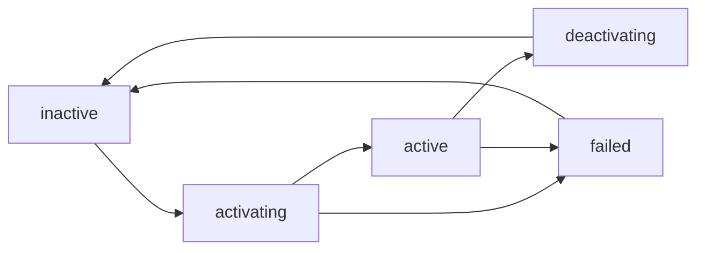

# Service Units in Depth (systemd.service)

## Overview

The `.service` unit is the type engineers spend most of their systemd career
in: it encapsulates how a daemon is started, when the manager may consider it
ready, what happens when it dies, how it is stopped, under which identity it
runs, and how tightly it is sandboxed. All of that lives in the `[Service]`
section of the unit file, layered on the universal `[Unit]` and `[Install]`
sections whose grammar and drop-in mechanics are covered in
[unit-files.md](./unit-files.md).

Conceptually, every service is a small state machine driven by three
protocols: a *readiness contract* (`Type=`), a *supervision policy*
(`Restart=` plus the start rate limit), and a *teardown protocol*
(`ExecStop=`, `KillMode=`, signal escalation). Most production incidents —
"the service is active but not serving", "it flapped into a start loop" —
trace back to a mismatch between what the daemon does and what those
directives promise the manager. The page ends with a full worked example
(`Type=notify` daemon, watchdog, hardening drop-in); the cgroup and
resource-control angle lives in
[cgroups-resource-control.md](./cgroups-resource-control.md).

## The Activation Lifecycle

Each service moves through five top-level states — `inactive`, `activating`,
`active`, `deactivating`, `failed` — refined by sub-states such as
`start-pre`, `start-post`, `running`, `exited` and `auto-restart`, all
visible with `systemctl show -p ActiveState,SubState foo.service`.



Two properties are worth memorizing. `failed` is a state a human or a policy
must clear: `systemctl reset-failed` returns the unit to `inactive` and also
resets the start-rate-limit counter described below. And `active` does not
mean "the process is healthy" — it means the readiness contract of `Type=`
is satisfied; a wedged event loop is still `active` unless the daemon
participates in the watchdog protocol.

## Type= — When Is a Service Considered Started?

`Type=` defines the moment the manager flips the unit from `activating` to
`active`, which is what `After=` ordering and dependents wait for. If unset
it defaults to `simple` (changed to `exec` in v246); if `BusName=` is set it
defaults to `dbus`.

| `Type=` | Unit is "started" when | Typical users | Notes |
|---|---|---|---|
| `simple` | the fork of `ExecStart=` returned | daemons with no readiness protocol | pre-v246 default; a missing binary is discovered *after* the unit is marked active |
| `exec` | the `execve()` of the binary succeeded | same as `simple` | default since v246; catches missing binaries and permission errors during activation |
| `forking` | the initial process forked and the parent exited | classic self-daemonizing daemons | pair with `PIDFile=`; otherwise the manager guesses the main PID |
| `oneshot` | the `ExecStart=` process exited successfully | setup scripts, boot jobs | `RemainAfterExit=` keeps it active; no start timeout by default |
| `dbus` | the daemon acquired the bus name given in `BusName=` | D-Bus services | `BusName=` is mandatory for this type |
| `notify` | the daemon sent `READY=1` via `sd_notify(3)` | modern daemons (sshd, systemd daemons) | richest protocol: `STATUS=`, `MAINPID=`, watchdog pings |
| `idle` | like `simple`, but execution deferred until pending jobs are dispatched | boot-console cosmetics | rarely needed today |

### simple vs exec and the v246 default change

With `simple` the unit is "started" the moment `fork()` returned — before
the manager knows whether the binary exists, so a typo in `ExecStart=` gave
"unit is active" followed instantly by "unit failed". `exec` closes that
gap: activation completes only after `execve()` succeeded, so interpreter
resolution, privilege drops and permissions are validated inside the
activation window, and `After=` dependents wait for a *working* process.
The cost is one extra manager handshake; unlike `notify`, `exec` requires
no cooperation from the daemon itself.

### forking and PIDFile=

`forking` encodes the classic daemonizing convention: the `ExecStart=`
process forks, the parent exits, and the manager treats the parent's exit
as readiness. It must then decide which process is the *main* process,
because `Restart=`, `KillSignal=` and `$MAINPID` all key off it. The
reliable way is `PIDFile=` pointing at the PID file the daemon writes;
without it the manager falls back to cgroup-scanning heuristics that pick
the wrong process when helpers are forked. Treat `forking` as an interop
mode — it is what the SysV compatibility layer assumes for `/etc/init.d`
scripts — and prefer `notify` for new daemons.

### oneshot and RemainAfterExit=

With `oneshot` the `ExecStart=` process is the whole job: the unit becomes
active when the process exits successfully, and `RemainAfterExit=yes` keeps
it in the `active (exited)` state afterward so dependents and targets stay
satisfied. Unlike other types, `oneshot` may list multiple `ExecStart=`
lines that run sequentially, and its `TimeoutStartSec=` defaults to
infinity because a one-shot job may legitimately run long. `Restart=always`
and `Restart=on-success` are rejected for it (the unit is "complete" the
instant it exits), while `Restart=on-failure` is the standard retry idiom;
periodic re-runs are a timer unit's job — see [timers.md](./timers.md).

### notify, dbus and idle

`notify` is readiness as a protocol: the manager passes a `NOTIFY_SOCKET`
environment variable, and when the daemon finishes initializing it calls
`sd_notify(0, "READY=1")` — only then does the unit become active. The
daemon can also stream `STATUS=…` (shown in `systemctl status`), hand
supervision to a new child with `MAINPID=<pid>`, and announce `STOPPING=1`;
`NotifyAccess=` controls which processes may talk on the socket (effective
default `main`, use `all` for workers). A service that never sends
`READY=1` is killed by `TimeoutStartSec=` — the classic "stuck in
activating" incident. `dbus` is readiness by observation: the unit becomes
active when the daemon acquires the well-known name declared with
`BusName=`, exactly the property bus clients depend on. `idle` behaves like
`simple` except execution is deferred until no other jobs are pending,
purely to keep boot-console output readable.

## The Exec* Family

### Command lines and prefixes

`Exec*=` values are not shell scripts: the manager splits the line into
argv with its own quoting rules, requires an absolute executable path, and
runs the command directly — pipes and globs need `/bin/sh -c '…'`.
Environment substitution applies: `$VAR` expands and splits on whitespace,
`${VAR}` expands as exactly one argument, `$$` yields a literal dollar
sign. Prefixes on the executable path change semantics:

| Prefix | Effect on this command |
|---|---|
| `-` | a non-zero exit code or failure signal is ignored and treated as success |
| `:` | environment variable expansion is not performed for this command |
| `+` | runs with full privileges: `User=`, `Group=`, `CapabilityBoundingSet=` and sandboxing are not applied to this line (but still apply to other `Exec*` lines) |
| `!` / `!!` | legacy privilege markers with subtle system-vs-user manager semantics; see systemd.service(5) |
| `@` | the token after the path is passed to the process as `argv[0]` |

The `@` prefix serves daemons that key behavior or logging off `argv[0]`:
`ExecStart=@/usr/libexec/mydaemon mydaemon --foreground` runs the binary at
`/usr/libexec/mydaemon` while the process presents itself as `mydaemon`.

### ExecStart, ExecStartPre and ExecStartPost

`ExecStart=` spawns the main process; there is exactly one per service, the
only exception being `Type=oneshot`, which may list several and runs them
in order. That process becomes the tracked `MainPID` — the target of
`Restart=` and `KillSignal=`, the source of `ExecMainStatus` in failure
reports — so a wrapper that `exec`s the real daemon beats one that spawns
it as a child. `ExecStartPre=` commands run sequentially before it; a
failure of any of them (unless the `-` prefix is used) aborts activation.

`ExecStartPost=` runs after the unit is considered started per its `Type=` —
for `Type=notify` that means after `READY=1`, making it the right place for
post-start health checks. A failing `ExecStartPost=` tears the freshly
started service down again, so treat both as part of the activation
transaction.

### ExecReload=

`ExecReload=` defines what `systemctl reload foo.service` does. Because the
manager cannot know how a particular daemon re-reads configuration, the
command is arbitrary — and therefore must name its target explicitly:

```ini
ExecReload=/bin/kill -HUP $MAINPID
```

`$MAINPID` is the main process PID injected by the manager; signaling by
name (`pkill -HUP metricsd`) instead is a bug that fires the day a second
instance or a templated unit (`metricsd@tenant1`) exists. Reload jobs of
one unit are serialized, so a reload command that blocks wedges every later
reload; and a unit with no `ExecReload=` makes `systemctl reload` fail
cleanly with "Job type reload is not applicable" rather than falling back
to a restart.

### ExecStop= and ExecStopPost=

`ExecStop=` is the graceful-shutdown command (again with `$MAINPID`
available); if unset, the manager just applies the kill protocol below to
the cgroup. The critical nuance: `ExecStop=` is *not* run if the service
never reached a started state — a unit whose `ExecStartPre=` failed goes
straight to `failed` with no stop command. `ExecStopPost=` by contrast runs
*always* — on clean stop, on crash, on timeout, even when startup failed —
which makes it the correct hook for unconditional cleanup (flushing
firewall rules, removing temp files). It receives `$SERVICE_RESULT` in the
environment (`success`, `timeout`, `exit-code`, `signal`, `core-dump`,
`watchdog`, `resources`), and both commands are subject to `TimeoutStopSec=`
before remaining processes are killed per `KillMode=`.

## Timeouts and the SIGTERM-to-SIGKILL Escalation

| Directive | Default | Meaning |
|---|---|---|
| `TimeoutStartSec=` | `DefaultTimeoutStartSec=90s` | activation (per `Type=`) must complete within this |
| `TimeoutStopSec=` | `DefaultTimeoutStopSec=90s` | graceful stop, including `ExecStop=`, must finish within this |
| `TimeoutAbortSec=` | falls back to `TimeoutStopSec=` | grace period after the watchdog fires `SIGABRT` |
| `TimeoutSec=` | — | shorthand setting both start and stop timeouts |
| `RuntimeMaxSec=` | `infinity` | hard cap on total runtime; expiry stops the service and marks it failed |

The escalation ladder on expiry is fixed: the manager sends `KillSignal=`
(`SIGTERM` by default) to the main process (and, per `KillMode=`, the rest
of the cgroup), waits the remaining grace time, then escalates to
`FinalKillSignal=` (`SIGKILL` by default) unless `SendSIGKILL=no`. The
watchdog path inserts one step — `SIGABRT` first — so a daemon with a
core-dump handler can leave evidence of *why* it hung. Any timeout marks
the unit failed (and restarted if `Restart=` covers timeouts, i.e. anything
but `no`/`on-success`), which is why a 90 s start timeout plus a daemon
with a 120 s cold-start cache rebuild produces the classic "works manually,
fails at boot" mystery.

## Restart= and the Start Rate Limit

`Restart=` only covers unplanned exits and failures: an explicit
`systemctl stop` never triggers a restart regardless of the value.

| `Restart=` | The service is restarted when it… |
|---|---|
| `no` (default) | never |
| `on-success` | exits cleanly only: status 0, or killed by `SIGHUP`/`SIGINT`/`SIGTERM`/`SIGPIPE` |
| `on-failure` | exits non-zero, dies by any other signal, times out, or misses the watchdog |
| `on-abnormal` | dies by a non-"clean" signal, times out, or misses the watchdog (not on plain non-zero exit) |
| `on-watchdog` | misses the watchdog deadline only |
| `on-abort` | dies by a signal that produces a core dump only |
| `always` | exits or is killed for any reason — even cleanly |

Restarts are delayed by `RestartSec=` (default 100 ms); since v249
`RestartSteps=` and `RestartMaxDelaySec=` add exponential backoff. Without
backoff an instantly-dying daemon would spin, which is where the rate limit
enters: `StartLimitIntervalSec=` (default 10 s) and `StartLimitBurst=`
(default 5) live in the **`[Unit]`** section — they moved out of
`[Service]` in v230 and the old placement is deprecated. When the burst is
exhausted the unit enters `failed` and stays there; the journal shows
`Start request repeated too quickly`. The counter clears on a successful
start, when the interval elapses without activations, or via
`systemctl reset-failed <unit>` — which also clears the failed state for a
manual retry. `StartLimitAction=` (default `none`) can instead trigger
`reboot`/`reboot-force` for early-boot units whose failure leaves the box
useless.

## Stopping Services: KillMode, KillSignal, FinalKillSignal

| `KillMode=` | Who receives the kill signals |
|---|---|
| `control-group` (default) | every remaining process of the unit's cgroup |
| `process` | the main process only — children and helpers are left running |
| `mixed` | `SIGTERM` to the main process only; on timeout `SIGKILL` to all remaining |
| `none` | nobody (deprecated; only sensible for pure supervisors) |

`KillSignal=` (default `SIGTERM`) is the signal sent to the main process;
`SendSIGHUP=` can add a final `SIGHUP` before the `SIGKILL` step. The leak
problem with `KillMode=process` is structural: forked children keep ports
bound and files open, are no longer part of the stop path, and collide with
the next start. It is justified only when the main process supervises its
children with stronger semantics than `SIGTERM`-everyone; everything else
should keep `control-group`, which is what makes "stop" mean "no process of
this unit survives" — the property PID-file-based inits never had.

## Identity, Directories and Environment

### User=, Group=, DynamicUser=

Without `User=` a system service runs as root — the default, and the reason
hardening starts with an identity. `DynamicUser=yes` goes further: the
manager allocates a transient UID from the range 61184–65519 for the
lifetime of the service and releases it at stop, so the UID cannot be found
in `/etc/passwd` while the service is not running. Combined with the
directory settings below, it gives per-service identities with persistent
data without ever running `useradd` — data directories are bind-mounted
from a private area so they survive UID recycling.

### StateDirectory=, RuntimeDirectory=, CacheDirectory=, LogsDirectory=

| Directive | Creates (owned by the service user) under |
|---|---|
| `StateDirectory=` | `/var/lib` |
| `RuntimeDirectory=` | `/run` |
| `CacheDirectory=` | `/var/cache` |
| `LogsDirectory=` | `/var/log` |

Multiple directories are space-separated, nesting uses slashes, and an
optional mode suffix after a colon overrides permissions:
`StateDirectory=metricsd:0750`. The directories are created before start,
removed with the unit, and their contents can be wiped on demand with
`systemctl clean metricsd.service`. Declaring them is also a hardening
statement — the sandbox below leans on them once the filesystem is made
read-only.

### Environment=, EnvironmentFile=, WorkingDirectory=, UMask=, Nice=

`Environment="KEY=value with spaces"` sets one variable per line;
`EnvironmentFile=/etc/default/foo` reads a plain `key=value` file (no shell
expansion), with a `-` prefix tolerating a missing file. Variables from
both feed the `${VAR}`/`$VAR` expansion in `Exec*=` lines.
`WorkingDirectory=` defaults to `/` — always set it, since daemons that
write to their cwd silently pollute the root — and accepts a `-` prefix to
ignore a missing directory. `UMask=` (default `0022`), `Nice=` and the
`Limit…=` family (`LimitNOFILE=` being the one everyone meets eventually)
round out the per-process environment.

## The Watchdog Protocol: WatchdogSec=

`WatchdogSec=30s` places `WATCHDOG_USEC=30000000` in the service
environment and obliges the daemon to send keep-alive pings. A healthy
daemon replies `WATCHDOG=1` at least every half deadline; if the pings stop,
the manager concludes the process is hung (alive in `ps`, event loop stuck —
exactly the failure exit codes cannot catch) and kills it with `SIGABRT`,
then follows `Restart=` (`on-watchdog` matches only this case; `on-abnormal`
and `on-failure` include it). The daemon side is a few lines of
`libsystemd`:

```c
#include <systemd/sd-daemon.h>
#include <unistd.h>

int main(int argc, char **argv) {
    uint64_t interval = 0;
    if (sd_watchdog_enabled(0, &interval) > 0)
        interval /= 2;               /* ping at half the deadline */

    sd_notify(0, "READY=1");         /* Type=notify readiness */
    for (;;) {
        serve_one_request();         /* real work in the event loop */
        if (interval > 0) {
            sd_notify(0, "WATCHDOG=1");
            usleep((useconds_t) interval);
        }
    }
}
```

In production the ping belongs inside the event loop (between epoll
iterations), not a dedicated sleep thread — the watchdog is only meaningful
if it stops when the loop stops. `WatchdogSec=0` disables it again, and
`Type=notify` is effectively a prerequisite since the same channel carries
readiness and pings.

## Failure Hooks: OnFailure=, OnSuccess=, FailureAction=

`OnFailure=` starts the listed units when this unit enters the failed
state, and `OnSuccess=` (v248) mirrors it on clean completion. The listed
units are almost always template instances so they know the subject:

```ini
[Unit]
OnFailure=alert-mail@%n.service
```

Here `%n` expands to the full unit name (`metricsd.service`), the template
`alert-mail@.service` receives it as `%i`, and the dependency is
`Wants=`-style, so a failing alert unit never propagates back. When the
reaction should be a machine action rather than a unit activation,
`FailureAction=` and `SuccessAction=` take values like `reboot`,
`reboot-force`, `reboot-immediate`, `poweroff`, `halt` or `exit` (meaningful
for user managers and containers) — the knob for units whose failure leaves
the box unsafe.

## Sandboxing Cheat Sheet

The `[Service]` section doubles as a sandbox declaration: every directive
below is a namespace, seccomp or capability knob applied before `execve()`.
The kernel mechanism underneath `SystemCallFilter=` is seccomp-BPF — see
[seccomp.md](../../../os/security-internals/seccomp.md) — and the
authoritative directive list is systemd.exec(5).

| Directive | Effect | Practical note |
|---|---|---|
| `NoNewPrivileges=` | `setuid`/`setcap` elevation impossible inside the service | default `yes` since v252; breaks helpers relying on setuid binaries |
| `ProtectSystem=strict` | entire filesystem read-only except API filesystems | pair with `ReadWritePaths=` for the writable spots |
| `ProtectHome=` | `yes`/`read-only`/`tmpfs` for `/home`, `/root`, `/run/user` | `tmpfs` gives an empty home |
| `PrivateTmp=` | private `/tmp` and `/var/tmp` per service | breaks tools sharing temp files across services |
| `PrivateDevices=` | only pseudo-devices, no real hardware | |
| `ProtectKernelTunables=` | `/proc/sys`, `/sys` read-only | stops services "fixing" sysctls |
| `RestrictAddressFamilies=` | whitelist socket families, e.g. `AF_UNIX AF_INET AF_INET6` | unlisted families blocked at `socket()` |
| `CapabilityBoundingSet=` | limit capabilities; empty drops all | the biggest win for network daemons |
| `MemoryDenyWriteExecute=` | forbids W+X mappings | breaks JIT runtimes — test first |
| `SystemCallFilter=@system-service` | seccomp allowlist of a curated syscall group | `@system-service` is the sane default set |
| `IPAddressDeny=any` | block all network I/O (pair with `IPAddressAllow=`) | declarative per-unit firewalling |

Harden incrementally and measure: `systemd-analyze security foo.service`
scores exposure from 0 to 10 and names every knob still open (workflow in
[systemctl-cli.md](./systemctl-cli.md)). Do not copy a maximal block onto a
service that links against NSS or executes setuid helpers —
`NoNewPrivileges=` and `SystemCallFilter=` have the highest "mysterious
breakage" rate in the field.

## A Complete Worked Example

A realistic unit: a `Type=notify` collector daemon with a software watchdog
and the start rate limit declared where it belongs — in `[Unit]`:

```ini
# /etc/systemd/system/metricsd.service
[Unit]
Description=Metrics collector daemon
Wants=network-online.target
After=network-online.target
# start-rate limiting has lived in [Unit] since v230:
StartLimitIntervalSec=60s
StartLimitBurst=5

[Service]
Type=notify
User=metricsd
EnvironmentFile=/etc/default/metricsd
ExecStart=/usr/bin/metricsd --listen ${LISTEN_ADDR} --interval ${INTERVAL}
ExecReload=/bin/kill -HUP $MAINPID
WatchdogSec=30s
Restart=on-failure
RestartSec=5s
StateDirectory=metricsd:0750

[Install]
WantedBy=multi-user.target
```

The environment file `/etc/default/metricsd` is plain `key=value` —
`LISTEN_ADDR=0.0.0.0:9100` and `INTERVAL=15s` — and the hardening is a
drop-in so the vendor unit stays untouched:

```ini
# /etc/systemd/system/metricsd.service.d/10-hardening.conf
# (created with: systemctl edit metricsd.service)
[Service]
NoNewPrivileges=yes
ProtectSystem=strict
ProtectHome=yes
PrivateTmp=yes
PrivateDevices=yes
ProtectKernelTunables=yes
RestrictAddressFamilies=AF_UNIX AF_INET AF_INET6
CapabilityBoundingSet=
SystemCallFilter=@system-service
ReadWritePaths=/var/lib/metricsd
```

Walking through an activation: the manager reads the fragment plus the
drop-in, creates `/var/lib/metricsd` owned by `metricsd`, applies the
sandbox, and runs `metricsd` with both variables expanded (note
`${LISTEN_ADDR}` stays one argument even though the value contains a
colon). The daemon binds its socket, loads state, calls
`sd_notify(0, "READY=1")` — only now is the unit `active` and `After=`
-ordered dependents proceed. It must then ping `WATCHDOG=1` at least every
15 s or the manager `SIGABRT`s it; `Restart=on-failure` brings it back
after 5 s; more than 5 failed starts within 60 s trip the rate limit until
a human runs `systemctl reset-failed`. Validate with `systemd-analyze
verify metricsd.service` and inspect the merged view with `systemctl cat
metricsd.service`.

## Interview Questions

### Q: Why is Type=notify preferred over Type=forking for modern daemons?

`forking` makes the manager infer readiness from an indirect event (the
parent exiting) and then guess or read the main PID from a file — both
steps can be wrong, and once they are, `Restart=` kills the wrong process.
`notify` replaces inference with a protocol: the daemon says exactly when
it is ready (`READY=1`), can stream progress, reassign the main PID, and
feed the watchdog. The only cost is linking against `libsystemd`; the
payoff is supervision that reflects reality instead of convention.

### Q: Why must ExecReload use $MAINPID, and what goes wrong without it?

`ExecReload=` is an arbitrary command; the manager only injects the main
PID of *this* unit as `$MAINPID`. Without it you signal by name — `pkill
-HUP metricsd` — which hits every matching process, including a second
instance or a templated unit copy. `$MAINPID` scopes the signal to the
supervised process, keeping reload semantics correct under templates like
`metricsd@tenant1` and `metricsd@tenant2`.

### Q: A service crashed five times in ten seconds and now stays failed. What happened and what do you do?

That is the start rate limit: `StartLimitIntervalSec=10s` with
`StartLimitBurst=5` (both defaults), declared in `[Unit]`; the manager
refuses further activations with `Start request repeated too quickly`. Fix
the config, then `systemctl reset-failed foo.service` to clear the failed
state and reset the counter, then start it again. If the unit legitimately
needs a higher retry budget, raise the limits in a drop-in rather than
disabling supervision — and remember the change needs `daemon-reload`.

### Q: What is the difference between ExecStop= and ExecStopPost=?

`ExecStop=` is the graceful shutdown command and only runs if the service
actually started — a unit that failed in `ExecStartPre=` never reaches it.
`ExecStopPost=` runs unconditionally after the service's processes are
gone, whether the stop was clean, the service crashed, or startup failed,
and receives `$SERVICE_RESULT` describing why. Teardown that pairs with
successful startup goes in `ExecStop=`; cleanup that must happen no matter
what goes in `ExecStopPost=`.

### Q: Why is KillMode=process considered dangerous, and when is it justified?

`KillMode=process` signals only the main process; every forked child keeps
running in the cgroup with ports bound and files open, is no longer part of
the stop path, and collides with the next start — the classic "service
won't die" incident. It is justified only when the main process supervises
its children with stronger guarantees than `SIGTERM`-everyone; even then
`KillMode=mixed` (terminate main, `SIGKILL` leftovers after the grace
period) is usually the safer middle ground, which is why `control-group` is
the default.

## References

- [systemd.service(5) — the authoritative directive reference for this page](https://www.freedesktop.org/software/systemd/man/latest/systemd.service.html)
- [systemd.exec(5) — execution environment and sandboxing directives](https://www.freedesktop.org/software/systemd/man/latest/systemd.exec.html)
- [systemd.kill(5) — KillMode, KillSignal, FinalKillSignal and friends](https://www.freedesktop.org/software/systemd/man/latest/systemd.kill.html)
- [sd_notify(3) — the readiness/STATUS/watchdog protocol](https://www.freedesktop.org/software/systemd/man/latest/sd_notify.html)
- [daemon(7) — upstream's daemon-writing conventions](https://www.freedesktop.org/software/systemd/man/latest/daemon.html)
- [systemd.service(5) — Debian bookworm mirror](https://manpages.debian.org/bookworm/systemd/systemd.service.5.en.html)
- [systemd.exec(5) — Debian bookworm mirror](https://manpages.debian.org/bookworm/systemd/systemd.exec.5.en.html)
- [systemd.kill(5) — Debian bookworm mirror](https://manpages.debian.org/bookworm/systemd/systemd.kill.5.en.html)
- [sd_notify(3) — Debian bookworm mirror (libsystemd-dev)](https://manpages.debian.org/bookworm/libsystemd-dev/sd_notify.3.en.html)
- [daemon(7) — Debian bookworm mirror](https://manpages.debian.org/bookworm/systemd/daemon.7.en.html)

## Cross-References

- [Unit files — syntax, loading, drop-ins, templating](./unit-files.md) — where fragments and drop-ins live and how the manager finds them.
- [Socket activation](./socket-activation.md) — services that gain readiness and parallelism from `.socket` units.
- [systemctl command reference](./systemctl-cli.md) — the operational verbs for everything described here.
- [cgroups and resource control](./cgroups-resource-control.md) — where service processes live and how `CPUQuota=`/`MemoryMax=` bound them.
- [runit stages and services](../runit/stages-services.md) — the supervision-only alternative that omits readiness protocols.
- [Daemons (os/processes)](../../../os/processes/daemons.md) — the generic Unix daemon model this unit type supervises.
- [init-systems hub](../README.md) — section overview and reading order.
