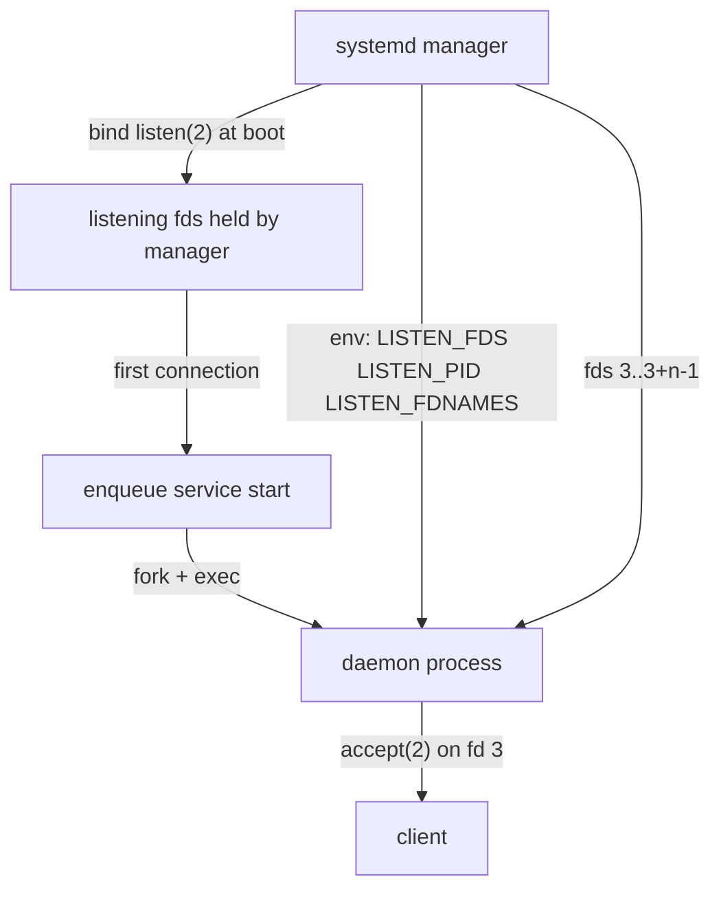

# Socket Activation (systemd.socket)

## Overview

Socket activation is the mechanism by which systemd binds listening sockets
*two jobs before* the daemon that serves them even starts: the manager
creates the sockets described by a `.socket` unit, keeps them open, and hands
the file descriptors to the matching `.service` unit the moment traffic
arrives. The daemon never calls `bind(2)` or `listen(2)` — it inherits
already-listening descriptors and calls `accept(2)` directly.

This inversion buys four properties that classic self-binding daemons cannot
offer. First, **parallel boot**: every service that is only reachable through
a socket can be started simultaneously, because the ordering dependency
"port bound" is already satisfied by the manager. Second, **on-demand
start**: a service can stay inactive until the first connection arrives and
be shut down again when idle. Third, **privilege separation**: the manager
runs as root, binds the privileged port, and the daemon runs unprivileged
with the descriptor passed in — no `setcap`, no `CAP_NET_BIND_SERVICE`.
Fourth, **zero-downtime restarts**: the socket stays bound across
service restarts, so clients see at most a connection refusal on the
backlog, never "connection refused: nobody is listening".

The idea is old — BSD `inetd` did exactly this in the 1980s — and systemd
credits it explicitly (see Lennart Poettering's blog post in the
references). The differences are that systemd binds the sockets during early
boot rather than per-connection, passes an *unlimited* number of descriptors
with a documented environment-variable protocol instead of fds 0/1/2, and
keeps the sockets bound for the lifetime of the socket unit rather than
re-binding for each request. A related and often confused term is *socket
*activation for shutdown*: because the manager holds the socket, it can
serially hand it to a replacement process (used by the D-Bus daemon and by
`systemd-socket-proxyd`), letting an old and a new daemon take over without a
visible gap.

## Why Socket Activation Exists

### Parallel boot

In a SysVinit-style boot, `sshd` cannot start before the network is up
because it must bind port 22; every network daemon therefore serializes
behind `network.target`. With socket activation the *socket unit* is the
thing that wants the network, and the daemon behind it has no ordering
constraint at all: systemd binds the sockets as soon as the socket unit is
started, then starts the service concurrently with everything else. The
service's `ExecStart=` runs with its listening descriptors already prepared,
so the "wait for network" dependency collapses from a startup-order problem
into a property of one socket unit. This is the historical reason systemd
made boot feel parallel on 2011-era hardware: the number of strictly ordered
steps shrank to a handful.

### On-demand (lazy) start

A `.socket` unit in `WantedBy=sockets.target` holds the port for the entire
machine lifetime, while the paired `.service` unit need not be running at
all. The first SYN on the TCP socket, first datagram, or first `connect(2)`
on the AF_UNIX socket triggers the service. This replaces the `inetd`
"nowait" pattern and is how `systemd-socket-activate`-style services such as
`cups.socket` can sit dormant on a print server until a job arrives. The
service can also be *stopped* again afterwards (see the idle pattern below),
returning the machine to a state where the daemon costs zero memory but the
port is still open.

### Privilege separation

The manager binds port 80 or 443 as root, then launches the web server as
`www-data` with the descriptor already bound. The daemon never needs
`CAP_NET_BIND_SERVICE`, never touches a privileged port, and can be
sandboxed more aggressively (`CapabilityBoundingSet=`, `PrivateUsers=`, and
friends from `systemd.exec(5)`). For AF_UNIX sockets the same trick controls
filesystem ownership: `SocketUser=`/`SocketGroup=` set the owner of the node
and `SocketMode=` its permissions, so an unprivileged daemon can serve a
socket under `/run` that only group `wheel` may connect to.

### Zero-downtime restarts and connection hand-off

`systemctl restart nginx.service` with self-bound sockets requires the
daemon to unbind, re-bind, and re-listen — a window where the port is
closed, or a failure if a stale process still holds it ("Address already in
use"). With socket activation the socket unit keeps the descriptors bound;
restarting the service only re-executes the daemon against the *same*
listening fds. The same mechanism enables hand-off between processes: the
new instance is started while the old one still runs, both hold the socket,
and the manager can stop the old one afterwards. D-Bus has used this since
the earliest systemd versions, and `systemd-socket-proxyd(8)` generalizes it
to arbitrary daemons.

## The .socket Unit: Anatomy and Directives

A `.socket` unit lives in the same directories as any unit
(`/etc/systemd/system`, `/run/systemd/system`, `/usr/lib/systemd/system`;
see [unit-files](./unit-files.md)) and carries a `[Socket]` section. The
paired service defaults to the same basename with a `.service` suffix and is
activated automatically; nothing needs to `Wants=` the service itself.

```ini
# /etc/systemd/system/echo.socket
[Unit]
Description=Echo service socket

[Socket]
ListenStream=9999
Accept=no
TriggerLimitIntervalSec=10s
TriggerLimitBurst=100

[Install]
WantedBy=sockets.target
```

### Address forms accepted by the Listen* directives

Per `systemd.socket(5)`, `ListenStream=`/`ListenDatagram=`/
`ListenSequentialPacket=` accept these address forms:

| Form | Meaning |
|---|---|
| `/run/foo.sock` | AF_UNIX filesystem socket |
| `@name` | AF_UNIX abstract-namespace socket |
| `9999` | TCP port 9999 on IPv6 (dual-stack subject to `BindIPv6Only=`) |
| `192.0.2.1:8080` | IPv4 address + port |
| `[2001:db8::1]:8080` | IPv6 address + port |
| `[2001:db8::1]:8080%eth0` | IPv6 with link-local interface scope |
| `vsock:cid:port` | AF_VSOCK (host/guest communication) |

`ListenSequentialPacket=` (`SOCK_SEQPACKET`) is only available for AF_UNIX
sockets. `SOCK_STREAM` maps to TCP for IP sockets. The full family of listen
directives:

| Directive | What it creates |
|---|---|
| `ListenStream=` | `SOCK_STREAM` (TCP / AF_UNIX stream) |
| `ListenDatagram=` | `SOCK_DGRAM` (UDP / AF_UNIX datagram) |
| `ListenSequentialPacket=` | `SOCK_SEQPACKET`, AF_UNIX only |
| `ListenFIFO=` | Named pipe (FIFO node) |
| `ListenSpecial=` | Character device node such as `/dev/null`, `/dev/kmsg` |
| `ListenNetlink=` | Netlink family/group, e.g. `route:10:11` |
| `ListenMessageQueue=` | POSIX message queue |
| `ListenUSBFunction=` | USB gadget function (functionfs) |

Multiple `Listen*=` lines in one unit are allowed; the descriptors are
passed to the service in exactly the order the directives appear.

### The rest of the [Socket] section

| Directive | Default | Notes |
|---|---|---|
| `Backlog=` | 4294967295, silently capped by `net.core.somaxconn` (typically 4096) | `listen(2)` backlog argument |
| `BindIPv6Only=` | `default` (kernel sysctl `net.ipv6.bindv6only`, usually "both") | `both` or `ipv6-only` force the `IPV6_V6ONLY` state |
| `Accept=` | `no` | `yes` spawns a service instance per connection (see below); ignored for datagram/FIFO |
| `Service=` | same basename `.service` | override target unit; only valid with `Accept=no` |
| `SocketUser=` / `SocketGroup=` | root | owner of AF_UNIX nodes, FIFOs, mqueues |
| `SocketMode=` | `0666` | filesystem mode of AF_UNIX/FIFO nodes |
| `DirectoryMode=` | `0755` | mode for parent directories created on demand |
| `TriggerLimitIntervalSec=` / `TriggerLimitBurst=` | 2s / 200 (`Accept=yes`) or 20 | rate limit on activations; hitting it puts the *socket* into failure |
| `RemoveOnStop=` | off | remove socket nodes and symlinks when the unit stops |
| `Symlinks=` | empty | create alias symlinks to the AF_UNIX path, lifecycle-bound |
| `FreeBind=` | off | `IP_FREEBIND`: bind to not-yet-configured addresses (useful with VIPs) |
| `ReusePort=` | off | `SO_REUSEPORT`, several sockets may bind the same TCP/UDP port |
| `Transparent=` | off | `IP_TRANSPARENT` for transparent proxies |
| `PassCredentials=` / `PassSecurity=` | off | SCM_CREDENTIALS / security context on AF_UNIX datagrams |

Two rates are easy to confuse: the *trigger limit* is enforced per socket
unit and puts it into a failure state when exceeded (restart the socket to
recover), while the newer *poll limit* (`PollLimitIntervalSec=` /
`PollLimitBurst=`) only temporarily stops polling a flooded descriptor and
is the recommended DoS mitigation. Under `Accept=yes` the per-connection
instances inherit these limits via the socket's activation logic — one more
reason the default `Accept=no` is recommended for anything with throughput
requirements.

## The File Descriptor Passing Protocol



The protocol is deliberately simple and does not require any systemd library
on the daemon side. The manager sets three environment variables in the
activated process:

- `LISTEN_FDS` — number of descriptors passed, all already bound and
  listening (or otherwise prepared per the `Listen*=` directives).
- `LISTEN_PID` — PID the descriptors belong to. A daemon *must* verify
  `LISTEN_PID == getpid()` before trusting `LISTEN_FDS`; otherwise a
  malicious parent could pre-set the variables and make the daemon reuse
  foreign sockets. The check is what `sd_listen_fds(3)` performs with
  `unset_environment=1`.
- `LISTEN_FDNAMES` — optional comma-separated names identifying each
  descriptor (from `FileDescriptorName=` or the listen directive used);
  consumed by `sd_listen_fds_with_names(3)`.

The descriptors themselves start at file descriptor 3 and continue
consecutively, in the order the `Listen*=` directives appear in the unit.
The constant is exported as `SD_LISTEN_FDS_START` (`#define
SD_LISTEN_FDS_START 3`). fd 0/1/2 remain the service's stdio (connected to
the journal). The descriptors arrive *without* the close-on-exec flag — they
had to survive the manager's `execve()` — so a daemon that forks helper
children should set `FD_CLOEXEC` itself to avoid leaking listening sockets
into unrelated processes. Callers that use `sd_listen_fds(3)` typically pass
`1` so the three environment variables are unset after the read, preventing
accidental re-consumption by child processes or re-exec'd code.

## Writing a Socket-Activated Service

### C, using libsystemd

```c
/* echod.c — cc $(pkg-config --cflags --libs libsystemd) echod.c -o echod */
#include <errno.h>
#include <stdio.h>
#include <stdlib.h>
#include <string.h>
#include <sys/socket.h>
#include <unistd.h>
#include <systemd/sd-daemon.h>

int main(void) {
    /* 1 == verify LISTEN_PID and unset the env vars afterwards */
    int n = sd_listen_fds(1);
    if (n < 0) {
        fprintf(stderr, "sd_listen_fds: %s\n", strerror(-n));
        return EXIT_FAILURE;
    }
    if (n < 1) {
        fprintf(stderr, "not socket-activated: no fds passed\n");
        return EXIT_FAILURE;
    }

    int lfd = SD_LISTEN_FDS_START;              /* fd 3: first ListenStream= */
    for (;;) {
        int c = accept4(lfd, NULL, NULL, 0);
        if (c < 0) {
            if (errno == EINTR) continue;
            perror("accept4");
            return EXIT_FAILURE;
        }
        char buf[256];
        ssize_t k;
        while ((k = read(c, buf, sizeof buf)) > 0)
            write(c, buf, k);                   /* echo */
        close(c);
    }
}
```

The paired unit files are minimal — the service needs no `Listen*=` knowledge
and no `[Install]` section, because the socket pulls it in on demand:

```ini
# /etc/systemd/system/echod.socket
[Socket]
ListenStream=9999

[Install]
WantedBy=sockets.target
```

```ini
# /etc/systemd/system/echod.service
[Service]
ExecStart=/usr/local/bin/echod
User=nobody
```

After `systemctl daemon-reload && systemctl enable --now echod.socket`, the
daemon starts on the first TCP connection to port 9999.

### Python, without libsystemd

Because the protocol is environment variables plus consecutive fds starting
at 3, any language can consume it. CPython's `socket.socket(fileno=)`
constructor adopts an existing descriptor and (on Linux) auto-detects the
address family and type:

```python
#!/usr/bin/env python3
import os
import socket

n_fds = int(os.environ.get("LISTEN_FDS", "0"))
pid = os.environ.get("LISTEN_PID")
if n_fds < 1 or pid != str(os.getpid()):
    raise SystemExit("not socket-activated (no/invalid LISTEN_FDS)")

srv = socket.socket(fileno=3)          # first Listen* descriptor
srv.listen()                           # already listening; harmless no-op

while True:
    conn, addr = srv.accept()
    conn.sendall(b"hello from fd 3\n")
    conn.close()
```

A subtle point in the Python snippet: the `LISTEN_PID` comparison is not
optional pedantry. If the process later forks, children inherit the
variables and could misinterpret them as *their* descriptors; production
code should `del os.environ["LISTEN_FDS"]` (and friends) after adoption,
which is exactly what `sd_listen_fds(3)`'s `unset_environment` argument
does in C.
The manager always passes the variables to the service it activates — system
services get them automatically with no `PassEnvironment=` needed
(`PassEnvironment=` only matters in the *user* manager, to forward manager
variables into user services).

### Testing outside the manager: systemd-socket-activate

`systemd-socket-activate(1)` binds sockets on behalf of a daemon run from an
interactive shell, so the identical code path can be exercised before
writing unit files:

```bash
systemd-socket-activate -l 8080 ./echod          # one stream socket
systemd-socket-activate -l 9999 -a ./perconnd    # -a: per-connection mode
```

The tool sets the same `LISTEN_FDS`/`LISTEN_PID` variables, so a daemon that
works here works under systemd and vice versa. In an inetd-compatible mode
(`--inetd`) it additionally maps the first descriptor to stdin, which is
handy for legacy inetd daemons.

## Per-Connection Instances (Accept=yes)

`Accept=yes` turns the socket unit into an inetd work-alike: for every
accepted connection systemd spawns one service instance named
`<base>@<peer-address>.service`, and the instance receives *only the
connection socket* (as fd 3), not the listening descriptor. The instance
name's `%i` specifier expands to the connection address, which services can
log or use for templated behavior. When the instance's process exits, the
connection closes — the service lifetime *is* the connection lifetime.

```ini
# /etc/systemd/system/echod@.socket  (listens; templates the instances)
[Socket]
ListenStream=9999
Accept=yes

[Install]
WantedBy=sockets.target
```

```ini
# /etc/systemd/system/echod@.service
[Service]
ExecStart=/usr/local/bin/echod-conn
StandardInput=socket
StandardOutput=socket
```

With `StandardInput=socket`/`StandardOutput=socket` even the fd-3 convention
disappears: the connection lands on stdin/stdout, and a shell script becomes
a valid per-connection daemon (`cat` echoes). Classic inetd daemons port
this way without code changes.

The costs are real, and `systemd.socket(5)` recommends `Accept=no` for new
daemons: one process and one fork per connection (fine for sshd's
connection rate, wrong for a web server), no shared state between
connections, and the trigger limit becomes a live operational concern
(default 200 activations per 2s — a connection flood can fail the socket
unit). Note also that `Accept=yes` requires the instance template
(`echod@.service`) to exist; a missing template is the most common reason an
`Accept=yes` socket fails with "Unit echod@1.2.3.4:54321.service not found".
Per-connection instances that finish when the connection ends need no idle
timeout — they are their own idle timeout.

## Bridging Legacy Daemons: systemd-socket-proxyd

Most classic daemons — nginx and the majority of self-binding servers — do
not implement `LISTEN_FDS` and will bind their own sockets, fighting the
socket unit for the port. `systemd-socket-proxyd(8)` bridges the gap: it is
a small socket-activated proxy that accepts on the *systemd-held* socket and
forwards each connection to a regular TCP (or AF_UNIX) backend. The port
stays bound across backend restarts and on-demand start still works; only
the proxy's accept-and-splice cost is added.

```ini
# /etc/systemd/system/proxy.socket
[Socket]
ListenStream=80

[Install]
WantedBy=sockets.target
```

```ini
# /etc/systemd/system/proxy-to-nginx.service
[Unit]
After=nginx.service

[Service]
ExecStart=/usr/lib/systemd/systemd-socket-proxyd 127.0.0.1:8080
PrivateNetwork=yes
PrivateTmp=yes
```

Enable `proxy.socket` only; nginx itself keeps binding 8080. This is also
the canonical way to give a containerized or unprivileged backend a
privileged port. For daemons with native support there is no need: sshd
ships a `ssh.socket` in several distributions, `cups.socket` and
`rpcbind.socket` are standard, and dbus-daemon has supported fd passing
since the beginning. When in doubt, check the package for a `.socket` unit —
its presence is the contract, independent of upstream documentation.

## On-Demand and Idle Services

The fully lazy pattern has three ingredients: the socket is enabled at boot,
the service has *no* `[Install]` section (so nothing starts it eagerly and
`systemctl enable` cannot be pointed at it), and the service exits by
itself or is stopped when idle:

```ini
# /etc/systemd/system/spool-processor.socket
[Socket]
ListenFIFO=/run/spool/queue.fifo

[Install]
WantedBy=sockets.target
```

```ini
# /etc/systemd/system/spool-processor.service
[Unit]
# no [Install]: activated only by the socket

[Service]
Type=oneshot
ExecStart=/usr/local/bin/drain-spool
```

A FIFO (or datagram) socket activates the service on the first writer;
`drain-spool` reads until EOF and exits, returning to the zero-cost state
until the next trigger. For long-running stream services the analogous
pattern is `Accept=yes` (each connection is an instance that dies with its
connection), or a daemon that exits after its own idle timer while the
socket unit keeps the port. Avoid the tempting `StopWhenUnneeded=` route for
this: "unneeded" means no other unit *Requires/Wants* it, and an active
socket-activated service is exactly that, so the directive rarely does what
idle-exit logic needs. `RuntimeMaxSec=` plus `Restart=always` is a crude but
workable substitute when the daemon cannot be taught to exit.

## Debugging Socket Activation

Order of operations when a socket-activated service misbehaves:

```bash
systemctl list-sockets                      # LISTEN, UNIT, ACTIVATES columns
ss -lntp | head                             # fd owners as the kernel sees them
systemctl status echo.socket echo.service   # trigger state + last activation
journalctl -u echo.socket -u echo.service   # "Socket unit ... succeeded"
```

`systemctl list-sockets` is the ground truth for what the manager holds: it
lists each listening address, the owning socket unit, and the service that
will be activated. `journalctl` shows the handshake — a successful trigger
logs the socket unit succeeding and the service starting; a trigger limit
hit logs the socket entering failure. Frequent failure modes, roughly in
order of occurrence:

- **Daemon closes the passed fds.** A daemonizing `fork()` + `close(0..2)`
  + `daemon(3)` relic that closes "everything" discards fd 3 and then sits
  on a self-bound port. Remove the daemonization: systemd services must not
  fork in the `Type=`-invalid way; use `Type=simple`/`exec` and stay in the
  foreground.
- **Daemon ignores `LISTEN_FDS` and binds its own address**, getting
  `EADDRINUSE` because the socket unit holds the port. Either implement the
  protocol (C: `sd_listen_fds`, Python: `fileno=3`) or drop socket
  activation for that daemon.
- **`sd_listen_fds()` returns 0.** Usually the environment check failed
  (`LISTEN_PID` belongs to a different process, e.g. the daemon forked
  before checking), or the service was started by hand rather than by the
  socket.
- **FDs leak into forked children.** Descriptors arrive without
  close-on-exec; a daemon spawning workers without `FD_CLOEXEC` hands the
  listening socket to every helper. Set `FD_CLOEXEC` explicitly after
  adoption.
- **`Accept=yes` without the `@.service` template**, or `Service=` pointing
  at a nonexistent unit: activation fails at enqueue time, visible in
  `systemctl status <socket>`.
- **Stale socket node.** A previous bind left `/run/foo.sock` behind;
  `RemoveOnStop=` plus `Symlinks=` keep node lifecycle tied to the unit.
  systemd unlinks and rebinds AF_UNIX nodes itself, but symlink aliases are
  the unit's responsibility.

To exercise the daemon's fd handling without rebooting, run it under
`systemd-socket-activate -l <port>` from a shell — if it behaves there but
not under systemd (or vice versa), the difference is almost always the
environment (`LISTEN_PID` mismatch) or the service being started manually
instead of through the socket unit.

## Interview Questions

### Q: Why does socket activation speed up boot if the daemon still has to start?

The daemon's *start* stops being ordered behind anything. Without it, sshd
must wait for the network because it binds port 22; with it, the socket unit
is the only thing that needs the network, and the daemon can start in
parallel with every other service — or not start at all until traffic
arrives. The win is not faster daemon startup but the removal of ordering
edges: sockets bound early make the dependency graph wide instead of deep.

### Q: What exactly does sd_listen_fds(3) check and return?

It reads `LISTEN_FDS` and validates that `LISTEN_PID` equals the caller's
`getpid()` — the anti-spoofing check that stops an unrelated process from
claiming descriptors it was never passed. On success it returns the number
of descriptors (0 if the environment is absent, negative `errno` on error);
the descriptors are `SD_LISTEN_FDS_START` (3) through `3 + n - 1`, in unit
directive order. With `unset_environment=1` it also clears the three
variables so forked children cannot re-consume them.

### Q: What is the difference between Accept=yes and Accept=no, and when does each win?

`Accept=no` (default) passes the *listening* descriptors to one shared
service, which multiplexes connections itself — one process, high
throughput, daemon-managed state. `Accept=yes` spawns
`service@<peer>.service` per connection and passes only the connection
socket — inetd semantics, one process per connection, trivial isolation and
accounting, but fork cost per connection and a trigger rate limit (default
200 per 2s) that can fail the socket under floods. High-traffic daemons
should be written for `Accept=no`; low-traffic administrative services
(sshd-style) are fine either way.

### Q: How can an old daemon get zero-downtime restarts without supporting LISTEN_FDS?

Wrap it with `systemd-socket-proxyd(8)`: the `.socket` unit holds the
privileged port for the machine's lifetime, and the proxy service forwards
accepted connections to the daemon on a local port. Restarting the backend
then never unbinds the public port. Alternatively, hand the daemon the
descriptor via `StandardInput=socket` if it is inetd-compatible, or patch it
to call `sd_listen_fds()` — the protocol is a handful of lines in any
language.

### Q: Your socket-activated service starts but gets EADDRINUSE. What happened and what are the fixes?

The service ignored `LISTEN_FDS` and called `bind(2)` on a port the socket
unit already holds — the classic double-bind. Fix by implementing the
protocol (consume fd 3 instead of binding), or by having the daemon bind and
dropping socket activation, or by pointing the socket unit at a proxy
(`systemd-socket-proxyd`). Diagnostically, `ss -lntp` shows the manager
holding the port while the service retries its own bind.

### Q: Why must a daemon check LISTEN_PID, and what can go wrong if it doesn't?

`LISTEN_FDS` is plain environment state, and environment is inherited and
forgeable. If a daemon trusts it unconditionally, a malicious parent can
pre-set `LISTEN_FDS=1` so the child treats fd 3 — an attacker-chosen socket,
file, or pipe — as its listening socket, or a forked daemon may re-consume
descriptors its parent already adopted, double-serving connections.
`LISTEN_PID == getpid()` (what `sd_listen_fds()` enforces) plus unsetting
the variables after read closes both holes.

## References

- https://www.freedesktop.org/software/systemd/man/latest/systemd.socket.html
- https://www.freedesktop.org/software/systemd/man/latest/sd_listen_fds.html
- https://www.freedesktop.org/software/systemd/man/latest/systemd-socket-proxyd.html
- https://www.freedesktop.org/software/systemd/man/latest/systemd-socket-activate.html
- https://www.freedesktop.org/software/systemd/man/latest/systemd.service.html
- https://manpages.debian.org/bookworm/systemd/systemd.socket.5.en.html
- https://manpages.debian.org/bookworm/libsystemd-dev/sd_listen_fds.3.en.html
- https://manpages.debian.org/bookworm/systemd/systemd-socket-proxyd.8.en.html
- https://manpages.debian.org/bookworm/systemd/systemd-socket-activate.1.en.html
- http://0pointer.de/blog/projects/socket-activation.html

## Cross-References

- [unit-types.md](./unit-types.md) — where `.socket` sits among the twelve systemd unit types.
- [service-units.md](./service-units.md) — `Type=` selection for socket-activated services (`notify` vs `simple`).
- [apis-development.md](./apis-development.md) — programming against `sd_listen_fds()` and the libsystemd surface.
- [boot-process.md](./boot-process.md) — how `sockets.target` orders socket units in the boot graph.
- [comparison.md](../comparison.md) — socket activation contrasted with SysVinit/OpenRC/runit supervision models.
- [admin/systemd.md](../../admin/systemd.md) — operator-level socket activation notes and examples.
