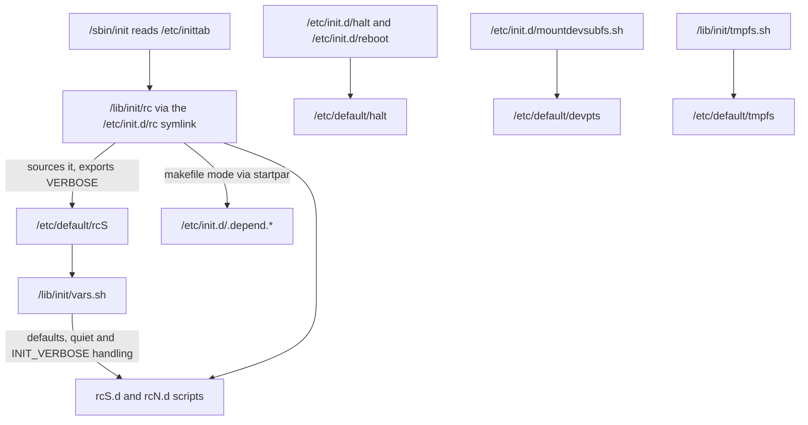

# sysvinit Configuration — The Complete File Map

## Overview

sysvinit has no monolithic configuration daemon to talk to — no central store, no schema, no reload API. Configuration is a constellation of small files, each read by exactly one consumer at one well-defined moment: `/etc/inittab` is read by PID 1, a handful of `/etc/default/*` panels are read by specific boot and shutdown scripts, `/etc/fstab` is read by the fsck-and-mount pass, and internal artifacts like `/etc/init.d/.depend.*` are read by the `rc` transition engine itself. `/etc/inittab` is only the entry point of this map, not the whole of it — treating it as "the sysvinit config file" is the single most common mental-model error.

This page is the full map, verified against the actual Debian 12 (bookworm) packages rather than folklore. The shipped `initscripts` and `sysv-rc` binaries were unpacked and grepped script by script, and every variable documented below is quoted from the real file contents or from the man pages those packages ship (`rcS(5)`, `halt(5)`, `tmpfs-config(5)`). Where tradition says one thing and bookworm does another — for example, the widely repeated claim that "the rcS.d scripts source `/etc/default/rcS`" — this page follows the packages, and says what actually happens.

The tour proceeds in dependency order: the who-reads-what table first, then `/etc/inittab` in brief (the full grammar lives in [inittab.md](./inittab.md)), then each `/etc/default` file with its verified variable set, then the `rc` script that ties the runlevel machinery together, the remaining rcS-pass inputs, the per-service defaults convention, runtime-reconfiguration semantics, and a cookbook of exact tuning edits. The grammar details of individual files are deliberately not repeated here — each deep dive links the page that owns them.

## Who Reads What — the File Map

Every file in the table below was verified against the bookworm packages; the consumer column names the script that literally sources or reads it:

| File | Consumer | Effect |
|---|---|---|
| `/etc/inittab` | `init(8)` — PID 1 only | Boot actions, gettys, runlevel lines, ctrlaltdel, UPS hooks |
| `/etc/default/rcS` | `/lib/init/rc` directly; rcS.d scripts via `/lib/init/vars.sh` | Boot defaults panel (TMPTIME, SULOGIN, FSCKFIX, ...) |
| `/etc/default/halt` | `/etc/init.d/halt` **and** `/etc/init.d/reboot` (both source it) | `HALT`, `NETDOWN` |
| `/etc/default/devpts` | `/etc/init.d/mountdevsubfs.sh` | `TTYGRP`, `TTYMODE` baked into the `/dev/pts` mount |
| `/etc/default/tmpfs` | `/lib/init/tmpfs.sh` (sourced by the mount scripts) | `RAMLOCK`, `RAMSHM`, `RAMTMP`, size limits |
| `/etc/fstab` | `checkroot.sh` (root entry, `swapon -a`), `checkfs.sh` (`fsck -A`), `mountall.sh` (`mount -a`), `mountnfs.sh` | What gets checked, mounted, and in what order |
| `/etc/hostname` | `/etc/init.d/hostname.sh` | Kernel hostname at boot |
| `/etc/network/interfaces` | `/etc/init.d/networking` (shipped by `ifupdown`, not initscripts) | `ifup -a` brings up the interfaces during rcS |
| `/etc/securetty` | `login(1)` | Devices on which root may log in |
| `/etc/init.d/.depend.{boot,start,stop}` | `/lib/init/rc` | insserv's dependency graph; gates makefile-style concurrent boot |
| `/etc/default/locale` | `/etc/init.d/mountall.sh` | `LANG` exported for mount helpers (ntfs-3g filename encoding) |
| `/etc/default/<service>` | that service's own init script | Per-service administrator overrides |
| `/run/nologin` | created by `bootmisc.sh`, removed by `rmnologin` | `DELAYLOGIN`-gated login block during boot |

Two structural observations. First, no boot script sources `/etc/default/rcS` directly except `rc` itself — the values reach the rcS.d scripts indirectly, through `/lib/init/vars.sh` (proven below). Second, the `/etc/default/locale` row proves the defaults-file convention is not limited to daemons: even a mount script reads one. That convention is the subject of its own section near the end of this page.

The same map as a picture — every arrow is a literal `. file` or read inside a bookworm script:



## /etc/inittab in One Screen

The full `id:runlevels:action:process` grammar, all fifteen actions, and the annotated bookworm file live in [inittab.md](./inittab.md). For the configuration story, three lines matter daily:

```text
id:2:initdefault:              # which runlevel boot ends in
si::sysinit:/etc/init.d/rcS    # the one-shot rcS pass (fsck, mounts, udev)
ca:12345:ctrlaltdel:/sbin/shutdown -t1 -a -r now
```

`initdefault` selects the destination runlevel (Debian boots to 2); the `sysinit` line runs `/etc/init.d/rcS` — itself a two-line wrapper that execs `rc S`, so the entire boot pass is the same engine as a runlevel change; `ctrlaltdel` decides what the three-finger salute does. Everything else in the stock file is the seven `lN:...:wait:/etc/init.d/rc N` lines, getty respawns, and UPS hooks.

`/etc/inittab` is also the only sysvinit file with a live-reload path: PID 1 re-reads it on `telinit q`. No other file on this page is ever re-read by a running process — they are consumed once, at script invocation or at boot.

## /etc/default/rcS — the Boot Defaults Panel

`/etc/default/rcS` belongs to the `initscripts` package and documents itself as "Default settings for the scripts in `/etc/rcS.d/`". `rcS(5)` specifies the format: POSIX `VAR=VAL`, one assignment per line, `#` comments. The shipped file opens with a header that matters on any dual-init machine:

```text
##################################################################
# NOTE: This file is ignored when systemd is used as init system #
##################################################################
#
# /etc/default/rcS
#
# Default settings for the scripts in /etc/rcS.d/
#
# For information about these variables see the rcS(5) manual page.
#
# This file belongs to the "initscripts" package.

# delete files in /tmp during boot older than x days.
# '0' means always, -1 or 'infinite' disables the feature
#TMPTIME=0

# spawn sulogin during boot, continue normal boot if not used in 30 seconds
#SULOGIN=no

# do not allow users to log in until the boot has completed
#DELAYLOGIN=no

# be more verbose during the boot process
#VERBOSE=no

# automatically repair filesystems with inconsistencies during boot
#FSCKFIX=no

# be verbose even if kernel command line contains "quiet"
#INIT_VERBOSE=yes

# Mount NFS filesystems asynchronously
#ASYNCMOUNTNFS=yes
```

(abridged: comments above are verbatim; nothing else was removed). Note that **every assignment ships commented out**. The shipped file is documentation; the effective defaults live in code.

### The variables

| Variable | Effective default | Effect | Set it when |
|---|---|---|---|
| `TMPTIME` | `0` (set in `/lib/init/vars.sh`) | Age in days for `/tmp` cleanup at boot; `0` deletes everything regardless of timestamps; `-1` or `infinite` disables cleanup | You want `/tmp` files to survive several reboots |
| `SULOGIN` | `no` | `yes` makes `checkroot.sh` run `sulogin -t 30 $CONSOLE` before anything else, pausing boot for a maintenance login (30 s timeout) | You want a mandatory operator checkpoint early in boot |
| `DELAYLOGIN` | `no` (in `vars.sh`; `bootmisc.sh`/`rmnologin` default `yes` if unset) | `yes` creates `/run/nologin` early (`bootmisc.sh`) and removes it last (`rmnologin`), blocking non-root logins until boot completes | Multi-user machines where early logins race the boot |
| `VERBOSE` | `no` | Scripts gate their chatter on `[ "$VERBOSE" = no ]`; `rc` sources the file and explicitly `export VERBOSE` to everything it runs | You want readable boot messages (see the recipes) |
| `FSCKFIX` | `no` | `yes` makes `checkroot.sh`/`checkfs.sh` run fsck with `-y` instead of `-a` — auto-repair everything without asking | Unattended machines where a manual fsck prompt is worse than the risk |
| `INIT_VERBOSE` | unset | Overrides the `quiet` kernel-command-line handling: `INIT_VERBOSE=yes` forces verbose boot output even when the kernel boots with `quiet` | Debugging a quiet kernel's boot on serial/console capture |
| `ASYNCMOUNTNFS` | `yes` | `no` makes `mountnfs.sh` mount network filesystems synchronously instead of waiting on the async path | NFS-root or debugging of network mount ordering |

### Who actually reads it

Grepping the bookworm `initscripts` package settles a point most documentation gets wrong: **no rcS.d boot script sources `/etc/default/rcS` directly.** The verified chain is:

- `/lib/init/rc` (the runlevel engine) sources it unconditionally when present and exports `VERBOSE` to every script it runs.
- Every boot script — `checkroot.sh`, `checkfs.sh`, `hostname.sh`, `mountnfs.sh`, `rmnologin`, `bootmisc.sh`, `mountall.sh` — sources `/lib/init/vars.sh` instead, which carries the code defaults, sources `/etc/default/rcS`, and then applies the kernel-command-line and `INIT_VERBOSE` logic.
- `mountnfs.sh` says so in its own comment: *"Using 'no !=' instead of 'yes =' to make sure async nfs mounting is the default even without a value in /etc/default/rcS."*

The bookworm `/lib/init/vars.sh` (from the `sysvinit` source, shipped to `/lib/init/vars.sh`) is short enough to quote in full — it is the real defaults panel:

```sh
# Because /etc/default/rcS isn't a conffile, it's never updated
# automatically.  So that an empty or outdated file missing newer
# options works correctly, set the default values here.
TMPTIME=0
SULOGIN=no
DELAYLOGIN=no
UTC=yes
VERBOSE=no
FSCKFIX=no

# Source conffile
if [ -f /etc/default/rcS ]; then
    . /etc/default/rcS
fi

# Unset old unused options
unset EDITMOTD
unset RAMRUN
unset RAMLOCK
# Don't unset RAMSHM and RAMTMP for now.

# Parse kernel command line
if [ -r /proc/cmdline ]; then
    for ARG in $(cat /proc/cmdline); do
        case $ARG in
            noswap)     NOSWAP=yes ;;
            quiet)      # only during boot/shutdown, when rc's vars are present
                        if [ "$RUNLEVEL" ] && [ "$PREVLEVEL" ] ; then
                            VERBOSE="no"
                        fi ;;
        esac
    done
fi

# But allow both rcS and the kernel options 'quiet' to be overrided
# when INIT_VERBOSE=yes is used as well.
if [ "$INIT_VERBOSE" ] ; then
    VERBOSE="$INIT_VERBOSE"
fi
```

### Retired variables

`rcS(5)` closes with a graveyard list: `EDITMOTD`, `RAMRUN`, `CONCURRENCY`, and `UTC` are no longer used (`UTC` moved to the `UTC`/`LOCAL` setting in `/etc/adjtime`; concurrent boot is inhibited with the `concurrency=none` kernel argument, not a variable). `RAMLOCK`, `RAMSHM`, and `RAMTMP` moved to `/etc/default/tmpfs` — old rcS values for `RAMSHM`/`RAMTMP` are still honored for backward compatibility but lose to `/etc/default/tmpfs`. Setting them in `rcS` today is a no-op waiting to confuse the next administrator.

## /etc/default/halt, /etc/default/devpts, /etc/default/tmpfs

Three more defaults panels, each with a single verified consumer. Unlike rcS, these ship their assignments **active** (uncommented).

### /etc/default/halt — shutdown behavior

The whole file, verbatim:

```sh
# Default behaviour of shutdown -h / halt. Set to "halt" or "poweroff".
HALT=poweroff

# Bring networking down right before halting/rebooting system. You
# should only need this to handle issues with Wake-on-LAN or network
# filesystems.  Set to "yes" or "no".
NETDOWN=yes
```

| Variable | Default | Effect | Set it when |
|---|---|---|---|
| `HALT` | `poweroff` | `halt(8)`'s final action: `poweroff` cuts power, `halt` stops the CPU and leaves the machine powered. `do_stop` matches `[Pp]*` → `POWEROFF`, `[Hh]*` → `HALT` | Enterprise hardware with a "halt leaves console attached" policy, or embedded boards where power control is unsafe |
| `NETDOWN` | `yes` | `yes` tears network interfaces down at the last moment (passes `-i` to `halt`/`reboot`); `no` leaves them up so Wake-on-LAN magic packets still work | Machines that must be woken remotely after every shutdown |

The consumer is verified and double: `/etc/init.d/halt` (line 15) and `/etc/init.d/reboot` (line 15) both source this file — `NETDOWN` applies on the reboot path too, which the filename alone would never suggest. `halt(5)` documents both variables; the surrounding shutdown choreography is covered in [shutdown-halt.md](./shutdown-halt.md).

### /etc/default/devpts — pty ownership and mesg

```sh
# GID of the `tty' group
TTYGRP=5

# Set to 620 to have `mesg y' be the default
TTYMODE=600
```

| Variable | Shipped value | Effect |
|---|---|---|
| `TTYGRP` | `5` (gid of group `tty`) | Group ownership of `/dev/pts/*` slave devices |
| `TTYMODE` | `600` | Mode of the slave devices |

`mountdevsubfs.sh` is the only consumer; it sets its own inline defaults (`TTYGRP=5`, `TTYMODE=620`), then sources this file, then mounts devpts with `-onoexec,nosuid,gid=$TTYGRP,mode=$TTYMODE`. The interplay is the whole point: mode `620` (group `tty` writable) is what makes write access to your terminal the default — the `mesg y` state that `talk`/`write` and `wall` need — while the shipped `600` leaves terminals private unless `mesg y` is run by hand (see [mesg(1)](https://manpages.debian.org/bookworm/util-linux/mesg.1.en.html)). So the file's comment is the manual's hint in disguise: to restore old-school `mesg y`-by-default behavior, set `TTYMODE=620` here rather than editing the script.

### /etc/default/tmpfs — early-boot tmpfs mounts

The panel for the tmpfs filesystems mounted *before* fstab mounts: `/run` (always tmpfs), plus optionally `/run/lock`, `/run/shm`, and `/tmp`. Consumer: `/lib/init/tmpfs.sh`, which sets the code defaults, sources this file, and computes the mount options. Documented by `tmpfs-config(5)`.

| Variable | Default | Effect |
|---|---|---|
| `RAMLOCK` | `yes` | Mount `/run/lock` as a separate tmpfs; `no` folds it into the `/run` tmpfs |
| `RAMSHM` | `yes` | Mount `/run/shm` (POSIX shared memory, which glibc expects) as a separate tmpfs |
| `RAMTMP` | `no` | `yes` puts `/tmp` on a tmpfs — contents lost at reboot |
| `TMPFS_SIZE` | `20%VM` | Fallback maximum size for any tmpfs with no specific size |
| `RUN_SIZE` | `10%` | Maximum size of `/run` |
| `LOCK_SIZE` | `5242880` | Maximum size of `/run/lock` (5 MiB) |
| `SHM_SIZE` | unset | Maximum size of `/run/shm`; empty means use `TMPFS_SIZE` |
| `TMP_SIZE` | unset | Maximum size of `/tmp`; empty means use `TMPFS_SIZE` |
| `TMP_OVERFLOW_LIMIT` | `1024` | Emergency-overflow trigger: if root has less free space than this (KiB) at boot, mount tmpfs on `/tmp` regardless of `RAMTMP` |

The size grammar, implemented by `tmpfs_size_vm` in `tmpfs.sh`: a bare integer is KiB; `N%` is N percent of physical RAM; `N%VM` is N percent of virtual memory (RAM + swap), computed at boot because the kernel cannot parse that suffix — which is also why `tmpfs-config(5)` warns that `%VM` may be used in these variables but not in `/etc/fstab`. An fstab entry for any of these mount points overrides this file entirely (`tmpfs /tmp tmpfs nodev,nosuid,size=2g,mode=1777 0 0` beats `RAMTMP`), and a `/tmp` symlink trick (pointing `/tmp` into a tmpfs like `/run/tmp`) is documented in the package's own README.

## The rc Script Itself

### Bookworm layout: /etc/init.d/rc is a symlink

The package that owns the runlevel machinery is `sysv-rc`, and in bookworm it ships the engine at `/lib/init/rc` with compatibility symlinks in the traditional place — verified from the package's own file listing:

```text
/etc/init.d/rc  -> /lib/init/rc
/etc/init.d/rcS -> /lib/init/rcS
```

`/lib/init/rcS` is a two-line wrapper — `exec /etc/init.d/rc S` — so inittab's `si::sysinit` line and the seven `lN:...:wait` lines all reach the same engine. The move out of `/etc/init.d` separates implementation from the service-script directory that admins and tools enumerate; `/etc/init.d/rc` remains only so old muscle memory and old tooling still resolve.

### What rc sources, and the environment contract

The engine consumes more than it is given credit for. At startup it reads the runlevel transition from its environment — `$RUNLEVEL` (current) and `$PREVLEVEL` (previous, `N` on first boot), both exported by `/sbin/init` per `init(8)` — with the single command-line argument overriding `$RUNLEVEL`. It then sources `/etc/default/rcS` when present, explicitly exports `VERBOSE`, and loads `/lib/lsb/init-functions`. If the exit flow is ever broken it fires an emergency trap printing `error: '/etc/init.d/rc' exited outside the expected code flow.`, and it ignores `INT`/`QUIT`/`TSTP` so a stray Ctrl-C cannot kill a transition. There is no re-exec and no failure-driven panic path: runlevels 0 and 6 flip the action to `stop`, `S` means a start pass, and the K-scripts run first only when `$PREVLEVEL` is not `N`.

### CONCURRENCY and the silent fallback

The concurrency decision is made fresh on every invocation, and its failure mode is silence:

```sh
CONCURRENCY=makefile
test -s /etc/init.d/.depend.boot  || CONCURRENCY="none"
test -s /etc/init.d/.depend.start || CONCURRENCY="none"
test -s /etc/init.d/.depend.stop  || CONCURRENCY="none"
if test -e /etc/init.d/.legacy-bootordering; then
        CONCURRENCY="none"
fi
if grep -wqs concurrency=none /proc/cmdline; then
        CONCURRENCY="none"
fi
```

Makefile-style concurrent boot requires insserv's `.depend.{boot,start,stop}` graph and `startpar(1)` (invoked as `startpar -p 4 -t 20 -T 3 -M boot|stop|start -P $previous -R $runlevel`, with failed/skipped service names reported back). If any graph file is missing or empty, if the `.legacy-bootordering` marker exists, or if the kernel command line says `concurrency=none`, `rc` quietly drops to the serial loop — no error, just a slower boot. So a boot that mysteriously stopped being parallel is diagnosed by checking for those three files, not by hunting for an error message. The full mechanics of the parallel path are in [parallel-booting.md](./parallel-booting.md).

### Why you must not hand-edit it

`/lib/init/rc` is dpkg-owned by `sysv-rc` and is replaced verbatim on every package upgrade — anything you patch into it is silently lost, and because it is not a conffile you get no merge prompt, no dpkg-dist leftover, nothing. It is also on the critical path of every boot and every runlevel change, where an experimental edit can leave a machine that boots to nothing. Patch points exist for every purpose the script serves: boot defaults go in `/etc/default/rcS`, service ordering in LSB headers or insserv overrides (regenerate with `insserv -d` — see [tooling.md](./tooling.md)), and end-of-boot customization in `/etc/rc.local`. Edit the panel, not the engine.

## Files Consumed by the rcS Pass

The one-shot boot pass reads the rest of the constellation, script by script:

- **`/etc/fstab`** — read by four consumers with different jobs. `checkroot.sh` verifies the root entry against the actual root device and activates swap (`swapon -a -e`); `checkfs.sh` runs `fsck -A`, which walks fstab honoring `fs_passno` — pass 1 filesystems (usually just root) are checked serially, pass 2 filesystems can be checked in parallel by fsck itself; `mountall.sh` does `mount -a -t nonfs,nfs4,smbfs,cifs,... -O no_netdev` for local filesystems; `mountnfs.sh` waits on the async NFS mount path (or mounts synchronously when `ASYNCMOUNTNFS=no`). The pass field is therefore an ordering contract between fstab and fsck(8), not a sysvinit feature — but the rcS scripts are what execute it.
- **`/etc/hostname`** — `hostname.sh` reads it verbatim (`HOSTNAME="$(cat /etc/hostname)"`, returning silently if the file is absent) and applies it with `hostname(1)`. One line, no comments, no FQDN tricks — the domain side belongs to `/etc/hosts` and resolver configuration.
- **`/etc/network/interfaces`** — consumed by `ifup(8)` (the `ifupdown` package) via `/etc/init.d/networking`, which runs during the rcS pass to bring up interfaces marked `auto`. Bookworm sysvinit installs keep this path; the file is ifupdown-owned, not initscripts-owned, which is why it is absent from the initscripts package listing.
- **`/run/nologin`** (historically `/etc/nologin`) — the `DELAYLOGIN` flag file. Verified round trip: `bootmisc.sh` writes `System bootup in progress - please wait` into it when `DELAYLOGIN` is `yes`; `rmnologin` (run at the end of the multiuser levels) removes it; while it exists, `login(1)` refuses non-root logins. `rcS(5)` adds the operational footnote: if you set `DELAYLOGIN=no`, make sure no stale `/run/nologin` is lying around, or you have built a permanent login blocker.

## Per-Service Configuration: /etc/default/<service>

The same panel pattern scales to every service. The Debian convention: an init script sources `/etc/default/<name>` near the top (usually conditionally — `[ -r /etc/default/myapp ] && . /etc/default/myapp` — so a missing file cannot break the boot), sets its own code defaults first, and lets the file's assignments win. Package upgrades overwrite `/etc/init.d/<name>` but never your `/etc/default/<name>`, which is the entire point: maintainer defaults in package-owned code, operator intent in a file dpkg does not touch.

The bookworm tree is full of instances beyond the boot panel: `/etc/default/locale` is read even by `mountall.sh` (to export `LANG` for filesystem helpers), and `/etc/default/ssh` carries `SSHD_OPTS`, the standard hook for extra `sshd` command-line options without touching the packaged script. A complete worked example — a `myapp` service with a `DAEMON_ARGS` override, the conditional-sourcing habit, and the full init script around it — is built end-to-end in [custom-init-scripts.md](./custom-init-scripts.md); the pattern to internalize here is one line of that page:

```sh
[ -r /etc/default/myapp ] && . /etc/default/myapp
```

Variables are not exported by the sourcing line, so a defaults file that wants to influence child processes must export explicitly — a detail that explains most "my defaults file only half-works" reports.

## Root Login Policy: /etc/securetty

`/etc/securetty` lists device names, one per line, on which root is permitted to log in — `console`, `tty1`–`tty6`, `ttyS0`, and so on; a device not listed refuses root. The consumer is `login(1)`, which consults it for root sessions; the interface itself is documented in `securetty(5)`. Its scope is deliberately narrow: it gates *where* root may log in from, not *whether* the account works — disable root logins entirely with `passwd -l` or SSH configuration, not with an empty securetty (an empty file merely confines root to zero terminals, which can lock you out of the console you needed).

The interaction with single-user mode is the subtle part. The sysvinit path into single-user runs `sulogin(8)` (inittab's `~~:S:wait:/sbin/sulogin`, and `checkroot.sh`'s `SULOGIN=yes` hook), and the util-linux sulogin shipped in bookworm documents **no `/etc/securetty` check at all** — single-user access is gated by the root password, and with `-e`/`--force` sulogin will even start a shell without a password when the root account is locked, on the explicit assumption that the console is physically protected. So the two root-entry paths have different policies: `login(1)` honors securetty, `sulogin(8)` does not, and console physical security is the control that covers the difference. Deep coverage of that mode lives in [single-user-sulogin.md](./single-user-sulogin.md) and [getty-terminals.md](./getty-terminals.md).

## Runtime Reconfiguration vs Reboot

Nothing in sysvinit is globally hot-reloaded; each file has its own moment of consumption:

- **`/etc/inittab`** — the exception: PID 1 re-reads it on `telinit q`, spawning or killing respawn entries immediately (the full procedure is in [inittab.md](./inittab.md)).
- **`/etc/default/<service>`** — takes effect on the next invocation of the consuming script: `service myapp restart` picks up new daemon options, but the rcS boot panels (`rcS`, `halt`, `devpts`, `tmpfs`) are read only during boot or shutdown, so they need a reboot (or at minimum the next shutdown) to matter.
- **`/etc/fstab`** — read on every script invocation that consumes it, so `mount -a` and the boot pass agree; but fsck pass ordering is a boot-time property.
- **`.depend.*`** — regenerated with `insserv -d` after header or override changes ([tooling.md](./tooling.md) has the exact session); `rc` re-tests their presence at every invocation, so a regeneration changes the next transition, not the running one. Link surgery in `rcN.d` is covered in [rc-symlinks.md](./rc-symlinks.md).

The design consequence: sysvinit reconfiguration is idempotent and per-consumer. There is no daemon whose state can drift from the files — but also no single command that says "apply everything."

## Tuning Recipes

Exact edits, each verified against the consumers above:

1. **Verbose boot.** Uncomment `VERBOSE=yes` in `/etc/default/rcS` — it overrides both the `no` default and a `quiet` kernel argument (the `quiet` handling in `vars.sh` only lowers `VERBOSE` before `INIT_VERBOSE` gets its turn; `VERBOSE=yes` set after that logic wins because the file is sourced between default and override). To silence a normal boot instead, keep the kernel `quiet` argument and leave rcS alone.
2. **Always fsck -y at boot.** `FSCKFIX=yes` in `/etc/default/rcS` — `checkroot.sh` and `checkfs.sh` then pass `-y` instead of `-a` to every fsck. Understand the trade: genuine hardware-caused inconsistency gets "repaired" automatically; a manual-intervention prompt (which would have stopped for a reason) never happens.
3. **`/tmp` as tmpfs with a cap.** `RAMTMP=yes` plus `TMP_SIZE=1G` (or rely on `TMPFS_SIZE=20%VM`) in `/etc/default/tmpfs`; note `/tmp` contents vanish at reboot, and an fstab entry for `/tmp` would override this file entirely. The `TMP_OVERFLOW_LIMIT` emergency path still applies.
4. **poweroff vs halt on `shutdown -h`.** `HALT=poweroff` (default) cuts power; `HALT=halt` stops the OS and leaves the machine on, per `halt(5)`. Consumed at the end of runlevel 0, not by `shutdown(8)` itself.
5. **Keep Wake-on-LAN through shutdown.** `NETDOWN=no` in `/etc/default/halt` — the interfaces stay up because `halt`/`reboot` are called without `-i`. Works for both poweroff and reboot paths since both scripts source the file.
6. **Boot-time maintenance login.** `SULOGIN=yes` in `/etc/default/rcS` — `checkroot.sh` spawns `sulogin -t 30 $CONSOLE` before anything else; thirty idle seconds and boot continues unattended.
7. **Stop wiping `/tmp` on reboot.** `TMPTIME=-1` (or `infinite`) in `/etc/default/rcS` — `bootclean.sh` skips the whole sweep. `TMPTIME=0` is the opposite extreme: no age filter at all, so even future-dated files go. Only the lock files and `lost+found`-class exclusions survive any setting.
8. **Synchronous NFS mounting.** `ASYNCMOUNTNFS=no` in `/etc/default/rcS` — `mountnfs.sh` stops waiting on the async mount done when interfaces come up and instead runs the mount path itself. Intended for NFS-root setups, per `rcS(5)`.

## Interview Questions

### Q: Who actually sources /etc/default/rcS — and why is "the rcS.d scripts" the wrong answer?

`/lib/init/rc` sources it directly and exports `VERBOSE`; the rcS.d boot scripts do not touch it. They source `/lib/init/vars.sh`, which carries the code defaults (`TMPTIME=0`, `SULOGIN=no`, `DELAYLOGIN=no`, `VERBOSE=no`, `FSCKFIX=no`), sources `/etc/default/rcS` on their behalf, unsets dead options, parses the kernel command line for `quiet`/`noswap`, and applies the `INIT_VERBOSE` override. The proof is a grep: the bookworm initscripts package contains no `. /etc/default/rcS` outside `rc` — and `mountnfs.sh`'s own comment confirms values arrive via this chain.

### Q: What does FSCKFIX=yes change, and what is the risk you accept?

`checkroot.sh` and `checkfs.sh` switch the fsck invocation from `-a` (autorepair of trivial issues, bail out and give a sulogin prompt on serious inconsistency) to `-y` (answer yes to every repair). You accept that a filesystem inconsistency caused by failing hardware gets auto-"repaired" aggressively — possibly destroying recoverable data — in exchange for a boot that never blocks on an fsck prompt. Appropriate for unattended appliances; a calculated risk everywhere else.

### Q: HALT and NETDOWN in /etc/default/halt — what does each control, and which script consumes them?

`HALT` selects the final action of runlevel 0: `poweroff` (default) cuts power, `halt` leaves the box powered on the login screen of its firmware/console. `NETDOWN` decides whether the last halt/reboot step passes `-i`, tearing interfaces down; `no` keeps them up so Wake-on-LAN still works. Both `/etc/init.d/halt` and `/etc/init.d/reboot` source the file — the reboot consumer is the non-obvious part.

### Q: Under what conditions does rc abandon makefile-style concurrent boot?

Four, all checked on every invocation: any of `.depend.boot`, `.depend.start`, `.depend.stop` missing or zero-length; the presence of `/etc/init.d/.legacy-bootordering`; `concurrency=none` on the kernel command line; and (implicitly) startpar being unavailable. The fallback is silent — the serial walk just runs — which is why "my boot stopped being parallel" is diagnosed by checking for those files, not by reading logs for an error.

### Q: What is /etc/securetty for, and does it protect single-user mode?

It lists the devices on which `login(1)` will permit a root login; the interface is `securetty(5)`. It does not protect single-user mode: the sulogin shipped in bookworm's util-linux performs no securetty check — its man page documents none — and its `--force` path can even skip the password on a locked root account, assuming a physically protected console. The control that covers sulogin is physical/console security (and BIOS/bootloader hardening), not this file.

### Q: Why is /etc/init.d/rc a symlink to /lib/init/rc in bookworm, and what should you patch instead?

Because the engine is implementation, not a service script: `sysv-rc` owns `/lib/init/rc` and leaves the traditional name as a symlink so inittab lines and old tooling still resolve. The real file is dpkg-owned and replaced verbatim on every upgrade — not a conffile, so hand edits vanish silently with no merge prompt. Everything rc reads is a patch point: `/etc/default/rcS` for boot behavior, insserv headers/overrides plus `insserv -d` for ordering, `/etc/rc.local` for end-of-boot work.

## References

- [rcS(5) — initscripts man page, Debian bookworm](https://manpages.debian.org/bookworm/initscripts/rcS.5.en.html) — the normative variable list for `/etc/default/rcS`, including the retired-variable graveyard.
- [halt(5) — initscripts man page, Debian bookworm](https://manpages.debian.org/bookworm/initscripts/halt.5.en.html) — documents `HALT` and `NETDOWN`.
- [tmpfs-config(5) — initscripts man page, Debian bookworm](https://manpages.debian.org/bookworm/initscripts/tmpfs-config.5.en.html) — the `/etc/default/tmpfs` variables, the `%VM` size grammar, and fstab precedence.
- [init(8) — sysvinit-core man page, Debian bookworm](https://manpages.debian.org/bookworm/sysvinit-core/init.8.en.html) — the `RUNLEVEL`/`PREVLEVEL` environment contract and telinit control.
- [inittab(5) — sysvinit-core man page, Debian bookworm](https://manpages.debian.org/bookworm/sysvinit-core/inittab.5.en.html) — the grammar behind the one-screen section above.
- [telinit(8) — sysvinit-core man page, Debian bookworm](https://manpages.debian.org/bookworm/sysvinit-core/telinit.8.en.html) — the `q` re-read and runlevel change interface.
- [halt(8) — sysvinit-core man page, Debian bookworm](https://manpages.debian.org/bookworm/sysvinit-core/halt.8.en.html) — the `-i`/`-p`/`-h` flags the halt script assembles.
- [shutdown(8) — sysvinit-core man page, Debian bookworm](https://manpages.debian.org/bookworm/sysvinit-core/shutdown.8.en.html) — how `shutdown -h` reaches the halt script.
- [sulogin(8) — util-linux man page, Debian bookworm](https://manpages.debian.org/bookworm/util-linux/sulogin.8.en.html) — the single-user login, its `-t`/`-e` options, and the absence of a securetty check.
- [login(1) — login man page, Debian bookworm](https://manpages.debian.org/bookworm/login/login.1.en.html) — the consumer of `/etc/securetty`.
- [mesg(1) — util-linux man page, Debian bookworm](https://manpages.debian.org/bookworm/util-linux/mesg.1.en.html) — the terminal-write permission tied to `TTYMODE`.

## Cross-References

- [inittab — The Master Configuration](./inittab.md) — the full grammar this page compresses to three knobs.
- [The sysvinit Boot Sequence](./boot-sequence.md) — when in the timeline each file above is consumed.
- [rc0.d–rc6.d, rcS.d — Symlink Sequencing Mechanics](./rc-symlinks.md) — the link sets whose regeneration the runtime-reconfiguration section describes.
- [Parallel Booting and startpar](./parallel-booting.md) — the makefile-mode path rc selects when `.depend.*` are intact.
- [Writing a Production init.d Script](./custom-init-scripts.md) — the complete worked `/etc/default/<service>` example.
- [Single-User Mode and sulogin](./single-user-sulogin.md) — the sulogin side of the securetty discussion.
- [Getty and Terminal Management](./getty-terminals.md) — how respawned terminals relate to securetty device names.
- [Shutdown and Halt Mechanics](./shutdown-halt.md) — the runlevel 0/6 choreography that ends at `/etc/default/halt`.
- [SysVinit Service Management Tooling](./tooling.md) — insserv, update-rc.d, and the `.depend.*` regeneration session.
- [systemd — Configuration](../systemd/configuration.md) — the sibling config map on the systemd side of the divide.
- [SysVinit admin overview](../../admin/sysvinit.md) — the summary-level admin page for this init system.
- [Init Systems Hub](../README.md) — section map and reading order.
- [Init System Comparison](../comparison.md) — how each init system answers the who-reads-what question.
