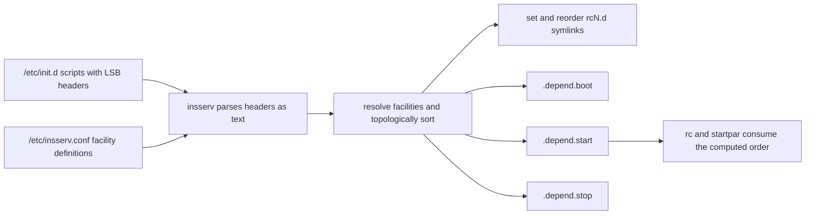

# LSB Init Script Headers and Dependency Metadata

## Overview

An init script is free-form shell: nothing about `/etc/init.d/foo` tells a machine when it should run, what it needs, or where it belongs. The LSB init script header is the fix — a structured comment block between `### BEGIN INIT INFO` and `### END INIT INFO` markers that declares the script's identity (`Provides`), its hard and soft dependencies (`Required-Start`, `Should-Start`), the runlevels it belongs to (`Default-Start`, `Default-Stop`), and human-facing descriptions. It is the only machine-readable metadata in the entire classic sysvinit stack, which makes it the load-bearing wall of dependency-based boot: every ordering tool in the ecosystem reads it and nothing else.

Three generations of tooling consume the same block. insserv parses it to build the dependency graph and generate the `.depend.*` sequencing files used by `/etc/init.d/rc` and startpar; update-rc.d relies on it for runlevel membership when installing links; and — critically for the modern world — systemd's SysV compatibility generator reads the same headers to synthesize ordering directives (`After=`, `Requires=`-like relationships) for legacy scripts running under systemd. The header is therefore not a Debian historical curiosity: it is the interface layer that let thirty years of init scripts survive three different init systems.

The reason this page deserves its own treatment is that header mistakes fail in the worst possible place. A bug inside the script body fails when that script runs, in public, with a message. A bug in the header fails at *sequencing* time: the service boots in the wrong order and breaks intermittently, or the dependency graph becomes unsatisfiable and the tooling refuses to install an order at all. Interviewers probe this page's material precisely because it separates people who have edited boot scripts from people who have debugged boots.

## Why Scripts Need Machine-Readable Metadata

Before dependency booting, the only ordering signal was the symlink name: `S20ssh` ran after `S19nfs-common` because 20 > 19. That scheme forced every package maintainer to hand-pick sequence numbers blind — numbers that were correct only for one distribution's snapshot of `/etc/init.d` and rotted as packages were added or removed. Inserting a service "early" meant guessing an unused number below everyone else's, and nothing prevented two services with a real dependency from getting numbers in the wrong relative order.

The LSB header decouples *intent* from *mechanics*. The script declares, in its own text, that it needs `$remote_fs` and `$syslog`; the sequencing tool resolves those names against the scripts actually installed on the machine and computes a topological order. Adding a new database package no longer requires renumbering anyone: the web server that declared `Required-Start: $named $network` simply sorts after whichever script ends up providing the resolver. The header is also parsed *as text, without executing the script* — insserv reads only the comment block, so a broken script body cannot corrupt the ordering phase, and a header can be audited with `grep` alone.

A second, less advertised purpose: the header is what makes package automation safe. Debian's `update-rc.d` needs to know which runlevels a script belongs in (`Default-Start`/`Default-Stop`), and it needs that answer to come from the package rather than from a hardcoded distro table, precisely so that the same package works across distributions that disagree on runlevel conventions. Debian Policy requires these headers of any package shipping an init script — see the [Debian Policy Manual, ch-opersys](https://www.debian.org/doc/debian-policy/ch-opersys.html).

## The BEGIN INIT INFO Block: Full Grammar

The complete block, with every documented key present:

```sh
#!/bin/sh
### BEGIN INIT INFO
# Provides:          myapp
# Required-Start:    $local_fs $remote_fs $network $syslog
# Required-Stop:     $local_fs $remote_fs $network $syslog
# Should-Start:      $named $time
# Should-Stop:       $named $time
# X-Start-Before:    xdm
# X-Stop-After:      xdm
# Default-Start:     2 3 4 5
# Default-Stop:      0 1 6
# X-Interactive:     false
# Short-Description: Example application server
# Description:       Start the example Python application server that
#                    serves the internal dashboard. This longer text may
#                    span as many lines as needed.
### END INIT INFO
```

The delimiters are literal: the block starts with the line `### BEGIN INIT INFO` (three hashes) and ends with `### END INIT INFO`. Every key line begins with `#` (one hash), whitespace, the key, a colon, and the value. Continuation of a value — only meaningful for the description fields — uses lines that start with `#` followed by a space or tab. Keys may appear in any order, but the conventions above are universal and lint-style tooling expects the canonical sequence. Values are whitespace-separated token lists for everything except the two description fields.

### Provides

`Provides:` names the facilities this script supplies — the names other scripts may depend on. By strong convention the list contains at least the script's own basename, so `Provides: myapp` matches `/etc/init.d/myapp`; additional names are aliases or implemented services. Scripts may also claim a *virtual* facility (a `$`-prefixed name such as `Provides: $network`), but that is a distribution-level decision: claiming `$`-facilities in a third-party package is how `Provides` collisions happen, and it is covered in the pitfalls section below. Under insserv, two scripts providing the same non-virtual name make the graph ambiguous — the dependency resolver warns and picks one, which is correct for virtual aliases and a bug for real services.

### Required-Start and Required-Stop

`Required-Start:` lists facilities that must be *available* before the script's `start` action runs; `Required-Stop:` lists facilities that must still be available while the script is being *stopped*. Per the insserv(8) semantics, the Stop fields declare services the system must not stop until this script has stopped — the mirror image of the Start side. Every token is either another script's provided name or a virtual facility resolved via `/etc/insserv.conf`. A `Required-*` edge is hard: if a required facility resolves to nothing on the machine, insserv reports an error and refuses to compute the order (unless forced with `-f`), because the resulting graph would be unsatisfiable. Listing too much here is the classic over-constraint bug; listing too little is the classic intermittent boot failure.

### Should-Start and Should-Stop

`Should-*` fields declare soft dependencies: "start me after this if it exists, but do not fail or reorder fatally if it does not." The distinction is exactly the shell idiom `[ -x ... ] && ...` — best-effort adjacency. Legitimate uses: an optional cache daemon, an optional accelerator, an optional monitoring hook. Misuse is dangerous in both directions and gets its own treatment under pitfalls. Note that insserv.conf supports an explicit escape hatch: the special facility `$null` forces an *empty* dependency where a `Should-Stop`/`Required-Stop` field would otherwise inherit something unwanted.

### Default-Start and Default-Stop

`Default-Start:` is the space-separated list of runlevels in which the script should be *started* by default (numbers only — `S` and `2`–`5` are the meaningful values on Debian). `Default-Stop:` is the corresponding stop list, conventionally `0 1 6` for network services (stop on halt, single-user, and reboot). The empty value is meaningful and, per insserv(8): an empty `Default-Start` means the script will never be started, and the same applies to `Default-Stop` — the script will never be stopped. This is how you declare "installed but not auto-enabled": an empty `Default-Start` with links installed only on the K side. The runlevel model these numbers plug into is covered in [Runlevels in Depth](./runlevels.md).

### Short-Description and Description

`Short-Description:` is a single-line summary consumed by tooling output (service managers, `service --status-all`-style frontends). `Description:` is the long form and is the one field that legitimately spans lines: every following line that begins with `#` plus a space or tab is a continuation. The description ends at the next `#`-key line or at the `### END INIT INFO` marker. Formatting inside the value is preserved as-is; tooling collapses leading whitespace per line but keeps line breaks.

### X-Start-Before, X-Stop-After, and X-Interactive

Keys beginning with `X-` are the spec's vendor/extension namespace, and three of them are load-bearing:

- `X-Start-Before:` — this script must start *before* the named services; equivalently, those services now depend on this one. It is the reverse-direction edge that plain `Required-Start` cannot express when you do not own the other script (a crypto-mount script declaring `X-Start-Before: apache2` instead of editing apache2's header).
- `X-Stop-After:` — this script stops *after* the named services stop; the stop-side mirror.
- `X-Interactive: true` — marks a script that must run *alone* in a concurrent boot configuration because it talks to the console (a passphrase prompt, an interactive recovery question). Only the value `true` is recognized; anything else is ignored. This is the flag that makes parallel booting (startpar, or the `<interactive>` keyword in `/etc/insserv.conf`) safe around console-bound scripts — see [Parallel Booting and startpar](./parallel-booting.md).

## Virtual Facilities

Virtual facilities are `$`-prefixed names that stand for system states rather than scripts: `$local_fs` means "local filesystems are mounted," not "run some script called local_fs." They exist because a dozen different packages could provide name resolution, and depending on any one of them would be wrong. LSB requires distributions to define what satisfies each facility; on Debian/openSUSE insserv systems that definition lives in `/etc/insserv.conf` and any files in `/etc/insserv.conf.d/`.

| Facility | Meaning (state it promises) | Typical provider mapping (Debian) |
|---|---|---|
| `$local_fs` | All local filesystems are mounted | the mount scripts (`mountkernfs.sh`, `mountall.sh` and friends) |
| `$network` | Low-level networking is up | `networking` (via ifupdown); NM/connman variants on other setups |
| `$named` | Name resolution works | resolver daemons: `bind9`, `dnsmasq`, `unbound`, ... |
| `$remote_fs` | Remote filesystems (NFS et al.) are mounted — implies `$local_fs` | `$local_fs` + `nfs-common`/mount-remote scripts |
| `$syslog` | A system logger is accepting messages | `rsyslog` (historically `syslogd`, `sysklogd`) |
| `$time` | System time and timezone are set | `hwclock` |
| `$portmap` | RPC portmapper is available (legacy) | `rpcbind` (the portmap era is gone, the facility name remains) |
| `$all` | *Every* service has started | special: last in the start order, first in the stop order |

A slightly abridged view of how the definition file looks:

```sh
# /etc/insserv.conf (abridged) - each line: $facility  providers...
$local_fs       boot
$network        network route
$named          named
$remote_fs      $local_fs nfs
$syslog         syslog
$all            +mountall +mountnfs
```

Three grammar details from insserv(8) matter when reading real files. First, providers listed with a leading `+` are *optional*: if the named script exists it satisfies the facility, if not it is ignored silently — that is how a facility tolerates machines without NFS. Second, `<...>`-bracketed words are keywords; the only documented one is `<interactive>`, which marks services needing console interaction. Third, a `$`-facility may be satisfied either by the conf file's provider list or by a real script that literally declares `Provides: $network` — and which of those applies is exactly where distributions diverge. openSUSE historically had `network` provide `$network` directly; Debian resolves it via insserv.conf indirection. The portable rule: depend on the *facility*, never on the provider script, and treat the provider mapping as distro-local configuration you can override but should not assume.

### The Classic $remote_fs vs $local_fs Bug

The most common real-world header bug, and an interview favorite. `$local_fs` promises local block-device filesystems only. `$remote_fs` promises that *network* filesystems (NFS and friends) are mounted too — and that `/usr` is complete when `/usr` lives on the network. The bug: a service whose binaries, libraries, or data live under a remotely-mounted path declares `Required-Start: $local_fs` instead of `$remote_fs`. On a workstation it boots fine forever; on the first machine where `/usr` or the data directory is NFS-mounted, the service starts before the mount and fails — sometimes sporadically, depending on mount latency and retry logic.

```sh
# BUGGY: binary lives in /usr/local, which is NFS-mounted here.
# Provides:          reportd
# Required-Start:    $local_fs $syslog          # wrong: no $remote_fs
# Default-Start:     2 3 4 5
# Default-Stop:      0 1 6

# FIXED:
# Provides:          reportd
# Required-Start:    $local_fs $remote_fs $syslog
# Required-Stop:     $local_fs $remote_fs $syslog
# Default-Start:     2 3 4 5
# Default-Stop:      0 1 6
```

The rule of thumb from Debian's guidance: if the script touches anything under `/usr`, reads files that may live on network storage, or requires anything beyond the root filesystem, require `$remote_fs`. When auditing, the tell is a service that "fails to boot on the NFS clients only." The same distinction, expressed in systemd vocabulary, is the ordering edge `remote-fs.target` versus `local-fs.target`.

## How insserv Consumes the Headers

insserv(8) describes itself as "a low level tool used by update-rc.d" — and warns that running it directly, "unless you know exactly what you're doing," may render the boot system inoperable. The pipeline it implements is the heart of dependency booting:



Concretely, on each invocation insserv reads every script's header (skipping editor droppings — filenames matching `*.dpkg*`, `*.old`, `*.orig`, `*.save`, `*~` and similar patterns are ignored), resolves every facility token against insserv.conf and the `Provides:` lines of installed scripts, and runs a topological sort over the resulting graph. It then writes three make-like dependency files into `/etc/init.d/` — `.depend.boot` (the rcS ordering), `.depend.start` (the rc2–rc5 start ordering), and `.depend.stop` (the shutdown ordering) — which `/etc/init.d/rc` uses as its ordering source and which `startpar -M boot|start|stop` consumes to execute batches in parallel. The symlink numbers in the `rcN.d` directories are rewritten to be consistent with the graph, but under dependency mode they are the artifact, not the authority.

Two operational details from the man page round out the picture. `insserv -n` (dry run) does not update symlinks and does not create the `.depend` files — the safe way to test a header change. Header *overrides* are a supported mechanism: a file with the same name as the script placed in `/etc/insserv/overrides/` replaces that script's header (or supplies a missing one), which is how an administrator fixes a third-party script's metadata without editing shipped files.

The override mechanism is worth a worked example, because it is the sanctioned way to fix third-party metadata. Suppose a vendor script `/etc/init.d/vendor-agent` ships `Required-Start: $local_fs` but you have verified it talks to the network at startup. Instead of editing the shipped file (your change is lost on upgrade), drop a same-named header into the overrides directory:

```sh
# /etc/insserv/overrides/vendor-agent - replaces the shipped header
### BEGIN INIT INFO
# Provides:          vendor-agent
# Required-Start:    $local_fs $remote_fs $network
# Required-Stop:     $local_fs $remote_fs $network
# Default-Start:     2 3 4 5
# Default-Stop:      0 1 6
# Short-Description: Vendor agent (with corrected dependencies)
### END INIT INFO
```

`insserv -d` afterward rebuilds the graph with the corrected header in place. Overrides also work in the opposite direction — supplying a complete header for a script that shipped none (insserv additionally looks in `/usr/share/insserv/overrides/` for distribution-supplied fixes to third-party scripts).

History: Debian introduced dependency-based booting as an option in lenny (5.0, 2009) and made it the default in squeeze (6.0, February 2011), with insserv generating the order and sysvinit's rc script honoring it. Red Hat went a different way: RHEL 5 and earlier kept pure static sequence numbers managed by chkconfig; RHEL 6 ran a hybrid (chkconfig as the user-facing tool atop insserv-computed ordering); RHEL 7 and later moved to systemd entirely. The header grammar, however, is the stable layer across all of it — which is why the systemd generator can still honor these same blocks today.

## A Fully Dissected sshd-Style Header

The canonical network-daemon header, line by line:

```sh
### BEGIN INIT INFO
# Provides:          sshd
# Required-Start:    $local_fs $remote_fs $network $syslog
# Required-Stop:     $local_fs $remote_fs $network $syslog
# Should-Start:      $named $time
# Should-Stop:       $named $time
# Default-Start:     2 3 4 5
# Default-Stop:      0 1 6
# Short-Description: OpenBSD Secure Shell server
# Description:       The sshd daemon provides encrypted, authenticated
#                    remote shell access on port 22.
### END INIT INFO
```

- `Provides: sshd` — the script's own basename, satisfying scripts that might name it directly. Real Debian units additionally provide `sshd-sshdgen-keys`-style sub-facilities for key generation; the principle is the same: one facility per independently orderable job.
- `Required-Start: $local_fs $remote_fs $network $syslog` — needs the filesystem mounted (`$local_fs`), its binaries and host keys readable even if `/usr` is remote (`$remote_fs`), a network interface up to bind to (`$network`), and a logger so early connection attempts are recorded (`$syslog`). Missing `$syslog` would not break the daemon, but the over-constraint is deliberate and cheap.
- `Should-Start: $named $time` — DNS and correct clock are *useful* (hostname resolution for key generation, sane timestamps) but not fatal if absent; the daemon starts regardless and re-resolves at connection time. This is the textbook soft/hard split: bind-to-interface is Required, resolve-hostname is Should.
- `Required-Stop:` mirroring Start — the stop path still needs the network to close sockets cleanly and syslog to flush its final messages; the stop-order rules ensure these providers are not torn down first.
- `Default-Start: 2 3 4 5`, `Default-Stop: 0 1 6` — Debian's multi-user runlevels; stop on the three shutdown-adjacent levels. A Fedora-style script would instead carry `# chkconfig: 2345 20 80` (next section).
- No `X-Interactive` — sshd never prompts at boot; key generation is scripted. A script that *does* prompt (encrypted volume, manual fsck confirmation) must declare it or it will hang a parallel batch while startpar waits on a console nobody is watching.

## From Headers to Unit Directives: The systemd Generator Mapping

The header grammar survived systemd because the SysV compatibility generator consumes the same fields. The mapping below is the conceptual correspondence the generator implements when it turns a headered script into a synthetic unit:

| LSB header field | Synthetic unit counterpart | Notes |
|---|---|---|
| `Provides: foo` | unit name `foo.service` (+ alias) | the script basename becomes the unit identity |
| `Required-Start: $network $named` | ordering/requirement edges on the matching target units | `$network` maps to the network target family; facilities become unit dependencies |
| `Should-Start: ...` | softer ordering edges | best-effort stays best-effort across the boundary |
| `Default-Start: 2 3 4 5` | enablement across the runlevel-target mapping | `multi-user.target` answers for 2/3/4/5 on Debian |
| `Default-Stop: 0 1 6` | nothing — systemd stops units on shutdown by default | stop-side runlevels have no direct equivalent |
| `Short-Description:` | the unit's `Description=` | carried over verbatim |
| `$remote_fs` vs `$local_fs` | `remote-fs.target` vs `local-fs.target` ordering | the classic bug maps one-to-one |

The practical consequence cuts both ways. A correct header makes a legacy script a nearly first-class citizen under systemd — ordered, aliased, and enablement-faithful. A wrong header ships its bug into the new init: the `$local_fs`-instead-of-`$remote_fs` mistake reproduces under systemd as missing `remote-fs.target` ordering. Metadata quality is init-system-independent, which is precisely why this page's grammar outlived its original consumer.

## The RHEL chkconfig Line

Red Hat's tooling predates the LSB block and reads its own miniature header instead:

```sh
#!/bin/bash
#
# sshd      Start up the OpenSSH server daemon
#
# chkconfig: 2345 20 80
# description: The sshd daemon provides encrypted and authenticated \
#              remote shell access. The three fields after chkconfig: are \
#              runlevels, start sequence number, and stop sequence number.
```

The `chkconfig:` line carries everything chkconfig needs: `2345` — the runlevels to start in; `20` — the start sequence number (produces `S20sshd`); `80` — the stop sequence number (produces `K80sshd` in the remaining levels). `chkconfig --add` refuses to manage a script without this line, which is the RHEL twin of the missing-LSB-header failure on Debian. The `description:` field is the human-readable text, multi-line via trailing backslashes.

The two schemes map cleanly onto each other — which is why mixed-legacy codebases get away with either:

| Concept | LSB header (Debian/openSUSE) | chkconfig header (RHEL) |
|---|---|---|
| Runlevels to start in | `# Default-Start: 2 3 4 5` | `2345` in `# chkconfig: 2345 20 80` |
| Runlevels to stop in | `# Default-Stop: 0 1 6` | implicit — every level *not* listed gets a K link |
| Start position | computed from the dependency graph | fixed `20` → `S20name` |
| Stop position | computed by the graph (stop pass) | fixed `80` → `K80name` |
| Dependencies | `Required-Start`/`Should-Start` + facilities | none — ordering is purely numeric |
| Short text | `# Short-Description:` | `# description:` |
| Enable/disable storage | S↔K links via update-rc.d | S↔K links via `chkconfig --level` / service symlinks |

Note the asymmetry: chkconfig's numbers (`20`/`80`) are exactly the values the legacy `update-rc.d foo defaults 20 80` used to install by hand — the modern Debian answer replaced that fixed number with the graph, while RHEL kept the fixed number. Both write the same link shapes (`S{NN}name`, `K{NN}name`), which is why `ls /etc/rc2.d` reads the same on a RHEL 5 box and a Debian dependency-mode box even though the numbers mean different things.

## Pitfalls

**Missing header.** A script with no `### BEGIN INIT INFO` block has no `Provides`, no dependency edges, and no runlevel membership. insserv emits warnings and has nothing to anchor the script in the graph, so it gets no meaningful ordering position — effectively deferring it to the tail of the pass, and leaving `update-rc.d` without the runlevel information it documents as required. Debian Policy requires the header of every packaged init script precisely to make this failure impossible for packages; the danger is hand-written scripts. Lintian flags missing or malformed headers in packages (inline: lintian, init-script checks); shellcheck will *not* help — to the shell, the block is just comments, and shellcheck validates code, not metadata.

**Required vs Should misuse.** Putting a genuinely optional service into `Required-Start` makes the whole system fragile: if that provider is ever absent, insserv fails to build the order (or, with `-f`, silently drops the constraint — the worst of both worlds), and at runtime a hung provider stalls every dependent. The inverse error — hiding a hard dependency in `Should-Start` — buys boot speed at the cost of intermittent ordering failures that only appear on machines where the soft provider is missing. The audit question for every token: *if this facility did not exist, should the script fail to start, or start degraded?* The first is Required; the second is Should.

**Provides collisions.** Two scripts both `Provides: myapp` (usually a copy-paste leftover in a hand-copied script) give the graph two owners of one facility; ordering through that name is then ambiguous. Claiming virtual facilities — `Provides: $network` in a third-party script — is worse: it silently re-routes *every* script depending on `$network` through your service. Reserve `Provides:` for your own basename plus deliberate aliases, and never claim `$`-names in a package.

**Header/behavior mismatch.** The header describes what the script *should* need; nothing verifies it does. Under-constraining (`$network` but the script truly needs `$named`) produces boots that work until DNS ordering matters; over-constraining (requiring `$remote_fs` for a script that touches only `/etc`) adds latency and couples you to the NFS stack. And because `update-rc.d` never rewrites existing links ("if any files named `[SK]??name` already exist, update-rc.d does nothing"), editing a header alone changes *nothing* on disk until the links and `.depend` files are regenerated — a stale-metadata trap that deserves its own procedure (next section).

## Validation Without Rebooting

- **Dry-run the graph:** `insserv -n` parses every header, resolves facilities, and reports unsatisfiable `Required-*` tokens — without touching symlinks or writing the `.depend` files. This is the single highest-value check after editing any header.
- **Show the computed order:** `insserv -s` (`--show-all`) prints runlevel and sequence information without updating anything — the dry-run counterpart that answers "where did my script land?"
- **Simulate runlevel membership:** for link-level effects, test in a throwaway chroot or VM snapshot: install the package, run the same `update-rc.d` invocation the maintainer script would, and inspect `/etc/rc*.d`. The bookworm update-rc.d has no `--dry-run` flag, so containment is the honest substitute.
- **Package-level checks:** lintian validates header structure, runlevel values, and duplicate `Provides:` within a package; the [Debian wiki LSBInitScripts page](https://wiki.debian.org/LSBInitScripts) documents the field-by-field expectations most reviewers apply.
- **Rebuild deliberately after header edits:** `insserv -d` re-derives the link scheme from the headers ("use default runlevels as defined in the scripts"), which is the supported way to make metadata changes take effect on an already-installed system.

## A Field-by-Field Audit Checklist

When reviewing a header — your own or a vendor's — the following ordered questions cover essentially every failure mode this page describes:

1. Does `Provides:` include the script's own basename, and does it claim no `$`-facilities and no names another installed script also claims?
2. Is every token in `Required-Start` genuinely fatal-if-absent? Push anything that is not down to `Should-Start`.
3. Does the script touch anything under `/usr` or on network storage? Then `Required-Start` and `Required-Stop` both need `$remote_fs`.
4. Does the script speak the network? `$network` for interface-up; `$named` only if it must resolve names *at startup*.
5. Do `Required-Stop`/`Should-Stop` mirror reality — facilities the stop path actually needs still running?
6. Does `Default-Start` list only runlevels where the script really starts, and is `Default-Stop` `0 1 6` for resident daemons (or deliberately empty for one-shots)?
7. If the script prompts at boot, is `X-Interactive: true` set — or, better, has the prompting been removed?
8. Finally: was the graph regenerated after the edit (`insserv -d`, or the update-rc.d remove/defaults round trip), and did `insserv -n`/`-s` agree with expectations?

Nine out of ten real-world boot-ordering bugs die at step 3; the remainder are distributed evenly across the other seven.

## Interview Questions

### Q: Nothing reads the LSB headers at boot time — so why do they matter?

Correct the premise, then answer it. On a classic sysvinit boot, no code parses the headers at boot: `/etc/init.d/rc` executes links in the order given by the `.depend.*` files and the `rcN.d` symlink numbers. But those artifacts *are* generated from the headers by insserv (or the update-rc.d/insserv pairing) at package-install or regeneration time. And under systemd, the SysV generator parses the headers at boot to synthesize ordering for legacy scripts. So the header is evaluated before the boot and inside the boot, just not by PID 1 itself.

### Q: Explain the $remote_fs vs $local_fs bug and its signature symptom.

`$local_fs` guarantees local filesystems only; `$remote_fs` additionally guarantees network filesystems (and a complete `/usr` when `/usr` is remote). The bug is a script whose files live on network storage declaring `Required-Start: $local_fs`. The signature symptom: the service fails to start — or starts broken — only on machines where `/usr` or its data lives on NFS, works everywhere else, and races nondeterministically. The fix is adding `$remote_fs` to both `Required-Start` and `Required-Stop` and regenerating the order.

### Q: What concretely goes wrong when a hard dependency is listed in Should-Start, or an optional one in Required-Start?

Optional-in-Required: when the provider is absent, the dependency graph is unsatisfiable — insserv errors out and refuses to install an order (or, forced with `-f`, drops the constraint and you boot with a lie in the metadata). Hard-in-Should: the script may start before something it genuinely needs, producing intermittent failures that correlate with which optional services a machine has. The decision test is "must the script fail to start if this facility is missing?" — yes means Required, no means Should.

### Q: What happens on a Debian system when an init script has no header at all?

The script still runs if you invoke it by hand, but boot integration degrades: update-rc.d documents LSB header information as required for installing links; insserv gets no `Provides` and no dependency edges, so the script has no anchored position in the graph (effectively sorted late) and warns; `Default-Start`/`Default-Stop` are unknown, so runlevel membership cannot be derived. The practical result is a service that boots last or not at all, is stopped out of order at shutdown, and defeats every dependency-aware tool. Lintian rejects the pattern in packages; the cure is adding the block or an insserv override file.

### Q: How do you test a header change without rebooting, and why is editing the header alone often a no-op?

`insserv -n` re-parses and re-resolves everything without touching symlinks or the `.depend` files; `insserv -s` previews the resulting runlevel/sequence placement. Editing the header alone is often a no-op because update-rc.d never rewrites links that already exist — the installed `[SK]??name` links and the generated `.depend.*` order persist. To make a change real, regenerate: `insserv -d` re-derives the scheme from headers, or `update-rc.d -f foo remove && update-rc.d foo defaults` re-installs the links for one service.

### Q: Why does systemd still care about these thirty-year-old comment blocks?

Because legacy scripts must boot under systemd too, and the header is the only structured information a script carries. systemd's SysV generator converts each `/etc/init.d` script with an LSB header into a synthetic unit, mapping `Provides:` to unit aliases, `Required-Start:`/`Should-Start:` facilities to ordering and requirement relationships, and `Default-Start:` to enablement across the runlevel-target mapping. Delete the header and the generated unit loses all ordering intelligence; the script degrades to a best-effort late-start unit.

## References

- [LSB Core — Init Script Actions](https://refspecs.linuxfoundation.org/LSB_5.0.0/LSB-Core-generic/LSB-Core-generic/iniscrptact.html) — the standardized action and exit-code contract that surrounds the header block.
- [Debian Policy Manual, ch-opersys](https://www.debian.org/doc/debian-policy/ch-opersys.html) — what Debian requires of packaged init scripts, including the LSB header and runlevel fields.
- [Debian Wiki: LSBInitScripts](https://wiki.debian.org/LSBInitScripts) — the practical field-by-field reference for writing and fixing headers.
- [insserv(8) — Debian bookworm](https://manpages.debian.org/bookworm/insserv/insserv.8.en.html) — header grammar, virtual facilities, overrides, dry-run and show-all modes, and the `.depend.*` artifacts.
- [update-rc.d(8) — Debian bookworm](https://manpages.debian.org/bookworm/init-system-helpers/update-rc.d.8.en.html) — how link installation consumes header dependency and runlevel information.

## Cross-References

- [/etc/init.d Scripts — Conventions and Patterns](./init-scripts.md) — the script bodies these headers annotate, with the action/exit-code contract.
- [rc0.d–rc6.d, rcS.d — Symlink Sequencing Mechanics](./rc-symlinks.md) — the links and `.depend.*` files this metadata ultimately controls.
- [Parallel Booting and startpar](./parallel-booting.md) — how the graph permits parallel batches and where `X-Interactive` intervenes.
- [systemd — Dependency Management](../systemd/dependency-management.md) — the modern replacement for this ordering metadata, and the generator that still honors it.
- [Init Systems Hub](../README.md) — section map and reading order for all init-system families.
- [Init System Comparison](../comparison.md) — how sysvinit header metadata stacks up against systemd and OpenRC equivalents.
