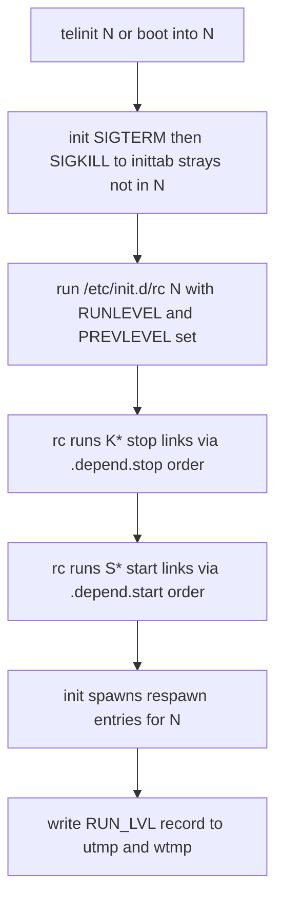

# Runlevels in Depth

## Overview

Runlevels are sysvinit's answer to the question "what should the machine look like right now?" — a small, named set of whole-system states (0–6, plus `S` and the pseudo-levels a/b/c) between which the machine can move as a unit. Entering a runlevel is a transaction with three parts: init kills the inittab-managed processes that do not belong in the new level, runs `/etc/init.d/rc N` to stop and start services per the `rcN.d` symlink sets, and spawns the `respawn` entries for the new level. Understanding a runlevel transition as *those three mechanisms in order* is what separates a memorized table from real understanding — and interview questions routinely probe exactly the boundary between them ("what stops a service when I go from 3 to 1?").

This page covers the canonical level meanings and their distribution-specific divergence, the `S` versus `1` distinction, how the initial runlevel is chosen, the mechanics of transitions step by step, how current and previous levels are observed (utmp encoding, `runlevel(8)`, `who -r`), the ondemand pseudo-levels, and the structural reasons runlevels lost to dependency graphs — with forward links to how systemd targets and OpenRC runlevels resolve those weaknesses.

## The Runlevel Table, and Why It Diverges

The numbers 0–6 have only two universal meanings: 0 halts, 6 reboots. Everything else is distribution convention, layered on top of the neutral `lN:wait:rc N` lines in `inittab`. The classic divergence:

| Level | Debian | RHEL 5/6 (era) | Slackware (`inittab` mapping) |
|---|---|---|---|
| 0 | Halt | Halt | Halt (`rc.0`) |
| 1 | Single-user, full rc1.d pass | Single-user (rescue) | Single-user (`rc.K`) |
| 2 | Full multiuser (default) | Multiuser, no NFS | Multiuser (`rc.M`) |
| 3 | Full multiuser | Full multiuser, text console | Multiuser (`rc.M`) |
| 4 | Full multiuser | Unused (admin) | X11 (`rc.4`) |
| 5 | Full multiuser | Full multiuser + X11 | Multiuser (`rc.M`) |
| 6 | Reboot | Reboot | Reboot (`rc.6`) |

Read that table twice and three lessons fall out:

- **Debian deliberately makes 2–5 identical.** The rationale is documented in Debian policy thinking: a package should not have to guess whether "multiuser" means level 2 or 3, so all full-multiuser levels run the same service set, and the default is simply 2. There is no "runlevel 3 vs 5" distinction to preserve.
- **Red Hat-era conventions encoded meaning into the numbers** — 3 = networked text, 5 = X11, 2 = no NFS — which is why old runbooks ("boot to 3 to fix the display manager") do not transfer verbatim to Debian systems.
- **Slackware proves the numbers mean nothing intrinsically**: its `inittab` points 2, 3, and 5 at the *same* monolithic `rc.M` script. The level is just an index into whatever the distribution wired up.

The interview-grade formulation: a runlevel is a *label*; the semantics live entirely in (a) which `respawn`/`wait`/`once` entries list it and (b) which symlinks exist in `/etc/rcN.d`.

## S and s: the Single-User State

`S` (or `s` — they are synonyms) is a special runlevel with three properties that distinguish it from `1`:

1. **Entry path.** `S` is reached by booting with `single`/`S` on the kernel command line, by `telinit S`, or automatically after serious fsck trouble (via sulogin). It is *the* maintenance state; level 1 is "the first normal runlevel," entered like any other.
2. **Boot-vs-transition semantics.** Booting to `S` means init runs only the boot entries (`sysinit`/`boot`/`bootwait` — on Debian, `rcS` plus the `~~:S:wait:/sbin/sulogin` line) and *no* `rc` pass for services: no `rc1.d` scripts run. Booting to `1` runs `rc 1` — the `K` links stop services that were up (irrelevant from a fresh boot) and the `S` links start whatever `rc1.d` defines.
3. **Content.** `S` is defined almost entirely by inittab entries (sulogin, and anything you add) and by whatever the kernel/initramfs already set up. Level 1 is defined by `/etc/rc1.d` — on Debian, that includes stopping most services if you transitioned *from* a higher level.

The practical rule for rescues: `single`/`S` when you want the rawest supported environment with sulogin; `1` when you want "single-user-ish but with my rc1.d conventions applied." The rescue workflows themselves (password reset, fsck by hand) are the subject of [single-user-sulogin.md](./single-user-sulogin.md).

Side by side, since this distinction is a reliable interview filter:

| Property | S / s | 1 |
|---|---|---|
| Reached by | kernel `single`/`S`, `telinit S`, fsck-failure sulogin path | kernel `1`, `telinit 1` |
| Boot entries (rcS etc.) | run | run |
| `rc` pass | none | `rc 1`: K then S links of `/etc/rc1.d` |
| Debian inittab hook | `~~:S:wait:/sbin/sulogin` (password prompt) | none by default |
| getty respawn entries | none (Debian getty lines cover 2345) | none either — but rc1.d could define services |
| Typical use | rescue, root-password reset, manual fsck | scripted minimal environment, legacy conventions |

A note on the kernel argument `1` specifically: it is handled by init as a runlevel request, so it produces the level-1 path *including* the rc pass — whereas `single`/`S` produce the boot-entries-only path. Scripts that "run differently in single user" often check `[ "$RUNLEVEL" = "1" ]` or the presence of `/var/run/utmp`'s RUN_LVL record; the reliable check inside an rc-run script is the `PREVLEVEL`/`RUNLEVEL` environment init exports, documented next.

## Choosing the Initial Runlevel

At boot, after the `sysinit`/`boot`/`bootwait` entries, init determines the initial level in this priority order:

1. **Kernel command line request** — `single`, `S`, or a digit `1`–`5` overrides everything; init enters that level directly (and `S` means the boot-entries-only path above).
2. **`id:<N>:initdefault:`** in `/etc/inittab` — the normal case.
3. **Missing `initdefault`** — init asks on the console which runlevel to enter (rarely seen, but a known fallback).

Note the asymmetry with systemd: there is no per-boot "default target" file consulted independently — `initdefault` *is* the inittab line, so changing the default runlevel is a one-character edit plus nothing else (no daemon to reload; it takes effect next boot).

## Transition Mechanics, Step by Step

When init is told to enter runlevel N (`telinit N`, or the initial boot into N), it executes this exact sequence:

1. **Stop inittab-managed strays.** Every process whose inittab entry has a runlevel field that excludes N (and whose action is `respawn`, `once`, or `wait`-leftover) receives SIGTERM, then SIGKILL a few seconds later if it persists. This is init cleaning *its own* children — gettys on consoles that do not exist in N, respawned services not listed in N.
2. **Run the rc transaction.** init executes the `lN:N:wait:/etc/init.d/rc N` entry — blocking on it. `rc` receives the transition direction via its environment: `RUNLEVEL=N`, `PREVLEVEL=<old>`.
3. **Inside rc: stop services.** `rc` runs the `K*` links of the new runlevel — the stop-scripts for services that should not be running in N — for those services that are plausibly running (determined from the previous runlevel's link set and the scripts' own idempotence). Under insserv dependency mode, both the *set* and the *order* come from the precomputed `.depend.stop` graph rather than raw symlink names.
4. **Inside rc: start services.** Then `rc` runs the `S*` links — in `.depend.start` order (dependency mode) or ascending `NN` (legacy mode) — calling each `/etc/init.d/<name> start`. Scripts are expected to be idempotent; "already running" is a success, not an error.
5. **Spawn the level's respawn entries.** init starts every `respawn` entry whose runlevel field includes N — gettys, your kiosk app, whatever.
6. **Record the transition.** init writes a `RUN_LVL` record into utmp (and wtmp history), encoding previous and current level.

Each step is attributable: if a transition "misses" something, the missing thing is either an inittab entry without N in its field (step 1/5), a service without the right K/S links (step 3/4), or a dependency-ordering error (step 3/4 under insserv). That triage shortcut is worth memorizing.

### A worked trace: telinit 1 from multiuser

Concretely, on a Debian box at level 2, the operator runs `telinit 1`. What happens, with the actual populations named:

```text
telinit 1  --> initctl message --> init decides: 2 -> 1

step 1  init signals inittab strays:
        - getty tty1 entry (2345): 1 not included  -> SIGTERM to the getty chain
        - (any custom respawn entries without '1' likewise)
step 2  init spawns: l1:1:wait:/etc/init.d/rc 1   (RUNLEVEL=1 PREVLEVEL=2)
        init WAITS for rc to finish
step 3  rc 1 runs K links of /etc/rc1.d for running services:
        e.g. K01cron, K01dbus, K01rsyslog, K02ssh ...  (each idempotent)
step 4  rc 1 runs S links of /etc/rc1.d (usually few or none on Debian)
step 5  init spawns respawn entries with '1' in the field:
        (Debian default inittab: none)
step 6  init writes RUN_LVL record: previous=2, current=1

console now shows: sulogin? no -- that is the S path.
Level 1 gives you a bare console; log in as root from a getty? there is none
in level 1 on stock Debian -- recover with: telinit 2 (or S for sulogin).
```

The last note is a genuine gotcha: on stock Debian, level 1 has *no getty entries*, so a `telinit 1` from the console leaves you with whatever tty you were on and no way to get a fresh login prompt — one more reason `S` (with its sulogin entry) is the preferred maintenance level on Debian, and one more demonstration that "what a runlevel contains" is entirely the sum of its inittab memberships and link sets.



## Observing State: runlevel(8), who -r, and the utmp Files

The current and previous runlevels live in a `RUN_LVL` record in `/var/run/utmp` — not in PID 1's memory, which is why the query tools are file readers:

```console
$ runlevel
N 3                      # previous = N (none; fresh boot), current = 3

$ telinit 2 && runlevel
3 2                      # came from 3, now in 2

$ who -r
         run-level 2  2024-03-12 09:14                   last=3
```

The encoding detail worth knowing: the utmp `RUN_LVL` record stashes the current level in the low byte of its `ut_pid` field and the previous level in the high byte, which is why `runlevel(8)` can print both from one record, and why corrupted utmp (a deleted `/var/run/utmp` on a tmpfs after a crash) makes `runlevel` print nothing until the next transition writes a fresh record.

The three accounting files and their roles, since this is where runlevel state lives:

| File | Lifetime | Written on | Consumed by |
|---|---|---|---|
| `/var/run/utmp` | Volatile (tmpfs) | boot, runlevel changes, logins, getty spawns | `who`, `w`, `runlevel`, `who -r` |
| `/var/log/wtmp` | Persistent | same events, appended forever | `last`, `last -x` (boot/reboot history) |
| `/var/log/btmp` | Persistent | failed logins | `lastb` (brute-force forensics) |

`last -x reboot shutdown` is the fastest "when did this machine bounce and why-ish" command on a sysvinit box; it reconstructs from wtmp everything init recorded, including the runlevel sequence between boots.

One more observation subtlety, because scripts depend on it: during a transition, the environment of every *script* run by `rc` carries `RUNLEVEL` (the new level) and `PREVLEVEL` (the old one, `N` on first boot) — but processes started *outside* a transition (your interactive `service foo start`) inherit your shell's environment instead, where those variables are unset. So the robust pattern for an init script that wants to behave differently at boot is to check `PREVLEVEL` for emptiness/`N` *and* default sensibly when the variable is absent, rather than trusting it unconditionally. This asymmetry between "rc-run" and "hand-run" contexts is the environment counterpart of the idempotence requirement: scripts must be correct in both worlds because both occur constantly in practice.

## The ondemand Pseudo-Levels a, b, c

Levels a/b/c exist solely as one-shot execution channels: `telinit a` runs the entries marked for `a` and leaves the current runlevel untouched. Nothing stops, nothing starts, no utmp transition occurs. They are the inittab's equivalent of "run this ad hoc thing through init," useful for maintenance hooks that should be invocable by `telinit` without SSH-ing into a service context. Because they are nearly unused in practice, the reliable interview answer is definitional: *pseudo-levels; telinit a does not change the runlevel; entries run once per request.*

## Two Kinds of Process, Two Kinds of Stop

The transition story in step 1 and steps 3–4 are *different mechanisms* over *different process populations*, and conflating them is the most common technical error about runlevels:

- **Inittab-managed processes** (respawn/wait/once children) are stopped by *init itself*, by signal, based purely on whether their entry lists the new level. No script is involved.
- **Service-managed processes** (daemons started by `S*` scripts) are stopped by *scripts* (`K*` links), based on the link sets and the scripts' own logic. init never signals them directly.

Consequences: a daemon started by hand is invisible to both mechanisms (it survives transitions — surprising but true); a respawn entry stopped by its script will be *restarted* by init if its level is still active (classic "I killed it but it came back"); and a service with links in the old level but no K link in the new level simply keeps running through the transition (which is how Debian's identical 2–5 levels behave — moving between them runs nothing, because the link sets match).

## Why Runlevels Lost to Dependency Graphs

The model has four structural limits, each of which a successor fixes in a specific way:

1. **Global states.** A service belongs to a level or not; there is no partial composition. "Web + database, no mail" means inventing a level and maintaining its links. systemd targets are composable and many-per-service (`WantedBy=` lists); OpenRC keeps runlevels but allows a service in several at once with per-level symlink sets.
2. **No ordering metadata at runtime.** Ordering is symlink arithmetic — a total order with no reasons. When two scripts' numbers disagree with reality, boot breaks in ways no tool can explain. LSB headers + insserv added *static* dependency graphs, and systemd generalized that to a live dependency engine (`After=`, `Requires=`, `Wants=`).
3. **Transition granularity.** Changing one service's state means a full `telinit` transition (touching everything) or bypassing the model (calling the script by hand). systemd's unit-level operations (`systemctl start/stop`) and OpenRC's `rc-service` operate per service.
4. **No representation of "started but not yet ready".** A level says nothing about readiness; scripts that need a *working* network (not just "networking script returned") poll or sleep. systemd solved this with per-unit state and `network-online.target`-style readiness targets; OpenRC approximates with `need net` style dependencies.

The historical record is the best summary: distributions first bolted dependencies onto runlevels (insserv on Debian, from squeeze onward), then replaced the states entirely (systemd targets, whose runlevel aliases exist purely for compatibility). The runlevel *vocabulary* survives everywhere; the runlevel *engine* survives only in sysvinit, OpenRC's variant, and Slackware's degenerate form.

## Day-to-Day Runlevel Operations

The operations an administrator actually performs, with the mechanism each one touches:

```console
# Change level now (full transition: strays, rc K/S pass, respawn, utmp)
telinit 3

# See where you are and where you came from
runlevel                       # "3 2" means: was 2, now 3
who -r                         # same, human-formatted

# Change the DEFAULT level (next boot only; current level untouched)
#   edit id:2:initdefault:  ->  id:3:initdefault:   in /etc/inittab
# (no telinit q needed for initdefault; it is consulted at boot)

# Boot to a different level ONCE (bootloader, kernel cmdline):
#   <grub> linux /vmlinuz root=... ro 3        # or single, S, 1..5

# List which services live in each level (the real definition):
ls -l /etc/rc2.d/ | grep '^l.*S'               # start links of level 2
ls /etc/rc0.d/ | grep '^K'                     # stop links of level 0

# What would change if I switched levels? diff the link sets:
diff <(ls /etc/rc2.d/) <(ls /etc/rc3.d/)       # Debian: identical by design
```

And the two classic customizations:

- **Give level 4 a meaning on Debian** (it has none by default — 2–5 are identical): populate `/etc/rc4.d` with a chosen subset (`update-rc.d <svc> stop 20 4 .` to remove a service from 4, or hand-build the set for a maintenance profile), and add gettys or a respawn entry with `4` in its runlevel field. You now have a "reduced services" level reachable with `telinit 4` and boots via the kernel command line.
- **Runlevel as maintenance profile**: some sites keep a "no database" level for backup windows — again just link sets plus, optionally, distinct inittab respawn entries. This works, and it is also the best demonstration of the model's limits: the profile is static, and changing it requires symlink surgery rather than a declarative unit edit.

The one operation to avoid: editing `lN` lines or `initdefault` expecting immediate effect. `lN:wait` entries run when init *enters* that level; `initdefault` is consulted at boot. The only live operations are `telinit <level>` (transition) and `telinit q` (re-read the file). Knowing which knob is boot-time and which is runtime prevents the common "I edited inittab and nothing happened" support ticket.

## Interview Questions

### Q: What is the difference between runlevel 1 and runlevel S?

Entry path and content. `S` is the maintenance state reached via `single`/`S` kernel args or `telinit S`: init runs only boot entries (`rcS`, plus Debian's `~~:S:wait:/sbin/sulogin`) and no `rc` pass — no `rc1.d` scripts. Level 1 is a normal runlevel: entering it runs `rc 1`, stopping services with `rc1.d` K links and starting whatever `rc1.d` S links define. So `S` is "rawest supported environment," `1` is "first normal level with distro conventions." Both are single-user in the sense that they define no multiuser getty set (Debian's getty lines cover 2345, not 1).

### Q: How does the system know the *previous* runlevel?

Two independent places. At transition time, init sets `PREVLEVEL` in the environment of the `rc` process it spawns, so scripts during that transition can branch on it. Persistently, init writes a `RUN_LVL` record into utmp encoding both levels (previous in the high byte, current in the low byte of the record's `ut_pid` field), which is what `runlevel(8)` prints and what `who -r` shows as `last=`. Note the sharp edge: utmp is on tmpfs, so after an unclean shutdown or a wiped `/var/run`, `runlevel` reports `N <current>` until the next real transition.

### Q: Transitioning 3 → 5 on Debian, what actually runs?

Almost nothing, by design. Debian's 2–5 levels share the same `rcN.d` link sets, so `rc 5` runs no K links (no service stops) and re-runs S links that are idempotent no-ops ("already running" = success); the only real work is spawning the respawn entries unique to 5 (Debian's getty `tty1` line covers 2345, so even that is usually nothing new) — typically you would see a display manager's S link if one were enabled for 5. On a Red Hat-era system the same transition is substantive: services whose S links exist only in 5 start (X11 stack), and nothing stops unless a K link exists in 5 for a 3-only service. The honest answer demonstrates you know the *machinery* (K/S pass + respawn entries) rather than memorized behavior.

### Q: Why does a respawn entry restart itself after I stop it via its init script, and how do I stop it properly?

Because two supervisors are involved. The script's `stop` kills the daemon, but the *entry* is a `respawn` inittab line whose runlevel is still active — init sees the exit and restarts it (after its respawn accounting). Proper disable: remove or `off` the inittab line and run `telinit q` (init then kills the process for you), *then* disable the service's rc links with `update-rc.d <svc> disable` if it also has them. The general rule: inittab entries are init's children; scripts manage service processes; never fight init by kill alone.

### Q: What do K scripts actually do about "is it running?" and why is that design load-bearing?

They are expected to be idempotent: a K script that finds its service not running exits 0. `rc` decides *which* K links to attempt from link sets/dependency data, but the truth of "running" is checked by the script itself (pidfile, `pidof`, start-stop-daemon's stop logic). This design is load-bearing because sysvinit has no runtime state: rc cannot *know* what is running, so it pushes the question down into scripts that can check cheaply. It also explains real behavior you may have observed: a K script that is *not* idempotent (blindly `kill -9` from a stale pidfile) can kill an innocent process during transitions — which is why pidfile validation (checking `/proc/<pid>` cmdline) is a core init-script pattern.

### Q: Name two things systemd targets can express that runlevels cannot, with the runlevel-side workaround each replaces.

(1) Partial/composable state: a service can be wanted by several targets and you can isolate one target without implying a total system state — the runlevel workaround was inventing custom levels and hand-maintaining `rcN.d` link sets. (2) Runtime per-service state changes: `systemctl start/stop` one unit without touching others — the runlevel workaround was calling init scripts by hand, bypassing the model entirely (and losing ordering guarantees). The bridge fact: `multi-user.target` etc. carry runlevel aliases precisely because the vocabulary survived the engine.

### Q: `runlevel` prints nothing after an unclean shutdown. Why, and what fixes it?

Because its only data source is the `RUN_LVL` record in `/var/run/utmp`, and utmp lives on tmpfs: an unclean shutdown (or a crash before init wrote the record) leaves no record, and `runlevel` has nothing to print. It self-heals at the next transition or boot — init writes a fresh `RUN_LVL` record on the next `telinit` — so the fix is usually "ignore it and move on," or force a transition to the current level to recreate the record. The durable history is unaffected: wtmp keeps its records across reboots, which is why `last -x` still works when `who -r` does not.

### Q: How would you build a "reduced services" maintenance level on a Debian box?

Use the machinery rather than fighting it. Pick an unused-by-convention level (4 on Debian, since 2–5 are identical by default), give it a distinct link set — remove links you do not want (`update-rc.d <svc> stop 20 4 .` prevents its start in 4, or hand-populate `/etc/rc4.d`), add whatever the profile needs as extra S links or respawn entries with `4` in the runlevel field — and reach it with `telinit 4` or a one-off kernel argument. Document it, because a level whose meaning lives only in its symlinks is invisible to the next admin; that documentation burden is precisely one of the weaknesses dependency-based systems were invented to remove.

## References

- [init(8) — sysvinit-core man page, Debian bookworm](https://manpages.debian.org/bookworm/sysvinit-core/init.8.en.html) — the normative transition algorithm, SIGTERM/SIGKILL behavior, and utmp writing.
- [inittab(5) — sysvinit-core man page, Debian bookworm](https://manpages.debian.org/bookworm/sysvinit-core/inittab.5.en.html) — runlevel field semantics per action, initdefault, ondemand levels.
- [telinit(8) — sysvinit-core man page, Debian bookworm](https://manpages.debian.org/bookworm/sysvinit-core/telinit.8.en.html) — runlevel change requests, a/b/c pseudo-levels, `q`.
- [runlevel(8) — sysvinit-core man page, Debian bookworm](https://manpages.debian.org/bookworm/sysvinit-core/runlevel.8.en.html) — utmp RUN_LVL reading and output format.
- [SysVinit admin overview (existing section page)](../../admin/sysvinit.md) — broader context if you want a summary before this deep dive.

## Cross-References

- [inittab — The Master Configuration](./inittab.md) — where runlevel memberships are declared, action by action.
- [rc0.d–rc6.d, rcS.d — Symlink Sequencing Mechanics](./rc-symlinks.md) — what `rc` does inside steps 3–4 of every transition.
- [Shutdown and Halt Mechanics](./shutdown-halt.md) — runlevels 0 and 6 as transitions, plus wall messages and nologin.
- [Single-User Mode and sulogin](./single-user-sulogin.md) — the S-level rescue workflows.
- [systemd — Targets and Runlevels](../systemd/targets-runlevels.md) — the target graph that replaced the level table.
- [OpenRC — Runlevels and Services](../openrc/runlevels-services.md) — runlevels kept, dependencies added.
- [Init Systems Hub](../README.md) — section map and reading order.
- [Init System Comparison](../comparison.md) — side-by-side feature matrix.
