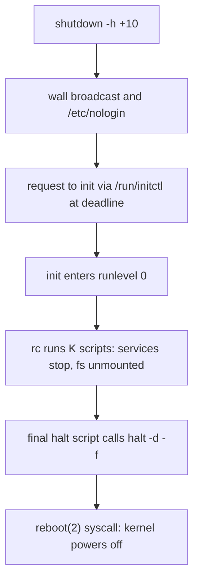

# shutdown, halt, reboot, poweroff — Controlled Shutdowns

## Overview

Bringing a Unix system down safely is a coordinated dance between userspace tools, the init system, service stop scripts, the filesystem layer, and finally the kernel. In a classic sysvinit system this dance is orchestrated by four commands that look interchangeable but operate at different layers: `shutdown(8)`, `halt(8)`, `reboot(8)`, and `poweroff(8)`. Understanding exactly what each one does — and, more importantly, what each one *skips* — is core operations knowledge: choosing the wrong one at the wrong moment is a reliable way to lose data or corrupt a filesystem.

The key architectural insight is that there are two fundamentally different shutdown paths. The *polite* path goes through init: `shutdown(8)` asks PID 1 to change runlevel to 0 (halt/poweroff) or 6 (reboot), init executes the full stop sequence from `/etc/rc0.d/` or `/etc/rc6.d/`, and only after every service has been stopped and every filesystem unmounted does the final script invoke the kernel. The *blunt* path bypasses all of it: `reboot -f` calls the `reboot(2)` system call directly, skipping service shutdown, syncing semantics aside, unmounting, and bookkeeping. Both paths have legitimate uses, and knowing when each is justified is exactly the kind of judgment interviewers probe for.

This page walks the full chain — from the wall broadcast and `/etc/nologin` enforcement of a scheduled shutdown, through the K-script runlevel sequence, down to the `reboot(2)` syscall and the magic SysRq escape hatches. It also covers the systemd compatibility story, because on modern distributions these same command names are now wrappers around `systemctl`, and scripts that rely on their behavior keep working only because that mapping is maintained deliberately.

## The Shutdown Chain: shutdown(8) to init to rc to the Kernel

The canonical sequence for a clean, scheduled shutdown looks like this:

```text
operator                     init (PID 1)                 rc / services            kernel
   |                             |                             |                     |
   |  shutdown -h +10 "message"  |                             |                     |
   |--------------------------->|                             |                     |
   |    wall broadcasts start    |                             |                     |
   |    /etc/nologin created     |                             |                     |
   |                             |  at deadline: switch to     |                     |
   |                             |  runlevel 0 via /run/initctl|                     |
   |                             |-------------------------- ->|                     |
   |                             |      rc 0: K01..K99 stop    |                     |
   |                             |      services, umount,      |                     |
   |                             |      remount / read-only    |                     |
   |                             |                             |  final script runs  |
   |                             |                             |  halt/reboot with   |
   |                             |                             |  -f (reboot(2))     |
   |                             |                             |-------------------->|
   |                             |                             |     power off or    |
   |                             |                             |     warm reboot     |
```

Three facts about this chain deserve emphasis:

1. **shutdown(8) never stops services itself.** It only announces, blocks logins, waits for the deadline, and then signals init. All real work happens in the runlevel change.
2. **The signal to init travels through the init control FIFO.** Modern sysvinit (3.x) uses `/run/initctl`; legacy systems used `/dev/initctl`. Tools such as `telinit(8)` write structured requests into this FIFO — a runlevel change request is exactly what `shutdown` sends, just with a delayed delivery time.
3. **The last user-visible step is a script, not a syscall.** The kernel is asked to power off or reboot only after the final rc script (Debian's `/etc/init.d/halt` or `/etc/init.d/reboot`) has finished. Everything before that is plain shell.

The same chain in diagram form:



If any step in the middle hangs (a service's stop action blocking, an unmountable NFS filesystem), the shutdown stalls *before* the kernel is ever involved. That is the practical difference from `reboot -f`, which never stalls because it never asks anyone.

## shutdown(8) in Depth

`shutdown(8)` is the only entry point you should use for interactive, scheduled, or multiuser shutdowns. It is responsible for four things: warning users, blocking new logins, waiting for the requested time, and then handing a runlevel-change request to init.

### Option Matrix

| Option | Meaning | Notes |
|--------|---------|-------|
| `-h` | Halt or power off | Action depends on how the system's halt path is configured; historically the default for "bring it down" |
| `-P` | Power off | Explicit request that the machine lose power, not merely halt |
| `-H` | Halt | Stop the OS and leave the machine powered on at a firmware/console prompt |
| `-r` | Reboot | Runlevel 6 instead of 0; the full stop sequence still runs first |
| `-c` | Cancel | Cancels a pending shutdown; removes `/etc/nologin` |
| `-k` | Fake | Sends only the wall warnings; no runlevel change, no `/etc/nologin` |
| `-f` | Fast boot | Skip the boot-time `fsck` by creating the `/fastboot` flag file (legacy — see below) |
| `-F` | Force fsck | Create `/forcefsck` so the next boot checks all filesystems (legacy) |
| `-t SEC` | Grace period | Older releases document a delay handed to init between warning processes and killing them; treat as legacy |
| `time` | When | `now`, `+m` (minutes from now), or `hh:mm` (today or tomorrow if already past) |
| `message` | Broadcast text | Appended to every wall warning; quote it — it is one argument |

Two usage patterns cover almost all real operations:

```sh
shutdown -r +5 "Kernel patch applied, rebooting in 5 minutes"
shutdown -h now "Storage maintenance window"
```

### Scheduling, Cancellation, and the Wall Broadcast

When you run `shutdown -h +30`, the command does not sit in your foreground waiting. It daemonizes: a helper process holds the scheduled deadline, periodically broadcasts the countdown to all logged-in users, and at the deadline writes the runlevel-change request into the init control FIFO. Warning messages go out through `wall(1)`-style delivery — a header line identifying the source plus your custom message — to every terminal that permits writes (see the etiquette section below).

`shutdown -c` cancels a pending shutdown. It stops the countdown daemon, broadcasts a cancellation notice, and — critically — removes `/etc/nologin` so users can log in again. If instead you kill the shutdown process by hand (or it dies), the cancellation artifacts are *not* cleaned up: a stale `/etc/nologin` will keep rejecting non-root logins via `pam_nologin` until someone deletes it or the boot-time cleanup script removes it. This is a classic troubleshooting trap: "scheduled a shutdown, cancelled it the hard way, now nobody can log in."

### /etc/nologin and pam_nologin

For a scheduled (not immediate) shutdown, `shutdown` creates `/etc/nologin`. While that file exists:

- `pam_nologin(8)`, which sits in the `auth`/`account` stack of most login services, rejects any non-root login and typically shows the file's contents as the rejection message. An empty file yields a bare denial.
- Root can still log in — deliberately, so an administrator can finish emergency work before the deadline.
- Graphical display managers that honor pam_nologin similarly refuse new sessions.

The invariant to remember: **`/etc/nologin` is created for scheduled shutdowns, removed on `-c` cancellation, and many distributions ship a boot-time cleanup (Debian historically via the `rmnologin` init script) that deletes any stale copy left over from an aborted shutdown.** If logins mysteriously fail on a freshly rebooted box, `ls -l /etc/nologin` is a ten-second diagnostic.

### fastboot and forcefsck: Legacy Flag Files

The `-f` and `-F` options work by planting marker files for the *next* boot: `/fastboot` tells the boot scripts to skip filesystem checks, `/forcefsck` forces a full check. This mechanism belongs to the classic rc-based boot: the boot scripts that run `fsck -A` honored those files. Caveats worth stating in an interview:

- On systemd systems these files are ignored; the equivalent is the kernel command line (`fsck.mode=skip` / `fsck.mode=force`), and systemd's fsck units read that instead.
- Even on sysvinit systems, whether the flag files are honored depends on the distribution's boot scripts, so `-f` is best treated as a historical mechanism rather than a guarantee. Skipping fsck after an unclean shutdown trades boot time for risk; the ext4 journal mostly bounds the damage, but it is not a free lunch.

### What Gets Logged

Runlevel changes are recorded by init as `RUN_LVL` records in `utmp` and `wtmp`; tools like `last -x` surface them as `runlevel` and `shutdown` pseudo-entries. `halt(8)` normally writes the final shutdown record into `wtmp` itself (suppress that with `-d`, which the final rc scripts do because the bookkeeping already happened). If you audit "when did this machine go down" with `last -x`, you are reading exactly these records — see [utilities.md](./utilities.md) for the reader tools.

## halt, reboot, poweroff — One Program, Many Names

On a sysvinit system, `halt(8)`, `reboot(8)`, and `poweroff(8)` are the same program multiplexed by `argv[0]`. The name selects the default action: `halt` stops the system, `reboot` restarts it, `poweroff` is `halt` with the power-off request added (historically `halt -p`). This is why their man pages are one page, and why scripts that call any of the three names behave consistently.

### The Critical Rule: Called While the System Is Up, They Defer to shutdown

Per `halt(8)`: **if halt or reboot is called when the system is not in runlevel 0 or 6, it invokes `shutdown(8)` instead.** This is the safety net most people rely on without knowing it. A user typing `reboot` in runlevel 3 does not immediately bounce the machine; they trigger the polite path — wall warning, `/etc/nologin`, runlevel change through init, full K-script sequence. The low-level behavior only happens directly when:

- the system is already in runlevel 0 or 6 (i.e., the final rc script calls `halt`/`reboot` itself, typically with `-d -f`), or
- you pass `-f`, explicitly ordering the bypass.

### Option Matrix

| Option | Meaning | Notes |
|--------|---------|-------|
| `-f` | Force | Do not invoke shutdown; call the `reboot(2)` syscall path directly. The blunt instrument. |
| `-n` | No sync | Skip the `sync(2)` before the syscall. Almost always a mistake; exists for special cases like NFS root. |
| `-w` | wtmp only | Write the shutdown record to wtmp and exit. The "dry-run" halt — useful for bookkeeping without action. |
| `-d` | No wtmp | Do not write the wtmp record (used by the final rc scripts, which run after init already recorded the runlevel change). |
| `-p` | Power off | Makes `halt` behave like `poweroff`. Default behavior of the `poweroff` name. |
| `-i` | Interfaces down | Bring network interfaces down just before halting/rebooting. |
| `-h` | Drives standby | Place hard disks in standby before halt/power-off (power management era). |

### reboot -f: The Direct Syscall Path

`reboot -f` skips init entirely and calls the kernel's `reboot(2)` system call (after an ordinary `sync`, unless `-n` is also given). What you lose, in order:

1. **Service stop sequence** — daemons get no SIGTERM, no chance to flush state, close databases cleanly, or deregister from clusters. Everything after the sync is "power cord" semantics.
2. **Filesystem teardown** — no unmounts, no remounting root read-only. The kernel sync makes the on-disk state *mostly* consistent (page cache flushed), but journal replay, orphan inode cleanup, and possible fsck runs await the next boot.
3. **Session bookkeeping** — no wtmp shutdown record; `last` output will show boots without matching shutdowns.

When is it justified?

- **NFS-root and diskless systems**: the local "root filesystem" cannot be remounted read-only by normal means; the standard stop sequence can hang.
- **Init is dead or wedged**: if PID 1 is unresponsive, nothing polite remains.
- **Embedded/fast-path reboot**: where the boot firmware and application design assume dirty reboots and the storage is designed for it (journalled fs, no rotating media).

The kernel-side even more brutal cousin is `echo b > /proc/sysrq-trigger` — see the SysRq section below. Neither syncs anything; they are for "the system is beyond talking."

## What Happens in Runlevel 0 and 6

When init switches to runlevel 0 (or 6), it executes `/etc/init.d/rc 0` (or `rc 6`). The rc script diffs the previous runlevel's script set against the new one and runs, in ascending sequence order, every K script that must fire. For runlevel 0 that is effectively the entire stop inventory:

```text
/etc/rc0.d/  (Debian-style, sequence numbers assigned by update-rc.d/insserv)
  K01*       earliest-stopped services (often the newest, least-depended-on daemons)
  K0*        databases, queues, and anything holding open files on /var
  K7*..K8*   network services, then the network itself
  K9*        late teardown: sendsigs (mass-kill via killall5), umountfs (swapoff,
             unmount all non-root filesystems), umountroot (remount / read-only)
  K9*halt    the final script: /etc/init.d/halt -> halt -d -f [-p]
```

Representative contents of that final script's logic (simplified from Debian's `/etc/init.d/halt`):

```sh
# What the final halt script effectively does:
#   1. Decide poweroff vs plain halt (from INIT_HALT and /etc/default/halt).
#   2. Decide whether to down interfaces (-i unless NETDOWN=no).
#   3. Invoke the real binary with the bypass flags:
halt -d -f -i -p        # -d no wtmp, -f direct syscall, -i ifdown, -p power off
```

Ordering details that matter:

- **Swap goes off before unmounts** (Debian's `umountfs` does `swapoff -a` first) — swap devices must not be busy when filesystems come down.
- **Root is never unmounted; it is remounted read-only** (`umountroot`), so the superblock is clean at power-off.
- **Mass process kill is a K script too** (`sendsigs`): it uses `killall5(8)` — SIGTERM to everything outside its own session, wait, then SIGKILL, honoring the omit-list in `/run/sendsigs.omit*` — see [utilities.md](./utilities.md).
- **Storage stacks tear down late**: md/DM arrays are stopped after their member filesystems are unmounted but before root goes read-only.
- The **exact K-numbers are computed**, not hand-maintained: with dependency-based booting, insserv derives ordering from LSB headers (see [parallel-booting.md](./parallel-booting.md) and [rc-symlinks.md](./rc-symlinks.md)), and the numbers in `/etc/rc0.d/` are bookkeeping that mirrors that computed order.

Runlevel 6 is the same flow with two differences: the final script is `/etc/init.d/reboot`, and after `reboot(2)` the kernel warm-reboots instead of cutting power. Because the *stop* path is identical, a system that reboots cleanly has already proven its shutdown path — a useful testing shortcut discussed in [custom-init-scripts.md](./custom-init-scripts.md).

## ctrlaltdel, kbrequest, and the Power Button

init owns two keyboard-driven hooks configured in `/etc/inittab` (full treatment in [inittab.md](./inittab.md)):

- **ctrlaltdel**: run when init receives the Ctrl-Alt-Del key sequence on the console. Debian's stock line is `ca:12345:ctrlaltdel:/sbin/shutdown -t1 -a -r now` — note it routes through `shutdown`, so Ctrl-Alt-Del inherits all the polite behavior (broadcast, nologin, runlevel sequence). The `-a` flag makes shutdown consult `/etc/shutdown.allow`: only listed users may trigger the action on a shared console.
- **kbrequest**: runs a command when init receives the keyboard-signal event bound to Alt-UpArrow in the console keymap. Rarely used, but it demonstrates that init treats the console as a control surface, not just a place to spawn getties (see [getty-terminals.md](./getty-terminals.md)).

The ACPI power button is a *different* mechanism entirely: it is a kernel event delivered to userland (typically `acpid`), whose handler script decides what to run — commonly `shutdown -h now`. It never involves inittab, which is why a system without acpid ignores the button in sysvinit land. On systemd systems the same event is handled by logind with its own policy (`HandlePowerKey=`).

## Emergency Shutdown: Magic SysRq and the Last Resort

When the system is so wedged that even `reboot -f` cannot be typed or executed, the kernel's Magic SysRq facility remains, provided it was not disabled at boot (`/proc/sys/kernel/sysrq`, bitmask-configurable, commonly enabled by default on distributions).

The canonical emergency sequence is **REISUB**, typed as Alt+SysRq+letter on a console (or written to `/proc/sysrq-trigger`):

| Step | Key | Effect |
|------|-----|--------|
| R | unRaw | Take keyboard back from a program that grabbed it raw |
| E | tErminate | SIGTERM to all processes except init |
| I | kIll | SIGKILL to all processes except init |
| S | Sync | Flush dirty pages to disk |
| U | Unmount | Remount all mounted filesystems read-only |
| B | reBoot | Immediate reboot, no further userspace involvement |

`echo b > /proc/sysrq-trigger` is the B step alone: instant reboot with zero userspace cooperation and zero sync. `echo o` powers off instead. These are kernel-side actions; they work when every process — including your shell — is unkillable-waiting on storage.

The userspace last resort, when the console is responsive but init is not:

```sh
sync; sync; reboot -f
```

Why the syncs matter: the Linux page cache holds dirty file data and metadata indefinitely until writeback or `sync(2)` flushes it. A reboot without sync discards everything not yet written — not just "recent edits," but potentially the *majority* of what a busy system has buffered. Each `sync` blocks until outstanding data is handed to the storage layer (or at least to a journalling layer that can reconstruct it). After an unclean reboot, expect: ext4/xfs journal replay on first mount, orphan inode cleanup, possible forced fsck if the superblock's dirty state was in flight, and — for anything not journalled — real corruption risk. The full recovery context lives in [../../admin/rescue.md](../../admin/rescue.md) and [single-user-sulogin.md](./single-user-sulogin.md).

## Wall Messages and Shutdown Etiquette on Multiuser Systems

On a shared server, the shutdown broadcast *is* the user interface for the operation. The mechanics:

- `wall(1)` reads a message from a file operand or stdin and writes it to the terminal of every user currently logged in, prefixing a banner identifying the sending user and tty.
- It discovers targets by scanning `utmp` for active sessions, then attempts to open each terminal device. Terminals whose owner has run `mesg n` reject the write — `mesg(1)` toggles the write-permission bit on your tty, and `wall`, `write(1)` and friends honor it. Root bypasses the permission check, so the operator's announcement always lands even if users have silenced each other.
- `shutdown` composes its warnings on top of this: countdown messages plus your custom text. A good message states *what*, *when*, and *who to contact* — the wall equivalent of a change ticket.

Etiquette rules that map directly to commands:

- Prefer a window over `now` for anything with interactive users; `+30` or `hh:mm` gives people time to save and detach (screen/tmux sessions survive, of course).
- Use `-k` to rehearse the broadcast without committing to the shutdown — useful for validating the message and seeing who is logged in.
- Remember the `-c` path exists and that cancelling is cheaper than rebooting into a mistake.
- For single-target notification instead of broadcast, `write(1)` sends to one tty; `wall` is the system-wide instrument.

On systemd systems this etiquette is preserved: `systemctl poweroff` performs its own wall broadcast before starting the shutdown transaction, and `wall(1)` itself is still shipped and usable.

## systemd Compat: Same Names, New Engine

Systemd ships deliberately compatible implementations of all four commands. When `/sbin/shutdown`, `halt`, `reboot`, and `poweroff` come from systemd (via the `systemd-sysv` compatibility packaging on Debian), they map onto manager operations rather than runlevel changes:

| Classic invocation | What systemd actually does |
|--------------------|-----------------------------|
| `shutdown -h now` / `poweroff` | `systemctl poweroff` — poweroff.target transaction |
| `shutdown -r now` / `reboot` | `systemctl reboot` — reboot.target transaction |
| `shutdown -h +10 "msg"` | Scheduled logind shutdown with wall warnings and `/etc/nologin` honored via pam_nologin |
| `shutdown -c` | Cancels the scheduled logind shutdown |
| `halt` | `systemctl halt` |
| `telinit N` | Mapped to the equivalent target switch (see [targets-runlevels.md](../systemd/targets-runlevels.md)) |
| `runlevel` | Reads systemd's utmp emulation, or `systemctl get-default` natively |

The consequences: init scripts and runbooks calling these names keep working unchanged (the migration story in [migration-modern.md](./migration-modern.md) depends on this), but the *internals* differ — there is no runlevel 0/6, no rc scripts, and the stop sequence is a dependency-graph transaction with per-unit timeouts rather than an ordered K-script run. The wrapper layer is why "we call `shutdown -h +5` in cron" survives a distro migration intact.

## Interview Questions

### Q: A user with a plain shell account runs `reboot` on a system in runlevel 3. What actually happens?

`reboot(8)` checks the current runlevel first. Because the system is not in runlevel 0 or 6, it does **not** touch the `reboot(2)` syscall — it invokes `shutdown(8)` instead. That means: wall warning, `/etc/nologin` creation (blocking non-root logins), the requested timing honored, and a runlevel change through init with the full K-script sequence. Only `reboot -f` would have bypassed all of it, and on well-configured systems plain users cannot execute it anyway (the direct path needs the privileges `reboot(2)` requires). The interview point: the safe default behavior is baked into the tool, not into permissions.

### Q: How do you cancel a scheduled shutdown, and what artifact must be verified afterward?

`shutdown -c`. The cancellation broadcast goes out and shutdown removes `/etc/nologin` itself. Verify with `ls -l /etc/nologin` — if you cancelled by killing the shutdown process instead of using `-c`, that file is left behind and `pam_nologin` will keep rejecting non-root logins until it is removed (or a boot-time cleanup script such as Debian's historical `rmnologin` deletes it). Also confirm the wall cancellation actually reached users' terminals; users with `mesg n` may never have seen either message.

### Q: What writes /etc/nologin, when is it removed, and what enforces it?

`shutdown(8)` creates it when scheduling a future shutdown, so that non-root logins are blocked while the countdown runs. It is removed when the shutdown is cancelled with `-c`, and many distributions clear stale copies early in boot. Enforcement is in PAM: `pam_nologin(8)` sits in the login service stack and rejects non-root authentication while the file exists, typically displaying its contents as the denial message. Root is exempt by design so administrators can work up to the deadline.

### Q: What does reboot -f skip, when is it the right tool, and what will the next boot look like?

It skips everything between your shell and the kernel: no runlevel change, no service stop, no unmounts, no wtmp record. It syncs (unless `-n`) and calls `reboot(2)` directly. Right tool when init is unresponsive, on NFS-root/diskless systems where the normal teardown cannot complete, or on embedded systems designed for dirty reboots. The next boot brings journal replay, orphan cleanup, possibly a forced fsck, and `last` output showing a boot with no matching shutdown record. Data in flight at sync time is safe; anything after the last writeback and before the syscall is gone.

### Q: Explain the difference between shutdown -h now, halt, and halt -f.

`shutdown -h now` is the full polite path: runlevel 0 via init, every K script, filesystems down, then the final script calls the low-level binary with `-f`. `halt` typed interactively detects the system is not in runlevel 0/6 and *becomes* `shutdown -h`, so it is effectively the same. `halt -f` is the only genuinely different one: it executes immediately — sync, `reboot(2)`, done — with no service stop and no unmount. On hardware where `halt` without `-p` leaves the machine powered at a firmware prompt, `poweroff` (or `halt -p`) is the variant that actually removes power.

### Q: Why does the final rc script call halt with -d -f instead of just running reboot(2)?

Two reasons. `-f` because the system is already in runlevel 0 — calling shutdown again would be a loop, and the bypass syscall is exactly what the script wants. `-d` because the wtmp bookkeeping for the runlevel change has already been written by init; writing a second record would duplicate `last -x` output. The script exists as a *script* (rather than exec'ing the syscall from init) so distributions can layer policy — poweroff vs halt defaults from `/etc/default/halt`, interface teardown, hardware workarounds — at the very last moment.

## References

- [shutdown(8) — sysvinit](https://manpages.debian.org/bookworm/sysvinit-core/shutdown.8.en.html)
- [halt(8) — sysvinit](https://manpages.debian.org/bookworm/sysvinit-core/halt.8.en.html)
- [init(8) — sysvinit](https://manpages.debian.org/bookworm/sysvinit-core/init.8.en.html)
- [telinit(8) — sysvinit](https://manpages.debian.org/bookworm/sysvinit-core/telinit.8.en.html)
- [wall(1) — bsdutils](https://manpages.debian.org/bookworm/bsdutils/wall.1.en.html)
- [mesg(1) — util-linux](https://manpages.debian.org/bookworm/util-linux/mesg.1.en.html)
- [runlevel(8) — sysvinit](https://manpages.debian.org/bookworm/sysvinit-core/runlevel.8.en.html)

## Cross-References

- [inittab.md](./inittab.md) — where ctrlaltdel, kbrequest, and the runlevel entries live.
- [runlevels.md](./runlevels.md) — what runlevels 0 and 6 mean and how switches are computed.
- [single-user-sulogin.md](./single-user-sulogin.md) — the recovery path when shutdown goes wrong and the system will not come back up.
- [utilities.md](./utilities.md) — killall5/sendsigs, last(1), wtmp records, and the other tools this page leans on.
- [parallel-booting.md](./parallel-booting.md) — how K-script ordering is computed in dependency-based booting.
- [custom-init-scripts.md](./custom-init-scripts.md) — writing stop actions that survive this sequence.
- [../systemd/targets-runlevels.md](../systemd/targets-runlevels.md) — the target-based successor to runlevels 0 and 6.
- [../../admin/rescue.md](../../admin/rescue.md) — rescue-mode context for emergency shutdowns and recovery.
- [../README.md](../README.md) — the init-systems section hub.
