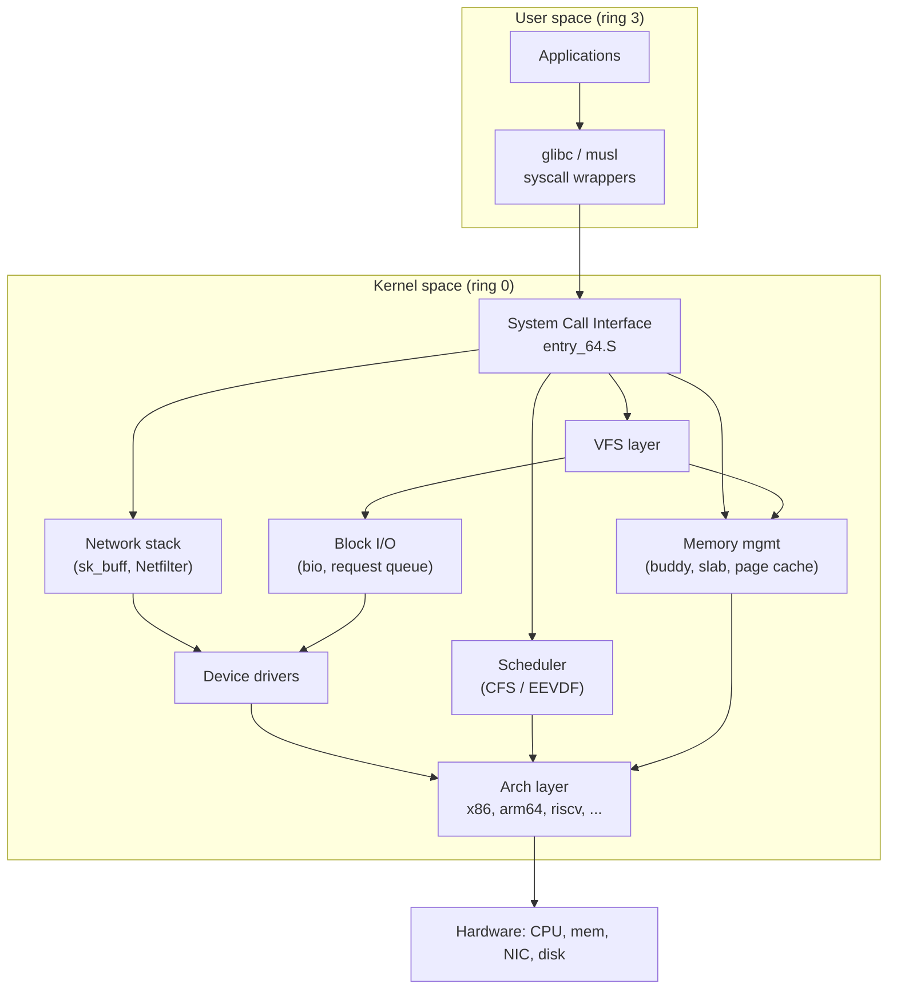
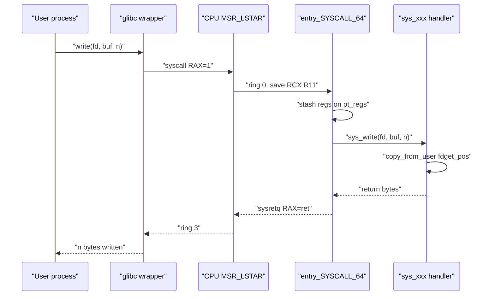
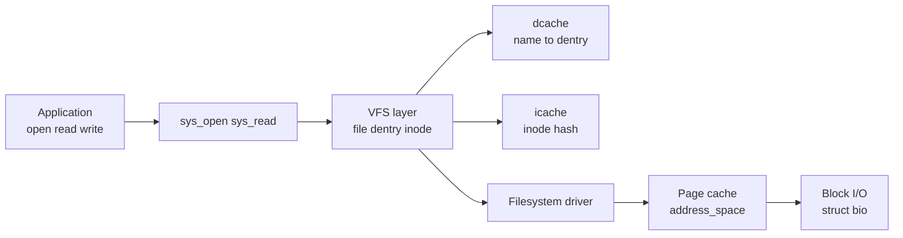
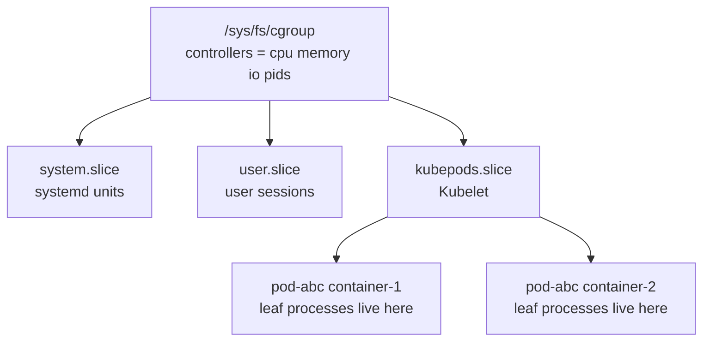
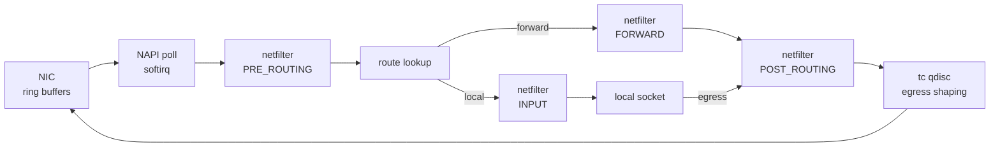

# Linux Internals — Section Integrator

> *"The kernel is, in many ways, the heart of an operating system; it is the
> layer that sits between hardware and applications and provides the
> abstractions that make modern software possible."* — Bovet & Cesati,
> *Understanding the Linux Kernel* (3rd ed., O'Reilly, 2005).

This page is the **section-level integrator** for the "Linux Internals" group
of topics listed in [Section 7 of the index](../index.md). The
[Linux track](./README.md) already contains a large tree of dedicated chapters
— `src/linux/kernel/`, `src/linux/containers/`, `src/linux/sysprog/`,
`src/linux/networking/`, `src/linux/debugging/`, `src/linux/observability/` —
plus the conceptual [Operating Systems](../os/overview.md) section. The job of
this page is **not** to duplicate those chapters but to weave them together:
for each subsystem you get the design intent, the dominant data structures,
the place to look in the source tree, and a link to the deep-dive page.

> **Reading order.** [Kernel Overview](./kernel/overview.md) →
> [Kernel Architecture](./kernel/architecture.md) → this page → per-subsystem
> chapters via the cross-references. A typical interview question looks like
> *"a process calls `write()` on an ext4 file over NVMe — trace the path and
> tell me where it could block"*. To answer you must connect the **syscall
> entry path**, **VFS**, **page cache / writeback**, **block I/O**, and the
> **device driver** — exactly the spine this page lays out.

## 1. Kernel architecture stack

The Linux kernel is **monolithic with loadable modules**: the scheduler,
memory manager, VFS, network stack, and device drivers all run in kernel
space (ring 0 on x86, EL1 on ARM) sharing one address space, but drivers and
filesystems can be loaded as `.ko` objects at runtime. Linus Torvalds
famously defended this choice against Andy Tanenbaum in the 1992
[Tanenbaum–Torvalds debate](https://en.wikipedia.org/wiki/Tanenbaum%E2%80%93Torvalds_debate);
the practical justification is that direct function calls inside the kernel
are 1–2 orders of magnitude faster than the message-passing IPC a microkernel
would require (Love, *Linux Kernel Development*, 3rd ed., Addison-Wesley
2010, Ch. 1).

The detail page for this diagram is
[Kernel Architecture](./kernel/architecture.md); module loading is in
[Kernel Modules](./kernel/modules.md); the boot sequence that brings this
stack online is in [Boot Process](./kernel/boot-process.md).

## 2. System call mechanism

System calls are the only sanctioned doorway from ring 3 to ring 0. On
x86-64 the kernel registers a handler via the `MSR_LSTAR` MSR; glibc emits
the `syscall` instruction, the CPU raises the privilege level, saves the user
instruction pointer into `RCX` and the flags into `R11`, and jumps to
`entry_SYSCALL_64`. The kernel reads the syscall number from `RAX`, indexes
into `sys_call_table[]`, copies user arguments through `copy_from_user()` /
`get_user()` (which fault safely), invokes the handler, and returns via
`sysretq`. The full table of syscall numbers across ABIs is in
[syscall-table.md](./reference/syscall-table.md); the kernel-internal
mechanics live in
[kernel/core/processes/system-calls.md](./kernel/core/processes/system-calls.md);
the conceptual OS treatment is in [OS § syscalls](../os/processes/ipc.md).

Key interview points: the `syscall` instruction is a single fast-path trap
(replacing the legacy `int 0x80`), Spectre/Meltdown mitigations add a **KPTI**
trampoline that switches page tables on entry/exit
([page-table isolation](./performance/page-table-isolation.md)), and
**seccomp-BPF** filters can short-circuit a syscall **before** the handler
runs ([seccomp](./security/seccomp.md),
[seccomp-bpf](./containers/seccomp-bpf.md)). **ptrace** is the userspace
debugger interface that hooks syscall entry/exit (`PTRACE_SYSCALL`,
`PTRACE_O_TRACESYSGOOD`); it is the basis of `strace` and is covered in
[strace-ltrace](./debugging/strace-ltrace.md).

## 3. Process scheduling: CFS and EEVDF

Since 2.6.23 (2007) the default Linux scheduler has been the **Completely
Fair Scheduler** (CFS), which approximates ideal fair sharing by tracking
each task's `vruntime` — CPU time normalized by weight — and picking the
runnable task with the smallest `vruntime`. Tasks live in a per-CPU
red–black tree keyed by `vruntime` (Bovet & Cesati, Ch. 7; Love, Ch. 4).

In **Linux 6.6** (October 2023) CFS was replaced by **EEVDF** — *Earliest
Eligible Virtual Deadline First* — designed by Peter Zijlstra. EEVDF keeps
the `vruntime` fairness idea but adds two concepts:

- **Eligibility** — a task is runnable only if it has not consumed more than
  its fair share,
- **Virtual deadline** — `deadline_i = eligibility_time + request_i`, where
  the request length is inversely proportional to the task's weight.

The scheduler picks the eligible task with the earliest deadline. This gives
principled latency bounds for interactive tasks, removes CFS's sleeper-bonus
abuse, and lets a task request a *latency hint* via `sched_setattr()`. The
algorithm derives from Stoica & Abdel-Wahab (1995); see LWN's
[EEVDF merge coverage](https://lwn.net/Articles/925371/) and the in-tree
chapter [EEVDF Scheduler](./kernel/processes/eevdf.md). CFS background:
[CFS](./kernel/processes/cfs.md), [OS § Linux CFS](../os/scheduling/linux-cfs.md).

| Aspect | CFS (2.6.23 → 6.5) | EEVDF (6.6+) |
|--------|--------------------|--------------|
| Selection rule | Min `vruntime` | Earliest virtual deadline among eligible |
| Latency control | Single `sched_min_granularity_ns` | Per-task request / weight + `sched_latency` |
| Wakeup preemption | Heuristic (`sched_wakeup_granularity`) | Deadline-based, no magic numbers |
| Sleeper bonus | Yes (exploitable) | Removed |
| Real-time theory | Empirical | Provable fairness + latency bounds |
| `nice` weight | `prio_to_weight[]` | Same table, plus deadline scaling |

Other scheduler classes (`sched_deadline`, `sched_rt`, `sched_ext`) coexist
with EEVDF — see [Scheduler overview](./kernel/processes/scheduler.md) and
[sched_ext guide](./kernel/processes/sched-ext-guide.md).

## 4. Memory management

Linux memory management is a four-layer pipeline: **zones → buddy allocator →
slab allocator → page cache / anonymous pages**, all coordinated by the
**reclaim** machinery.

### 4.1 Buddy allocator and zones

Physical memory is split into **zones** (`ZONE_DMA`, `ZONE_DMA32`,
`ZONE_NORMAL`, `ZONE_MOVABLE`, `ZONE_DEVICE`) and managed by the **buddy
allocator** in `mm/page_alloc.c`. Free pages are tracked in `struct zone`
free-area lists, one per order \\( 0 \ldots 10 \\) so the smallest allocation
is one 4 KiB page and the largest is \\( 2^{10} \cdot 4\,\text{KiB} = 4\,\text{MiB} \\).
Allocating order \\( k \\) when only order \\( k+1 \\) is free splits the block
in half and pushes the buddy back; freeing coalesces buddies when both halves
are free. Detail: [Page Allocator](./kernel/memory/page-allocator.md),
[OS § Buddy System](../os/memory/buddy-system.md).

### 4.2 Slab / SLUB / SLOB

For small fixed-size objects (`task_struct`, `inode`, `dentry`, `skb`) the
buddy allocator is far too coarse. Linux stacks a **slab allocator** on top:
`kmem_cache_create()` makes a cache for a given object type, and the
allocator hands out objects from per-CPU partial slabs. Three backends ship:

| Allocator | Default since | Layout | Strength | Weakness |
|-----------|---------------|--------|----------|----------|
| **SLAB**  | 2.0 (1996)    | Complex per-CPU arrays + shared queues | Feature-rich, NUMA-aware | High metadata overhead |
| **SLUB**  | 2.6.22 (2007) | Per-CPU page + per-node partial lists | Simple, scalable, good sysfs | Less queueing metadata |
| **SLOB**  | —             | First-fit free list | Tiny (~600 LOC), for embedded | Slow, no NUMA |

`CONFIG_SLAB`/`CONFIG_SLUB`/`CONFIG_SLOB` selects the backend; SLUB is the
universal default. Full deep dive:
[Slab Allocator](./kernel/memory/slab-allocator.md), [OS § Slab](../os/memory/slab-allocator.md).
`kmalloc()`/`kfree()` is the generic front-end, mapping each size to the
nearest `kmalloc-<size>` cache — see
[vmalloc vs kmalloc](./kernel/memory/vmalloc-kmalloc.md).

### 4.3 Page cache and writeback

Every regular file read goes through the **page cache** — an `address_space`
tree of `struct page` indexed by file offset. `read()` either finds the page
in the XArray or issues a `readpage()` to the filesystem. `write()` copies
into a cached page and marks it **dirty**; actual disk I/O is deferred to the
**writeback** path (per-BDI `writeback` threads in `mm/backing-dev.c`). The
dirty ratio, dirty background ratio, and `dirty_expire_centisecs` tune when
writeback fires. Detail: [Page Cache](./kernel/memory/page-cache.md),
[Writeback](./kernel/memory/writeback.md), [Buffer Cache](./kernel/memory/buffer-cache.md).

> **Interview trap.** `fsync()` does **not** flush the page cache — it forces
> writeback and waits for the device to confirm the blocks are durable. The
> page cache stays warm. See [journaling](./kernel/filesystems/journaling.md)
> for why a journal `commit` block is needed for crash consistency.

### 4.4 Page tables, TLB, and huge pages

Linux uses the architecture's multi-level page table: 4 levels on x86-64
(`PGD → PUD → PMD → PTE`) and 5 levels with `CONFIG_X86_5LEVEL` (LA57). Each
level is 9 bits, so a 4 KiB page covers \\( 2^{12} \\) bytes and the canonical
48-bit virtual address splits as \\( 9 + 9 + 9 + 9 + 12 = 48 \\). The MMU
caches translations in the **TLB**; on a miss the hardware page-table walker
fills it. Kernel detail: [Paging](./kernel/memory/paging.md); OS theory:
[Page Tables](../os/memory/page-tables.md),
[Multi-level Page Tables](../os/memory/multi-level-page-tables.md),
[TLB](../os/memory/tlb.md).

**Huge pages** reduce TLB pressure by mapping 2 MiB or 1 GiB pages with a
single PTE — a 2 MiB page saves 512 PTE lookups. Two interfaces exist:
**explicit `hugetlbfs`** (pre-reserved pool, `mmap(MAP_HUGETLB)`) and
**Transparent Huge Pages (THP)** (`khugepaged` collapses 4 KiB into 2 MiB
automatically). THP trades TLB wins for higher allocation latency and 2 MiB
write-amplification in `fork()` CoW. Detail:
[Huge Pages](./kernel/memory/huge-pages.md), [OS § Huge Pages](../os/memory/huge-pages.md).

### 4.5 NUMA, reclaim, and swap

On multi-socket systems memory is **non-uniform**: local-node access is
fast, remote-node access is slow. Linux exposes NUMA topology via
`/sys/devices/system/node/`, `numactl`/`libnuma`, and policy flags
(`MPOL_BIND`, `MPOL_PREFERRED`, `MPOL_INTERLEAVE`). See
[kernel/memory/numa.md](./kernel/memory/numa.md),
[performance/numa.md](./performance/numa.md),
[OS § NUMA](../os/memory/numa.md). When free memory drops, `kswapd` and
direct reclaim scan the LRU lists (active/inactive, anon/file) and either
evict clean file pages, write dirty ones back, or push anonymous pages to
swap. `zswap` compresses swap pages in RAM, `zram` is an in-memory compressed
block device, and the **OOM killer** is the last resort
([Reclaim](./kernel/memory/reclaim.md), [Swap](./kernel/memory/swap.md),
[OOM Killer](./kernel/memory/oom-killer.md), [PSI](./kernel/processes/psi.md)).

## 5. Virtual File System (VFS)

VFS is the abstraction that lets `open("/etc/hosts")` and
`open("/proc/cpuinfo")` use the same syscall but reach completely different
backends — ext4 vs `procfs`. It defines four core objects:

| Object | Purpose | C type |
|--------|---------|--------|
| Superblock | Per-mount filesystem state | `struct super_block` |
| Inode | Per-file metadata | `struct inode` |
| Dentry | Directory entry / name cache | `struct dentry` |
| File | Per-open file descriptor | `struct file` |

Each object type carries an `ops` table (`super_operations`,
`inode_operations`, `dentry_operations`, `file_operations`) that the
underlying filesystem fills in. VFS resolves a path by walking dentries
(cached in the **dcache**), looks up the inode, and dispatches to the right
`file_operations`.

Deep dives: [VFS](./kernel/filesystems/vfs.md), [inode](./kernel/filesystems/inode.md),
[dentry](./kernel/filesystems/dentry.md), [mounting](./kernel/filesystems/mounting.md),
[superblock](./kernel/filesystems/superblock.md), [file-ops](./kernel/filesystems/file-ops.md),
[journaling](./kernel/filesystems/journaling.md), [OS § VFS](../os/filesystems/vfs.md).

### 5.1 Filesystem comparison

Linux ships dozens of filesystems; the four most discussed in interviews are
ext4, XFS, Btrfs, and ZFS (OpenZFS). Their trade-offs:

| Feature | ext4 | XFS | Btrfs | ZFS (OpenZFS) |
|---------|------|-----|-------|---------------|
| Origin | Linux (2008, ext2 lineage) | SGI IRIX (1993), ported 2001 | Oracle (2009) | Sun Solaris (2005) |
| Layout | Extent-based, H-tree dirs | Extent-based, B+ trees | B-trees, CoW | CoW, merkle trees, ARC |
| Journaling | Ordered / journal / writeback | Metadata journaling | CoW (no journal) | CoW ZIL (intent log) |
| Snapshot | No (LVM-level) | No (reflink in newer) | Yes (cheap, CoW) | Yes (cheap, CoW) |
| Checksums | Metadata only (optional) | Metadata only | Metadata + data (default) | Metadata + data |
| Pool / volume mgmt | No | No | Yes (subvolumes) | Yes (zpool, vdevs) |
| Best fit | General purpose, default rootfs | Large files, throughput | Workstations, snapshots | Storage appliances, integrity |

Per-filesystem chapters: [ext4](./kernel/filesystems/ext4.md),
[XFS](./kernel/filesystems/xfs.md), [Btrfs](./kernel/filesystems/btrfs.md),
[ZFS](./kernel/filesystems/zfs.md). Conceptual OS pages:
[ext4](../os/filesystems/ext4.md), [XFS](../os/filesystems/xfs.md),
[Btrfs](../os/filesystems/btrfs.md), [ZFS](../os/filesystems/zfs.md),
[journaling](../os/filesystems/journaling.md). Pseudo-filesystems:
[procfs](./kernel/filesystems/procfs.md), [sysfs](./kernel/filesystems/sysfs.md),
[/proc](./observability/proc.md), [sysfs](./observability/sysfs.md).

## 6. Namespaces and cgroups

Namespaces and cgroups are the two kernel features that make **containers**
possible. The mnemonic: *namespaces isolate what a process can see; cgroups
limit what it can use* (Biederman, "Namespaces in operation", LWN 2013,
[parts 1–6](https://lwn.net/Articles/531114/)).

### 6.1 Namespaces

| Namespace | isolates | clone(2) flag | unshare option |
|-----------|----------|---------------|----------------|
| **PID** | Process IDs (init = 1) | `CLONE_NEWPID` | `--pid` |
| **Net** | NICs, routes, sockets, netfilter | `CLONE_NEWNET` | `--net` |
| **Mount** | Mount tree | `CLONE_NEWNS` | `--mount` |
| **User** | UID/GID mapping | `CLONE_NEWUSER` | `--user` |
| **IPC** | System V IPC, POSIX MQs | `CLONE_NEWIPC` | `--ipc` |
| **UTS** | hostname, domainname | `CLONE_NEWUTS` | `--uts` |
| **Cgroup** | cgroup view | `CLONE_NEWCGROUP` | `--cgroup` |
| **Time** | `CLOCK_MONOTONIC`/`BOOTTIME` offsets | `CLONE_NEWTIME` | `--time` |

A new namespace is created via `clone(2)`, `unshare(2)`, or `setns(2)` with
the matching flag. `procfs` exposes `/proc/<pid>/ns/*` symlinks so you can
inspect what a process sees. Detail:
[kernel/processes/namespaces](./kernel/processes/namespaces.md),
[kernel/networking/namespaces](./kernel/networking/namespaces.md),
[kernel/filesystems/namespaces](./kernel/filesystems/namespaces.md),
[containers/cgroup-namespace](./containers/cgroup-namespace.md),
[OS § namespaces](../os/containers/namespaces.md).
**Overlay filesystems** (the storage layer for Docker/Podman images) live in
[overlayfs](./kernel/filesystems/overlayfs.md); container internals are in
[containers/overview](./containers/overview.md) and
[containers/primitives](./containers/primitives.md).

### 6.2 Cgroups v1 vs v2

**cgroups v1** shipped in 2.6.24 (2008); each controller (`cpu`, `memory`,
`blkio`, `net_cls`, `devices`, `pids`, …) got its **own** hierarchy mounted
under `/sys/fs/cgroup/<controller>/`. A process could be in different
cgroups for different controllers, making the "effective group" ambiguous.

**cgroups v2** (merged 4.5, default in modern distros with systemd) uses a
**single unified hierarchy**. Controllers are enabled per-subtree via
`cgroup.subtree_control`, processes live only in leaf cgroups (or in
`threaded` mode), and delegation to unprivileged users is safe. v2 also adds
**PSI** (Pressure Stall Information) and BPF-driven controllers. Full
treatment: [cgroups v2](./containers/cgroups-v2.md),
[kernel/processes/cgroups.md](./kernel/processes/cgroups.md),
[OS § cgroups](../os/containers/cgroups.md).

| Aspect | cgroups v1 | cgroups v2 |
|--------|-----------|-----------|
| Hierarchy | One per controller | Single unified |
| Process placement | In multiple groups at once | Only in leaf (or threaded) |
| Delegation | Unsafe, complex | Safe, simple |
| Threaded cgroups | Limited | First-class |
| PSI metrics | ❌ | ✅ |
| BPF-driven controllers | ❌ | ✅ (`cgroup_skb`, `cgroup_sock`) |
| `systemd` default | Legacy | Modern (`systemd.unified_cgroup_hierarchy=1`) |

### 6.3 Capabilities, seccomp, and LSMs

Three more mechanisms harden the syscall boundary. **Capabilities** split root into ~40 distinct rights (`CAP_NET_BIND_SERVICE`, `CAP_SYS_ADMIN`, …) — [capabilities](./security/capabilities.md), [OS § capabilities](../os/security/capabilities.md). **seccomp-BPF** lets a process install a BPF filter that decides per syscall whether to allow, kill, or `errno` it — the basis of container syscall whitelisting ([seccomp](./security/seccomp.md), [seccomp-bpf](./containers/seccomp-bpf.md)). **LSMs** (SELinux, AppArmor, Smack, Landlock, BPF-LSM) hook security decisions inside the kernel — [SELinux](./security/selinux.md), [AppArmor](./security/apparmor.md), [Landlock](./security/landlock.md), [BPF-LSM](./security/bpf-lsm.md).

## 7. eBPF

eBPF is a small in-kernel virtual machine that runs sandboxed programs in response to kernel hooks — kprobes, tracepoints, perf events, XDP on NICs, cgroup hooks, and more. A program is loaded as BPF bytecode, verified for safety (bounded loops, no out-of-range access), JIT-compiled to native code, and attached. eBPF powers modern observability (`bcc`, `bpftrace`), networking (Cilium, `XDP`), security (BPF-LSM), and tracing (`perf` integration). The Linux track has three eBPF layers worth reading together: **conceptual** — [OS § eBPF](../os/kernel/ebpf.md); **debugging / tooling** — [debugging/ebpf.md](./debugging/ebpf.md), [bpf-type-format](./debugging/bpf-type-format.md), [bpf-maps-helpers](./debugging/bpf-maps-helpers.md), [libbpf](./debugging/libbpf.md), [bcc-tools](./debugging/bcc-tools.md); **kernel networking** — [bpf-networking](./kernel/networking/bpf-networking.md), [xdp](./kernel/networking/xdp.md), [sockmap](./kernel/networking/sockmap.md). Also [bpf-bpftrace](./observability/bpf-bpftrace.md) and [ebpf-networking](../networks/ebpf-networking.md).

## 8. io_uring

`io_uring` (Linux 5.1, 2019; Jens Axboe) is the kernel's modern asynchronous I/O interface, replacing the clunky POSIX AIO. Two ring buffers — a **submission queue** (SQ) and a **completion queue** (CQ) — are `mmap()`'d into both user space and the kernel, so the fast path requires **zero system calls**: the application writes an `io_uring_sqe` into the SQ, the kernel reads it, performs the I/O, and writes a `io_uring_cqe` into the CQ. `IORING_SETUP_SQPOLL` even spawns a kernel polling thread so the kernel notices new submissions without `io_uring_enter()`. Operations cover file read/write, `openat`, `connect`, `accept`, `sendmsg`, timers, and even `splice`/`tee`. Depth pages: [OS § io_uring](../os/kernel/io-uring.md) (conceptual), [sysprog/io-uring.md](./sysprog/io-uring.md) (user-space API), [kernel/apis/io-uring-async.md](./kernel/apis/io-uring-async.md) (kernel internals). Compare with the older readiness-model APIs `select`, `poll`, `epoll` — [epoll](./sysprog/epoll.md), [poll/select](./sysprog/poll-select.md). epoll is **edge-triggered readiness**; io_uring is **true async submission + completion** with no syscall in the fast path.

## 9. Tracing and observability

The Linux tracing stack has four layers, each with its own page:

| Layer | Tool | What it captures | Detail page |
|-------|------|------------------|-------------|
| Static tracepoints | `tracepoint`/ftrace | Pre-instrumented kernel sites | [tracepoints](./observability/tracepoints.md), [ftrace](./debugging/ftrace.md), [ftrace-advanced](./debugging/ftrace-advanced.md) |
| Dynamic probes | kprobes / uprobes | Any instruction address | [kprobes](./observability/kprobes.md), [kprobes-advanced](./kernel/tracing/kprobes-advanced.md) |
| Profiling | `perf` | CPU samples, hardware counters, PMU | [perf](./debugging/perf.md), [perf-advanced](./performance/perf-advanced.md) |
| Programmatic | eBPF + bpftrace | Custom aggregation in-kernel | [bpftrace recipes](./observability/bpftrace-recipes.md) |

`perf record -F 99 -ag` samples at 99 Hz across all CPUs; `perf report`
renders the hot path; flame graphs (`stackcollapse-perf.pl | flamegraph.pl`)
visualize it ([flame-graphs](./performance/flame-graphs.md),
[OS § tracing](../os/kernel/tracing.md)). `strace`/`ltrace` are the
userspace syscall tracer ([strace-ltrace](./debugging/strace-ltrace.md)).
Forgetting `ftrace`'s `set_ftrace_filter` is a classic interview gotcha —
without it, every kernel function logs to the trace buffer and the system
crawls.

## 10. Networking: Netfilter, nftables, tc

A packet arriving at a NIC travels `NIC → NAPI poll → netif_receive_skb →
netfilter hooks (PREROUTING) → route lookup → forward or local input →
transport layer → socket`. **Netfilter** provides the hook framework;
**iptables/nftables** provide the rule language; **tc** (traffic control)
shapes traffic on egress.

- **iptables** — legacy per-table rule lists (`filter`, `nat`, `mangle`), one set per address family. [netfilter](./kernel/networking/netfilter.md), [netfilter-hooks](./kernel/networking/netfilter-hooks.md), [admin/firewall](./admin/firewall.md).
- **nftables** — merged in 3.13 (2014), unified across IPv4/IPv6/ARP/bridge, rule sets compiled to a bytecode VM (`nft_expr`). Successor to iptables. [nftables](./kernel/networking/nftables.md).
- **tc** — classful and classless queuing disciplines (`fq_codel`, `htb`, `tbf`, `etf` for EDT). [tc](./kernel/networking/tc.md).
- **conntrack** — connection-tracking table for stateful firewalling and NAT. [conntrack](./kernel/networking/conntrack.md).
- **XDP** — eBPF programs that run on the NIC driver's RX path, before `sk_buff` allocation, for line-rate filtering. [xdp](./kernel/networking/xdp.md).

## 11. Boot, init, and device management

From power-on to a running shell: firmware (BIOS/UEFI) → bootloader (GRUB,
systemd-boot) → kernel decompression → early init (`start_kernel`) →
mount `initramfs` → find the real root → `init` (usually `systemd`) → spawn
units. `udev` (`systemd-udevd`) handles device node creation and hot-plug
events via netlink. Detail: [boot process](./kernel/boot-process.md),
[BIOS/UEFI](../os/boot/bios-uefi.md), [bootloader](../os/boot/bootloader.md),
[init systems](../os/boot/init-systems.md), [systemd](./admin/systemd.md),
[device-mapper](./embedded/device-mapper.md), [kernel modules](./kernel/modules.md).

## 12. Interview questions

1. **Trace `write(fd, buf, n)` end-to-end.** `syscall` instruction →
   `entry_SYSCALL_64` → `sys_write` → VFS → page cache dirty → writeback
   thread → block layer `bio` → driver. The syscall returns when the page is
   dirty, **not** when the disk has the bytes; `fsync()` is needed for
   durability.
2. **CFS vs EEVDF — what changed in 6.6?** CFS picks min `vruntime`; EEVDF
   picks the eligible task with the earliest virtual deadline, removing the
   sleeper bonus and wakeup-preemption heuristics for principled latency
   bounds.
3. **Why does Linux have three slab allocators?** SLAB (original, NUMA-aware,
   complex), SLUB (simpler, scalable, default since 2.6.22), SLOB (tiny
   first-fit for <16 MiB embedded systems).
4. **How does a container see its own network stack?** `clone(CLONE_NEWNET)`
   creates a fresh net namespace with its own loopback, routes, and
   nftables rules; `veth` pairs bridge traffic across namespaces; cgroup
   `bpf`/`net_cls` filters apply on top.
5. **When does THP help, and when does it hurt?** Helps with high TLB miss
   rates (large working set, sequential scan); hurts when `fork()` CoW
   affects a 2 MiB page that one byte changed, or when `khugepaged` collapses
   pages under a latency-sensitive workload.
6. **Describe the io_uring fast path.** Both rings are `mmap`'d; the app
   writes an SQE, advances `sq_tail` with `smp_store_release`, the kernel
   (woken by `io_uring_enter` or polling with `SQPOLL`) reads it, does the
   I/O, posts a CQE. The app reaps with `smp_load_acquire` on `cq_head`.
   Zero syscalls in the steady state.
7. **cgroups v1 vs v2 — why the rewrite?** v1 had one hierarchy per
   controller, so a process could be in different groups for CPU and memory,
   making accounting and delegation ambiguous. v2 has a single unified
   hierarchy, safe delegation, PSI, and BPF-driven controllers.
8. **How does eBPF avoid crashing the kernel?** The verifier performs
   static analysis — type checking, bounds checking, control-flow graph
   with bounded loops (since 5.3), and dead-code elimination. Unprovable or
   out-of-bounds programs are rejected at load time.

## 13. Further reading

Primary sources:

- Daniel P. Bovet & Marco Cesati, *Understanding the Linux Kernel*, 3rd ed.,
  O'Reilly, 2005.
- Robert Love, *Linux Kernel Development*, 3rd ed., Addison-Wesley, 2010.
- [Linux kernel documentation](https://docs.kernel.org/) — the canonical
  in-tree reference.
- [Linux man-pages project](https://man7.org/linux/man-pages/) — `syscalls(2)`,
  `epoll(7)`, `io_uring_setup(2)`, `cgroups(7)`, `namespaces(7)`,
  `capabilities(7)`, `nft(8)`, `tc(8)`.
- [LWN.net](https://lwn.net/) — coverage of EEVDF
  ([merge](https://lwn.net/Articles/925371/)), io_uring, cgroups v2, and
  namespaces ([series](https://lwn.net/Articles/531114/)).
- Mel Gorman, *Understanding the Linux Virtual Memory Manager*,
  [kernel.org/doc/gorman/](https://www.kernel.org/doc/gorman/).
- Jens Axboe, [`io_uring` docs](https://unixism.net/loti/).

In-book cross-references to bookmark: [Linux README](./README.md), [introduction](./introduction.md), [kernel overview](./kernel/overview.md), [architecture](./kernel/architecture.md), [CFS](./kernel/processes/cfs.md) / [EEVDF](./kernel/processes/eevdf.md), [page allocator](./kernel/memory/page-allocator.md), [slab](./kernel/memory/slab-allocator.md), [page cache](./kernel/memory/page-cache.md), [writeback](./kernel/memory/writeback.md), [huge pages](./kernel/memory/huge-pages.md), [NUMA](./kernel/memory/numa.md), [VFS](./kernel/filesystems/vfs.md), [ext4](./kernel/filesystems/ext4.md) / [XFS](./kernel/filesystems/xfs.md) / [Btrfs](./kernel/filesystems/btrfs.md) / [ZFS](./kernel/filesystems/zfs.md), [cgroups v2](./containers/cgroups-v2.md), [io_uring (sysprog)](./sysprog/io-uring.md) / [io_uring (kernel)](./kernel/apis/io-uring-async.md), [epoll](./sysprog/epoll.md), [debugging/ebpf](./debugging/ebpf.md) / [bpf-networking](./kernel/networking/bpf-networking.md), [perf](./debugging/perf.md) / [ftrace](./debugging/ftrace.md) / [kprobes](./observability/kprobes.md), [netfilter](./kernel/networking/netfilter.md) / [nftables](./kernel/networking/nftables.md) / [tc](./kernel/networking/tc.md), [syscall table](./reference/syscall-table.md), [glossary](./reference/glossary.md).
