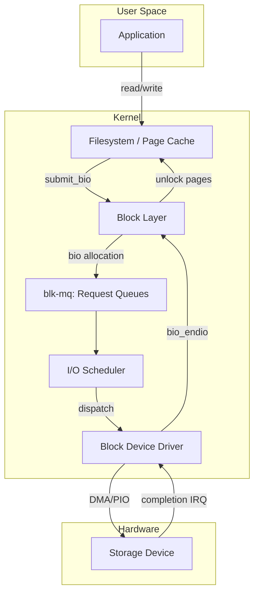
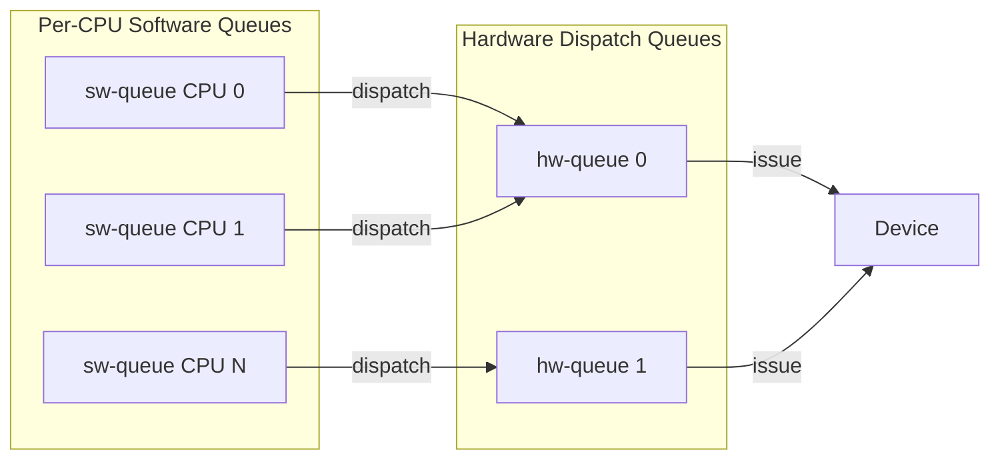
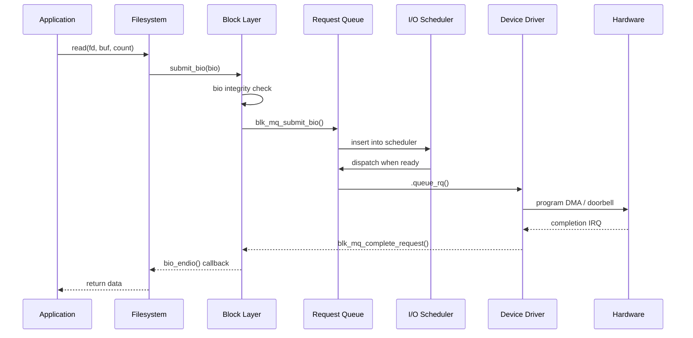
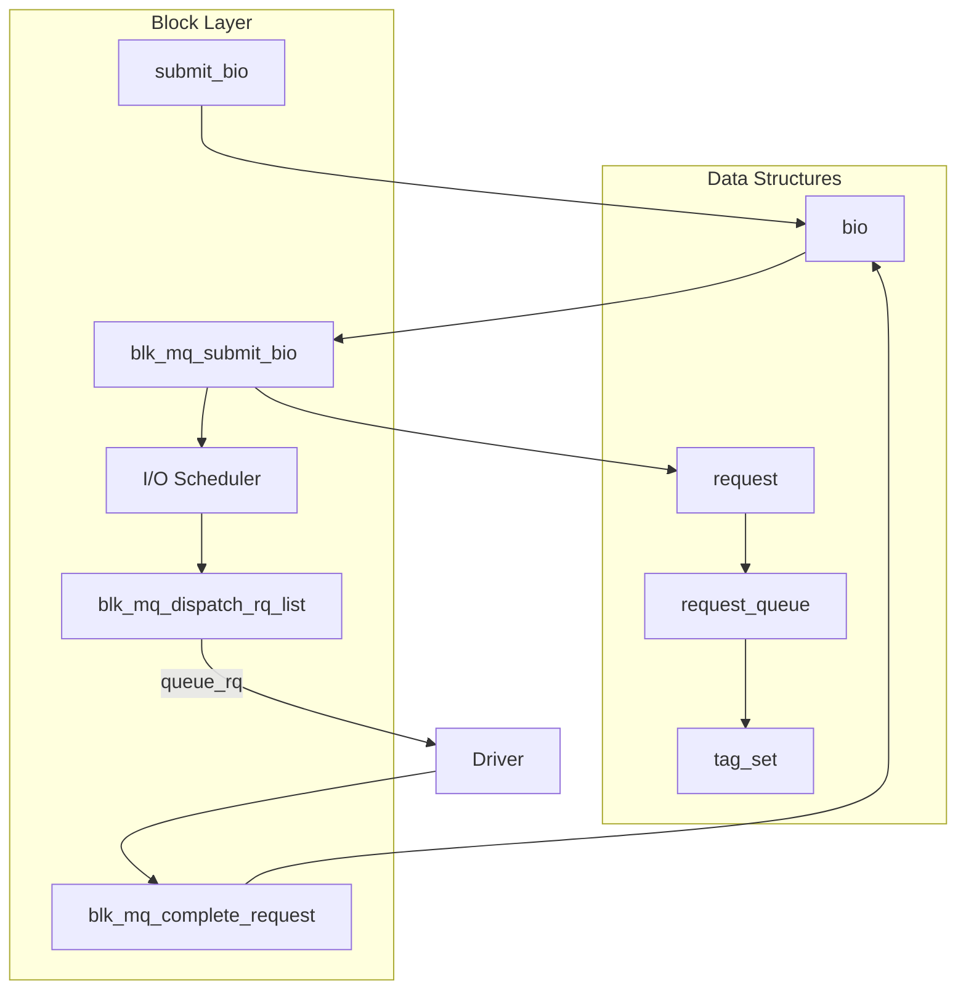
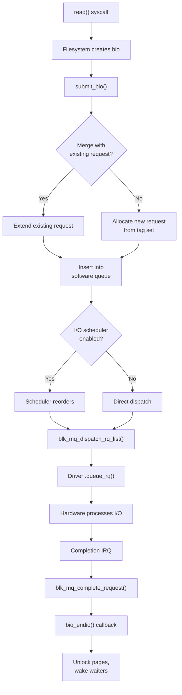
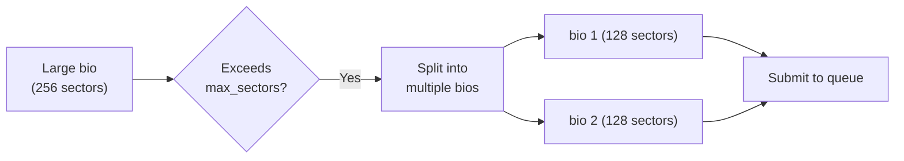
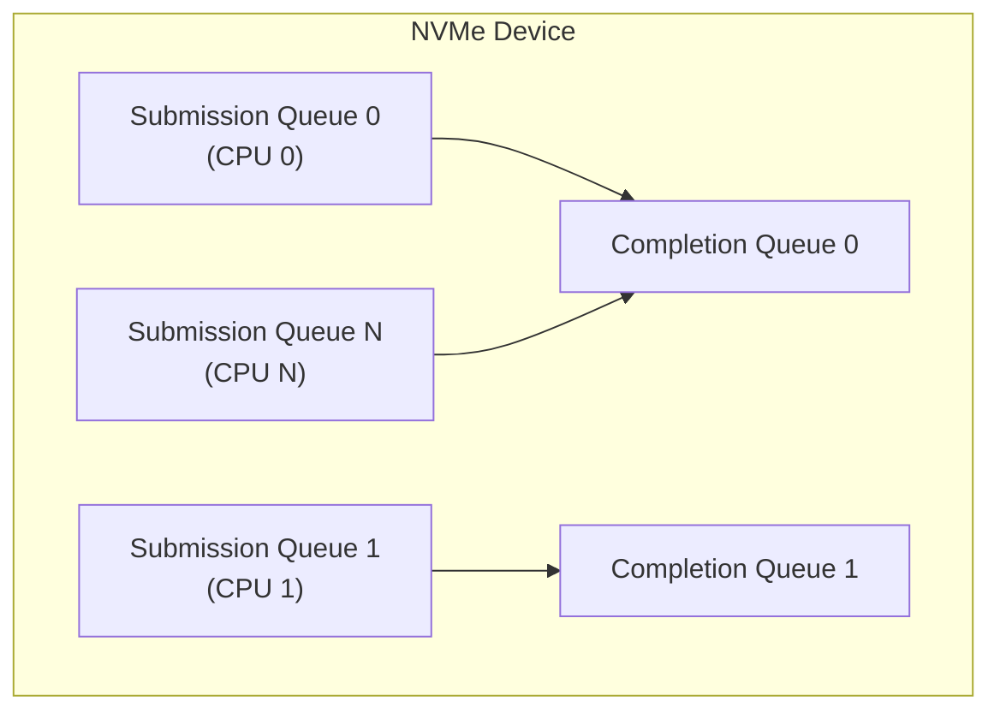
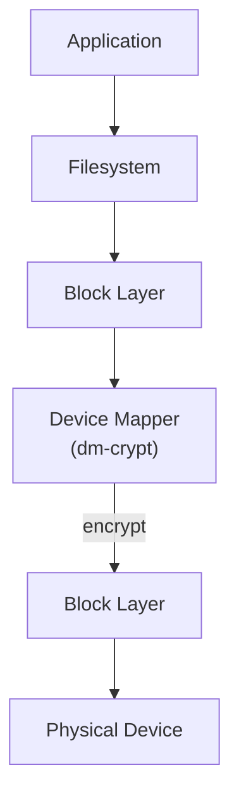

# Block Layer Overview

The Linux block layer sits between the file system / page cache and the
low-level device drivers that talk to storage hardware. It is responsible
for scheduling, merging, and dispatching I/O requests so that disk
throughput is maximized while latency remains bounded.

This chapter provides a high-level map of the block layer's architecture,
key data structures, and the I/O submission path from user space to
hardware completion.

---

## 1. Architecture at a Glance



---

## 2. The `bio` — Basic I/O Descriptor

The fundamental unit of I/O in the block layer is the **`bio`** (short for
"block I/O"). A `bio` describes one contiguous logical I/O operation
against a block device: a direction (read/write), a starting sector, a
set of pages/buffers, and a completion callback.

```c
struct bio {
    struct block_device *bi_bdev;
    unsigned int        bi_opf;        /* op | flags */
    blk_status_t        bi_status;
    atomic_t            __bi_remaining;
    bio_end_io_t        *bi_end_io;    /* completion callback */
    void                *bi_private;
    unsigned short      bi_vcnt;       /* number of bio_vecs */
    unsigned short      bi_idx;        /* current bio_vec index */
    struct bio_vec      *bi_io_vec;    /* array of segments */
    /* ... more fields ... */
};
```

> **Key point**: A `bio` is *not* a request. Multiple bios can be merged
> into a single request by the block layer. See [Bio Structures](bio.md)
> for full details.

### Operations (`bi_opf`)

The operation field encodes both the **opcode** and **flags**:

| Opcode | Meaning |
|---|---|
| `REQ_OP_READ` | Read data |
| `REQ_OP_WRITE` | Write data |
| `REQ_OP_FLUSH` | Flush volatile caches |
| `REQ_OP_DISCARD` | Discard blocks (TRIM/UNMAP) |
| `REQ_OP_SECURE_ERASE` | Cryptographic erase |
| `REQ_OP_ZONE_APPEND` | Zoned device sequential write |

Common flags:

| Flag | Meaning |
|---|---|
| `REQ_SYNC` | Synchronous I/O — do not delay |
| `REQ_IDLE` | Hint: no more I/O coming soon |
| `REQ_PREFETCH` | Hint: data will be used soon |

---

## 3. Request Queues and `blk-mq`

Modern Linux (since 3.13) uses the **multi-queue block I/O queuing
mechanism** (`blk-mq`) instead of the legacy single-queue path. `blk-mq`
is designed for modern NVMe and multi-core devices that have multiple
hardware submission queues.



### `request_queue`

Every block device has a `request_queue` that holds pending bios and
requests:

```c
struct request_queue {
    struct blk_mq_tag_set   *tag_set;
    struct blk_mq_ops       *mq_ops;
    struct elevator_queue   *elevator;
    struct request          *last_merge;
    /* queue limits, flags, etc. */
};
```

### Software and Hardware Queues

- **Software queues (ctx)**: One per CPU. Bios are staged here before
  being dispatched.
- **Hardware queues (hctx)**: One per hardware dispatch queue. The
  driver maps these to actual device queues.

The number of hardware queues is configured by the driver via
`blk_mq_alloc_tag_set()`.

---

## 4. Plug / Unplug Mechanism

To reduce lock contention and enable request merging, the block layer
uses a **plug** mechanism:

1. The submitting thread **plugs** the queue (starts collecting bios).
2. Multiple bios are queued without immediately dispatching.
3. The thread **unplugs** — all accumulated bios are dispatched together.

```c
blk_start_plug(&plug);
submit_bio(bio1);
submit_bio(bio2);
submit_bio(bio3);
blk_finish_plug(&plug);   /* dispatches all at once */
```

This is analogous to batching: instead of acquiring the queue lock for
each bio, we acquire it once at unplug time.

### Implicit Plugging

The page cache's `submit_bio()` calls are typically wrapped in plug
blocks already. Drivers rarely need to plug explicitly unless they are
generating multiple bios themselves.

---

## 5. I/O Submission Path

A typical read or write follows this path:



### Step-by-Step

1. **`submit_bio(bio)`** — Entry point. The filesystem (or any bio
   submitter) calls this.
2. **`blk_mq_submit_bio()`** — The core submission path. It:
   - Attempts to **merge** the bio with an existing request.
   - If no merge, allocates a new request from the tag set.
   - Inserts the request into the software queue.
   - Checks if the queue should be dispatched (unplug or direct).
3. **I/O Scheduler** — If enabled, the scheduler reorders requests for
   fairness or throughput.
4. **`queue_rq()`** — The driver's callback to issue the request to
   hardware.
5. **Completion** — The driver calls `blk_mq_complete_request()` which
   invokes the bio's `bi_end_io` callback.

---

## 6. I/O Schedulers

The Linux block layer supports pluggable I/O schedulers. The scheduler
sits between the software queues and the hardware dispatch path.

| Scheduler | Target | Characteristics |
|---|---|---|
| **none** | NVMe, fast devices | No reordering; FIFO |
| **mq-deadline** | HDDs, SATA SSDs | Per-request timeout; read vs. write fairness |
| **bfq** | Desktop / interactive | Budget fairness; low latency |
| **kyber** | Fast SSDs | Token-based; tunable read/write latency |

See [I/O Schedulers](io-schedulers.md) for detailed coverage.

---

## 7. Queue Limits

Every request queue has **limits** that describe the device's capabilities:

```c
struct queue_limits {
    unsigned int    max_sectors;       /* max sectors per request */
    unsigned int    max_segment_size;  /* max size of a single segment */
    unsigned short  max_segments;      /* max scatter-gather segments */
    unsigned int    logical_block_size;
    unsigned int    physical_block_size;
    unsigned int    io_min;
    unsigned int    chunk_sectors;
    /* ... */
};
```

Drivers configure these when setting up the queue. The block layer
enforces them when splitting bios that exceed device limits.

---

## 8. Block Device Registration

A block device driver typically:

1. Allocates a `gendisk` structure.
2. Sets up a `request_queue` with `blk_mq_init_queue()` or
   `blk_mq_alloc_disk()`.
3. Registers the `block_device_operations` callbacks.
4. Calls `add_disk()` to make the device visible.

```c
struct gendisk *disk = blk_mq_alloc_disk(&tag_set, NULL);
disk->major = MY_MAJOR;
disk->first_minor = 0;
disk->minors = 1;
disk->fops = &my_block_ops;
strscpy(disk->disk_name, "mydev", sizeof(disk->disk_name));
set_capacity(disk, num_sectors);
add_disk(disk);
```

See [Block Devices](devices.md) for registration details.

---

## 9. Error Handling

When a bio completes with an error, the driver sets `bio->bi_status` to
a `blk_status_t` value before calling `bio_endio()`:

| Status | Meaning |
|---|---|
| `BLK_STS_OK` | Success |
| `BLK_STS_IOERR` | Generic I/O error |
| `BLK_STS_RESOURCE` | Resource unavailable; retry |
| `BLK_STS_NOSPC` | No space left |
| `BLK_STS_MEDIUM` | Medium error (bad sector) |
| `BLK_STS_TARGET` | Target/transport error |

The filesystem translates these into `-EIO`, `-ENOSPC`, etc.

---

## 10. The Legacy Path (Optional)

Before `blk-mq`, the block layer used a single request queue per device
with elevator-based scheduling. This path was removed in kernel 5.20
(late 2022). All modern drivers must use `blk-mq`.

---

## 11. Block Layer Subsystem Map



---

## 12. Request Lifecycle in Detail

### From bio to Hardware

A single `read()` system call can generate multiple bios, each of which
may be merged with others before becoming a request:



### Request Merging

The block layer merges adjacent bios to reduce the number of hardware
requests.  Two types of merging are supported:

| Merge Type | Description | Example |
|---|---|---|
| **Back merge** | New bio appends to end of existing request | Read sectors 100-199, then 200-299 |
| **Front merge** | New bio prepends to start of existing request | Read sectors 200-299, then 100-199 |

```bash
# View merge statistics
$ cat /sys/block/sda/stat
# Fields: read_ios read_merges read_sectors read_ticks ...
# read_merges shows how many bios were merged

# iostat shows merge activity
$ iostat -x 1
Device  r/s    rMerge/s  rKB/s   r_await  svctm
sda     150.00 50.00     8000.00 0.50     0.30
```

## 13. I/O Accounting

### Per-Device Statistics

```bash
# Detailed device statistics
$ cat /sys/block/sda/stat
 84325  12345  6789012  4567  12345  6789  1234567  2345  0  3000  6912

# Fields (in order):
# 1. read_ios       - Number of reads completed
# 2. read_merges    - Number of reads merged
# 3. read_sectors   - Sectors read
# 4. read_ticks     - Time spent reading (ms)
# 5. write_ios      - Number of writes completed
# 6. write_merges   - Number of writes merged
# 7. write_sectors  - Sectors written
# 8. write_ticks    - Time spent writing (ms)
# 9. in_flight      - I/Os currently in progress
# 10. io_ticks      - Time doing I/Os (ms)
# 11. time_in_queue - Weighted time doing I/Os (ms)
```

### Block I/O Tracing

```bash
# Trace block I/O with blktrace
$ sudo blktrace -d /dev/sda -o - | blkparse -i -

# Example output:
# 8,0    1        1     0.000000000  2345  A   R 1000 + 8 <- (8,1) 1000
# 8,0    1        2     0.000001000  2345  Q   R 1000 + 8
# 8,0    1        3     0.000002000  2345  G   R 1000 + 8
# 8,0    1        4     0.000003000  2345  I   R 1000 + 8
# 8,0    1        5     0.000010000     0  C   R 1000 + 8 [0]

# Using bpftrace for quick analysis
$ sudo bpftrace -e     'tracepoint:block:block_rq_issue {
        printf("%s %s %d %d
", comm, args->rwbs, args->sector, args->nr_sector);
    }'
```

## 14. Block Layer Debugging

### Common Issues and Diagnostics

```bash
# High I/O latency — identify slow devices
$ iostat -xz 1
# Look for high await, svctm, %util

# Check for I/O errors in kernel log
$ dmesg | grep -i 'blk\|scsi\|ata\|nvme\|error\|I/O'

# View block device queue settings
$ cat /sys/block/sda/queue/scheduler
[mq-deadline] none

# Check queue depth
$ cat /sys/block/sda/queue/nr_requests
256

# View current I/O in progress
$ cat /sys/block/sda/inflight
       2        0    # 2 reads, 0 writes in flight
```

### Using perf for Block Analysis

```bash
# Trace block I/O latency distribution
$ sudo perf record -e block:block_rq_issue -e block:block_rq_complete -a sleep 10
$ sudo perf script

# Count I/O operations by type
$ sudo perf stat -e 'block:block_rq_issue' -a sleep 5

# Using biosnoop (from bcc-tools)
$ sudo biosnoop
TIME     COMM           PID    DISK  T SECTOR     BYTES  LAT(ms)
0.000    dd             1234   sda   W 1000       4096   0.12
0.001    dd             1234   sda   W 1008       4096   0.10
```

## 15. io_uring and the Block Layer

io_uring is Linux's modern async I/O interface. It interacts with the block
layer through the same bio/request path but provides efficient batching:

```c
#include <liburing.h>

struct io_uring ring;
io_uring_queue_init(256, &ring, 0);

/* Submit async read — goes through block layer */
struct io_uring_sqe *sqe = io_uring_get_sqe(&ring);
io_uring_prep_read(sqe, fd, buf, 4096, offset);
io_uring_submit(&ring);

/* Wait for completion */
struct io_uring_cqe *cqe;
io_uring_wait_cqe(&ring, &cqe);
// cqe->res contains bytes read or error
io_uring_cqe_seen(&ring, cqe);
```

io_uring benefits for block I/O:
* **Fewer syscalls**: Batch submit and wait
* **Fixed buffers**: Pre-registered buffers reduce per-I/O overhead
* **Polled I/O**: Busy-poll for ultra-low latency (NVMe)
* **Chain submissions**: Linked operations without intermediate waits

## 16. Bio Splitting and Queue Limits

When a bio exceeds the device's capabilities (too many sectors, too many
scatter-gather segments), the block layer automatically splits it:



```bash
# View device queue limits
$ cat /sys/block/sda/queue/max_sectors_kb
1280

$ cat /sys/block/sda/queue/max_segments
128

$ cat /sys/block/sda/queue/logical_block_size
512

$ cat /sys/block/sda/queue/physical_block_size
4096

# Adjust max sectors per request
$ echo 512 > /sys/block/sda/queue/max_sectors_kb
```

### Advanced Format (4K Sectors)

Modern drives use 4096-byte physical sectors but may present 512-byte
logical sectors for compatibility (512e).  Misaligned I/O causes
read-modify-write penalties:

```bash
# Check alignment
$ sudo parted /dev/sda align-check optimal 1
1 aligned

# Verify sector sizes
$ sudo fdisk -l /dev/sda
Sector size (logical/physical): 512 bytes / 4096 bytes
```

## 17. NVMe and blk-mq

NVMe devices are the primary driver for blk-mq's design.  A typical NVMe
device has 64+ hardware submission queues, each with deep queue depth:



```bash
# View NVMe queue configuration
$ cat /sys/block/nvme0n1/queue/nr_requests
1023

# Check NVMe queue count
$ cat /proc/interrupts | grep nvme
# One interrupt per queue (per-CPU)

# NVMe device information
$ sudo nvme id-ctrl /dev/nvme0
# Shows MQES (max queue entries), number of queues, etc.
```

## 18. Zoned Block Devices

Zoned block devices (SMR HDDs, ZNS SSDs) require sequential writes within
zones.  The block layer supports this via zone operations:

```bash
# Check if device supports zones
$ cat /sys/block/nvme0n1/queue/zoned
none  # or host-managed, host-aware

# List zones
$ sudo blkzone report /dev/nvme0n1
  start: 0x000000000, len 0x080000, cap 0x080000, wptr 0x000000000,   type: 2(sequential_write_required), cond: 14(not_wp), reset: 0

# Zone operations
$ sudo blkzone reset /dev/nvme0n1       # Reset all zones
$ sudo blkzone open /dev/nvme0n1        # Open a zone
$ sudo blkzone close /dev/nvme0n1       # Close a zone
```

The `REQ_OP_ZONE_APPEND` operation is used for sequential writes to
zoned devices, letting the device choose the write position.

## 19. Block Device Encryption (dm-crypt)

dm-crypt provides transparent block device encryption through the device
mapper:

```bash
# Open an encrypted device
$ sudo cryptsetup luksOpen /dev/sda1 encrypted_vol

# View dm-crypt status
$ sudo dmsetup status encrypted_vol
0 209715200 crypt aes-xts-plain64 0 0 0 0

# The encrypted volume appears as /dev/mapper/encrypted_vol
# All I/O goes through the block layer -> dm-crypt -> underlying device
```



## Further Reading

- [GNU Project Documentation](https://www.gnu.org/doc/doc.html)
- [GNU Manuals](https://www.gnu.org/manual/manual.html)
- [Free Software Directory](https://directory.fsf.org/wiki/Main_Page)
- [Planet GNU](https://planet.gnu.org/)
- [Free Software Books](https://www.gnu.org/doc/other-free-books.html)

- [Linux kernel docs — Block layer](https://docs.kernel.org/block/index.html)
- [Linux kernel docs — blk-mq](https://docs.kernel.org/block/blk-mq.html)
- [LWN: The multiqueue block layer](https://lwn.net/Articles/552904/)
- [LWN: Plugging and unplugging the block layer](https://lwn.net/Articles/539840/)
- [Linux Storage Stack Diagram](https://www.thomas-krenn.com/en/wiki/Linux_Storage_Stack_Diagram)

## Related Topics

- [Bio Structures](bio.md) — detailed bio and bio_vec anatomy
- [Block Devices](devices.md) — gendisk and registration
- [I/O Schedulers](io-schedulers.md) — mq-deadline, BFQ, kyber
- [Request Queues](request-queues.md) — blk-mq internals
- [Device Mapper](device-mapper.md) — virtual block devices
