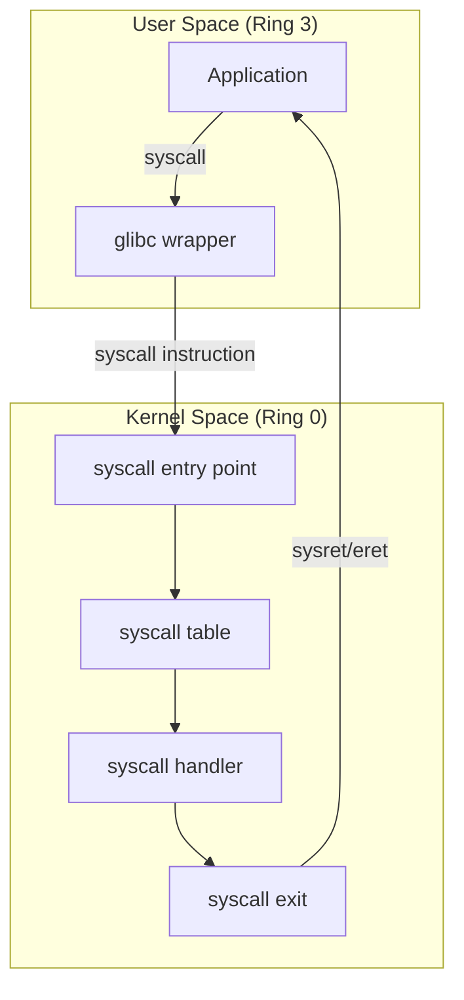

# System Calls

## Introduction

System calls are the fundamental interface between user-space applications and the kernel. When a program needs to perform a privileged operation — reading a file, creating a process, allocating memory, sending network data — it must request the kernel to do it on its behalf through a system call. This boundary between user space and kernel space is enforced by the CPU's privilege levels and is essential for system security and stability.

Linux has over 400 system calls, each identified by a unique number. The system call interface is architecture-specific — x86-64 uses the `syscall` instruction, ARM64 uses `svc`, RISC-V uses `ecall`, and i386 uses `int 0x80` or `sysenter`. The kernel dispatches system calls through a table indexed by syscall number.

## System Call Architecture



## How System Calls Work

### x86-64 System Call Mechanism

```asm
; User space: invoke write(1, "hello", 5)
mov rax, 1          ; syscall number for write (NR_write)
mov rdi, 1          ; arg1: fd = stdout
lea rsi, [msg]      ; arg2: buffer pointer
mov rdx, 5          ; arg3: count
syscall              ; trap to kernel

; In kernel (entry_SYSCALL_64):
; 1. Save user registers to kernel stack
; 2. Look up syscall_table[rax]
; 3. Call the handler with rdi, rsi, rdx, r10, r8, r9
; 4. Put return value in rax
; 5. Restore user registers
; 6. sysretq back to user space
```

### ARM64 System Call Mechanism

```asm
; User space: invoke write(1, "hello", 5)
mov x8, #64         ; syscall number for write (NR_write)
mov x0, #1          ; arg1: fd = stdout
ldr x1, =msg        ; arg2: buffer pointer
mov x2, #5          ; arg3: count
svc #0               ; supervisor call

; In kernel (el0_sync):
; 1. Save user registers (x0-x30, sp, pc, pstate)
; 2. Look up syscall_table[x8]
; 3. Call the handler
; 4. Return via eret
```

### RISC-V System Call Mechanism

```asm
; User space: invoke write(1, "hello", 5)
li a7, 64           ; syscall number for write
li a0, 1            ; arg1: fd = stdout
la a1, msg          ; arg2: buffer pointer
li a2, 5            ; arg3: count
ecall                ; environment call

; In kernel (handle_exception):
; 1. Save context (registers)
; 2. syscall_table[a7]
; 3. Call handler
; 4. sret back to user
```

## System Call Table

### x86-64 System Call Numbers

```c
/* arch/x86/entry/syscalls/syscall_64.tbl */
#  nr   ABI   name
0    common  read
1    common  write
2    common  open
3    common  close
4    common  stat
5    common  fstat
6    common  lstat
7    common  poll
8    common  lseek
9    common  mmap
10   common  mprotect
11   common  munmap
12   common  brk
...
56   common  clone
57   common  fork
58   common  vfork
59   common  execve
60   common  exit
61   common  wait4
...
231  common  exit_group
...
292  common  io_uring_setup
293  common  io_uring_enter
294  common  io_uring_register
```

### Common System Calls

| Number (x86-64) | Name | Description |
|-----------------|------|-------------|
| 0 | read | Read from file descriptor |
| 1 | write | Write to file descriptor |
| 2 | open | Open a file |
| 3 | close | Close a file descriptor |
| 9 | mmap | Map memory |
| 10 | mprotect | Set memory protections |
| 12 | brk | Set program break |
| 39 | getpid | Get process ID |
| 56 | clone | Create a child process |
| 57 | fork | Fork a process |
| 59 | execve | Execute a program |
| 60 | exit | Terminate process |
| 61 | wait4 | Wait for process |
| 231 | exit_group | Exit all threads |
| 302 | prlimit64 | Get/set resource limits |
| 318 | getrandom | Get random bytes |

## System Call Entry and Exit

### x86-64 Entry Point

```asm
/* arch/x86/entry/entry_64.S — simplified */
SYM_INNER_LABEL(entry_SYSCALL_64, SYM_L_GLOBAL)
    /* Save user stack pointer */
    mov [rsp - 10*8], rcx   /* save user rip (return address) */
    mov [rsp - 9*8], r11    /* save user rflags */
    
    /* Switch to kernel stack */
    mov rcx, rsp
    mov rsp, [gs:cpu_tss_rw + TSS_sp2]  /* kernel stack */
    
    /* Save user registers */
    push rcx    /* user rsp */
    push r11    /* user rflags */
    push rdx    /* arg3 */
    push rsi    /* arg2 */
    push rdi    /* arg1 */
    push rax    /* syscall number */
    
    /* Load kernel CS/SS */
    /* ... */
    
    /* Call the syscall handler */
    call do_syscall_64
    
    /* Restore user registers and return */
    /* ... */
    sysretq
```

### do_syscall_64

```c
/* arch/x86/kernel/syscall_64.c */
__visible void do_syscall_64(struct pt_regs *regs)
{
    unsigned long nr = regs->orig_ax;
    
    /* Check for seccomp filters */
    if (static_branch_unlikely(&seccomp))
        nr = __secure_computing(NULL, nr);
    
    /* Bounds check */
    if (likely(nr < NR_syscalls)) {
        nr = array_index_nospec(nr, NR_syscalls);
        
        /* Call the syscall handler */
        regs->ax = sys_call_table[nr](regs->di, regs->si,
                                       regs->dx, regs->r10,
                                       regs->r8, regs->r9);
    }
}
```

### ARM64 Entry Point

```asm
/* arch/arm64/kernel/entry-common.S */
SYM_CODE_START(el0_sync)
    kernel_entry 0
    
    mrs x25, esr_el1          /* Exception Syndrome Register */
    lsr x24, x25, #ESR_ELx_EC_SHIFT
    
    cmp x24, #ESR_ELx_EC_SVC64  /* SVC (system call) */
    b.eq el0_svc
    
    cmp x24, #ESR_ELx_EC_DABT   /* Data abort */
    b.eq el0_da
    
    /* ... other exception types ... */

el0_svc:
    /* x8 contains syscall number */
    adrp    tbl, sys_call_table
    add     tbl, tbl, x8, lsl #3
    ldr     x16, [tbl]
    blr     x16
    
    /* Store return value */
    str x0, [sp, #S_X0]
    
    kernel_exit 0
SYM_CODE_END(el0_sync)
```

## Implementing a System Call

### Step 1: Add the System Call Number

```c
/* arch/x86/entry/syscalls/syscall_64.tbl — add at end */
450    common  my_syscall    sys_my_syscall
```

```c
/* For ARM64: include/uapi/asm-generic/unistd.h */
#define __NR_my_syscall 450
__SYSCALL(__NR_my_syscall, sys_my_syscall)
```

### Step 2: Implement the Handler

```c
/* kernel/my_syscall.c */
#include <linux/kernel.h>
#include <linux/syscalls.h>
#include <linux/uaccess.h>

/*
 * sys_my_syscall - Example system call
 * @buf: userspace buffer to write to
 * @len: size of buffer
 *
 * Returns: number of bytes written, or negative error
 */
SYSCALL_DEFINE2(my_syscall, char __user *, buf, size_t, len)
{
    char kernel_buf[256];
    int ret;
    
    /* Validate user pointer */
    if (!access_ok(buf, len))
        return -EFAULT;
    
    /* Limit size */
    if (len > sizeof(kernel_buf))
        len = sizeof(kernel_buf);
    
    /* Do kernel work */
    ret = snprintf(kernel_buf, len, "Hello from kernel! Time: %lld\n",
                   ktime_get_real_seconds());
    
    /* Copy to userspace */
    if (copy_to_user(buf, kernel_buf, ret))
        return -EFAULT;
    
    return ret;
}
```

### Step 3: Register the System Call

```c
/* In arch/x86/entry/syscalls/syscall_64.tbl */
450    common  my_syscall    sys_my_syscall

/* Or for newer kernels using syscall.tbl */
/* Add entry to the architecture-specific syscall table */
```

### Step 4: Build and Test

```bash
# Build kernel with new syscall
make -j$(nproc)

# Test program
cat > test_syscall.c << 'EOF'
#include <stdio.h>
#include <unistd.h>
#include <sys/syscall.h>

#define __NR_my_syscall 450

int main(void)
{
    char buf[256];
    long ret;
    
    ret = syscall(__NR_my_syscall, buf, sizeof(buf));
    if (ret < 0) {
        perror("syscall");
        return 1;
    }
    
    printf("Kernel says: %s\n", buf);
    printf("Return value: %ld\n", ret);
    return 0;
}
EOF

gcc -o test_syscall test_syscall.c
./test_syscall
# Kernel says: Hello from kernel! Time: 1704067200
# Return value: 42
```

## System Call Conventions

### x86-64 Calling Convention

```
System call number: rax
Arguments: rdi, rsi, rdx, r10, r8, r9 (note: r10 not rcx!)
Return value: rax
Error: rax = -errno
Clobbered: rcx, r11
```

### ARM64 Calling Convention

```
System call number: x8
Arguments: x0, x1, x2, x3, x4, x5
Return value: x0
Error: x0 = -errno
Clobbered: none (callee-saved)
```

### Error Handling

```c
/* System calls return negative errno on error */
/* In kernel: */
SYSCALL_DEFINE1(close, unsigned int, fd)
{
    int ret = __close_fd(current->files, fd);
    /* ret is negative errno on error, 0 on success */
    return ret;
}

/* In userspace: */
int fd = open("/nonexistent", O_RDONLY);
if (fd == -1) {
    /* errno is set by libc wrapper */
    perror("open");
    // or: printf("Error: %s\n", strerror(errno));
}
```

## Tracing System Calls

### strace

```bash
# Trace all system calls of a program
strace ls -la
# openat(AT_FDCWD, ".", O_RDONLY|O_NONBLOCK|O_CLOEXEC|O_DIRECTORY) = 3
# fstat(3, {st_mode=S_IFDIR|0755, st_size=4096, ...}) = 0
# getdents64(3, /* 15 entries */, 32768) = 544
# write(1, "total 20\ndrwxr-xr-x 2 root root"..., 544) = 544
# close(3)                                = 0

# Trace specific syscalls
strace -e trace=open,read,write cat /etc/hostname

# Trace with timestamps
strace -t ls

# Trace child processes
strace -f ./myprogram

# Count syscalls
strace -c ls
# % time     seconds  usecs/call     calls    errors syscall
# ------ ----------- ----------- --------- --------- -------
#  45.23    0.001234          12       100           read
#  30.12    0.000823           8        98           write
#  15.45    0.000423          42        10           openat
#  ...

# Attach to running process
strace -p <pid>

# Trace specific PID
strace -p 1234 -e trace=network

# Trace with stack trace
strace -k ls

# Follow forks
strace -f -o trace.log ./myprogram
```

### ltrace

```bash
# Trace library calls (not syscalls)
ltrace ls
# __libc_start_main(0x401234, 1, 0x7ffc1234, ...) = 0
# getenv("TIMEFORMAT") = NULL
# setlocale(LC_ALL, "") = "en_US.UTF-8"
# ...
```

### perf trace

```bash
# System call tracing with perf
perf trace ls

# With statistics
perf trace -s ls

# Trace specific syscalls
perf trace -e read,write ls

# Trace a running process
perf trace -p <pid>
```

### ftrace

```bash
# Trace syscalls via ftrace
cd /sys/kernel/debug/tracing

# Set function filter
echo sys_read > set_ftrace_filter
echo function > current_tracer

# Enable
echo 1 > tracing_on
cat trace_pipe

# Or use the syscall tracepoints
echo 1 > events/syscalls/sys_enter_read/enable
echo 1 > events/syscalls/sys_exit_read/enable
cat trace_pipe
# task-pid   CPU  ||||   timestamp  function
# cat-1234   [000] .... 123.456789: sys_read(fd: 3, buf: 0x7ffc1234, count: 4096)
# cat-1234   [000] .... 123.456890: sys_read -> 0x1000
```

## Seccomp (System Call Filtering)

```c
#include <linux/seccomp.h>
#include <linux/filter.h>
#include <linux/audit.h>
#include <linux/sched.h>
#include <sys/prctl.h>

/* Install seccomp filter to restrict system calls */
int install_seccomp(void)
{
    struct sock_filter filter[] = {
        /* Load syscall number */
        BPF_STMT(BPF_LD | BPF_W | BPF_ABS,
                 offsetof(struct seccomp_data, nr)),
        
        /* Allow read */
        BPF_JUMP(BPF_JMP | BPF_JEQ | BPF_K, __NR_read, 0, 1),
        BPF_STMT(BPF_RET | BPF_K, SECCOMP_RET_ALLOW),
        
        /* Allow write */
        BPF_JUMP(BPF_JMP | BPF_JEQ | BPF_K, __NR_write, 0, 1),
        BPF_STMT(BPF_RET | BPF_K, SECCOMP_RET_ALLOW),
        
        /* Allow exit */
        BPF_JUMP(BPF_JMP | BPF_JEQ | BPF_K, __NR_exit, 0, 1),
        BPF_STMT(BPF_RET | BPF_K, SECCOMP_RET_ALLOW),
        
        /* Allow exit_group */
        BPF_JUMP(BPF_JMP | BPF_JEQ | BPF_K, __NR_exit_group, 0, 1),
        BPF_STMT(BPF_RET | BPF_K, SECCOMP_RET_ALLOW),
        
        /* Kill process for any other syscall */
        BPF_STMT(BPF_RET | BPF_K, SECCOMP_RET_KILL),
    };
    
    struct sock_fprog prog = {
        .len = ARRAY_SIZE(filter),
        .filter = filter,
    };
    
    /* Enable NO_NEW_PRIVS (required for unprivileged seccomp) */
    if (prctl(PR_SET_NO_NEW_PRIVS, 1, 0, 0, 0))
        return -1;
    
    /* Install filter */
    return prctl(PR_SET_SECCOMP, SECCOMP_MODE_FILTER, &prog);
}
```

```bash
# Seccomp in containers
# Docker: --security-opt seccomp=profile.json
# Kubernetes: securityContext.seccompProfile

# View seccomp status
cat /proc/<pid>/status | grep Seccomp
# Seccomp:	2
# Seccomp_filters:	1
```

## vDSO (Virtual Dynamic Shared Object)

The vDSO is a small shared library provided by the kernel that implements certain system calls in user space for performance:

```bash
# View vDSO mapping
cat /proc/self/maps | grep vdso
# 7ffc12340000-7ffc12360000 r-xp 00000000 00:00 0 [vdso]

# vDSO exports these functions (typically):
# __vdso_clock_gettime
# __vdso_gettimeofday
# __vdso_time
# __vdso_clock_getres
# __vdso_getcpu

# These avoid the syscall overhead for frequently-called, read-only operations
```

```c
/* Using vDSO functions transparently via glibc */
#include <time.h>

/* These calls use vDSO when available */
struct timespec ts;
clock_gettime(CLOCK_MONOTONIC, &ts);
/* Under the hood: calls __vdso_clock_gettime (no syscall trap) */
```

## Modern System Calls

### io_uring

```c
#include <liburing.h>

/* io_uring: efficient async I/O */
struct io_uring ring;
io_uring_queue_init(256, &ring, 0);

/* Submit read request */
struct io_uring_sqe *sqe = io_uring_get_sqe(&ring);
io_uring_prep_read(sqe, fd, buf, buf_len, offset);
io_uring_submit(&ring);

/* Wait for completion */
struct io_uring_cqe *cqe;
io_uring_wait_cqe(&ring, &cqe);
int result = cqe->res;
io_uring_cqe_seen(&ring, cqe);
```

### pidfd_open

```c
#include <sys/syscall.h>
#include <sys/wait.h>

/* pidfd_open: get a file descriptor for a process */
int pidfd = syscall(SYS_pidfd_open, pid, 0);

/* Wait for process using pidfd */
struct pollfd pfd = { .fd = pidfd, .events = POLLIN };
poll(&pfd, 1, -1);

/* Send signal via pidfd */
syscall(SYS_pidfd_send_signal, pidfd, SIGTERM, NULL, 0);
```

## System Call Performance

```bash
# Measure syscall latency
perf bench sched pipe
# 0.527100 usecs/op

# Measure syscall overhead
perf stat -e raw_syscalls:sys_enter ls

# System call statistics
cat /proc/<pid>/syscall
# 1 0x7ffc1234 0x401000 0x1000 0 0 0 0 0
# (current syscall number and arguments)

# View syscall count per process
cat /proc/<pid>/status | grep voluntary
# voluntary_ctxt_switches: 1234
# nonvoluntary_ctxt_switches: 56
```

## References

- [Linux man-pages: syscall(2)](https://man7.org/linux/man-pages/man2/syscall.2.html)
- [Linux man-pages: syscalls(2)](https://man7.org/linux/man-pages/man2/syscalls.2.html)
- [Linux Kernel System Call Table](https://chromium.googlesource.com/chromiumos/docs/+/master/constants/syscalls.md)
- [LWN: System call design](https://lwn.net/Articles/604287/)
- [LWN: System call entry/exit](https://lwn.net/Articles/604515/)
- [LWN: io_uring](https://lwn.net/Articles/776703/)
- [Kernel system call implementation](https://www.kernel.org/doc/html/latest/process/adding-syscalls.html)

## Related Topics

- [Process Management](../../processes/processes-and-threads.md) — fork, exec, wait
- File System Calls — open, read, write, close
- Memory Management — mmap, brk, mprotect
- [Seccomp](../../../containers/security.md) — System call filtering
- [Namespaces](./namespace.md) — clone, unshare, setns
