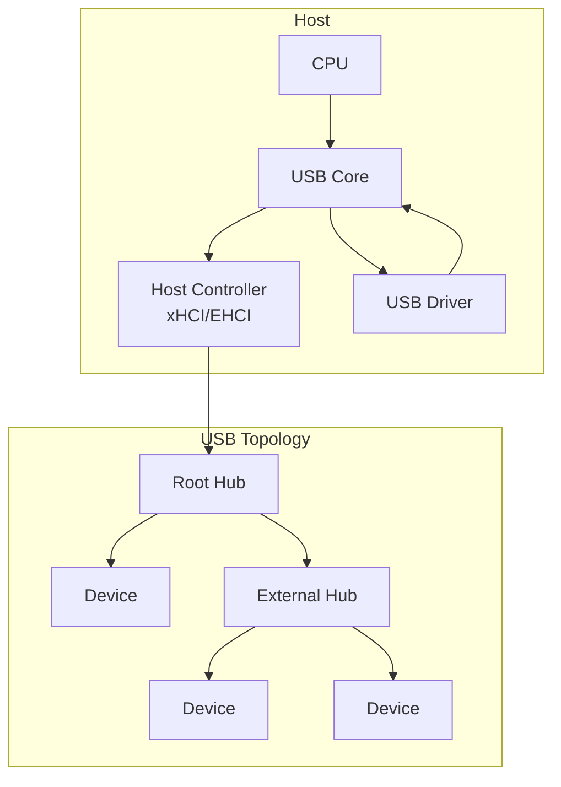
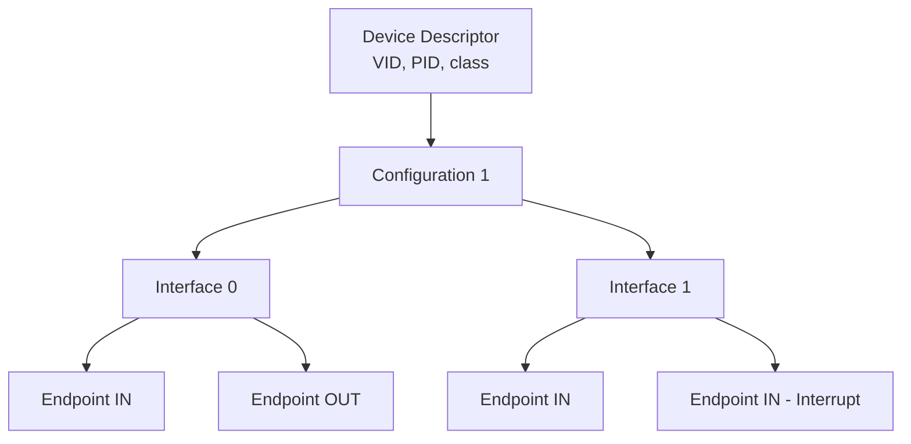
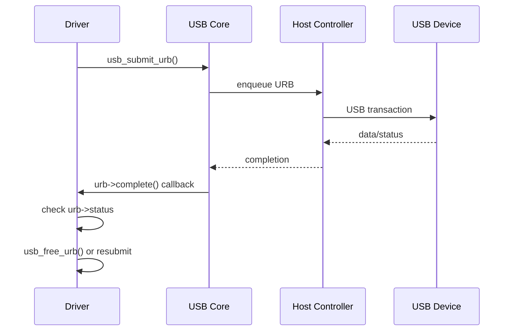
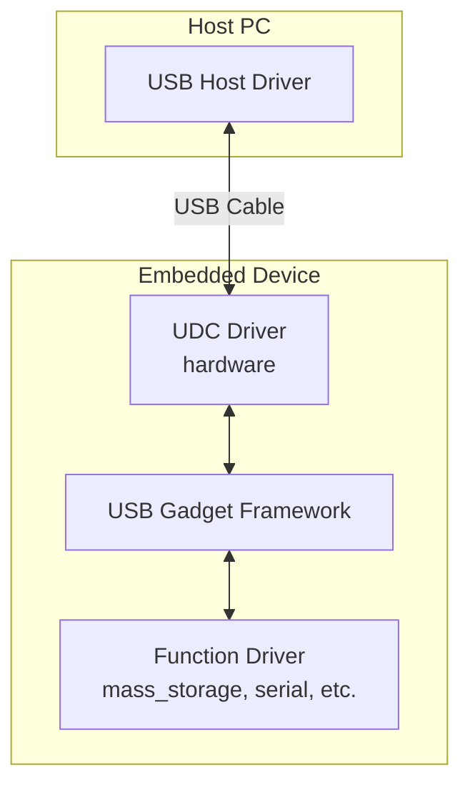
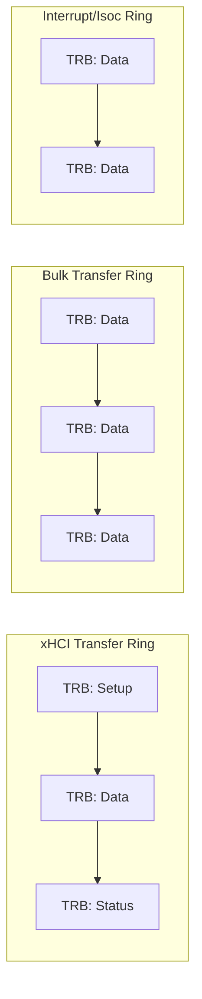
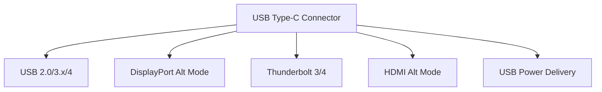

# USB Subsystem

The **USB (Universal Serial Bus)** subsystem handles communication with
USB devices — from keyboards and mice to storage devices, network
adapters, and custom hardware. USB is a **host-centric, polled** bus:
the host controller initiates all transfers.

---

## 1. USB Architecture



### USB Speeds

| Version | Speed | Max Bandwidth |
|---|---|---|
| USB 1.1 | Low/Full | 1.5 / 12 Mbps |
| USB 2.0 | High | 480 Mbps |
| USB 3.0 | Super | 5 Gbps |
| USB 3.1 | SuperSpeed+ | 10 Gbps |
| USB 3.2 | SuperSpeed+ | 20 Gbps |
| USB4 | USB4 | 40 Gbps |

---

## 2. USB Descriptors

USB devices describe themselves through a hierarchy of **descriptors**:



### Device Descriptor

```c
struct usb_device_descriptor {
    __u8  bLength;            /* 18 bytes */
    __u8  bDescriptorType;   /* USB_DT_DEVICE */
    __le16 bcdUSB;           /* USB spec version */
    __u8  bDeviceClass;      /* class code */
    __u8  bDeviceSubClass;
    __u8  bDeviceProtocol;
    __u8  bMaxPacketSize0;   /* EP0 max packet size */
    __le16 idVendor;         /* vendor ID */
    __le16 idProduct;        /* product ID */
    __le16 bcdDevice;        /* device release */
    __u8  iManufacturer;
    __u8  iProduct;
    __u8  iSerialNumber;
    __u8  bNumConfigurations;
} __attribute__ ((packed));
```

### Common USB Classes

| Class | Code | Example Devices |
|---|---|---|
| HID | 0x03 | Keyboard, mouse, gamepad |
| Mass Storage | 0x08 | Flash drive, external HDD |
| CDC (Comm) | 0x02 | Serial adapter, modem |
| Audio | 0x01 | Speakers, microphones |
| Video | 0x0E | Webcams |
| Vendor-Specific | 0xFF | Custom hardware |

### Viewing Descriptors

```bash
$ lsusb -v -d 046d:c077
Bus 001 Device 003: ID 046d:c077 Logitech M105 Optical Mouse
  Device Descriptor:
    bLength                18
    bDescriptorType         1
    bcdUSB               1.10
    bDeviceClass            0 (Defined at Interface level)
    idVendor           0x046d Logitech, Inc.
    idProduct          0xc077 M105 Optical Mouse
    bNumConfigurations      1
```

---

## 3. Endpoints

Every USB interface has one or more **endpoints** — logical channels
for data transfer:

| Type | Direction | Use Case |
|---|---|---|
| Control | Bidirectional | Device configuration (EP 0) |
| Bulk | IN or OUT | Large data transfers (storage) |
| Interrupt | IN or OUT | Small, periodic data (HID) |
| Isochronous | IN or OUT | Real-time streaming (audio, video) |

### Endpoint Descriptor

```c
struct usb_endpoint_descriptor {
    __u8  bLength;           /* 7 bytes */
    __u8  bDescriptorType;   /* USB_DT_ENDPOINT */
    __u8  bEndpointAddress;  /* EP number + direction */
    __u8  bmAttributes;      /* transfer type */
    __le16 wMaxPacketSize;   /* max packet size */
    __u8  bInterval;         /* polling interval (interrupt/iso) */
} __attribute__ ((packed));
```

---

## 4. URB (USB Request Block)

The **URB** is the fundamental transfer unit in the Linux USB subsystem.
Every data transfer — control, bulk, interrupt, or isochronous — is
represented as a URB.

```c
struct urb {
    struct usb_device *dev;          /* target device */
    unsigned int pipe;               /* endpoint + direction */
    void *transfer_buffer;           /* data buffer */
    dma_addr_t transfer_dma;         /* DMA address */
    unsigned int transfer_buffer_length;
    unsigned int actual_length;      /* bytes transferred */
    usb_complete_t complete;         /* completion callback */
    void *context;                   /* driver-private */
    int status;                      /* completion status */
    /* ... */
};
```

### Creating a URB

```c
/* Allocate */
struct urb *urb = usb_alloc_urb(0, GFP_KERNEL);

/* Fill a bulk URB */
usb_fill_bulk_urb(urb, usb_dev, pipe,
                  buf, buf_len,
                  my_completion, context);
```

### Submitting a URB

```c
int err = usb_submit_urb(urb, GFP_KERNEL);
if (err) {
    pr_err("usb_submit_urb failed: %d\n", err);
    usb_free_urb(urb);
    return err;
}
```

### URB Lifecycle



---

## 5. USB Drivers

### 5.1 `usb_driver` Structure

```c
static struct usb_driver my_usb_driver = {
    .name       = "my_usb",
    .probe      = my_usb_probe,
    .disconnect = my_usb_disconnect,
    .id_table   = my_usb_ids,
    .supports_autosuspend = 1,
};
```

### 5.2 `usb_device_id` Table

```c
static const struct usb_device_id my_usb_ids[] = {
    { USB_DEVICE(VENDOR_ID, PRODUCT_ID) },
    { USB_DEVICE_INTERFACE_CLASS(0x046d, 0xc077, 0x03) },
    { USB_INTERFACE_INFO(USB_CLASS_HID, USB_SUBCLASS_BOOT,
                         USB_PROTOCOL_KEYBOARD) },
    { }  /* terminator */
};
MODULE_DEVICE_TABLE(usb, my_usb_ids);
```

### 5.3 Probe and Disconnect

```c
static int my_usb_probe(struct usb_interface *intf,
                        const struct usb_device_id *id)
{
    struct usb_device *udev = interface_to_usbdev(intf);
    struct my_data *data;

    data = kzalloc(sizeof(*data), GFP_KERNEL);
    if (!data)
        return -ENOMEM;

    /* Find the first bulk IN endpoint */
    struct usb_endpoint_descriptor *ep_desc;
    struct usb_host_interface *alt = intf->cur_altsetting;
    int i;

    for (i = 0; i < alt->desc.bNumEndpoints; i++) {
        ep_desc = &alt->endpoint[i].desc;
        if (usb_endpoint_is_bulk_in(ep_desc)) {
            data->bulk_in_pipe = usb_rcvbulkpipe(udev,
                                    usb_endpoint_num(ep_desc));
            data->bulk_in_size = usb_endpoint_maxp(ep_desc);
            break;
        }
    }

    usb_set_intfdata(intf, data);
    pr_info("my_usb: device probed\n");
    return 0;
}

static void my_usb_disconnect(struct usb_interface *intf)
{
    struct my_data *data = usb_get_intfdata(intf);
    kfree(data);
    pr_info("my_usb: device disconnected\n");
}
```

### 5.4 Module Registration

```c
module_usb_driver(my_usb_driver);
```

---

## 6. USB Transfers

### 6.1 Control Transfer

Used for device configuration (always endpoint 0):

```c
/* Get descriptor */
usb_control_msg(udev, usb_rcvctrlpipe(udev, 0),
                USB_REQ_GET_DESCRIPTOR,
                USB_DIR_IN | USB_TYPE_STANDARD | USB_RECIP_DEVICE,
                USB_DT_DEVICE << 8, 0,
                buf, sizeof(buf),
                USB_CTRL_GET_TIMEOUT);
```

### 6.2 Bulk Transfer

For large, non-time-critical data (storage devices):

```c
/* Bulk read */
usb_bulk_msg(udev, usb_rcvbulkpipe(udev, ep),
             buf, buf_len, &actual_len,
             timeout);
```

### 6.3 Interrupt Transfer

For small, periodic data (HID devices):

```c
usb_fill_int_urb(urb, udev, usb_rcvintpipe(udev, ep),
                 buf, buf_len,
                 my_interrupt_complete, context,
                 interval);  /* polling interval in ms */
usb_submit_urb(urb, GFP_KERNEL);
```

### 6.4 Isochronous Transfer

For real-time streaming (audio/video):

```c
/* Allocate URB with space for multiple packets */
urb = usb_alloc_urb(num_packets, GFP_KERNEL);

/* Set up each packet */
for (i = 0; i < num_packets; i++) {
    urb->iso_frame_desc[i].offset = i * packet_size;
    urb->iso_frame_desc[i].length = packet_size;
}

usb_submit_urb(urb, GFP_KERNEL);
```

---

## 7. USB Gadget Framework

The **USB gadget** framework allows a Linux device to act as a USB
peripheral (device mode), rather than a host. Used in embedded systems,
phones, and single-board computers.



### ConfigFS-Based Gadget Configuration

```bash
# Create a gadget
mount -t configfs none /sys/kernel/config
mkdir /sys/kernel/config/usb_gadget/g1
cd /sys/kernel/config/usb_gadget/g1

echo 0x1d6b > idVendor   # Linux Foundation
echo 0x0104 > idProduct   # Multifunction Composite Gadget
mkdir strings/0x409
echo "0123456789" > strings/0x409/serialnumber
echo "My Gadget" > strings/0x409/manufacturer

# Add a configuration
mkdir configs/c.1
mkdir configs/c.1/strings/0x409
echo "Config 1" > configs/c.1/strings/0x409/configuration

# Add a function (e.g., mass storage)
mkdir functions/mass_storage.usb0
echo /dev/sda1 > functions/mass_storage.usb0/lun.0/file

# Link function to configuration
ln -s functions/mass_storage.usb0 configs/c.1/

# Bind to UDC
echo "musb-hdrc.0" > UDC
```

### Function Drivers

| Function | Purpose |
|---|---|
| `g_mass_storage` | USB mass storage |
| `g_serial` | USB serial (ACM) |
| `g_ether` | USB Ethernet (RNDIS/CDC) |
| `g_audio` | USB audio |
| `g_hid` | USB HID device |
| `g_webcam` | USB webcam (UVC) |

---

## 8. USB Power Management

USB supports runtime power management:

```c
/* Enable autosuspend */
usb_enable_autosuspend(udev);

/* Mark interface as autopm-able */
pm_runtime_set_autosuspend_delay(&intf->dev, 2000); /* 2 seconds */

/* In suspend callback */
static int my_suspend(struct usb_interface *intf, pm_message_t message)
{
    /* Stop URBs, save state */
    return 0;
}

/* In resume callback */
static int my_resume(struct usb_interface *intf)
{
    /* Restore state, resubmit URBs */
    return 0;
}
```

---

## 9. `usbfs` — User-Space USB Access

The `usbfs` filesystem (`/dev/bus/usb/`) allows user-space programs to
communicate with USB devices directly:

```bash
$ ls /dev/bus/usb/001/
001  002  003

$ sudo lsusb -t
/:  Bus 01.Port 1: Dev 1, Class=root_hub, Driver=ehci-pci/8p, 480M
    |__ Port 1: Dev 2, If 0, Class=Hub, Driver=hub/4p, 480M
        |__ Port 3: Dev 3, If 0, Class=Human Interface Device, Driver=usbhid, 1.5M
```

Libraries like `libusb` use this interface to send URBs from user space
without a kernel driver.

---

## USB Host-Side API Model (from Kernel Docs)

From the kernel documentation at `docs.kernel.org/driver-api/usb/usb.html`:

Host-side drivers for USB devices talk to the "usbcore" APIs. There are two: one for general-purpose drivers (exposed through driver frameworks), and another for drivers that are part of the core (hub driver, host controller drivers).

The device model seen by USB drivers is relatively complex:

- USB supports **four kinds of data transfers** (control, bulk, interrupt, isochronous). Two of them (control and bulk) use bandwidth as it's available, while the other two (interrupt and isochronous) are scheduled to provide guaranteed bandwidth.
- The device description model includes one or more **"configurations"** per device, only one of which is active at a time. Devices may provide a **BOS descriptor** showing the lowest speed they remain fully operational at.
- From USB 3.0, configurations have one or more **"functions"**, which provide common functionality and are grouped for power management.
- Configurations or functions have one or more **"interfaces"**, each with "alternate settings". USB device drivers actually **bind to interfaces, not devices**.
- Interfaces have one or more **"endpoints"**, each supporting one type and direction of data transfer.
- The Linux USB API supports synchronous calls for control and bulk messages, and asynchronous calls for all transfer types using **URBs** (USB Request Blocks).

The only host-side drivers that actually touch hardware are the **HCDs** (Host Controller Drivers). All HCDs provide the same functionality through the same API, though differences exist especially with fault handling.

### USB-Standard Types

The USB data types defined in chapter 9 of the USB specification are in `include/uapi/linux/usb/ch9.h`. Key utility functions include:

- `usb_ep_type_string()` — Human-readable endpoint type name
- `usb_speed_string()` — Human-readable speed name
- `usb_get_maximum_speed()` — Get maximum speed from device property
- `usb_state_string()` — Human-readable device state name
- `usb_decode_interval()` — Decode bInterval into time in 1µs units

---

## 10. USB Debugging

### `usbmon`

```bash
# Load the module
modprobe usbmon

# Capture on bus 1
sudo cat /sys/kernel/debug/usb/usbmon/1u

# With wireshark
sudo modprobe usbmon
sudo wireshark -i usbmon1
```

### `dmesg` USB Messages

```bash
$ dmesg | grep -i usb
[1.234] usb 1-1: new high-speed USB device number 2 using xhci_hcd
[1.345] usb 1-1: New USB device found, idVendor=046d, idProduct=c077
[1.346] usb 1-1: Product: USB Optical Mouse
[1.346] input: USB Optical Mouse as /devices/.../input/input3
```

### `/sys/bus/usb/`

```bash
$ ls /sys/bus/usb/devices/1-1/
idVendor  idProduct  bDeviceClass  speed  maxpower
manufacturer  product  serial  version  bNumInterfaces
```

---

## Further Reading

- [GNU Project Documentation](https://www.gnu.org/doc/doc.html)
- [GNU Manuals](https://www.gnu.org/manual/manual.html)
- [Free Software Directory](https://directory.fsf.org/wiki/Main_Page)
- [Planet GNU](https://planet.gnu.org/)
- [Free Software Books](https://www.gnu.org/doc/other-free-books.html)

- [Linux kernel docs — USB](https://docs.kernel.org/driver-api/usb/index.html)
- [Linux kernel docs — USB Gadget](https://docs.kernel.org/usb/gadget_configfs.html)
- [LWN: Writing USB drivers](https://lwn.net/Articles/339021/)
- [Linux Device Drivers, 3rd Ed — Chapter 13](https://lwn.net/Kernel/LDD3/)
- [usb.org — USB Specifications](https://www.usb.org/document-library)
- [kernel.org — drivers/usb/](https://git.kernel.org/pub/scm/linux/kernel/git/torvalds/linux.git/tree/drivers/usb)

## Related Topics

- [Driver Model Overview](overview.md) — bus/device/driver framework
- [Character Devices](char-devices.md) — USB character device drivers
- [PCI Subsystem](pci.md) — xHCI host controller is a PCI device
- [Device Tree](device-tree.md) — USB controllers on embedded SoCs
- [Kernel APIs](../apis.md) — DMA and memory allocation

## USB Transfer Deep Dive

### Transfer Scheduling

The host controller schedules transfers based on their type:



| Transfer Type | Scheduling | Error Handling | Typical Use |
|---|---|---|---|
| Control | Guaranteed bandwidth | Retries by HC | Device configuration |
| Bulk | Best-effort | Retries by HC | Storage, serial |
| Interrupt | Periodic, guaranteed | NAK → retry next interval | HID input |
| Isochronous | Periodic, no guarantee | No retries (real-time) | Audio, video |

### USB 3.x Streams

USB 3.0 introduces **streams** for bulk endpoints, allowing multiple outstanding requests with different priorities:

```c
/* Create a stream context */
unsigned int num_streams = 4;
int ret = usb_alloc_streams(intf, eps, num_streams, GFP_KERNEL);

/* Submit URBs on specific streams */
urb->stream_id = 1;  /* Prioritize this stream */
usb_submit_urb(urb, GFP_KERNEL);
```

This is particularly useful for NVMe-over-USB and UAS (USB Attached SCSI) devices, where multiple commands can be in flight simultaneously.

## USB Type-C and Alt Modes

USB Type-C is a connector standard that supports multiple protocols:



```bash
# Check Type-C status
ls /sys/class/typec/
# port0/  port1/

ls /sys/class/typec/port0/
# active_altmode  data_role  preferred_role  supported_altmodes
# vconn_role  port_type  power_role

# Check current mode
cat /sys/class/typec/port0/data_role
# host

# Check power role
cat /sys/class/typec/port0/power_role
# source

# Monitor Type-C events
sudo udevadm monitor --subsystem-match=typec
```

### USB Power Delivery (PD)

```bash
# Check USB PD capabilities
cat /sys/class/typec/port0/port_type
# "dual" (supports both host and device roles)

# Check power supply
ls /sys/class/power_supply/
# ucsi-source-psy.0/
cat /sys/class/power_supply/ucsi-source-psy.0/online
# 1
```

## USB Reliability and Error Handling

### Common USB Errors

```bash
# Check for USB errors in dmesg
dmesg | grep -i usb | grep -iE "error|fail|reset|disconnect"

# Common errors:
# usb 1-1: device descriptor read/64, error -71  (EPROTO — protocol error)
# usb 1-1: device not accepting address, error -71
# usb 1-1: reset high-speed USB device number 2 using xhci_hcd
# usb 1-1: USB disconnect, device number 2
```

### USB Device Reset

```bash
# Reset a USB device via sysfs
echo "1-1" | sudo tee /sys/bus/usb/drivers/usb/unbind
echo "1-1" | sudo tee /sys/bus/usb/drivers/usb/bind

# Or using usbreset tool
sudo usbreset /dev/bus/usb/001/003
```

### USB Autosuspend Debugging

```bash
# Check autosuspend status
cat /sys/bus/usb/devices/1-1/power/autosuspend
# 2 (seconds, or -1 for disabled)

# Disable autosuspend for a specific device
echo -1 | sudo tee /sys/bus/usb/devices/1-1/power/autosuspend

# Disable globally (kernel parameter)
# usbcore.autosuspend=-1

# Check power state
cat /sys/bus/usb/devices/1-1/power/runtime_status
# active, suspended, suspending, resuming

# Prevent autosuspend for a specific driver
echo "on" | sudo tee /sys/bus/usb/devices/1-1/power/control
```

## USB Security Considerations

### USBGuard

USBGuard is a tool for implementing USB device authorization policies:

```bash
# Install
sudo apt install usbguard

# Generate initial policy from connected devices
sudo usbguard generate-policy > /etc/usbguard/rules.conf

# Start service
sudo systemctl enable --now usbguard

# List devices
usbguard list-devices
# 1: allow id 046d:c077 serial "" name "USB Optical Mouse" hash "..." parent-hash "..."
# 2: block id 0781:5567 serial "ABC123" name "Cruzer Blade" hash "..." parent-hash "..."

# Allow a specific device permanently
sudo usbguard allow-device 2

# Block all new devices by default
# In /etc/usbguard/rules.conf:
# deny with-interface 08:*:*  # Block mass storage
# allow  # Allow everything else
```

### USB Device Authorization via sysfs

```bash
# Authorize/deauthorize USB devices
echo 0 | sudo tee /sys/bus/usb/devices/1-2/authorized  # Deauthorize
echo 1 | sudo tee /sys/bus/usb/devices/1-2/authorized  # Authorize

# Disable USB storage module
sudo modprobe -r usb-storage
sudo sh -c 'echo "install usb-storage /bin/true" >> /etc/modprobe.d/disable-usb-storage.conf'
```

## USB Performance Tuning

### Buffer Size and URB Tuning

```c
/* Increase buffer size for bulk transfers */
#define BULK_BUF_SIZE (512 * 1024)  /* 512KB */
buf = kmalloc(BULK_BUF_SIZE, GFP_KERNEL);

/* Multiple URBs for double/triple buffering */
#define NUM_URBS 4
struct urb *urbs[NUM_URBS];
for (i = 0; i < NUM_URBS; i++) {
    urbs[i] = usb_alloc_urb(0, GFP_KERNEL);
    usb_fill_bulk_urb(urbs[i], udev, pipe, bufs[i], BULK_BUF_SIZE,
                      complete, context);
    usb_submit_urb(urbs[i], GFP_KERNEL);
}
```

### xHCI Ring Size

```bash
# Check xHCI driver parameters
modinfo xhci_hcd

# Increase event ring size (kernel parameter)
# xhci_hcd.quirks=0x...  (specific quirk flags)

# Check USB speed negotiation
sudo lsusb -t
# /:  Bus 02.Port 1: Dev 1, Class=root_hub, Driver=xhci_hcd/6p, 5000M
# /:  Bus 01.Port 1: Dev 1, Class=root_hub, Driver=xhci_hcd/14p, 480M
```

## USB Development Tools

### usbutils

```bash
# Install
sudo apt install usbutils

# List all USB devices
lsusb
# Bus 001 Device 003: ID 046d:c077 Logitech, Inc. M105 Optical Mouse
# Bus 001 Device 002: ID 05e3:0608 Genesys Logic, Inc. Hub
# Bus 001 Device 001: ID 1d6b:0002 Linux Foundation 2.0 root hub

# Detailed device info
lsusb -v -d 046d:c077

# Tree view with speeds
lsusb -t

# Show device descriptor in hex
lsusb -v -d 046d:c077 | head -20
```

### libusb (User-Space USB Access)

```c
#include <libusb-1.0/libusb.h>

int main(void) {
    libusb_context *ctx;
    libusb_device_handle *handle;

    libusb_init(&ctx);
    handle = libusb_open_device_with_vid_pid(ctx, 0x046d, 0xc077);
    if (!handle) {
        fprintf(stderr, "Device not found\n");
        return 1;
    }

    /* Claim interface */
    libusb_claim_interface(handle, 0);

    /* Bulk transfer */
    unsigned char data[64];
    int transferred;
    libusb_bulk_transfer(handle, 0x81 /* EP1 IN */,
                         data, sizeof(data), &transferred, 1000);
    printf("Received %d bytes\n", transferred);

    libusb_release_interface(handle, 0);
    libusb_close(handle);
    libusb_exit(ctx);
    return 0;
}
```

Compile: `gcc -o usbtest usbtest.c $(pkg-config --cflags --libs libusb-1.0)`

### USB-Serial (CDC-ACM) Devices

```bash
# Check for USB serial devices
ls /dev/ttyUSB* /dev/ttyACM*
# /dev/ttyACM0  /dev/ttyUSB0

# Monitor serial data
sudo screen /dev/ttyACM0 115200
# Or:
sudo minicom -D /dev/ttyACM0 -b 115200

# Python serial access
python3 -c "
import serial
ser = serial.Serial('/dev/ttyACM0', 115200, timeout=1)
ser.write(b'AT\r\n')
print(ser.readline())
ser.close()
"
```

## USB in Virtualization

```bash
# Pass USB device to QEMU/KVM
qemu-system-x86_64 -device usb-host,vendorid=0x046d,productid=0xc077 ...

# Or via libvirt XML:
# <hostdev mode='subsystem' type='usb'>
#   <source>
#     <vendor id='0x046d'/>
#     <product id='0xc077'/>
#   </source>
# </hostdev>

# Detach from host and attach to VM
sudo virsh nodedev-detach usb_046d_c077
sudo virsh nodedev-reattach usb_046d_c077
```
