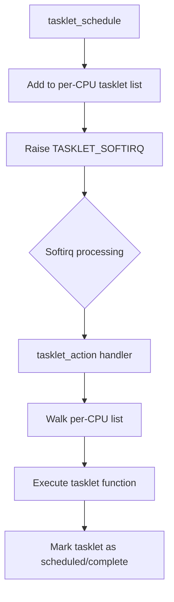
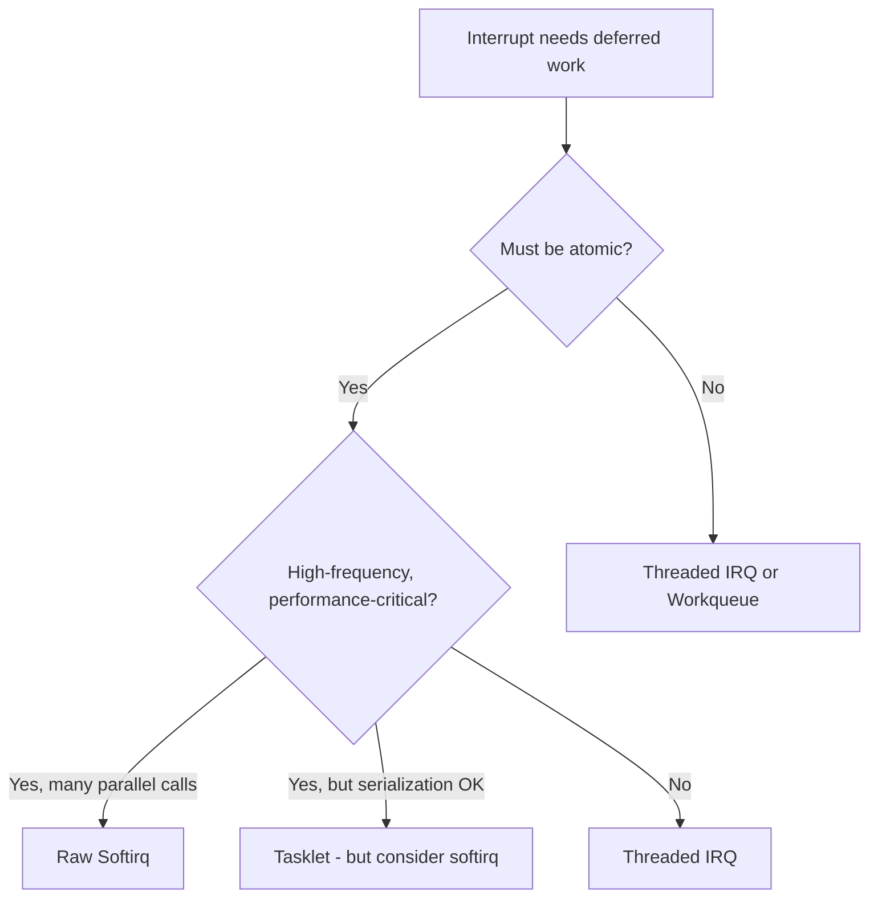
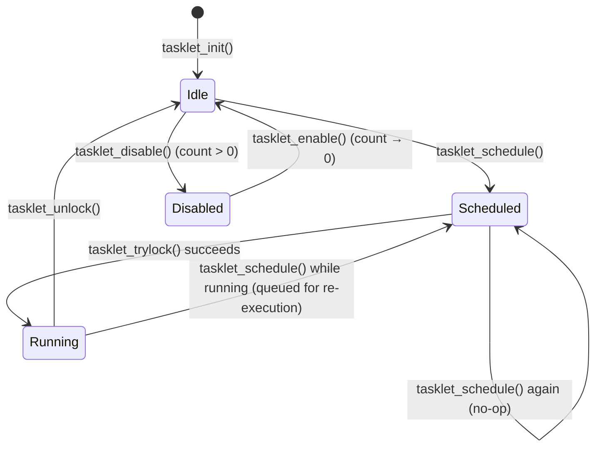

# Tasklets

## Introduction

Tasklets are a deferred work mechanism built on top of softirqs. They provide a simpler API than raw softirqs: you define a tasklet structure, schedule it from interrupt context, and the kernel calls your function later in softirq context. Tasklets were once the most popular bottom-half mechanism in Linux, but their use is now discouraged in favor of threaded IRQs and workqueues for new code.

Understanding tasklets remains important because they are still widely used in existing kernel code, they expose the softirq machinery, and they illustrate the design tradeoffs between concurrency and simplicity.

## How Tasklets Work

A tasklet is a dynamically allocated structure that is scheduled to run in softirq context. The key properties:

1. **Serialized**: A given tasklet runs on **one CPU at a time** — it will never execute concurrently on two CPUs.
2. **Atomic context**: Like softirqs, tasklet handlers cannot sleep.
3. **Two priorities**: Normal (`TASKLET_SOFTIRQ`) and high-priority (`HI_SOFTIRQ`).
4. **Dynamic**: Unlike softirqs, tasklets can be created and destroyed at runtime.

### Internal Implementation

Tasklets are implemented using two softirqs:

- `TASKLET_SOFTIRQ` — normal priority tasklets
- `HI_SOFTIRQ` — high-priority tasklets

When `tasklet_schedule()` is called, it adds the tasklet to a per-CPU linked list and raises `TASKLET_SOFTIRQ`. The softirq handler then walks the list and executes each tasklet:



### Data Structure

```c
struct tasklet_struct {
    struct tasklet_struct *next;     /* Next in per-CPU list */
    unsigned long state;             /* TASKLET_STATE_SCHED or TASKLET_STATE_RUN */
    atomic_t count;                  /* Enable/disable count (0 = enabled) */
    void (*func)(unsigned long);     /* Handler function */
    unsigned long data;              /* Argument to handler */
};
```

The `count` field implements enable/disable semantics:
- `count == 0` → tasklet is enabled and can be scheduled
- `count > 0` → tasklet is disabled (calls to `tasklet_schedule()` are ignored)

### Per-CPU Tasklet Vectors

The kernel maintains per-CPU tasklet lists:

```c
/* kernel/softirq.c */
struct tasklet_head {
    struct tasklet_struct *head;
    struct tasklet_struct **tail;
};

static DEFINE_PER_CPU(struct tasklet_head, tasklet_vec);
static DEFINE_PER_CPU(struct tasklet_head, hi_tasklet_vec);
```

When `tasklet_schedule()` is called:

1. The `TASKLET_STATE_SCHED` bit is atomically set on the tasklet.
2. The tasklet is appended to the current CPU's `tasklet_vec` list.
3. `TASKLET_SOFTIRQ` is raised via `raise_softirq()`.

The per-CPU nature means a tasklet is always scheduled on the CPU that calls `tasklet_schedule()`, not necessarily where it will execute (it could migrate if the softirq runs on a different CPU).

## API Reference

### Defining a Tasklet

**Static definition:**

```c
DECLARE_TASKLET(name, func, data);
DECLARE_TASKLET_DISABLED(name, func, data);  /* count = 1 */

/* Example */
DECLARE_TASKLET(my_tasklet, my_tasklet_func, (unsigned long)my_data);
```

**Dynamic definition:**

```c
struct tasklet_struct my_tasklet;

tasklet_init(&my_tasklet, my_tasklet_func, (unsigned long)my_data);
```

### Scheduling a Tasklet

```c
/* Schedule for normal-priority execution */
void tasklet_schedule(struct tasklet_struct *t);

/* Schedule for high-priority execution */
void tasklet_hi_schedule(struct tasklet_struct *t);
```

Both functions are safe to call from interrupt context. They check the `TASKLET_STATE_SCHED` bit to prevent double-scheduling:

```c
static inline void tasklet_schedule(struct tasklet_struct *t)
{
    if (!test_and_set_bit(TASKLET_STATE_SCHED, &t->state))
        __tasklet_schedule(t);
}
```

**Important**: `tasklet_schedule()` is safe to call from any context (hardirq, softirq, process). It uses `raise_softirq_irqoff()` when called with interrupts already disabled, or `raise_softirq()` otherwise.

### Killing a Tasklet

```c
/* Ensure the tasklet is not scheduled; wait for completion if running */
void tasklet_kill(struct tasklet_struct *t);
void tasklet_kill_immediate(struct tasklet_struct *t);
```

**`tasklet_kill()`** must be called from process context. It waits for the tasklet to complete if it's currently running. This is essential during module unload:

```c
static void __exit my_module_exit(void)
{
    tasklet_kill(&my_tasklet);
    /* Now safe to free resources */
}
```

**`tasklet_kill()` internals:**

```c
void tasklet_kill(struct tasklet_struct *t)
{
    if (in_interrupt())
        pr_warn("Attempt to kill tasklet from interrupt!\n");

    /* Wait for TASKLET_STATE_SCHED to be cleared */
    while (test_and_set_bit(TASKLET_STATE_SCHED, &t->state))
        cpu_relax();  /* Spin until scheduled bit is cleared */

    /* Clear the bit we just set */
    clear_bit(TASKLET_STATE_SCHED, &t->state);
}
```

### Enable/Disable

```c
void tasklet_enable(struct tasklet_struct *t);
void tasklet_disable(struct tasklet_struct *t);
void tasklet_disable_nosync(struct tasklet_struct *t);
```

- `tasklet_disable()` waits for the tasklet to complete if it's running
- `tasklet_disable_nosync()` returns immediately (useful in interrupt handlers)

```c
/* Disable: prevents scheduling, may wait for completion */
tasklet_disable(&my_tasklet);

/* Re-enable */
tasklet_enable(&my_tasklet);
```

**`tasklet_disable()` internals:**

```c
void tasklet_disable(struct tasklet_struct *t)
{
    atomic_inc(&t->count);  /* Increment disable counter */
    smp_mb__after_atomic();

    /* Wait for current execution to finish */
    while (test_bit(TASKLET_STATE_RUN, &t->state))
        cpu_relax();
}
```

### Checking State

```c
/* Check if tasklet is scheduled (pending execution) */
int tasklet_trylock(struct tasklet_struct *t);  /* Only meaningful from tasklet itself */
```

## Complete Example

```c
#include <linux/module.h>
#include <linux/interrupt.h>
#include <linux/timer.h>

struct my_device {
    struct tasklet_struct rx_tasklet;
    struct timer_list poll_timer;
    void __iomem *regs;
    /* ... */
};

static void my_rx_tasklet_func(unsigned long data)
{
    struct my_device *dev = (struct my_device *)data;
    u32 status;

    /* Read status — runs in softirq context, no sleeping */
    status = ioread32(dev->regs + STATUS_REG);

    while (status & RX_DATA_READY) {
        /* Process received data */
        process_rx_packet(dev);

        /* Acknowledge */
        iowrite32(RX_DATA_READY, dev->regs + STATUS_REG);
        status = ioread32(dev->regs + STATUS_REG);
    }
}

static irqreturn_t my_hardirq(int irq, void *dev_id)
{
    struct my_device *dev = dev_id;
    u32 status = ioread32(dev->regs + IRQ_STATUS);

    if (!(status & IRQ_RX))
        return IRQ_NONE;

    /* Disable RX interrupts at device level */
    iowrite32(0, dev->regs + IRQ_ENABLE);

    /* Schedule the tasklet to process data */
    tasklet_schedule(&dev->rx_tasklet);

    return IRQ_HANDLED;
}

static int __init my_init(void)
{
    struct my_device *dev;

    /* ... allocate and initialize dev ... */

    tasklet_init(&dev->rx_tasklet, my_rx_tasklet_func,
                 (unsigned long)dev);

    ret = request_irq(dev->irq, my_hardirq, 0, "my_dev", dev);
    if (ret)
        return ret;

    return 0;
}

static void __exit my_exit(void)
{
    free_irq(dev->irq, dev);
    tasklet_kill(&dev->rx_tasklet);  /* Wait for completion */
    /* ... free dev ... */
}
```

## Tasklets vs Softirqs

| Feature | Softirq | Tasklet |
|---------|---------|---------|
| Definition | Static, compile-time | Dynamic, runtime |
| Number | Fixed (10) | Unlimited |
| Concurrency | Same handler can run on multiple CPUs simultaneously | Serialized per tasklet instance |
| API complexity | Low-level | Higher-level, easier to use |
| Performance | Slightly faster (no list management) | Slight overhead from list and state management |
| Use case | Highest-frequency paths (networking, timers) | General deferred work from interrupt handlers |
| Context | Softirq (atomic) | Softirq (atomic) |

### Why Tasklets Serialize

Serialization is the defining property of tasklets. If `tasklet_schedule()` is called while the tasklet is already running on another CPU, the tasklet is queued but does not execute until the current execution finishes. This prevents a class of bugs:

```
CPU 0: tasklet_func running, accessing shared data
CPU 1: tasklet_schedule called → tasklet queued, NOT executed yet
CPU 0: tasklet_func completes
CPU 1: TASKLET_SOFTIRQ fires → tasklet_func runs on CPU 1
```

For code that doesn't need this serialization (e.g., the networking softirq handlers), raw softirqs are more efficient because they allow true parallelism.

### Serialization in Detail

The serialization mechanism uses the `TASKLET_STATE_RUN` bit:

```c
/* In tasklet_action() — the softirq handler */
if (tasklet_trylock(t)) {
    if (!atomic_read(&t->count)) {
        clear_bit(TASKLET_STATE_SCHED, &t->state);
        t->func(t->data);  /* Execute */
    }
    tasklet_unlock(t);
} else {
    /* TASKLET_STATE_RUN is set — another CPU is executing */
    /* Put the tasklet back on the list for later */
    tasklet_schedule(t);
}
```

`tasklet_trylock()` uses `test_and_set_bit()` on `TASKLET_STATE_RUN`:

```c
static inline int tasklet_trylock(struct tasklet_struct *t)
{
    return !test_and_set_bit(TASKLET_STATE_RUN, &(t)->state);
}

static inline void tasklet_unlock(struct tasklet_struct *t)
{
    clear_bit(TASKLET_STATE_RUN, &(t)->state);
    smp_mb__after_atomic();  /* Ensure visibility */
}
```

**Race scenario with serialization:**

```
Time    CPU 0                           CPU 1
────────────────────────────────────────────────────
t0      tasklet_schedule(my_tasklet)
        TASKLET_STATE_SCHED set
        added to CPU0 list

t1      TASKLET_SOFTIRQ fires
        tasklet_action runs
        tasklet_trylock → succeeds
        TASKLET_STATE_RUN set
        clear TASKLET_STATE_SCHED
        my_func() running...

t2                                      tasklet_schedule(my_tasklet)
                                        TASKLET_STATE_SCHED already set
                                        (test_and_set_bit returns 1)
                                        → no-op, already scheduled

t3      my_func() completes
        tasklet_unlock
        TASKLET_STATE_RUN cleared

t4                                      TASKLET_SOFTIRQ fires on CPU1
                                        (or CPU0 picks it up)
                                        tasklet_trylock → succeeds
                                        my_func() runs again
```

## Why Softirqs Are Now Preferred Over Tasklets

The kernel community has moved toward discouraging tasklets in new code. The reasoning:

1. **Serialization overhead**: The per-tasklet locking adds cost for high-frequency paths.
2. **Softirq context sleeping is impossible**: Both softirqs and tasklets cannot sleep, so if you need atomic context, raw softirqs give better performance.
3. **Threaded IRQs are better for most cases**: If the work doesn't need to run in softirq context, a threaded IRQ handler provides sleeping capability, priority control, and better debuggability.
4. **Workqueues for sleeping work**: For anything that can sleep, workqueues are the right choice.

The recommended hierarchy for new code:



### Commit Log Perspective

From kernel commit messages and mailing list discussions:

> "Tasklets are a broken design. They provide an illusion of concurrency control while actually causing more problems than they solve. Use threaded IRQs or workqueues."
> — Various kernel developers

The long-term plan has been to remove tasklets entirely, replacing their uses with:
- Threaded IRQs for most driver interrupt handling
- Workqueues for deferred work that needs to sleep
- Raw softirqs for the few cases that genuinely need atomic deferred processing

### Migration Examples

**Before (tasklet):**

```c
static irqreturn_t my_hardirq(int irq, void *dev_id)
{
    struct my_device *dev = dev_id;
    disable_rx_interrupts(dev);
    tasklet_schedule(&dev->rx_tasklet);
    return IRQ_HANDLED;
}

static void my_tasklet_func(unsigned long data)
{
    struct my_device *dev = (struct my_device *)data;
    process_rx_packets(dev);
    enable_rx_interrupts(dev);
}
```

**After (threaded IRQ):**

```c
static irqreturn_t my_hardirq(int irq, void *dev_id)
{
    struct my_device *dev = dev_id;
    disable_rx_interrupts(dev);
    return IRQ_WAKE_THREAD;  /* Wake the IRQ thread */
}

static irqreturn_t my_thread_fn(int irq, void *dev_id)
{
    struct my_device *dev = dev_id;
    process_rx_packets(dev);  /* Can sleep now! */
    enable_rx_interrupts(dev);
    return IRQ_HANDLED;
}

/* Registration */
ret = request_threaded_irq(dev->irq, my_hardirq, my_thread_fn,
                           IRQF_ONESHOT, "my_dev", dev);
```

**Benefits of the threaded IRQ version:**
- `process_rx_packets()` can now sleep (e.g., allocate with `GFP_KERNEL`).
- Priority is controllable via `chrt`.
- Appears in `ps` output for debugging.
- No need for explicit `tasklet_kill()` on module unload.

### Drivers That Still Use Tasklets (as of Linux 6.x)

Despite the deprecation push, many subsystems still use tasklets:

```bash
# Count tasklet usage in kernel source
$ grep -r "tasklet_schedule" drivers/ | wc -l
~200 call sites

# Major users:
# - Networking: some older drivers (not the core stack)
# - Sound: ALSA interrupt handling
# - TTY: serial port handling
# - Some SCSI drivers
# - DRM (some GPU interrupt handlers)
# - Various legacy drivers
```

## The `tasklet_action` Softirq Handler

The internal handler that processes tasklets is instructive:

```c
static __latent_entropy void tasklet_action(struct softirq_action *a)
{
    struct tasklet_struct *list;

    /* Atomically grab and clear the per-CPU tasklet list */
    local_irq_disable();
    list = __this_cpu_read(tasklet_vec.head);
    __this_cpu_write(tasklet_vec.head, NULL);
    __this_cpu_write(tasklet_vec.tail, &__this_cpu_read(tasklet_vec.head));
    local_irq_enable();

    while (list) {
        struct tasklet_struct *t = list;
        list = list->next;

        if (tasklet_trylock(t)) {
            if (!atomic_read(&t->count)) {
                /* Clear SCHED bit, set RUN bit */
                clear_bit(TASKLET_STATE_SCHED, &t->state);
                t->func(t->data);  /* Execute the tasklet */
            }
            tasklet_unlock(t);
            continue;
        }

        /* Another CPU is running this tasklet — put it back */
        /* ... */
    }
}
```

Key points:
- The entire per-CPU list is taken atomically
- Each tasklet is locked with `tasklet_trylock()` (which sets `TASKLET_STATE_RUN`)
- If the lock fails, the tasklet is rescheduled for later
- The `count` check handles disabled tasklets

### hi_tasklet_action

High-priority tasklets use a separate handler:

```c
static __latent_entropy void tasklet_hi_action(struct softirq_action *a)
{
    struct tasklet_struct *list;

    local_irq_disable();
    list = __this_cpu_read(hi_tasklet_vec.head);
    __this_cpu_write(hi_tasklet_vec.head, NULL);
    __this_cpu_write(hi_tasklet_vec.tail,
                     &__this_cpu_read(hi_tasklet_vec.head));
    local_irq_enable();

    while (list) {
        struct tasklet_struct *t = list;
        list = list->next;

        if (tasklet_trylock(t)) {
            if (!atomic_read(&t->count)) {
                clear_bit(TASKLET_STATE_SCHED, &t->state);
                t->func(t->data);
            }
            tasklet_unlock(t);
            continue;
        }
        /* Reschedule if locked */
        tasklet_hi_schedule(t);
    }
}
```

## High-Priority Tasklets

```c
/* Schedule on HI_SOFTIRQ (processed before TASKLET_SOFTIRQ) */
tasklet_hi_schedule(&my_tasklet);
```

High-priority tasklets are processed before normal tasklets because `HI_SOFTIRQ` has a lower softirq number (higher priority). Use them sparingly — they can starve normal tasklets and other softirqs.

**When to use high-priority tasklets:**

- Audio buffer underrun recovery (ALSA).
- Network device error handling that must complete before normal packet processing.
- Time-critical hardware acknowledgment that cannot wait for normal softirq processing.

**Anti-pattern:** Using `tasklet_hi_schedule()` for routine work. This delays all other softirq processing on that CPU.

## State Flags

```c
#define TASKLET_STATE_SCHED   0  /* Tasklet is scheduled (in the list) */
#define TASKLET_STATE_RUN     1  /* Tasklet is currently executing */
```

- `TASKLET_STATE_SCHED` is set by `tasklet_schedule()` and cleared when the tasklet begins execution
- `TASKLET_STATE_RUN` is set by `tasklet_trylock()` and cleared by `tasklet_unlock()`
- The state is per-CPU only in the sense that the list is per-CPU; the flags are in the tasklet struct itself

### State Transition Diagram



## When to Use Tasklets

**Appropriate use cases:**

- Simple deferred work from a hardirq handler that cannot be done in process context
- Code that needs atomic execution and per-instance serialization
- Porting existing softirq-based drivers to a simpler API

**Avoid tasklets when:**

- You need to sleep (use workqueues or threaded IRQs)
- You need maximum performance with per-CPU parallelism (use raw softirqs)
- You're writing new driver code (prefer threaded IRQs)

## Debugging Tasklets

### Tracing

```bash
# Enable softirq tracing (tasklets run under TASKLET_SOFTIRQ)
$ echo 1 > /sys/kernel/debug/tracing/events/softirq/enable

# Watch tasklet execution
$ cat /sys/kernel/debug/tracing/trace_pipe
          <idle>-0     [001] d.h1  1234.567: softirq_entry: vec=6 [action=TASKLET]
          <idle>-0     [001] d.h1  1234.568: softirq_exit:  vec=6 [action=TASKLET]
```

### Counting

```bash
$ cat /proc/softirqs | grep TASKLET
     TASKLET:    5678  6789  7890  8901
```

### Detecting Stuck Tasklets

If a tasklet handler takes too long, it delays all other softirqs on that CPU. Use `ftrace` function tracing to identify slow handlers:

```bash
$ echo tasklet_action > /sys/kernel/debug/tracing/set_ftrace_filter
$ echo function > /sys/kernel/debug/tracing/current_tracer
```

### Measuring Tasklet Latency

```bash
# Trace tasklet scheduling and execution latency
$ sudo perf record -e softirq:softirq_entry -e softirq:softirq_exit \
  -e irq:softirq_raise -a -- sleep 5

# Calculate time between raise and entry
$ sudo perf script | awk '
/softirq_raise.*vec=6/ { raise_time = $3 }
/softirq_entry.*vec=6/ {
    entry_time = $3
    if (raise_time) {
        latency = entry_time - raise_time
        print "Tasklet latency:", latency * 1000000, "us"
    }
}'

# Using trace-cmd
$ sudo trace-cmd record -e softirq -e irq/softirq_raise sleep 5
$ trace-cmd report | grep -A1 "softirq_raise.*vec=6" | head -20
```

### Tasklet Performance Impact

```bash
# Monitor if tasklets are causing softirq pressure
$ watch -n1 'cat /proc/softirqs | grep -E "TASKLET|HI:"'

# Check if ksoftirqd is being overwhelmed
$ ps aux | grep ksoftirqd
# High CPU usage in ksoftirqd indicates softirq overload

# Trace tasklet execution time using BPF
$ sudo bpftrace -e '
tracepoint:softirq:softirq_entry /args->vec == 6/ {
    @start[tid] = nsecs;
}
tracepoint:softirq:softirq_exit /args->vec == 6 && @start[tid]/ {
    @usecs = hist((nsecs - @start[tid]) / 1000);
    delete(@start[tid]);
}'
```

### Common Tasklet Bugs and How to Detect Them

**Bug 1: Forgetting to call `tasklet_kill()`**

```bash
# Symptom: use-after-free crash during module unload
# Detection: KASAN (Kernel Address Sanitizer)
$ echo 1 > /proc/sys/kernel/kasan_multi_shot
# Inspect dmesg for KASAN reports after rmmod
```

**Bug 2: Sleeping in a tasklet handler**

```bash
# Symptom: scheduling while atomic BUG
# Detection: CONFIG_DEBUG_ATOMIC_SLEEP=y
# dmesg will show:
# BUG: sleeping function called from invalid context at mm/slab.c:3521
# in_atomic(): 1, irqs_disabled(): 0, pid: 0, name: swapper/0
```

**Bug 3: Double-scheduling**

```bash
# Symptom: tasklet runs more often than expected
# The TASKLET_STATE_SCHED bit prevents this naturally,
# but if you clear it manually (don't!), you'll get double execution.
# Detection: trace softirq counts and compare with expected schedule rate
```

**Bug 4: Tasklet running after device is freed**

```bash
# Symptom: NULL pointer dereference in tasklet handler
# Ensure ordering:
# 1. free_irq() — prevents new tasklet schedules
# 2. tasklet_kill() — waits for current execution
# 3. Free device structures
# Wrong order causes use-after-free
```

## Tasklet Usage in the Kernel Source Tree

### Examples of Tasklet Usage in Drivers

**ALSA (Sound) — `sound/pci/`:**

```c
/* sound/pci/emu10k1/emu10k1.c */
static irqreturn_t _emu10k1_interrupt(int irq, void *dev_id)
{
    struct emu10k1 *emu = dev_id;
    u32 status = inl(emu->port + IPR);

    if (status & IRQTYPE_TIMER) {
        outl(IRQTYPE_TIMER, emu->port + IPR);
        tasklet_schedule(&emu->timer_tasklet);
    }

    /* ... other interrupt sources ... */
    return IRQ_HANDLED;
}
```

**TTY Serial — `drivers/tty/serial/`:**

```c
/* drivers/tty/serial/8250/8250_port.c */
static irqreturn_t serial8250_interrupt(int irq, void *dev_id)
{
    struct uart_8250_port *up = dev_id;

    /* Handle UART interrupt */
    /* ... */

    tasklet_schedule(&up->tx_tasklet);
    return IRQ_HANDLED;
}
```

**DRM (Graphics) — `drivers/gpu/drm/`:**

```c
/* Some DRM drivers use tasklets for vblank handling */
static irqreturn_t my_gpu_irq_handler(int irq, void *data)
{
    struct drm_device *dev = data;
    u32 status = gpu_read_status(dev);

    if (status & VBLANK_IRQ) {
        tasklet_schedule(&dev->vblank_tasklet);
    }
    return IRQ_HANDLED;
}
```

## Alternatives to Tasklets

### Threaded IRQs (Preferred for Drivers)

```c
/* Replace tasklet with threaded IRQ */
static irqreturn_t my_hardirq(int irq, void *dev_id)
{
    /* Minimal acknowledgment only */
    return IRQ_WAKE_THREAD;
}

static irqreturn_t my_thread_fn(int irq, void *dev_id)
{
    /* Full processing in process context */
    /* Can sleep, use GFP_KERNEL, acquire mutexes */
    return IRQ_HANDLED;
}
```

### Workqueues (For Complex Deferred Work)

```c
/* Replace tasklet with workqueue */
struct work_struct my_work;

static void my_work_fn(struct work_struct *work)
{
    /* Process in process context */
    /* Can sleep */
}

static irqreturn_t my_hardirq(int irq, void *dev_id)
{
    schedule_work(&my_work);
    return IRQ_HANDLED;
}
```

### IRQ Work (For Atomic Work from NMI)

```c
/* For work that must be done from NMI context */
struct irq_work my_irq_work;

static void my_irq_work_fn(struct irq_work *work)
{
    /* Runs in hardirq context, but from a safe point */
}

irq_work_queue(&my_irq_work);
```

## References

- [The Linux Kernel Documentation](https://docs.kernel.org/)
- [GNU Project Documentation](https://www.gnu.org/doc/doc.html)
- [GNU Manuals](https://www.gnu.org/manual/manual.html)
- [Free Software Directory](https://directory.fsf.org/wiki/Main_Page)
- [Planet GNU](https://planet.gnu.org/)
- [Free Software Books](https://www.gnu.org/doc/other-free-books.html)

- [Linux Kernel Source: include/linux/interrupt.h](https://git.kernel.org/pub/scm/linux/kernel/git/torvalds/linux.git/tree/include/linux/interrupt.h)
- [Linux Kernel Documentation: Bottom Half Mechanisms](https://www.kernel.org/doc/html/latest/kernel-hacking/hacking.html#bottom-halves)
- [LWN: "The ongoing search for tasklet alternatives"](https://lwn.net/Articles/830965/)
- [LWN: "Removing tasklets"](https://lwn.net/Articles/832785/)
- [LWN: "Threaded interrupt handlers"](https://lwn.net/Articles/302043/)

## Related Topics

- [Interrupts Overview](overview.md) — IRQ numbers, routing, interrupt context
- [Interrupt Handlers](handlers.md) — request_irq, threaded interrupts
- [Softirqs](softirqs.md) — The foundation underneath tasklets
- [Workqueues](workqueues.md) — Process-context deferred work
- [Spinlocks](../sync/spinlocks.md) — Locking in tasklet/softirq context
