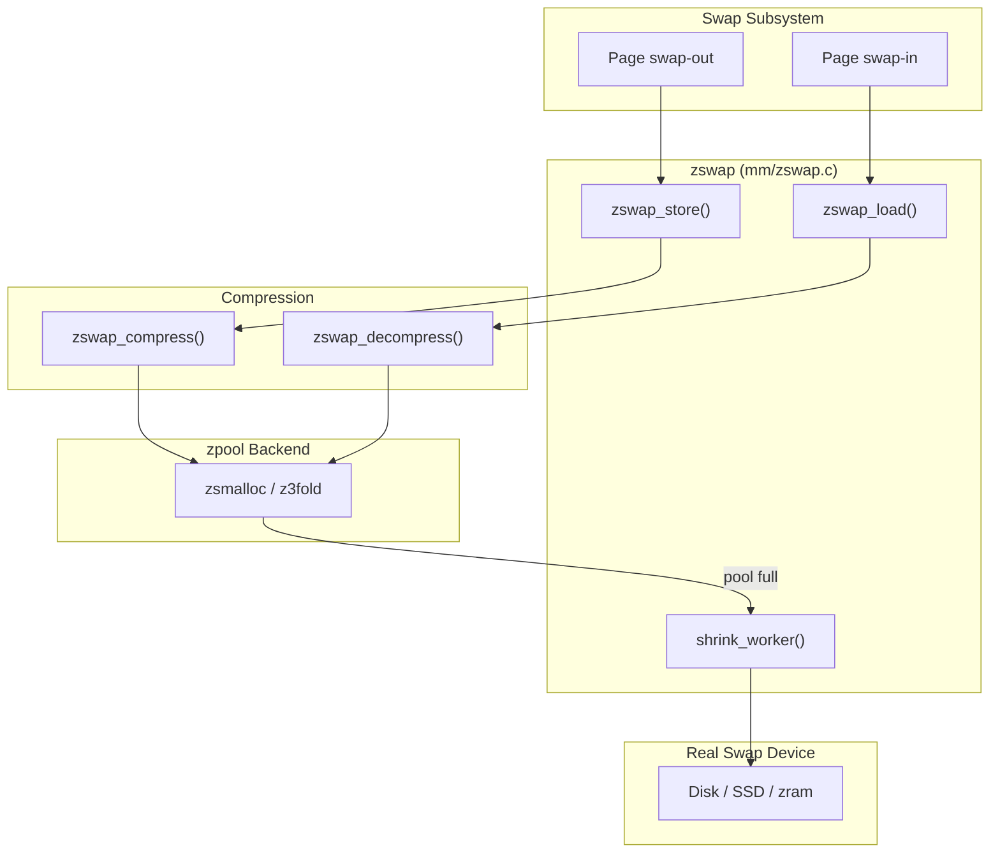
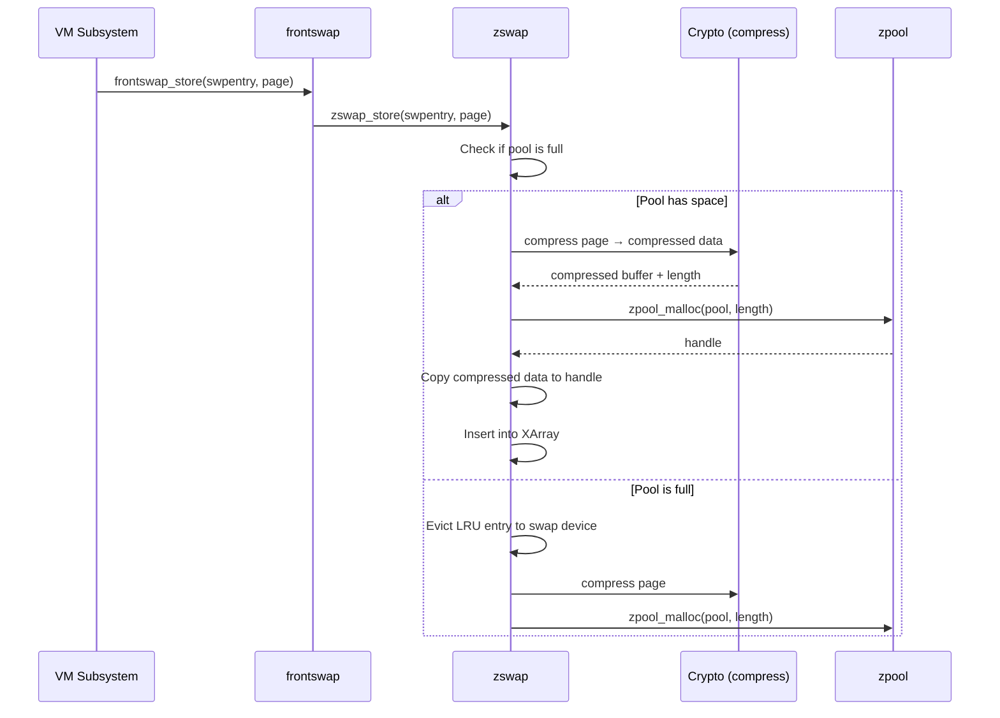
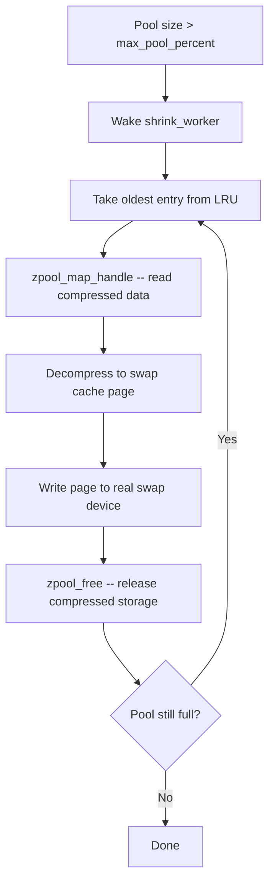
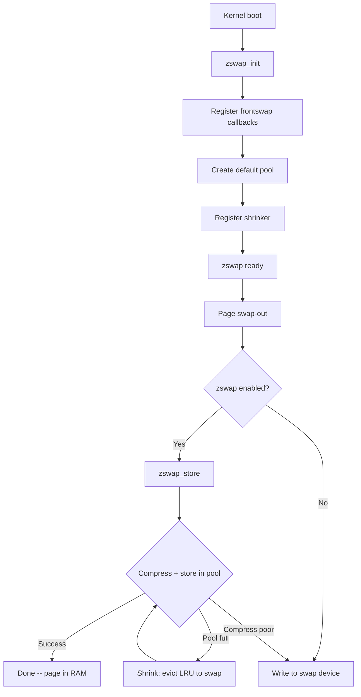
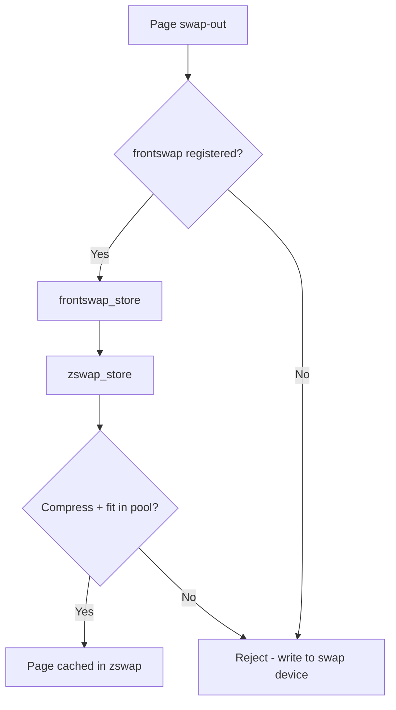

# zswap: Compressed Swap Cache

## Overview

zswap is an in-kernel compressed cache for swap pages. It intercepts pages on their way to the swap device, compresses them, and stores them in a **zpool**-backed memory pool. If the page is accessed again, it's decompressed from RAM instead of reading from the slow swap device — trading CPU cycles for I/O reduction.

zswap is **not** a swap device itself. It sits in front of a real swap device (disk, SSD, or zram) and acts as a write-back cache. When the compressed pool fills up, least-recently-used entries are evicted ("written back") to the backing swap device.

> **Introduced:** Linux 3.11 (commit `c890572`)  
> **Source:** `mm/zswap.c`

---

## Architecture



### How zswap Differs from zram

| Aspect | zswap | zram |
|--------|-------|------|
| **Role** | Write-back cache for swap | Virtual swap device |
| **Requires swap device** | Yes | No |
| **Eviction** | To real swap device | To backing device (optional) |
| **Compression** | In-kernel via crypto API | In-kernel via zcomp |
| **Allocator** | zpool (zsmalloc/z3fold) | zsmalloc |
| **Use case** | Reduce swap I/O | Replace swap device entirely |

---

## Key Data Structures

### struct zswap_pool

```c
/* mm/zswap.c */
struct zswap_pool {
    struct kref refcount;             /* Reference counting */
    struct work_struct release_work;  /* Deferred release */
    struct work_struct shrink_work;   /* Shrinker work */
    struct crypto acomp_ctx __percpu *acomp_ctxs; /* Per-CPU compression contexts */
    struct zpool *zpool;              /* zpool backend (zsmalloc/z3fold) */
    struct hlist_node node;           /* Hash table linkage */
    char tfm_name[CRYPTO_MAX_ALG_NAME]; /* Compression algorithm name */
};
```

### struct zswap_entry

Each swap entry stored in zswap has an associated entry:

```c
/* mm/zswap.c */
struct zswap_entry {
    struct rb_node rbnode;       /* Red-black tree node (swap entry lookup) */
    swp_entry_t swpentry;       /* Swap entry (offset + type) */
    unsigned int length;         /* Compressed data length */
    struct zswap_pool *pool;     /* Pool that owns this entry */
    struct list_head lru;        /* LRU list for eviction */
    unsigned long handle;        /* zpool handle */
    bool same_filled;            /* All bytes are the same value */
    unsigned char value;         /* The fill value (if same_filled) */
    /* ... */
};
```

### Lookup Structure

zswap uses an **XArray** (per-swap-device) to map swap entries to zswap entries:

```c
/* mm/zswap.c */
struct zswap_header {
    struct xarray *tree;  /* XArray: swap_entry → zswap_entry */
    spinlock_t lock;      /* Per-tree lock */
};
```

---

## The Compression Pipeline

### Store Path: zswap_store()

When a page is swapped out, zswap intercepts it via the **frontswap** API:



### Compression Details

zswap uses the kernel's **crypto API** for compression:

```c
/* mm/zswap.c — compression */
static int zswap_compress(struct page *page, struct zswap_entry *entry,
                           struct crypto_acomp_ctx *ctx)
{
    struct scatterlist src, dst;
    struct acomp_req *req;
    unsigned int dlen = PAGE_SIZE;
    void *dst_mem;

    /* Set up source (page) and destination (compressed buffer) */
    sg_init_table(&src, 1);
    sg_set_page(&src, page, PAGE_SIZE, 0);

    dst_mem = kmalloc(dlen, GFP_KERNEL);
    sg_init_table(&dst, 1);
    sg_set_buf(&dst, dst_mem, dlen);

    req = acomp_request_alloc(ctx);
    acomp_request_set_params(req, &src, &dst, PAGE_SIZE, dlen);
    acomp_request_set_callback(req, 0, NULL, NULL);

    return crypto_acomp_compress(req);
}
```

### Load Path: zswap_load()

When a swapped-in page is requested:

```c
/* mm/zswap.c — decompression */
static int zswap_load(struct page *page, struct zswap_entry *entry)
{
    /* Map the compressed data from zpool */
    void *src = zpool_map_handle(entry->pool->zpool, entry->handle,
                                  ZPOOL_MM_RO);

    if (entry->same_filled) {
        /* Fill page with the repeated value */
        memset(page_address(page), entry->value, PAGE_SIZE);
    } else {
        /* Decompress */
        zswap_decompress(page, src, entry->length);
    }

    /* Free the zpool entry */
    zpool_free(entry->pool->zpool, entry->handle);
    zswap_entry_free(entry);
    return 0;
}
```

---

## Pool Management and Writeback

### Global Pool Size Limit

zswap has a configurable maximum pool size:

```bash
# Set maximum zswap pool size (percentage of total RAM)
echo 20 > /sys/module/zswap/parameters/max_pool_percent
# Default: 20 (20% of total RAM)
```

### The Global LRU

zswap maintains a **global LRU list** of entries. When the pool exceeds the size limit, the shrinker evicts the least-recently-used entries:

```c
/* mm/zswap.c */
static struct list_head zswap_lru_list;
static DEFINE_SPINLOCK(zswap_lru_lock);
```

### The Shrinker and Writeback: shrink_worker()

When the pool is full, zswap's shrink worker evicts entries to the real swap device:



### Second-Chance LRU Algorithm

zswap uses a **second-chance** algorithm to avoid evicting frequently-accessed entries:

```c
/* mm/zswap.c */
static struct zswap_entry *zswap_lru_entry(void)
{
    struct zswap_entry *entry;

    list_for_each_entry_reverse(entry, &zswap_lru_list, lru) {
        if (!entry->referenced) {
            /* Not referenced since last check — evict this one */
            return entry;
        }
        /* Give second chance: clear reference, move to tail */
        entry->referenced = false;
        list_move(&entry->lru, &zswap_lru_list);
    }
    return NULL;
}
```

---

## Same-Filled Page Detection

Before compressing, zswap checks if the page is filled with a single byte value. If so, it stores just the value instead of compressing:

```c
/* mm/zswap.c */
static bool zswap_is_same_filled(const void *page, unsigned char *value)
{
    *value = *(unsigned char *)page;
    return memchr_inv(page, *value, PAGE_SIZE) == NULL;
}
```

This optimization saves compression time and storage for zero-filled pages, which are common in new allocations.

---

## Per-Cgroup Limits

In cgroup v2, zswap limits can be set per-cgroup:

```bash
# Set per-cgroup zswap limit
echo 1G > /sys/fs/cgroup/myapp/memory.zswap.max

# Check zswap usage per cgroup
cat /sys/fs/cgroup/myapp/memory.zswap.current
```

---

## Sysfs Tunables

```bash
# Enable/disable zswap
echo 1 > /sys/module/zswap/parameters/enabled
cat /sys/module/zswap/parameters/enabled
# Y or N

# Compression algorithm
echo lz4 > /sys/module/zswap/parameters/compressor
cat /sys/module/zswap/parameters/compressor
# Options: lzo, lz4, zstd, deflate, 842, etc.

# zpool backend allocator
echo zsmalloc > /sys/module/zswap/parameters/zpool
cat /sys/module/zswap/parameters/zpool
# Options: zbud, z3fold, zsmalloc

# Maximum pool size (percentage of total RAM)
echo 20 > /sys/module/zswap/parameters/max_pool_percent
cat /sys/module/zswap/parameters/max_pool_percent
# Default: 20

# Accept huge pages into zswap (Linux 6.8+)
echo Y > /sys/module/zswap/parameters/accept_huge
```

---

## Kconfig Options

```
CONFIG_ZSWAP=y                  # Enable zswap
CONFIG_ZSWAP_COMPRESSOR_DEFAULT_LZ4=y  # Default compressor
CONFIG_ZSWAP_ZPOOL_DEFAULT_ZSMALLOC=y   # Default allocator
```

---

## Observability

### debugfs: /sys/kernel/debug/zswap/

```bash
# Check zswap statistics
cat /sys/kernel/debug/zswap/pool_total_size   # Total pool size in bytes
cat /sys/debug/zswap/same_filled_pages        # Same-filled pages (not compressed)
cat /sys/debug/zswap/stored_pages             # Pages currently stored
cat /sys/debug/zswap/pool_limit_hit           # Pool limit hit count
cat /sys/debug/zswap/writeback_count          # Pages written back to swap
cat /sys/debug/zswap/reject_compress_poor     # Rejected (compression ratio too low)
cat /sys/debug/zswap/reject_alloc_fail        # Rejected (allocation failed)
cat /sys/debug/zswap/reject_kmemcache_fail    # Rejected (kmem_cache failed)
```

### vmstat Events

```bash
# zswap activity counters
grep -i zswap /proc/vmstat
# zswpout_pages     — Pages stored in zswap
# zswpin_pages      — Pages loaded from zswap
# zswpwb_count      — Pages written back to swap device
# zswpwb_fail_count — Failed writeback attempts
```

### Per-Cgroup Stats

```bash
# Per-cgroup zswap stats (cgroup v2)
cat /sys/fs/cgroup/<cgroup>/memory.zswap.current
cat /sys/fs/cgroup/<cgroup>/memory.events
# zswap 123    — zswap events
```

### Estimating Compression Ratio

```bash
# Compression ratio = stored_pages * PAGE_SIZE / pool_total_size
STORED=$(cat /sys/kernel/debug/zswap/stored_pages)
SIZE=$(cat /sys/kernel/debug/zswap/pool_total_size)
echo "Compression ratio: $(echo "scale=2; $STORED * 4096 / $SIZE" | bc)x"
```

---

## Performance Tradeoffs

### CPU vs. Memory vs. I/O

| Scenario | zswap Impact |
|----------|-------------|
| **High memory pressure, slow swap** | Major win — avoids disk I/O |
| **Low memory pressure** | Slight overhead from compression |
| **CPU-bound workloads** | May hurt — compression uses CPU |
| **I/O-bound workloads** | Helps — reduces swap device contention |
| **Many zero-filled pages** | Big win — same-filled optimization |

### Compressor Comparison

| Compressor | Speed | Ratio | CPU Usage | Best For |
|-----------|-------|-------|-----------|----------|
| lz4 | Fastest | 2.1:1 | Low | Latency-sensitive |
| lzo | Fast | 2.0:1 | Low | Balanced |
| zstd | Slow | 2.8:1 | Medium | High memory pressure |
| deflate | Slowest | 2.5:1 | High | Rarely used |

**Recommendation**: Use `lz4` for most workloads. Switch to `zstd` if memory pressure is extreme and CPU is available.

### When to Enable the Shrinker

Enable the shrinker (default) if you have a swap device. Disable it if:
- You're using zram as a swap device (no real I/O savings)
- You want zswap to be a pure cache (never evict)

### Pool Size Tuning

```bash
# For systems with 64GB RAM:
# Default: 20% = 12.8GB zswap pool
# Adjust based on workload:
# - Database: 10-15% (leave room for page cache)
# - Container host: 5-10% (per-cgroup limits are better)
# - Desktop: 25-30% (maximize swap avoidance)
```

---

## Initialization and Lifecycle



---

## Frontswap API and Evolution

### How zswap Hooks into the Swap Path

zswap intercepts swap-out requests via the **frontswap** API. Frontswap is a shim layer between the swap subsystem and in-memory caching backends:



### Frontswap Deprecation (Linux 6.x)

The frontswap API is being **deprecated** in Linux 6.x in favor of a more direct integration:

```c
/* Old: frontswap hooks (deprecated) */
frontswap_store(swpentry, page);
frontswap_load(swpentry, page);

/* New: direct zswap hooks in swap path (Linux 6.8+) */
swap_writepage_folio() {
    /* Check zswap directly without frontswap */
    if (zswap_store(folio))
        return;  /* Page cached in zswap */
    /* Otherwise, write to swap device */
}
```

The new integration eliminates the frontswap indirection layer, simplifying the code and improving performance.

### ZSWAP_STORE_FAILED Flag

When zswap rejects a page (poor compression, pool full), the swap subsystem falls through to the real swap device. The `SWAP_FLAG_ZSWAP_STORE_FAILED` flag marks entries that were rejected:

```c
/* mm/swap.c */
static int swap_writepage_folio(struct folio *folio, struct swap_iocb *plug)
{
    /* Try zswap first */
    if (zswap_store(folio)) {
        /* Stored in zswap -- no disk I/O */
        return 0;
    }
    /* zswap rejected -- fall through to swap device */
    return __swap_writepage_folio(folio, plug);
}
```

---

## Detailed Writeback Mechanics

### When Does Writeback Happen?

Writeback occurs when the zswap pool exceeds `max_pool_percent`. The kernel uses a **shrinker** mechanism:

```c
/* mm/zswap.c -- shrinker callback */
static unsigned long zswap_shrink_count(struct shrinker *shrinker,
                                         struct shrink_control *sc)
{
    /* Return number of reclaimable pages */
    return atomic_read(&zswap_stored_pages);
}

static unsigned long zswap_shrink_scan(struct shrinker *shrinker,
                                        struct shrink_control *sc)
{
    /* Evict LRU entries until we've freed enough */
    unsigned long nr_to_scan = sc->nr_to_scan;
    unsigned long nr_freed = 0;

    while (nr_freed < nr_to_scan) {
        struct zswap_entry *entry = zswap_lru_entry();
        if (!entry)
            break;
        zswap_writeback_entry(entry);
        nr_freed++;
    }
    return nr_freed;
}
```

### Writeback Cost

Writing back an entry from zswap to the swap device involves:

1. **Decompress** the page from zswap (CPU cost)
2. **Allocate** a page from the swap cache
3. **Write** the page to the swap device (I/O cost)
4. **Free** the zpool allocation

This is more expensive than a direct swap-out because of the decompression step. However, it happens infrequently compared to the number of cache hits.

### Disabling Writeback

```bash
# Disable writeback (zswap will reject new entries when pool is full)
# This is useful when using zram as the swap device
# (no I/O savings from writeback to another compressed device)

echo N > /sys/module/zswap/parameters/enabled  # Disable zswap entirely
# Or set max_pool_percent to a very high value
echo 90 > /sys/module/zswap/parameters/max_pool_percent
```

---

## zpool Backend Comparison

### zsmalloc

zsmalloc is the **default** backend. It packs objects of different sizes into fixed-size zspage groups:

- **Pros**: Very high density (low internal fragmentation), fast allocation
- **Cons**: Cannot reclaim individual pages easily (compaction needed)

```c
/* mm/zsmalloc.c -- simplified */
struct zs_pool {
    struct size_class *size_class[ZS_SIZE_CLASSES];
    /* Each size class manages objects of a specific size */
};
```

### zbud

zbud stores **at most two** compressed pages per physical page:

- **Pros**: Simple, predictable
- **Cons**: Low density (max 50% utilization)

### z3fold

z3fold stores **at most three** compressed pages per physical page:

- **Pros**: Better density than zbud
- **Cons**: More complex allocation logic

### Density Comparison

| Backend | Max Entries/Page | Typical Utilization | Best For |
|---------|-----------------|---------------------|----------|
| zbud | 2 | ~40-50% | Predictability |
| z3fold | 3 | ~55-65% | Balanced |
| zsmalloc | Many | ~70-85% | Density (default) |

---

## Huge Page Support (Linux 6.8+)

Starting with Linux 6.8, zswap can accept **transparent huge pages (THP)**:

```bash
# Enable huge page acceptance
echo Y > /sys/module/zswap/parameters/accept_huge
```

When `accept_huge=Y`, zswap compresses entire 2MB huge pages instead of splitting them into 4KB pages first. This can improve compression ratio (more data to compress = better patterns) and reduce the number of zswap entries.

However, huge page zswap entries are more expensive to evict (must decompress and write back 2MB instead of 4KB).

---

## Debugging and Troubleshooting

### zswap Not Working

```bash
# 1. Check if zswap is enabled
cat /sys/module/zswap/parameters/enabled
# Should be Y

# 2. Check if swap is configured
swapon --show
# NAME      TYPE      SIZE
# /dev/sda2 partition 8G

# 3. Check if compression is working
grep zswap /proc/vmstat
# zswpout_pages 0 -- zswap is not receiving pages
# Check that frontswap is registered
grep frontswap /proc/kallsyms

# 4. Check pool status
cat /sys/kernel/debug/zswap/stored_pages
# 0 -- no pages stored
```

### Poor Compression Ratio

```bash
# Check compression ratio
STORED=$(cat /sys/kernel/debug/zswap/stored_pages)
SIZE=$(cat /sys/kernel/debug/zswap/pool_total_size)
if [ "$STORED" -gt 0 ] && [ "$SIZE" -gt 0 ]; then
    echo "Compression ratio: $(echo "scale=2; $STORED * 4096 / $SIZE" | bc)x"
fi
# If < 1.5x, consider switching compressor

# Try different compressor
echo zstd > /sys/module/zswap/parameters/compressor
# zstd has better ratio but higher CPU
```

### High Rejection Rate

```bash
# Check rejection reasons
cat /sys/kernel/debug/zswap/reject_compress_poor  # Compression ratio too low
cat /sys/kernel/debug/zswap/reject_alloc_fail    # Allocation failed
cat /sys/kernel/debug/zswap/reject_kmemcache_fail  # kmem_cache failed

# If reject_compress_poor is high:
# - Try a better compressor (zstd)
# - Increase max_pool_percent
# - Accept that some pages are better on swap device
```

### Pool Limit Hits

```bash
# Check how often the pool limit is hit
cat /sys/kernel/debug/zswap/pool_limit_hit
# If increasing rapidly, either:
# - Increase max_pool_percent
# - Add more swap device space
# - Reduce memory pressure (add RAM)
```

---

## Key Source Files

| File | Contents |
|------|----------|
| `mm/zswap.c` | Core zswap implementation |
| `mm/zpool.c` | zpool abstraction layer |
| `mm/zsmalloc.c` | zsmalloc allocator |
| `mm/frontswap.c` | Frontswap API (deprecated in 6.x) |
| `include/linux/zswap.h` | zswap header |
| `Documentation/admin-guide/mm/zswap.rst` | Admin documentation |

---

## Further Reading

- **Kernel documentation**: `Documentation/admin-guide/mm/zswap.rst`
- **kernel-internals.org**: [zswap](https://kernel-internals.org/mm/zswap/)
- **LWN**: ["zswap: a compressed write-back cache"](https://lwn.net/Articles/537422/)
- **LWN**: ["Virtual Swap Space"](https://lwn.net/Articles/1019395/) — 2025 zswap changes
- **commit c890572** — zswap introduction (Linux 3.11)

---

## See Also

- [zpool](./zpool.md) — compressed memory pool backend
- [Swap](./swap.md) — swap subsystem
- [Page Reclaim](./reclaim.md) — page reclaim triggers zswap eviction
- zram — compressed RAM-based block device
- [OOM Killer](./oom-killer.md) — OOM when zswap can't help
- [Page Types](./page-types.md) — what pages can be zswapped
