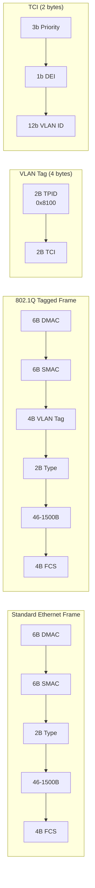

# VLANs

## Introduction

VLANs (Virtual Local Area Networks) are defined by IEEE 802.1Q and allow a single physical network to be logically segmented into multiple broadcast domains. Each VLAN operates as if it were a separate physical switch — devices on VLAN 100 cannot communicate with devices on VLAN 200 without a router or Layer 3 device.

In Linux, VLANs are implemented as virtual interfaces (subinterfaces) on top of physical or bonded interfaces. The kernel adds/removes 802.1Q tags (4 bytes) on outgoing/incoming frames, allowing a single physical link to carry traffic for multiple VLANs (trunk mode).

## 802.1Q Frame Format



The VLAN tag adds 4 bytes to the Ethernet frame:
- **TPID** (Tag Protocol Identifier): 0x8100 identifies a VLAN-tagged frame
- **Priority** (3 bits): 802.1p CoS (Class of Service), 0-7
- **DEI** (1 bit): Drop Eligible Indicator
- **VID** (12 bits): VLAN ID, 0-4095 (0 and 4095 are reserved)

### 802.1p Priority Values

| Priority | Traffic Type | Typical Use |
|----------|-------------|-------------|
| 0 | Best Effort | Default (all traffic) |
| 1 | Background | Bulk transfers |
| 2 | Excellent Effort | Business critical |
| 3 | Critical Applications | SAP, ERP |
| 4 | Video | Streaming, video conferencing |
| 5 | Voice | VoIP |
| 6 | Internetwork Control | Routing protocols |
| 7 | Network Control | STP, LLDP |

### Reserved VLAN IDs

| VID | Purpose |
|-----|---------|
| 0 | Priority-tagged frame (no VLAN) |
| 1 | Default VLAN (PVID on most switches) |
| 4095 | Reserved for implementation use |

## Creating VLAN Interfaces

### Using iproute2

```bash
# Ensure 8021q module is loaded
modprobe 8021q

# Create VLAN interface
ip link add link eth0 name eth0.100 type vlan id 100

# Configure IP
ip addr add 192.168.100.1/24 dev eth0.100
ip link set eth0.100 up

# Bring up parent interface
ip link set eth0 up

# Verify
ip -d link show eth0.100
# eth0.100@eth0: <BROADCAST,MULTICAST,UP,LOWER_UP> mtu 1500 ...
#     vlan protocol 802.1Q id 100

# View VLAN details
cat /proc/net/vlan/eth0.100
# eth0.100  VID: 100   REORDER_HDR: 1  dev->priv_flags: 1
#          total frames received          12345
#           total bytes received         1234567
#       Tagged frames received            12345
#      Priority tagged received               0
#         VLAN frames TX                 6789
#          total bytes transmitted       678901
```

### Multiple VLANs on One Interface (Trunk)

```bash
# Physical interface acts as trunk
ip link set eth0 up

# Create VLAN 100 (office)
ip link add link eth0 name eth0.100 type vlan id 100
ip addr add 192.168.100.1/24 dev eth0.100
ip link set eth0.100 up

# Create VLAN 200 (servers)
ip link add link eth0 name eth0.200 type vlan id 200
ip addr add 192.168.200.1/24 dev eth0.200
ip link set eth0.200 up

# Create VLAN 300 (management)
ip link add link eth0 name eth0.300 type vlan id 300
ip addr add 10.0.30.1/24 dev eth0.300
ip link set eth0.300 up

# Verify all VLANs
ip link show type vlan
# eth0.100@eth0: ... vlan protocol 802.1Q id 100
# eth0.200@eth0: ... vlan protocol 802.1Q id 200
# eth0.300@eth0: ... vlan protocol 802.1Q id 300
```

### Using vconfig (Legacy, Deprecated)

```bash
# Legacy method — use iproute2 instead
vconfig add eth0 100
vconfig set_flag eth0.100 1 1
ifconfig eth0.100 192.168.100.1 netmask 255.255.255.0 up
```

## VLAN Configuration Methods

### Using /etc/netplan (Ubuntu)

```yaml
# /etc/netplan/01-vlans.yaml
network:
  version: 2
  ethernets:
    eth0:
      dhcp4: false
  vlans:
    eth0.100:
      id: 100
      link: eth0
      addresses:
        - 192.168.100.1/24
    eth0.200:
      id: 200
      link: eth0
      addresses:
        - 192.168.200.1/24
```

### Using NetworkManager

```bash
# Create VLAN connection
nmcli connection add type vlan \
    con-name vlan100 \
    ifname eth0.100 \
    dev eth0 \
    id 100 \
    ipv4.addresses 192.168.100.1/24 \
    ipv4.method manual

# Activate
nmcli connection up vlan100

# Show VLAN
nmcli connection show vlan100 | grep vlan
# vlan.parent:    eth0
# vlan.id:        100
# vlan.protocol:  802.1Q
```

### Using systemd-networkd

```ini
# /etc/systemd/network/10-eth0.netdev
[NetDev]
Name=eth0.100
Kind=vlan

[VLAN]
Id=100

# /etc/systemd/network/10-eth0.network
[Match]
Name=eth0

[Network]
VLAN=eth0.100

# /etc/systemd/network/10-eth0.100.network
[Match]
Name=eth0.100

[Network]
Address=192.168.100.1/24
```

## Bridge VLAN Filtering

Linux bridges support VLAN-aware switching (802.1Q). See also [Bridging](./bridging.md).

```bash
# Create VLAN-aware bridge
ip link add name br0 type bridge vlan_filtering 1

# eth0: trunk port (carries VLANs 100, 200)
ip link set eth0 master br0
bridge vlan add dev eth0 vid 100
bridge vlan add dev eth0 vid 200

# tap0: access port on VLAN 100
ip link set tap0 master br0
bridge vlan add dev tap0 vid 100 pvid untagged
bridge vlan del dev tap0 vid 1  # remove default VLAN

# tap1: access port on VLAN 200
ip link set tap1 master br0
bridge vlan add dev tap1 vid 200 pvid untagged
bridge vlan del tap1 vid 1

# Show VLAN table
bridge vlan show
# port    vlan ids
# eth0     100
#          200
# tap0     1 PVID Egress Untagged
#          100 PVID Egress Untagged
# tap1     1 PVID Egress Untagged
#          200 PVID Egress Untagged
# br0      1 PVID Egress Untagged
```

### Bridge VLAN and STP

```bash
# Per-VLAN STP state
bridge vlan dev eth0 vid 100 state 3  # forwarding
bridge vlan dev eth0 vid 200 state 3  # forwarding

# View VLAN STP states
bridge -d vlan show
```

### Bridge VLAN Priority

```bash
# Set VLAN priority (802.1p) on bridge port
bridge vlan dev eth0 vid 100 self
bridge vlan dev eth0 vid 100 master

# Set default priority for untagged ingress traffic
bridge vlan dev tap0 vid 100 pvid untagged
```

## VLAN + Bonding

Bonded interfaces can carry VLAN-tagged traffic:

```bash
# Create bond
ip link add bond0 type bond mode 802.3ad
ip link set eth0 master bond0
ip link set eth1 master bond0
ip link set bond0 up

# Create VLANs on bond
ip link add link bond0 name bond0.100 type vlan id 100
ip addr add 192.168.100.1/24 dev bond0.100
ip link set bond0.100 up

ip link add link bond0 name bond0.200 type vlan id 200
ip addr add 192.168.200.1/24 dev bond0.200
ip link set bond0.200 up
```

## Native (Untagged) VLAN

The native VLAN is the VLAN that receives untagged traffic on a trunk port. By default, it's VLAN 1:

```bash
# Set native VLAN on bridge port
bridge vlan add dev eth0 vid 100 pvid untagged

# pvid: port VLAN ID — tag incoming untagged frames with this VLAN
# untagged: strip VLAN tag on egress (frames leave untagged)

# Remove native VLAN 1
bridge vlan del dev eth0 vid 1
```

### Native VLAN Security

```bash
# NEVER use VLAN 1 for production traffic
# Change native VLAN on trunk ports
bridge vlan del dev eth0 vid 1
bridge vlan add dev eth0 vid 999 pvid untagged  # Use VLAN 999 as native

# Tag all VLANs on trunk (no native VLAN)
bridge vlan add dev eth0 vid 100
bridge vlan add dev eth0 vid 200
# Don't set pvid - all traffic must be tagged
```

## 802.1ad (Q-in-Q / Stacked VLANs)

Q-in-Q allows VLAN stacking — an outer VLAN tag (service provider) wraps an inner VLAN tag (customer):

```bash
# Create Q-in-Q interface
ip link add link eth0 name eth0.100 type vlan id 100 protocol 802.1ad
ip link add link eth0.100 name eth0.100.200 type vlan id 200

# Outer tag: VLAN 100 (provider)
# Inner tag: VLAN 200 (customer)
ip addr add 192.168.200.1/24 dev eth0.100.200
ip link set eth0.100.200 up

# Verify
ip -d link show eth0.100.200
# eth0.100.200@eth0.100: ... vlan protocol 802.1ad id 200
```

### Q-in-Q MTU Considerations

```bash
# Q-in-Q adds 8 bytes (two 4-byte VLAN tags)
# Reduce inner interface MTU accordingly
ip link set eth0 mtu 9000  # Parent must support larger MTU
ip link set eth0.100 mtu 8996  # -4 for outer tag
ip link set eth0.100.200 mtu 8992  # -4 for inner tag
```

## VLAN MTU Considerations

VLAN tagging adds 4 bytes to the Ethernet frame. With standard 1500 MTU:

```bash
# VLAN interface inherits parent MTU
ip link show eth0
# eth0: ... mtu 1500

ip link show eth0.100
# eth0.100@eth0: ... mtu 1500

# If parent supports jumbo frames, increase parent MTU first
ip link set eth0 mtu 9000
ip link add link eth0 name eth0.100 type vlan id 100
ip link set eth0.100 mtu 9000

# With Q-in-Q (double tagging), reduce by 8 bytes per level
# If parent MTU is 1500, inner VLAN MTU should be 1492
```

## VLAN Firewall Rules

### iptables with VLANs

```bash
# Filter traffic by VLAN interface
iptables -A INPUT -i eth0.100 -p tcp --dport 22 -j ACCEPT
iptables -A INPUT -i eth0.200 -p tcp --dport 22 -j DROP

# Allow inter-VLAN routing only for specific services
iptables -A FORWARD -i eth0.100 -o eth0.200 -p tcp --dport 443 -j ACCEPT
iptables -A FORWARD -i eth0.100 -o eth0.200 -j DROP

# Log VLAN-tagged traffic
iptables -A INPUT -i eth0.100 -j LOG --log-prefix "VLAN100-INPUT: "
```

### nftables with VLANs

```bash
nft add table inet vlan_filter
nft add chain inet vlan_filter input '{ type filter hook input priority 0; policy drop; }'

# Allow VLAN 100 to access SSH
nft add rule inet vlan_filter input iifname "eth0.100" tcp dport 22 accept

# Block VLAN 200 from accessing VLAN 100
nft add rule inet vlan_filter forward iifname "eth0.200" oifname "eth0.100" drop

# Log traffic from specific VLAN
nft add rule inet vlan_filter input iifname "eth0.300" log prefix "MGMT-VLAN: "
```

### TC with VLANs

```bash
# Classify traffic by VLAN for QoS
tc filter add dev eth0 parent 1: protocol 802.1Q prio 1 \
    u32 match ip dst 192.168.100.0/24 flowid 1:10

# Mark VLAN traffic for shaping
tc filter add dev eth0 parent 1: protocol all prio 1 \
    u32 match u32 0x00000064 0x00000fff at -4 flowid 1:10  # VLAN 100
```

## VLAN Security Considerations

### VLAN Hopping Attacks

**Double-tagging attack**: Attacker sends frames with two VLAN tags. The outer tag matches the native VLAN and is stripped by the first switch. The inner tag directs the frame to the target VLAN.

```bash
# Mitigation: tag all VLANs on trunk ports (no native VLAN)
bridge vlan del dev eth0 vid 1  # Remove default native VLAN

# Use a non-production native VLAN
bridge vlan add dev eth0 vid 999 pvid untagged
```

**Switch spoofing attack**: Attacker sends DTP (Dynamic Trunking Protocol) frames to negotiate a trunk.

```bash
# Mitigation: Linux doesn't run DTP, but disable unused VLANs
bridge vlan del dev eth0 vid 1
# Only allow explicitly configured VLANs
bridge vlan add dev eth0 vid 100
bridge vlan add dev eth0 vid 200
```

### Private VLANs (PVLANs)

Linux bridges don't natively support PVLANs, but similar isolation can be achieved:

```bash
# Use ebtables to isolate ports on same VLAN
# Prevent tap0 from talking to tap1 on VLAN 100
ebtables -A FORWARD -i tap0 -o tap1 -j DROP
ebtables -A FORWARD -i tap1 -o tap0 -j DROP

# Allow both to communicate with gateway
ebtables -A FORWARD -i tap0 -o eth0 -j ACCEPT
ebtables -A FORWARD -i eth0 -o tap0 -j ACCEPT
```

### VLAN Isolation for Containers

```bash
# Assign each container to a unique VLAN
ip netns add container1
ip link add link eth0 name eth0.100 type vlan id 100
ip link set eth0.100 netns container1
ip netns exec container1 ip addr add 192.168.100.2/24 dev eth0.100
ip netns exec container1 ip link set eth0.100 up

ip netns add container2
ip link add link eth0 name eth0.200 type vlan id 200
ip link set eth0.200 netns container2
ip netns exec container2 ip addr add 192.168.200.2/24 dev eth0.200
ip netns exec container2 ip link set eth0.200 up
```

## VLAN Troubleshooting

```bash
# Check if 8021q module is loaded
lsmod | grep 8021q
# 8021q                  40960  0

# Load if missing
modprobe 8021q

# Verify VLAN interface is up
ip link show eth0.100

# Check VLAN configuration
cat /proc/net/vlan/config
# Name          | VLAN ID | Device
# eth0.100      | 100     | eth0
# eth0.200      | 200     | eth0

# Capture VLAN-tagged traffic
tcpdump -i eth0 -e vlan
# ... ethertype 802.1Q (0x8100), vlan 100 ...

# Capture untagged traffic on trunk
tcpdump -i eth0 -e not vlan

# Capture specific VLAN
tcpdump -i eth0 -e vlan 100

# Check for VLAN on bridge
bridge vlan show

# Verify with ethtool
ethtool -k eth0 | grep vlan
# vlan-stag-hw-parse: off
# vlan-challenged: off
# tx-vlan-offload: on
# rx-vlan-offload: on
# vlan-stag-hw-parse: off

# Test connectivity within VLAN
ping -I eth0.100 192.168.100.2

# View VLAN statistics
ip -s link show eth0.100

# Check VLAN interface details
ip -d link show eth0.100
# eth0.100@eth0: <BROADCAST,MULTICAST,UP,LOWER_UP> mtu 1500 ...
#     vlan protocol 802.1Q id 100 <REORDER_HDR>
```

### Common VLAN Issues

| Issue | Symptom | Solution |
|-------|---------|----------|
| 8021q module not loaded | VLAN creation fails | `modprobe 8021q` |
| Parent interface down | VLAN interface down | `ip link set eth0 up` |
| Wrong VLAN ID | No connectivity | Verify `ip -d link show` |
| MTU mismatch | Packets dropped, fragmentation | Set consistent MTU |
| Native VLAN mismatch | Untagged traffic dropped | Align native VLAN config |
| VLAN pruning | Some VLANs not forwarded | Check bridge VLAN table |
| Offload issues | VLAN tag not visible in captures | Check `ethtool -k` VLAN offload |

### VLAN Debugging with tcpdump

```bash
# Show all VLAN-tagged frames with details
tcpdump -i eth0 -e -nn vlan

# Filter by VLAN ID
tcpdump -i eth0 -e -nn 'vlan 100'

# Filter by VLAN and protocol
tcpdump -i eth0 -e -nn 'vlan 100 and tcp port 443'

# Show double-tagged (Q-in-Q) frames
tcpdump -i eth0 -e -nn 'vlan and vlan'

# Capture both tagged and untagged traffic
tcpdump -i eth0 -e -nn
# Note: some NICs strip VLAN tags in hardware (see offload section)
```

## VLAN Hardware Offloading

Modern NICs can handle VLAN tagging/untagging in hardware:

```bash
# Check VLAN offload capabilities
ethtool -k eth0 | grep vlan
# rx-vlan-offload: on
# tx-vlan-offload: on
# rx-vlan-stag-hw-parse: off
# tx-vlan-stag-hw-insert: off

# Enable/disable VLAN offload
ethtool -K eth0 rxvlan on
ethtool -K eth0 txvlan on

# View VLAN offload stats
ethtool -S eth0 | grep vlan
# rx_vlan_offload_good: 12345
# tx_vlan_offload_good: 6789
```

### VLAN Offload and Packet Capture

When VLAN offload is enabled, the NIC strips VLAN tags before delivering packets to the kernel. This means `tcpdump` may not see VLAN tags:

```bash
# Disable VLAN offload for accurate captures
ethtool -K eth0 rxvlan off
ethtool -K eth0 txvlan off

# Now capture - VLAN tags will be visible
tcpdump -i eth0 -e vlan

# Re-enable after capture
ethtool -K eth0 rxvlan on
ethtool -K eth0 txvlan on
```

## Programmatically Managing VLANs

### Via Netlink

```c
/* Create VLAN via netlink (see Netlink chapter) */
/* RTM_NEWLINK with IFLA_INFO_KIND="vlan" and IFLA_INFO_DATA containing IFLA_VLAN_ID */
```

### Via libnl

```c
#include <netlink/route/link/vlan.h>

struct rtnl_link *vlan;
struct nl_sock *sk;

sk = nl_socket_alloc();
nl_connect(sk, NETLINK_ROUTE);

vlan = rtnl_link_alloc();
rtnl_link_set_name(vlan, "eth0.100");
rtnl_link_set_link(vlan, rtnl_link_name2idx(cache, "eth0"));
rtnl_link_set_type(vlan, "vlan");

/* Set VLAN ID */
struct nlattr *data = rtnl_link_vlan_get_id(vlan, 100);

rtnl_link_add(sk, vlan, NLM_F_CREATE);
```

### Via Python (pyroute2)

```python
from pyroute2 import IPRoute

ipr = IPRoute()

# Create VLAN
ipr.link('add', ifname='eth0.100', kind='vlan',
         vlan_id=100, link=ipr.link_lookup(ifname='eth0')[0])

# Set up
idx = ipr.link_lookup(ifname='eth0.100')[0]
ipr.addr('add', index=idx, address='192.168.100.1', prefixlen=24)
ipr.link('set', index=idx, state='up')
```

## VLANs and Network Namespaces

```bash
# Create VLAN in a namespace
ip netns add ns1
ip link add link eth0 name eth0.100 type vlan id 100
ip link set eth0.100 netns ns1
ip netns exec ns1 ip addr add 192.168.100.2/24 dev eth0.100
ip netns exec ns1 ip link set eth0.100 up
ip netns exec ns1 ip link set lo up

# Verify connectivity
ip netns exec ns1 ping 192.168.100.1
```

### Container Networking with VLANs

```bash
# Docker network with VLAN
# Create VLAN interface on host
ip link add link eth0 name eth0.100 type vlan id 100
ip link set eth0.100 up

# Create bridge for containers
ip link add name br-vlan100 type bridge
ip link set eth0.100 master br-vlan100
ip link set br-vlan100 up

# Docker uses br-vlan100 as external network
docker network create -d bridge \
    --opt com.docker.network.bridge.name=br-vlan100 \
    vlan100-net
```

## VXLAN vs VLAN

VXLAN (Virtual Extensible LAN) is an overlay technology that encapsulates Layer 2 frames in UDP:

| Feature | VLAN (802.1Q) | VXLAN |
|---------|---------------|-------|
| ID space | 12-bit (4094 VLANs) | 24-bit (16M segments) |
| Encapsulation | 4-byte tag | 50-byte UDP header |
| MTU overhead | 4 bytes | 50 bytes |
| Layer | Layer 2 | Layer 3 overlay |
| Scope | Single broadcast domain | Multi-site |
| Use case | Traditional networking | Cloud/datacenter |

```bash
# Create VXLAN (comparison)
ip link add vxlan100 type vxlan id 100000 remote 10.0.0.2 dev eth0 dstport 4789
ip addr add 192.168.100.1/24 dev vxlan100
ip link set vxlan100 up
```

## References

- [IEEE 802.1Q Standard](https://standards.ieee.org/standard/802_1Q-2018.html)
- [Linux VLAN Documentation](https://docs.kernel.org/networking/vlan.html)
- [Kernel 802.1Q module](https://git.kernel.org/pub/scm/linux/kernel/git/torvalds/linux.git/tree/net/8021q/)
- [man-pages: vlan(5)](https://man7.org/linux/man-pages/man5/vlan.5.html)
- [Red Hat: Configuring VLANs](https://docs.redhat.com/en/documentation/red_hat_enterprise_linux/9/html/configuring_and_managing_networking/configuring-vlans_configuring-and-managing-networking)

## Related Topics

- [Bridging](./bridging.md) — VLAN-aware bridge
- [Network Bonding](./bonding.md) — VLANs over bonded links
- [Network Namespaces](./namespaces.md) — VLANs in containers
- [Traffic Control](./tc.md) — VLAN-aware traffic classification
- [Netlink](./netlink.md) — Programmatic VLAN management
