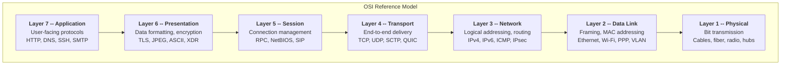
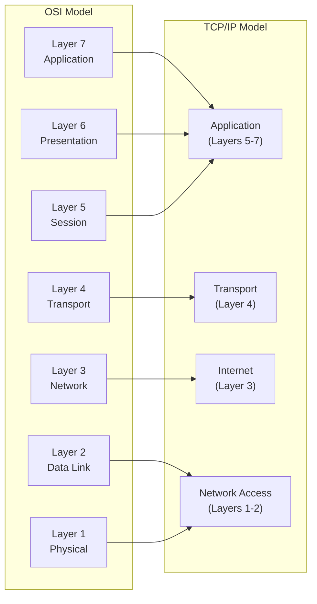
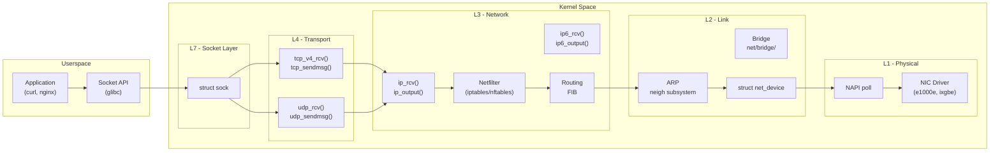
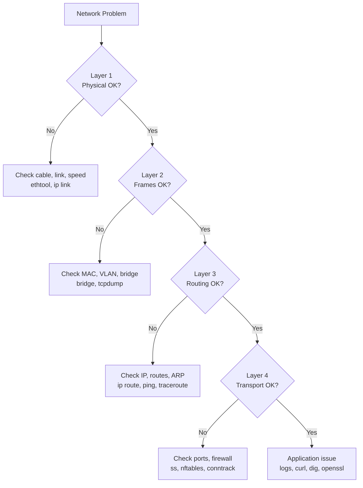

# The OSI Model

## Introduction

The **Open Systems Interconnection (OSI) model** is the foundational conceptual framework for understanding network communication. Developed by the International Organization for Standardization (ISO) in 1984, it divides network communication into seven distinct layers, each with specific responsibilities. While the modern Internet predominantly uses the TCP/IP model, the OSI model remains the standard vocabulary for network engineers, security professionals, and Linux kernel developers when discussing where problems occur and how protocols interact.

Understanding the OSI model is critical for Linux networking because the kernel's networking stack directly maps to these layers. When you configure `iptables` rules, you're operating at Layer 3/4. When you set up a VLAN, you're working at Layer 2. When you plug in a fiber cable, you're dealing with Layer 1.

## The Seven Layers



| Layer | Name | PDU | Key Protocols | Linux Components |
|-------|------|-----|---------------|-----------------|
| 7 | Application | Data | HTTP, DNS, SSH, SMTP, FTP | Userspace applications, `glibc`, `libcurl` |
| 6 | Presentation | Data | TLS/SSL, XDR, MIME | OpenSSL, GnuTLS, kernel crypto API |
| 5 | Session | Data | RPC, NetBIOS, SIP | `rpcbind`, kernel RPC modules |
| 4 | Transport | Segment (TCP) / Datagram (UDP) | TCP, UDP, SCTP | `net/ipv4/tcp*.c`, `net/ipv4/udp.c` |
| 3 | Network | Packet | IPv4, IPv6, ICMP, ARP | `net/ipv4/ip_input.c`, `net/ipv6/`, routing table |
| 2 | Data Link | Frame | Ethernet, 802.1Q, Wi-Fi | NIC drivers, `net/bridge/`, MAC table |
| 1 | Physical | Bit | Electrical signals, light | PHY drivers, SFP modules, cables |

## Layer-by-Layer Deep Dive

### Layer 1 — Physical Layer

The Physical layer handles the raw transmission of bits over a physical medium. It defines electrical voltages, pin layouts, cable specifications, and wireless frequencies.

**Key concepts:**
- **Signaling**: How 1s and 0s are represented electrically (e.g., Manchester encoding for Ethernet)
- **Medium types**: Copper (Cat5e/Cat6/Cat6a), fiber optic (single-mode/multi-mode), wireless (2.4 GHz, 5 GHz, 6 GHz)
- **Topology**: Bus, star, ring, mesh
- **Encoding schemes**: NRZ, Manchester, 4B/5B, 8B/10B, PAM-4 (used in 100G+ Ethernet)
- **Auto-negotiation**: Speed and duplex negotiation between NIC and switch

**Linux relevance**: NIC drivers interact with PHY hardware through the **MDIO bus**. The `ethtool` command exposes Layer 1 parameters:

```bash
# Check physical link status and speed
$ ethtool eth0
Settings for eth0:
    Supported ports: [ TP ]
    Supported link modes:   10baseT/Half 10baseT/Full
                            100baseT/Half 100baseT/Full
                            1000baseT/Full
    Supported pause frame use: No
    Supports auto-negotiation: Yes
    Advertised link modes:  10baseT/Half 10baseT/Full
                            100baseT/Half 100baseT/Full
                            1000baseT/Full
    Speed: 1000Mb/s
    Duplex: Full
    Auto-negotiation: on
    Link detected: yes

# View PHY-level diagnostics (fiber modules)
$ ethtool -m eth0
    Identifier: 0x03 (SFP)
    Connector: 0x07 (LC)
    Transceiver type: 1000BASE-LX
    Wavelength: 1310 nm
    Vendor: FINISAR CORP.

# View detailed PHY statistics (copper)
$ ethtool -S eth0 | grep -i phy
    phy_receive_errors: 0
    phy_idle_errors: 0

# Check cable test (supported by some drivers)
$ ethtool --cable-test eth0
Cable test started.
Cable test completed.
Pair A, Pair B, Pair C, Pair D:
    Status: OK
    Length: 42 meters
```

**MDIO bus and PHY drivers:**

```bash
# List MDIO bus devices
$ ls /sys/bus/mdio_bus/devices/
# mdio_bus-0  0:00  0:01

# PHY device information
$ cat /sys/bus/mdio_bus/devices/0:00/phy_id
# 0x00221621

# PHY driver in use
$ ls -la /sys/bus/mdio_bus/devices/0:00/driver
# -> ../../../../bus/mdio_bus/drivers/Marvell 88E1510

# PHY registers (debugging link issues)
$ ethtool -d eth0 | head -20
# Register dump for eth0
# Offset   Value
# 0x0000:  0x1140  (BMCR - Basic Mode Control Register)
# 0x0001:  0x796d  (BMSR - Basic Mode Status Register)
```

**Common Layer 1 troubleshooting:**

```bash
# Check for physical layer errors
$ ethtool -S eth0 | grep -E 'error|drop|crc|collision'
rx_crc_errors: 0
rx_symbol_errors: 0
tx_dropped: 0

# Monitor link state changes in real-time
$ ip monitor link
2: eth0: <BROADCAST,MULTICAST,UP> mtu 1500 state UP
    link/ether 00:1a:2b:3c:4d:5e

# Check SFP/DDM (Digital Diagnostic Monitoring) thresholds
$ ethtool -m eth0 | grep -E 'Temperature|Voltage|TX|RX'
    Temperature: 38.5860 C
    Voltage: 3.2939 V
    TX Bias: 6.4960 mA
    TX Power: -2.4586 dBm
    RX Power: -3.2148 dBm
```

### Layer 2 — Data Link Layer

The Data Link layer provides node-to-node transfer between directly connected devices. It is subdivided into two sublayers by IEEE:

- **LLC (Logical Link Control)** — IEEE 802.2: Multiplexing, flow control
- **MAC (Media Access Control)** — IEEE 802.3: Physical addressing, channel access

**Key concepts:**
- **MAC addresses**: 48-bit hardware identifiers (e.g., `00:1a:2b:3c:4d:5e`)
- **Frames**: Ethernet II frames have a 14-byte header (destination MAC, source MAC, EtherType) and 4-byte FCS trailer
- **VLAN tagging**: IEEE 802.1Q inserts a 4-byte tag into the frame header
- **Switching**: MAC address learning and forwarding decisions
- **STP (Spanning Tree Protocol)**: Prevents loops in bridged networks
- **LACP (Link Aggregation)**: Bundles multiple physical links into one logical link
- **Flow control**: IEEE 802.3x pause frames for congestion management

**Linux implementation:**

```bash
# View MAC address table of a Linux bridge
$ bridge fdb show dev br0
33:33:00:00:00:01 master br0 permanent
01:00:5e:00:00:01 master br0 permanent
aa:bb:cc:dd:ee:ff master br0
a2:9f:8e:7d:6c:5b vlan 100 master br0

# Create and configure a VLAN interface
$ ip link add link eth0 name eth0.100 type vlan id 100
$ ip link set eth0.100 up
$ ip addr add 10.100.0.1/24 dev eth0.100

# View Ethernet frame statistics
$ ip -s link show eth0
2: eth0: <BROADCAST,MULTICAST,UP,LOWER_UP> mtu 1500 qdisc fq_codel state UP
    link/ether 00:1a:2b:3c:4d:5e brd ff:ff:ff:ff:ff:ff
    RX: bytes  packets  errors  dropped missed  mcast
    184329561  1234567  0       0       0       5432
    TX: bytes  packets  errors  dropped carrier collsns
    98765432   654321   0       0       0       0
```

The Linux kernel's bridge implementation (`net/bridge/`) operates at Layer 2, performing MAC learning and frame forwarding entirely in kernel space.

**Bridge configuration and management:**

```bash
# Create a Linux bridge
$ ip link add name br0 type bridge
$ ip link set br0 up

# Add ports to bridge
$ ip link set eth0 master br0
$ ip link set eth1 master br0

# View bridge details
$ bridge link show
2: eth0: <BROADCAST,MULTICAST,UP,LOWER_UP> mtu 1500 master br0 state forwarding
3: eth1: <BROADCAST,MULTICAST,UP,LOWER_UP> mtu 1500 master br0 state forwarding

# Configure STP on bridge
$ ip link set br0 type bridge stp_state 1
$ ip link set br0 type bridge priority 32768

# View STP status
$ bridge -d link show | grep state
# eth0: state forwarding
# eth1: state forwarding

# VLAN filtering on bridge
$ bridge vlan add dev eth0 vid 100
$ bridge vlan add dev eth1 vid 100
$ bridge vlan show
port    vlan ids
eth0     100
eth1     100
br0      1 PVID Egress Untagged
```

**Bonding (Link Aggregation):**

```bash
# Create a bond interface (802.3ad / LACP)
$ ip link add bond0 type bond mode 802.3ad
$ ip link set eth0 master bond0
$ ip link set eth1 master bond0
$ ip link set bond0 up

# View bond status
$ cat /proc/net/bonding/bond0
Bonding Mode: IEEE 802.3ad Dynamic link aggregation
Transmit Hash Policy: layer2+2 (1)
MII Status: up
MII Link Speed: 10000 Mbps

Slave Interface: eth0
MII Status: up
Speed: 10000 Mbps
Link Failure Count: 0

Slave Interface: eth1
MII Status: up
Speed: 10000 Mbps
Link Failure Count: 0
```

**MACVLAN and IPVLAN (Layer 2 virtualization):**

```bash
# MACVLAN: each container/VM gets its own MAC address
$ ip link add macvlan0 link eth0 type macvlan mode bridge
$ ip addr add 10.0.0.100/24 dev macvlan0
$ ip link set macvlan0 up

# IPVLAN L2: shares MAC, different IP (useful for MAC-restricted networks)
$ ip link add ipvlan0 link eth0 type ipvlan mode l2
$ ip addr add 10.0.0.101/24 dev ipvlan0
$ ip link set ipvlan0 up

# View all virtual interfaces
$ ip -d link show type macvlan
$ ip -d link show type ipvlan
```

### Layer 3 — Network Layer

The Network layer handles **logical addressing** and **routing** — determining the best path for data to reach its destination across multiple hops.

**Key concepts:**
- **IP addressing**: IPv4 (32-bit) and IPv6 (128-bit) logical addresses
- **Routing**: Forwarding decisions based on routing tables
- **Fragmentation**: Breaking packets that exceed the MTU
- **ICMP**: Error reporting and diagnostic messages (ping, traceroute)
- **IPsec**: Network-layer encryption and authentication
- **ECMP**: Equal-cost multi-path routing for load distribution

**Linux routing table:**

```bash
# View the routing table
$ ip route show
default via 192.168.1.1 dev eth0 proto dhcp metric 100
10.0.0.0/8 via 10.255.0.1 dev tun0 proto static
172.16.0.0/12 via 10.255.0.1 dev tun0 proto static
192.168.1.0/24 dev eth0 proto kernel scope link src 192.168.1.50

# Look up which route a destination uses
$ ip route get 8.8.8.8
8.8.8.8 via 192.168.1.1 dev eth0 src 192.168.1.50 uid 1000
    cache

# View ARP/neighbor cache (Layer 2 ↔ Layer 3 mapping)
$ ip neigh show
192.168.1.1 dev eth0 lladdr aa:bb:cc:dd:ee:ff REACHABLE
192.168.1.100 dev eth0 lladdr 11:22:33:44:55:66 STALE
```

The kernel's routing subsystem uses the **Forwarding Information Base (FIB)** for fast lookups. Advanced setups use policy-based routing with multiple routing tables:

```bash
# Create a custom routing table
echo "100 custom" >> /etc/iproute2/rt_tables
ip route add default via 10.0.0.1 table custom
ip rule add from 192.168.2.0/24 table custom

# View all routing rules
$ ip rule show
0:	from all lookup local
32764:	from 192.168.2.0/24 lookup custom
32766:	from all lookup main
32767:	from all lookup default

# ECMP (equal-cost multi-path) routing
$ ip route add default nexthop via 10.0.0.1 weight 1 nexthop via 10.0.0.2 weight 1

# View ECMP route
$ ip route show default
default
    nexthop via 10.0.0.1 dev eth0 weight 1
    nexthop via 10.0.0.2 dev eth1 weight 1
```

**ICMP diagnostics:**

```bash
# Path MTU discovery
$ ping -M do -s 1472 8.8.8.8
# 1472 + 8 (ICMP header) + 20 (IP header) = 1500 (standard MTU)
# If "Frag needed" error, reduce size

# Traceroute with different protocols
$ traceroute -I 8.8.8.8    # ICMP (default)
$ traceroute -T 8.8.8.8    # TCP SYN
$ traceroute -U 8.8.8.8    # UDP

# View ICMP statistics
$ cat /proc/net/snmp | grep -A1 Icmp
Icmp: InMsgs InErrors InCsumErrors InDestUnreachs InTimeExcds ...
Icmp: 1234 0 0 567 12 ...
```

**IPsec (Layer 3 encryption):**

```bash
# View IPsec Security Associations
$ ip xfrm state list
src 10.0.0.1 dst 10.0.0.2
    proto esp spi 0x00000001 reqid 1 mode tunnel
    replay-window 0 flag af-unspec
    aead rfc4106(gcm(aes)) 0x... 128

# View IPsec policies
$ ip xfrm policy list
src 192.168.1.0/24 dst 192.168.2.0/24
    dir out priority 0 ptype main
    tmpl src 10.0.0.1 dst 10.0.0.2
        proto esp reqid 1 mode tunnel
```

### Layer 4 — Transport Layer

The Transport layer provides **end-to-end communication** between applications. The two primary protocols are TCP and UDP.

**TCP (Transmission Control Protocol):**
- Connection-oriented, reliable, ordered delivery
- Three-way handshake: SYN → SYN-ACK → ACK
- Flow control via sliding window
- Congestion control: cubic (Linux default), BBR, Reno
- Four-way teardown: FIN → ACK → FIN → ACK

**UDP (User Datagram Protocol):**
- Connectionless, unreliable, no ordering
- Low overhead, suitable for real-time applications

**QUIC (modern transport):**
- UDP-based with built-in TLS 1.3
- Multiplexed streams without head-of-line blocking
- Connection migration (survives IP changes)

**Linux TCP/UDP internals:**

```bash
# View TCP connection states
$ ss -t state established
Recv-Q Send-Q  Local Address:Port  Peer Address:Port
0      0       192.168.1.50:22     10.0.0.5:54321
0      128     192.168.1.50:443    203.0.113.10:49152

# View TCP socket details (congestion control, window sizes)
$ ss -ti dst 10.0.0.5
ESTAB  0  0  192.168.1.50:ssh  10.0.0.5:54321
    cubic wscale:7,7 rto:204 rtt:1.5/0.75 ato:40 mss:1448
    cwnd:10 ssthresh:7 bytes_sent:12345 bytes_acked:12345

# Check current congestion control algorithm
$ sysctl net.ipv4.tcp_congestion_control
net.ipv4.tcp_congestion_control = cubic

# View UDP statistics
$ ss -u -a
State  Recv-Q  Send-Q  Local Address:Port  Peer Address:Port
UNCONN 0       0       0.0.0.0:53          0.0.0.0:*
UNCONN 0       0       0.0.0.0:68          0.0.0.0:*
```

**TCP tuning for high-performance networking:**

```bash
# View current TCP buffer sizes
$ sysctl net.ipv4.tcp_rmem
net.ipv4.tcp_rmem = 4096 131072 6291456
# min    default  max (bytes)

$ sysctl net.ipv4.tcp_wmem
net.ipv4.tcp_wmem = 4096 16384 4194304

# Enable TCP BBR congestion control
$ sysctl net.core.default_qdisc=fq
$ sysctl net.ipv4.tcp_congestion_control=bbr

# View TCP connection statistics
$ cat /proc/net/snmp | grep -A1 Tcp
Tcp: RtoAlgorithm RtoMin RtoMax MaxConn ActiveOpens PassiveOpens ...
Tcp: 1 200 120000 -1 12345 67890 ...

# View detailed TCP metrics for a connection
$ ss -ti dst 10.0.0.5
ESTAB  0  0  192.168.1.50:443  10.0.0.5:54321
    cubic wscale:7,7 rto:204 rtt:1.5/0.75 ato:40 mss:1448
    pmtu:1500 rcvmss:1448 advmss:1448 cwnd:10 ssthresh:7
    bytes_sent:12345 bytes_acked:12345 bytes_received:6789
    segs_out:100 segs_in:120 data_segs_out:80 data_segs_in:90
    send 76.5Mbps lastsnd:100 lastrcv:50 lastack:50
    pacing_rate 153.0Mbps delivery_rate 50.0Mbps
    delivered:80 busy:500ms rcv_rtt:1.5 rcv_space:29200
    rcv_ssthresh:29200 minrtt:0.5

# SCTP (Stream Control Transmission Protocol)
$ ss -s
# TCP:   estab 50, closed 10, orphaned 0, timewait 10
# SCTP:  estab 5, closed 0, ...

# View SCTP associations
$ ss -sctp
```

**Connection tracking (conntrack):**

```bash
# View connection tracking table
$ conntrack -L
tcp  6 431999 ESTABLISHED src=192.168.1.10 dst=93.184.216.34 sport=49152 \
    dport=443 src=93.184.216.34 dst=203.0.113.1 sport=443 dport=49152 \
    [ASSURED] mark=0 use=1

# Count connections
$ conntrack -C
# 1234

# Monitor new connections in real-time
$ conntrack -E
# [NEW] tcp  6 120 SYN_SENT src=192.168.1.10 dst=8.8.8.8 ...
# [UPDATE] tcp  6 60 SYN_RECV src=192.168.1.10 dst=8.8.8.8 ...
# [UPDATE] tcp  6 432000 ESTABLISHED src=192.168.1.10 dst=8.8.8.8 ...

# Conntrack statistics
$ cat /proc/net/stat/nf_conntrack
entries  found  new  invalid  ignore  delete  delete_list  insert  insert_failed  drop  early_drop  error
1234     56789  1234 0        0       0       0            1234    0              0     0           0
```

### Layer 5 — Session Layer

The Session layer manages **sessions** — establishing, maintaining, and terminating connections between applications. In practice, this layer is often merged with Layer 7 in the TCP/IP model.

**Linux examples:**
- **RPC (Remote Procedure Call)**: `rpcbind`, NFS client/server sessions
- **SIP (Session Initiation Protocol)**: VoIP call management
- **Unix domain sockets**: Local IPC sessions
- **D-Bus**: System and session message bus
- **SOCK_SEQPACKET**: Sequenced, reliable, connection-based sessions

```bash
# View active RPC sessions
$ rpcinfo -p
   program vers proto   port  service
    100000    4   tcp    111  portmapper
    100000    3   tcp    111  portmapper
    100005    3   tcp  20048  mountd
    100003    3   tcp   2049  nfs

# View Unix domain sockets (local sessions)
$ ss -x
Netid State Recv-Q Send-Q   Local Address:Port   Peer Address:Port
u_seq ESTAB 0      0        /run/systemd/journal/stdout 12345
u_dgr ESTAB 0      0        /run/dbus/system_bus_socket 6789

# D-Bus session information
$ busctl list
NAME                         PID PROCESS         USER    CONNECTION
org.freedesktop.DBus         456 systemd         root    :1.0
org.freedesktop.login1       789 systemd-logind  root    :1.1
:1.42                       1234 gnome-shell     jdoe    :1.42

# NFS session tracking
$ nfsstat -s | head -20
Server rpc stats:
badcalls  badclnt  badauth  badxdrc
0         0        0        0
```

**Session multiplexing with port numbers:**

```bash
# Multiple sessions on a single host
$ ss -tlnp
State  Recv-Q Send-Q Local Address:Port  Process
LISTEN 0      128    0.0.0.0:22          users:(("sshd",pid=1234,fd=3))
LISTEN 0      128    0.0.0.0:80          users:(("nginx",pid=5678,fd=6))
LISTEN 0      128    0.0.0.0:443         users:(("nginx",pid=5678,fd=7))
LISTEN 0      128    127.0.0.1:5432      users:(("postgres",pid=9012,fd=5))

# View session socket options
$ ss -t -o state established
ESTAB  0  0  192.168.1.50:22  10.0.0.5:54321
    timer:(keepalive,60min,0)
```

### Layer 6 — Presentation Layer

The Presentation layer handles **data formatting, encryption, and compression**. It ensures data sent by one system's application layer can be read by another's.

**Key responsibilities:**
- **Encryption/Decryption**: TLS terminates here (or at Layer 5/7 depending on the model)
- **Serialization**: XDR (used by NFS), ASN.1, Protocol Buffers, JSON, MessagePack
- **Character encoding**: UTF-8, ASCII, EBCDIC
- **Compression**: gzip, brotli, zstd, lz4

**Linux implementation:**

```bash
# TLS session details (Layer 6 encryption)
$ openssl s_client -connect example.com:443 -brief
CONNECTION ESTABLISHED
Protocol version: TLSv1.3
Ciphersuite: TLS_AES_256_GCM_SHA384
Peer certificate: CN=example.com
Verification: OK

# Kernel-level TLS (kTLS) offloads encryption to the kernel
$ cat /proc/net/tls_stat
TlsCurrTxSw           0
TlsCurrRxSw           0
TlsCurrTxDevice       2
TlsDecryptFail        0

# View TLS certificate details
$ openssl s_client -connect example.com:443 </dev/null 2>/dev/null | \
    openssl x509 -noout -subject -issuer -dates
subject=CN=example.com
issuer=C=DST Trust CA X3
notBefore=Jan  1 00:00:00 2024 GMT
notAfter=Dec 31 23:59:59 2024 GMT

# Kernel crypto API
$ cat /proc/crypto | head -30
name         : aes
driver       : aes-aesni
module       : aesni_intel
priority     : 400
refcnt       : 1
selftest     : passed
internal     : no
type         : cipher
blocksize    : 16
min keysize  : 16
max keysize  : 32

# kTLS configuration
$ sysctl net.ipv4.tcp_available_ulp
net.ipv4.tcp_available_ulp = tls strp

# Enable kTLS for a socket (in application code)
# setsockopt(fd, SOL_TCP, TCP_ULP, "tls", sizeof("tls"))
```

**Data serialization formats:**

```bash
# Protocol Buffers (used by gRPC, Kubernetes)
$ protoc --decode_raw < message.bin
1: 12345
2: "hello"
3: 42

# MessagePack (binary JSON alternative)
$ python3 -c "import msgpack; print(msgpack.packb({'key': 'value'}))"
b'\x81\xa3key\xa5value'

# XDR (used by NFS)
$ rpcgen -C nfs4_prot.x
```

### Layer 7 — Application Layer

The Application layer is where **user-facing protocols** operate. This is where HTTP, DNS, SSH, SMTP, and all application protocols reside.

**Linux application layer tools:**

```bash
# HTTP request with curl
$ curl -v https://example.com/
> GET / HTTP/2
> Host: example.com
> User-Agent: curl/8.4.0
< HTTP/2 200
< content-type: text/html

# DNS query
$ dig example.com A +short
93.184.216.34

# SMTP test
$ telnet smtp.example.com 25
220 smtp.example.com ESMTP
EHLO test
250-smtp.example.com Hello

# SSH connection debugging
$ ssh -vvv user@host 2>&1 | head -40
# Shows key exchange, cipher negotiation, authentication

# gRPC (HTTP/2 based)
$ grpcurl -plaintext localhost:50051 list
# mypackage.MyService

# WebSocket connection
$ curl -i -N -H "Connection: Upgrade" -H "Upgrade: websocket" \
    -H "Sec-WebSocket-Key: dGhlIHNhbXBsZSBub25jZQ==" \
    -H "Sec-WebSocket-Version: 13" http://localhost:8080/ws
```

**Application-layer protocol analysis:**

```bash
# HTTP/2 frames (via nghttp2)
$ nghttp -nv https://example.com/
# Shows HPACK headers, DATA frames, WINDOW_UPDATE

# DNS resolution chain
$ dig +trace example.com
# Shows root → TLD → authoritative resolution

# View listening services by protocol
$ ss -tlnp | awk '{print $4, $6}'
# 0.0.0.0:22   users:(("sshd",pid=1234,fd=3))
# 0.0.0.0:80   users:(("nginx",pid=5678,fd=6))
# 0.0.0.0:443  users:(("nginx",pid=5678,fd=7))
# 127.0.0.1:631 users:(("cupsd",pid=901,fd=7))

# Protocol-specific statistics
$ ss -s
TCP:   estab 50, closed 10, orphaned 0, timewait 10
UDP:   estab 0, skmem: r0, w0
SCTP:  estab 0, ...
```

## Encapsulation and Decapsulation

As data travels down the OSI stack from sender to receiver, each layer **adds its own header** (and sometimes trailer). This process is called **encapsulation**. At the receiving end, each layer **strips** its corresponding header — **decapsulation**.

```mermaid
graph TB
    subgraph "Sender -- Encapsulation"
        A1["Application Data"] --> A2["+ Layer 6 Header"]
        A2 --> A3["+ Layer 5 Header"]
        A3 --> A4["+ TCP Header = Segment"]
        A4 --> A5["+ IP Header = Packet"]
        A5 --> A6["+ Ethernet Header + FCS = Frame"]
        A6 --> A7["Convert to Bits"]
    end

    subgraph "Receiver -- Decapsulation"
        B7["Bits received"] --> B6["Parse Ethernet Header"]
        B6 --> B5["Parse IP Header"]
        B5 --> B4["Parse TCP Header"]
        B4 --> B3["Strip Layer 5 Header"]
        B3 --> B2["Strip Layer 6 Header"]
        B2 --> B1["Application Data"]
    end
```



**Practical example — an HTTP request encapsulation:**

```
┌─────────────────────────────────────────────────────────┐
│ Layer 7: GET /index.html HTTP/1.1\r\nHost: example.com │  ← Application Data
├─────────────────────────────────────────────────────────┤
│ Layer 4: TCP Header (src_port=49152, dst_port=80,       │  ← Segment
│          seq=..., ack=..., flags=PSH|ACK, win=65535)    │
├─────────────────────────────────────────────────────────┤
│ Layer 3: IP Header (ver=4, ihl=5, ttl=64,              │  ← Packet
│          src=192.168.1.50, dst=93.184.216.34,          │
│          proto=TCP, len=...)                            │
├─────────────────────────────────────────────────────────┤
│ Layer 2: Ethernet Header (dst=aa:bb:cc:dd:ee:ff,       │  ← Frame
│          src=00:1a:2b:3c:4d:5e, type=0x0800)           │
│          + FCS Trailer (4 bytes)                        │
└─────────────────────────────────────────────────────────┘
```

Each layer only needs to understand its own header. The rest is opaque payload. This **layered abstraction** is what allows independent protocol development.

## OSI vs TCP/IP Model Mapping



| Aspect | OSI Model | TCP/IP Model |
|--------|-----------|--------------|
| Layers | 7 | 4 (or 5) |
| Development | ISO (theoretical) | DoD/DARPA (practical) |
| Layer 7-5 | Separate Application, Presentation, Session | Combined into Application |
| Layer 3 | Network (IP only) | Internet (IP, ICMP, ARP) |
| Strictness | Strict layering | More flexible boundaries |
| Usage | Teaching, troubleshooting | Actual Internet implementation |

In practice, most Linux engineers use a **hybrid model** — OSI layer numbers for troubleshooting discussions, TCP/IP architecture for implementation understanding.

## Linux Networking Stack Mapping

The Linux kernel networking stack doesn't perfectly mirror the OSI model, but the mapping is close:



**Key receive path (`ip_rcv` → application):**

1. NIC receives frame → DMA to ring buffer → hardware interrupt
2. Driver schedules **NAPI** softirq → `net_rx_action()`
3. `ip_rcv()` → Netfilter PREROUTING → routing decision (local vs forward)
4. `tcp_v4_rcv()` → socket buffer → wake up application `recv()`

**Key transmit path (application → NIC):**

1. Application calls `send()` → `tcp_sendmsg()` → builds TCP segments
2. `ip_output()` → Netfilter POSTROUTING → `neigh_resolve_output()` (ARP)
3. `dev_queue_xmq()` → QDisc → NIC driver `ndo_start_xmit()`

**Useful kernel tracing:**

```bash
# Trace the network receive path
$ sudo bpftrace -e 'kprobe:ip_rcv { printf("ip_rcv: %s\n", comm); }'

# View Netfilter hook points
$ sudo nft list ruleset

# View the kernel's network buffer usage
$ cat /proc/net/snmp | grep -A1 Ip
Ip: Forwarding DefaultTTL InReceives InHdrErrors
Ip: 1 64 12345678 0
```

## OSI Layer Troubleshooting Guide

When diagnosing network issues, the OSI model provides a systematic approach:



**Layer-by-layer troubleshooting commands:**

```bash
# Layer 1: Physical
$ ethtool eth0                    # Link status, speed, duplex
$ ip link show eth0               # Interface state
$ dmesg | grep -i eth0            # Driver messages

# Layer 2: Data Link
$ ip neigh show                   # ARP table
$ bridge fdb show                 # MAC forwarding table
$ tcpdump -i eth0 -e              # Capture with Ethernet headers
$ vlan show                       # VLAN configuration

# Layer 3: Network
$ ip route get <destination>      # Route lookup
$ ping -c3 <destination>          # ICMP reachability
$ traceroute <destination>        # Path discovery
$ ip -s link show                 # Interface statistics (errors, drops)

# Layer 4: Transport
$ ss -tlnp                        # Listening TCP ports
$ ss -t state established         # Active connections
$ nft list ruleset                # Firewall rules
$ conntrack -L                    # Connection tracking

# Layer 7: Application
$ curl -v https://example.com/    # HTTP debugging
$ dig example.com                 # DNS resolution
$ openssl s_client -connect host:443  # TLS debugging
```

## Key Differences: OSI vs. TCP/IP Model

## Further Reading

- [The Linux Kernel Documentation](https://docs.kernel.org/)
- [LWN.net - Linux and free software news](https://lwn.net/)
- [GNU Project Documentation](https://www.gnu.org/doc/doc.html)
- [GNU Manuals](https://www.gnu.org/manual/manual.html)
- [Free Software Directory](https://directory.fsf.org/wiki/Main_Page)
- [Planet GNU](https://planet.gnu.org/)
- [Free Software Books](https://www.gnu.org/doc/other-free-books.html)

- [RFC 1122 — Requirements for Internet Hosts](https://www.rfc-editor.org/rfc/rfc1122)
- [Linux Kernel Networking Documentation](https://www.kernel.org/doc/html/latest/networking/)
- [Understanding the Linux Kernel Network Stack (Netflix)](https://netflixtechblog.com/)
- [Wireshark Display Filter Reference](https://www.wireshark.org/docs/dfref/)
- [Linux net/ source code](https://github.com/torvalds/linux/tree/master/net)

## Related Topics

- [Network Fundamentals](./fundamentals.md) — Broader overview of networking concepts
- [TCP/IP Suite](./tcpip-suite.md) — Deep dive into TCP/IP protocol family
- [IP Addressing and Subnetting](./ip-addressing.md) — Layer 3 addressing in detail
- [DHCP](./dhcp.md) — Automatic IP configuration
- [Network Troubleshooting](./troubleshooting.md) — Practical debugging using OSI layers
- [Packet Capture](./packet-capture.md) — Inspecting frames and packets at each layer
