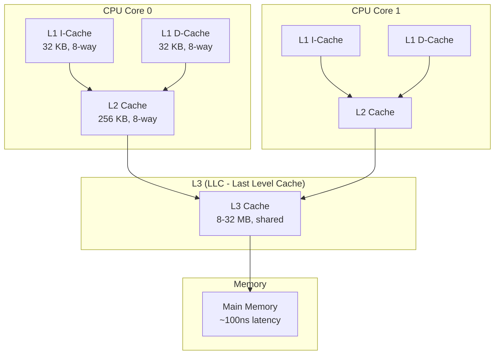
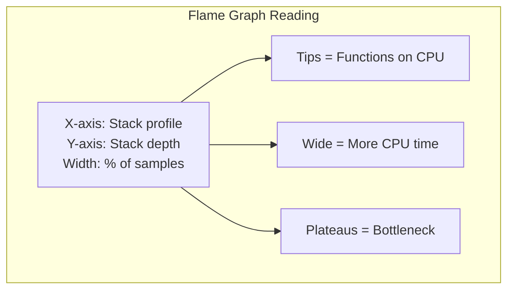
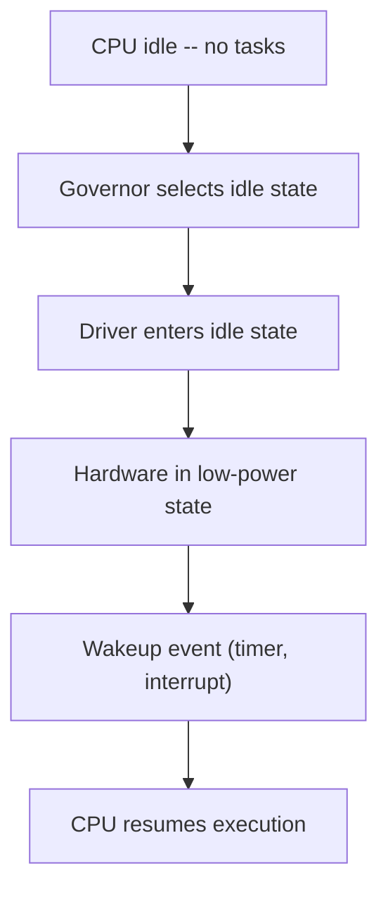

# CPU Performance

## Introduction

CPU performance analysis in Linux goes far beyond watching `top` output. Understanding CPU microarchitecture, cache hierarchies, NUMA effects, scheduler latency, and profiling tools is essential for diagnosing performance problems and optimizing applications.

This chapter covers `perf` for CPU profiling, flame graphs for visualization, CPU cache behavior, NUMA effects, and scheduler latency analysis.

## CPU Architecture for Performance Engineers

### Cache Hierarchy


### Memory Latency Hierarchy

| Level | Typical Latency | Typical Size |
|-------|----------------|--------------|
| L1 Cache | ~1 ns (4 cycles) | 32-64 KB |
| L2 Cache | ~4 ns (12 cycles) | 256 KB - 1 MB |
| L3 Cache | ~12 ns (40 cycles) | 4-32 MB |
| Local DRAM | ~60 ns (200 cycles) | 16-512 GB |
| Remote DRAM (NUMA) | ~120 ns (400 cycles) | Varies |

### CPU Topology

```bash
# View CPU topology
lscpu
# Architecture:        x86_64
# CPU op-mode(s):      32-bit, 64-bit
# Byte Order:          Little Endian
# CPU(s):              32
# On-line CPU(s) list: 0-31
# Thread(s) per core:  2
# Core(s) per socket:  8
# Socket(s):           2
# NUMA node(s):        2
# Vendor ID:           GenuineIntel
# CPU family:          6
# Model:               85
# Model name:          Intel(R) Xeon(R) Gold 6248 CPU @ 2.50GHz
# Stepping:            7
# CPU MHz:             2500.000
# CPU max MHz:         3900.0000
# CPU min MHz:         1000.0000
# BogoMIPS:            5000.00
# L1d cache:           32K
# L1i cache:           32K
# L2 cache:            1024K
# L3 cache:            27648K
# NUMA node0 CPU(s):   0-7,16-23
# NUMA node1 CPU(s):   8-15,24-31

# Detailed CPU info
cat /proc/cpuinfo | head -30

# Cache hierarchy
getconf -a | grep CACHE
# LEVEL1_ICACHE_SIZE                 32768
# LEVEL1_ICACHE_ASSOC               8
# LEVEL1_DCACHE_SIZE                 32768
# LEVEL1_DCACHE_ASSOC               8
# LEVEL2_CACHE_SIZE                  1048576
# LEVEL2_CACHE_ASSOC                16
# LEVEL3_CACHE_SIZE                  28311552
# LEVEL3_CACHE_ASSOC                11
```

## perf: Linux Profiling

`perf` is the standard Linux profiling tool, providing CPU performance counter access and sampling-based profiling.

### perf stat: Hardware Counters

```bash
# Count hardware events for a command
perf stat ls -la /tmp
#  Performance counter stats for 'ls -la /tmp':
#
#          3.45 msec task-clock                       #    0.832 CPUs utilized
#             1      context-switches                 #  289.855 /sec
#             0      cpu-migrations                   #    0.000 /sec
#           123      page-faults                      # 35.652K/sec
#     8,234,567      cycles                           # 2.387 GHz
#    12,345,678      instructions                     # 1.50  insn per cycle
#     2,345,678      branches                         # 679.727 M/sec
#        45,678      branch-misses                    # 1.95% of all branches
#       567,890      cache-misses                     # 4.60% of all cache refs
#    12,345,678      cache-references                 # 3.578 G/sec

# System-wide profiling for 10 seconds
perf stat -a sleep 10

# Per-CPU profiling
perf stat -e cycles,instructions,cache-misses -a -A sleep 5
# Performance counter stats for 'system wide':
#
# CPU0       12,345,678,901      cycles
# CPU0       10,234,567,890      instructions
# CPU0           12,345,678      cache-misses
# CPU1       11,234,567,890      cycles
# CPU1        9,876,543,210      instructions
# CPU1           11,234,567      cache-misses

# Group events (counted simultaneously)
perf stat -e '{cycles,instructions,cache-references,cache-misses}' -a sleep 5
```

### perf record and perf report

```bash
# Record CPU profile with call graph
perf record -F 99 -a -g -- sleep 30
# [ perf record: Woken up 1 times to write data ]
# [ perf record: Captured and wrote 12.345 MB perf.data (123456 samples) ]

# Report (text mode)
perf report --stdio | head -40
# Overhead  Command      Shared Object           Symbol
# ........  ...........  ......................  .........................
#
#    15.23%  mysqld       mysqld                  [.] row_search_mvcc
#            |
#            ---row_search_mvcc
#               |--75.23%-- ha_innobase::index_read
#               |          handler::ha_index_read_map
#               |          JOIN_TAB_SCAN::next
#               |--18.45%-- ha_innobase::general_fetch
#               |--6.32%-- rec_get_offsets_func
#
#    10.45%  kswapd0      [kernel.kallsyms]       [k] shrink_page_list
#     8.90%  mysqld       mysqld                  [.] buf_page_get_gen
#     7.12%  kworker/0:1  [kernel.kallsyms]       [k] psi_group_change

# Interactive report
perf report
```

### Flame Graphs

Flame graphs visualize CPU profiles, showing which code paths consume the most CPU time:

```bash
# Generate flame graph
perf record -F 99 -a -g -- sleep 30
perf script | stackcollapse-perf.pl | flamegraph.pl > flamegraph.svg

# Or with Brendan Gregg's tools
git clone https://github.com/brendangregg/FlameGraph
perf script | ./FlameGraph/stackcollapse-perf.pl | ./FlameGraph/flamegraph.pl > flamegraph.svg

# Off-CPU flame graph (time spent blocked, not on CPU)
perf record -e sched:sched_switch -a -g -- sleep 30
# Note: Off-CPU analysis is better done with bpftrace
```

### Flame Graph Interpretation


## CPU Cache Performance

### Cache Misses

```bash
# Count cache misses
perf stat -e L1-dcache-loads,L1-dcache-load-misses,\
LLC-loads,LLC-load-misses -- sleep 5
#     1,234,567,890  L1-dcache-loads
#        12,345,678  L1-dcache-load-misses     # 1.00% of all L1-dcache hits
#       567,890,123  LLC-loads
#        23,456,789  LLC-load-misses            # 4.13% of all LLC loads

# Cache miss latency (using perf mem)
perf mem record -- sleep 5
perf mem report --stdio | head -20
# Overhead       Samples  Memory access
# 45.23%        12345    L1 or L1 hit
# 25.67%         7890    L2 or L2 hit
# 12.34%         3456    LLC or LLC hit
#  8.90%         2345    Local RAM or RAM hit
#  4.56%         1234    Remote RAM (1 hop)
#  3.30%          890    Remote RAM (2+ hops)
```

### Cache Optimization Patterns

```bash
# Bad: Array of Structures (AoS) - poor cache utilization
struct particle {
    float x, y, z;     // Position
    float vx, vy, vz;  // Velocity
    float mass;
    char type;
};
struct particle particles[1000000];
// Accessing only position wastes cache lines

# Good: Structure of Arrays (SoA) - better cache utilization
struct particles {
    float *x, *y, *z;     // Position arrays
    float *vx, *vy, *vz;  // Velocity arrays
    float *mass;
    char *type;
};
// Iterating over x[] is cache-friendly
```

### perf c2c: Cache-to-Cache

```bash
# Detect false sharing and cache contention
perf c2c record -a -- sleep 10
perf c2c report --stdio | head -30
# Shared Data Cache Line Table
# Total records       : 123456
# Locked Load/Store   : 0
# Load HITMs on local : 45678
# Load HITMs on remote: 12345
```

## NUMA Effects

NUMA (Non-Uniform Memory Access) has a significant impact on CPU performance. Accessing memory on a remote NUMA node can be 2x slower than local access.

### NUMA Topology

```bash
# View NUMA topology
numactl --hardware
# available: 2 nodes (0-1)
# node 0 cpus: 0 1 2 3 4 5 6 7 16 17 18 19 20 21 22 23
# node 0 size: 32768 MB
# node 0 free: 12345 MB
# node 1 cpus: 8 9 10 11 12 13 14 15 24 25 26 27 28 29 30 31
# node 1 size: 32768 MB
# node 1 free: 23456 MB
# node distances:
# node   0   1
#   0:  10  21
#   1:  21  10

# NUMA memory policy for a process
numactl --cpunodebind=0 --membind=0 ./myapp

# NUMA statistics
numastat
# node0           node1
# numa_hit        12345678      9876543
# numa_miss          12345         56789
# numa_foreign       56789         12345
# interleave_hit    123456        123456
# local_node      12345678      9876543
# other_node         12345         56789
```

### NUMA Performance Impact

```bash
# Measure NUMA impact with perf
perf stat -e node-loads,node-load-misses,node-stores,node-store-misses -- sleep 5
#     1,234,567,890  node-loads
#        56,789,012  node-load-misses     # 4.60% (remote access)

# Or with numastat
numastat -p mysqld
# Per-node process memory usage (in MBs)
# PID             Node 0  Node 1    Total
# --------------- ------  ------  -------
# 1234 (mysqld)    8234    1234     9468
# Total            8234    1234     9468
# mysqld is running mostly on node 0 - good!
```

## Scheduler Latency

### Understanding Scheduling

```bash
# View scheduler statistics
cat /proc/schedstat
# version 15
# timestamp 4294967295
# cpu0 0 0 0 0 0 0 12345678 23456789 3456789
# cpu1 0 0 0 0 0 0 98765432 87654321 76543210

# Process scheduling info
cat /proc/1234/sched
# mysqld (1234, #threads: 42)
# -------------------------------------------------------------------
# se.exec_start                                :    1234567.890123
# se.sum_exec_runtime                          :    234567.890123
# se.nr_migrations                             :    1234
# nr_switches                                  :    567890
# nr_voluntary_switches                        :    456789
# nr_involuntary_switches                      :    111101
# se.statistics.wait_sum                       :    34567.890123
# se.statistics.wait_count                     :    567890
# se.statistics.iowait_sum                     :    12345.678901
# se.statistics.iowait_count                   :    23456
```

### Scheduling Latency with perf

```bash
# Trace scheduling events
perf record -e sched:sched_switch -a -- sleep 10
perf script | head -20
# kworker/0:1  1234 [000] 12345.678901: sched:sched_switch: prev_comm=kworker/0:1
#   prev_pid=1234 prev_prio=120 prev_state=S ==> next_comm=swapper/0 next_pid=0

# Measure scheduling latency
perf sched record -- sleep 10
perf sched latency --sort max
#   Task                  |  Runtime ms  |  Switches  |  Max Lat  |  Avg Lat
#   ----------------------+--------------+------------+-----------+----------
#   mysqld (1234)         | 1234.567     |   56789    |    5.23ms |    0.12ms
#   apache2 (5678)        |  567.890     |   34567    |    3.45ms |    0.08ms
#   kswapd0 (42)          |  123.456     |    1234    |   12.34ms |    0.56ms

# Scheduling latency histogram
perf sched map | head -30
#  *CPU0  *CPU1  *CPU2  *CPU3
#  kswapd apache mysql  idle
#  kswapd apache mysql  idle
#  mysql  apache kswapd idle
```

### Scheduling Domains and Affinity

```bash
# View scheduling domains
cat /proc/sys/kernel/sched_domain/cpu0/domain0/name
# SMT

cat /proc/sys/kernel/sched_domain/cpu0/domain1/name
# MC

cat /proc/sys/kernel/sched_domain/cpu0/domain2/name
# DIE

# Set CPU affinity for a process
taskset -c 0-3 ./myapp          # Run on CPUs 0-3
taskset -p 0xf 1234             # Set affinity for PID 1234

# View current affinity
taskset -p 1234
# pid 1234's current affinity mask: f

# cpuset cgroup for isolation
mkdir /sys/fs/cgroup/cpuset/myapp
echo 0-3 > /sys/fs/cgroup/cpuset/myapp/cpuset.cpus
echo 0 > /sys/fs/cgroup/cpuset/myapp/cpuset.mems
echo 1234 > /sys/fs/cgroup/cpuset/myapp/cgroup.procs
```

## CPU Frequency and Power

```bash
# View current CPU frequency
cat /proc/cpuinfo | grep "cpu MHz" | head -4
# cpu MHz         : 2500.000
# cpu MHz         : 3200.000  # Turbo active

# CPU frequency scaling
cat /sys/devices/system/cpu/cpu0/cpufreq/scaling_governor
# performance

# Available governors
cat /sys/devices/system/cpu/cpu0/cpufreq/scaling_available_governors
# performance powersave

# Set governor (for all CPUs)
for cpu in /sys/devices/system/cpu/cpu*/cpufreq/scaling_governor; do
    echo performance > $cpu
done

# View CPU idle states
cat /sys/devices/system/cpu/cpu0/cpuidle/state0/name
# POLL
cat /sys/devices/system/cpu/cpu0/cpuidle/state1/name
# C1
cat /sys/devices/system/cpu/cpu0/cpuidle/state2/name
# C6
```

## CPU Power Management (from docs.kernel.org)

The Linux kernel's power management subsystem manages CPU power states at multiple levels, each with different latency/residency tradeoffs.

### CPU Idle Time Management

When a CPU has no tasks to run, the kernel transitions it to an idle state (C-state). Deeper states save more power but have higher wakeup latency:

| C-State | Typical Latency | Typical Residency | Description |
|---------|----------------|-------------------|-------------|
| C1 (Halt) | ~1 µs | ~10 µs | CPU halted, caches intact |
| C1E (Enhanced Halt) | ~10 µs | ~20 µs | Reduced frequency/voltage |
| C3 (Sleep) | ~100 µs | ~500 µs | Caches flushed |
| C6 (Deep Power Down) | ~500 µs | ~1 ms | State saved, power gating |
| C7+ (Deeper C-states) | ~1-5 ms | ~5+ ms | Maximum power savings |

The `intel_idle` driver auto-detects available C-states. The `cpuidle` framework selects the optimal state based on predicted idle duration.

### CPU Performance Scaling (cpufreq)

From the [kernel cpufreq documentation](https://docs.kernel.org/admin-guide/pm/cpufreq.html),
the CPUFreq subsystem manages CPU frequency/voltage scaling (P-states) through three layers:

1. **CPUFreq core** — Common infrastructure and sysfs user space interface
2. **Scaling governors** — Algorithms to estimate required CPU capacity
3. **Scaling drivers** — Hardware-specific interfaces to change P-states

### CPUFreq Policy Objects

CPUs sharing hardware P-state control interfaces are grouped into `struct cpufreq_policy`
objects. Each policy has its own sysfs directory under `/sys/devices/system/cpu/cpufreq/policyX/`.
All CPUs in a policy change frequency together.

### Sysfs Policy Interface

```bash
# Policy directory symlinked from each CPU
ls /sys/devices/system/cpu/cpu0/cpufreq/
# cpuinfo_cur_freq    cpuinfo_max_freq    cpuinfo_min_freq
# scaling_cur_freq    scaling_max_freq    scaling_min_freq
# scaling_governor    scaling_available_governors
# scaling_driver      scaling_available_frequencies
# related_cpus        affected_cpus
# energy_performance_preference  scaling_boost_freqency

# View current frequency
cat /sys/devices/system/cpu/cpu0/cpufreq/scaling_cur_freq

# View available governors
cat /sys/devices/system/cpu/cpu0/cpufreq/scaling_available_governors
# conservative ondemand userspace powersave performance schedutil

# Set governor
echo performance > /sys/devices/system/cpu/cpu0/cpufreq/scaling_governor
```

### Scaling Governors

| Governor | Description |
|----------|-------------|
| `performance` | Always run at maximum frequency |
| `powersave` | Always run at minimum frequency |
| `schedutil` | **Recommended**: Uses scheduler utilization data (PELT) for frequency selection |
| `ondemand` | Legacy: Timer-based load sampling |
| `conservative` | Legacy: Gradual frequency changes |
| `userspace` | Frequency controlled by user-space daemon |

**`schedutil`** (kernel 4.7+) is the preferred governor because it has direct access to
scheduler metrics via utilization update callbacks registered with the CPU scheduler.
It can adjust frequency at each scheduler tick, reducing latency between load changes
and frequency adjustments. Other governors use periodic timers.

### Scaling Drivers

Scaling drivers talk to hardware, providing available P-state information and executing
frequency changes. Multiple governors can be used with any driver.

| Driver | Platform | Features |
|--------|----------|----------|
| `intel_pstate` | Intel Core | HWP (Hardware P-states), energy-aware |
| `intel_cpufreq` | Intel (passive mode) | Exposes standard cpufreq interface |
| `amd-pstate` | AMD (kernel 5.17+) | Guided and active modes, EPP support |
| `acpi-cpufreq` | Generic ACPI | Standard ACPI P-state interface |
| `cpufreq-dt` | ARM/embedded | Device-tree based |

The `intel_pstate` driver can bypass the governor layer entirely, implementing its own
P-state selection algorithms via the `->setpolicy()` callback.

### Intel Performance and Energy Bias Hint (EPB)

Intel CPUs provide an Energy Performance Bias (EPB) register that influences the hardware's
frequency selection heuristics:

```bash
# View EPB value (0=performance, 15=power saving)
cat /sys/devices/system/cpu/cpu0/power/energy_performance_bias

# Set via energy_performance_preference
echo performance > /sys/devices/system/cpu/cpu0/cpufreq/energy_performance_preference
```

## perf stat Deep Dive

`perf stat` counts hardware and software events, providing a high-level overview of workload performance characteristics. It is the first tool to reach for when profiling.

### Event Selection

```bash
# Default events (cycles, instructions, branches, cache-misses, etc.)
perf stat ./myapp

# Specify custom events
perf stat -e cycles,instructions,cache-misses,branch-misses ./myapp

# Group events (counted simultaneously on the PMU)
perf stat -e '{cycles,instructions,cache-references,cache-misses}' ./myapp

# System-wide counting
perf stat -a sleep 10

# Per-CPU breakdown
perf stat -e cycles -a -A sleep 5

# Per-process (PID)
perf stat -e cycles -p 1234 sleep 5

# Multiplexing: if more events than PMU counters, perf time-shares
# Check for multiplexing in output (look for [xx%])
perf stat -e cycles,instructions,cache-references,cache-misses,
          LLC-loads,LLC-load-misses,L1-dcache-loads,L1-dcache-load-misses ./myapp
```

### Key Metrics

| Metric | Formula | Interpretation |
|--------|---------|----------------|
| **IPC** | instructions / cycles | Instructions per cycle (>1 is good on modern CPUs) |
| **Cache miss rate** | cache-misses / cache-references | Should be < 5% for most workloads |
| **Branch miss rate** | branch-misses / branches | Should be < 2% for most workloads |
| **LLC miss rate** | LLC-load-misses / LLC-loads | High = memory-bound workload |

### Advanced Options
n
```bash
# Record for later analysis
perf stat record -e cycles,instructions ./myapp
perf stat report  # Re-display results

# Output in CSV format
perf stat -x, ./myapp

# Append to existing file
perf stat -a -o output.txt --append sleep 5

# Filter by cgroup
perf stat -e cycles -G mygroup sleep 5

# Detailed stats (requires root)
sudo perf stat -d ./myapp
# Adds L1/icache/dTLB/iTLB miss stats

# Very detailed (adds more counters)
sudo perf stat -ddd ./myapp
```

### Using Hardware Events Directly

```bash
# List available PMU events
perf list hw
perf list cache
perf list pmu

# Use raw event codes (architecture-specific)
perf stat -e r00c4 ./myapp   # x86: branch-load-misses
perf stat -e cpu/event=0xc4,umask=0x00/ ./myapp

# Use named PMU events
perf stat -e amd_l3/event=0x01/ ./myapp
perf stat -e armv8_pmuv3/event=0x08/ ./myapp
```

## CPU Idle Time Management (cpuidle)

From the [kernel cpuidle documentation](https://docs.kernel.org/admin-guide/pm/cpuidle.html), the CPUIdle subsystem manages transitions to processor idle states (C-states) to save energy when a CPU has no tasks to run.

### How It Works

When the CPU scheduler has no runnable tasks for a CPU, the special "idle" task runs. The idle loop:
1. Calls the **governor** to select the optimal idle state
2. Calls the **driver** to ask the hardware to enter that state


### Idle State Properties

Each idle state is characterized by:

| Property | Description |
|----------|-------------|
| **Target residency** | Minimum time in state to save more energy than a shallower state (includes entry time) |
| **Exit latency** | Maximum time to execute first instruction after wakeup |
| **Power** | Power drawn in this state (deeper = less power) |

### C-State Hierarchy

```bash
# List available idle states
cat /sys/devices/system/cpu/cpu0/cpuidle/state0/name  # POLL (not a real C-state)
cat /sys/devices/system/cpu/cpu0/cpuidle/state1/name  # C1
cat /sys/devices/system/cpu/cpu0/cpuidle/state2/name  # C1E (Intel)
cat /sys/devices/system/cpu/cpu0/cpuidle/state3/name  # C6
cat /sys/devices/system/cpu/cpu0/cpuidle/state4/name  # C7+

# View latency and residency
for state in /sys/devices/system/cpu/cpu0/cpuidle/state*/; do
    echo "$(cat $state/name): latency=$(cat $state/latency)µs residency=$(cat $state/residency)µs"
done
# POLL: latency=0µs residency=0µs
# C1: latency=2µs residency=2µs
# C1E: latency=10µs residency=20µs
# C6: latency=150µs residency=600µs
# C7: latency=200µs residency=1000µs
```

### Governors

The governor predicts how long the CPU will be idle and selects the deepest state whose target residency fits:

| Governor | Algorithm | Default |
|----------|-----------|---------|
| **menu** | Heuristic-based prediction using past idle duration, timer events, and CPU load | Yes (most configs) |
| **TEO** (Timer Events Oriented) | Focuses on timer-driven wakeups; more accurate for timer-heavy workloads | Yes (some configs) |
| **ladder** | Stepped progression through C-states | Legacy, non-tickless |
| **haltpoll** | Polls briefly before entering deep C-states (for virtualization) | Optional |

```bash
# View/change governor
cat /sys/devices/system/cpu/cpuidle/current_governor_ro
# menu

# View available governors
cat /sys/devices/system/cpu/cpuidle/available_governors
# menu teo
```

### Drivers

| Driver | Platform | Notes |
|--------|----------|-------|
| `intel_idle` | Intel | Auto-detects C-states, hardcoded tables |
| `acpi_idle` | Generic ACPI | Reads C-states from ACPI tables |
| `amd_pstate` | AMD | Integrated with cpufreq |

```bash
# View active driver
cat /sys/devices/system/cpu/cpuidle/current_driver
# intel_idle
```

### Scheduler Tick and Idle

The periodic scheduler tick prevents CPUs from entering deep idle states. When the tick is stopped (tickless kernel, `CONFIG_NO_HZ_FULL`), CPUs can stay in deep C-states longer. The governor uses `predicted_idle_duration - exit_latency` to select the deepest profitable state.

### Performance Impact

| Deeper C-states save more power but increase wakeup latency. For latency-sensitive workloads:

```bash
# Limit maximum C-state (prevents deep states)
echo 1 > /sys/devices/system/cpu/cpu0/cpuidle/state3/disable  # Disable C6
echo 1 > /sys/devices/system/cpu/cpu0/cpuidle/state4/disable  # Disable C7+

# Or via kernel parameter
# intel_idle.max_cstate=1
```

### Interaction with cpufreq

cpuidle and cpufreq work together: cpufreq adjusts frequency/voltage while running (P-states), cpuidle selects power states when idle (C-states). The `intel_pstate` driver can coordinate both.

## References

- Gregg, B. *Systems Performance: Enterprise and the Cloud*, 2nd Edition.
- [perf Wiki](https://perf.wiki.kernel.org/)
- [Intel Performance Counter Monitor](https://github.com/intel/pcm)
- [NUMA Deep Dive](https://frankdenneman.nl/2016/07/07/numa-deep-dive-part-1-uma-numa/)

## Further Reading

- [The Linux Kernel Documentation](https://docs.kernel.org/)
- [LWN.net - Linux and free software news](https://lwn.net/)
- [GNU Project Documentation](https://www.gnu.org/doc/doc.html)
- [GNU Manuals](https://www.gnu.org/manual/manual.html)
- [Free Software Directory](https://directory.fsf.org/wiki/Main_Page)
- [Planet GNU](https://planet.gnu.org/)
- [Free Software Books](https://www.gnu.org/doc/other-free-books.html)

- <https://www.brendangregg.com/perf.html> - perf examples
- <https://www.brendangregg.com/FlameGraphs/cpuflamegraphs.html> - CPU flame graphs
- <https://easyperf.net/> - Performance optimization resources
- <https://man7.org/linux/man-pages/man1/perf.1.html> - perf man page
- [Power Management — docs.kernel.org](https://docs.kernel.org/admin-guide/pm/index.html) — Official kernel power management documentation
- [CPU Idle Time Management](https://docs.kernel.org/admin-guide/pm/cpuidle.html) — C-state management, governors (menu/TEO), drivers, sysfs interface
- [CPU Performance Scaling (cpufreq)](https://docs.kernel.org/admin-guide/pm/cpufreq.html) — Frequency governors and drivers
- [intel_pstate Driver](https://docs.kernel.org/admin-guide/pm/intel_pstate.html) — Intel P-state driver details
- [amd-pstate Driver](https://docs.kernel.org/admin-guide/pm/amd-pstate.html) — AMD P-state driver details
- [Performance Monitor Support](https://docs.kernel.org/admin-guide/perf/index.html) — Kernel perf and PMU documentation

## Related Topics

- [Performance Overview](overview.md)
- [NUMA Optimization](numa.md)
- [Memory Performance](memory.md)
- [Benchmarking](benchmarking.md)
