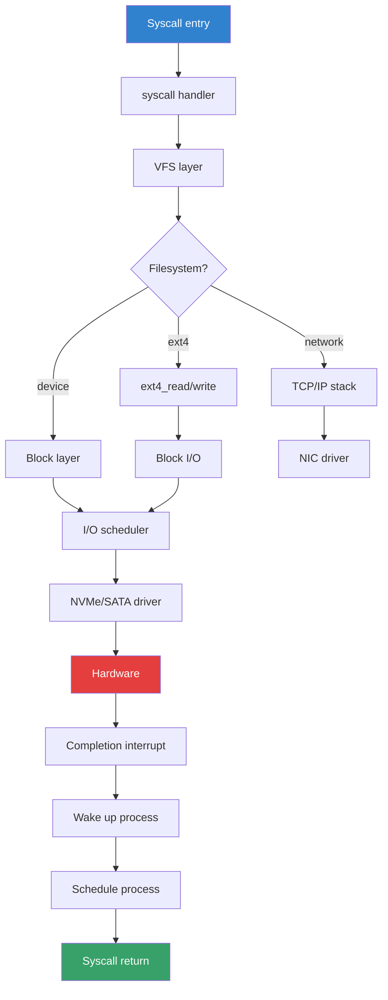
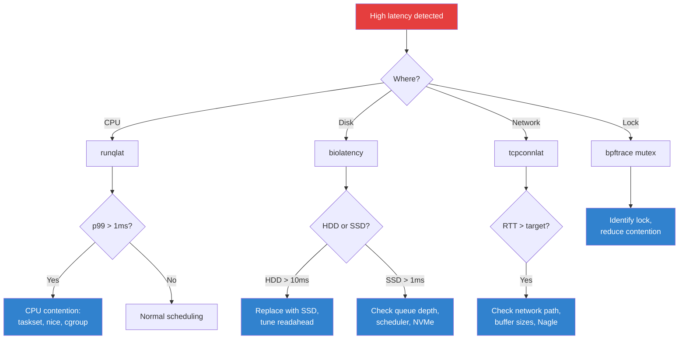

# LatencyTOP

**LatencyTOP** is a Linux performance tool that tracks where applications spend
time waiting. It identifies the specific kernel functions and subsystems
responsible for per-task latency, presenting a breakdown of wakeup sources,
I/O waits, lock contention, and scheduling delays.

> **Original tool:** `latencytop` (userspace)  
> **Kernel support:** `CONFIG_LATENCYTOP` (ftrace-based latency tracking)  
> **Status:** Kernel support maintained; userspace tool less active, often superseded by BPF-based tools

---

## Architecture

```
┌──────────────────────────────────────────────────────┐
│                    User Space                         │
│                  latencytop(8)                        │
│          Reads /proc/<pid>/schedstat                 │
│          Reads /proc/latency_stats                   │
│          Displays top latency sources                │
└──────────────────────┬───────────────────────────────┘
                       │
                       ▼
┌──────────────────────────────────────────────────────┐
│                    Kernel                             │
│                                                      │
│  CONFIG_LATENCYTOP=y                                 │
│  ┌────────────────────────────────────────────────┐  │
│  │  Scheduler latency tracking (schedstat)        │  │
│  │  Function graph tracer integration             │  │
│  │  Per-task wakeup source recording              │  │
│  └────────────────────────────────────────────────┘  │
│                                                      │
│  /proc/latency_stats    (global latency histogram)   │
│  /proc/<pid>/schedstat  (per-task scheduler stats)   │
│  /proc/<pid>/status     (voluntary/involuntary ctx)  │
└──────────────────────────────────────────────────────┘
```

---

## Kernel Configuration

```
CONFIG_LATENCYTOP=y            # Enable LatencyTOP kernel support
CONFIG_SCHEDSTATS=y            # Per-task scheduler statistics
CONFIG_SCHED_DEBUG=y           # Expose scheduler debug info
CONFIG_FUNCTION_GRAPH_TRACER=y # Function graph tracing (for detailed traces)
CONFIG_FTRACE=y                # Ftrace infrastructure
CONFIG_HAVE_LATENCYTOP_SUPPORT=y  # Arch support (x86, ARM, etc.)
```

### Enabling at Runtime

```bash
# Enable latency tracking (requires root)
echo 1 > /proc/sys/kernel/latencytop

# Verify
cat /proc/sys/kernel/latencytop
```

---

## Kernel Interfaces

### `/proc/latency_stats`

Global latency statistics showing the top latency sources:

```bash
cat /proc/latency_stats
```

Example output:

```
Latency Top version : v0.1
 70 4523059 48673348 248732 225417749 do_sys_open / fs/namei.c
 45 1234567 5432100 987654 321098765 unix_stream_sendmsg / net/unix/af_unix.c
 30 9876543 12345678 654321 987654321 futex_wait_queue_me / kernel/futex.c
 25 5678901 2345678 345678 456789012 pipe_read / fs/pipe.c
 20 3456789 8765432 234567 345678901 schedule_timeout / kernel/time/timer.c
```

Columns:

| Column | Meaning |
|--------|---------|
| 1 | Count (times this was a top latency source) |
| 2 | Maximum latency (nanoseconds) |
| 3 | Average latency × count |
| 4 | Standard deviation |
| 5 | Total latency (nanoseconds) |
| 6 | Function name |
| 7 | Source file |

### `/proc/<pid>/schedstat`

Per-task scheduler statistics:

```bash
cat /proc/1234/schedstat
```

Output (three numbers):

```
123456789 987654321 56789
│         │         │
│         │         └── Number of timeslices
│         └──────────── Total time spent waiting on runqueue (ns)
└────────────────────── Total time spent running (ns)
```

### `/proc/<pid>/status`

Context switch counts:

```bash
grep -E "voluntary|nonvoluntary" /proc/1234/status
```

```
voluntary_ctxt_switches:        12345
nonvoluntary_ctxt_switches:     678
```

| Metric | Meaning |
|--------|---------|
| voluntary | Process yielded CPU (I/O wait, sleep) |
| nonvoluntary | Process preempted by scheduler |

### `/proc/<pid>/wakeup_sources`

Shows where the process was woken from (on kernels with wakeup source tracking):

```bash
cat /proc/1234/wakeup_sources
```

---

## The `latencytop` Tool

### Installation

```bash
# Debian/Ubuntu
apt install latencytop

# Fedora/RHEL
dnf install latencytop

# From source
git clone https://github.com/raistlin/latencytop.git
cd latencytop
make
```

### Running LatencyTOP

```bash
# Run with root (needs /proc/latency_stats access)
sudo latencytop

# TUI interface:
# ┌──────────────────────────────────────────────────┐
# │  LatencyTOP v0.5                                 │
# │                                                  │
# │  System latency breakdown:                       │
# │  ────────────────────────────────────────────    │
# │  do_sys_open()       45.2ms ████████████████     │
# │  futex_wait()        32.1ms ███████████          │
# │  pipe_read()         28.7ms ██████████           │
# │  schedule_timeout()  21.3ms ████████             │
# │  tcp_sendmsg()       18.9ms ███████              │
# │                                                  │
# │  Process: my-app (PID 1234)                      │
# │  ────────────────────────────────────────────    │
# │  [I/O wait]     ████████████████  65%            │
# │  [Lock wait]    ████████          32%            │
# │  [Schedule]     █                  3%            │
# └──────────────────────────────────────────────────┘
```

### LatencyTOP Mode

```bash
# Per-process mode
latencytop -p <PID>

# Continuous mode with refresh
latencytop -d 2    # refresh every 2 seconds
```

---

## Understanding Latency Sources

### Common Latency Categories

| Category | Description | Example Functions |
|----------|-------------|-------------------|
| **I/O wait** | Blocked on disk or network I/O | `io_schedule`, `wait_on_page_bit` |
| **Lock contention** | Waiting for a mutex/spinlock | `mutex_lock`, `futex_wait` |
| **Network** | Socket operations | `tcp_sendmsg`, `unix_stream_sendmsg` |
| **Scheduler** | Waiting for CPU time | `schedule`, `schedule_timeout` |
| **Memory** | Page fault, reclaim | `do_page_fault`, `shrink_page_list` |
| **Filesystem** | VFS operations | `do_sys_open`, `pipe_read` |
| **Sleep** | Intentional sleep | `hrtimer_nanosleep`, `poll_schedule_timeout` |

### Reading Latency Output

```
┌──────────────────────────────────────────────────────────────┐
│                    Latency Analysis                          │
│                                                              │
│  do_sys_open()                                               │
│    ├── Why slow: Filesystem metadata read (ext4)             │
│    ├── Where:    fs/namei.c:__openat()                       │
│    ├── Fix:      Use O_NOATIME, reduce open() calls          │
│    └── Typical:  10-50ms on HDD, <1ms on SSD                │
│                                                              │
│  futex_wait_queue_me()                                       │
│    ├── Why slow: Lock contention in application              │
│    ├── Where:    kernel/futex.c                              │
│    ├── Fix:      Reduce lock granularity, use RCU            │
│    └── Typical:  Highly variable, 1μs - 100ms               │
│                                                              │
│  pipe_read()                                                 │
│    ├── Why slow: Producer-consumer imbalance                 │
│    ├── Where:    fs/pipe.c                                   │
│    ├── Fix:      Use larger buffers, reduce pipe count       │
│    └── Typical:  1-10ms                                      │
│                                                              │
│  schedule_timeout()                                          │
│    ├── Why slow: Timers, sleeps                              │
│    ├── Where:    kernel/time/timer.c                         │
│    ├── Fix:      Reduce timer frequency                      │
│    └── Typical:  Depends on timer interval                   │
└──────────────────────────────────────────────────────────────┘
```

---

## Ftrace-Based Latency Tracing

The kernel's ftrace subsystem provides detailed latency information that
LatencyTOP builds upon.

### Using ftrace Directly

```bash
# Enable function graph tracer
cd /sys/kernel/tracing

# Set up function graph tracing for a specific function
echo function_graph > current_tracer
echo do_sys_open > set_graph_function

# Set max latency threshold (microseconds)
echo 1000 > tracing_thresh   # 1ms

# Enable tracing
echo 1 > tracing_on

# Read results
cat trace_pipe

# Example output:
#  0)               |  do_sys_open() {
#  0)   2.345 us    |    path_openat();
#  0)   1.234 us    |    do_filp_open();
#  0)               |    vfs_open() {
#  0)   0.567 us    |      do_dentry_open();
#  0)   1.123 us    |    }
#  0)   6.789 us    |  }
```

### Ftrace Latency Histograms

```bash
# Enable latency histograms
cd /sys/kernel/tracing

# Per-function latency histogram
echo 1 > options/funcgraph-duration
cat trace_stat/function0

# Example output:
#  Function                               Hit      Time    Avg
#  do_sys_open                            1234  56789012  46020
#  tcp_sendmsg                             567  34567890  60970
#  futex_wait                             2345  23456789   9998
```

---

## Wakeup Source Analysis

Understanding *why* a process wakes up is key to latency analysis.

### Wakeup Tracing with ftrace

```bash
cd /sys/kernel/tracing

# Enable sched_wakeup tracer
echo 1 > events/sched/sched_wakeup/enable
echo 1 > events/sched/sched_switch/enable

# Filter for specific PID
echo "prev_pid == 1234 || next_pid == 1234" > events/sched/sched_switch/filter

# Read wakeup sources
cat trace_pipe

# Example output:
#  my-app-1234  [001]  1234.567: sched_wakeup: comm=my-app pid=1234
#  <idle>-0     [001]  1234.568: sched_switch: prev_comm=idle prev_pid=0
#                        => next_comm=my-app next_pid=1234
#  my-app-1234  [001]  1234.569: sched_switch: prev_comm=my-app prev_pid=1234
#                        => next_comm=other next_pid=5678
```

### Wakeup Latency Histogram

```bash
# Wakeup-to-schedule latency
cat /proc/<PID>/schedstat
# or use perf:
perf sched record -- sleep 5
perf sched latency
```

---

## Modern Alternatives to LatencyTOP

While `CONFIG_LATENCYTOP` is still in the kernel, the userspace `latencytop`
tool is largely unmaintained. Modern alternatives include:

### BPF/bpftrace

```bash
# Trace process wakeup latency with bpftrace
bpftrace -e '
tracepoint:sched:sched_wakeup /args->comm == "my-app"/ {
    @wakeup[args->pid] = nsecs;
}
tracepoint:sched:sched_switch /args->next_comm == "my-app"/ {
    $lat = nsecs - @wakeup[args->next_pid];
    @usec = hist($lat / 1000);
    delete(@wakeup[args->next_pid]);
}
'
```

### perf sched

```bash
# Record scheduler events
perf sched record -- sleep 10

# Analyze latency
perf sched latency

# Example output:
#   Task               |   Runtime ms  |  Switches |  Average delay ms | Maximum delay ms |
#   my-app (1234)      |     5432.10  |      1234 |              0.45 |             12.3 |
#   kworker (56)       |      234.56  |       567 |              0.12 |              3.4 |

# Timehist for detailed view
perf sched timehist
```

### perf lock

```bash
# Lock contention analysis
perf lock record -- sleep 5
perf lock report

# Output shows which locks cause the most wait time
```

### BCC Tools

```bash
# runqlat - run queue latency histogram
/usr/share/bcc/tools/runqlat

# Example output:
#  usecs          : count    distribution
#  0 -> 1         : 0       |                                      |
#  2 -> 3         : 1234    |**********                            |
#  4 -> 7         : 5678    |****************************************|
#  8 -> 15        : 2345    |******************                     |
#  16 -> 31       : 567     |****                                  |
#  32 -> 63       : 123     |*                                     |

# offcputime - time spent off CPU
/usr/share/bcc/tools/offcputime -p 1234

# wakeuptime - who is waking up a process
/usr/share/bcc/tools/wakeuptime -p 1234
```

---

## Troubleshooting High Latency

### Step-by-Step Analysis

```
1. Identify the process with high latency
   $ latencytop                    # or perf sched latency

2. Determine latency category
   - I/O wait?    → check disk I/O (iostat, iotop)
   - Lock?        → perf lock, bpftrace
   - Scheduler?   → runqlat, perf sched
   - Network?     → tcpdump, ss

3. Find the specific kernel function
   $ perf record -g -p <PID> -- sleep 10
   $ perf report

4. Trace the exact code path
   $ bpftrace -e 'kprobe:do_sys_open { printf("%s\n", comm); }'

5. Fix
   - I/O: faster storage, I/O scheduling, readahead
   - Locks: reduce contention, use RCU
   - Scheduler: CPU affinity, priority tuning
   - Network: socket options, buffer sizes
```

### Common Fixes

| Symptom | Likely Cause | Fix |
|---------|--------------|-----|
| High runqueue latency | CPU contention | `taskset`, nice, cgroup CPU |
| High I/O latency | Slow storage | SSD, I/O scheduler tuning |
| Lock wait | Contention | Reduce lock scope, RCU |
| Network latency | TCP overhead | Nagle disable, larger buffers |
| Page fault latency | Memory pressure | Add RAM, swap tuning |

---

## Relation to Other Performance Tools

- **LatencyTOP** provides a high-level latency breakdown by kernel function.
- **perf** offers detailed profiling and scheduling analysis.
- **ftrace** is the underlying tracing infrastructure.
- **[BPF/bpftrace](/performance/bpf)** provides programmable, low-overhead tracing.
- **[perf sched](/performance/perf)** is the modern scheduler analysis tool.
- **[ftrace](/debugging/ftrace)** is the kernel function tracer.

---

## Real-World Latency Budgets

### Typical Latency Targets by Application

| Application | Acceptable Latency | Measurement Point |
|-------------|-------------------|------------------|
| HFT Trading | < 10 µs | NIC → app decision |
| Real-time audio | < 10 ms | Input → output |
| Web API | < 100 ms | Request → response (p99) |
| Database query | < 5 ms | Query → result (p99) |
| Video streaming | < 150 ms | Frame decode → display |
| Network ping | < 1 ms (LAN) | ICMP echo → reply |
| Disk I/O (NVMe) | < 100 µs | Submit → completion |
| Disk I/O (SSD) | < 500 µs | Submit → completion |
| Disk I/O (HDD) | < 10 ms | Submit → completion |

### Kernel Latency Breakdown



## eBPF-Based Latency Analysis

Modern Linux performance analysis uses eBPF for programmable, low-overhead
latency tracing:

### bpftrace Latency Scripts

```bash
# Track I/O latency distribution per process
bpftrace -e '
tracepoint:block:block_rq_issue {
    @start[args->dev, args->sector] = nsecs;
}
tracepoint:block:block_rq_complete {
    $lat = (nsecs - @start[args->dev, args->sector]) / 1000;
    if ($lat > 0) {
        @usecs = hist($lat);
        @proc_usecs[comm] = hist($lat);
    }
    delete(@start[args->dev, args->sector]);
}
'

# Track syscall latency per process
bpftrace -e '
tracepoint:raw_syscalls:sys_enter {
    @start[tid] = nsecs;
}
tracepoint:raw_syscalls:sys_exit {
    $lat = (nsecs - @start[tid]) / 1000;
    @usecs[comm, args->id] = hist($lat);
    delete(@start[tid]);
}
'

# Track network latency (TCP RTT)
bpftrace -e '
kprobe:tcp_rcv_established {
    $sk = (struct sock *)arg0;
    $rtt = ((struct tcp_sock *)$sk)->srtt_us >> 3;
    @usecs[comm] = hist($rtt);
}
'

# Wakeup-to-running latency (scheduling delay)
bpftrace -e '
tracepoint:sched:sched_wakeup {
    @wakeup[args->pid] = nsecs;
}
tracepoint:sched:sched_switch {
    if (args->next_pid != 0) {
        $lat = nsecs - @wakeup[args->next_pid];
        if ($lat > 0) {
            @usecs[args->next_comm] = hist($lat / 1000);
        }
        delete(@wakeup[args->next_pid]);
    }
}
'

# Track lock contention latency
bpftrace -e '
kprobe:mutex_lock {
    @start[tid] = nsecs;
}
kretprobe:mutex_lock {
    $lat = (nsecs - @start[tid]) / 1000;
    @usecs[comm, kstack] = hist($lat);
    delete(@start[tid]);
}
'
```

### BCC Latency Tools

```bash
# runqlat — Run queue (scheduling) latency histogram
/usr/share/bcc/tools/runqlat
# usecs          : count    distribution
# 0 -> 1         : 0        |
# 2 -> 3         : 1234     |**********                           |
# 4 -> 7         : 5678     |****************************************|
# 8 -> 15        : 2345     |******************                     |
# 16 -> 31       : 567      |****                                  |
# 32 -> 63       : 123      |*                                     |
# 64 -> 127      : 23       |                                      |

# biolatency — Block I/O latency histogram
/usr/share/bcc/tools/biolatency
# usecs          : count    distribution
# 0 -> 1         : 0        |
# 2 -> 3         : 45       |*                                     |
# 4 -> 7         : 234      |*****                                 |
# 8 -> 15        : 1234     |****************************************|
# 16 -> 31       : 890      |******************************         |
# 32 -> 63       : 456      |***************                        |
# 64 -> 127      : 123      |****                                  |

# ext4slower — Slow ext4 operations (threshold in ms)
/usr/share/bcc/tools/ext4slower 10
# Tracing ext4 operations slower than 10 ms
# TIME     COMM           PID    T BYTES   OFF_KB   LAT(ms) FILENAME
# 14:23:01 myapp          1234   R 4096    0        12.34   data.bin

# xfsslower — Slow XFS operations
/usr/share/bcc/tools/xfsslower 5

# fileslower — Slow filesystem reads/writes
/usr/share/bcc/tools/fileslower 10

# tcpconnlat — TCP connection latency
/usr/share/bcc/tools/tcpconnlat
# PID    COMM         IP SADDR            DADDR            DPORT LAT(ms)
# 1234   curl         4  10.0.0.1         93.184.216.34    80    23.45

# cachestat — Page cache hit/miss ratio
/usr/share/bcc/tools/cachestat
# HITS     MISSES   DIRTIES  HITRATIO   BUFFERS_MB  CACHED_MB
# 12345    678      12       94.79%     234         5678
```

### perf for Latency Analysis

```bash
# Record scheduling events
perf sched record -- sleep 10

# Show scheduling latency
perf sched latency
#   Task               |   Runtime ms  |  Switches |  Average delay ms | Maximum delay ms |
#   my-app (1234)      |     5432.10  |      1234 |              0.45 |             12.3 |
#   kworker (56)       |      234.56  |       567 |              0.12 |              3.4 |

# Timehist for detailed view
perf sched timehist

# Lock contention analysis
perf lock record -- sleep 5
perf lock report

# Record with call graphs for latency attribution
perf record -g -p $PID -- sleep 10
perf report --sort=dso,symbol

# Off-CPU time analysis
perf record -e sched:sched_switch -ag -- sleep 10
perf report
```

## Systematic Latency Debugging

### Step 1: Identify the Process

```bash
# Find processes with high latency
pidstat -d 1    # I/O latency
pidstat -w 1    # Context switch (voluntary = I/O, involuntary = CPU)

# High voluntary context switches = I/O bound
# High involuntary context switches = CPU contention
```

### Step 2: Classify the Latency

```bash
# Is it CPU scheduling delay?
/usr/share/bcc/tools/runqlat
# If p99 > 1ms → CPU contention

# Is it I/O latency?
/usr/share/bcc/tools/biolatency
# If p99 > 10ms (HDD) or 1ms (SSD) → storage issue

# Is it network latency?
ss -ti | grep rtt  # TCP RTT
/usr/share/bcc/tools/tcpconnlat

# Is it lock contention?
bpftrace -e 'kprobe:mutex_lock { @start[tid] = nsecs; }
             kretprobe:mutex_lock { @usecs = hist((nsecs-@start[tid])/1000); delete(@start[tid]); }'

# Is it memory pressure?
vmstat 1
# si/so (swap in/out) > 0 → memory pressure
# free -h → check available memory
```

### Step 3: Find the Root Cause

```bash
# CPU: profile the process
perf record -g -p $PID -- sleep 10
perf report
# Look for hot functions, lock waits, syscall overhead

# I/O: trace block I/O path
/usr/share/bcc/tools/biosnoop
# Shows per-I/O latency with process info

# Network: capture and analyze
tcpdump -i eth0 -w /tmp/capture.pcap
# Analyze with tshark or Wireshark

# Memory: check page faults
perf stat -e page-faults,minor-faults,major-faults -p $PID -- sleep 5
# Major faults = disk I/O (swap or file)
```

### Step 4: Fix

| Root Cause | Fix |
|-----------|-----|
| CPU scheduling | `taskset`, nice, cgroup CPU |
| I/O (HDD) | SSD, readahead, I/O scheduler |
| I/O (SSD) | NVMe, `none` scheduler, `io_uring` |
| Lock contention | Reduce scope, RCU, per-CPU data |
| Network | Socket tuning, Nagle disable, bigger buffers |
| Memory | Add RAM, tune swappiness, hugepages |
| Page faults | `mlock`, `madvise`, `fadvise` |

## Latency Monitoring in Production

### Continuous Monitoring Setup

```bash
# Export latency metrics for monitoring (Prometheus/Grafana)

# node_exporter exposes:
# - node_disk_io_time_seconds (I/O time)
# - node_network_transmit_queue_length
# - node_schedstat_waiting_seconds_total

# Custom BPF exporter for application latency
# bcc + Prometheus exporter

# systemd journal logging of slow operations
# /etc/systemd/journald.conf:
# MaxLevelSyslog=warning
# ForwardToSyslog=no
```

### Alerting on Latency

```bash
# Simple latency check script
#!/bin/bash
# Check I/O latency via iostat
LATENCY=$(iostat -xd 1 2 | tail -n +7 | awk '{print $NF}' | sort -rn | head -1)
if (( $(echo "$LATENCY > 50" | bc -l) )); then
    echo "ALERT: High I/O latency: ${LATENCY}ms"
    # Send alert
fi

# Check scheduling latency via /proc/latency_stats
if [ -f /proc/latency_stats ]; then
    cat /proc/latency_stats
fi
```

## Latency Analysis Decision Tree



## Further Reading

- [LatencyTOP website](https://latencytop.org/)
- [LWN: Finding the source of latency (2008)](https://lwn.net/Articles/271654/)
- [Kernel docs: latencytop](https://www.kernel.org/doc/html/latest/admin-guide/latencytop.html)
- [Kernel docs: sched-stats](https://www.kernel.org/doc/html/latest/scheduler/sched-stats.html)
- [BPF Performance Tools (Brendan Gregg)](http://www.brendangregg.com/bpf-performance-tools-book.html)
- [perf sched documentation](https://man7.org/linux/man-pages/man1/perf-sched.1.html)
- See also: [perf](/performance/perf), [ftrace](/debugging/ftrace), [BPF](/performance/bpf), [Scheduler](/kernel/scheduler)
