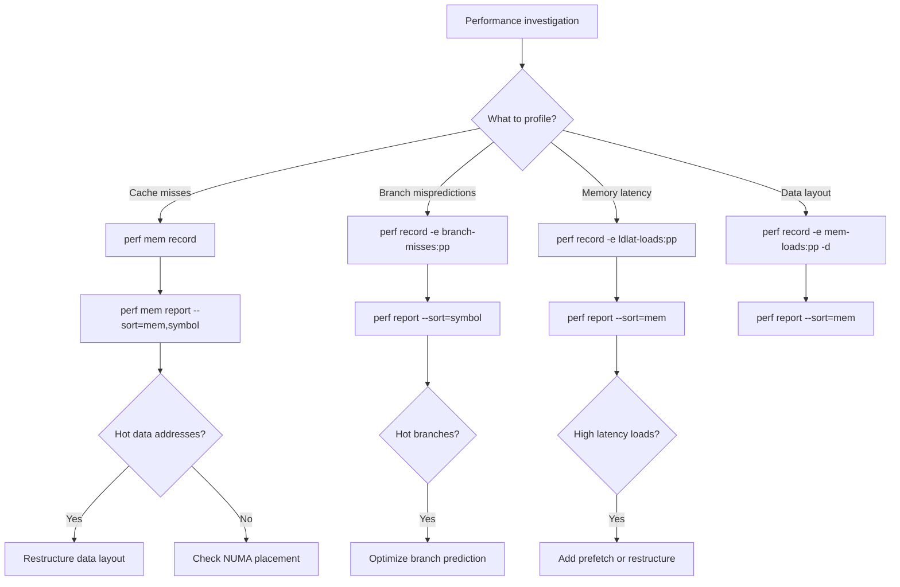
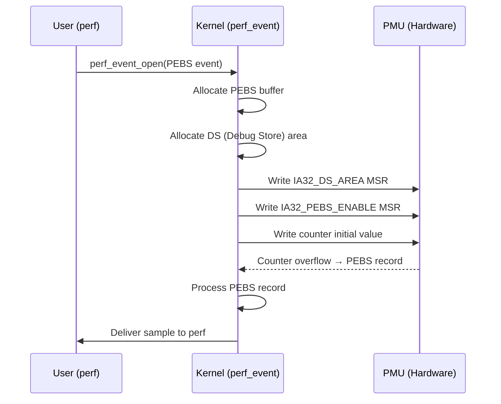

# PEBS: Precise Event-Based Sampling

## Overview

PEBS (Precise Event-Based Sampling) is an Intel processor technology that provides **precise** hardware performance counter sampling. Unlike traditional interrupt-based performance monitoring (where the interrupt may be delayed and the instruction pointer recorded is "skid" away from the actual instruction causing the event), PEBS records precise architectural state at the exact instruction that triggered the event.

PEBS is available on Intel processors since Nehalem (2008) and has been enhanced in subsequent generations (Sandy Bridge, Haswell, Skylake, Sapphire Rapids). It is the foundation for precise memory profiling, data address profiling, and high-quality performance analysis in Linux.

## The Skid Problem

Traditional performance monitoring works by:

1. Programming a counter to count events (e.g., cache misses)
2. Setting an overflow threshold
3. When the counter overflows, an NMI is generated
4. The NMI handler records the current instruction pointer (IP)

The problem: there is a **delay** (called "skid") between the event and the NMI. The processor may have executed 10–100+ instructions by the time the NMI fires. The recorded IP points to an instruction that **didn't cause the event**.

```
Instruction causing event (e.g., cache miss)
    │
    │ ← skid: 10-100+ instructions executed
    │
NMI fires, IP recorded here (WRONG instruction!)
```

This makes traditional sampling unreliable for:
- Attribution (which instruction caused the event?)
- Memory profiling (which load/store caused the miss?)
- Compiler optimization feedback

## PEBS Solution

PEBS solves the skid problem by recording the precise architectural state at the exact instruction that triggers the event. Instead of relying on an NMI, the processor writes a **PEBS record** to a memory buffer when the counter overflows.

### PEBS Record

```c
/* PEBS record (simplified, varies by generation) */
struct pebs_record {
    u64 flags;
    u64 ip;           /* Precise instruction pointer */
    u64 ax, bx, cx, dx;  /* General-purpose registers */
    u64 si, di, bp, sp;
    u64 r8-r15;       /* 64-bit only */
    u64 rflags;
    u64 cs, ds, es, fs, gs, ss;  /* Segment registers */
    u64 fs_base, gs_base;
    u64 cr3;          /* Page table base */
    /* Extended fields (PEBS v2+, varies by CPU): */
    u64 data_address; /* Address of load/store that caused the event */
    u64 data_src;     /* Data source encoding (L1/L2/LLC/DRAM) */
    u64 latency;      /* Latency of the operation */
    u64 tsc;          /* Timestamp counter value */
    /* Sapphire Rapids+ additions: */
    u64 eventing_ip;  /* IP of the eventing instruction */
    u64 tsx;          /* Transaction info */
};
```

### PEBS Buffer

The kernel programs the processor with a PEBS buffer (in memory). The processor writes PEBS records to this buffer without kernel intervention. When the buffer approaches full, an interrupt is generated to process the records.

```
┌─────────────────────────────┐
│       PEBS Buffer           │  (allocated by kernel)
│                             │
│  ┌─────────────────────┐   │
│  │ Record 1 (oldest)   │   │
│  ├─────────────────────┤   │
│  │ Record 2            │   │
│  ├─────────────────────┤   │
│  │ Record 3            │   │
│  ├─────────────────────┤   │
│  │ ...                 │   │
│  ├─────────────────────┤   │
│  │ Record N (newest)   │   │
│  └─────────────────────┘   │
│                             │
│  Head ← (kernel reads)     │
│  Tail ← (CPU writes)       │
└─────────────────────────────┘
```

## PEBS Generations

### PEBS v1 (Nehalem, Westmere)

- Basic PEBS: precise IP, register state
- Single counter PEBS (only one event can be precise)
- Fixed buffer size

### PEBS v2 (Sandy Bridge, Ivy Bridge)

- **Multi-PEBS**: multiple events can be precise simultaneously
- **Adaptive PEBS**: larger records with more fields
- Data address profiling for loads and stores
- Latency recording

### PEBS v3 (Haswell, Broadwell)

- **Improved data source**: more granular cache level information
- **Weight**: event-specific weighting
- **Enhanced PEBS** in `perf`: better integration with Linux perf

### PEBS v4 (Skylake, Ice Lake)

- **PEBS output to Intel PT**: PEBS records can be written to Intel Processor Trace streams
- **Architectural PEBS**: standardized PEBS interface
- **PEBS assist**: processor assists for certain events

### PEBS v5 (Sapphire Rapids, Meteor Lake)

- **PEBS with data address filtering**: filter by address range
- **Eventing IP**: precise IP of the instruction that caused the event (vs. the IP that was executing when the record was written)
- **Enhanced data source**: CXL, HBM sources

## Linux perf Integration

### Requesting PEBS

```bash
# Use :P suffix for precise events
perf record -e cpu/event=0xd1,umask=0x01/P -- ./workload

# Or use the 'precise' modifier
perf record -e instructions:P -- ./workload

# Multiple precision levels:
# :P  = PEBS precise (best quality)
# :p  = precise (may use skid-based sampling)
# :pp = very precise (additional filtering)
# :ppp = extremely precise (best available)
```

### Common PEBS Events

```bash
# Memory load latency
perf record -e ldlat-loads:pp -- ./workload

# Memory store latency
perf record -e ldlat-stores:pp -- ./workload

# Cache misses (precise)
perf record -e mem-loads:pp -- ./workload

# Branch mispredictions (precise)
perf record -e branch-misses:pp -- ./workload

# Instruction retirement (precise)
perf record -e instructions:pp -- ./workload
```

### Data Address Profiling

PEBS enables profiling of the **data addresses** accessed by loads and stores:

```bash
# Record data addresses for load events
perf record -e mem-loads:pp -d -- ./workload

# Record data addresses for store events
perf record -e mem-stores:pp -d -- ./workload

# Analyze data addresses
perf report --sort=mem
```

The `mem` sort key shows the data addresses that caused cache misses, enabling identification of:
- Hot data structures
- Cache line conflicts
- NUMA-remote accesses

### Latency Profiling

```bash
# Record load latency (cycles from issue to completion)
perf record -e cpu/config=0xcd,umask=0x02,ldlat=0x100/P -- ./workload

# Analyze latency distribution
perf report --sort=mem
```

### PEBS + Intel PT

On Skylake+, PEBS records can be output to Intel PT:

```bash
# Record PEBS events into PT stream
perf record -e intel_pt// -- ./workload

# Or combined
perf record -e intel_pt// -e cpu/event=0xd1,umask=0x01/P -- ./workload
```

This provides both **branch trace** and **precise event** data in a single recording.

## Memory Profiling with PEBS

### Identifying Hot Memory Locations

```bash
# Record memory load events with data addresses
perf mem record -- ./workload

# Analyze by data address
perf mem report --sort=mem --stdio

# Output:
# Overhead  Data Symbol          Shared Object
# 12.34%    [.] 0x7f12345678    libc.so
#  8.21%    [.] array+0x100     myprogram
#  ...
```

### Cache Level Analysis

PEBS records include the **data source** (where the data was found):

```bash
# Analyze by data source
perf mem report --sort=mem,symbol --stdio

# Data source categories:
# L1 hit    - data in L1 cache
# L2 hit    - data in L2 cache
# L3 hit    - data in L3/LLC cache
# Local RAM - data in local DRAM
# Remote RAM - data in remote NUMA node DRAM
# I/O       - memory-mapped I/O
```

### NUMA Analysis

```bash
# Record with NUMA node information
perf mem record -- ./workload

# Show NUMA distribution
perf mem report --sort=mem,symbol --stdio
# Look for "Remote RAM" entries — these are costly
```

### tlb-misses Profiling

```bash
# Profile TLB misses with precise data addresses
perf record -e dtlb_load_misses.walk_completed:pp -- ./workload

# Identify pages causing TLB misses
perf report --sort=mem
```

## Implementation in Linux

### PEBS Initialization

In `arch/x86/events/intel/core.c`:

```c
static void intel_pmu_enable_pebs(void)
{
    /* Allocate PEBS buffer */
    /* Program PEBS MSR (IA32_PEBS_ENABLE) */
    /* Set up DS (Debug Store) area */
    /* Configure PEBS threshold and reset value */
}
```

### DS (Debug Store) Area

PEBS uses a processor feature called the **Debug Store (DS)**:

```c
struct debug_store {
    u64 bts_buffer_base;     /* Branch Trace Store buffer */
    u64 bts_index;           /* Current BTS position */
    u64 bts_absolute_maximum;
    u64 bts_interrupt_threshold;
    u64 pebs_buffer_base;    /* PEBS buffer base address */
    u64 pebs_index;          /* Current PEBS write position */
    u64 pebs_absolute_maximum;
    u64 pebs_interrupt_threshold;
    u64 pebs_counter0_reset; /* Reset value for counter 0 */
    u64 pebs_counter1_reset;
    u64 pebs_counter2_reset;
    u64 pebs_counter3_reset;
};
```

The kernel allocates the DS area and PEBS buffer, programs the `IA32_DS_AREA` MSR to point to it, and enables PEBS via `IA32_PEBS_ENABLE`.

### PEBS Draining

When the PEBS buffer is nearly full, the processor generates an interrupt. The kernel's PMI (Performance Monitoring Interrupt) handler processes the PEBS records:

```c
static void intel_pmu_drain_pebs(struct pt_regs *regs)
{
    /* Read PEBS records from the buffer */
    /* For each record:
     *   - Extract precise IP
     *   - Extract data address (if available)
     *   - Create a sample and deliver to perf
     */
    /* Reset the PEBS buffer index */
}
```

### Data Source Decoding

The `data_src` field in PEBS records encodes where the data came from:

```c
/* Data source encoding (simplified) */
#define PEBS_DATA_SRC_L1     0x01
#define PEBS_DATA_SRC_LFB    0x02
#define PEBS_DATA_SRC_L2     0x04
#define PEBS_DATA_SRC_L3     0x08
#define PEBS_DATA_SRC_LOCAL_RAM  0x10
#define PEBS_DATA_SRC_REMOTE_RAM 0x20
#define PEBS_DATA_SRC_IO     0x40
#define PEBS_DATA_SRC_UNC    0x80
```

The kernel maps this to perf's `PERF_MEM_*` encoding for userspace consumption.

## Advanced Usage

### PEBS with Filters

```bash
# Filter by data address range (Skylake+)
perf record -e mem-loads:pp,addr=0x1000:0x2000 -- ./workload

# Filter by latency threshold
perf record -e cpu/config=0xcd,umask=0x02,ldlat=0x80/P -- ./workload
# Only records loads with latency >= 128 cycles

# Filter by NUMA node
perf record -e mem-loads:pp,weight=0x1 -- ./workload
```

### PEBS in System-Wide Mode

```bash
# System-wide PEBS recording
perf record -a -e mem-loads:pp -d -- sleep 10

# Per-CPU PEBS
perf record -C 0,1,2,3 -e mem-loads:pp -d -- ./workload
```

### PEBS for Optimization

PEBS data drives optimization decisions:

1. **Identify hot loads**: which loads cause the most cache misses?
2. **Measure latency**: what's the distribution of load latencies?
3. **Data layout**: are hot data structures cache-friendly?
4. **NUMA placement**: are data accesses hitting remote nodes?
5. **Prefetch effectiveness**: are hardware prefetchers working?

```bash
# Full memory profiling workflow
perf mem record -a -- sleep 10      # Record
perf mem report --sort=mem,symbol    # Analyze hot addresses
perf mem report --sort=mem,dsnoop    # Analyze data sources
perf mem report --sort=symbol,mem    # Per-symbol analysis
```

### Integration with Other Tools

```bash
# perf + FlameGraph for memory profiling
perf mem record -- ./workload
perf script | stackcollapse-perf.pl | flamegraph.pl > mem_flamegraph.svg

# perf + intel-cmt-cat for cache allocation
perf mem record -- ./workload
# Use perf mem report to identify cache pressure

# perf + bpf for dynamic analysis
perf record -e mem-loads:pp -e mem-stores:pp -- ./workload
```

## Limitations

1. **Intel-only**: PEBS is an Intel feature. AMD has a similar feature called **IBS** (Instruction-Based Sampling).
2. **Counter limitations**: not all events support PEBS. Check with `perf list` (events with `:P` suffix).
3. **Overhead**: PEBS has lower overhead than NMI-based sampling but still has some cost for buffer management.
4. **Buffer sizing**: too small buffers cause frequent interrupts; too large buffers waste memory.
5. **Kernel support**: requires `CONFIG_PERF_EVENTS` and Intel PMU support.
6. **Privilege levels**: PEBS can be restricted to ring 0, ring 3, or both via event filters.
7. **Virtualization**: PEBS in guests is complex; some hypervisors pass it through, others don't.

## AMD IBS Comparison

AMD's equivalent is **IBS** (Instruction-Based Sampling):

| Feature | Intel PEBS | AMD IBS |
|---------|-----------|---------|
| Mechanism | Counter overflow → buffer | Random sampling → MSR |
| Precision | Very precise | Precise |
| Data address | Yes (loads/stores) | Yes |
| Latency | Yes | Yes (separate counters) |
| Buffer | In-memory DS area | MSR read on PMI |
| Multi-event | Yes (PEBS v2+) | Yes (separate IBS units) |

```bash
# AMD IBS
perf record -e ibs_op// -- ./workload
perf record -e ibs_op//,ldlat=100 -- ./workload
```

## Source Files

- `arch/x86/events/intel/core.c` — Intel PMU and PEBS core
- `arch/x86/events/intel/ds.c` — Debug Store and PEBS buffer management
- `arch/x86/events/intel/lbr.c` — Last Branch Record (related)
- `arch/x86/events/core.c` — x86 perf core
- `include/linux/perf_event.h` — perf event structures
- `tools/perf/` — userspace perf tool
- `kernel/events/core.c` — kernel perf infrastructure

## PEBS Analysis Workflow



## PEBS vs AMD IBS: Practical Comparison

```bash
# Intel PEBS
perf record -e mem-loads:pp -d -- ./workload
perf mem report --sort=mem,symbol
# Shows: data addresses, cache levels, NUMA nodes

# AMD IBS (similar capability)
perf record -e ibs_op// -- ./workload
perf report --sort=symbol
# Shows: operation latency, data addresses

# AMD IBS with latency filtering
perf record -e ibs_op//,ldlat=100 -- ./workload
# Only records operations with latency >= 100 cycles
```

| Feature | Intel PEBS | AMD IBS |
|---------|-----------|----------|
| **Available since** | Nehalem (2008) | Barcelona (2007) |
| **Data address profiling** | Yes | Yes |
| **Cache level info** | Yes (data_src) | Yes |
| **Latency recording** | Yes | Yes (separate counters) |
| **Multi-event** | Yes (PEBS v2+) | Yes (separate IBS units) |
| **Buffer mechanism** | In-memory DS area | MSR read on PMI |
| **Overhead** | Low | Low |
| **Kernel support** | `CONFIG_PERF_EVENTS` | `CONFIG_PERF_EVENTS` |

## PEBS for Compiler Optimization

PEBS data can drive compiler optimization decisions:

```bash
# Generate PEBS-based optimization report
perf record -e instructions:pp -e branch-misses:pp -e mem-loads:pp \
    -d -- ./workload

# Analyze with perf annotate
perf annotate --symbol=my_function --stdio
# Percent | Source code & ASM
# --------|------------------
# 45.23%  | mov (%rax), %rcx    ← Hot load (cache miss)
# 23.45%  | cmp $0, %rcx
# 12.34%  | je .L2              ← Branch misprediction
#  8.90%  | add $8, %rax

# Use with AutoFDO (Automatic Feedback-Directed Optimization)
# 1. Collect PEBS profile
perf record -b -e cycles:pp -- ./workload

# 2. Convert to AutoFDO format
create_llvm_prof --binary=./workload --profile=perf.data --out=workload.afdo

# 3. Compile with profile
clang -fprofile-sample-use=workload.afdo -O2 mycode.c
```

## PEBS Overhead Measurement

```bash
# Measure PEBS overhead
# Baseline: no PEBS
perf stat -e cycles,instructions -- ./workload
# cycles: 10,000,000,000
# instructions: 8,000,000,000

# With PEBS
perf stat -e cycles,instructions -- perf record -e mem-loads:pp -- ./workload
# cycles: 10,050,000,000  ← 0.5% overhead
# instructions: 8,020,000,000

# Overhead varies by:
# - Event rate (higher rate = more PEBS records = more overhead)
# - Buffer size (larger buffer = fewer interrupts)
# - Number of precise events (more events = more overhead)
```

| Configuration | Overhead | Notes |
|--------------|----------|-------|
| Single PEBS event | 0.1-0.5% | Minimal impact |
| Multiple PEBS events | 0.5-2% | Moderate |
| System-wide PEBS | 1-5% | Higher due to all-CPU sampling |
| PEBS + Intel PT | 2-10% | Combined tracing overhead |

## PEBS in Production

### Safe Production Profiling

```bash
# Low-overhead production profiling
# 1. Use sampling frequency limit
perf record -F 99 -e mem-loads:pp -a -- sleep 30
# 99 Hz = ~100 samples/sec per CPU

# 2. Profile specific processes only
perf record -F 99 -e mem-loads:pp -p $(pidof myapp) -- sleep 30

# 3. Use --call-graph fp for lower overhead
perf record -F 99 -e mem-loads:pp --call-graph fp -p $(pidof myapp) -- sleep 30

# 4. Rotate recording files
perf record -F 99 -e mem-loads:pp -a \
    --switch-output=1m -o perf.data -- sleep 300
```

### Continuous Memory Profiling

```bash
#!/bin/bash
# continuous-pebs.sh — Periodic memory profiling
INTERVAL=300  # 5 minutes
DURATION=30   # 30 seconds per capture
OUTDIR="/var/lib/perf-profiles"
mkdir -p "$OUTDIR"

while true; do
    TIMESTAMP=$(date +%Y%m%d-%H%M%S)
    perf record -F 99 -e mem-loads:pp -d -a \
        --output="$OUTDIR/pebs-$TIMESTAMP.data" -- sleep $DURATION

    # Generate summary
    perf mem report -i "$OUTDIR/pebs-$TIMESTAMP.data" \
        --sort=mem,symbol --stdio > "$OUTDIR/pebs-$TIMESTAMP.txt" 2>/dev/null

    # Cleanup old profiles (keep 7 days)
    find "$OUTDIR" -name "pebs-*" -mtime +7 -delete

    sleep $INTERVAL
done
```

## PEBS Kernel Internals

### PEBS Initialization Flow



### PEBS Record Processing

```c
/* Simplified PEBS record processing in kernel */
static void intel_pmu_drain_pebs_nhm(struct pt_regs *regs)
{
    struct cpu_hw_events *cpuc = this_cpu_ptr(&cpu_hw_events);
    struct debug_store *ds = cpuc->ds;
    struct pebs_record_nhm *at, *top;
    int n;

    at = (struct pebs_record_nhm *)ds->pebs_buffer_base;
    top = (struct pebs_record_nhm *)ds->pebs_index;

    n = top - at;
    if (n <= 0)
        return;

    /* Process each PEBS record */
    for (; at < top; at++) {
        struct perf_sample_data data;
        struct pt_regs regs;

        /* Extract precise IP */
        regs.ip = at->ip;
        /* Extract data address */
        data.addr = at->data_src;
        /* Create perf sample */
        __intel_pmu_pebs_event(event, &regs, &data, at);
    }

    /* Reset PEBS buffer index */
    ds->pebs_index = ds->pebs_buffer_base;
}
```

## Further Reading

- **Documentation/admin-guide/perf/pebs.rst** — PEBS documentation
- **Intel Software Developer Manual, Volume 3, Chapter 18** — PEBS and architectural performance monitoring
- **LWN: PEBS** — <https://lwn.net/Articles/633230/>
- **LWN: Precise memory profiling** — <https://lwn.net/Articles/642925/>
- **Intel perfmon events** — <https://perfmon-events.intel.com/>
- **Brendan Gregg's perf examples** — <https://www.brendangregg.com/perf.html>
- **Andi Kleen's perf tools** — <https://github.com/andikleen/pmu-tools>
- Gregg, B. *Systems Performance: Enterprise and the Cloud*, 2nd Edition (2020).
- Gregg, B. *BPF Performance Tools* (2019).

## See Also

- [perf](../debugging/perf.md) — Linux performance analysis tool
- Intel PT — Intel Processor Trace
- Intel PMU — Intel Performance Monitoring Unit
- AMD IBS — AMD Instruction-Based Sampling
- NUMA — NUMA memory architecture
- Cache Hierarchy — CPU cache architecture
- [Memory Performance](memory.md)
- [NUMA Optimization](numa.md)
- [Benchmarking](benchmarking.md)
