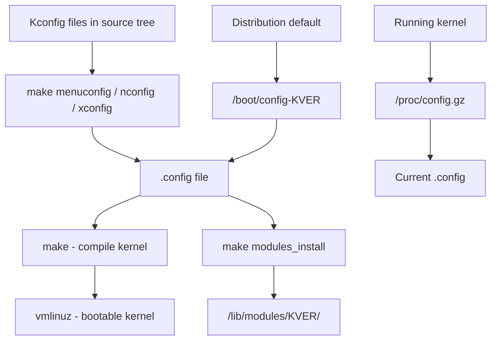

# Kernel Configuration Reference

The Linux kernel is highly configurable. Thousands of `CONFIG_*` options control which features,
drivers, and subsystems are compiled into the kernel. This chapter documents the most important
configuration options organized by subsystem, and explains how to inspect, modify, and manage
kernel configuration.

---

## Introduction

The Linux kernel configuration system uses the **Kconfig** language. Each option is defined in
`Kconfig` files throughout the kernel source tree. The configuration is stored in a `.config`
file at the root of the kernel source directory.



### Configuration States

Each option can be in one of three states:

- `y` (built-in) — Compiled into the kernel image
- `m` (module) — Compiled as a loadable kernel module
- `n` (disabled) — Not compiled at all

---

## Checking the Running Kernel Configuration

### From /proc/config.gz

If `CONFIG_IKCONFIG_PROC` is enabled, the running kernel's configuration is available:

```bash
# Check if the config is available
ls -la /proc/config.gz

# View the entire configuration
zcat /proc/config.gz

# Search for a specific option
zcat /proc/config.gz | grep CONFIG_BPF

# Save to a file
zcat /proc/config.gz > running_kernel.config
```

### From /boot/

Most distributions install the config alongside the kernel:

```bash
# List available kernel configs
ls /boot/config-*

# Check a specific option
grep CONFIG_EXT4_FS /boot/config-$(uname -r)

# Example output:
# CONFIG_EXT4_FS=m
# CONFIG_EXT4_FS_POSIX_ACL=y
# CONFIG_EXT4_FS_SECURITY=y
```

### Using /proc/sys/ and sysctl

Many kernel options can be queried at runtime:

```bash
# Check a sysctl value
sysctl net.ipv4.ip_forward
# net.ipv4.ip_forward = 0

# List all sysctl values
sysctl -a | head -20

# Check specific subsystem
sysctl net.ipv4
sysctl vm
sysctl kernel
```

### Using modinfo

Check if a feature is compiled as a module:

```bash
# Check if a module exists
modinfo ext4
# filename:    /lib/modules/6.1.0/kernel/fs/ext4/ext4.ko
# license:     GPL
# description: Fourth Extended Filesystem

# Check BPF module
modinfo bpf

# List all loaded modules
lsmod
```

---

## Kernel Configuration Interfaces

### make menuconfig (ncurses)

The most popular text-based configuration tool:

```bash
cd /usr/src/linux
make menuconfig
```

Navigation:
- Arrow keys — Navigate menus
- Enter — Enter submenu or toggle option
- `y` — Build in
- `m` — Build as module
- `n` — Disable
- `?` — Help for current option
- `/` — Search for a symbol
- `Esc Esc` — Back/exit

### make nconfig (ncurses, alternative)

```bash
make nconfig
```

### make xconfig (Qt-based GUI)

```bash
# Requires Qt libraries
sudo apt install qtbase5-dev
make xconfig
```

### make gconfig (GTK-based GUI)

```bash
make gconfig
```

### Command-line Configuration

```bash
# Enable an option
scripts/config --enable CONFIG_BPF_SYSCALL

# Disable an option
scripts/config --disable CONFIG_DEBUG_INFO

# Set to module
scripts/config --module CONFIG_EXT4_FS

# Query an option
scripts/config --state CONFIG_EXT4_FS

# Using sed directly
sed -i 's/# CONFIG_BPF_SYSCALL is not set/CONFIG_BPF_SYSCALL=y/' .config
```

### Using olddefconfig

After modifying `.config`, resolve dependencies:

```bash
make olddefconfig
# Sets new options to their default values
```

### diffconfig — Compare Configurations

```bash
# Compare two kernel configs
scripts/diffconfig config_old config_new

# Example output:
# CONFIG_BPF_SYSCALL: n -> y
# CONFIG_DEBUG_INFO: y -> n
```

---

## Important CONFIG_* Options by Subsystem

### General Setup

```bash
# CONFIG_LOCALVERSION
# Custom string appended to kernel version
# Example: CONFIG_LOCALVERSION="-custom"
uname -r  # Shows: 6.1.0-custom

# CONFIG_LOCALVERSION_AUTO
# Automatically append git commit hash
# Usually disabled for reproducible builds

# CONFIG_MODULES
# Enable loadable module support
# Almost always =y on production systems

# CONFIG_MODULE_SIG
# Require modules to be signed
# Important for Secure Boot

# CONFIG_MODULE_SIG_FORCE
# Reject unsigned modules
# CONFIG_MODULE_SIG=y required
```

### Processor and Platform

```bash
# CONFIG_SMP
# Symmetric Multi-Processing support
# =y on all modern systems

# CONFIG_X86_64
# 64-bit support (x86_64 architecture)

# CONFIG_NUMA
# Non-Uniform Memory Access support
# Important for multi-socket servers

# CONFIG_PREEMPT
# Full kernel preemption
# CONFIG_PREEMPT=y — Low latency (desktop/real-time)
# CONFIG_PREEMPT_VOLUNTARY=y — Medium latency
# CONFIG_PREEMPT_NONE=y — Throughput (server)

# CONFIG_HZ_1000 / CONFIG_HZ_250 / CONFIG_HZ_100
# Timer interrupt frequency
# 1000 Hz — Low latency (desktop)
# 250 Hz — Default (balanced)
# 100 Hz — Throughput (server)

# CONFIG_NO_HZ_IDLE
# Tickless idle — reduces power on idle CPUs
# =y recommended for most systems

# CONFIG_CPU_FREQ
# CPU frequency scaling (governors)
# Enables powersave, performance, schedutil governors

# CONFIG_CPU_IDLE
# CPU idle management (C-states)
```

### Memory Management

```bash
# CONFIG_MMU
# Memory Management Unit support
# Always =y on standard hardware

# CONFIG_TRANSPARENT_HUGEPAGE
# Transparent Huge Pages (THP)
# =m or =y — Automatic use of 2MB pages
# Tunable: /sys/kernel/mm/transparent_hugepage/

# CONFIG_HUGETLBFS
# Huge pages filesystem
# For explicit huge page allocation

# CONFIG_CMA
# Contiguous Memory Allocator
# For devices needing contiguous DMA buffers

# CONFIG_ZSWAP
# Compressed swap cache
# Compresses pages before writing to swap

# CONFIG_ZRAM
# Compressed RAM block device
# Used as swap on low-memory systems

# CONFIG_KSM
# Kernel Same-page Merging
# Deduplicates identical memory pages (useful for VMs)

# CONFIG_NUMA_BALANCING
# Automatic NUMA page balancing
# =y for NUMA systems

# CONFIG_COMPACTION
# Memory compaction for huge page allocation
# =y recommended

# CONFIG_DEFERRED_STRUCT_PAGE_INIT
# Defer struct page initialization to parallelize boot
# Speeds up boot on large-memory systems
```

### Block Devices and Storage

```bash
# CONFIG_BLOCK
# Block layer support
# Always =y

# CONFIG_BLK_DEV_LOOP
# Loop devices (mount ISOs, squashfs)
# =y or =m

# CONFIG_BLK_DEV_NBD
# Network Block Device
# For distributed storage

# CONFIG_BLK_DEV_DM
# Device Mapper
# Required for LVM, LUKS, dm-crypt, multipath

# CONFIG_DM_CRYPT
# dm-crypt: transparent disk encryption
# Required for LUKS

# CONFIG_DM_SNAPSHOT
# Device-mapper snapshots
# Required for LVM snapshots

# CONFIG_MD
# Multiple Devices driver (RAID)
# Required for software RAID (mdadm)

# CONFIG_MD_RAID0, CONFIG_MD_RAID1, CONFIG_MD_RAID456, CONFIG_MD_RAID10
# Individual RAID level support

# CONFIG_NVME_CORE
# NVMe core support
# Essential for modern SSDs

# CONFIG_BLK_DEV_NVME
# NVMe block device driver

# CONFIG_SCSI
# SCSI subsystem
# Required for SATA, SAS, USB storage, virtio

# CONFIG_ATA
# ATA/ATAPI/SATA support
```

### Filesystems

```bash
# CONFIG_EXT4_FS
# ext4 filesystem — default on many distributions
# =y for root filesystem, =m otherwise
# CONFIG_EXT4_FS_POSIX_ACL — POSIX ACL support
# CONFIG_EXT4_FS_SECURITY — Security labels (SELinux)

# CONFIG_XFS_FS
# XFS filesystem — default on RHEL 7+
# High performance for large files
# CONFIG_XFS_POSIX_ACL — POSIX ACL support

# CONFIG_BTRFS_FS
# Btrfs — copy-on-write filesystem
# Snapshots, compression, RAID, checksums

# CONFIG_F2FS_FS
# F2FS (Flash-Friendly File System)
# Optimized for NAND flash (SSDs, SD cards)

# CONFIG_FUSE_FS
# Filesystem in Userspace
# Required for sshfs, ntfs-3g, AppImage

# CONFIG_OVERLAY_FS
# OverlayFS — union mount filesystem
# Used by Docker and container runtimes

# CONFIG_TMPFS
# tmpfs — memory-based filesystem
# Used for /tmp, /dev/shm, /run

# CONFIG_PROC_FS
# /proc filesystem
# Essential — provides process and kernel information

# CONFIG_SYSFS
# /sys filesystem
# Essential — provides device and driver information

# CONFIG_SQUASHFS
# SquashFS — compressed read-only filesystem
# Used for live CDs and Snap packages

# CONFIG_NFS_FS / CONFIG_NFSD
# NFS client and server

# CONFIG_CIFS
# SMB/CIFS client (Windows file sharing)

# CONFIG_ISO9660_FS
# ISO 9660 filesystem (CD-ROM)

# CONFIG_VFAT_FS
# FAT/VFAT filesystem (USB drives, EFI partition)

# CONFIG_NTFS3_FS
# NTFS read-write driver (native, by Paragon)
```

### Networking

```bash
# CONFIG_NET
# Networking support
# Always =y

# CONFIG_INET
# TCP/IP networking
# Always =y

# CONFIG_IPV6
# IPv6 support
# =y on modern systems

# CONFIG_NETFILTER
# Netfilter framework
# Required for iptables/nftables, NAT, connection tracking

# CONFIG_NF_CONNTRACK
# Connection tracking
# Required for stateful firewall and NAT

# CONFIG_NETFILTER_XTABLES
# xtables (iptables/nftables) core

# CONFIG_IP_NF_IPTABLES / CONFIG_IP_NF_FILTER / CONFIG_IP_NF_NAT
# iptables support (legacy)

# CONFIG_NFT_COMPAT / CONFIG_NF_TABLES
# nftables support (modern)

# CONFIG_BRIDGE
# Ethernet bridging
# Required for Docker networking

# CONFIG_VLAN_8021Q
# 802.1Q VLAN support

# CONFIG_BONDING
# Network bonding/teaming
# For link aggregation

# CONFIG_MACVLAN / CONFIG_IPVLAN
# MAC-based / IP-based virtual LANs

# CONFIG_VXLAN
# Virtual Extensible LAN
# Used in container networking overlays

# CONFIG_WIRELESS / CONFIG_CFG80211
# WiFi support

# CONFIG_NET_TEAM
# Network teaming driver

# CONFIG_TLS
# In-kernel TLS support
# CONFIG_TLS=m
```

### Security

```bash
# CONFIG_SECURITY
# Security framework (LSM)

# CONFIG_SECURITY_SELINUX
# SELinux mandatory access control
# =y on RHEL/Fedora

# CONFIG_SECURITY_APPARMOR
# AppArmor mandatory access control
# =y on Ubuntu/SUSE

# CONFIG_SECURITY_TOMOYO
# TOMOYO Linux security module

# CONFIG_SECCOMP
# Seccomp: restrict system calls
# Required for containers

# CONFIG_SECCOMP_FILTER
# Seccomp filter (BPF-based)
# Used by container runtimes

# CONFIG_KEYS
# Kernel key management
# For encryption keys, credentials

# CONFIG_ENCRYPTED_KEYS
# Encrypted keys in kernel keyring

# CONFIG_AUDIT
# Audit framework
# CONFIG_AUDITSYSCALL — System call auditing

# CONFIG_SECURITY_YAMA
# Yama LSM: ptrace restrictions

# CONFIG_HARDENED_USERCOPY
# Bounds-check user copy operations

# CONFIG_STACKPROTECTOR / CONFIG_STACKPROTECTOR_STRONG
# Stack smashing protection (canary)

# CONFIG_RANDOMIZE_BASE (KASLR)
# Kernel Address Space Layout Randomization
```

### Tracing and Debugging

```bash
# CONFIG_FTRACE
# Function tracer infrastructure
# /sys/kernel/debug/tracing/

# CONFIG_FUNCTION_TRACER
# Function-level tracing

# CONFIG_KPROBES
# Kernel probes — dynamic instrumentation
# Required for many tracing tools

# CONFIG_UPROBES
# User-space probes

# CONFIG_BPF_SYSCALL
# eBPF system call
# Required for BPF-based tracing and networking

# CONFIG_BPF_JIT
# BPF JIT compiler
# Significant performance improvement

# CONFIG_DEBUG_INFO
# Compile with debug info (DWARF)
# Required for debugging with GDB/kgdb
# CONFIG_DEBUG_INFO_DWARF4 or CONFIG_DEBUG_INFO_DWARF5

# CONFIG_KASAN
# Kernel Address Sanitizer
# Detects memory errors (use-after-free, out-of-bounds)

# CONFIG_KCSAN
# Kernel Concurrency Sanitizer
# Detects data races

# CONFIG_UBSAN
# Undefined Behavior Sanitizer

# CONFIG_LOCKDEP
# Lock dependency validator
# Detects potential deadlocks

# CONFIG_PROVE_LOCKING
# Runtime lock dependency checking

# CONFIG_KGDB
# Kernel debugger (over serial or network)

# CONFIG_MAGIC_SYSRQ
# Magic SysRq key support
# Emergency kernel commands via Alt+SysRq+key

# CONFIG_PRINTK
# Kernel message logging
# Always =y
```

### Virtualization

```bash
# CONFIG_KVM
# Kernel-based Virtual Machine
# CONFIG_KVM_INTEL — Intel VT-x
# CONFIG_KVM_AMD — AMD-V

# CONFIG_VIRTIO
# Virtio para-virtualized drivers
# For KVM/QEMU guests

# CONFIG_VIRTIO_PCI / CONFIG_VIRTIO_NET / CONFIG_VIRTIO_BLK
# Virtio PCI, network, and block drivers

# CONFIG_VIRTIO_FS
# Virtio filesystem (vhost-user-fs)
# For shared filesystems in VMs

# CONFIG_HYPERV
# Microsoft Hyper-V guest support

# CONFIG_XEN
# Xen hypervisor support

# CONFIG_VFIO
# Virtual Function I/O
# For GPU passthrough and device assignment
```

### Containers

```bash
# CONFIG_NAMESPACES
# All namespace support
# CONFIG_UTS_NS — hostname namespace
# CONFIG_IPC_NS — IPC namespace
# CONFIG_USER_NS — user namespace
# CONFIG_PID_NS — PID namespace
# CONFIG_NET_NS — network namespace
# CONFIG_CGROUP_NS — cgroup namespace

# CONFIG_CGROUPS
# Control Groups
# CONFIG_CGROUP_CPUACCT — CPU accounting
# CONFIG_CGROUP_DEVICE — Device access control
# CONFIG_CGROUP_FREEZER — Process freezing
# CONFIG_CGROUP_SCHED — CPU scheduler cgroups
# CONFIG_CGROUP_PIDS — PID cgroup controller
# CONFIG_MEMCG — Memory cgroup controller
# CONFIG_BLK_CGROUP — Block I/O cgroup controller

# CONFIG_CGROUP_NET_PRIO / CONFIG_CGROUP_NET_CLASSID
# Network priority/classid cgroups

# CONFIG_NET_NS
# Network namespace
# Essential for container networking

# CONFIG_USER_NS
# User namespace
# For rootless containers

# CONFIG_VETH
# Virtual Ethernet pair device
# Used for container networking

# CONFIG_BRIDGE / CONFIG_NETFILTER
# Required for Docker bridge networking

# CONFIG_OVERLAY_FS
# OverlayFS for container image layers
```

### Device Drivers

```bash
# CONFIG_DRM
# Direct Rendering Manager (graphics)
# CONFIG_DRM_I915 — Intel GPU
# CONFIG_DRM_AMDGPU — AMD GPU
# CONFIG_DRM_NOUVEAU — NVIDIA (open source)

# CONFIG_USB
# USB support
# CONFIG_USB_STORAGE — USB storage devices
# CONFIG_USB_XHCI_HCD — USB 3.0 host controller

# CONFIG_SOUND / CONFIG_SND
# Sound subsystem (ALSA)

# CONFIG_NETDEVICES
# Network device drivers
# CONFIG_E1000E — Intel Ethernet
# CONFIG_IGB — Intel Gigabit Ethernet
# CONFIG_IXGBE — Intel 10GbE
# CONFIG_MLX5_CORE — Mellanox 25/50/100GbE
# CONFIG_R8169 — Realtek Ethernet

# CONFIG_WLAN
# Wireless LAN drivers
# CONFIG_IWLWIFI — Intel WiFi
# CONFIG_ATH9K — Atheros WiFi

# CONFIG_INPUT
# Input device support
# CONFIG_INPUT_EVDEV — Event devices
# CONFIG_INPUT_KEYBOARD — Keyboard support

# CONFIG_HWMON
# Hardware monitoring
# For temperature, fan, voltage sensors

# CONFIG_EDAC
# Error Detection And Correction
# For ECC memory reporting

# CONFIG_RTC
# Real-Time Clock
```

---

## Configuration Management

### Distribution Kernels

Major distributions provide pre-configured kernels:

```bash
# Debian/Ubuntu — view distribution config
cat /boot/config-$(uname -r) | grep -c "=y"
# Shows how many features are built-in

# RHEL/Fedora
cat /boot/config-$(uname -r)

# Arch Linux
zcat /proc/config.gz
```

### Building a Custom Kernel

```bash
# 1. Get kernel source
cd /usr/src
wget https://cdn.kernel.org/pub/linux/kernel/v6.x/linux-6.1.tar.xz
tar xf linux-6.1.tar.xz
cd linux-6.1

# 2. Start from running kernel config
cp /boot/config-$(uname -r) .config
make olddefconfig

# 3. Customize
make menuconfig

# 4. Build
make -j$(nproc)

# 5. Install
sudo make modules_install
sudo make install

# 6. Update bootloader
sudo update-grub   # Debian/Ubuntu
# or
sudo grub2-mkconfig -o /boot/grub2/grub.cfg  # RHEL
```

### Minimal Kernel Configuration

For embedded or container-optimized systems:

```bash
# Start with allnoconfig (everything disabled)
make allnoconfig

# Enable only what you need
scripts/config --enable CONFIG_NET
scripts/config --enable CONFIG_INET
scripts/config --enable CONFIG_EXT4_FS
# ... add as needed

make olddefconfig
make -j$(nproc)
```

### Configuration Best Practices

```bash
# 1. Always keep a backup of working config
cp /boot/config-$(uname -r) ~/kernel-config-backup

# 2. Use localmodconfig for faster builds
# Only compiles modules for currently loaded hardware
make localmodconfig

# 3. Document your changes
scripts/config --enable CONFIG_BPF_SYSCALL
echo "Enabled BPF for tracing" >> config-changelog.txt

# 4. Test with QEMU before rebooting
qemu-system-x86_64 -kernel arch/x86/boot/bzImage \
    -append "console=ttyS0" \
    -nographic \
    -m 512M

# 5. Keep old kernel available for fallback
# Most package managers handle this automatically
```

---

## Runtime Kernel Parameters (sysctl)

Many kernel options can be tuned at runtime without recompiling:

### Important sysctl Parameters

```bash
# Network
net.ipv4.ip_forward = 0          # Enable IP forwarding (routers/containers)
net.ipv4.tcp_syncookies = 1      # SYN flood protection
net.core.somaxconn = 4096        # Max socket listen backlog
net.ipv4.tcp_max_syn_backlog = 4096
net.core.netdev_max_backlog = 5000
net.ipv4.tcp_keepalive_time = 7200

# Memory
vm.swappiness = 60               # Swap aggressiveness (0-100)
vm.dirty_ratio = 20              # % of memory for dirty pages before writeback
vm.dirty_background_ratio = 10   # Background writeback threshold
vm.overcommit_memory = 0         # Memory overcommit policy
vm.vfs_cache_pressure = 100      # Reclaim dentry/inode cache aggressiveness

# Kernel
kernel.pid_max = 4194304         # Maximum PID number
kernel.threads-max = 15637       # Maximum threads
kernel.shmmax = 68719476736      # Max shared memory segment size
kernel.msgmnb = 65536            # Max message queue size
kernel.panic = 10                # Reboot after panic (seconds)
kernel.sysrq = 0                 # Magic SysRq (0=disabled, 1=enabled)

# Filesystem
fs.file-max = 9223372036854775807  # Maximum open files (system-wide)
fs.inotify.max_user_watches = 8192 # Max inotify watches per user
fs.nr_open = 1048576               # Max open files per process
```

### Setting sysctl Values

```bash
# Temporary (until reboot)
sysctl -w net.ipv4.ip_forward=1

# Permanent — edit /etc/sysctl.conf or /etc/sysctl.d/
echo "net.ipv4.ip_forward = 1" | sudo tee /etc/sysctl.d/99-forward.conf

# Apply changes
sudo sysctl --system

# Verify
sysctl net.ipv4.ip_forward
```

---

## Cross-References

- [Glossary](glossary.md) — Definitions of terms used in kernel configuration
- [Syscall Table](syscall-table.md) — System calls enabled by kernel options
- [Man Pages](man-pages.md) — Documentation for kernel configuration tools
- [Commands Reference](commands.md) — `sysctl`, `modprobe`, `lsmod`, and other tools
- [Further Reading](further-reading.md) — Kernel development resources

---

## Further Reading

- [The Linux Kernel Documentation](https://docs.kernel.org/)
- [LWN.net - Linux and free software news](https://lwn.net/)
- [GNU Project Documentation](https://www.gnu.org/doc/doc.html)
- [GNU Manuals](https://www.gnu.org/manual/manual.html)
- [Free Software Directory](https://directory.fsf.org/wiki/Main_Page)
- [Planet GNU](https://planet.gnu.org/)
- [Free Software Books](https://www.gnu.org/doc/other-free-books.html)

- [Linux Kernel Configuration Documentation](https://www.kernel.org/doc/html/latest/admin-guide/README.html)
- [Kernel Newbies — Kernel Configuration](https://kernelnewbies.org/KernelConfiguration)
- [Gentoo Kernel Configuration Guide](https://wiki.gentoo.org/wiki/Kernel/Configuration)
- [Arch Linux Kernel Compilation](https://wiki.archlinux.org/title/Kernel/Traditional_compilation)
- [Linux Kernel Driver Database](https://cateee.net/lkddb/web-lkddb/)
- [kernel.org — Kconfig Documentation](https://www.kernel.org/doc/html/latest/kbuild/kconfig.html)
