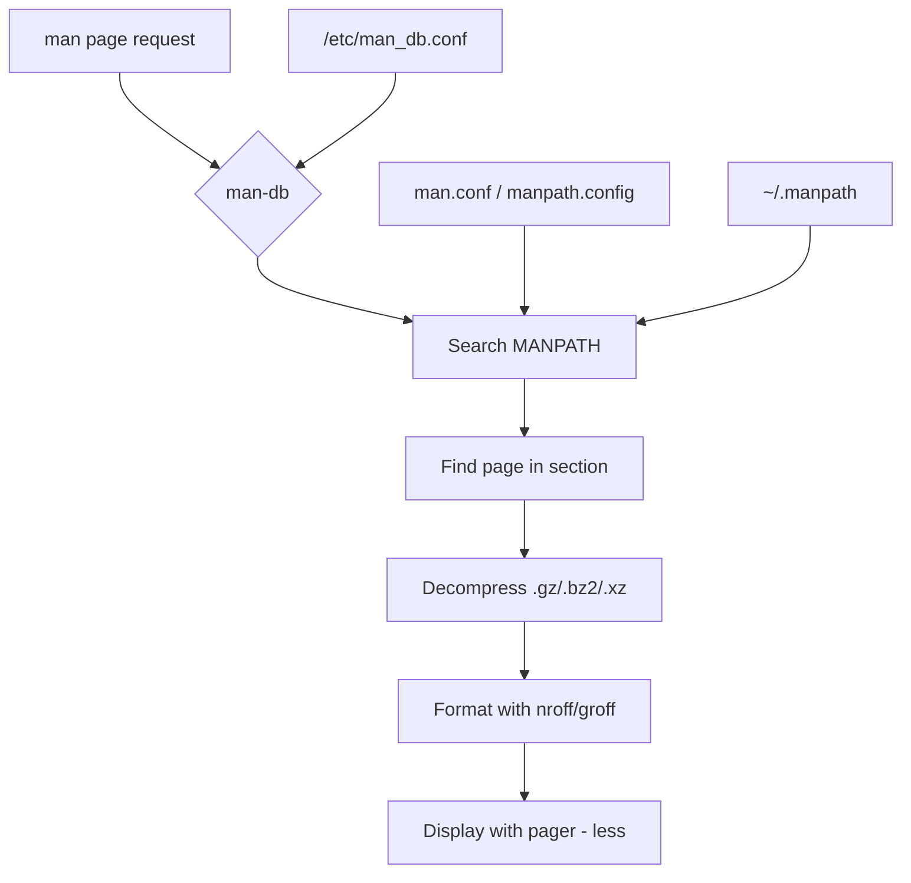

# Man Pages

Man pages (manual pages) are the standard form of documentation on Unix and Linux systems.
Every installed command, system call, library function, configuration file, and kernel interface
has a corresponding man page. This chapter explains the man page system, its sections,
and how to use them effectively.

---

## Introduction

The `man` command is the primary interface for reading documentation on Linux. Man pages are
stored as formatted text files (or nroff source) and organized into numbered sections. They
provide concise, authoritative reference information — not tutorials, but definitive descriptions
of how things work.



---

## Man Page Sections

Man pages are divided into numbered sections. Each section covers a specific category of documentation.

### Section Overview

| Section | Contents | Examples |
|---------|----------|----------|
| 1 | User commands (executables) | `ls(1)`, `gcc(1)`, `python3(1)` |
| 2 | System calls (kernel interfaces) | `open(2)`, `fork(2)`, `mmap(2)` |
| 3 | Library functions (C library) | `printf(3)`, `malloc(3)`, `pthread_create(3)` |
| 4 | Special files (devices) | `null(4)`, `random(4)`, `tty(4)` |
| 5 | File formats and conventions | `passwd(5)`, `fstab(5)`, `crontab(5)` |
| 6 | Games | `sl(6)`, `fortune(6)` |
| 7 | Miscellaneous (overview, conventions) | `man(7)`, `ascii(7)`, `signal(7)`, `tcp(7)` |
| 8 | System administration commands | `mount(8)`, `iptables(8)`, `fdisk(8)` |
| 9 | Kernel routines (non-standard) | Kernel API documentation |

> **Note:** Section 9 is not present on all systems. Some distributions use "9" for kernel
> documentation, while others place kernel docs in the source tree only.

### Section Details

#### Section 1 — User Commands

Everyday commands that users run from the shell. This is the largest section.

```bash
# Read the man page for ls
man 1 ls
# or simply
man ls

# List all section 1 pages
man -k . -s 1 | head -20
```

**Essential Section 1 pages:**

| Page | Description |
|------|-------------|
| `bash(1)` | GNU Bourne-Again Shell |
| `ls(1)` | List directory contents |
| `grep(1)` | Print lines matching a pattern |
| `find(1)` | Search for files in a directory hierarchy |
| `sed(1)` | Stream editor for filtering and transforming text |
| `awk(1)` | Pattern scanning and processing language |
| `ssh(1)` | OpenSSH client |
| `git(1)` | The stupid content tracker |
| `vim(1)` | Vi IMproved text editor |
| `python3(1)` | Python interpreter |
| `gcc(1)` | GNU Compiler Collection |
| `make(1)` | Build automation tool |
| `curl(1)` | Transfer data from or to a server |
| `tar(1)` | Tape archive utility |
| `systemctl(1)` | Control the systemd system and service manager |

#### Section 2 — System Calls

Interfaces provided by the Linux kernel to user-space programs. These are the entry points
into the kernel documented in the [Syscall Table](syscall-table.md).

```bash
# Read about the open system call
man 2 open

# Find all system calls related to memory
man -k memory -s 2
```

**Essential Section 2 pages:**

| Page | Description |
|------|-------------|
| `open(2)` | Open and possibly create a file |
| `read(2)` | Read from a file descriptor |
| `write(2)` | Write to a file descriptor |
| `close(2)` | Close a file descriptor |
| `fork(2)` | Create a child process |
| `execve(2)` | Execute a program |
| `mmap(2)` | Map files or devices into memory |
| `ioctl(2)` | Control device |
| `socket(2)` | Create an endpoint for communication |
| `connect(2)` | Initiate a connection on a socket |
| `epoll_wait(2)` | Wait for an epoll event |
| `clone(2)` | Create a child process (low-level) |
| `ioctl(2)` | Control device |
| `ptrace(2)` | Process trace (debugging) |
| `seccomp(2)` | Operate on Secure Computing state |

#### Section 3 — Library Functions

C library functions and other library APIs.

```bash
# Read about printf
man 3 printf

# Find pthread functions
man -k pthread -s 3
```

**Essential Section 3 pages:**

| Page | Description |
|------|-------------|
| `printf(3)` | Formatted output conversion |
| `malloc(3)` | Allocate and free dynamic memory |
| `pthreads(7)` | POSIX threads overview |
| `pthread_create(3)` | Create a new thread |
| `dlopen(3)` | Open a shared library |
| `getaddrinfo(3)` | Network address and service translation |
| `regex(3)` | POSIX regex functions |
| `signal(2)` | ANSI C signal handling |
| `stdio(3)` | Standard I/O library |
| `stdlib(3)` | Standard library functions |
| `string(3)` | String operations |

#### Section 4 — Special Files

Device files and special kernel interfaces in `/dev/`.

```bash
# Read about the null device
man 4 null

# Read about tty devices
man 4 tty
```

**Essential Section 4 pages:**

| Page | Description |
|------|-------------|
| `null(4)` | The null device — discards all writes, returns EOF on read |
| `zero(4)` | The zero device — returns zero bytes |
| `random(4)` | Kernel random number source |
| `tty(4)` | Controlling terminal |
| `console(4)` | Console terminal device |
| `loop(4)` | Loop devices |
| `sd(4)` | SCSI disk devices |
| `mem(4)` | System memory |
| `random(4)` | Random number generator |
| `urandom(4)` | Unreliable random number generator |

#### Section 5 — File Formats

Configuration file formats and data file specifications.

```bash
# Read about the fstab format
man 5 fstab

# Read about the passwd file format
man 5 passwd
```

**Essential Section 5 pages:**

| Page | Description |
|------|-------------|
| `fstab(5)` | Static filesystem information |
| `passwd(5)` | Password file |
| `group(5)` | Group file |
| `shadow(5)` | Shadow password file |
| `crontab(5)` | Cron table format |
| `sysctl.conf(5)` | Sysctl configuration |
| `resolv.conf(5)` | Resolver configuration |
| `ssh_config(5)` | SSH client configuration |
| `sshd_config(5)` | SSH daemon configuration |
| `proc(5)` | Process information pseudo-filesystem |
| `systemd.unit(5)` | Unit file configuration |
| `nsswitch.conf(5)` | Name service switch configuration |
| `modules(5)` | Loadable kernel module list |
| `hostname(5)` | Hostname configuration |
| `hosts(5)` | Hostname resolution |

#### Section 6 — Games

```bash
# List available games
man -k . -s 6
```

This section is often empty on minimal installations. Common entries: `sl(6)` (steam locomotive),
`fortune(6)`, `banner(6)`.

#### Section 7 — Overviews and Conventions

Conceptual overviews, protocol descriptions, and conventions. This section is invaluable
for understanding Linux internals.

```bash
# Read about signals
man 7 signal

# Read about TCP
man 7 tcp
```

**Essential Section 7 pages:**

| Page | Description |
|------|-------------|
| `man(7)` | Conventions for man pages |
| `signal(7)` | Overview of signals |
| `tcp(7)` | TCP protocol |
| `udp(7)` | UDP protocol |
| `ip(7)` | Linux IPv4 protocol implementation |
| `unix(7)` | UNIX domain sockets |
| `socket(7)` | Linux socket interface |
| `pipe(7)` | Overview of pipes and FIFOs |
| `pthreads(7)` | POSIX threads |
| `capabilities(7)` | Linux capability system |
| `namespaces(7)` | Linux namespaces overview |
| `cgroups(7)` | Linux control groups |
| `ascii(7)` | ASCII character set |
| `utf-8(7)` | UTF-8 multibyte encoding |
| `hostname(7)` | Hostname resolution description |
| `arp(7)` | Linux ARP implementation |
| `inotify(7)` | File system event monitoring |

#### Section 8 — System Administration Commands

Commands typically run by the root user or system administrators.

```bash
# Read about mount
man 8 mount

# Read about iptables
man 8 iptables
```

**Essential Section 8 pages:**

| Page | Description |
|------|-------------|
| `mount(8)` | Mount a filesystem |
| `umount(8)` | Unmount a filesystem |
| `fdisk(8)` | Partition table manipulator |
| `mkfs(8)` | Build a Linux filesystem |
| `iptables(8)` | IPv4/IPv6 packet filter and NAT |
| `nft(8)` | nftables administration tool |
| `systemd(1)` | The systemd system and service manager |
| `sshd(8)` | OpenSSH daemon |
| `lvm(8)` | LVM2 tools |
| `mdadm(8)` | Manage MD devices (RAID) |
| `useradd(8)` | Create a new user |
| `usermod(8)` | Modify a user account |
| `sysctl(8)` | Configure kernel parameters at runtime |
| `tcpdump(8)` | Dump traffic on a network |
| `dmesg(8)` | Print or control the kernel ring buffer |

---

## How to Read Man Pages

### Page Structure

Every man page follows a standard structure:

```
COMMAND(Section)    System Manual    COMMAND(Section)

NAME
    command - brief description

SYNOPSIS
    command [OPTION]... [FILE]...

DESCRIPTION
    Detailed explanation of what the command does.

OPTIONS
    -a, --all
        Description of this option.

EXAMPLES
    Examples of common usage.

EXIT STATUS
    0   Success
    1   Error

FILES
    /etc/configuration    Configuration file

SEE ALSO
    related-command(1)

AUTHORS
    The authors of the command.

BUGS
    Known bugs and limitations.
```

### Navigation Commands

While viewing a man page (using `less` as pager):

| Key | Action |
|-----|--------|
| `Space` / `Page Down` | Next page |
| `b` / `Page Up` | Previous page |
| `j` / `↓` | Next line |
| `k` / `↑` | Previous line |
| `/pattern` | Search forward for pattern |
| `?pattern` | Search backward for pattern |
| `n` | Next search result |
| `N` | Previous search result |
| `g` | Go to beginning |
| `G` | Go to end |
| `q` | Quit |

### Finding Man Pages

```bash
# Search for a keyword in all man pages
man -k "network interface"
# Equivalent to:
apropos "network interface"

# Search in a specific section
man -k "socket" -s 2

# Find the exact file location of a man page
man -w ssh
# Output: /usr/share/man/man1/ssh.1.gz

# List all man page paths
man --path
# Output: /usr/local/man:/usr/local/share/man:/usr/share/man

# Open a specific section when pages exist in multiple sections
man 2 write      # System call
man 1 write      # User command (if exists)
man 7 ascii      # Overview page
```

### Using the `whatis` Command

```bash
# Get a one-line description
whatis ls
# Output: ls (1) - list directory contents

whatis open
# Output: open (2) - open and possibly create a file or device
#         open (1p) - open files

# Multiple pages
whatis printf malloc fork
```

### Man Page Aliases and Cross-References

Man pages frequently reference other pages:

```bash
# Follow a cross-reference (in the pager)
# When you see open(2), you can read it with:
man 2 open

# The SEE ALSO section lists related pages
# Example from ls(1):
# SEE ALSO
#     stat(1), find(1), chmod(1), stat(2), readdir(3)
```

---

## Man Page Sources and Storage

### File Locations

```
/usr/share/man/          # System man pages
├── man1/                # Section 1 — User commands
├── man2/                # Section 2 — System calls
├── man3/                # Section 3 — Library functions
├── man4/                # Section 4 — Special files
├── man5/                # Section 5 — File formats
├── man6/                # Section 6 — Games
├── man7/                # Section 7 — Miscellaneous
├── man8/                # Section 8 — Admin commands
└── man9/                # Section 9 — Kernel routines

/usr/local/share/man/    # Locally installed man pages
/usr/src/linux/Documentation/  # Kernel documentation
~/.local/share/man/      # User-specific man pages
```

### Compression Formats

Man pages are stored compressed to save space:

```bash
# Check what format is used
ls /usr/share/man/man1/ | head -5
# ls.1.gz       — gzip compressed
# bash.1.gz     — gzip compressed

# Some systems use different compression
# .bz2 — bzip2
# .xz  — xz (better compression)
# .zst — zstd (fast, modern)
```

### Adding Custom Man Pages

```bash
# Add a directory to the man search path
export MANPATH=/opt/myapp/man:$MANPATH

# Or in /etc/man_db.conf
# MANDATORY_MANPATH /opt/myapp/man

# Create a man page from nroff source
mkdir -p /usr/local/share/man/man1
cp mycommand.1 /usr/local/share/man/man1/
gzip /usr/local/share/man/man1/mycommand.1

# Verify
man -w mycommand
```

---

## man-db Configuration

### Configuration File

The main configuration file is `/etc/man_db.conf`:

```bash
# View the configuration
cat /etc/man_db.conf
```

Key directives:

```
# MANDATORY_MANPATH — Always searched for man pages
MANDATORY_MANPATH   /usr/man
MANDATORY_MANPATH   /usr/share/man
MANDATORY_MANPATH   /usr/local/share/man

# MANPATH_MAP — Maps $PATH entries to man directories
MANPATH_MAP /bin            /usr/share/man
MANPATH_MAP /usr/bin        /usr/share/man
MANPATH_MAP /sbin           /usr/share/man
MANPATH_MAP /usr/sbin       /usr/share/man
MANPATH_MAP /usr/local/bin  /usr/local/share/man

# MANDB_MAP — Database cache location
MANDB_MAP /usr/share/man    /var/cache/man/fsstnd
```

### The man Database

man-db maintains a cache database for fast lookups:

```bash
# Rebuild the man database (required after adding new pages)
mandb
# or
sudo mandb

# Check database status
sudo mandb --status

# Purge old entries
sudo mandb --purge
```

### Environment Variables

| Variable | Purpose |
|----------|---------|
| `MANPATH` | Override default man page search path |
| `MANPAGER` | Override the pager (default: `less`) |
| `PAGER` | Fallback pager |
| `LESS` | Options passed to `less` |
| `LANG` / `LC_MESSAGES` | Language for man pages |
| `MANWIDTH` | Set display width for man pages |
| `MANROFFOPT` | Options passed to nroff/groff |
| `SYSTEM` | Restrict man page sections |

```bash
# Use a different pager
export MANPAGER="most"

# Set a specific width
export MANWIDTH=100

# Read man pages in a specific language
LANG=de_DE.UTF-8 man ls

# Display options for less
export LESS='-R -M --shift 5'
```

---

## Advanced Man Page Usage

### Formatting and Export

```bash
# Output man page as plain text
man ls | col -b > ls.txt

# Output as HTML (if man2html is installed)
man ls | man2html > ls.html

# Output as PDF
man -t ls | ps2pdf - ls.pdf

# Output as PostScript
man -t ls > ls.ps

# groff output
man -Tutf8 ls | head -20
```

### Section-Specific Searches

```bash
# Search only in system calls
man -s 2 -k read
# read (2) - read from a file descriptor
# readahead (2) - initiate file readahead
# readlinkat (2) - read value of a symbolic link
# readv (2) - read or write data into multiple buffers

# Search only in file formats
man -s 5 -k network
# hosts (5) - hostname resolution
# resolv.conf (5) - resolver configuration
# interfaces (5) — network interface configuration
```

### The `info` System

GNU tools prefer `info` pages over man pages:

```bash
# Read the info page for coreutils
info coreutils

# Read info page for a specific command
info ls

# In the info viewer:
#   n — next node
#   p — previous node
#   u — up one node
#   q — quit
#   ? — help

# Convert info to plain text
info ls --output=- | head -50
```

### Creating Man Pages

Man pages use the `troff`/`nroff` formatting language with the `man` macro package:

```nroff
.\" -*- nroff -*-
.TH MYCOMMAND 1 "2026-07-21" "mycommand 1.0" "User Commands"
.SH NAME
mycommand \- a sample command
.SH SYNOPSIS
.B mycommand
.RI [ OPTIONS ]
.IR file ...
.SH DESCRIPTION
.B mycommand
does something useful with
.IR file .
.TP
.BR \-a ", " \-\-all
Process all files.
.TP
.BR \-v ", " \-\-verbose
Enable verbose output.
.SH EXAMPLES
.nf
$ mycommand -a file.txt
Processing file.txt...
.fi
.SH SEE ALSO
.BR grep (1),
.BR find (1)
.SH AUTHORS
Written by Your Name.
.SH BUGS
Report bugs to <bugs@example.com>.
```

Compile and install:

```bash
# Test without installing
man ./mycommand.1

# Install
gzip mycommand.1
sudo cp mycommand.1.gz /usr/local/share/man/man1/

# Verify
man mycommand
```

---

## Essential Man Pages Reading List

For a Linux beginner, read these man pages in order:


---

## Cross-References

- [Commands Reference](commands.md) — Brief descriptions of 100+ commands
- [Syscall Table](syscall-table.md) — Section 2 system calls
- [Kernel Config](kernel-config.md) — Kernel configuration documentation
- [Glossary](glossary.md) — Definitions of terms used in man pages
- [Further Reading](further-reading.md) — Additional documentation resources

---

## Further Reading

- [The Linux Kernel Documentation](https://docs.kernel.org/)
- [LWN.net - Linux and free software news](https://lwn.net/)
- [GNU Project Documentation](https://www.gnu.org/doc/doc.html)
- [GNU Manuals](https://www.gnu.org/manual/manual.html)
- [Free Software Directory](https://directory.fsf.org/wiki/Main_Page)
- [Planet GNU](https://planet.gnu.org/)
- [Free Software Books](https://www.gnu.org/doc/other-free-books.html)

- [man(1) — Linux manual page for man itself](https://man7.org/linux/man-pages/man1/man.1.html)
- [man-db — The man-db project page](https://www.nongnu.org/man-db/)
- [Linux man pages online](https://man7.org/linux/man-pages/)
- [die.net man pages](https://linux.die.net/man/)
- [Ubuntu manpages](https://manpages.ubuntu.com/)
- [Kernel.org documentation](https://www.kernel.org/doc/man-pages/)
