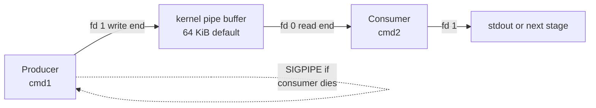
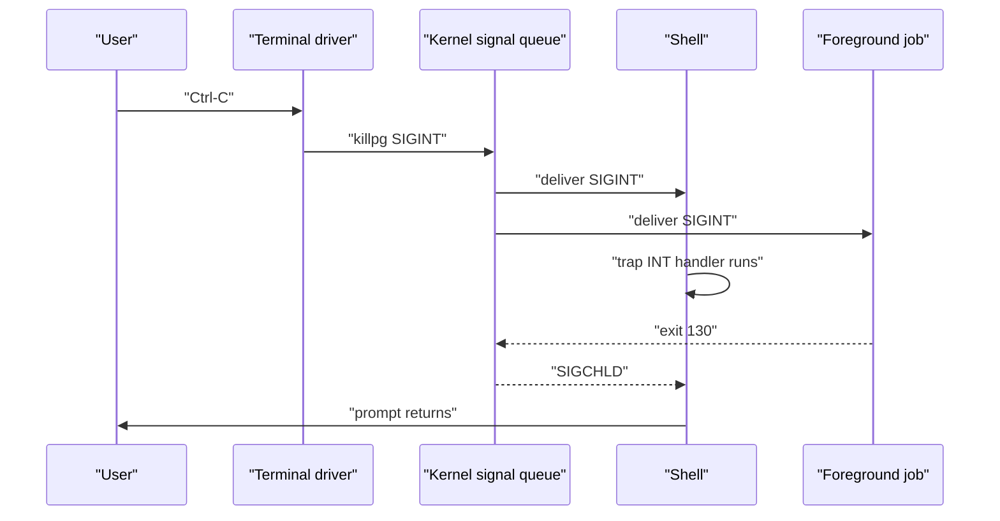
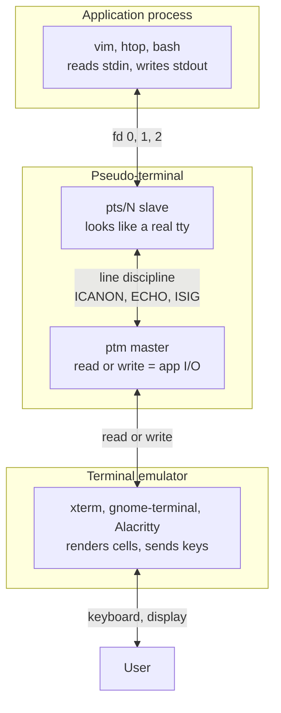
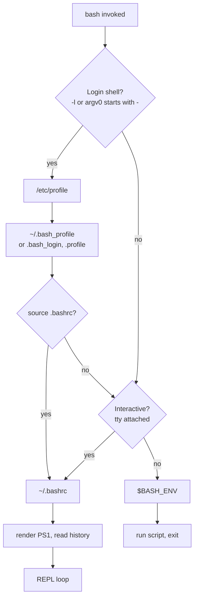

# Shell / Unix — Section Integrator

> *"The shell is both a command interpreter and a programming language. Like
> any language, it has syntax, semantics, and idioms — and like any tool, it
> rewards those who understand why it does what it does."* — William E.
> Shotts Jr., *The Linux Command Line*, 2nd ed., No Starch Press, 2019,
> Ch. 1.

This page is the **section-level integrator** for the *Shell / Unix*
group of topics in [Section 41 of the index](../index.md). The Linux
track already has dedicated chapters — [shell overview](./shell/overview.md),
[bash](./shell/bash.md), [zsh](./shell/zsh.md), [fish](./shell/fish.md),
[POSIX shell](./shell/posix-shell.md), [scripting](./shell/scripting-fundamentals.md),
[advanced scripting](./shell/scripting-advanced.md), [sed/awk](./shell/sed-awk.md),
[find](./shell/find.md), [grep](./shell/grep.md), [xargs](./shell/xargs.md),
[regex](./shell/regex.md) — so this page **does not duplicate** them. Its
job is to weave the cross-cutting concepts together: file descriptors,
expansion order, signal handling, terminal layers, startup-file load
order, and exit-code discipline.

> **Reading order.** [Shell Overview](./shell/overview.md) → [Bash](./shell/bash.md)
> → this page → per-feature chapters via cross-references. A typical
> interview question: *"a pipeline silently produces wrong output; how do
> you debug it?"* To answer you must reason about **fd plumbing**,
> **expansion order**, **`pipefail`**, and **`set -x`** — the spine below.

## 1. The shell landscape

Unix shells share a common ancestor (the Bourne shell, `sh`, 1977) but
have diverged on features, portability, and scripting ergonomics. The
POSIX.1-2017 *Shell and Utilities* volume (XCU) defines the portable
subset — everything else is an extension (Robbins & Beebe, *Classic
Shell Scripting*, O'Reilly 2005, Ch. 1).

| Shell   | Family      | Default on             | Notable features                                              | Scripting portability     |
|---------|-------------|------------------------|---------------------------------------------------------------|---------------------------|
| **bash**   | Bourne      | Most Linux distros, macOS ≤10.14 | Arrays, `[[ ]]`, process substitution, brace expansion       | GNU + POSIX baseline      |
| **zsh**    | Bourne-like | macOS ≥10.15, Kali     | Smart globbing, `**/*`, right prompt, `preexec`/`precmd` hooks | High; some bash incompat  |
| **fish**   | csh-inspired (new) | Some dev workstations | Syntax highlighting, autosuggestion — **not POSIX** | Low (deliberate)   |
| **dash**   | Bourne      | Debian/Ubuntu `/bin/sh` | Minimal, fast startup (~1 ms), POSIX only                     | Highest (POSIX reference) |
| **ksh93**  | Bourne      | AIX, Solaris (legacy)  | Associative arrays, FCSV, floating-point arithmetic           | High                      |

`/bin/sh` on Debian/Ubuntu is `dash` (POSIX-only), but `$SHELL` is
usually `bash` or `zsh`. `#!/bin/bash` won't run on FreeBSD (ships
`ash` as `/bin/sh`); `#!/usr/bin/env bash` is more portable. See
[POSIX shell](./shell/posix-shell.md).

## 2. File descriptors, redirection, pipelines

Every Unix process inherits three open file descriptors (fds) from its
parent: **0 = stdin**, **1 = stdout**, **2 = stderr**. The shell's
redirection operators manipulate these (and arbitrary higher-numbered
fds) by calling `dup2(2)` after `fork(2)` and before `execve(2)`. This
is the entire mechanism behind pipes, redirects, and process
substitution.

| Operator       | Effect                                                                  |
|----------------|-------------------------------------------------------------------------|
| `> file`       | Truncate `file`, redirect fd 1 to it                                    |
| `>> file`      | Append (`O_APPEND`), redirect fd 1                                      |
| `< file`       | Open `file` read-only, redirect fd 0                                    |
| `2> file`      | Redirect fd 2 (stderr)                                                  |
| `&> file`      | Bash/zsh: redirect both fd 1 and fd 2 (equiv. `> file 2>&1`)            |
| `m>&n` / `n>&-`| Duplicate fd `m` from fd `n` (e.g. `2>&1`) / close fd `n`               |
| `<<WORD`       | Here-document: feed body until a line equal to `WORD` on fd 0           |
| `<<<"str"`     | Here-string: feed `str` (+ newline) on fd 0                             |
| `<(cmd)` / `>(cmd)` | Process substitution: pass `/dev/fd/NN` whose content is `cmd`'s stdout (or write side) |
| `cmd1 | cmd2`  | Pipe: `pipe(2)` + `dup2`; `cmd1`'s fd 1 → `cmd2`'s fd 0                |

A pipeline is a chain of `pipe(2)` + `fork(2)` + `dup2(2)` calls: the
shell dup2's the write end onto the producer's fd 1 and the read end
onto the consumer's fd 0, then closes both ends in the parent. The
kernel holds exactly one reference to the write end inside the producer,
so the consumer's `read(2)` returns EOF when the producer exits — that
is how `head -n1 bigfile` short-circuits a streaming source.



Process substitution reads two producers as files:

```bash
diff <(ls dir1) <(ls dir2)            # diff two command outputs, no temp file
tee >(gzip > app.log.gz) > app.log    # write to compressed + plain log
cat <<'EOF'                           # quoted delimiter: no expansion inside
$HOME stays literal
EOF
grep ERROR <<<"ERROR: bad input"      # here-string
```

> **Interview trap.** `cmd 2>&1 > file` does **not** put stderr into `file`.
> Redirections are processed left-to-right: first fd 2 is dup'd to wherever
> fd 1 currently points (the terminal), then fd 1 is redirected to `file`.
> The correct idiom is `cmd > file 2>&1` or, in bash ≥4, `cmd &> file`.

## 3. Expansion pipeline

Before a command runs, the shell rewrites the words on the line through a
fixed sequence of expansions. Bash applies them in this order (bash
manual §3.5; Robbins & Beebe, Ch. 4):

| #  | Expansion             | Trigger                    | Example                                  |
|----|-----------------------|----------------------------|------------------------------------------|
| 1  | Brace                 | `{a,b}`, `{1..5}`          | `echo file{1..3}.txt` → `file1.txt file2.txt file3.txt` |
| 2  | Tilde                 | `~` or `~user`             | `cd ~root`                               |
| 3  | Parameter & variable  | `$VAR`, `${VAR:-x}`        | `${PATH:-/bin}`                          |
| 4  | Arithmetic            | `$(( ))`                   | `echo $((2 ** 10))` → `1024`             |
| 5  | Command substitution  | `$( )` or `` ` ` ``        | `now=$(date +%s)`                        |
| 6  | Process substitution  | `<( )`, `>( )`             | `wc -l <(find . -type f)`                |
| 7  | Word splitting        | (results of 3–5, unquoted) | `for x in $LIST; do ...`                 |
| 8  | Pathname (globbing)   | `*`, `?`, `[abc]`, `**`    | `ls *.md`                                |
| 9  | Quote removal         | strip quotes               | `"a b"` → `a b`                          |

The two surprises are **brace expansion** (step 1 — runs *before* any
variable is touched, so `echo {$a,$b}` does not expand `$a`/`$b` as
alternatives) and **word splitting** (step 7 — only the results of
parameter, arithmetic, command, and process substitution are split on
`IFS`). The corollary is the cardinal shell-safety rule: **quote every
expansion**.

```bash
file="my report.txt"
ls $file        # ls my report.txt  →  ls: cannot access 'my'  (word-split!)
ls "$file"      # ls "my report.txt"  →  one argument, safe
```

`**` (recursive glob) is a bash extension (`shopt -s globstar`) and zsh native.

## 4. Parameter expansion, arrays, command substitution

Parameter expansion is the Swiss-army knife of shell string manipulation.
Bash (and zsh) extend the POSIX subset with patterns, lengths, and
substitution. Arrays in bash are sparse, integer-indexed; associative
arrays need `declare -A`. Command substitution captures a subshell's
stdout — `` `cmd` `` is the legacy Bourne form, `$(cmd)` is preferred
because it nests cleanly:

```bash
path=/etc/nginx/conf.d/site.conf
: "${EDITOR:=vim}"          # assign if unset/empty
echo "${USER:-guest}"       # 'guest' if unset/empty
echo "${#path}"             # length: 30
echo "${path##*/}"          # longest prefix */  → site.conf  (basename)
echo "${path%/*}"           # shortest suffix /*  → .../conf.d  (dirname)
echo "${path%.*}"           # shortest suffix .*  → .../site  (strip ext)
echo "${path//\//-}"        # replace all / with -
echo "${path^^}"            # uppercase (bash 4+)

arr=(red green blue); arr[10]=late              # sparse indexed array
echo "${arr[1]}"  "${#arr[@]}"  "${!arr[@]}"   # green, 4, '0 1 2 10'

declare -A count                               # associative array (bash 4+)
while IFS= read -r w; do (( count[$w]++ )); done < words.txt
for w in "${!count[@]}"; do printf '%4d %s\n' "${count[$w]}" "$w"; done | sort -rn

echo "today is $(date)"
lines=$(wc -l < "$(find . -name '*.c' | head -1)")   # nested substitution
```

## 5. Signals, traps, and job control

Signals are asynchronous notifications delivered by the kernel to a
process. The shell intercepts some (`SIGINT` from Ctrl-C aborts the
line; `SIGTSTP` from Ctrl-Z suspends the foreground job) and lets
scripts trap others. Parker, *Shell Scripting: Expert Recipes* (Wrox,
2011, Ch. 11) emphasizes that a robust script always declares its
signal policy — the default disposition is rarely what you want for
cleanup.

| Signal    | # (x86) | Default action | Typical trigger                  |
|-----------|---------|----------------|----------------------------------|
| `SIGHUP`  | 1       | terminate      | Terminal hangup; daemons reload config |
| `SIGINT`  | 2       | terminate      | Ctrl-C                            |
| `SIGQUIT` | 3       | core dump      | Ctrl-\                            |
| `SIGKILL` | 9       | terminate      | `kill -9` — **cannot be caught, blocked, or ignored** |
| `SIGTERM` | 15      | terminate      | `kill` default; polite exit request |
| `SIGSTOP` | 19      | stop           | Kernel stop; cannot be caught     |
| `SIGTSTP` | 20      | stop           | Ctrl-Z (terminal driver)          |
| `SIGCONT` | 18      | resume         | `fg`/`bg` after stop              |
| `SIGPIPE` | 13      | terminate      | Write to a pipe with no reader    |
| `SIGCHLD` | 17      | ignored        | Child state change                |

`SIGKILL` (9) and `SIGSTOP` (19) are the only two the kernel handles
directly — they bypass the process's signal-handler table, so `kill -9`
gives the process no chance to flush buffers, close fds, or remove temp
files. Always try `SIGTERM` first.

```bash
cleanup() { rm -f "$TMPFILE"; echo "cleaned up" >&2; }
trap cleanup EXIT INT TERM    # run on normal exit, Ctrl-C, or SIGTERM
TMPFILE="$(mktemp)"
# ... main work ...
```

`trap` is the user-space hook into the kernel's per-process
signal-disposition table (`task_struct->signal->action[]`). When a
trapped signal arrives, the kernel queues it and the next return to user
space runs the handler. `trap '' INT` ignores `SIGINT`; `trap - INT`
restores the default. Detail: [signals](../os/processes/ipc-signals.md).



Job control is the shell's bookkeeping layer over `waitpid(2)`,
`setpgid(2)`, and `tcsetpgrp(2)`. Each pipeline becomes one **process
group**; the terminal's foreground group decides who receives Ctrl-C / Ctrl-Z.

```bash
sleep 1000 &          # background, prints [1] PID
sleep 500 | grep x    # foreground pipeline
^Z                    # Ctrl-Z → SIGTSTP → stopped, shell resumes
bg %1; jobs -l; fg %1; disown -h %1; kill %1
```

## 6. Terminals: TTY, PTY, terminfo

A "terminal" today is three layers stacked, and confusion between them is the
source of most "why does my output look weird" bugs:



A real hardware TTY (`/dev/ttyS0`, `/dev/tty1`) is a UART plus a kernel
**line discipline** (`n_tty`) implementing canonical mode, echo, and the
Ctrl-C / Ctrl-Z / Ctrl-\ signal shortcuts. A **pseudo-terminal** (PTY)
splits this into a slave (`/dev/pts/N`, presented to the application)
and a master (`/dev/ptmx`, held by the terminal emulator or sshd).
`openpty(3)`, `forkpty(3)`, and the modern `TIOCGPTPEER` ioctl are how
xterm, tmux, screen, sshd, and `script(1)` create that pair.

Terminals vary in capabilities; two databases describe them: **termcap**
(BSD) and **terminfo** (System V, compiled binary, what ncurses uses).
Programs look up `$TERM`, read the matching terminfo entry via
`setupterm(3)`, and emit escape sequences through `tput` / `tigetstr`
(`tput cup 5 10`, `infocmp xterm-256color`). If `tput colors` returns 8
in a 256-color terminal, `$TERM` is wrong.

## 7. Startup files and prompt customization

Which file is read on shell startup depends on three flags: **login** vs
non-login, **interactive** vs non-interactive, and the shell family.
Getting this wrong is why an alias works in one terminal and not another:

| File                    | Shell       | Loaded when                                  | Typical contents                          |
|-------------------------|-------------|----------------------------------------------|-------------------------------------------|
| `/etc/profile`          | sh, bash    | Login shell, first                           | System-wide `PATH`, umask, locales        |
| `~/.bash_profile`       | bash        | Login shell (first found of this, `.bash_login`, `.profile`) | Per-user `PATH`, then `source ~/.bashrc` |
| `~/.profile`            | sh, bash, dash | Login shell, fallback if neither bash file exists | Portable: works under dash too        |
| `~/.bashrc`             | bash        | Interactive non-login shell (and any shell if sourced) | Aliases, functions, prompt, completions |
| `~/.zshrc`              | zsh         | Interactive shell (login or not)             | The zsh equivalent of .bashrc             |
| `~/.zprofile`           | zsh         | Login shell, before `.zshrc`                 | Login-time setup                          |
| `$BASH_ENV`             | bash        | Non-interactive bash (script execution)      | Path to a file sourced before each script |
| `~/.bash_logout`        | bash        | Login shell exit                             | Cleanup, history sync                     |

The standard idiom: aliases, functions, and prompt go in `~/.bashrc`;
`~/.bash_profile` sources it (`[ -f ~/.bashrc ] && . ~/.bashrc`) so
login shells see the same setup; keep `~/.profile` minimal so it works
under `dash`.



The prompt strings `PS1`–`PS4` control different prompts: `PS1` primary,
`PS2` continuation, `PS3` `select` menu, `PS4` prefix under `set -x`.
The `\[ \]` markers wrap non-printing escape codes so Readline's column
count stays correct.

```bash
parse_git_branch() { git branch 2>/dev/null | sed -n 's/^\* / /p'; }
PS1='\[\e[33m\]$?\[\e[0m\] \[\e[36m\]\u@\h\[\e[0m\] \w\[\e[32m\]$(parse_git_branch)\[\e[0m\]\$ '
export PS1
```

## 8. History, completions, aliases, functions

History is an in-memory ring buffer flushed to `$HISTFILE` on exit (or
on each command if `PROMPT_COMMAND` calls `history -a`). Tune it via
`HISTSIZE`/`HISTFILESIZE` (counts), `HISTCONTROL=ignoreboth:erasedups`
(skip duplicates), `HISTTIMEFORMAT` (timestamps), and `shopt -s
histappend` (append on exit).

The classic history expansions:

| Token        | Meaning                                                |
|--------------|--------------------------------------------------------|
| `!!`         | Previous command                                       |
| `!-n`        | `n` commands ago                                       |
| `!string`    | Most recent command starting with `string`             |
| `!?string?`  | Most recent command containing `string`                |
| `!$`         | Last word of the previous command                      |
| `!^`         | First word of the previous command                     |
| `!n:m`       | Word `m` of command `n` (0 = command name)             |
| `!!:gs/old/new/` | Global replace `old` with `new` in previous command |

```bash
$ mv site.conf site.conf.bak
$ vim !$              # vim site.conf.bak
$ !! | wc -l          # pipe previous command's output through wc
```

In zsh the equivalent tokens work plus `up-line-or-search`; in fish,
history is replaced by an autosuggestion engine. **Completions** are
programmable: `bash-completion` ships handlers for hundreds of commands,
and `complete`/`compgen` let you add your own. zsh's `compinit`/`compdef`
is more powerful (typed completions, menu descriptions); fish has
completion as a first-class feature.

```bash
_ssh_hosts() {
  local cur=${COMP_WORDS[COMP_CWORD]}
  COMPREPLY=( $(compgen -W "$(awk '/^Host /{print $2}' ~/.ssh/config)" -- "$cur") )
}
complete -F _ssh_hosts ssh
```

**Aliases** are simple text substitutions that happen *before* most
expansions; **functions** are real callables with their own argument list
and local scope. Alias expansion is disabled inside scripts by default
(`expand_aliases` shopt), so use functions for anything reusable:

```bash
alias ll='ls -lah --color=auto'   # alias: good for short flags
mkcd() { mkdir -p -- "$1" && cd -P -- "$1"; }      # function: takes args
extract() {                                        # function: control flow
  case "$1" in
    *.tar.gz|*.tgz) tar xzf "$1" ;;
    *.zip)          unzip "$1" ;;
    *) echo "unknown: $1" >&2; return 1 ;;
  esac
}
```

## 9. Exit codes, `set -e`, and pipeline discipline

Every command returns an 8-bit exit status visible in `$?`: **0 = success**,
**1–125** normal failure, **126** found-but-not-executable, **127**
command-not-found, **128 + n** killed by signal `n` (so `Ctrl-C` → 130,
`kill -9` → 137). A robust script declares its error policy at the top:

```bash
#!/usr/bin/env bash
set -euo pipefail
# set -e:         exit on any command failure
# set -u:         error on unset variable expansion
# set -o pipefail: pipeline status = rightmost non-zero (default is leftmost — hides failures!)
```

`set -e` has well-known traps (bash manual §4.3.2): it does **not** trigger
on commands in `if`, `while`, `||`, `&&`, or whose status is consumed by
`!`. The defensive pattern is to test explicitly, and for long pipelines to
inspect `PIPESTATUS` — bash's array of per-stage statuses:

```bash
if ! out=$(curl -fsS "$url"); then printf 'fetch failed\n' >&2; exit 1; fi

tar -cf - src | gzip -9 > src.tgz
statuses=("${PIPESTATUS[@]}")
[[ ${statuses[0]} -eq 0 ]] || { echo "tar failed";  exit 1; }
[[ ${statuses[1]} -eq 0 ]] || { echo "gzip failed"; exit 1; }
```

A common CI footgun: `set -e` does not catch failures inside command
substitution that are themselves inside an assignment (`x=$(false)` is
silent in bash 4.x). The portable fix is explicit checks, plus running
`shellcheck` and `shfmt` on every script.

## 10. Cron, systemd timers, and the broader Unix toolset

Two execution contexts for shell scripts silently change the environment:
**cron** and **systemd** — minimal `$PATH`, unset `$TERM`, no tty.
That's why scripts that "work fine in my shell" fail in production.

```cron
# crontab -e — every weekday at 06:30
SHELL=/bin/dash
PATH=/usr/local/sbin:/usr/local/bin:/usr/sbin:/usr/bin:/sbin:/bin
MAILTO=ops@example.com
30 6 * * 1-5  /usr/local/bin/backup.sh >> /var/log/backup.log 2>&1
```

Systemd units supersede cron for new code (journald logging, dependency
ordering, cgroup resource limits, sub-second `OnCalendar=` triggers). A
`.timer` + `.service` pair is the modern replacement — `OnCalendar=Mon..Fri
06:30`, `Persistent=true`, `WantedBy=timers.target`. See
[systemd](./admin/systemd.md).

The classic Unix text tools — `awk`, `sed`, `grep`, `find`, `xargs` —
are the load-bearing layer above pipelines. Peek et al., *Unix Power
Tools* (3rd ed., O'Reilly, 2002) is still the best tour of their
composition. Each has a chapter: [sed/awk](./shell/sed-awk.md), [find](./shell/find.md),
[grep](./shell/grep.md), [xargs](./shell/xargs.md), [regex](./shell/regex.md).

## 11. Interview questions

1. **Why does `cmd 2>&1 > file` put stderr on the terminal, not in `file`?**
   Redirections apply left-to-right: first fd 2 is dup'd to fd 1's *current*
   target (the terminal), then fd 1 is redirected to `file`. The correct
   form is `cmd > file 2>&1` or `cmd &> file`.
2. **What does `set -euo pipefail` do, and what does it *not* catch?** `-e`
   aborts on the first failing command (but not ones in `if`, `||`, `&&`);
   `-u` errors on unset variables; `pipefail` makes a pipeline's exit
   status the rightmost non-zero. It does not catch failures inside command
   substitution in older bash, nor async subprocesses.
3. **Why can you not trap `SIGKILL` (9) or `SIGSTOP` (19)?** These two are
   handled entirely in the kernel's signal-delivery path; the process's
   `sigaction` table is never consulted. By design — `SIGKILL` must always
   work so admins can terminate a stuck or hostile process.
4. **Order the bash expansions.** Brace → tilde → parameter → arithmetic →
   command substitution → process substitution → word splitting → pathname
   expansion → quote removal. Brace expansion runs *before* variables, so
   `echo {$a,$b}` does not work the way a beginner expects.
5. **A pipeline `cmd1 | cmd2 | cmd3` silently produces wrong output. How do
   you debug it?** Add `set -o pipefail` and inspect `${PIPESTATUS[@]}`.
   Insert `tee /dev/stderr` between stages. Use `set -x` to trace each
   command. Verify a stage is not consuming the next stage's stdin.
6. **Why does `kill -9` leave temp files and broken sockets behind?**
   `SIGKILL` cannot be trapped, so cleanup handlers registered via `trap`
   never run. The process is reaped immediately by the kernel. Always try
   `SIGTERM` first and give the process a grace period.
7. **What is the difference between a TTY and a PTY, and why does ssh need
   one?** A real TTY is a hardware UART + the kernel's `n_tty` line
   discipline. A PTY is a *pair* of devices (master `ptmx`, slave `pts/N`)
   that emulates a TTY so non-hardware programs (xterm, sshd, tmux, script)
   can drive a full-screen application. sshd needs a PTY so `vim` and `top`
   behave interactively.
8. **Your alias works in one terminal but not another. Why?** Aliases live
   in `~/.bashrc`, read by interactive *non-login* shells. A login shell
   (ssh in) reads `~/.bash_profile` and will miss the alias unless it
   explicitly sources `~/.bashrc`. A script run as `bash script.sh` reads
   neither — aliases are disabled by default in non-interactive bash.

## 12. Further reading

Primary sources:

- William E. Shotts Jr., *The Linux Command Line*, 2nd ed., No Starch
  Press, 2019.
- Arnold Robbins & Nelson H. F. Beebe, *Classic Shell Scripting*, O'Reilly, 2005.
- Steve Parker, *Shell Scripting: Expert Recipes for Linux, Bash, and More*, Wrox / Wiley, 2011.
- Jerry Peek, Shelley Powers, Tim O'Reilly, Mike Loukides, et al., *Unix Power
  Tools*, 3rd ed., O'Reilly, 2002.
- [Bash Reference Manual](https://www.gnu.org/software/bash/manual/),
  [POSIX.1-2017 XCU](https://pubs.opengroup.org/onlinepubs/9699919799/utilities/contents.html),
  [Linux man-pages](https://man7.org/linux/man-pages/) (`signal(7)`, `pty(7)`,
  `termios(3)`, `terminfo(5)`, `pipe(2)`, `dup2(2)`, `fork(2)`, `waitpid(2)`).
- [shellcheck](https://www.shellcheck.net/) and [shfmt](https://github.com/mvdan/sh) — lint and format every script.

Cross-references: [shell overview](./shell/overview.md), [bash](./shell/bash.md), [zsh](./shell/zsh.md),
[fish](./shell/fish.md), [POSIX shell](./shell/posix-shell.md), [scripting](./shell/scripting-fundamentals.md),
[advanced scripting](./shell/scripting-advanced.md), [sed/awk](./shell/sed-awk.md), [find](./shell/find.md),
[grep](./shell/grep.md), [xargs](./shell/xargs.md), [regex](./shell/regex.md), [Linux tools](./tools.md),
[Linux internals](./internals.md), [OS § signals](../os/processes/ipc-signals.md), [OS § terminals](../os/io/README.md).
