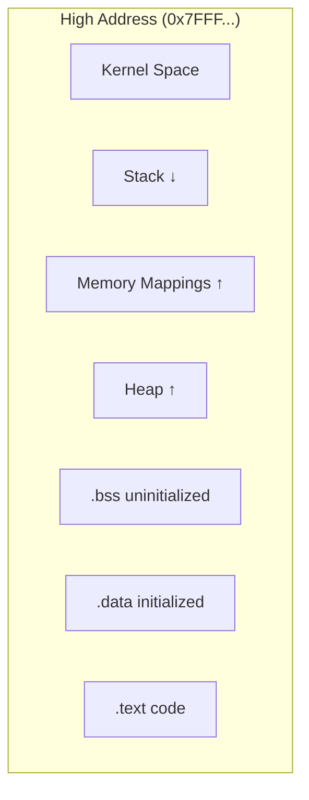
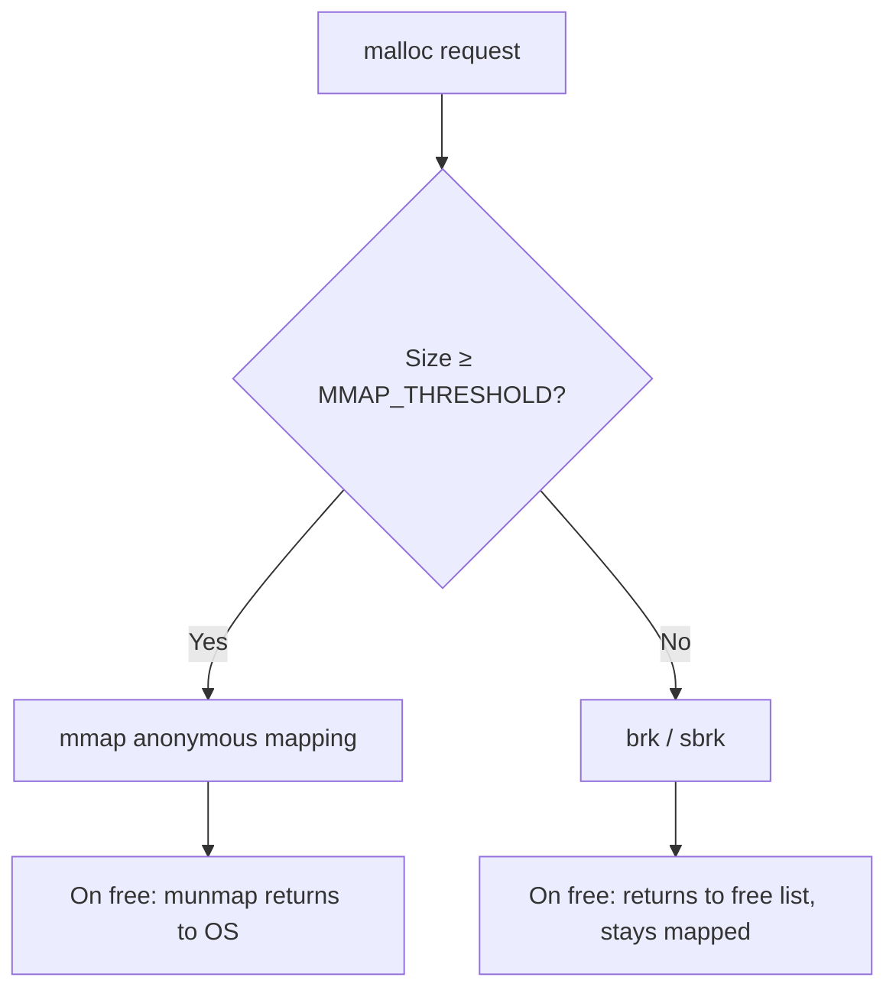
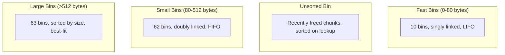
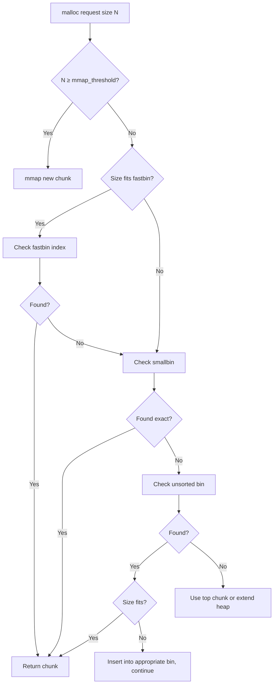
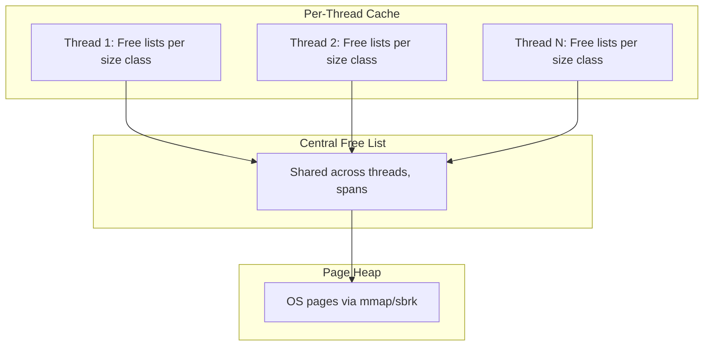
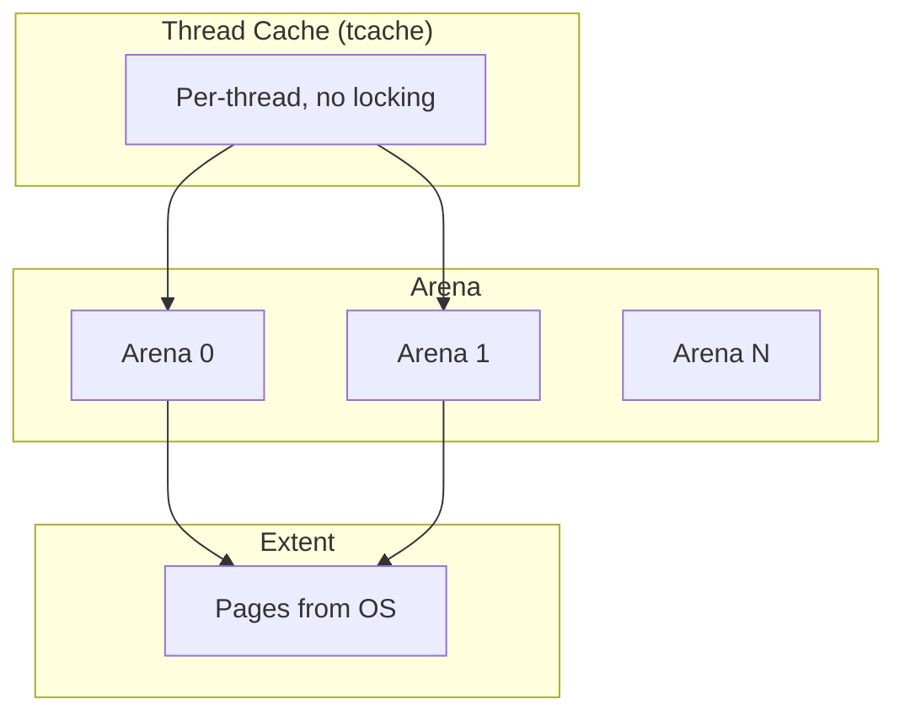
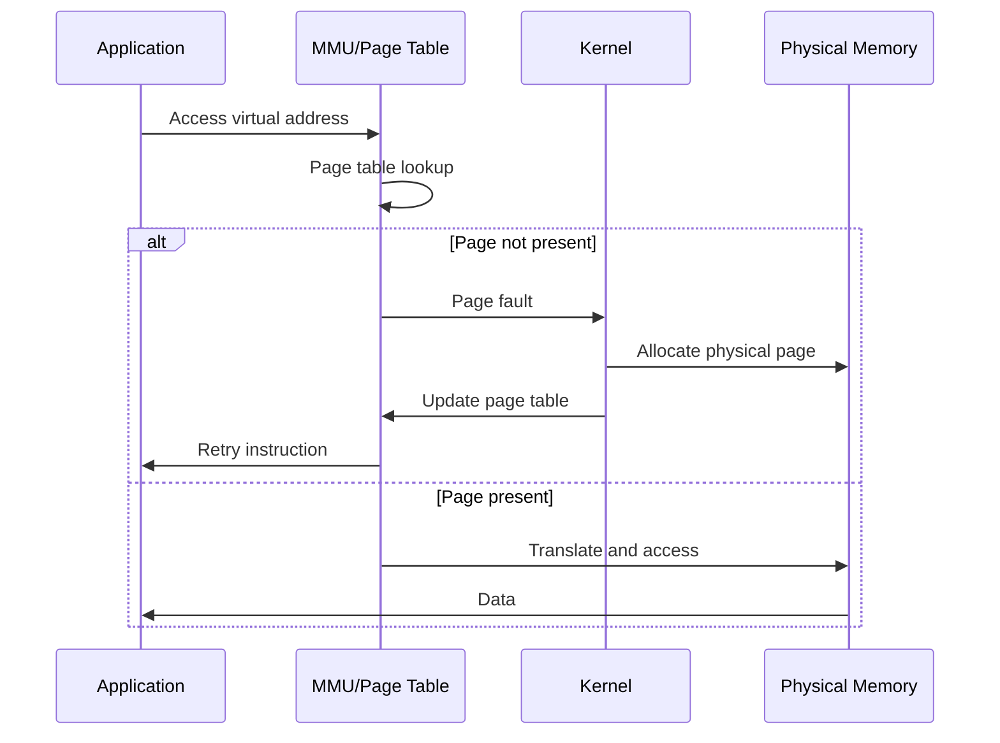
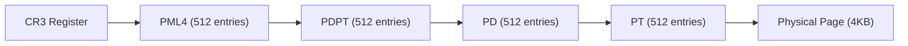

# User-Space Memory Management

## Introduction

Understanding how user-space programs allocate, manage, and release memory is critical for writing efficient C/C++ applications. This chapter covers the kernel interfaces (`brk`, `mmap`), the C library's `malloc` implementation, and high-performance allocators like tcmalloc and jemalloc.

## Linux Memory Layout

Every Linux process has a virtual address space with a standard layout:



On x86-64, the canonical layout is:

| Region | Direction | Typical Address |
|---|---|---|
| `.text` (code) | Fixed | `0x400000` |
| `.data` / `.bss` | Fixed | Above `.text` |
| Heap (`brk`) | Grows up ↑ | Just above `.bss` |
| mmap region | Grows down ↓ | High address area |
| Stack | Grows down ↓ | Near `0x7FFF...` |

```bash
# Inspect process memory layout
cat /proc/self/maps
# Output example:
# 00400000-0048c000 r-xp 00000000 08:01 131074   /usr/bin/cat
# 0068c000-0068d000 r--p 0008c000 08:01 131074   /usr/bin/cat
# 0068d000-0068e000 rw-p 0008d000 08:01 131074   /usr/bin/cat
# 7f8a1c000000-7f8a1c021000 rw-p 00000000 00:0:0  [heap]
# 7ffd5e800000-7ffd5e821000 rw-p 00000000 00:0:0  [stack]
```

## The brk System Call

The `brk` system call changes the size of the data segment by moving the "break" point — the end of the process's heap.

```c
#include <unistd.h>
#include <stdio.h>

int main(void) {
    /* Get current break */
    void *current = sbrk(0);
    printf("Current break: %p\n", current);

    /* Extend heap by 4KB */
    void *new = sbrk(4096);
    printf("New break: %p\n", new);

    /* Use the memory */
    char *p = (char *)new;
    p[0] = 'A';
    printf("Wrote to %p: %c\n", p, p[0]);

    return 0;
}
```

### brk Limitations

- Only grows/shrinks contiguously
- Cannot return memory to the OS if there's a "hole" in the heap
- Single-threaded by nature — lock contention in multi-threaded programs
- Modern glibc uses `mmap` for allocations ≥ 128KB (default `MMAP_THRESHOLD`)

### brk vs mmap Decision



## The mmap System Call

`mmap` maps files or anonymous memory into the process address space. It's more flexible than `brk` and is the basis for modern allocators.

```c
#include <sys/mman.h>
#include <stdio.h>
#include <string.h>

int main(void) {
    /* Allocate anonymous memory */
    void *p = mmap(NULL, 4096,
                   PROT_READ | PROT_WRITE,
                   MAP_PRIVATE | MAP_ANONYMOUS,
                   -1, 0);
    if (p == MAP_FAILED) {
        perror("mmap");
        return 1;
    }

    strcpy(p, "Hello from mmap!");
    printf("%s\n", (char *)p);

    /* Return memory to OS */
    munmap(p, 4096);
    return 0;
}
```

### mmap Flags

| Flag | Purpose |
|---|---|
| `MAP_ANONYMOUS` | No file backing (heap, stack) |
| `MAP_PRIVATE` | Copy-on-write mapping |
| `MAP_SHARED` | Shared mapping (IPC, file I/O) |
| `MAP_FIXED` | Map at exact address (dangerous) |
| `MAP_FIXED_NOREPLACE` | Like FIXED but fails if occupied (Linux 4.17+) |
| `MAP_HUGETLB` | Use huge pages |
| `MAP_POPULATE` | Pre-fault all pages |
| `MAP_NORESERVE` | Don't reserve swap |
| `MAP_STACK` | Hint that mapping is for stack |
| `MAP_GROWSDOWN` | Guard page, grows on fault (stack growth) |

### Large Allocation with mmap

```c
/* mmap-based allocator for large blocks */
void *large_alloc(size_t size) {
    /* Round up to page size */
    size_t pagesize = sysconf(_SC_PAGESIZE);
    size = (size + pagesize - 1) & ~(pagesize - 1);

    void *p = mmap(NULL, size, PROT_READ | PROT_WRITE,
                   MAP_PRIVATE | MAP_ANONYMOUS, -1, 0);
    if (p == MAP_FAILED) return NULL;
    return p;
}

void large_free(void *p, size_t size) {
    munmap(p, size);
}
```

## malloc Internals (glibc ptmalloc)

glibc's `malloc` is based on Doug Lea's dlmalloc, modified for multi-threading (ptmalloc2). It manages memory through a combination of `brk` and `mmap`.

### Data Structures

```c
/* Simplified chunk header (glibc) */
struct malloc_chunk {
    size_t prev_size;    /* Size of previous chunk (if free) */
    size_t size;         /* Size of this chunk (includes metadata) */
    struct malloc_chunk *fd;    /* Forward pointer (free list) */
    struct malloc_chunk *bk;    /* Backward pointer (free list) */
    /* ... more fields for large bins ... */
};
```

### Memory Layout of a Chunk

```
+------------------+
|   prev_size      |  ← Previous chunk (if adjacent is free)
+------------------+
|   size    | flags|  ← Size + PREV_INUSE|IS_MMAPPED|NON_MAIN_ARENA
+------------------+
|   user data      |  ← Pointer returned by malloc
|   ...            |
+------------------+
```

### Bin System

glibc maintains multiple free lists ("bins") for different chunk sizes:



- **Fast bins**: Small chunks, never coalesced, very fast LIFO
- **Unsorted bin**: All freed chunks go here first; sorted on allocation
- **Small bins**: Fixed-size buckets, doubly linked
- **Large bins**: Size-segregated, sorted within each bin

### Allocation Algorithm



### Free Operation

```c
/* Simplified free() logic */
void free(void *ptr) {
    if (!ptr) return;

    chunk = chunk_from_ptr(ptr);
    size = chunk_size(chunk);

    /* If mmap'd, munmap directly */
    if (chunk_is_mmapped(chunk)) {
        munmap(chunk, size);
        return;
    }

    /* Try to consolidate with adjacent free chunks */
    /* Check if next chunk is free, merge */
    /* Check if previous chunk is free, merge */
    /* Put result in appropriate bin */

    /* If consolidated chunk is large enough, release to OS */
    /* via madvise(MADV_DONTNEED) or brk shrink */
}
```

## Debugging Memory Issues

### Malloc Hooks (Legacy) and malloc_info

```c
#include <malloc.h>
#include <stdio.h>

int main(void) {
    /* Print malloc statistics */
    malloc_stats();

    /* Get structured info */
    malloc_info(0, stdout);

    /* Check heap consistency */
    /* mcheck() — legacy, not thread-safe */
    return 0;
}
```

```bash
# Environment variables for debugging
MALLOC_CHECK_=3   # Abort on errors
MALLOC_PERTURB_=0xAB  # Fill freed memory with pattern
```

### Valgrind

```bash
# Memory leak detection
valgrind --leak-check=full --show-leak-kinds=all ./program

# Invalid access detection
valgrind --tool=memcheck ./program
```

### AddressSanitizer (ASan)

```bash
# Compile with sanitizer
gcc -fsanitize=address -g -o program program.c

# Detects: use-after-free, buffer overflow, double-free, leaks
./program
```

## tcmalloc (Google)

Thread-Caching Malloc, developed at Google. Designed for multi-threaded applications with high allocation rates.

### Architecture



### Key Design Choices

1. **Per-thread free lists**: No locking for most allocations
2. **Size classes**: Power-of-2 + additional classes to reduce waste
3. **Span management**: Pages grouped into spans for efficient large allocations
4. **No coalescing on free**: Deferred to page heap level

```bash
# Install and use tcmalloc
sudo apt install libtcmalloc-minimal4
gcc -o program program.c -ltcmalloc_minimal

# Or via LD_PRELOAD
LD_PRELOAD=/usr/lib/x86_64-linux-gnu/libtcmalloc_minimal.so.4 ./program
```

## jemalloc

jemalloc (Jason Evans' malloc) is used by Facebook, Rust, and FreeBSD. It offers better fragmentation handling than tcmalloc for long-running applications.

### Architecture



### Key Features

- **Multiple arenas**: Threads distributed across arenas to reduce contention
- **Size classes**: Small (8B-14KiB), Large (16KiB-4MiB), Huge (>4MiB)
- **Slab allocation**: Pages divided into equal-size slots for small objects
- **Per-thread cache**: Fast path, no locking
- **Decay-based purging**: Gradually returns unused pages to OS

```bash
# Install jemalloc
sudo apt install libjemalloc2
LD_PRELOAD=/usr/lib/x86_64-linux-gnu/libjemalloc.so.2 ./program

# Tune arenas (for many-core systems)
export MALLOC_CONF="narenas:8,dirty_decay_ms:5000"
```

### jemalloc Statistics

```c
#include <jemalloc/jemalloc.h>
#include <stdio.h>

int main(void) {
    void *p = malloc(1024);

    /* Print stats */
    const char *opts = "epoch\0";
    uint64_t epoch = 1;
    je_mallctl("epoch", NULL, NULL, &epoch, sizeof(epoch));

    size_t allocated, resident;
    size_t sz = sizeof(allocated);
    je_mallctl("stats.allocated", &allocated, &sz, NULL, 0);
    je_mallctl("stats.resident", &resident, &sz, NULL, 0);

    printf("Allocated: %zu bytes\n", allocated);
    printf("Resident:  %zu bytes\n", resident);

    free(p);
    return 0;
}
```

## Allocator Comparison

| Feature | glibc malloc | tcmalloc | jemalloc |
|---|---|---|---|
| Thread scaling | Moderate | Excellent | Excellent |
| Fragmentation | Moderate | Good | Excellent |
| Memory overhead | Low | Moderate | Moderate |
| Large allocations | mmap | mmap | mmap |
| Debug tools | `MALLOC_CHECK_`, mcheck | Heap profiler | `malloc_stats_print` |
| Used by | Most Linux apps | Google, Go | Facebook, Rust, FreeBSD |
| Lock-free fast path | No | Yes (per-thread) | Yes (per-thread) |

## Memory Mapping Tricks

### Shared Memory via mmap

```c
#include <sys/mman.h>
#include <sys/wait.h>
#include <unistd.h>
#include <stdio.h>
#include <string.h>

int main(void) {
    /* Create shared anonymous mapping */
    int *shared = mmap(NULL, sizeof(int),
                       PROT_READ | PROT_WRITE,
                       MAP_SHARED | MAP_ANONYMOUS,
                       -1, 0);
    *shared = 0;

    if (fork() == 0) {
        /* Child */
        *shared = 42;
        printf("Child set: %d\n", *shared);
        return 0;
    }
    wait(NULL);
    printf("Parent sees: %d\n", *shared);
    munmap(shared, sizeof(int));
    return 0;
}
```

### Guard Pages

```c
#include <sys/mman.h>
#include <unistd.h>
#include <stdio.h>

/* Allocate a buffer with guard pages on both sides */
void *guarded_alloc(size_t size) {
    long pagesize = sysconf(_SC_PAGESIZE);

    /* Map: guard | buffer | guard */
    size_t total = 2 * pagesize + size;
    char *base = mmap(NULL, total, PROT_NONE,
                      MAP_PRIVATE | MAP_ANONYMOUS, -1, 0);
    if (base == MAP_FAILED) return NULL;

    /* Make buffer region readable/writable */
    mprotect(base + pagesize, size, PROT_READ | PROT_WRITE);
    return base + pagesize;
}

void guarded_free(void *ptr, size_t size) {
    long pagesize = sysconf(_SC_PAGESIZE);
    munmap((char *)ptr - pagesize, 2 * pagesize + size);
}
```

### MADV_DONTNEED and Memory Return

```c
#include <sys/mman.h>

/* Hint to kernel that pages can be reclaimed */
void release_pages(void *addr, size_t len) {
    /* Pages become zero-filled on next access */
    madvise(addr, len, MADV_DONTNEED);
}

/* Other useful madvise hints */
void optimize_access(void *addr, size_t len) {
    madvise(addr, len, MADV_SEQUENTIAL);  /* Read-ahead aggressively */
    madvise(addr, len, MADV_WILLNEED);    /* Pre-fault pages */
    madvise(addr, len, MADV_HUGEPAGE);    /* Enable transparent huge pages */
}
```

## References

- [The Linux Kernel Documentation](https://docs.kernel.org/)
- [LWN.net - Linux and free software news](https://lwn.net/)
- [GNU Project Documentation](https://www.gnu.org/doc/doc.html)
- [GNU Manuals](https://www.gnu.org/manual/manual.html)
- [Free Software Directory](https://directory.fsf.org/wiki/Main_Page)
- [Planet GNU](https://planet.gnu.org/)
- [Free Software Books](https://www.gnu.org/doc/other-free-books.html)

- [glibc malloc internals](https://sourceware.org/glibc/wiki/MInternals)
- [jemalloc documentation](https://jemalloc.net/)
- [tcmalloc documentation](https://github.com/google/tcmalloc)
- [Doug Lea's malloc](http://g.oswego.edu/dl/html/malloc.html)
- [mmap(2) man page](https://man7.org/linux/man-pages/man2/mmap.2.html)
- [brk(2) man page](https://man7.org/linux/man-pages/man2/brk.2.html)

## Related Topics

- [Inline Assembly](./inline-asm.md) — memory barriers and atomic operations
- [POSIX AIO](./aio.md) — `O_DIRECT` alignment and mmap interaction
- [Message Queues](./ipc/message-queues.md) — shared memory IPC

## Virtual Memory Internals

### Demand Paging

Linux uses **demand paging**: pages are not physically allocated until first accessed. The kernel creates page table entries marked "not present" and allocates physical pages on page fault.



### Copy-on-Write (COW)

`fork()` uses COW: parent and child share the same physical pages, marked read-only. A write triggers a page fault, and the kernel copies the page.

```c
#include <unistd.h>
#include <sys/wait.h>
#include <stdio.h>
#include <string.h>

int main(void) {
    char buf[4096];
    memset(buf, 'A', sizeof(buf));

    if (fork() == 0) {
        /* Child — shares parent's pages until write */
        buf[0] = 'B';  /* Triggers COW copy */
        printf("Child: buf[0]=%c\n", buf[0]);
        return 0;
    }
    wait(NULL);
    printf("Parent: buf[0]=%c\n", buf[0]);  /* Still 'A' */
    return 0;
}
```

### Page Table Structure (x86-64)

x86-64 uses a 4-level page table:



Each level uses 9 bits of the 48-bit virtual address. With 5-level paging (Ice Lake+), addresses can reach 57 bits (128 PB).

```bash
# Check page table entries for a process
# Using /proc/<pid>/pagemap
sudo cat /proc/self/pagemap | xxd | head -10

# Show page table statistics
cat /proc/self/status | grep VmPTE
# VmPTE:      132 kB  (page table overhead)

cat /proc/self/status | grep VmPMD
# VmPMD:        8 kB  (page middle directory)
```

### Huge Pages

Huge pages (2MB or 1GB on x86-64) reduce TLB misses for large-memory workloads.

```bash
# Static huge pages (pre-allocated at boot)
echo 1024 | sudo tee /proc/sys/vm/nr_hugepages  # 1024 × 2MB = 2GB

# Check huge page status
cat /proc/meminfo | grep Huge
# HugePages_Total:    1024
# HugePages_Free:     1024
# HugePages_Rsvd:        0
# Hugepagesize:       2048 kB

# Transparent Huge Pages (THP) — automatic
cat /sys/kernel/mm/transparent_hugepage/enabled
# [always] madvise never

# Enable only for programs that request it
echo madvise | sudo tee /sys/kernel/mm/transparent_hugepage/enabled
```

```c
/* Use huge pages in user space */
#include <sys/mman.h>

void *p = mmap(NULL, 2 * 1024 * 1024,
               PROT_READ | PROT_WRITE,
               MAP_PRIVATE | MAP_ANONYMOUS | MAP_HUGETLB,
               -1, 0);
```

## Memory-Mapped I/O

### File I/O with mmap

```c
#include <sys/mman.h>
#include <sys/stat.h>
#include <fcntl.h>
#include <unistd.h>
#include <stdio.h>

int main(void) {
    int fd = open("/etc/hostname", O_RDONLY);
    struct stat st;
    fstat(fd, &st);

    /* Map file into memory */
    char *data = mmap(NULL, st.st_size, PROT_READ, MAP_PRIVATE, fd, 0);
    if (data == MAP_FAILED) { perror("mmap"); return 1; }

    /* Access file contents like a normal buffer */
    printf("File content: %.*s\n", (int)st.st_size, data);

    munmap(data, st.st_size);
    close(fd);
    return 0;
}
```

### Shared Memory IPC

```c
/* Producer */
#include <sys/mman.h>
#include <sys/stat.h>
#include <fcntl.h>
#include <unistd.h>
#include <string.h>

int main(void) {
    int fd = shm_open("/myshm", O_CREAT | O_RDWR, 0666);
    ftruncate(fd, 4096);

    void *p = mmap(NULL, 4096, PROT_READ | PROT_WRITE, MAP_SHARED, fd, 0);
    strcpy((char *)p, "Hello from producer!");

    pause();
    shm_unlink("/myshm");
    return 0;
}
```

```c
/* Consumer */
#include <sys/mman.h>
#include <fcntl.h>
#include <stdio.h>

int main(void) {
    int fd = shm_open("/myshm", O_RDONLY, 0);
    void *p = mmap(NULL, 4096, PROT_READ, MAP_SHARED, fd, 0);
    printf("Read: %s\n", (char *)p);
    return 0;
}
```

## Memory Protection

```c
#include <sys/mman.h>
#include <signal.h>
#include <stdio.h>

void handler(int sig, siginfo_t *info, void *ucontext) {
    printf("SIGSEGV at %p\n", info->si_addr);
    _exit(1);
}

int main(void) {
    struct sigaction sa = { .sa_sigaction = handler, .sa_flags = SA_SIGINFO };
    sigaction(SIGSEGV, &sa, NULL);

    void *p = mmap(NULL, 4096, PROT_READ, MAP_PRIVATE | MAP_ANONYMOUS, -1, 0);
    char val = *(char *)p;  /* OK */
    *(char *)p = 'X';       /* SIGSEGV */
    return 0;
}
```

## Stack vs Heap: Choosing the Right Allocation

| Criterion | Stack | Heap (malloc) | mmap |
|---|---|---|---|
| Speed | Fastest (register bump) | Fast (per-thread cache) | Slow (syscall) |
| Size limit | ~8MB (ulimit) | Hundreds of GB | Limited by address space |
| Automatic cleanup | Yes (scope exit) | No (manual free) | No (manual munmap) |
| Thread safety | Per-thread (no locking) | Requires locking (global) | Per-process |
| Use case | Small, short-lived vars | Dynamic objects | Large/mapped files |

## Memory Leak Detection

### Using mtrace

```c
#include <mcheck.h>
#include <stdlib.h>

int main(void) {
    mtrace();
    void *p = malloc(100);  /* Intentionally not freed */
    muntrace();
    return 0;
}
```

```bash
export MALLOC_TRACE=/tmp/mtrace.log
./myapp
mtrace ./myapp /tmp/mtrace.log
```

### Using cgroups to Limit Memory

```bash
echo 512M | sudo tee /sys/fs/cgroup/myapp/memory.max
sudo bash -c 'echo $$ > /sys/fs/cgroup/myapp/cgroup.procs && exec ./myapp'
cat /sys/fs/cgroup/myapp/memory.current
```
