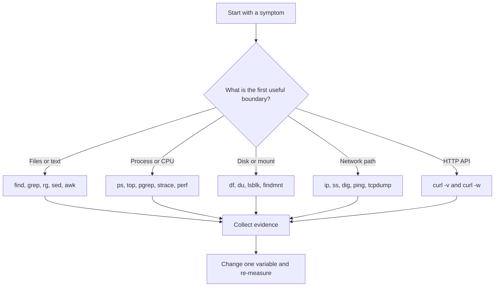

# Linux Tools for Placement Preparation

A strong Linux answer names the tool that observes the right layer, explains
what its output means, and states the safety boundary. This chapter is a
compact, practical companion to the deeper Linux material in this book.

> **Safety first:** examples that use `sudo`, `kill`, `rm`, mounts, packet
> capture, firewall changes, or remote access can affect a real system. Try
> them in a disposable environment, quote paths, and inspect a command before
> adding a destructive action.

## A question-driven workflow



Use the smallest tool that answers the question. For example, `ss` answers
which sockets exist; it does not prove that an HTTP handler is healthy. Pair
it with `curl`, application logs, or a trace.

## Safe shell building blocks

### Quote data and preserve filenames

Shell parsing performs expansions before a command runs. Quote variables unless
you intentionally want word splitting or glob expansion:

```bash
file="report with spaces.txt"
printf '%s\n' "$file"       # one argument, safe
rm -- "$file"               # -- ends options; still verify first
```

For lists of arbitrary Unix filenames, use NUL delimiters instead of newline:

```bash
find . -type f -name '*.log' -print0 |
  while IFS= read -r -d '' file; do
    printf '%s\n' "$file"
  done
```

`find -exec ... {} +` is often simpler and avoids a separate `xargs`
process. If you use `xargs`, pair `find -print0` with `xargs -0`; plain
`xargs` splits on whitespace and can corrupt names containing spaces or
newlines.

### Exit status and pipelines

```bash
set -euo pipefail
if ! output=$(some_command); then
  printf 'command failed\n' >&2
  exit 1
fi
```

`set -e` is not a complete error policy: understand conditionals, command
substitution, and pipeline status. Use `pipefail` when a producer failure
must make the pipeline fail, and handle expected non-zero statuses explicitly.

## File and text tools

### `find`: query a directory tree

**What it does:** walks a hierarchy and evaluates predicates and actions.

```bash
find src -type f -name '*.md' -print
find . -type f -size +100M -printf '%s %p\n' | sort -nr | head
find . -type f -mtime -1 -name '*.log' -exec grep -Hn 'ERROR' {} +
find . -type f -name '*.tmp' -print   # inspect before replacing -print
```

Useful options include `-type`, `-name`/`-iname`, `-path`, `-mtime`, `-size`,
`-user`, `-maxdepth`, `-xdev`, `-prune`, `-printf`, and `-exec`. Remember
that `-a` binds more tightly than `-o`; parenthesize alternatives:

```bash
find . -type f \( -name '*.c' -o -name '*.h' \) -print
```

Use `-print0` for arbitrary names. In security-sensitive directories,
prefer `-execdir` or a carefully reviewed `-exec`; a producer-to-consumer
pipeline can have a time-of-check/time-of-use race.

**Interview question:** Why can `find . -name *.c` fail? The shell may expand
`*.c` before `find` sees it; quote the pattern as `'*.c'`.

### `xargs`: turn input into arguments

```bash
printf '%s\0' *.json | xargs -0 -r jq empty
find . -type f -name '*.py' -print0 | xargs -0 -r -n 1 python -m py_compile
```

Important options are `-0` for NUL input, `-r` to avoid an empty invocation
(GNU extension), `-n` for a maximum number of arguments, `-P` for bounded
parallelism, `-I` for replacement, and `--show-limits` for `ARG_MAX`
inspection. Do not use `ls | xargs` for filenames, and do not use `-P` when
order, shared state, or rate limits make parallel execution unsafe.

### `grep` and `rg`: search text

```bash
grep -RIn --include='*.c' 'TODO' src
grep -E '^(WARN|ERROR):' app.log
grep -F 'literal [text]' file.txt
rg -n --glob '*.py' 'except\s+[^:]+:' .
rg --files -g '*.md' | sort
```

`grep -F` treats the pattern literally; `-E` enables extended regular
expressions; `-i`, `-n`, `-C`, `-l`, `-L`, `-v`, and `-w` are common filters.
`rg` (ripgrep) is usually faster for a project because it respects ignore
files and searches recursively by default. `grep` is more ubiquitous in
minimal environments.

A command returning status 1 can mean “no match,” not operational failure;
handle that distinction in scripts.

### `sed`, `awk`, `cut`, `sort`, `uniq`

```bash
sed -n '1,80p' config.ini
sed -E 's/[[:space:]]+$//' input.txt
awk -F: '{ print $1, $3 }' /etc/passwd
cut -d, -f1,3 records.csv
sort -t, -k3,3n records.csv
sort names.txt | uniq -c | sort -nr
```

- `sed` is a stream editor: substitutions, selected ranges, and small
  transformations. Use a version-controlled file or a backup when using
  `sed -i`.
- `awk` is useful when records have fields and a condition/action model.
  Set `-F` explicitly for delimited data; it is not a full CSV parser.
- `cut` handles simple fixed delimiters; use a CSV-aware tool for quoted CSV.
- `sort` must usually precede `uniq`; `uniq` only collapses adjacent equal
  lines. Use `sort -n` for numeric and `sort -h` for human-readable values.

`head`, `tail`, and `less` reduce the amount of data you inspect:

```bash
tail -F app.log
tail -n 200 app.log | grep -E 'WARN|ERROR'
less +G app.log
```

### A maintainable pipeline

```bash
find logs -type f -name '*.log' -print0 |
  xargs -0 -r grep -hE 'status=[45][0-9]{2}' |
  sed -E 's/.*status=([0-9]{3}).*/\1/' |
  sort | uniq -c | sort -k2,2n
```

Explain each stage and its assumptions in an interview. If input is large,
consider a single `awk` pass instead of spawning multiple processes.

## Processes and system calls

### `ps`, `top`, `htop`, `pgrep`, `pkill`, `kill`

```bash
ps -eo pid,ppid,stat,etime,%cpu,%mem,comm --sort=-%cpu | head
ps -T -p "$PID"                 # threads for one process
pgrep -a -f 'worker --queue'
pkill -TERM -f 'worker --queue'  # inspect the match first
top -H -p "$PID"                # per-thread view
kill -TERM "$PID"               # request graceful shutdown
kill -KILL "$PID"               # last resort; cannot be handled
```

`ps` is a snapshot; `top`/`htop` sample repeatedly. `STAT=Z` indicates a
zombie: the process has exited, but its parent has not reaped it. A zombie is
not consuming CPU; find the parent and fix its `wait`/supervision logic.
`D` commonly indicates uninterruptible sleep, often waiting on I/O.

Signals are requests with different semantics: `TERM` permits cleanup,
`HUP` is application-dependent, `INT` resembles Ctrl-C, and `KILL` is
non-catchable. Match by PID rather than a broad command-line pattern where
possible.

**Interview question:** Why can CPU be high while a process is not “stuck”?
It may be a hot loop, lock contention, GC, or kernel time; correlate `ps`,
per-thread views, and `perf`/tracing instead of inferring from one sample.

### `lsof`: map open resources to processes

```bash
lsof -p "$PID"
lsof -iTCP:8080 -sTCP:LISTEN
lsof +L1                         # open files whose directory entry is gone
```

`lsof` helps answer “why cannot I unmount this filesystem?” or “which process
owns this port?” It may need elevated privileges for complete visibility.
An unlinked file can continue consuming disk until its last file descriptor is
closed; `lsof +L1` is a useful diagnostic.

### `strace`: observe system-call boundaries

```bash
strace -f -tt -T -o trace.log ./program
strace -f -e trace=file -p "$PID"
strace -c -f ./program
```

Use `-e trace=` to narrow the question (`file`, `network`, `process`, or
specific calls), `-f` for descendants, `-p` to attach, `-c` for a summary,
and `-T` for syscall duration. Tracing adds overhead and can change timing;
never treat a trace as a production benchmark. For lower-overhead aggregate
observability, compare `perf`, tracepoints, ftrace, or eBPF.

### `time` and `perf`

```bash
/usr/bin/time -v ./program
perf stat -e cycles,instructions,cache-misses ./program
perf record -g -- ./program
perf report
```

Shell `time` output varies; `/usr/bin/time -v` gives resource details on
many Linux distributions. `perf stat` counts events, while `perf record`
collects samples for a profile. Interpret counters relative to workload and
CPU; a cache-miss count without a baseline is not a diagnosis.

## Disk, filesystems, and mounts

```bash
df -hT                         # filesystem capacity and type
du -xhd1 /var | sort -h        # directory usage, stay on one filesystem
lsblk -f                       # block devices, filesystems, labels
findmnt --df                   # mounted filesystems and capacity
findmnt /                      # which mount supplies a path
```

- `df` reports filesystem-level free space.
- `du` walks directory entries and reports apparent/allocated usage depending
  on options; it can disagree with `df` when deleted files remain open.
- `lsblk` describes block-device topology, not application disk usage.
- `findmnt` answers mount and filesystem questions without parsing `mount`
  output.

**Interview question:** Why does `df` show less free space than `du` suggests?
Open-but-unlinked files, reserved blocks, filesystem metadata, snapshots, or
other mounts can account for the difference. Check `lsof +L1`, mount points,
and filesystem-specific tools.

Avoid parsing `ls` or `df` output when a machine-readable interface exists;
use `/proc`, `/sys`, `findmnt`, or a documented command option.

## Networking tools

### `ip` and `ss`

```bash
ip -br address
ip route get 1.1.1.1
ip -s link show dev eth0
ss -ltnp
ss -tan state time-wait
ss -s
```

`ip` covers links, addresses, routes, and neighbours. `ss` reads socket state
and is the modern replacement for most `netstat` use cases. `LISTEN` is a
server socket; `TIME-WAIT` is a normal TCP lifecycle state after close; many
`TIME-WAIT` sockets may indicate connection churn, but are not automatically a
bug. Use `-p` only where permissions allow process information.

### `curl` and `wget`

```bash
curl --fail-with-body --silent --show-error \
  --connect-timeout 3 --max-time 10 https://example.com/health
curl -sS -o /dev/null -w 'status=%{http_code} ttfb=%{time_starttransfer}\n' \
  https://example.com/
curl -v --http1.1 https://example.com/
wget --server-response --spider https://example.com/
```

`curl -v` exposes request/response and TLS negotiation details; `-I` sends a
HEAD request and is not equivalent to a GET for every server. Use `--fail`
variants in automation so HTTP 4xx/5xx become failures. Do not put secrets in
URLs because they can leak through shell history and logs; prefer headers or
`.netrc` with appropriate permissions.

`wget` is convenient for recursive or resumable downloads; `curl` is often
better for API testing and precise request construction.

### `dig`, `nslookup`, `ping`, `traceroute`, `mtr`

```bash
dig +short A example.com
dig @1.1.1.1 example.com MX +noall +answer
nslookup -type=AAAA example.com
ping -c 4 example.com
traceroute -n example.com
mtr --report --report-cycles 10 example.com
```

DNS success does not prove TCP or HTTP health. `ping` uses ICMP, which may be
filtered; a failed ping is not proof that a service is down. `traceroute` may
show `*` because an intermediate hop does not reply, not because the final
path is broken. Test the relevant transport and port with `ss`, `nc`, or
`curl` when appropriate.

### `tcpdump`

```bash
sudo tcpdump -ni any 'host 10.0.0.5 and tcp port 443'
sudo tcpdump -ni eth0 -w capture.pcap 'udp port 53'
tcpdump -nnr capture.pcap 'tcp[tcpflags] & tcp-syn != 0'
```

Use `-n` to avoid reverse-DNS noise, `-i` to choose an interface, `-w` to
save a pcap, and a narrow BPF filter to reduce capture volume. Captures can
contain credentials or personal data; protect them and delete them according
to policy. A packet capture shows what crossed the observation point, not what
an endpoint intended to send.

## Developer and workflow tools

### `git`

```bash
git status --short --branch
git log --oneline --decorate -10
git diff --check
git grep -n 'pattern' -- '*.c' '*.h'
git worktree add ../review feature/topic
```

Use `git diff --check` for whitespace errors, `git grep` for tracked source,
and `git worktree` when two branches must be inspected without repeatedly
checking files in and out. Never put tokens or passwords in remotes, commits,
logs, or command output.

### `ssh`, `scp`, and `rsync`

```bash
ssh -o ConnectTimeout=5 user@host 'uname -a; uptime'
scp ./build/app user@host:/tmp/app
rsync -aHAX --dry-run ./data/ user@host:/srv/data/
rsync -aHAX --delete ./data/ user@host:/srv/data/  # review dry-run first
```

Use host keys, least-privilege accounts, and explicit identity files. `scp`
is simple copying; `rsync` transfers deltas and can preserve metadata. A
trailing slash changes whether the source directory itself or only its
contents are copied. `--delete` is powerful and should be preceded by a
reviewed `--dry-run`.

### `jq`, `make`, and `tmux`

```bash
jq -r '.items[] | select(.enabled) | .name' response.json
make -j"$(nproc)" test
make -n deploy                    # print commands without executing
tmux new -s incident
tmux attach -t incident
```

`jq` is safer than `grep` for JSON because it understands structure. `make -n`
previews a rule; `-j` can expose races in a build or overwhelm a host, so use
an appropriate job count. `tmux` keeps a long-running session alive across an
SSH disconnect; do not assume a detached session is a monitoring or
supervision system.

## Incident recipes

### “The service is unreachable”

```bash
getent hosts api.example.com
ip route get 203.0.113.10
ss -ltnp | grep ':8443'
curl -v --connect-timeout 3 https://api.example.com:8443/health
```

This separates DNS, routing, local listening, TCP/TLS, and application health.
If the local service is listening, use `tcpdump` at the relevant interface and
check firewall and proxy policy before changing configuration.

### “The disk is full”

```bash
df -hT
sudo du -xhd1 / | sort -h | tail
sudo lsof +L1
findmnt --df
```

Do not delete files based only on a large `du` line. Confirm the filesystem,
mount boundary, open deleted files, snapshots, and retention policy.

### “The process is slow”

```bash
ps -o pid,ppid,stat,wchan:32,%cpu,%mem,etime,cmd -p "$PID"
strace -f -e trace=file,network -p "$PID"
/usr/bin/time -v command
perf record -g -- command
```

Start with a hypothesis and a short observation window. Stop tracing when you
have enough evidence; instrumentation itself can alter latency.

## Interview checklist

- Explain why `find -print0 | xargs -0` is safer than `find | xargs`.
- Distinguish a process, thread, file descriptor, socket, and inode.
- Explain `SIGTERM` versus `SIGKILL`, and diagnose a zombie process.
- Compare `df`, `du`, `lsblk`, and `findmnt`.
- Explain why `ping` can fail while HTTPS succeeds.
- Interpret `LISTEN`, `ESTABLISHED`, `CLOSE-WAIT`, and `TIME-WAIT`.
- State what `strace`, `perf`, ftrace, and eBPF observe and their overhead.
- Explain why quoting, `--`, NUL delimiters, and least privilege matter.
- Design a reproducible evidence-collection command without leaking secrets.

## References

The command descriptions and safety notes were checked against primary or
project-maintained documentation on 2026-08-12:

- [GNU Coreutils manual](https://www.gnu.org/software/coreutils/manual/)
- [GNU Findutils manual](https://www.gnu.org/software/findutils/manual/)
- [GNU grep manual](https://www.gnu.org/software/grep/manual/)
- [`find(1)`](https://man7.org/linux/man-pages/man1/find.1.html) and
  [`xargs(1)`](https://man7.org/linux/man-pages/man1/xargs.1.html)
- [`ps(1)`](https://man7.org/linux/man-pages/man1/ps.1.html),
  [`ss(8)`](https://man7.org/linux/man-pages/man8/ss.8.html), and
  [`strace(1)`](https://man7.org/linux/man-pages/man1/strace.1.html)
- [`ip(8)`](https://man7.org/linux/man-pages/man8/ip.8.html) and
  [`tcpdump(8)`](https://man7.org/linux/man-pages/man8/tcpdump.8.html)
- [curl command-line documentation](https://curl.se/docs/manpage.html)
- [jq manual](https://jqlang.org/manual/)
- [OpenSSH manuals](https://man.openbsd.org/ssh)
- [rsync manual](https://download.samba.org/pub/rsync/rsync.1)
- [GNU make manual](https://www.gnu.org/software/make/manual/)
- [Mermaid flowchart syntax](https://github.com/mermaid-js/mermaid/blob/develop/docs/syntax/flowchart.md)
