# KVM Internals

## Introduction

KVM (Kernel-based Virtual Machine) is the Linux kernel's native virtualization subsystem. Unlike traditional hypervisors that replace the operating system, KVM transforms the Linux kernel itself into a hypervisor by leveraging hardware-assisted virtualization extensions (Intel VT-x and AMD-V). This design means every Linux machine with appropriate hardware is a potential hypervisor, with no separate hypervisor layer to install or maintain.

This chapter dives deep into KVM's kernel internals: how it manages virtual CPUs, handles memory virtualization, intercepts hardware access, and integrates with userspace emulators like QEMU.

## KVM Module Architecture

KVM is split into a hardware-agnostic core and architecture-specific modules:

```
kvm.ko              — Core KVM infrastructure (common code)
kvm-intel.ko        — Intel VT-x implementation (VMX)
kvm-amd.ko          — AMD-V implementation (SVM)
```

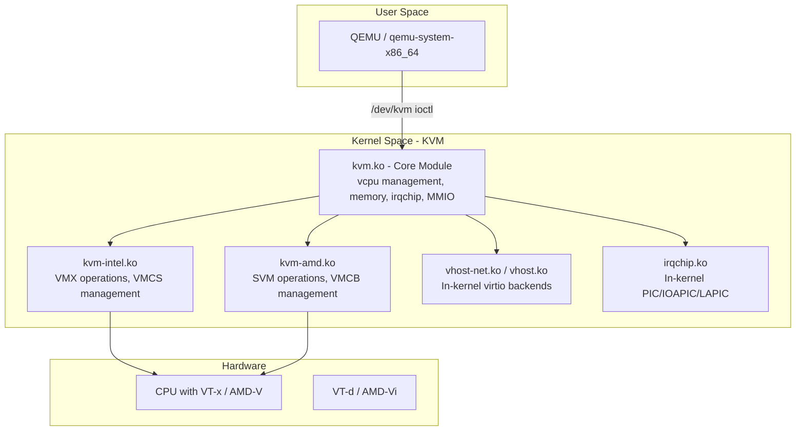

### Module Loading

```bash
# Check loaded KVM modules
lsmod | grep kvm
# kvm_intel              380928  1
# kvm                   1089536  1 kvm_intel

# Module parameters (Intel)
cat /sys/module/kvm_intel/parameters/nested
# Y  (nested virtualization enabled)

cat /sys/module/kvm_intel/parameters/enable_shadow_vmcs
# Y

# Module parameters (AMD)
cat /sys/module/kvm_amd/parameters/nested
# 1

# Disable KVM (e.g., for debugging)
# echo 0 > /sys/module/kvm_intel/parameters/enable_unsafe_vm_shadow
```

## VMX Module (Intel VT-x)

The VMX module (`kvm-intel.ko`) implements Intel's VT-x extensions. It manages the hardware virtualization state through the VMCS.

### VMX Operation Modes

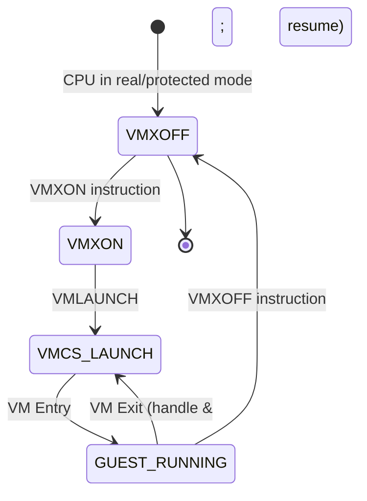

**VMX root mode** (hypervisor) and **VMX non-root mode** (guest) are the two operating modes introduced by VT-x. The CPU transitions between them via:

- **VM Entry** (VMLAUNCH/VMRESUME) — root → non-root
- **VM Exit** — non-root → root (triggered by sensitive instructions, interrupts, etc.)

### VMCS (Virtual Machine Control Structure)

The VMCS is a 4KB data structure in physical memory that holds the complete state of a virtual machine. Each vCPU has one active VMCS at a time.

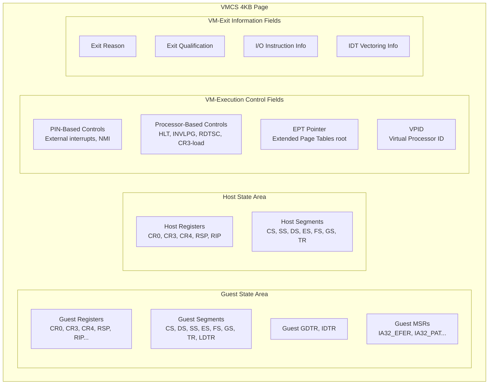

**VMCS fields:**

| Field Group | Examples | Purpose |
|-------------|----------|---------|
| Guest State | RSP, RIP, CR0, CR3, CS, SS | Loaded on VM entry, saved on VM exit |
| Host State | RSP, RIP, CR0, CR3, CS | Loaded on VM exit |
| VM-Execution Controls | EPTP, VPID, MSR bitmap | Configure what causes VM exits |
| VM-Exit Controls | Exit reason, qualification | Information about why exit occurred |
| VM-Entry Controls | Event injection, IDT vectoring | Inject interrupts/exceptions into guest |

**VMCS shadowing** allows nested virtualization to run more efficiently by letting L2 guest VM exits handled by L1 hypervisor without causing a full VM exit to host.

```c
/* KVM's VMCS field encoding (simplified) */
#define VMCS_ENCODE(field, access, type, width) \
    (((field) << 13) | ((access) << 10) | ((type) << 8) | (width))

/* Reading VMCS field */
static inline u64 vmcs_read64(unsigned long field) {
    u64 value;
    asm volatile("vmread %1, %0" : "=rm"(value) : "r"(field));
    return value;
}

/* Writing VMCS field */
static inline void vmcs_write64(unsigned long field, u64 value) {
    asm volatile("vmwrite %0, %1" :: "r"(value), "rm"(field));
}
```

### VM Entry / Exit Flow

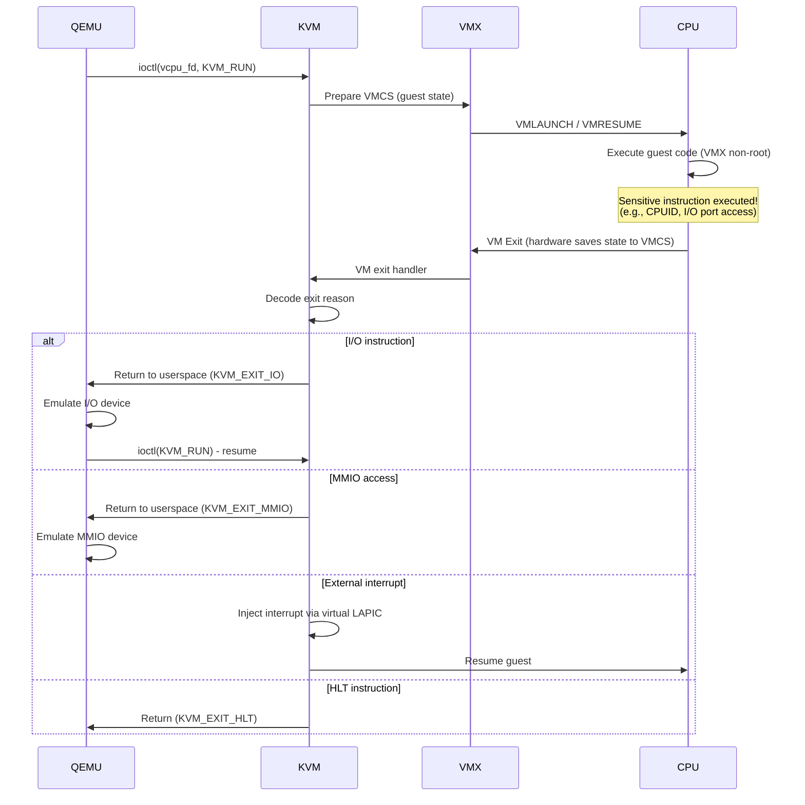

## VMCB (AMD SVM)

AMD's SVM (Secure Virtual Machine) uses the VMCB (Virtual Machine Control Block) instead of Intel's VMCS. The VMCB is a 4KB structure stored in physical memory.

```c
/* Simplified VMCB control area layout */
struct vmcb_control_area {
    u32 intercept_cr;        /* CR read/write intercepts */
    u32 intercept_dr;        /* DR read/write intercepts */
    u32 intercept_exceptions; /* Exception intercepts */
    u64 intercept_misc;      /* Misc instruction intercepts */
    u8 reserved1[40];
    u16 pause_filter_thresh;
    u16 pause_filter_count;
    u64 iopm_base_pa;        /* I/O permission map */
    u64 msrpm_base_pa;       /* MSR permission map */
    u64 tsc_offset;
    u32 guest_asid;          /* Guest ASID */
    u8 tlb_ctl;
    u8 reserved2[3];
    u32 v_tpr;               /* Virtual TPR */
    /* ... more fields ... */
    u64 exitcode;
    u64 exitinfo1;
    u64 exitinfo2;
    /* ... */
};
```

**Key differences from VMX:**

| Feature | Intel VMX | AMD SVM |
|---------|-----------|---------|
| Control structure | VMCS (per-vCPU) | VMCB (per-vCPU) |
| Nested page tables | EPT (Extended Page Tables) | NPT (Nested Page Tables) |
| TLB tagging | VPID | ASID |
| MSR filtering | MSR bitmap | MSR permission map |
| Instruction | VMLAUNCH/VMRESUME | VMRUN |
| Exit mechanism | Automatic VM exit | #VMEXIT |

## vCPU Management

A virtual CPU (vCPU) is KVM's representation of a single processor core within a guest VM. Each vCPU has:

- Its own VMCS/VMCB
- Its own `kvm_vcpu` kernel structure
- Its own thread in the host (typically 1:1 mapping)
- Its own register state and pending interrupts

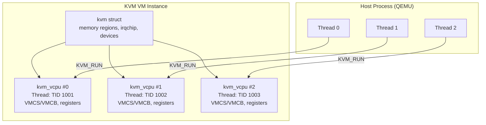

### vCPU Creation

```c
/* KVM vCPU creation (simplified kernel path) */
int kvm_vm_ioctl_create_vcpu(struct kvm *kvm, u32 id) {
    struct kvm_vcpu *vcpu;
    int r;

    // Allocate vCPU structure
    vcpu = kmem_cache_zalloc(kvm_vcpu_cache, GFP_KERNEL);

    // Initialize vCPU (architecture-specific)
    kvm_arch_vcpu_create(vcpu);

    // Create VMCS/VMCB
    kvm_x86_ops->vcpu_create(vcpu);

    // Allocate page for kvm_run structure
    vcpu->run = page_address(kvm_vcpu_alloc_page(vcpu));

    // Add to VM's vCPU array
    kvm->vcpus[id] = vcpu;

    // Create eventfd for irqfd
    kvm_arch_vcpu_postcreate(vcpu);

    return 0;
}
```

### vCPU Scheduling

When a vCPU thread calls `ioctl(KVM_RUN)`, the kernel enters guest mode. The vCPU thread may be descheduled by the host scheduler, which effectively "pauses" the guest.

```bash
# Check vCPU thread mapping
ps -eLo pid,tid,comm | grep "CPU"

# Pin vCPU threads to physical cores for performance
taskset -pc 0 $(pgrep -f "qemu.*vcpu 0")
taskset -pc 1 $(pgrep -f "qemu.*vcpu 1")

# KVM supports halt polling — briefly spinning when guest halts
# to avoid the overhead of sleeping/waking
cat /sys/module/kvm/parameters/halt_poll_ns
# 100000  (100µs default)

# Adjust halt polling (microseconds)
echo 50000 > /sys/module/kvm/parameters/halt_poll_ns
```

## IRQ Chip (In-Kernel Interrupt Controller)

KVM can emulate interrupt controllers entirely in kernel space, avoiding expensive VM exits to userspace.

### Interrupt Architecture

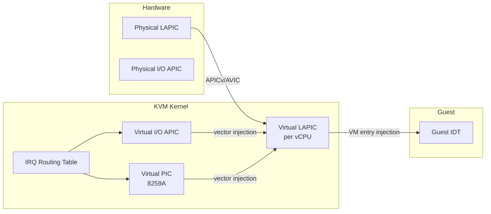

### LAPIC Virtualization

The Local APIC (Advanced Programmable Interrupt Controller) is virtualized per vCPU. KVM provides:

- **Virtual LAPIC** — full software emulation of the LAPIC registers
- **APICv** (Intel) / **AVIC** (AMD) — hardware-assisted LAPIC virtualization that reduces VM exits

```bash
# Check if APICv is available
dmesg | grep -i apic
# kvm: LAPIC enabled with APICv

# In-kernel irqchip (created by QEMU)
# QEMU command:
qemu-system-x86_64 -enable-kvm -machine kernel-irqchip=on ...

# PIC + IOAPIC + LAPIC are all emulated in kernel
# Without this, every interrupt would cause a VM exit to QEMU
```

### IRQ Routing

KVM maintains an IRQ routing table that maps guest IRQ numbers to interrupt sources:

```c
/* KVM IRQ routing entry */
struct kvm_irq_routing_entry {
    __u32 gsi;          /* Guest-side IRQ number */
    __u32 type;         /* KVM_IRQ_ROUTING_IRQCHIP, MSI, etc. */
    __u32 flags;
    union {
        struct kvm_irq_routing_irqchip irqchip;  /* PIC/IOAPIC pin */
        struct kvm_irq_routing_msi msi;          /* MSI address/data */
        struct kvm_irq_routing_s390_adapter adapter;
        struct kvm_irq_routing_hv_sint hv_sint;  /* Hyper-V sint */
    } u;
};
```

### Posted Interrupts

Intel's APICv introduces **posted interrupts**, allowing external interrupts to be delivered to a guest without a VM exit:

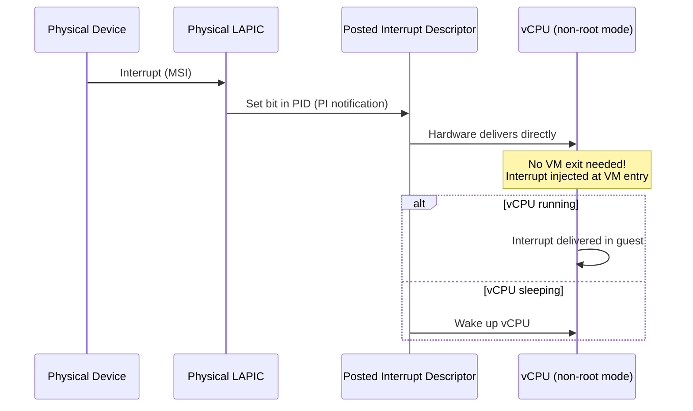

## Memory Virtualization

KVM implements a two-level page table translation:

1. **Guest page tables** — managed by the guest OS (virtual → guest physical)
2. **Extended Page Tables (EPT/NPT)** — managed by KVM (guest physical → host physical)

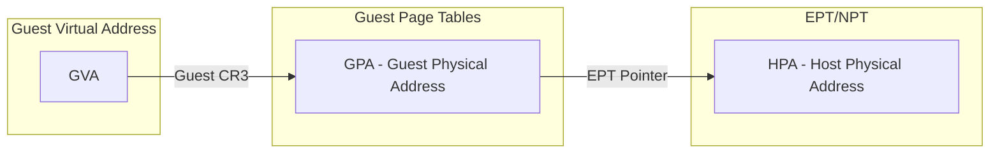

### Shadow Page Tables (Legacy)

Before EPT/NPT, KVM used shadow page tables — maintaining a single-level page table mapping GVA → HPA directly. This was expensive because every guest page table modification required a VM exit.

### EPT (Extended Page Tables)

```bash
# Check if EPT is available
dmesg | grep -i ept
# kvm: EPT enabled
# kvm: EPT caps: 0x00000f7b

# Check NPT (AMD)
dmesg | grep -i npt
# kvm: NPT enabled
```

### Memory Slot Management

KVM manages guest memory through memory regions (slots):

```c
/* KVM memory region */
struct kvm_userspace_memory_region {
    __u32 slot;              /* Slot index (0-31 typical) */
    __u32 flags;             /* KVM_MEM_LOG_DIRTY_PAGES, etc. */
    __u64 guest_phys_addr;   /* Guest physical address start */
    __u64 memory_size;       /* Size in bytes */
    __u64 userspace_addr;    /* Host virtual address (mmap'd) */
};

/* Dirty page tracking for live migration */
struct kvm_dirty_log {
    __u32 slot;
    __u32 padding;
    union {
        __u64 __user *dirty_bitmap;  /* One bit per page */
        __u64 padding2;
    };
};
```

```bash
# View KVM memory stats
cat /proc/$(pidof qemu-system-x86_64)/status | grep -i mem
# VmSize:  5242880 kB
# VmRSS:   2097152 kB
```

## KVM API

The KVM userspace API is exposed through `/dev/kvm` ioctl calls:

### Key ioctls

| ioctl | Description |
|-------|-------------|
| `KVM_GET_API_VERSION` | Returns API version (currently 12) |
| `KVM_CREATE_VM` | Creates a new VM instance |
| `KVM_SET_USER_MEMORY_REGION` | Maps host memory to guest physical |
| `KVM_CREATE_VCPU` | Creates a virtual CPU |
| `KVM_GET_SREGS` / `KVM_SET_SREGS` | Get/set segment registers |
| `KVM_GET_REGS` / `KVM_SET_REGS` | Get/set general registers |
| `KVM_RUN` | Enter guest mode |
| `KVM_SET_CPUID2` | Set CPUID leaves for vCPU |
| `KVM_SET_MSRS` | Set Model-Specific Registers |
| `KVM_IRQFD` | Attach eventfd to IRQ |
| `KVM_IOEVENTFD` | Attach eventfd to I/O port |
| `KVM_CREATE_IRQCHIP` | Create in-kernel interrupt controller |
| `KVM_CREATE_PIT2` | Create in-kernel PIT |
| `KVM_SET_TSC_KHZ` | Set vCPU TSC frequency |
| `KVM_GET_CLOCK` / `KVM_SET_CLOCK` | Get/set guest clock |
| `KVM_SET_IDENTITY_MAP_ADDR` | Set identity map page address |
| `KVM_SET_TSS_ADDR` | Set TSS address |
| `KVM_CREATE_PIT2` | Create in-kernel i8254 PIT |
| `KVM_SET_CLOCK` | Set guest clock |
| `KVM_GET_DIRTY_LOG` | Get dirty page bitmap (for migration) |
| `KVM_SET_VCPU_EVENTS` | Set vCPU events (interrupts, exceptions) |
| `KVM_GET_DEBUGREGS` / `KVM_SET_DEBUGREGS` | Get/set debug registers |
| `KVM_SET_ENABLE_CAP` | Enable KVM capability |

### KVM API Usage Flow

```c
#include <linux/kvm.h>
#include <sys/ioctl.h>
#include <sys/mman.h>
#include <fcntl.h>

int main(void)
{
    int kvm_fd, vm_fd, vcpu_fd;
    struct kvm_sregs sregs;
    struct kvm_regs regs;
    struct kvm_userspace_memory_region mem;

    /* 1. Open KVM device */
    kvm_fd = open("/dev/kvm", O_RDWR | O_CLOEXEC);

    /* 2. Check API version */
    int api_ver = ioctl(kvm_fd, KVM_GET_API_VERSION, 0);
    if (api_ver != 12) {
        fprintf(stderr, "KVM API version %d, expected 12\n", api_ver);
        return 1;
    }

    /* 3. Create VM */
    vm_fd = ioctl(kvm_fd, KVM_CREATE_VM, 0);

    /* 4. Set up memory */
    void *mem_region = mmap(NULL, 0x100000, PROT_READ | PROT_WRITE,
                           MAP_SHARED | MAP_ANONYMOUS, -1, 0);
    mem.slot = 0;
    mem.guest_phys_addr = 0;
    mem.memory_size = 0x100000;
    mem.userspace_addr = (unsigned long)mem_region;
    ioctl(vm_fd, KVM_SET_USER_MEMORY_REGION, &mem);

    /* 5. Create vCPU */
    vcpu_fd = ioctl(vm_fd, KVM_CREATE_VCPU, 0);

    /* 6. Map the kvm_run structure */
    size_t mmap_size = ioctl(kvm_fd, KVM_GET_VCPU_MMAP_SIZE, 0);
    struct kvm_run *run = mmap(NULL, mmap_size, PROT_READ | PROT_WRITE,
                               MAP_SHARED, vcpu_fd, 0);

    /* 7. Set up special registers */
    ioctl(vcpu_fd, KVM_GET_SREGS, &sregs);
    sregs.cs.base = 0;
    sregs.cs.selector = 0;
    ioctl(vcpu_fd, KVM_SET_SREGS, &sregs);

    /* 8. Set up general registers */
    regs.rip = 0;
    regs.rsp = 0x100000;
    regs.rflags = 0x2;
    ioctl(vcpu_fd, KVM_SET_REGS, &regs);

    /* 9. Load guest code */
    memcpy(mem_region, guest_code, sizeof(guest_code));

    /* 10. Run guest */
    while (1) {
        ioctl(vcpu_fd, KVM_RUN, 0);

        switch (run->exit_reason) {
        case KVM_EXIT_IO:
            if (run->io.direction == KVM_EXIT_IO_OUT)
                putchar(*((char *)run + run->io.data_offset));
            break;
        case KVM_EXIT_HLT:
            return 0;
        case KVM_EXIT_INTERNAL_ERROR:
            fprintf(stderr, "Internal error: %u\n", run->internal.suberror);
            return 1;
        }
    }
}
```

### KVM Run Structure

```c
struct kvm_run {
    /* in */
    __u8 request_interrupt_window;
    __u8 immediate_exit;
    __u8 padding1[6];

    /* out */
    __u32 exit_reason;
    __u8 ready_for_interrupt_injection;
    __u8 if_flag;
    __u16 flags;

    /* in (pre_kvm_run), out (post_kvm_run) */
    __u64 cr8;
    __u64 apic_base;

    union {
        /* KVM_EXIT_UNKNOWN */
        struct { __u64 hardware_exit_reason; } hw;
        /* KVM_EXIT_IO */
        struct {
            __u8 direction;  /* 0=out, 1=in */
            __u8 size;       /* bytes */
            __u16 port;
            __u32 count;
            __u64 data_offset;
        } io;
        /* KVM_EXIT_MMIO */
        struct {
            __u64 phys_addr;
            __u8 data[8];
            __u32 len;
            __u8 is_write;
        } mmio;
        /* KVM_EXIT_HLT */
        struct {} hlt;
        /* KVM_EXIT_INTERNAL_ERROR */
        struct {
            __u32 suberror;
            __u32 ndata;
            __u64 data[16];
        } internal;
        /* KVM_EXIT_DEBUG */
        struct {
            struct kvm_debug_exit_arch arch;
        } debug;
        /* KVM_EXIT_SYSTEM_EVENT */
        struct {
            __u32 type;
            __u64 flags;
            __u64 data[16];
        } system_event;
        /* ... more exit types ... */
    };
};
```

### Common Exit Reasons

```c
enum {
    KVM_EXIT_UNKNOWN = 0,
    KVM_EXIT_EXCEPTION = 1,
    KVM_EXIT_IO = 2,
    KVM_EXIT_HYPERCALL = 3,
    KVM_EXIT_DEBUG = 4,
    KVM_EXIT_HLT = 5,
    KVM_EXIT_MMIO = 6,
    KVM_EXIT_IRQ_WINDOW_OPEN = 7,
    KVM_EXIT_SHUTDOWN = 8,
    KVM_EXIT_FAIL_ENTRY = 9,
    KVM_EXIT_INTR = 10,
    KVM_EXIT_SET_TPR = 11,
    KVM_EXIT_TPR_ACCESS = 12,
    KVM_EXIT_S390_SIEIC = 13,
    KVM_EXIT_S390_RESET = 14,
    KVM_EXIT_DCR = 15,
    KVM_EXIT_NMI = 16,
    KVM_EXIT_INTERNAL_ERROR = 17,
    KVM_EXIT_OSI = 18,
    KVM_EXIT_PAPR_HCALL = 19,
    KVM_EXIT_S390_UCONTROL = 20,
    KVM_EXIT_WATCHDOG = 21,
    KVM_EXIT_S390_TSCH = 22,
    KVM_EXIT_EPR = 23,
    KVM_EXIT_SYSTEM_EVENT = 24,
    KVM_EXIT_S390_STSI = 25,
    KVM_EXIT_IOAPIC_EOI = 26,
    KVM_EXIT_HYPERV = 27,
    KVM_EXIT_ARM_NISV = 28,
    KVM_EXIT_X86_RDMSR = 29,
    KVM_EXIT_X86_WRMSR = 30,
    KVM_EXIT_DIRTY_RING_FULL = 31,
    KVM_EXIT_AP_RESET_HOLD = 32,
    KVM_EXIT_X86_BUS_LOCK = 33,
    KVM_EXIT_XEN = 34,
    KVM_EXIT_RISCV_SBI = 35,
    KVM_EXIT_RISCV_CSR = 36,
    KVM_EXIT_NOTIFY = 37,
};
```

## vCPU Run Loop (from kernel docs)

The following details are drawn from the official [KVM API Documentation](https://docs.kernel.org/virt/kvm/api.html).

### KVM_RUN ioctl

The `KVM_RUN` ioctl is the core of the vCPU execution model. When userspace calls `ioctl(vcpu_fd, KVM_RUN, 0)`, the kernel enters guest mode and the vCPU executes guest code until a VM exit occurs. The exit reason and details are communicated through the shared `kvm_run` structure.

### kvm_run Structure

The `kvm_run` structure is mmap'd from the vCPU file descriptor (size returned by `KVM_GET_VCPU_MMAP_SIZE`):

```c
struct kvm_run {
    /* in */
    __u8 request_interrupt_window;
    __u8 immediate_exit;
    __u8 padding1[6];

    /* out */
    __u32 exit_reason;
    __u8 ready_for_interrupt_injection;
    __u8 if_flag;
    __u16 flags;

    /* in (pre_kvm_run), out (post_kvm_run) */
    __u64 cr8;
    __u64 apic_base;

    union {
        struct { __u64 hardware_exit_reason; } hw;
        struct {
            __u8 direction;  /* 0=out, 1=in */
            __u8 size;       /* bytes */
            __u16 port;
            __u32 count;
            __u64 data_offset;
        } io;
        struct {
            __u64 phys_addr;
            __u8 data[8];
            __u32 len;
            __u8 is_write;
        } mmio;
        struct { __u32 suberror; __u32 ndata; __u64 data[16]; } internal;
        /* ... more exit types ... */
    };
};
```

### Common Exit Reasons

| Exit Reason | Code | Description |
|-------------|------|-------------|
| `KVM_EXIT_IO` | 2 | Port I/O instruction |
| `KVM_EXIT_MMIO` | 6 | Memory-mapped I/O |
| `KVM_EXIT_HLT` | 5 | Guest executed HLT |
| `KVM_EXIT_IRQ_WINDOW_OPEN` | 7 | Interrupt window opened |
| `KVM_EXIT_SHUTDOWN` | 8 | Guest triple-faulted |
| `KVM_EXIT_FAIL_ENTRY` | 9 | Hardware entry failed |
| `KVM_EXIT_INTR` | 10 | Host interrupt (not a real exit) |
| `KVM_EXIT_NMI` | 16 | NMI delivered |
| `KVM_EXIT_INTERNAL_ERROR` | 17 | KVM internal error |
| `KVM_EXIT_SYSTEM_EVENT` | 24 | System event (reset, shutdown) |
| `KVM_EXIT_X86_RDMSR` | 29 | MSR read (filtered) |
| `KVM_EXIT_X86_WRMSR` | 30 | MSR write (filtered) |
| `KVM_EXIT_HYPERCALL` | 3 | Hypercall instruction |
| `KVM_EXIT_DEBUG` | 4 | Debug event |

### The vCPU Run Loop Pattern

The canonical userspace vCPU run loop:

```c
while (1) {
    ioctl(vcpu_fd, KVM_RUN, 0);

    switch (run->exit_reason) {
    case KVM_EXIT_IO:
        /* Handle port I/O */
        if (run->io.direction == KVM_EXIT_IO_OUT)
            handle_io_out(run->io.port, (char *)run + run->io.data_offset, run->io.size);
        else
            handle_io_in(run->io.port, (char *)run + run->io.data_offset, run->io.size);
        break;
    case KVM_EXIT_MMIO:
        /* Handle memory-mapped I/O */
        handle_mmio(run->mmio.phys_addr, run->mmio.data, run->mmio.len, run->mmio.is_write);
        break;
    case KVM_EXIT_HLT:
        /* Guest halted */
        return 0;
    case KVM_EXIT_IRQ_WINDOW_OPEN:
        /* Inject pending interrupt */
        inject_interrupt(vcpu_fd);
        break;
    case KVM_EXIT_INTERNAL_ERROR:
        fprintf(stderr, "Internal error: suberror=%u\n", run->internal.suberror);
        return 1;
    case KVM_EXIT_SYSTEM_EVENT:
        /* Guest requested shutdown/reset */
        return 0;
    default:
        fprintf(stderr, "Unexpected exit: %u\n", run->exit_reason);
        return 1;
    }
}
```

### Interrupt Injection

To inject an interrupt into the guest:

1. Set `run->request_interrupt_window = 1` before `KVM_RUN`
2. When `KVM_EXIT_IRQ_WINDOW_OPEN` occurs, use `KVM_INTERRUPT` ioctl
3. Or use `KVM_SET_VCPU_EVENTS` for more control (NMI, exceptions, etc.)

### Coalesced MMIO

When `KVM_CAP_COALESCED_MMIO` is available, KVM batches multiple MMIO writes into a shared memory ring at `KVM_COALESCED_MMIO_PAGE_OFFSET * PAGE_SIZE`, reducing VM exits for device emulation.

### Dirty Page Tracking

For live migration, `KVM_GET_DIRTY_LOG` or `KVM_CAP_DIRTY_LOG_RING` (Linux 5.9+) tracks dirty pages. The dirty log ring is a per-VM shared memory region that records dirty pages without requiring a separate ioctl.

## QEMU Integration

QEMU is the primary userspace component that works with KVM. It provides:

1. **Device emulation** — network cards, disk controllers, USB, graphics
2. **Machine model** — chipset, firmware (BIOS/UEFI), buses
3. **Management interface** — QMP (QEMU Machine Protocol) for control
4. **Live migration** — moving running VMs between hosts

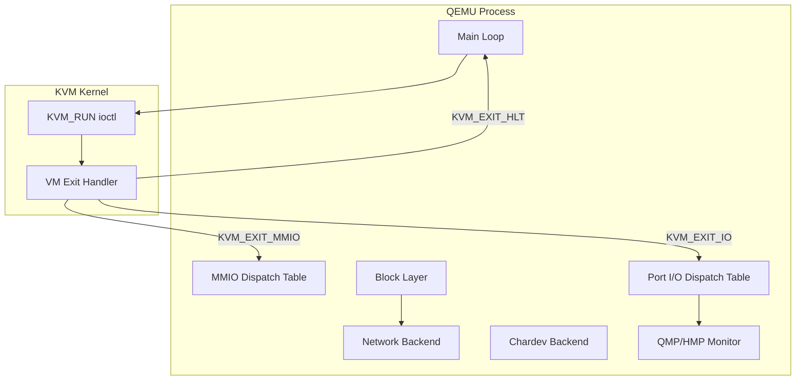

### QEMU + KVM Execution Model

```bash
# Typical QEMU command with KVM
qemu-system-x86_64 \
  -enable-kvm \
  -machine q35,accel=kvm \
  -cpu host \
  -smp 4,sockets=1,cores=2,threads=2 \
  -m 8G \
  -device virtio-blk-pci,drive=drv0 \
  -drive file=disk.qcow2,format=qcow2,if=none,id=drv0 \
  -device virtio-net-pci,netdev=net0 \
  -netdev user,id=net0,hostfwd=tcp::2222-:22 \
  -device virtio-gpu-pci \
  -display gtk \
  -monitor stdio

# Monitor the VM
(qemu) info status
(qemu) info cpus
(qemu) info network
(qemu) info block
```

## Performance Tuning

### VM Exit Minimization

Every VM exit is expensive (~1-2 microseconds). Minimizing exits is critical:

```bash
# Enable halt polling to reduce HLT exits
echo 200000 > /sys/module/kvm/parameters/halt_poll_ns

# Use in-kernel irqchip (reduces interrupt-related exits)
# Default in modern QEMU

# Enable APICv/AVIC (reduces LAPIC access exits)
# Check: dmesg | grep -i "virtual apic"

# Use virtio for I/O (reduces I/O port exits)
# virtio uses shared memory rings instead of port I/O

# MSR filtering — avoid unnecessary MSR exits
# KVM_SET_MSR_FILTER ioctl (Linux 5.2+)
```

### NUMA and CPU Pinning

```bash
# Check NUMA topology
numactl --hardware

# Pin vCPU to specific physical CPU
# In libvirt XML:
# <vcpupin vcpu='0' cpuset='2'/>
# <vcpupin vcpu='1' cpuset='3'/>
# <emulatorpin cpuset='0-1'/>

# Or via QEMU command line:
# taskset -c 2,3 qemu-system-x86_64 -enable-kvm -smp 2 ...
```

### Huge Pages

```bash
# Allocate 1GB huge pages for VM memory
echo 8 > /sys/kernel/mm/hugepages/hugepages-1048576kB/nr_hugepages

# QEMU with hugepages
qemu-system-x86_64 -enable-kvm -m 8G \
  -object memory-backend-file,id=mem,size=8G,mem-path=/dev/hugepages \
  -machine memory-backend=mem ...

# Check hugepage allocation
cat /proc/meminfo | grep -i huge
```

## Shadow Page Tables and EPT

KVM implements two-level page table translation for memory virtualization:

1. **Guest page tables** — managed by the guest OS (GVA → GPA)
2. **Extended Page Tables (EPT/NPT)** — managed by KVM (GPA → HPA)

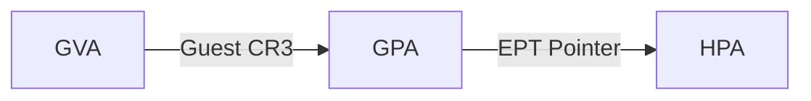

### Shadow Page Tables (Legacy)

Before hardware-assisted paging (EPT/NPT), KVM used **shadow page tables** — maintaining a single-level page table mapping GVA → HPA directly. This was expensive because:

- Every guest page table modification required a VM exit
- KVM had to intercept guest CR3 writes and INVLPG instructions
- Each vCPU maintained shadow PTs separate from the guest's own PTs
- TLB flushes were frequent and costly

Shadow page tables are still used as a fallback when EPT/NPT is unavailable, and for certain nested virtualization scenarios.

### EPT (Extended Page Tables) — Intel

EPT adds a second level of address translation in hardware. The EPT root is stored in the VMCS `EPT_POINTER` (EPTP) field:

```c
/* EPT page walk: 4-level on x86-64 */
GPA → EPT PML4 → EPT PDPT → EPT PD → EPT PT → HPA
```

EPT violations cause VM exits that KVM handles by:
1. Checking if the GPA is backed by guest memory
2. Allocating/allocating a host physical page if needed
3. Installing EPT entries
4. Resuming the guest

```bash
# Check EPT support
dmesg | grep -i ept
# kvm: EPT enabled
# kvm: EPT caps: 0x00000f7b

# EPT reduces VM exits significantly compared to shadow PTs
# — No exit on guest page table writes
# — No exit on INVLPG
# — Hardware handles GVA→HPA translation autonomously
```

### NPT (Nested Page Tables) — AMD

AMD's equivalent is NPT (Nested Page Tables), stored in the VMCB's `nCR3` field. The mechanism is analogous to EPT:

```bash
# Check NPT support
dmesg | grep -i npt
# kvm: NPT enabled
```

### EPT vs Shadow Page Tables

| Aspect | Shadow PTs | EPT/NPT |
|--------|-----------|----------|
| Hardware support | Not required | Requires VT-x/EPT or AMD-V/NPT |
| Guest PT modifications | VM exit every time | No exit (hardware handles) |
| INVLPG | VM exit | No exit |
| TLB flush cost | High (shadow + guest) | Lower (hardware tagging via VPID/ASID) |
| Memory overhead | Shadow PTs per vCPU | EPT tables per VM |
| Nested virtualization | Complex | VMCS shadowing reduces exits |

### Nested Page Table Flushing

KVM must flush EPT/NPT entries when:
- Guest memory is remapped or unmapped
- `KVM_SET_USER_MEMORY_REGION` changes memory layout
- Guest migration invalidates mappings

The `INVEPT` (Intel) and `VMGEXIT` (AMD) instructions invalidate EPT/NPT translations:

```c
/* Intel: invalidate all EPT entries */
static inline void ept_sync_global(void) {
    if (cpu_has_vmx_invept_global())
        __invept(VMX_EPT_EXTENT_GLOBAL, 0, 0);
}

/* AMD: invalidate NPT entries */
static inline void npt_flush(struct vcpu_svm *svm) {
    svm->vmcb->control.tlb_ctl = TLB_CONTROL_FLUSH_ASID;
}
```

## Nested Virtualization

KVM supports running a hypervisor inside a VM (L0 → L1 → L2). From `docs.kernel.org/virt/kvm/nested-vmx.html`, nested virtualization allows an L1 guest to use hardware virtualization extensions to run its own L2 guests.

### Enabling Nested Virtualization

```bash
# Enable nested virtualization (Intel)
echo "options kvm_intel nested=Y" > /etc/modprobe.d/kvm.conf
modprobe -r kvm_intel && modprobe kvm_intel

# Enable nested virtualization (AMD)
echo "options kvm_amd nested=1" > /etc/modprobe.d/kvm.conf
modprobe -r kvm_amd && modprobe kvm_amd

# Inside the VM, verify KVM is available
grep -c vmx /proc/cpuinfo  # Should show > 0
```

### Architecture Overview

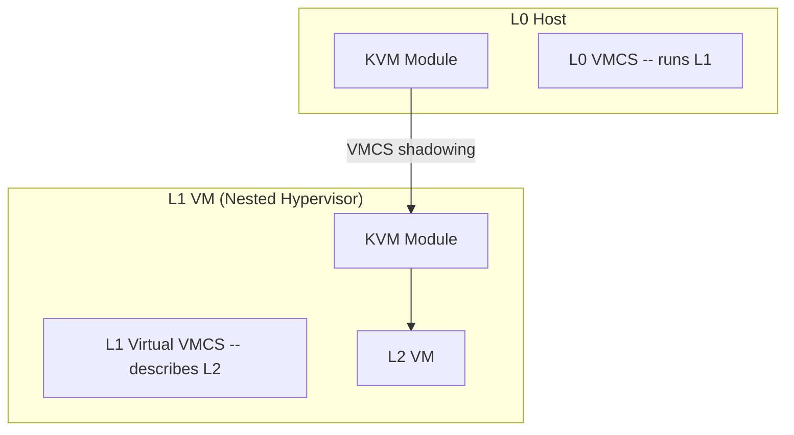

### How Nested VMX Works

From the kernel documentation, nested VMX involves two levels of VMCS:

- **L0 (host hypervisor)**: Manages the real hardware VMCS
- **L1 (guest hypervisor)**: Runs in VMX non-root mode, but thinks it's in VMX root mode
- **L2 (nested guest)**: Runs in VMX non-root mode, managed by L1

When L1 executes VMXON, VMLAUNCH, or VMRESUME:
1. These instructions cause a VM exit to L0
2. L0 emulates the VMX operation using a **shadow VMCS**
3. When L2 runs, L0 loads the shadow VMCS (with L2's state)
4. VM exits from L2 can be handled by L0 directly or reflected to L1

### VMCS Shadowing

VMCS shadowing is a hardware optimization (Intel) that reduces the cost of nested virtualization:

- Without shadowing: Every VM entry/exit between L1 and L2 causes a full VM exit to L0
- With shadowing: L0 sets up a **shadow VMCS** that L1 can read/write via VMREAD/VMWRITE without causing VM exits

The shadow VMCS contains the fields L1 needs to manage, while L0 maintains the real VMCS for hardware. This dramatically reduces the overhead of nested virtualization.

```c
/* L0 sets up VMCS shadowing */
vmcs_write64(VMCS_LINK_POINTER, shadow_vmcs_pa);
vmcs_write32(SECONDARY_VM_EXEC_CONTROL,
             SECONDARY_EXEC_SHADOW_VMCS | ...);
```

### VM Exit Handling in Nested Virt

When L2 causes a VM exit, L0 decides how to handle it:

| Exit Type | L0 Behavior |
|-----------|-------------|
| I/O instruction | Reflect to L1 (L1 emulates device) |
| CPUID | Handle in L0 or reflect to L1 |
| CR access | Emulate or reflect based on L1's intercepts |
| MSR read/write | Check L1's MSR bitmap, reflect if needed |
| EPT violation | Handle in L0 (L0 owns the real EPT) |
| External interrupt | Handle in L0 (inject to appropriate level) |

### Enabling VMX for L1

To allow L1 to run VMX (and thus create L2 guests), L0 must:
1. Set `nested=Y` in `kvm_intel` module parameters
2. Expose VMX capability via CPUID to L1
3. Enable MSR passthrough for VMX-related MSRs

```bash
# Verify nested support
# Inside L1 (the VM that will be a hypervisor):
cat /proc/cpuinfo | grep vmx
# Should show vmx flags

# Check KVM module parameters
cat /sys/module/kvm_intel/parameters/nested
# Y
```

### Performance Considerations

Nested virtualization adds significant overhead:
- Each L2 VM exit requires L0 to process it (even if reflected to L1)
- VMCS shadowing reduces but doesn't eliminate the overhead
- Memory virtualization becomes 3-level: GVA → L2 GPA → L1 GPA → HPA
- EPT violations become more expensive (may need to walk L1's EPT equivalent)

Best practices:
- Use VMCS shadowing (enabled by default with `nested=Y`)
- Minimize VM exits from L2 (use virtio, in-kernel irqchip)
- Pin L1 vCPUs to physical CPUs
- Consider using `KVM_CAP_NESTED_STATE` for save/restore of nested state

### KVM_CAP_NESTED_STATE

KVM exposes nested virtualization state through capabilities:

```c
/* Check nested state support */
int has_nested = ioctl(kvm_fd, KVM_CHECK_EXTENSION, KVM_CAP_NESTED_STATE);

/* Save/restore nested state during migration */
struct kvm_nested_state {
    __u16 flags;
    __u16 format;
    __u32 size;
    union {
        struct kvm_vmx_nested_state vmx;
        struct kvm_svm_nested_state svm;
    } data;
};
```

## KVM API Details (from docs.kernel.org)

### API File Descriptor Hierarchy

The KVM API is organized around three levels of file descriptors:

1. **System fd** (`/dev/kvm`): Global KVM queries and VM creation
2. **VM fd**: Per-VM operations (memory, IRQ routing, device creation)
3. **vCPU fd**: Per-vCPU operations (registers, MSRs, execution)
4. **Device fd**: Per-device operations (virtio-mmio, etc.)

```
open("/dev/kvm")  →  system_fd
  KVM_CREATE_VM     →  vm_fd
    KVM_CREATE_VCPU    →  vcpu_fd
    KVM_CREATE_DEVICE  →  device_fd
```

**Key restriction**: VM ioctls must be issued from the same process that created the VM. However, the VM's lifecycle is tied to its file descriptor, not the creating process — if the process forks, the VM persists until all references to the VM fd are closed.

### KVM API Version and Extensions

The KVM API version is stabilized at **12** (since Linux 2.6.22). No backward-incompatible changes are allowed. Extensions are identified by `KVM_CAP_*` constants and can be queried with `KVM_CHECK_EXTENSION`:

```c
int has_ept = ioctl(kvm_fd, KVM_CHECK_EXTENSION, KVM_CAP_EXT_EPT);
```

### Capabilities That Can Be Enabled

Some capabilities must be explicitly enabled on vCPUs or VMs:

- **vCPU capabilities** (set via `KVM_ENABLE_CAP` on vcpu fd): e.g., `KVM_CAP_X86_DISABLE_EXITS` to disable MWAIT/HLT exits
- **VM capabilities** (set via `KVM_ENABLE_CAP` on vm fd): e.g., `KVM_CAP_DIRTY_LOG_RING` for efficient dirty page tracking

### Coalesced MMIO

When `KVM_CAP_COALESCED_MMIO` is available, KVM batches multiple MMIO writes into a shared memory ring, reducing VM exits for device emulation. The ring is mapped at `KVM_COALESCED_MMIO_PAGE_OFFSET * PAGE_SIZE` within the vCPU's mmap area.

### Dirty Page Tracking

For live migration, KVM provides dirty page tracking via `KVM_GET_DIRTY_LOG` or the newer `KVM_CAP_DIRTY_LOG_RING` (Linux 5.9+). The dirty log ring is a per-VM shared memory region that records dirty pages without requiring a separate ioctl, reducing migration overhead.

### KVM on ARM64

On ARM64, the physical address size (IPA size) for a VM defaults to 40 bits but can be configured:

```c
vm_fd = ioctl(dev_fd, KVM_CREATE_VM, KVM_VM_TYPE_ARM_IPA_SIZE(48));
```

The IPA size must be between 32 and the host's `Host_IPA_Limit`. This affects stage-2 (guest physical → host physical) address translation size, not the guest-visible `PARange`.

## MSR (Model-Specific Register) Handling

MSRs are processor-specific control and status registers. In KVM, MSR handling is critical for virtualizing processor features, power management, and security.

### MSR Index Discovery

KVM exposes the set of supported MSRs via ioctls:

```c
struct kvm_msr_list {
    __u32 nmsrs;       /* number of MSRs in entries */
    __u32 indices[0];  /* MSR indices */
};

/* Get guest-supported MSRs */
struct kvm_msr_list *list = malloc(sizeof(*list) + 256 * sizeof(__u32));
list->nmsrs = 256;
ioctl(kvm_fd, KVM_GET_MSR_INDEX_LIST, list);

/* Get MSRs that can be queried for host features */
ioctl(kvm_fd, KVM_GET_MSR_FEATURE_INDEX_LIST, list);
```

- `KVM_GET_MSR_INDEX_LIST` — Returns MSRs the guest can use (varies by KVM version and host CPU)
- `KVM_GET_MSR_FEATURE_INDEX_LIST` — Returns MSRs queryable via `KVM_GET_MSRS` (host capabilities like VMX)
- MCE bank MSRs are NOT included (set separately via `KVM_X86_SETUP_MCE`)

### MSR Read/Write

```c
struct kvm_msrs {
    __u32 nmsrs;
    struct kvm_msr_entry entries[0];
};

struct kvm_msr_entry {
    __u32 index;    /* MSR number */
    __u32 reserved;
    __u64 data;     /* MSR value */
};

/* Read MSRs from vCPU */
struct kvm_msrs *msrs = malloc(sizeof(*msrs) + sizeof(struct kvm_msr_entry));
msrs->nmsrs = 1;
msrs->entries[0].index = MSR_IA32_TSC;  /* Read TSC */
ioctl(vcpu_fd, KVM_GET_MSRS, msrs);

/* Write MSRs to vCPU */
msrs->entries[0].data = 0x12345678;
ioctl(vcpu_fd, KVM_SET_MSRS, msrs);
```

### MSR Filtering (Linux 5.2+)

To avoid unnecessary VM exits for MSRs, KVM supports **MSR filtering** via `KVM_SET_MSR_FILTER`. This lets userspace define which MSRs cause exits and which are handled directly:

```c
struct kvm_msr_filter {
    __u32 flags;  /* KVM_MSR_FILTER_DEFAULT_ALLOW or _DENY */
    struct {
        __u8 bitmap[512 / 8]; /* 512 MSR ranges × 8 = 4096 ranges */
    } ranges[KVM_MSR_FILTER_MAX];
};

/* Filter: only intercept writes to specific MSRs */
struct kvm_msr_filter filter = {
    .flags = KVM_MSR_FILTER_DEFAULT_ALLOW,
    .ranges[KVM_MSR_FILTER_WRITE] = {
        .bitmap = { /* set bits for MSRs to intercept */ },
    },
};
ioctl(vm_fd, KVM_SET_MSR_FILTER, &filter);
```

### Common MSRs in Virtualization

| MSR | Purpose | VM Exit? |
|-----|---------|----------|
| `IA32_TSC` | Time Stamp Counter | Configurable |
| `IA32_EFER` | Extended Feature Enable Register | On write |
| `IA32_PAT` | Page Attribute Table | On write |
| `IA32_STAR/LSTAR` | SYSCALL entry points | On write |
| `IA32_SYSENTER_*` | SYSENTER entry | On write |
| `IA32_MISC_ENABLE` | Misc CPU features | On read/write |
| `IA32_PERF_*` | Performance counters | Configurable |
| `IA32_TSC_ADJUST` | TSC adjustment | Per-vCPU |
| `IA32_SPEC_CTRL` | Spectre mitigations | On write |

### MSR Exit Reasons

When a guest accesses a filtered MSR, KVM exits to userspace:

```c
/* KVM_EXIT_X86_RDMSR — guest read an MSR */
struct {
    __u32 error;   /* 0 = handled, non-zero = #GP injected */
    __u32 reason;  /* Why KVM couldn't handle it */
    __u32 index;   /* MSR number */
    __u64 data;    /* Value to return (for RDMSR) */
} msr;

/* KVM_EXIT_X86_WRMSR — guest wrote an MSR */
struct {
    __u32 error;
    __u32 reason;
    __u32 index;
    __u64 data;    /* Value guest tried to write */
} msr;
```

## CPUID Handling in KVM

When a guest executes the `CPUID` instruction, the CPU does not cause a VM exit by default. Instead, KVM configures the VMCS/VMCB to control which CPUID results are presented to the guest. This is critical for feature negotiation between the hypervisor and guest OS.

### KVM_SET_CPUID2

QEMU uses the `KVM_SET_CPUID2` ioctl to define the CPUID leaves visible to the guest. This ioctl takes an array of `kvm_cpuid_entry2` structures:

```c
struct kvm_cpuid_entry2 {
    __u32 function;    /* CPUID function (leaf) */
    __u32 index;       /* Sub-leaf (ECX input) */
    __u32 flags;       /* KVM_CPUID_FLAG_SIGNIFCANT_INDEX */
    __u32 eax, ebx, ecx, edx;  /* Output registers */
};
```

QEMU typically:
1. Queries the host CPU's CPUID via `KVM_GET_SUPPORTED_CPUID`
2. Filters and adjusts values (e.g., disabling unsupported features, limiting address bits)
3. Sets the final CPUID table on the vCPU via `KVM_SET_CPUID2`

### CPUID Emulation Flow

When the guest executes CPUID:
1. If the leaf is in the CPUID table set by `KVM_SET_CPUID2`, the hardware returns the configured values directly (no VM exit)
2. If the leaf is NOT in the table, a VM exit occurs with `KVM_EXIT_CPUID` (on some configurations), and QEMU handles it
3. For leaves like `0x40000000` (hypervisor signature), KVM injects its own values

### Hyper-V CPUID

KVM can present Hyper-V compatible CPUID leaves to guests for compatibility:
- Leaf `0x40000000`: Hypervisor vendor ID ("Microsoft Hv" or "KVMKVMKVM\0")
- Leaf `0x40000001`: Hyper-V interface identification
- Leaf `0x40000002`: Hyper-V system identity
- Leaf `0x40000003`: Hyper-V feature bits
- Leaf `0x40000004`: Hyper-V recommended hypercall interface

```bash
# Check guest CPUID from inside a VM
cat /proc/cpuinfo | head -30

# Query CPUID via QEMU monitor
(qemu) info cpus
```

### Feature Filtering

KVM filters CPUID features for safety. For example:
- Features requiring specific hardware support (AVX-512, AMX) are only exposed if the host CPU supports them
- `KVM_CAP_ENFORCE_CPUID` ensures that the guest only sees features that were explicitly configured
- Nested virtualization features (VMX/SVM) are controlled separately via module parameters

```bash
# Enable nested virtualization CPUID
sudo sh -c 'echo "options kvm_intel nested=Y" > /etc/modprobe.d/kvm.conf'
sudo modprobe -r kvm_intel && sudo modprobe kvm_intel

# Verify: guest should see vmx in /proc/cpuinfo
grep vmx /proc/cpuinfo
```
2. Intel. "Intel® 64 and IA-32 Architectures Software Developer's Manual, Volume 3C: System Programming Guide, Part 3." Chapter 23-33: VMX.
3. AMD. "AMD64 Architecture Programmer's Manual Volume 2: System Programming." Chapter 15: Secure Virtual Machine.
4. KVM API documentation: `Documentation/virt/kvm/api.rst` in the Linux kernel tree.
5. Laan, J. van der. "KVM and QEMU Integration." KVM Forum.

## Hypercalls

Hypercalls are the mechanism by which a guest VM communicates with the hypervisor, analogous to how a user-space application makes system calls to the kernel. When a guest executes a hypercall instruction, it causes a VM exit that KVM handles.

### Architecture-Specific Hypercall Mechanisms

| Architecture | Instruction | Notes |
|-------------|-------------|-------|
| **x86 (Intel)** | `vmcall` / `vmxcall` | VMX instructions causing VM exit with `KVM_EXIT_HYPERCALL` |
| **x86 (AMD)** | `vmmcall` | SVM hypercall instruction |
| **ARM64** | `hvc #0` | Hypervisor Call (HVC) instruction |
| **RISC-V** | `ecall` | Environment call to S-mode (supervisor) |
| **s390** | `diag` | Diagnose instruction with specific function codes |
| **MIPS** | `hypcall` | MIPS hypervisor call |

### KVM Hypercall Interface

KVM exposes hypercalls through the `KVM_EXIT_HYPERCALL` exit reason. When a guest executes a hypercall instruction, KVM can either:

1. **Handle it in-kernel** — for standard KVM hypercalls (KVM_HC_* constants)
2. **Exit to userspace** — with `exit_reason = KVM_EXIT_HYPERCALL`, letting QEMU handle it

The hypercall parameters are passed in architecture-specific registers:
- **x86**: `RAX` = hypercall number, `RBX`, `RCX`, `RDX`, `RSI`, `RDI` = arguments
- **ARM64**: `X0` = hypercall number, `X1–X5` = arguments

### Common KVM Hypercalls (x86)

```c
/* From include/uapi/linux/kvm_para.h */
#define KVM_HC_VAPIC_POLL_IRQ        1  /* Poll for pending IRQs */
#define KVM_HC_MMU_OP                 2  /* MMU operations (legacy) */
#define KVM_HC_CLOCK_PAIRING          3  /* Clock synchronization */
#define KVM_HC_KICK_CPU               4  /* Wake a halted vCPU */
#define KVM_HC_SEND_IPI               9  /* Send IPI to vCPUs */
#define KVM_HC_SCHED_YIELD           10  /* Yield to host scheduler */
```

### Hypercall Setup

KVM advertises supported hypercalls via CPUID leaves. The guest queries `CPUID leaf 0x40000001` to discover which hypercalls are available:

```c
/* Guest-side: check if a hypercall is available */
unsigned int eax, ebx, ecx, edx;
cpuid(0x40000001, &eax, &ebx, &ecx, &edx);
/* eax = bitmask of supported KVM_HC_* hypercalls */

/* Guest-side: make a hypercall */
static inline long kvm_hypercall0(unsigned int nr)
{
    long ret;
    asm volatile("vmcall"
                 : "=a"(ret)
                 : "a"(nr)
                 : "memory");
    return ret;
}
```

### Hyper-V Compatible Hypercalls

KVM also supports Hyper-V compatible hypercalls for Windows guest optimization. When `KVM_CAP_HYPERV` is enabled, KVM presents Hyper-V CPUID leaves and handles Hyper-V hypercalls, enabling features like:
- **Hyper-V SynIC** (Synthetic Interrupt Controller)
- **Hyper-V VMBus** for enlightened I/O
- **Hyper-V hypercalls** for time sync, TLB flush, and more

```bash
# Enable Hyper-V support in QEMU
qemu-system-x86_64 -enable-kvm \
    -cpu host,hv_relaxed,hv_vapic,hv_spinlocks=0x1fff,hv_vpindex,hv_runtime,hv_synic,hv_stimer
```

## vCPU Device Interface

From the [kernel vCPU device documentation](https://docs.kernel.org/virt/kvm/devices/vcpu.html),
the virtual CPU "device" accepts `KVM_SET_DEVICE_ATTR`, `KVM_GET_DEVICE_ATTR`, and
`KVM_HAS_DEVICE_ATTR` ioctls targeting vCPU-wide settings. Groups and attributes are
architecture-specific.

### ARM64: PMUv3 Control (KVM_ARM_VCPU_PMU_V3_CTRL)

| Attribute | Description |
|-----------|-------------|
| `KVM_ARM_VCPU_PMU_V3_IRQ` | Set/get the PMU overflow interrupt number (PPI or SPI) |
| `KVM_ARM_VCPU_PMU_V3_INIT` | Initialize PMUv3 (must be done after in-kernel irqchip) |
| `KVM_ARM_VCPU_PMU_V3_FILTER` | Install PMU event allow/deny filters (`struct kvm_pmu_event_filter`) |
| `KVM_ARM_VCPU_PMU_V3_SET_PMU` | Specify which hardware PMU to use (heterogeneous systems) |
| `KVM_ARM_VCPU_PMU_V3_SET_NR_COUNTERS` | Set the number of implemented event counters |

### ARM64: Timer Control (KVM_ARM_VCPU_TIMER_CTRL)

| Attribute | Description | Default |
|-----------|-------------|---------|
| `KVM_ARM_VCPU_TIMER_IRQ_VTIMER` | EL1 virtual timer interrupt (PPI) | 27 |
| `KVM_ARM_VCPU_TIMER_IRQ_PTIMER` | EL1 physical timer interrupt (PPI) | 30 |
| `KVM_ARM_VCPU_TIMER_IRQ_HVTIMER` | EL2 virtual timer interrupt (PPI) | 28 |
| `KVM_ARM_VCPU_TIMER_IRQ_HPTIMER` | EL2 physical timer interrupt (PPI) | 26 |

### ARM64: Paravirtualized Time (KVM_ARM_VCPU_PVTIME_CTRL)

| Attribute | Description |
|-----------|-------------|
| `KVM_ARM_VCPU_PVTIME_IPA` | Set the base address of the stolen time structure (64-byte aligned) |

### x86: TSC Control (KVM_VCPU_TSC_CTRL)

| Attribute | Description |
|-----------|-------------|
| `KVM_VCPU_TSC_OFFSET` | 64-bit TSC offset: `guest_tsc = host_tsc + offset` |

This is critical for **live migration** — the destination VMM adjusts the TSC offset
to account for time elapsed during migration and TSC differences between source
and destination hosts.

## KVM Patch Review Checklist

From the [kernel KVM review checklist](https://docs.kernel.org/virt/kvm/review-checklist.html), patches submitted to KVM must follow specific quality and testing standards. This checklist is useful both for KVM contributors and for understanding the quality bar of the subsystem.

### Code Requirements

1. **Coding style**: Must follow Linux kernel coding style and submitting patches guidelines
2. **Branch target**: Patches should be against `kvm.git` master or next branches
3. **User/kernel interfaces**: New or modified APIs must be documented in the KVM API docs and discoverable via `KVM_CHECK_EXTENSION`
4. **Save/restore**: New state must include support for save/restore (live migration)
5. **Default off**: New features must default to off — userspace must explicitly request them. Performance improvements should default to on.
6. **CPU features**: New CPU features should be exposed via `KVM_GET_SUPPORTED_CPUID2` (or arch equivalent)
7. **Vendor neutrality**: Changes should be vendor-neutral when possible. Prefer changes to common code over vendor-specific code.
8. **64-bit clean**: User/kernel and guest/host interfaces must use specific types (`u64` rather than `ulong`), with natural alignment
9. **Documentation**: New guest-visible features must be documented in a hardware manual or accompanied by kernel documentation

### Testing Requirements

All KVM features and most bugfixes should be accompanied by tests. The kernel provides multiple test frameworks:

| Framework | Location | Description |
|-----------|----------|-------------|
| **Selftests** | `tools/testing/selftests/kvm/` | Low-level kernel API tests. Test API failure scenarios, specific guest instructions, multiple VM creation. Included in kernel tree. |
| **kvm-unit-tests** | Separate repo | Small guest images testing CPU and device features from guest perspective. Runs under QEMU or kvmtool. Not KVM-specific — can compare across hypervisors. |
| **Functional tests** | QEMU `tests/functional/`, avocado-vt | Full OS-level tests running in VMs. |

### Testing Guidelines by Feature Type

| Feature Type | Recommended Tests |
|-------------|------------------|
| New instructions (no new registers/APIs) | Make CPU features available in QEMU; add kvm-unit-tests or selftest coverage if KVM emulation is needed |
| New hardware features (new registers, no APIs) | kvm-unit-tests; requires QEMU/kvmtool support; selftests for corner cases |
| Bug fixes / performance | Share benchmarks; add regression tests to selftests or kvm-unit-tests |
| Large internal changes | Ensure changed code is covered by existing or new tests; explain testing in cover letter |
| New APIs | Demonstrate use case (proof-of-concept in userspace); selftests for API error cases and basic operation |
| Big features (host + guest) | Linux guest support required; open source VMM support (QEMU/crosvm) strongly suggested; selftests for API errors; kvm-unit-tests for guest operation |

### Best Practices

- Selftests are preferred for regression tests (included directly in Linux tree)
- kvm-unit-tests are preferred for cross-hypervisor feature testing
- Strong selftest coverage can substitute for open source VMM implementation (but not recommended)
- KVM maintainers may require additional tests or waive requirements

## Further Reading

- [The Linux Kernel Documentation](https://docs.kernel.org/)
- [LWN.net - Linux and free software news](https://lwn.net/)
- [GNU Project Documentation](https://www.gnu.org/doc/doc.html)
- [GNU Manuals](https://www.gnu.org/manual/manual.html)
- [Free Software Directory](https://directory.fsf.org/wiki/Main_Page)
- [Planet GNU](https://planet.gnu.org/)
- [Free Software Books](https://www.gnu.org/doc/other-free-books.html)

- [The Definitive KVM API Documentation — docs.kernel.org](https://docs.kernel.org/virt/kvm/api.html) — Official KVM API reference (ioctls, capabilities, extensions, restrictions)
- [Generic vCPU interface — docs.kernel.org](https://docs.kernel.org/virt/kvm/devices/vcpu.html) — vCPU device attributes (PMUv3, timers, TSC)
- [KVM API Documentation — kernel.org](https://www.kernel.org/doc/html/latest/virt/kvm/api.html)
- [KVM Forum Presentations](https://www.linux-kvm.org/page/KVM_Forum)
- [Intel SDM Volume 3C — VMX](https://www.intel.com/sdm)
- [QEMU Internals Documentation](https://www.qemu.org/docs/master/devel/)
- [KVM Source Browser](https://elixir.bootlin.com/linux/latest/source/virt/kvm)
- [KVM MMU Documentation](https://docs.kernel.org/virt/kvm/mmu.html) — Shadow and EPT page table internals
- [KVM Hypercalls — docs.kernel.org](https://docs.kernel.org/virt/kvm/hypercalls.html)
- [Nested VMX documentation — docs.kernel.org](https://docs.kernel.org/virt/kvm/nested-vmx.html)
- [KVM Review Checklist — docs.kernel.org](https://docs.kernel.org/virt/kvm/review-checklist.html) — Patch quality standards, testing requirements (selftests, kvm-unit-tests)

## Related Topics

- [Virtualization Overview](./overview.md) — types and comparison of virtualization
- [QEMU](./qemu.md) — device emulation and VM management
- [Xen Hypervisor](./xen.md) — alternative virtualization approach
- [cgroups v2](../containers/cgroups-v2.md) — resource management used for VM scheduling
- [ARM Architecture](../embedded/arm.md) — KVM on ARM
