# Advanced LLM Systems

## Overview

This section covers the deep systems-level topics that separate candidates who "know LLMs" from those who can **build and operate** production AI infrastructure. These topics appear in senior SWE, ML infra, and applied scientist interviews at companies deploying LLMs at scale.

The content here goes well beyond the introductory serving and MoE material — diving into transformer kernel optimization, distributed training at scale, advanced quantization, production inference systems, retrieval-augmented generation at scale, and autonomous agent architectures.

## Topic Map

```mermaid
graph TD
    ADV[Advanced LLM Systems]
    ADV --> TI[Transformer Internals]
    ADV --> TA[Advanced Training]
    ADV --> QA[Quantization Advanced]
    ADV --> IS[Inference Systems]
    ADV --> RA[RAG Advanced]
    ADV --> AS[Agent Systems]

    TI --> FA[FlashAttention]
    TI --> PA[Paged Attention]
    TI --> KVC[KV Cache Compression]
    TI --> PC[Prefix Caching]

    TA --> DP[Distributed Parallelism]
    TA --> ZERO[ZeRO / FSDP]
    TA --> KD[Knowledge Distillation]

    QA --> GPTQ[GPTQ / AWQ]
    QA --> FP8[FP8 / Mixed Precision]
    QA --> SP[Structured Sparsity]

    IS --> SERVE[Triton / vLLM / TensorRT-LLM]
    IS --> RLHF[RLHF / DPO Pipelines]
    IS --> MCM[Mixture-of-Models]

    RA --> ANN[HNSW / DiskANN]
    RA --> RERANK[Reranking]

    AS --> MCP[Model Context Protocol]
    AS --> MULTI[Multi-Agent Orchestration]
    AS --> CODING[AI Coding Agents]
```

## Sections

| File | Key Topics | Interview Relevance |
|---|---|---|
| [Transformer Internals](transformer-internals.md) | FlashAttention, paged attention, KV compression, prefix caching | ⭐⭐⭐⭐⭐ ML infra, GPU systems |
| [Advanced Training](training-advanced.md) | Parallelism strategies, ZeRO, FSDP, distillation, memory-efficient training | ⭐⭐⭐⭐⭐ ML platforms, training infra |
| [Quantization Advanced](quantization-advanced.md) | GPTQ, AWQ, FP8, sparsity, MoE expert parallelism | ⭐⭐⭐⭐ Model optimization, edge deployment |
| [Inference Systems](inference-systems.md) | Serving stacks, RLHF/DPO, data pipelines, mixture-of-models | ⭐⭐⭐⭐⭐ Backend, infra, platform |
| [RAG Advanced](rag-advanced.md) | ANN indexes, HNSW, DiskANN, reranking, vector quantization | ⭐⭐⭐⭐ Search, data platforms |
| [Agent Systems](agent-systems.md) | Multi-agent, MCP, AI coding agents, security, observability | ⭐⭐⭐⭐⭐ Agentic AI, product engineering |

## Prerequisites

Before diving into this section, ensure you're comfortable with:

- [LLM Fundamentals](../fundamentals.md) — transformer architecture, tokenization, training pipeline
- [LLM Serving](../llm-serving/README.md) — KV cache, batching, inference basics
- [MoE Architecture](../moe/README.md) — expert routing, load balancing
- [RAG Systems](../rag-systems.md) — basic retrieval, embeddings, chunking

## How to Use This Section

1. **Interview Prep (2-3 weeks out)**: Read all sections, focus on comparison tables and "Interview Angle" callouts
2. **Deep Dive**: Follow the Mermaid diagrams, trace through pseudocode, understand trade-offs
3. **System Design**: Combine topics — e.g., design a serving system using quantization + paged attention + continuous batching + prefix caching

## Cross-References

- [LLM Fundamentals →](../fundamentals.md)
- [LLM Serving →](../llm-serving/README.md)
- [MoE →](../moe/README.md)
- [RAG Systems →](../rag-systems.md)
- [Prompt Engineering →](../prompt-engineering.md)
- [LLM Security →](../llm-security.md)
- [Cost Optimization →](../cost-optimization.md)
