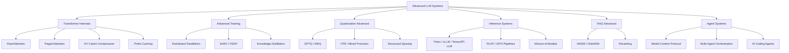

# Advanced LLM Systems

## Overview

This section covers the deep systems-level topics that separate candidates who "know LLMs" from those who can **build and operate** production AI infrastructure. These topics appear in senior SWE, ML infra, and applied scientist interviews at companies deploying LLMs at scale.

The content here goes well beyond the introductory serving and MoE material — diving into transformer kernel optimization, distributed training at scale, advanced quantization, production inference systems, retrieval-augmented generation at scale, and autonomous agent architectures.

## Topic Map

```mermaid
graph TD
    ADV[Advanced LLM Systems]
    ADV --> TI[Transformer Internals]
    ADV --> TA[Advanced Training]
    ADV --> QA[Quantization Advanced]
    ADV --> IS[Inference Systems]
    ADV --> RA[RAG Advanced]
    ADV --> AS[Agent Systems]

    TI --> FA[FlashAttention]
    TI --> PA[Paged Attention]
    TI --> KVC[KV Cache Compression]
    TI --> PC[Prefix Caching]

    TA --> DP[Distributed Parallelism]
    TA --> ZERO[ZeRO / FSDP]
    TA --> KD[Knowledge Distillation]

    QA --> GPTQ[GPTQ / AWQ]
    QA --> FP8[FP8 / Mixed Precision]
    QA --> SP[Structured Sparsity]

    IS --> SERVE[Triton / vLLM / TensorRT-LLM]
    IS --> RLHF[RLHF / DPO Pipelines]
    IS --> MCM[Mixture-of-Models]

    RA --> ANN[HNSW / DiskANN]
    RA --> RERANK[Reranking]

    AS --> MCP[Model Context Protocol]
    AS --> MULTI[Multi-Agent Orchestration]
    AS --> CODING[AI Coding Agents]
```

## Sections

| File | Key Topics | Interview Relevance |
|---|---|---|
| [Transformer Internals](transformer-internals.md) | FlashAttention, paged attention, KV compression, prefix caching | ⭐⭐⭐⭐⭐ ML infra, GPU systems |
| [Advanced Training](training-advanced.md) | Parallelism strategies, ZeRO, FSDP, distillation, memory-efficient training | ⭐⭐⭐⭐⭐ ML platforms, training infra |
| [Quantization Advanced](quantization-advanced.md) | GPTQ, AWQ, FP8, sparsity, MoE expert parallelism | ⭐⭐⭐⭐ Model optimization, edge deployment |
| [Inference Systems](inference-systems.md) | Serving stacks, RLHF/DPO, data pipelines, mixture-of-models | ⭐⭐⭐⭐⭐ Backend, infra, platform |
| [RAG Advanced](rag-advanced.md) | ANN indexes, HNSW, DiskANN, reranking, vector quantization | ⭐⭐⭐⭐ Search, data platforms |
| [Agent Systems](agent-systems.md) | Multi-agent, MCP, AI coding agents, security, observability | ⭐⭐⭐⭐⭐ Agentic AI, product engineering |

## Complete Page Map

One line per file in this directory. The `Sections` table above is the "big six" survey; the map below is the full inventory, including the kernel-level pages and the `distributed/` subdirectory that senior interviews actually probe.

| File | One-line summary |
|---|---|
| [transformer-internals.md](transformer-internals.md) | Attention math plus kernel-level optimization hub — the entry point for everything below |
| [flash-attention.md](flash-attention.md) | IO-aware exact attention: tiling + online softmax to keep activations in SRAM |
| [paged-attention.md](paged-attention.md) | KV cache managed as fixed-size blocks — near-zero memory waste, copy-on-write sharing |
| [kv-cache-compression.md](kv-cache-compression.md) | Shrinking the KV cache: quantization (KIVI), eviction (H2O), windowing (StreamingLLM), merging |
| [attention-kernel-variants.md](attention-kernel-variants.md) | The attention variant zoo: MQA/GQA, sliding window, sparse patterns and their kernel trade-offs |
| [position-encoding.md](position-encoding.md) | RoPE, ALiBi, and long-context extrapolation — why positions decide context limits |
| [ring-attention.md](ring-attention.md) | Sequence-parallel attention: compute across devices with blockwise ring communication |
| [mixture-of-experts.md](mixture-of-experts.md) | Expert routing, capacity factors, load-balancing losses, MoE serving costs |
| [vllm-internals.md](vllm-internals.md) | vLLM in depth: PagedAttention engine, continuous batching, preemption, swap/recompute |
| [sglang.md](sglang.md) | SGLang runtime: RadixAttention prefix reuse, fast constrained decoding, frontend DSL |
| [speculative-decoding.md](speculative-decoding.md) | Draft-then-verify generation: acceptance-rate math, tree speculation, self-drafting |
| [structured-output-decoding.md](structured-output-decoding.md) | Constrained decoding: FSM/grammar masks that force valid JSON or DSL output |
| [tensorrt-llm.md](tensorrt-llm.md) | NVIDIA's LLM engine builder: fused kernels, quantization recipes, in-flight batching |
| [triton-inference-server.md](triton-inference-server.md) | NVIDIA's multi-backend server: model ensembles, dynamic batching, Prometheus metrics |
| [inference-systems.md](inference-systems.md) | Serving-stack survey: schedulers, batching policies, RLHF/DPO production pipelines |
| [quantization-advanced.md](quantization-advanced.md) | GPTQ/AWQ weight quantization, FP8 activations, per-channel scales, sparsity |
| [lora.md](lora.md) | Low-rank adaptation: rank math, adapter merging, multi-adapter serving |
| [qlora.md](qlora.md) | LoRA over 4-bit NF4 with double quantization + paged optimizers — fine-tuning on one GPU |
| [training-advanced.md](training-advanced.md) | Training at scale: parallelism strategy selection, ZeRO stages, memory math |
| [rag-advanced.md](rag-advanced.md) | RAG at scale: ANN index selection, reranking, hybrid retrieval, vector quantization |
| [faiss.md](faiss.md) | Meta's ANN library: IVF/PQ composite indexes, GPU k-selection, tuning knobs |
| [milvus.md](milvus.md) | Distributed vector database architecture: log-backed storage, query/data planes |
| [pgvector.md](pgvector.md) | Vector search inside Postgres: HNSW/IVFFlat indexes, trade-offs vs dedicated DBs |
| [dataset-deduplication.md](dataset-deduplication.md) | MinHash/LSH and exact dedup at pretraining scale — why duplication wastes compute |
| [differential-privacy.md](differential-privacy.md) | DP-SGD, privacy budget, DP fine-tuning of LLMs with utility cost curves |
| [rlaif.md](rlaif.md) | Replacing human raters with AI feedback: constitution models, bias/amplification risks |
| [homomorphic-encryption.md](homomorphic-encryption.md) | Computing on encrypted embeddings/prompts — privacy-preserving inference costs |
| [agent-systems.md](agent-systems.md) | Agent stack survey: multi-agent orchestration, MCP, coding agents, security |
| [distributed/](distributed/README.md) | Subdirectory of 14 pages on parallelism and GPU clusters (mapped below) |

### The `distributed/` subdirectory

| File | One-line summary |
|---|---|
| [distributed/README.md](distributed/README.md) | Hub: choosing a parallelism strategy by model size and cluster shape |
| [distributed/distributed-training.md](distributed/distributed-training.md) | Training-cluster survey: topologies, communication, fault handling |
| [distributed/data-parallelism.md](distributed/data-parallelism.md) | DDP mechanics: gradient buckets, allreduce overlap, scaling limits |
| [distributed/model-parallelism.md](distributed/model-parallelism.md) | When a model can't fit: intra-layer vs inter-layer splitting, Megatron-style tensor math |
| [distributed/pipeline-parallelism.md](distributed/pipeline-parallelism.md) | GPipe/PipeDream schedules, bubble-ratio math, 1F1B |
| [distributed/expert-parallelism.md](distributed/expert-parallelism.md) | MoE all-to-all dispatch/combine and its network cost |
| [distributed/fsdp.md](distributed/fsdp.md) | PyTorch FSDP: parameter/gradient/optimizer sharding in practice |
| [distributed/megatron.md](distributed/megatron.md) | Megatron-LM 3D parallelism composition rules |
| [distributed/ring-allreduce.md](distributed/ring-allreduce.md) | Bandwidth-optimal collectives: why 2(n-1)/n is the magic factor |
| [distributed/distributed-rag.md](distributed/distributed-rag.md) | Retrieval serving across clusters: sharded indexes, fan-out latency |
| [distributed/disaggregated-inference.md](distributed/disaggregated-inference.md) | Separating prefill from decode across machines — the survey view |
| [distributed/prefill-decode-disaggregation.md](distributed/prefill-decode-disaggregation.md) | PD-split internals: DistServe-style scheduling, KV transfer between pools |
| [distributed/gpu-cluster-scheduling.md](distributed/gpu-cluster-scheduling.md) | Topology-aware gang scheduling for training and inference jobs |
| [distributed/distributed-ai-infra.md](distributed/distributed-ai-infra.md) | The full AI infrastructure stack end to end |

## Suggested Interview Reading Order

For a senior/ML-infra loop, this exact sequence builds each concept on the previous one — attention *math*, then attention *IO cost*, then the *memory* problem, then the *systems* that manage that memory, then the runtimes that ship it.

1. [transformer-internals.md](transformer-internals.md) — establish the FLOP/memory model of a transformer forward pass.
2. [flash-attention.md](flash-attention.md) — why attention is IO-bound, tiling + online softmax, HBM↔SRAM traffic math.
3. [paged-attention.md](paged-attention.md) — the KV cache becomes a memory-management problem: blocks, fragmentation, COW.
4. [kv-cache-compression.md](kv-cache-compression.md) — after paging, compress: quantize, evict, window, merge.
5. [vllm-internals.md](vllm-internals.md) — assemble 2–4 into a real engine: continuous batching, preemption, scheduling.
6. [sglang.md](sglang.md) — the second runtime datapoint: RadixAttention prefix trees, structured decoding — the comparison question interviewers actually ask.

Then branch by target role: **ML infra** → `speculative-decoding.md`, `tensorrt-llm.md`, `distributed/prefill-decode-disaggregation.md`; **training platforms** → `training-advanced.md` then `distributed/megatron.md`, `distributed/fsdp.md`; **search/RAG** → `rag-advanced.md`, `faiss.md`, `milvus.md`, `pgvector.md`; **applied/product** → `agent-systems.md`, `structured-output-decoding.md`.

## Prerequisites

Before diving into this section, ensure you're comfortable with:

- [LLM Fundamentals](../fundamentals.md) — transformer architecture, tokenization, training pipeline
- [LLM Serving](../llm-serving/README.md) — KV cache, batching, inference basics
- [MoE Architecture](../moe/README.md) — expert routing, load balancing
- [RAG Systems](../rag-systems.md) — basic retrieval, embeddings, chunking

## How to Use This Section

1. **Interview Prep (2-3 weeks out)**: Read all sections, focus on comparison tables and "Interview Angle" callouts
2. **Deep Dive**: Follow the Mermaid diagrams, trace through pseudocode, understand trade-offs
3. **System Design**: Combine topics — e.g., design a serving system using quantization + paged attention + continuous batching + prefix caching

## Interview Questions

### Q: Why does FlashAttention make attention faster if it computes the exact same output?

Because attention at long sequence lengths is **memory-bandwidth-bound**, not FLOP-bound: the naive kernel materializes an N×N score matrix in HBM, writing and re-reading it repeatedly. FlashAttention tiles the computation so scores are produced, softmaxed (via the online-softmax running-max trick), and consumed entirely inside SRAM, cutting HBM traffic from O(N²) to roughly O(N²d²/M) for SRAM size M while doing the same arithmetic. The interview punchline: it is an IO-schedule change, not an approximation — and that is why it also *saves* memory, enabling longer contexts for free.

### Q: What problem does PagedAttention solve, and what does it cost?

Pre-PagedAttention serving reserved a contiguous worst-case KV buffer per sequence, so allocation was all-or-nothing and internal/external fragmentation wasted 60–90% of KV memory. PagedAttention manages the cache in fixed-size blocks (vLLM default: 16 tokens), shared prefixes map to shared blocks copy-on-write, and sequences physically grow on demand — throughput gains of 2–4× on real traces come almost entirely from fitting more concurrent sequences per GPU. The cost is an indirect block-table lookup on every attention access (folded into the fused kernel) and block-table bookkeeping, both negligible at 16-token granularity.

### Q: Compute the KV cache size per token for a 7B-class model.

Per token: `2 (K and V) × n_layers × n_kv_heads × head_dim × bytes_per_element`. For Llama-2-7B — 32 layers, 32 heads, head_dim 128, fp16 — that is 2 × 32 × 4096 × 2 B = **512 KB/token**, so a 4k-token sequence holds ~2 GB and a 40 GB A100 fits only a handful of such sequences before paged KV management (or GQA, which divides the heads term) becomes mandatory. Follow-ups to expect: how GQA shrinks the factor (fewer KV heads), why batch size scales linearly with this number, and how KV quantization to int8 halves it.

### Q: Compare vLLM and SGLang — when would you pick each?

vLLM's core contribution is PagedAttention plus continuous batching, making it the default general-purpose open serving engine with broad model coverage. SGLang's differentiator is RadixAttention: it keeps KV caches in a radix tree keyed by token prefix, so multi-turn chat, few-shot, and agentic workloads with shared prompts replay cached prefixes instead of recomputing them, and its frontend makes structured (JSON/grammar-constrained) decoding fast. Pick vLLM for heterogeneous single-turn workloads and ecosystem maturity; pick SGLang when prefix reuse or constrained output dominates your trace — and name the measurement you'd run (prefix-cache hit rate) to decide.

### Q: What is continuous batching and why did static batching leave 2–5× throughput on the table?

Static batching forms a fixed batch, runs it to completion, and discards it — so a fast sequence finishing early forces the GPU to wait for the slowest sequence (or truncates output). Continuous batching (Orca-style) admits a new sequence at every decode iteration and retires finished ones immediately, keeping the batch full for the entire engine lifetime. The follow-up is usually preemption: with paged KV, a burst can exhaust memory, and vLLM chooses between swapping blocks to CPU or recomputing the sequence later — a nice hook into the paged-attention page.

## Key Takeaways

- The serving-stack reading order that mirrors real interviews: transformer FLOPs → attention IO cost → KV memory management → KV compression → engine internals → runtime comparison.
- **FlashAttention is exact**: its win is an IO schedule (SRAM tiling + online softmax), not approximation — know the O(N²) HBM traffic it avoids.
- **PagedAttention treats KV cache like virtual memory**: 16-token blocks, copy-on-write prefix sharing, ~2–4× throughput from fragmentation elimination alone.
- Be able to size a KV cache on a whiteboard: 512 KB/token for Llama-2-7B fp16; GQA and KV quantization are the two levers that shrink it.
- Continuous batching is the throughput unlock of modern serving; preemption policy (swap vs recompute) is the depth signal on top of it.
- vLLM vs SGLang is the standard runtime comparison question: PagedAttention generality vs RadixAttention prefix/structured-decoding dominance — answer with the metric you'd measure.
- Speculative decoding trades one big verify pass for many cheap draft steps; acceptance rate × draft length is the whole game.
- Training-side interviews go 3D: data + tensor + pipeline parallelism composed per Megatron rules, with FSDP/ZeRO as the memory lever — see the `distributed/` pages.

## References

- Vaswani et al., "Attention Is All You Need", NeurIPS 2017: <https://arxiv.org/abs/1706.03762>
- Dao et al., "FlashAttention: Fast and Memory-Efficient Exact Attention with IO-Awareness", 2022: <https://arxiv.org/abs/2205.14135>
- Kwon et al., "Efficient Memory Management for Large Language Model Serving with PagedAttention" (vLLM), SOSP 2023: <https://arxiv.org/abs/2309.06180>
- Hu et al., "LoRA: Low-Rank Adaptation of Large Language Models", 2021: <https://arxiv.org/abs/2106.09685>
- Dettmers et al., "QLoRA: Efficient Finetuning of Quantized LLMs", 2023: <https://arxiv.org/abs/2305.14314>
- Frantar et al., "GPTQ: Accurate Post-Training Quantization for Generative Pre-trained Transformers", 2022: <https://arxiv.org/abs/2210.17323>
- Lin et al., "AWQ: Activation-aware Weight Quantization", 2023: <https://arxiv.org/abs/2306.00978>
- Zheng et al., "SGLang: Efficient Execution of Structured Language Model Programs" (arXiv:2312.07104) — cited by ID; RadixAttention paper.
- vLLM project documentation: <https://docs.vllm.ai/>
- SGLang project: <https://github.com/sgl-project/sglang>

## Cross-References

- [LLM Fundamentals →](../fundamentals.md)
- [LLM Serving →](../llm-serving/README.md)
- [MoE →](../moe/README.md)
- [RAG Systems →](../rag-systems.md)
- [Prompt Engineering →](../prompt-engineering.md)
- [LLM Security →](../llm-security.md)
- [Cost Optimization →](../cost-optimization.md)
- [Model Architectures hub](../architectures/README.md) — SSM/RWKV/linear-attention alternatives to the kernels above
- [Mamba & SSMs](../architectures/mamba-ssm.md) — the sub-quadratic competitor to FlashAttention-era transformers
- [Long-Context Strategies](../architectures/long-context-strategies.md) — how architectures stretch the context the KV pages above must hold
- [Post-Training hub](../post-training/README.md) — RLHF/DPO/GRPO pipelines that the inference systems above serve
- [DPO Family](../post-training/dpo-family.md) — the alignment method most often asked alongside serving costs
- [Agentic Systems hub](../agentic/README.md) — topologies, guardrails, protocols for the agent-systems page above
- [Multi-Agent Topologies](../agentic/multi-agent-topologies.md) — orchestration patterns behind agent-systems.md
