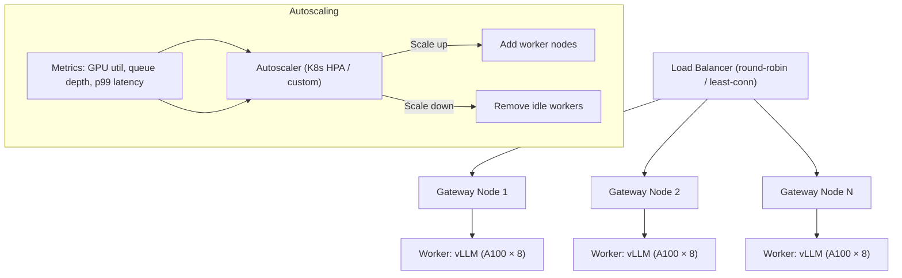

# Inference Systems & Training Data Pipelines

## Overview

Production LLM systems span the full lifecycle from data curation through preference optimization to serving infrastructure. This section covers training data engineering (deduplication, contamination, synthetic data), alignment methods (RLHF, DPO, RLAIF, reward modeling), and production inference systems (serving engines, accelerator management, GPU virtualization, multi-tenant serving, autoscaling, and mixture-of-models routing).

> **Interview Angle**: Questions here test end-to-end system thinking: "design a production LLM serving platform" or "how would you prevent benchmark contamination in training data?" Expect to connect data quality decisions to serving architecture choices.

## Training Data Pipelines

### Data Curation Pipeline

```mermaid
graph TD
    RAW["Raw Web Data (CommonCrawl, etc.)"" 10-100 TB"] --> FILTER["Quality Filtering"" URL/page quality, language ID, classifier"]
    FILTER --> DEDUP["Deduplication"" Exact + fuzzy + semantic"]
    DEDUP --> CONTAM["Contamination Removal"" Benchmark/benchmark-like filtering"]
    CONTAM --> DECONT["Decontamination"" N-gram overlap removal"]
    DECONT --> MIX["Data Mixing"" Domain-weighted sampling"]
    MIX --> TOKEN["Tokenization & Packing"" EOT-aware packing"]
    TOKEN --> SHARD["Sharded Training Datasets"" ~10 TB processed"]
```

### Dataset Deduplication

Deduplication is critical for three reasons: (1) duplicated data causes the model to memorize common internet text rather than generalize, (2) it wastes compute on redundant examples, and (3) it inflates evaluation benchmarks if test data appears in training.

| Deduplication Method | Technique | Scalability | Effectiveness |
|---|---|---|---|
| **Exact dedup** | Hash (SHA-256) of document content | O(N) — trivially parallel | Removes exact copies only |
| **MinHash LSH** | Jaccard similarity via locality-sensitive hashing | O(N) with LSH | Catches near-duplicates (reposts, scraped mirrors) |
| **Suffix array dedup** | Suffix array on concatenated documents, find repeated substrings | O(N log N) | Catches partial overlaps |
| **Semantic dedup** | Embed documents, cluster similar ones, keep centroids | O(N × d) embeddings + clustering | Catches paraphrased duplicates |

```python
# MinHash-based approximate deduplication
import datasketch

def deduplicate_documents(documents: list[str], threshold=0.8, num_perm=128):
    lsh = datasketch.MinHashLSH(threshold=threshold, num_perm=num_perm)
    minhashes = []
    unique_docs = []
    
    for doc in documents:
        # Create MinHash signature for the document
        m = datasketch.MinHash(num_perm=num_perm)
        for shingle in get_shingles(doc, k=5):  # 5-gram shingles
            m.update(shingle.encode())
        
        # Check if similar document already seen
        if not lsh.query(m):
            lsh.insert(str(len(unique_docs)), m)
            unique_docs.append(doc)
        minhashes.append(m)
    
    return unique_docs  # Deduplicated corpus
```

### Data Contamination

Data contamination occurs when evaluation benchmark data leaks into the training set, making benchmark scores unreliable.

**Detection methods:**
- **N-gram overlap**: Compute n-gram overlap between training documents and benchmark examples. If any 13-gram from a benchmark appears in training, flag it.
- **Embedding similarity**: Compute embedding similarity between training chunks and benchmark questions. Flag pairs above a threshold.
- **Perplexity-based**: A model trained on contaminated data will have anomalously low perplexity on benchmark prompts.

**Mitigation strategies:**

| Strategy | How It Works | Trade-off |
|---|---|---|
| Pre-training filtering | Remove documents with high n-gram overlap with benchmarks | May remove legitimate data that happens to contain similar content |
| Post-hoc evaluation | Report contaminated vs. uncontaminated benchmark scores | Doesn't fix the model, just provides honest metrics |
| Held-out benchmarks | Maintain private benchmarks not publicly available | Expensive to curate, not scalable |
| Dynamic benchmarks | Use ever-changing benchmarks (code contests, new QA) | Hard to automate evaluation |

### Synthetic Data

Synthetic data generation uses strong models to create training data for smaller or newer models:

```mermaid
graph TD
    TEACHER["Teacher Model (GPT-4, Claude, etc.)""  "] --> GEN["Generate Responses""  "]
    GEN --> FILTER2["Quality Filtering""  "]
    FILTER2 --> DIVERSE["Diversity Filtering""  "]
    DIVERSE --> STUDENT["Student Training Data""  "]
    
    subgraph "Generation Strategies"
        S1["Self-Instruct: Model generates its own instructions""  "]
        S2["Evol-Instruct: Iteratively increase complexity""  "]
        S3["Reverse instruction: Generate Q from A pairs""  "]
        S4["Domain-specific: Generate data for target domain""  "]
    end
    
    GEN --> S1 & S2 & S3 & S4
```

| Synthetic Data Approach | Example | Key Idea |
|---|---|---|
| **Self-Instruct** (Wang et al.) | Alpaca | Seed instructions → LLM generates more instructions → filter → fine-tune |
| **Evol-Instruct** | WizardLM | Iteratively rewrite instructions to be more complex |
| **Orca** | Microsoft Orca | GPT-4 generates detailed reasoning traces for smaller model training |
| **Phi** | Microsoft Phi-1/2 | "Textbook quality" synthetic data curated for reasoning |
| **Magpie** | Magpie | Use LLM's own template-preference as synthetic instruction signal |

**Risks:** Model collapse (training on own outputs degrades quality over generations), distribution shift (synthetic data may not cover the full real-world distribution), and quality control (synthetic data can contain plausible-sounding but incorrect information).

## Preference Optimization

### RLHF (Reinforcement Learning from Human Feedback)

```mermaid
graph TD
    subgraph "RLHF Pipeline"
        SFT["Step 1: SFT Model""  "] --> GEN_PREF["Step 2: Generate Pairs""  "]
        GEN_PREF --> HUMAN["Step 3: Human Annotations""  "]
        HUMAN --> REWARD["Step 4: Train Reward Model""  "]
        REWARD --> PPO["Step 5: PPO Optimization""  "]
        PPO --> ALIGNED["Aligned Model""  "]
    end
```

**Step-by-step:**
1. **SFT**: Fine-tune base model on human-written demonstrations
2. **Preference collection**: Generate multiple responses per prompt, humans rank them
3. **Reward model**: Train a model to predict human preference (Bradley-Terry model)
4. **PPO**: Optimize the policy (LLM) to maximize reward while staying close to the SFT model (KL penalty)

```python
# Simplified PPO objective for RLHF
# L = E[r(x,y) - β * KL(π_θ || π_ref)]

def ppo_loss(old_logprobs, new_logprobs, rewards, values, 
             kl_coeff=0.1, clip_eps=0.2):
    """PPO-clip objective used in RLHF."""
    # Advantages: how much better than expected
    advantages = rewards - values
    advantages = (advantages - advantages.mean()) / (advantages.std() + 1e-8)
    
    # Importance sampling ratio
    ratio = torch.exp(new_logprobs - old_logprobs)
    
    # Clipped surrogate objective
    surr1 = ratio * advantages
    surr2 = torch.clamp(ratio, 1 - clip_eps, 1 + clip_eps) * advantages
    policy_loss = -torch.min(surr1, surr2).mean()
    
    # KL divergence penalty (keeps model close to reference)
    kl_loss = kl_coeff * (new_logprobs - old_logprobs - 
                           (rewards - values)).mean()
    
    return policy_loss + kl_loss
```

### DPO (Direct Preference Optimization)

DPO (Rafailov et al., 2023) eliminates the reward model and PPO training loop by directly optimizing the policy from preference pairs:

```python
def dpo_loss(policy_chosen_logprobs, policy_rejected_logprobs,
             ref_chosen_logprobs, ref_rejected_logprobs, beta=0.1):
    """
    DPO loss: -log σ(β * (log π_θ(y_w|x)/π_ref(y_w|x) - log π_θ(y_l|x)/π_ref(y_l|x)))
    
    Intuitively: increase probability of chosen response relative to rejected,
    weighted by how much the reference model already prefers chosen.
    """
    # Log probability ratios
    chosen_logratios = policy_chosen_logprobs - ref_chosen_logprobs
    rejected_logratios = policy_rejected_logprobs - ref_rejected_logprobs
    
    # DPO loss
    logits = beta * (chosen_logratios - rejected_logratios)
    loss = -F.logsigmoid(logits).mean()
    
    # Optional: add a margin or label smoothing
    return loss
```

| Property | RLHF | DPO |
|---|---|---|
| Reward model | Required (separate training) | Not required |
| Training complexity | High (PPO + reward model + 4 models) | Low (single model, single pass) |
| Compute cost | 3-4× SFT cost | ~1× SFT cost |
| Quality ceiling | Higher (can explore via sampling) | Lower (no exploration) |
| Stability | Requires careful PPO tuning | Stable (standard supervised training) |
| Used by | OpenAI (GPT-4), Anthropic | Mistral, many open-source models |

### RLAIF (AI Feedback)

RLAIF replaces human annotators with an AI model (typically GPT-4 or Claude) for generating preference labels. The pipeline is identical to RLHF but step 3 uses AI annotation instead of human annotation.

| Aspect | RLHF | RLAIF |
|---|---|---|
| Annotation cost | $0.50-5.00 per comparison | $0.01-0.10 per comparison |
| Annotation speed | ~100 pairs/hour/annotator | ~1000+ pairs/minute |
| Annotation consistency | Variable (inter-annotator agreement 60-75%) | Consistent (but may have systematic biases) |
| Bias | Human cultural/linguistic bias | Teacher model's bias + sycophancy |
| Quality | High (for well-designed annotation guidelines) | Good for many tasks, worse for subjective preferences |

### Reward Modeling

The reward model maps (prompt, response) pairs to scalar scores. It's trained on human (or AI) preference comparisons using the Bradley-Terry model:

```python
# Bradley-Terry reward model training
# P(y_w > y_l | x) = σ(r(x, y_w) - r(x, y_l))

def reward_model_loss(reward_chosen, reward_rejected):
    """
    Train reward model to assign higher scores to chosen responses.
    reward_chosen, reward_rejected: [batch] scalar rewards
    """
    return -F.logsigmoid(reward_chosen - reward_rejected).mean()
```

A well-trained reward model correlates ~0.7-0.85 with human preferences on held-out comparisons. Reward model quality is the primary bottleneck for RLHF — a biased or poorly trained reward model leads to reward hacking (the model finds ways to get high reward without actually being helpful).

## Inference Serving Stacks

### Serving Engine Comparison

| Engine | Creator | Key Feature | Quantization | Batching | Production Readiness |
|---|---|---|---|---|
| **vLLM** | UC Berkeley | PagedAttention, continuous batching | GPTQ, AWQ, FP8 | Continuous | High (widely deployed) |
| **TensorRT-LLM** | NVIDIA | Maximum GPU performance, Triton kernels | INT8, INT4, FP8 | Continuous | High (NVIDIA ecosystem) |
| **SGLang** | UC Berkeley | RadixAttention prefix caching | AWQ, GPTQ | Continuous | Medium-high |
| **llama.cpp** | Georgi Gerganov | CPU/GPU hybrid, edge deployment | Q4_K_M, Q5_K, etc. | Dynamic | High (local/inference) |
| **TGI** | HuggingFace | Production serving with HF ecosystem | GPTQ, bitsandbytes | Continuous | High |
| **Triton Inference Server** | NVIDIA | Multi-framework serving (not just LLM) | Via custom backends | Dynamic | Very high |
| **LMStudio/Ollama** | Community | Developer-friendly local inference | GGUF formats | Single request | High (local) |

### vLLM Internals

```mermaid
graph TD
    subgraph "vLLM Architecture"
        REQ["Incoming Requests""] --> SCHED["Scheduler""  "]
        SCHED --> CACHE["KV Cache Manager""  "]
        CACHE --> EXEC["GPU Worker (PagedAttention)""  "]
        EXEC --> OUTPUT["Token Outputs""]
        
        subgraph "Scheduler Decisions"
            PREEMPT["Preemption Policy""  "]
            PRIOR["Priority Scheduling""  "]
            SWAP["CPU-GPU KV Swap""  "]
        end
        
        SCHED --> PREEMPT & PRIOR & SWAP
    end
```

vLLM's scheduler uses a **first-come-first-served** policy with preemption: when memory is full, it preemptively evicts the lowest-priority request's KV cache (saving it to CPU if configured), freeing blocks for new requests. Preempted requests are re-scheduled when memory becomes available.

### TensorRT-LLM Internals

TensorRT-LLM (TRT-LLM) is NVIDIA's highest-performance inference engine. It compiles model graphs into optimized CUDA kernels at build time:

1. **Model conversion**: Convert HF model → TRT-LLM format (ONNX → TensorRT engine)
2. **Kernel selection**: Choose optimal kernels (FlashAttention-2/3, fused layers, GEMM kernels)
3. **Memory planning**: Pre-allocate all tensor memory, eliminate dynamic allocation
4. **Graph optimization**: Fuse layer norm + attention + FFN, eliminate redundant operations
5. **Build engine**: Compile into a serialized engine file that loads instantly at runtime

TRT-LLM achieves 1.3-2× higher throughput than vLLM on NVIDIA GPUs due to deeper kernel fusion and more aggressive memory planning, but requires a compilation step (minutes to hours) and is less flexible for dynamic workloads.

### llama.cpp and GGUF Format

llama.cpp enables LLM inference on CPUs (with optional GPU acceleration) using the GGUF quantization format:

| GGUF Format | Effective Bits | Quality | Speed (CPU) | Use Case |
|---|---|---|---|---|
| Q4_K_M | ~4.7 | Good | Fast | Default choice for 4-bit |
| Q5_K_M | ~5.6 | Very good | Medium-fast | Quality-focused |
| Q8_0 | 8.0 | Near-lossless | Slower | When quality matters most |
| F16 | 16 | Perfect | Slow (memory bound) | Debugging/baseline |
| IQ4_XS | ~3.9 | Acceptable | Very fast | Maximum compression |

llama.cpp uses **k-quants**: different bit-widths for different parts of the weight matrix. Important weights (large magnitude) get more bits, less important weights get fewer bits. This is more nuanced than uniform INT4.

## CPU/GPU/TPU Inference

| Accelerator | Strength | Weakness | Best For |
|---|---|---|---|
| **NVIDIA GPU (H100/A100)** | Highest throughput, best ecosystem | Expensive, power-hungry | Cloud serving, training |
| **AMD GPU (MI300X)** | 192 GB HBM, good FP16/INT8 | Smaller software ecosystem | Cost-effective cloud serving |
| **Apple Silicon (M2/M3/M4)** | Unified memory (up to 192 GB), good efficiency | Lower raw throughput | Local inference, developer tools |
| **Google TPU v5p** | High bfloat16 throughput, efficient for transformers | Limited to Google Cloud, less flexible | Google Cloud training + serving |
| **Intel Gaudi** | Good price/performance, built-in networking | Immature software stack | Cost-sensitive training |
| **CPU (x86/ARM)** | Ubiquitous, large memory, cheap | 10-50× slower than GPU | Edge, local, low-throughput |

### GPU Virtualization

| Method | Isolation | Performance | GPU Utilization | Use Case |
|---|---|---|---|---|
| **Passthrough (SR-IOV)** | Hardware-level | Near-native | 1 GPU per VM | Dedicated workloads |
| **MIG (Multi-Instance GPU)** | Hardware partitioning | Native | A100: 7 instances | Mixed GPU workloads |
| **Time-slicing** | Process-level | Near-native (no isolation) | 100% | Internal multi-tenant |
| **vGPU (NVIDIA vGPU)** | Driver-level | Good | 1-16 vGPUs per GPU | Enterprise VDI/AI |
| **MPS (Multi-Process Service)** | Process-level | Good | Near 100% | Single-node multi-tenant |

NVIDIA MIG (Multi-Instance GPU) partitions an A100/H100 into up to 7 hardware-isolated instances, each with dedicated SMs, L2 cache, and memory bandwidth. This enables true multi-tenant serving where one customer's workload cannot affect another's latency.

## Multi-Tenant Serving & Autoscaling

### Serving Architecture



### Autoscaling Strategies for LLM Serving

| Strategy | Scale-Up Trigger | Scale-Down Trigger | Cold Start Penalty |
|---|---|---|---|
| **Queue-based** | Queue depth > threshold | Queue empty for T seconds | Model load time (10-60s) |
| **Latency-based** | p99 TTFT > SLO | p99 TTFT < SLO/2 for T | Model load time |
| **Predictive** | Predicted load increase | Predicted load decrease | Pre-warmed instances (no penalty) |
| **Pre-warmed pool** | Spill from warm pool | Return to pool | Minimal (instance already loaded) |

**Cold start problem**: Loading a 70B model takes 30-90 seconds (reading from disk, allocating GPU memory, warming up kernels). This is unacceptable for user-facing applications. Solutions: (1) maintain a pre-warmed pool of instances, (2) use smaller models as fallback during cold start, (3) implement model caching on local SSDs to reduce load time.

### Model Caching and Routing

```python
@dataclass
class ModelRouter:
    """Routes requests to appropriate model instances."""
    models: dict[str, ModelInstance]  # model_name -> instance
    routing_policy: str  # "simple", "cascade", "cost-optimized"
    
    def route(self, request: Request) -> ModelInstance:
        if self.routing_policy == "cascade":
            return self._cascade_route(request)
        elif self.routing_policy == "cost-optimized":
            return self._cost_route(request)
        return self.models[request.model_name]
    
    def _cascade_route(self, request):
        """Try cheapest model first, escalate if quality is insufficient."""
        for model in self.models_by_cost():  # Cheapest first
            if model.can_handle(request):  # Check complexity, confidence
                return model
        return self.models["premium"]  # Fallback to best model
```

## Mixture-of-Models and Model Cascades

### Mixture-of-Models (MoM)

Different models handle different types of requests based on complexity, cost, and latency requirements:

```mermaid
graph TD
    REQ_ALL["All Incoming Requests""] --> CLASS["Request Classifier""  "]
    
    CLASS --> |"Simple (FAQ, summarization)""  "| SMALL["Small Model (8B)""  $0.10/1M tokens
Fast, cheap""]
    CLASS --> |"Medium (code, analysis)""  "| MED["Medium Model (70B)""  $1.00/1M tokens
Balanced""]
    CLASS --> |"Complex (reasoning, math)""  "| LARGE["Large Model (405B)""  $10/1M tokens
Best quality""]
    
    SMALL --> FALLBACK["Fallback: If confidence < threshold, escalate""  "]
    FALLBACK --> MED
    MED --> FALLBACK2["Fallback: If confidence < threshold, escalate""  "]
    FALLBACK2 --> LARGE
```

### Model Cascade

A cascade processes each request through models of increasing capability, stopping early if the current model produces a confident, high-quality response:

| Cascade Level | Model | Handles | Cost | Latency |
|---|---|---|---|---|
| 1 | 8B (Llama 3 8B) | ~60% of requests | $0.10/1M | ~200ms TTFT |
| 2 | 70B (Llama 3 70B) | ~30% of requests | $1.00/1M | ~500ms TTFT |
| 3 | 405B (Llama 3.1 405B) | ~10% of requests | $10/1M | ~2s TTFT |

**Cost savings**: If 60% of traffic is handled by the 8B model, average cost per request drops from $10 to ~$4.3 (a 57% reduction). The key challenge is building a reliable classifier that doesn't misroute complex requests to the small model.

### Confidence-Based Routing

```python
def cascade_inference(request, models: list, confidence_threshold=0.9):
    """Process request through model cascade."""
    for model in models:  # Ordered from smallest to largest
        response = model.generate(request)
        confidence = model.estimate_confidence(request, response)
        
        if confidence >= confidence_threshold:
            return response  # Good enough, stop here
        
        # Low confidence — escalate to next (larger) model
        logger.info(f"Escalating to {model.name} (confidence={confidence:.2f})")
    
    return response  # Return last model's output regardless
```

Confidence estimation methods include: log probability of the generated tokens (high avg logprob = confident), semantic similarity between multiple sampled responses (high agreement = confident), and verification via a separate judge model.

## Interview Questions

### Q1: Design a production LLM serving system for a chat application.
**Answer:** Start with model selection (70B with INT4 quantization for quality-cost balance). Use vLLM with PagedAttention and continuous batching for high throughput. Deploy behind a load balancer with multiple GPU worker nodes. Implement prefix caching for the system prompt. Use autoscaling based on queue depth and p99 TTFT with pre-warmed instances to avoid cold start. Consider a model cascade: 8B model for simple queries, 70B for complex ones. Implement request timeouts, retries, and fallback to a cached response for overloaded scenarios. Monitor GPU utilization, KV cache usage, and per-request latency percentiles.

### Q2: How does DPO differ from RLHF and when would you choose each?
**Answer:** RLHF trains a separate reward model on human preferences, then uses PPO to optimize the LLM policy against that reward. DPO reformulates the same objective as a supervised learning problem — directly optimizing the policy from preference pairs without a reward model. Choose DPO when you have limited compute, need stability, and have enough preference pairs. Choose RLHF when you need the best possible quality (the reward model + PLO enables exploration that DPO can't match), have the engineering resources, and are training at scale. In practice, most open-source models use DPO due to simplicity, while frontier models (GPT-4, Claude) likely use RLHF or hybrid approaches.

### Q3: How would you prevent data contamination in a pre-training corpus?
**Answer:** Three layers: (1) Maintain a comprehensive list of benchmark datasets and their n-gram fingerprints. Before training, scan the corpus for 13-gram overlap with any benchmark — remove or mask matching documents. (2) Use MinHash-based deduplication to remove near-duplicates that might be slightly modified benchmark leaks. (3) After training, evaluate on both standard and dynamically-generated benchmarks to detect contamination. Report both scores. For production systems, maintain private held-out evaluation sets that are never committed to any codebase or shared externally.

### Q4: Explain how a model cascade reduces cost.
**Answer:** A model cascade routes each request through models of increasing capability (e.g., 8B → 70B → 405B). The majority of requests (~60-80%) are simple and handled by the cheap small model. Only complex requests escalate to expensive models. If a small model handles 70% of traffic at $0.10/1M tokens and a large model handles 30% at $10/1M tokens, the weighted average cost is ~$3.07/1M — a ~97% reduction from using only the large model. The key risk is misrouting: if the classifier sends a complex request to the small model, quality suffers. Mitigate with confidence thresholds and fallback logic.

## Common Mistakes

- ❌ Ignoring cold start time in autoscaling design (model loading takes 30-90 seconds)
- ❌ Using unbounded batching without latency SLOs (batch size must adapt to maintain TTFT)
- ❌ Not deduplicating training data (wastes compute, inflates benchmarks, causes memorization)
- ❌ Training reward models on too few comparisons (<10K pairs → reward hacking)
- ❌ Using DPO with low-quality preference data (garbage in, garbage out — DPO can't fix bad data)
- ❌ Deploying a single model size for all requests (mixture-of-models can cut costs 3-10×)

## Summary

Production inference systems combine data engineering (dedup, contamination prevention, synthetic data), alignment (RLHF/DPO/RLAIF), and serving infrastructure (vLLM/TRT-LLM with PagedAttention, continuous batching, prefix caching). Multi-tenant serving requires GPU virtualization (MIG), autoscaling with pre-warmed instances, and latency-aware scheduling. Model cascades and mixture-of-models route requests to cost-appropriate models, achieving 3-10× cost reduction. Understanding the full stack — from training data quality to serving architecture — is essential for designing reliable AI systems.

## References

1. Rafailov et al., "Direct Preference Optimization: Your Language Model is Secretly a Reward Model", NeurIPS 2023
2. Ouyang et al., "Training language models to follow instructions with human feedback" (InstructGPT), NeurIPS 2022
3. Lee et al., "RLAIF: Scaling RLHF with AI Feedback", arXiv 2023
4. Kwon et al., "Efficient Memory Management for Large Language Model Serving with PagedAttention", SOSP 2023
5. Wu et al., "SGLang: Efficient Structured Text Generation with Frontend-Aware Compilation", 2024
6. Intel et al., "MinHash for Dummies", 2017 (MinHash/LSH deduplication)

## Cross-References

- [Transformer Internals →](transformer-internals.md) FlashAttention, paged attention
- [Training Advanced →](training-advanced.md) Distributed training, parallelism
- [Quantization Advanced →](quantization-advanced.md) GPTQ, AWQ, FP8
- [RAG Advanced →](rag-advanced.md) Advanced retrieval systems
- [Agent Systems →](agent-systems.md) Agentic inference patterns
- [LLM Serving →](../llm-serving/README.md) Serving fundamentals
- [SFT →](../llm-serving/sft.md) Supervised fine-tuning
- [RLHF →](../llm-serving/rlhf.md) RLHF details
- [vLLM →](../llm-serving/vllm.md) vLLM internals
- [TensorRT →](../llm-serving/tensorrt.md) TensorRT-LLM