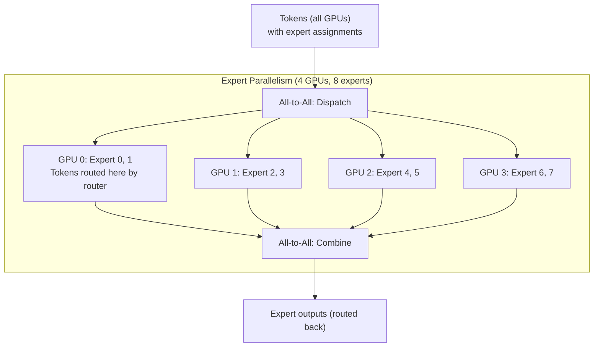

# Advanced Quantization & Sparsity

## Overview

Quantization reduces model size and inference cost by representing weights and activations with fewer bits. This section covers post-training quantization algorithms (GPTQ, AWQ, SmoothQuant), mixed-precision training and inference (FP8, BF16, INT8, INT4), structured and unstructured sparsity, and how these techniques interact with Mixture-of-Experts architectures including expert parallelism and load balancing.

> **Interview Angle**: Expect questions like "explain GPTQ's algorithm" or "why is INT4 quantization harder than INT8?" or "how does FP8 work on H100s?" These test understanding of numerical precision as a first-class system design knob.

## Quantization Fundamentals

### Linear Quantization

The core operation maps a floating-point tensor to integers using scale and zero-point parameters:

```python
def linear_quantize(x: Tensor, bits: int) -> tuple[Tensor, float, float]:
    """
    Quantize FP16/BF16 tensor to INT{bits}.
    Returns: (quantized_tensor, scale, zero_point)
    """
    qmin = -(2 ** (bits - 1))      # e.g., -8 for INT8
    qmax = 2 ** (bits - 1) - 1     # e.g., 7 for INT8
    
    scale = (x.max() - x.min()) / (qmax - qmin)
    zero_point = qmin - (x.min() / scale)
    
    x_q = torch.clamp(torch.round(x / scale + zero_point), qmin, qmax)
    return x_q.to(torch.int8), scale, zero_point

def dequantize(x_q: Tensor, scale: float, zero_point: float) -> Tensor:
    return (x_q.float() - zero_point) * scale
```

### Symmetric vs. Asymmetric Quantization

| Property | Symmetric | Asymmetric |
|---|---|---|
| Range | [-max_abs, max_abs] | [min_val, max_val] |
| Zero point | Always 0 | Can be non-zero |
| Hardware support | Simpler (multiply only) | Requires add + multiply |
| Typical use | Weights | Activations |

### Per-Tensor vs. Per-Channel Quantization

| Granularity | Scale Parameters | Quality | Overhead |
|---|---|---|---|
| Per-tensor | 1 scale + 1 zero-point per tensor | Low (one scale for all channels) | Minimal |
| Per-channel (row-wise) | 1 scale per output channel | Medium | Small |
| Per-group | 1 scale per group of 32/128 elements | High | Moderate (store group scales) |

Per-group quantization (group size 32-128) is critical for INT4: with only 16 distinct values, fine-grained scaling preserves quality much better than a single global scale.

## Post-Training Quantization (PTQ)

### GPTQ

GPTQ (Frantar et al., 2022) quantizes weights layer-by-layer using approximate second-order information (Hessian) to minimize the reconstruction error of the layer output.

**Algorithm overview:**
1. For each layer, collect calibration data (typically 128-1024 sequences)
2. Compute the inverse Hessian H^(-1) of the layer's input (approximated as H = 2X^TX where X is the input)
3. Quantize weights column by column (one output feature at a time)
4. For each column, use Cholesky decomposition of H^(-1) to compute the optimal rounding that minimizes output error
5. After quantizing a column, update the error that will be propagated to subsequent columns

```python
def gptq_quantize_layer(weight, calibration_input, bits=4, block_size=128):
    """
    Simplified GPTQ algorithm for one linear layer.
    weight: [out_features, in_features]
    calibration_input: [num_samples, in_features]
    """
    n_rows, n_cols = weight.shape
    H = 2 * (calibration_input.T @ calibration_input) / calibration_input.shape[0]
    H_inv = torch.inverse(H)  # In practice: Cholesky decomposition
    
    Q = torch.zeros_like(weight)  # Quantized weights
    E = torch.zeros_like(weight)  # Error accumulation
    
    for i in range(n_cols):
        # Quantize column i
        w_col = weight[:, i] + E[:, i]  # Original weight + propagated error
        q_col = quantize_per_group(w_col, bits, block_size)
        Q[:, i] = q_col
        
        # Compute quantization error
        E[:, i] = (w_col - dequantize(q_col, bits, block_size))
        
        # Propagate error to unquantized columns
        E[:, i+1:] -= H_inv[i+1:, i].unsqueeze(0) * E[:, i].unsqueeze(1)
    
    return Q
```

**Key properties:**
- Runs in a single pass over calibration data (minutes, not hours)
- Preserves output quality because it minimizes the *layer output* error, not weight error
- Group size 128 provides the best accuracy-efficiency trade-off for INT4
- Supported by AutoGPTQ, ExLlamaV2, vLLM, TensorRT-LLM

### AWQ (Activation-Aware Weight Quantization)

AWQ (Lin et al., 2023) observes that a small fraction of "salient" weight channels (those corresponding to large input activations) are critical for model quality. Rather than quantizing all weights uniformly, AWQ **protects** the salient channels by scaling them before quantization.

```python
def awq_quantize(weight, activation_scale, bits=4, group_size=128, alpha=0.5):
    """
    AWQ: Scale weight channels by input activation magnitude before quantizing.
    activation_scale: per-input-channel scaling derived from calibration data.
    """
    # Step 1: Identify salient channels (top alpha fraction by activation magnitude)
    salient_mask = activation_scale > torch.quantile(activation_scale, 1 - alpha)
    
    # Step 2: Compute per-channel scaling factor s = |X|^alpha
    s = activation_scale.pow(alpha)
    
    # Step 3: Scale weights: W' = W * s (make salient channels larger)
    weight_scaled = weight * s.unsqueeze(0)
    
    # Step 4: Quantize the scaled weights
    Q = quantize_per_group(weight_scaled, bits, group_size)
    
    # Step 5: At runtime, divide by s: output = (Q/s) @ x
    # In practice, s is fused into the dequantization step
    return Q, s
```

**AWQ vs. GPTQ:**

| Property | GPTQ | AWQ |
|---|---|---|
| Core idea | Minimize output error using Hessian | Scale salient channels before quantization |
| Calibration data | 128-1024 samples | 128-512 samples |
| Compute cost | Higher (Hessian inversion) | Lower (activation statistics only) |
| INT4 quality | Good | Slightly better on some benchmarks |
| Runtime cost | Same (dequantize + matmul) | Same (scaling fused into dequant) |
| Hardware support | vLLM, TRT-LLM, ExLlamaV2 | vLLM, TRT-LLM, TensorRT-LLM native |

### SmoothQuant

SmoothQuant (Xiao et al., 2023) addresses **activation quantization** difficulty. While weights have a relatively stable distribution, activations vary wildly across tokens and layers, making them hard to quantize. SmoothQuant migrates the quantization difficulty from activations to weights using a mathematically equivalent transformation.

```python
def smooth_quant(layer, calibration_input, alpha=0.5):
    """
    Transform Y = XW into Y = (X diag(s)^-1) (diag(s) W)
    = X' W'
    where s redistributes quantization difficulty.
    """
    # Compute per-channel activation range
    X_max = calibration_input.abs().max(dim=0).values  # [in_features]
    W_max = layer.weight.abs().max(dim=1).values       # [out_features]
    
    # Compute smoothing factor: s = max(|X|)^alpha / max(|W|)^(1-alpha)
    s = X_max.pow(alpha) / W_max.pow(1 - alpha).unsqueeze(0)
    s = torch.clamp(s, min=1e-5)
    
    # Apply: W' = diag(s) * W, X' = X * diag(s)^-1
    new_weight = layer.weight * s.unsqueeze(0)
    
    # At runtime, activation input is divided by s (can be fused into preceding layer norm)
    return new_weight, 1.0 / s
```

**Why this works:** By choosing α appropriately, activations become more uniform (easier to quantize) while weights absorb the variation. Since weights are static, they can be quantized offline with careful calibration, while activations are quantized online with simple per-tensor scales.

## Mixed Precision

### Precision Landscape

| Format | Bits | Range | Mantissa Bits | Special Values | Hardware | Use Case |
|---|---|---|---|---|---|---|
| FP32 | 32 | ±3.4×10^38 | 23 | Inf, NaN | All GPUs | Training (legacy), numerical stability |
| BF16 | 16 | ±3.4×10^38 | 7 | Inf, NaN | A100+, TPU | Training (preferred), same range as FP32 |
| FP16 | 16 | ±65,504 | 10 | Inf, NaN | All GPUs | Inference, mixed-precision training |
| FP8 E4M3 | 8 | ±448 | 3 | Inf, NaN | H100+ | Forward pass, inference |
| FP8 E5M2 | 8 | ±57,344 | 2 | Inf, NaN | H100+ | Backward pass (gradients) |
| INT8 | 8 | [-128, 127] | N/A (integer) | N/A | All GPUs | Quantized inference |
| INT4 | 4 | [-8, 7] | N/A (integer) | N/A | All GPUs | Aggressively quantized inference |

### FP8 on H100

NVIDIA H100 introduces FP8 with two formats:

- **E4M3 (FP8)**: 4 exponent bits, 3 mantissa bits. Used for forward pass and inference. Has more precision but smaller dynamic range.
- **E5M2 (FP8)**: 5 exponent bits, 2 mantissa bits. Used for backward pass (gradients). Has less precision but larger dynamic range.

```python
# FP8 training with Transformer Engine (NVIDIA)
from transformer_engine.pytorch import fp8_autocast

with fp8_autocast(enabled=True, fp8_format=hp.FP8Format.E4M3):
    # Forward pass uses E4M3
    output = model(input_ids)
    loss = criterion(output, labels)

with fp8_autocast(enabled=True, fp8_format=hp.FP8Format.E5M2):
    # Backward pass uses E5M2 for gradients
    loss.backward()
```

**FP8 scaling:** FP8 requires dynamic scaling to prevent overflow/underflow. The Transformer Engine maintains per-tensor scaling factors and uses delayed scaling (compute scaling factor from the previous iteration's statistics, apply to the current iteration) to avoid extra synchronization.

### BF16 vs. FP16

| Property | BF16 | FP16 |
|---|---|---|
| Exponent bits | 8 (same as FP32) | 5 |
| Mantissa bits | 7 | 10 |
| Dynamic range | ±3.4×10^38 (same as FP32) | ±65,504 |
| Precision | Lower (3 decimal digits) | Higher (4 decimal digits) |
| Overflow risk | Very low | Significant (needs loss scaling) |
| Training stability | Better | Requires loss scaling |
| Hardware | A100+, TPU v3+ | All GPUs |

BF16 is preferred for training because its exponent range matches FP32, eliminating overflow concerns. FP16 requires loss scaling (multiply loss by a large factor before backward, unscale gradients after) to prevent gradient underflow.

## Structured and Unstructured Sparsity

### Unstructured Sparsity

Set individual weight elements to zero based on magnitude pruning:

```python
def magnitude_prune(weight, sparsity=0.5):
    """Prune the smallest 50% of weights by magnitude."""
    threshold = torch.quantile(weight.abs(), sparsity)
    mask = (weight.abs() > threshold).float()
    return weight * mask, mask
```

**Problem**: Unstructured sparsity doesn't map well to GPU hardware. Sparse matrix operations on GPUs require specialized storage formats (CSR, CSC) and don't achieve significant speedup because the irregular memory access pattern defeats GPU memory coalescing. A 50% sparse model might only be 1.2-1.5× faster, not 2×.

### Structured Sparsity

Prune entire structures (rows, columns, attention heads) to produce dense sub-matrices that GPU hardware can accelerate:

| Sparsity Pattern | What's Pruned | Hardware Benefit | Example |
|---|---|---|---|
| 2:4 structured | 2 of every 4 elements in a block | 2× speedup on H100 sparse tensor cores | NVIDIA Sparse GPT |
| N:M sparsity | N of every M elements | Up to 2× speedup | H100 N:M sparse |
| Head pruning | Entire attention heads | Reduced FLOPs and memory | Movement pruning |
| Layer pruning | Entire transformer layers | Reduced compute and memory | LiteTransformer |

### 2:4 Structured Sparsity

The H100 GPU supports 2:4 structured sparsity natively in hardware: for every block of 4 consecutive weights, exactly 2 are zero. The sparse tensor cores achieve **2× throughput** for these structured sparse matmuls.

```python
def structured_2_4_prune(weight):
    """Prune to 2:4 structured sparsity."""
    # Reshape to groups of 4
    w_reshaped = weight.reshape(-1, 4)
    
    # In each group of 4, zero out the 2 smallest magnitude elements
    _, indices = w_reshaped.abs().sort(dim=-1)
    mask = torch.ones_like(w_reshaped)
    mask.scatter_(1, indices[:, :2], 0)  # Zero smallest 2
    
    return (w_reshaped * mask).reshape(weight.shape), mask.reshape(weight.shape)
```

| Method | Sparsity | Hardware Speedup | Quality Loss |
|---|---|---|---|
| Unstructured 50% | 50% | ~1.2× (no HW support) | Low |
| 2:4 Structured | 50% | ~2× (H100 sparse cores) | Low-moderate |
| 2:4 + GPTQ | 50% sparse + INT4 | ~4× (stacked) | Moderate |

## MoE-Specific Quantization and Parallelism

### Expert Quantization Considerations

In MoE models, experts are natural candidates for differentiated quantization:

- **Expert weights** can be quantized independently (each expert is a separate FFN)
- **Router weights** are tiny (routing layer) and typically kept in full precision
- **Shared expert** (if present, e.g., DeepSeek-V3) may need higher precision since all tokens pass through it
- **Inactive experts** (for a given token) are never loaded — quantization of expert parameters only matters for the active ones

### Expert Parallelism (EP)

Experts are distributed across GPUs. Each GPU holds a subset of experts. Tokens are routed via all-to-all communication:



**Communication cost**: All-to-all dispatch and combine each transfer O(batch × hidden_dim) data. For large batch sizes, this is dominated by bandwidth (not latency), making EP efficient on NVLink-connected GPUs.

### Load Balancing

The central challenge in MoE systems: if tokens are unevenly distributed across experts, some GPUs are overloaded while others idle. This causes **stragglers** that determine overall throughput.

| Load Balancing Strategy | Mechanism | Pros | Cons |
|---|---|---|---|
| **Auxiliary loss** (top-k routing) | Add loss term penalizing uneven expert utilization | Simple, no compute overhead | Loss coefficient is a hyperparameter |
| **Expert choice routing** | Each token selects from experts that also "choose" it (bipartite matching) | Provably balanced | O(T×E) matching cost |
| **Hash routing** | Deterministic hash of token ID → expert | Perfect balance, zero overhead | Ignores token content (quality loss) |
| **Capacity factor** | Hard limit on tokens per expert; overflow tokens are passed through or dropped | Hard guarantee on balance | Dropped tokens lose information |
| **EPLB (Expert-Parallel Load Balancing)** | Dynamic expert placement based on real-time load | Adaptive | More complex orchestration |

```python
# Auxiliary load balancing loss (used by Mixtral, Switch Transformer)
def load_balance_loss(router_logits, num_experts):
    """
    router_logits: [batch, seq, num_experts]
    Penalizes deviation from uniform expert assignment.
    """
    # Fraction of tokens assigned to each expert
    expert_assignment = F.softmax(router_logits, dim=-1)
    tokens_per_expert = expert_assignment.mean(dim=[0, 1])  # [num_experts]
    
    # Fraction of router probability allocated to each expert
    router_prob = F.softmax(router_logits, dim=-1).mean(dim=[0, 1])  # [num_experts]
    
    # Loss: num_experts * sum(p_i * f_i) — minimized when uniform
    loss = num_experts * (tokens_per_expert * router_prob).sum()
    return loss
```

### Combining Quantization with MoE

In practice, MoE models are served with INT4/INT8 quantization on expert weights, FP16 on router weights, and expert parallelism for scaling:

```python
# Example: Quantized MoE inference config
config = {
    "model": "Mixtral-8x7B",
    "expert_quantization": "INT4_AWQ",  # Each expert quantized independently
    "router_precision": "FP16",          # Router stays full precision
    "shared_expert_precision": "FP16",    # Shared expert not quantized
    "expert_parallelism": 4,              # 2 experts per GPU across 4 GPUs
    "kv_cache_quantization": "FP8",      # KV cache in FP8
}
```

## Quantization Comparison Table

| Method | Bits | Weight Quality | Runtime Speedup | Memory Reduction | Calibration Needed? |
|---|---|---|---|---|---|
| FP16 | 16 | Baseline | 1× | 1× | No |
| BF16 | 16 | Baseline | 1× | 1× | No |
| INT8 (dynamic) | 8 | Near-lossless | ~1.5-2× | 2× | No (per-tensor activation scales) |
| INT8 (static) | 8 | Near-lossless | ~1.5-2× | 2× | Yes (calibration set) |
| GPTQ INT4 | 4 | Good | ~2-3× | 4× | Yes (128+ samples) |
| AWQ INT4 | 4 | Good-slightly better | ~2-3× | 4× | Yes (128+ samples) |
| SmoothQuant W8A8 | 8 (both) | Good | ~2× | 2× | Yes (calibration set) |
| 2:4 Sparsity + INT4 | 4 (+ sparsity) | Moderate | ~4× | ~4× | Yes |

## Interview Questions

### Q1: Explain GPTQ's algorithm for INT4 quantization.
**Answer:** GPTQ quantizes weights layer-by-layer, processing one output column at a time. For each column, it uses the inverse Hessian of the layer's input (H = 2X^TX) to determine the optimal rounding that minimizes the output reconstruction error. After quantizing a column, the quantization error is propagated to remaining columns via the Hessian inverse, so subsequent columns compensate for earlier rounding errors. The result is a one-shot quantization that takes minutes (using 128-1024 calibration samples) and produces weights with near-FP16 quality at 4× memory savings. Per-group scaling (group size 128) is essential for INT4 quality.

### Q2: Why is activation quantization harder than weight quantization?
**Answer:** Weights are static and have relatively stable distributions (known at quantization time), so calibration can find good scales. Activations vary dramatically across tokens, layers, and inputs — the same layer can see activations ranging from 0.01 to 100 depending on the input. This large dynamic range means a single per-tensor scale is insufficient, and per-channel/per-token scaling adds compute overhead. SmoothQuant addresses this by mathematically migrating the quantization difficulty from activations to weights via a per-channel scaling transformation.

### Q3: When would you use FP8 vs. INT4?
**Answer:** FP8 is ideal when you have H100/H200 GPUs with FP8 tensor cores and want high quality with 2× speedup over FP16. It's the sweet spot for latency-sensitive serving of premium models. INT4 is for cost-sensitive deployment where 4× memory savings enable larger batch sizes or fitting larger models. INT4 has more quality degradation (especially for long-context or complex reasoning tasks) but is necessary when GPU memory is the bottleneck. FP8 requires no calibration; INT4 GPTQ/AWQ requires calibration data.

### Q4: How does 2:4 structured sparsity achieve hardware speedup?
**Answer:** H100 sparse tensor cores have native support for 2:4 sparsity: they expect every block of 4 weights to have exactly 2 zeros and use a 2-bit mask per block. The hardware skips zero computations entirely, achieving 2× dense throughput. This works because the sparsity pattern is regular and predictable, unlike unstructured sparsity where the hardware would need to maintain and traverse sparse data structures. The key insight is that structured patterns let hardware predict and skip operations efficiently.

### Q5: How does load balancing work in MoE models?
**Answer:** MoE load balancing addresses the problem of uneven token distribution across experts. The most common approach is an auxiliary loss term added during training that penalizes deviation from uniform expert utilization (proportional to the dot product of assignment fraction and router probability fraction). At inference, capacity factors limit the maximum tokens per expert, with overflow handled by passing tokens through a residual or dropping them. More advanced approaches include expert-choice routing (experts select tokens rather than tokens selecting experts, guaranteeing balance via bipartite matching) and EPLB (dynamic expert migration based on real-time load).

## Common Mistakes

- ❌ Using INT4 for KV cache without checking quality impact (activation quantization is harder than weight quantization)
- ❌ Applying unstructured sparsity expecting 2× speedup (GPUs don't accelerate irregular sparsity)
- ❌ Quantizing router weights in MoE (the router is tiny and critical — keep it FP16+)
- ❌ Forgetting that GPTQ/AWQ require calibration data that should match the target distribution
- ❌ Using FP16 for training without loss scaling (use BF16 on A100+)
- ❌ Assuming all quantization methods are equal — GPTQ and AWQ have different strengths

## Summary

Quantization is a critical system design lever. GPTQ and AWQ enable near-lossless INT4 weight quantization through calibration-based optimization. SmoothQuant makes W8A8 (weight + activation quantization) viable by redistributing quantization difficulty. FP8 on H100 provides the best quality-speed trade-off for newer hardware. Structured sparsity (2:4) achieves real hardware speedup on H100 sparse cores. For MoE models, expert-level quantization and expert parallelism combine for efficient serving, with load balancing being the key operational challenge.

## References

1. Frantar et al., "GPTQ: Accurate Post-Training Quantization for Generative Pre-trained Transformers", ICLR 2023
2. Lin et al., "AWQ: Activation-aware Weight Quantization for LLM Compression and Acceleration", EMNLP 2023
3. Xiao et al., "SmoothQuant: Accurate and Efficient Post-Training Quantization for Large Language Models", ICML 2023
4. Dettmers et al., "LLM.int8(): 8-bit Matrix Multiplication for Transformers at Scale", NeurIPS 2022
5. Micikevicius et al., "FP8 Formats for Deep Learning", arXiv 2022
6. Fedus et al., "Switch Transformers: Scaling to Trillion Parameter Models with Simple and Efficient Sparsity", JMLR 2022

## Cross-References

- [Transformer Internals →](transformer-internals.md) FlashAttention and KV cache
- [Training Advanced →](training-advanced.md) Mixed-precision training
- [Inference Systems →](inference-systems.md) Quantization in serving stacks
- [MoE Architecture →](../moe/architecture.md) MoE fundamentals
- [MoE Routing →](../moe/routing.md) Expert routing details
- [Quantization Basics →](../llm-serving/quantization.md) Introduction to quantization