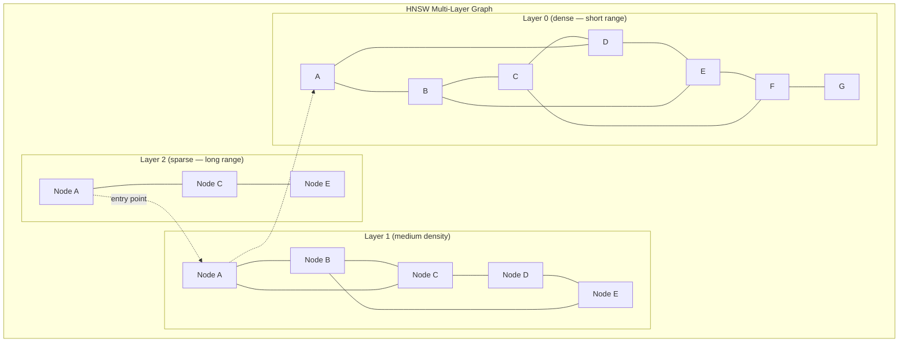
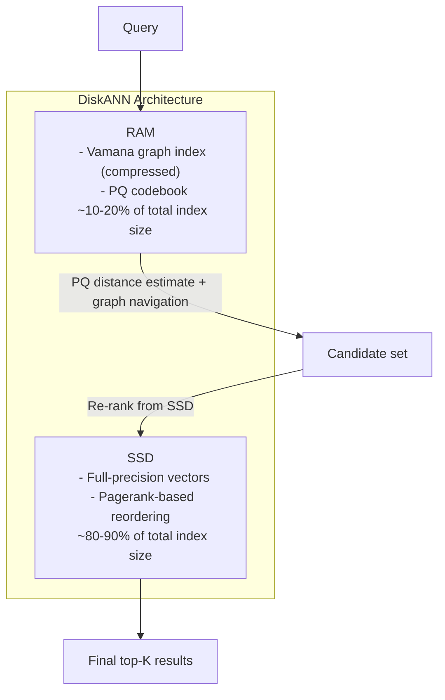
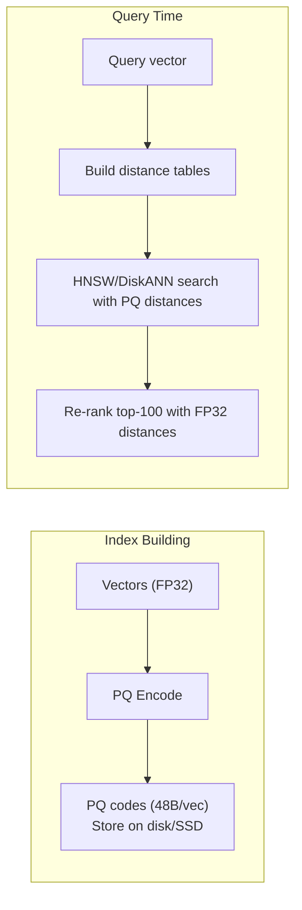
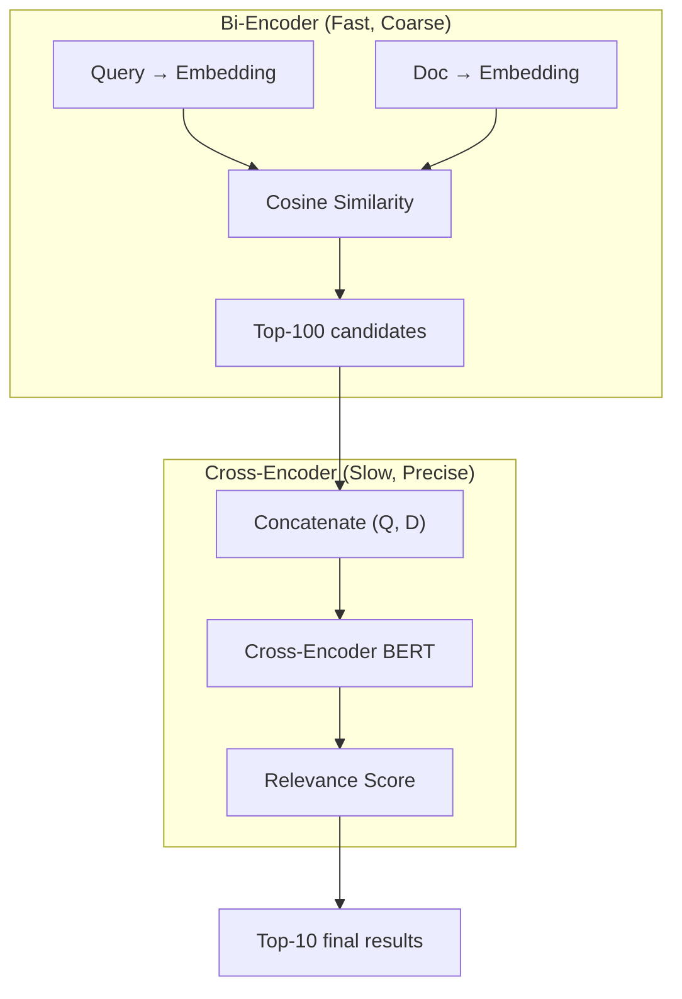
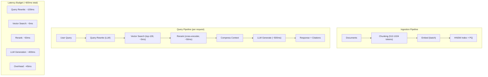

# Advanced RAG Systems

## Overview

Retrieval-Augmented Generation (RAG) at production scale requires sophisticated retrieval architectures, approximate nearest neighbor (ANN) indexes optimized for billion-scale vector databases, and multi-stage retrieval pipelines with reranking. This section covers the systems-level design decisions that determine RAG quality and latency at scale.

> **Interview Angle**: Expect system design questions like "design a RAG system for 100M documents with <100ms retrieval latency" or "how does HNSW work and why is it fast?" These test understanding of the retrieval infrastructure, not just the LLM part.

## RAG Architecture Patterns

### Naive RAG vs. Advanced RAG

```mermaid
graph TD
    subgraph "Naive RAG"
        Q1["Query"] --> EMB1["Embed Query"] --> RET1["Vector Search (top-K)"] --> CTX1["Concatenate docs"] --> LLM1["LLM Generate"]
    end

    subgraph "Advanced RAG"
        Q2["Query"] --> PRE["Query Preprocessing""  
Rewrite, expand, decompose"] --> MULTI["Multi-Stage Retrieval""  
Keyword + Vector + Knowledge Graph"] --> RERANK["Reranker""  
Cross-encoder scoring"] --> COMPRESS["Context Compression""  
Extract relevant passages"] --> LLM2["LLM Generate""  
With citations"]
    end
```

| Component | Naive RAG | Advanced RAG |
|---|---|---|
| Query processing | Raw query | Query rewriting, expansion, decomposition |
| Retrieval | Single vector search | Multi-modal (vector + keyword + structured) |
| Index | Flat or basic ANN | HNSW/DiskANN with quantization |
| Reranking | None | Cross-encoder or LLM-based reranker |
| Context | Raw documents | Compressed, deduplicated, filtered |
| Generation | Simple prompt | Citation-aware, with source attribution |

### Query Processing Strategies

| Strategy | Technique | When Useful |
|---|---|---|
| **Query rewriting** | LLM rephrases user query for better retrieval | Ambiguous or colloquial queries |
| **HyDE** | LLM generates hypothetical answer, embed that instead | When query-answer similarity > query-document similarity |
| **Query decomposition** | Break complex query into sub-queries | Multi-part questions, comparison queries |
| **Step-back prompting** | Abstract the query to a broader concept | Questions requiring background knowledge |
| **Multi-query** | Generate multiple query variants, retrieve for each, merge | Single-query retrieval misses relevant docs |

```python
# HyDE: Hypothetical Document Embedding
def hyde_retrieval(query, embed_model, retriever, llm, k=5):
    # Step 1: Generate a hypothetical answer
    prompt = f"""Write a factual answer to this question.\n\nQuestion: {query}\n\nAnswer:"""
    hypothetical_answer = llm.generate(prompt)
    
    # Step 2: Embed the hypothetical answer (not the query)
    query_embedding = embed_model.embed(hypothetical_answer)
    
    # Step 3: Retrieve using the hypothetical answer embedding
    docs = retriever.search(query_embedding, top_k=k)
    return docs
```

## Approximate Nearest Neighbor (ANN) Indexes

### The Retrieval Problem

Given a query vector q and N document vectors, find the k most similar documents. Exact search requires O(N × d) comparisons — too slow for N > 1M. ANN indexes find approximate nearest neighbors in sub-linear time, trading a small accuracy loss for orders-of-magnitude speedup.

### ANN Index Comparison

| Index | Build Time | Query Latency | Memory | Recall@10 (1M vectors) | Best For |
|---|---|---|---|---|---|
| **Brute Force** | O(1) | O(Nd) | O(Nd) | 100% | Small collections (<100K) |
| **IVF-Flat** | O(Nd × iterations) | O(√N × d) | O(Nd) | ~95% | Medium collections, balanced |
| **IVF-PQ** | O(Nd + PQ training) | O(√N × d/P) | O(Nd/P + codebook) | ~90% | Large collections, memory-constrained |
| **HNSW** | O(N log²N) | O(log N × d) | O(N × M × d) | ~99% | Best quality, moderate scale |
| **DiskANN** | O(N log N) | O(log N × d) | O(N × d/4) on disk | ~97% | Billion-scale, disk-resident |
| **ScaNN** | O(Nd) | O(√N × d) with SIMD | O(Nd) | ~98% | Google Cloud, SIMD-optimized |

### IVF (Inverted File Index)

Partition vectors into clusters using k-means. At query time, search only the nearest clusters (probe):

```python
class IVFIndex:
    def __init__(self, n_clusters=4096, n_probe=64):
        self.n_clusters = n_clusters
        self.n_probe = n_probe  # How many clusters to search
        self.centroids = None    # [n_clusters, d]
        self.inverted_lists = {}  # cluster_id -> list of vectors
    
    def build(self, vectors):
        # Step 1: Cluster vectors
        self.centroids, assignments = kmeans(vectors, self.n_clusters)
        
        # Step 2: Build inverted lists
        for vec, cluster_id in zip(vectors, assignments):
            self.inverted_lists[cluster_id].append(vec)
    
    def search(self, query, k=10):
        # Step 1: Find nearest clusters
        cluster_dists = cosine_distance(query, self.centroids)
        nearest_clusters = cluster_dists.argsort()[:self.n_probe]
        
        # Step 2: Search within those clusters
        candidates = []
        for cid in nearest_clusters:
            for vec in self.inverted_lists[cid]:
                candidates.append((cosine_distance(query, vec), vec))
        
        return sorted(candidates)[:k]
```

**Tuning**: `n_clusters` (more clusters = finer partitioning) and `n_probe` (more probes = higher recall but slower). Typical: 4096 clusters, 32-128 probes for 1M vectors.

### HNSW (Hierarchical Navigable Small World)

HNSW (Malkov & Yashunin, 2018) builds a multi-layer graph where each layer is a navigable small-world graph. The top layers have fewer, longer-range connections for coarse navigation; bottom layers have more, shorter-range connections for precise search.



**Search algorithm:**
1. Start at the entry node in the top layer
2. Greedily traverse to the nearest neighbor at this layer
3. When no closer neighbor exists, descend to the next layer, using the current node as the entry point
4. Repeat until reaching layer 0, where the final k-nearest neighbors are found

```python
def hnsw_search(query, entry_point, k, ef_search=128):
    """
    ef_search: beam width — larger = higher recall, slower
    """
    # Start from the top layer
    current = entry_point
    for layer in range(max_layer, 0, -1):
        # Greedy search at upper layers (single candidate)
        changed = True
        while changed:
            changed = False
            for neighbor in current.neighbors[layer]:
                if distance(query, neighbor) < distance(query, current):
                    current = neighbor
                    changed = True
    
    # Layer 0: beam search with ef_search candidates
    candidates = MinHeap(maxsize=ef_search)  # Candidates to explore
    results = MaxHeap(maxsize=k)               # Top-k results found
    
    candidates.push((distance(query, current), current))
    results.push((distance(query, current), current))
    
    while candidates:
        c_dist, c_node = candidates.pop()
        if c_dist > results.peek()[0]:
            break  # All remaining candidates are farther than worst result
        
        for neighbor in c_node.neighbors[0]:
            d = distance(query, neighbor)
            if d < results.peek()[0] or len(results) < k:
                candidates.push((d, neighbor))
                results.push((d, neighbor))
                if len(results) > k:
                    results.pop()
    
    return results
```

**HNSW parameters:**

| Parameter | What It Controls | Effect |
|---|---|---|
| `M` (max connections) | Graph density per layer | Higher M = better recall, more memory, slower build |
| `ef_construction` | Beam width during build | Higher = better graph quality, slower build |
| `ef_search` | Beam width during query | Higher = better recall, slower query |

Typical settings for production: M=16-64, ef_construction=200, ef_search=128-512.

**Complexity**: Build is O(N log²N), query is O(log N × ef_search × d). For 10M vectors with d=768, a query takes ~1-5ms.

### DiskANN

DiskANN (Subramanya et al., 2019, Microsoft) extends the HNSW idea to disk-resident indexes, enabling billion-scale search with limited RAM:



**Key innovations:**
1. **Vamana graph**: A disk-friendly navigable small-world graph where nodes are ordered on disk using PageRank to maximize spatial locality
2. **PQ in RAM**: Product quantization codes stay in RAM for fast distance estimation during graph traversal
3. **Disk I/O optimization**: SSD reads are sequential (not random) due to the PageRank reordering, exploiting SSD bandwidth (~3 GB/s)
4. **Re-ranking**: After identifying candidates using PQ distances in RAM, re-score using full-precision vectors loaded from SSD

| Property | HNSW (in-memory) | DiskANN |
|---|---|---|
| Max scale | ~50M vectors (RAM-limited) | 1B+ vectors (disk-backed) |
| Memory requirement | O(N × M × d) | O(N × PQ_bytes) + graph overhead |
| Query latency | 1-5 ms | 5-20 ms (includes SSD reads) |
| Recall@10 | 95-99% | 90-97% |
| Build time | Hours for 10M | Hours-days for 1B |

## Vector Quantization for Retrieval

### Product Quantization (PQ)

Split each d-dimensional vector into P sub-vectors of d/P dimensions. Quantize each sub-vector independently using a learned codebook:

```python
class ProductQuantizer:
    def __init__(self, d=768, n_subvectors=48, n_bits=8):
        self.d = d
        self.P = n_subvectors  # 48 sub-vectors, each 16-dim
        self.sub_d = d // n_subvectors
        self.codebooks = [np.zeros((256, self.sub_d)) for _ in range(n_subvectors)]
    
    def train(self, vectors):
        """Learn codebooks using k-means on each sub-vector."""
        for p in range(self.P):
            sub_vectors = vectors[:, p * self.sub_d : (p + 1) * self.sub_d]
            self.codebooks[p], _ = kmeans(sub_vectors, n_clusters=256)
    
    def encode(self, vector):
        """Encode a vector to PQ codes (1 byte per sub-vector)."""
        codes = np.zeros(self.P, dtype=np.uint8)
        for p in range(self.P):
            sub = vector[p * self.sub_d : (p + 1) * self.sub_d]
            dists = np.sum((self.codebooks[p] - sub) ** 2, axis=1)
            codes[p] = np.argmin(dists)
        return codes
    
    def distance_table(self, query):
        """Precompute distance from query to all centroids for each sub-space."""
        tables = np.zeros((self.P, 256))
        for p in range(self.P):
            sub = query[p * self.sub_d : (p + 1) * self.sub_d]
            tables[p] = np.sum((self.codebooks[p] - sub) ** 2, axis=1)
        return tables
    
    def fast_distance(self, codes, tables):
        """Compute distance using lookup tables — O(P) instead of O(d)."""
        return sum(tables[p, codes[p]] for p in range(self.P))
```

**Memory reduction**: A 768-dim FP32 vector = 3072 bytes. PQ with 48 sub-vectors × 1 byte = 48 bytes. That's a **64× compression**. The distance computation uses precomputed lookup tables, taking O(P) instead of O(d) time.

### Quantization-Aware Retrieval Pipeline



## Reranking

### Why Reranking Matters

The initial retrieval (vector search) uses a **bi-encoder** model: query and documents are embedded independently. This is fast but loses interaction between query and document terms. A **cross-encoder** reranker scores (query, document) pairs jointly, capturing fine-grained relevance:



| Property | Bi-Encoder | Cross-Encoder |
|---|---|---|
| Latency per pair | O(1) — embeddings cached | O(T²) — full attention over (Q, D) |
| 1000 docs query time | ~1 ms (vector search) | ~1-5 seconds (1000 cross-encoder calls) |
| Quality | Good for top-100 | Much better for top-10 |
| Pre-computation | Yes (embed docs once) | No (must process each query-doc pair) |

### Reranking Models

| Model | Architecture | Speed | Quality | Notes |
|---|---|---|---|---|
| **Cohere Rerank** | Proprietary cross-encoder | Fast (API) | Very high | Production-proven |
| **bge-reranker-v2-m3** | Cross-encoder (XLM-RoBERTa) | Medium | High | Multilingual, open-source |
| **cross-encoder/ms-marco-MiniLM** | MiniLM cross-encoder | Very fast | Good | Small (33M params), fast |
| **Jina Reranker v2** | Cross-encoder | Fast | High | Good for long documents |
| **LLM-as-judge** | LLM with scoring prompt | Slow | Variable | Expensive, not recommended for latency-critical |

```python
# Two-stage retrieval pipeline
def two_stage_retrieval(query, vector_index, reranker, k_initial=100, k_final=10):
    # Stage 1: Fast vector search (bi-encoder)
    query_emb = embed(query)
    candidates = vector_index.search(query_emb, top_k=k_initial)
    
    # Stage 2: Cross-encoder reranking
    scored_pairs = []
    for doc in candidates:
        score = reranker.predict(query, doc.text)  # Cross-encoder score
        scored_pairs.append((score, doc))
    
    scored_pairs.sort(reverse=True)
    return [doc for _, doc in scored_pairs[:k_final]]
```

### ColBERT (Late Interaction)

ColBERT bridges the gap between bi-encoders and cross-encoders. It encodes query and document into **token-level** embeddings, then computes a MaxSim score — the sum of maximum similarities between each query token and all document tokens:

```
Score(q, d) = Σ_i max_j sim(q_i, d_j)
```

This is more expensive than bi-encoder cosine similarity but much cheaper than a full cross-encoder. ColBERT-v2 achieves near cross-encoder quality with ~10× faster reranking.

## Production RAG Architecture



## Interview Questions

### Q1: Explain how HNSW works and why it's fast.
**Answer:** HNSW builds a hierarchical graph where upper layers are sparse with long-range connections and lower layers are dense with short-range connections. Search starts at the entry node in the top layer, greedily navigates to the nearest node, then descends to the next layer. At layer 0 (the densest), a beam search with ef_search candidates finds the k nearest neighbors. It's fast because the hierarchical structure provides logarithmic navigation: O(log N) hops to reach the neighborhood of the answer, rather than scanning all N vectors. The key insight is that navigable small-world graphs guarantee O(log N) expected search time regardless of dimensionality.

### Q2: When would you use DiskANN over HNSW?
**Answer:** DiskANN when your index exceeds available RAM. HNSW requires the full graph and vectors in memory — for 100M 768-dim vectors, that's ~300 GB of graph + ~300 GB of vectors. DiskANN stores PQ codes (~4.8 GB) and the graph (~30 GB) in RAM, with full vectors on SSD, enabling billion-scale search on a single machine. The trade-off is 3-5× higher query latency (5-20 ms vs 1-5 ms) due to SSD reads during re-ranking. If your index fits in RAM, HNSW gives better latency and recall.

### Q3: Why use a reranker after vector search?
**Answer:** Bi-encoder vector search embeds query and documents independently, losing cross-attention between them. A query like "python async performance" might retrieve documents about "python" (the snake) if the embeddings don't distinguish programming context. A cross-encoder reranker processes (query, document) jointly through a transformer, capturing token-level interactions. Reranking the top-100 vector search results with a cross-encoder takes ~50ms but dramatically improves the top-10 quality. The two-stage approach (fast coarse retrieval + slow precise reranking) is the standard production pattern.

### Q4: How does product quantization reduce memory for vector search?
**Answer:** PQ splits each d-dim vector into P sub-vectors and quantizes each independently using 256 learned centroids (1 byte per sub-vector). For d=768 and P=48, each sub-vector is 16-dim. The original vector needs 3072 bytes (768 × 4); PQ needs only 48 bytes (48 × 1) — a 64× compression. Distance computation uses precomputed lookup tables: for each sub-space, compute distance from query to all 256 centroids once, then look up distances by PQ code. This reduces per-vector distance computation from O(d) to O(P) — a 16× speedup. PQ is always combined with an ANN index (HNSW or IVF) where PQ distances approximate true distances for candidate filtering, followed by full-precision re-scoring of top candidates.

## Common Mistakes

- ❌ Using only vector search without keyword search (BM25 catches exact term matches that embeddings miss)
- ❌ Not tuning HNSW parameters (ef_search=64 gives ~90% recall; ef_search=256 gives ~99% — huge quality difference)
- ❌ Skipping reranking (bi-encoder top-10 is significantly worse than reranked top-10)
- ❌ Using fixed chunk sizes without overlap (important context can be split across chunk boundaries)
- ❌ Ignoring latency budgets (vector search should be <5ms, reranking <50ms, LLM <500ms)
- ❌ Not measuring recall (high-precision retrieval is useless if recall is low)

## Summary

Production RAG uses a multi-stage pipeline: query preprocessing (rewrite/expand/decompose), fast ANN retrieval (HNSW for in-memory, DiskANN for billion-scale with PQ compression), cross-encoder reranking, and context compression before LLM generation. HNSW achieves O(log N) search via hierarchical navigable small-world graphs. Product quantization compresses vectors 64× with lookup-table distance computation. The bi-encoder + cross-encoder two-stage pattern balances speed (vector search in ~5ms) and quality (reranking in ~50ms). End-to-end RAG latency budgets typically allocate ~100ms to retrieval and ~400ms to generation.

## References

1. Malkov & Yashunin, "Efficient and Robust Approximate Nearest Neighbor Search Using Hierarchical Navigable Small World Graphs", IEEE TPAMI 2018
2. Subramanya et al., "DiskANN: Fast Accurate Billion-point Nearest Neighbor Search on a Single Node", NeurIPS 2019
3. Ge et al., "ColBERT: Efficient and Effective Passage Search via Contextualized Late Interaction over BERT", SIGIR 2020
4. Gao et al., "Retrieval-Augmented Generation for Large Language Models: A Survey", 2024
5. Johnson et al., "Billion-scale similarity search with GPUs", IEEE TBD 2021 (FAISS IVF-PQ)
6. Asai et al., "Self-RAG: Learning to Retrieve, Generate, and Critique through Self-Reflection", ICLR 2024

## Cross-References

- [RAG Systems →](../rag-systems.md) RAG fundamentals
- [Vector Databases →](../llm-serving/vector-databases.md) Vector database internals
- [Embeddings →](../llm-serving/embeddings.md) Embedding models
- [Inference Systems →](inference-systems.md) How RAG integrates with serving
- [Agent Systems →](agent-systems.md) Agents with RAG
