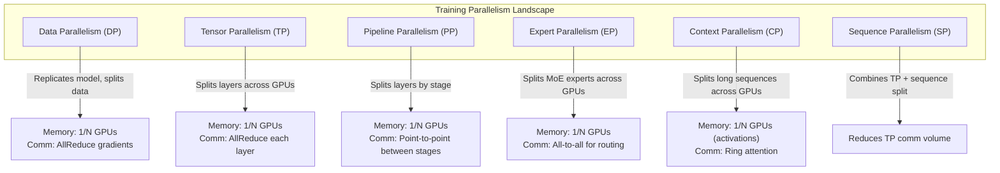
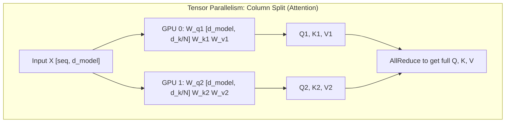
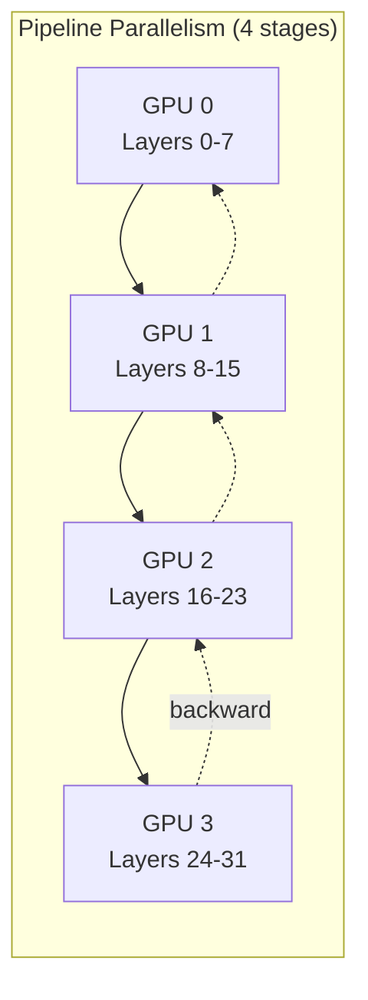
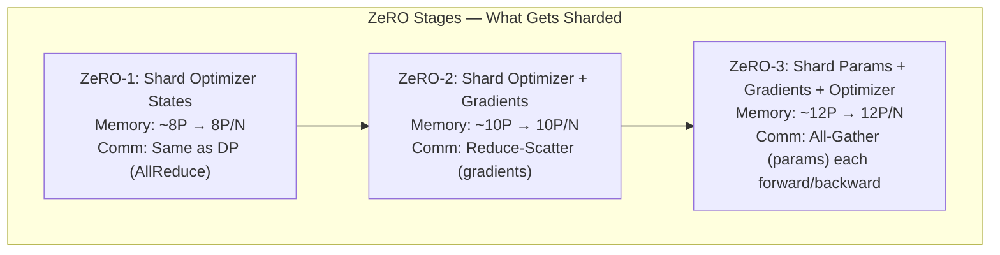
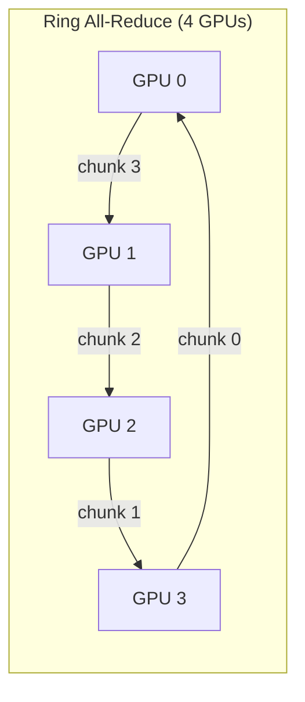
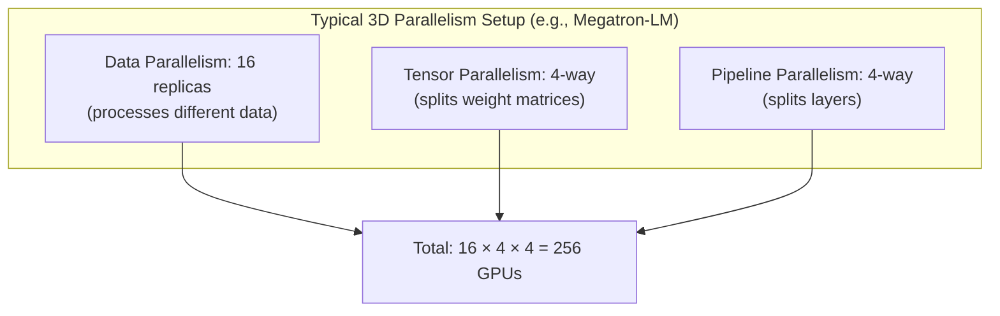

# Advanced Training Systems

## Overview

Training a 70B+ parameter LLM requires distributing computation across hundreds or thousands of GPUs. This section covers the parallelism strategies (data, tensor, pipeline, expert, context, sequence), distributed training frameworks (DeepSpeed ZeRO, PyTorch FSDP), gradient synchronization optimization, activation checkpointing, and knowledge distillation techniques that make large-scale training feasible.

> **Interview Angle**: Questions in this space test whether you understand the *memory vs. communication* trade-off at the heart of distributed training. Expect questions like "design a training system for a 70B model on 64 GPUs" or "why does pipeline parallelism have bubbles?"

## Memory Anatomy of Training

### What Consumes GPU Memory During Training

| Component | Formula | 70B FP16 | Notes |
|---|---|---|---|
| **Model parameters** | 2 × P bytes | 140 GB | FP16 = 2 bytes/param |
| **Gradients** | 2 × P bytes | 140 GB | Same size as params |
| **Optimizer states** | 8-12 × P bytes | 560-840 GB | Adam: m (FP32) + v (FP32) + master (FP32) |
| **Activations** | ~16-32 × P bytes | Varies | Stored for backward pass |
| **Temporary buffers** | ~4-8 × P bytes | Varies | Gradient accumulation, communication |

A 70B model in full precision Adam requires ~840 GB just for optimizer states — exceeding any single GPU. This is why distributed training is non-negotiable.

> **Interview Angle**: "Why does Adam use more memory than SGD?" Adam maintains two momentum buffers per parameter (first moment m, second moment v), each in FP32. So optimizer states = 4 × P bytes (2 FP32 buffers) + 4 × P bytes (FP32 master weights for mixed precision) = 8 × P bytes. SGD with momentum needs only 4 × P bytes.

## Parallelism Strategies

### Overview of Parallelism Dimensions



### Data Parallelism (DP)

Each GPU holds a full copy of the model. Data is split across GPUs, and gradients are synchronized via AllReduce after each backward pass.

```python
# Simplified data parallelism
for batch in dataloader:
    # Each GPU processes its own micro-batch
    loss = model(batch[rank])  # Forward on local data
    loss.backward()             # Compute local gradients
    
    # Synchronize gradients across all GPUs
    torch.distributed.all_reduce(
        [p.grad for p in model.parameters()],
        op=torch.distributed.ReduceOp.SUM
    )
    
    # Each GPU averages and updates identically
    for p in model.parameters():
        p.grad /= world_size
        optimizer.step()
```

**Problem**: Each GPU stores full model + gradients + optimizer states. A 70B model requires ~1.1 TB — doesn't fit on one GPU. DP alone is insufficient for large models.

### Tensor Parallelism (TP)

Splits individual weight matrices (e.g., the Q/K/V projection in attention, or the FFN up/down projections) across GPUs within a single layer. All GPUs must communicate after each matmul.



**Megatron-LM style TP** for a transformer layer:
1. **Column parallel**: Split W_qkv and W_up across GPUs (each GPU gets a slice of output features)
2. **Row parallel**: Split W_o and W_down across GPUs (each GPU gets a slice of input features, results are AllReduced)

```python
# Megatron-LM tensor parallel attention (simplified)
class TensorParallelAttention:
    def forward(self, x):
        # Column parallel: each GPU computes a subset of heads
        qkv = F.linear(x, self.w_qkv_shard)  # [seq, (q_shard + k_shard + v_shard)]
        q, k, v = qkv.chunk(3, dim=-1)
        
        # Each GPU does attention on its heads independently (no comm)
        attn_out = self.attention(q, k, v)
        
        # Row parallel: split output projection, AllReduce results
        out = F.linear(attn_out, self.w_o_shard)
        torch.distributed.all_reduce(out)  # Sum partial results from all GPUs
        return out
```

### Pipeline Parallelism (PP)

Splits the model into sequential stages, assigning each stage to a different GPU. Data flows forward through stages, then gradients flow backward.



**The Bubble Problem**: Naive pipeline parallelism processes one micro-batch at a time, leaving most GPUs idle. With P pipeline stages and M micro-batches:
- **Bubble fraction** = (P - 1) / (M + P - 1)
- With P=4, M=8: 3/11 ≈ 27% idle time
- With P=4, M=32: 3/35 ≈ 8.6% idle time

**1F1B Pipeline Schedule** (PipeDream-Flush): Interleaves forward and backward passes to minimize bubble time. Each GPU alternates between forward and backward passes rather than doing all forwards then all backwards.

### Expert Parallelism (EP)

For Mixture-of-Experts (MoE) models, different experts are placed on different GPUs. A token is routed to the GPU hosting its selected expert, requiring all-to-all communication.

```python
# Expert parallelism with all-to-all communication
def moe_forward(x, gate, experts, ep_group):
    # Step 1: Router decides expert assignment (local)
    expert_ids = gate(x)  # [batch, num_experts]
    
    # Step 2: All-to-all dispatch — send tokens to expert GPUs
    dispatched = all_to_all(x, expert_ids, ep_group)
    
    # Step 3: Each GPU computes its local experts
    expert_outputs = [expert(dispatched[i]) for i, expert in enumerate(local_experts)]
    
    # Step 4: All-to-all combine — send results back to source GPUs
    output = all_to_all(expert_outputs, reverse=True, group=ep_group)
    return output
```

| Parallelism Type | Communication Pattern | Communication Volume | Memory per GPU |
|---|---|---|---|
| DP | AllReduce (gradients) | O(P × model_size) | Full model |
| TP | AllReduce (activations) per layer | O(6 × seq × d²) per layer | 1/TP of model |
| PP | Point-to-point (activations between stages) | O(seq × d) per stage boundary | 1/PP of model |
| EP | All-to-all (tokens) | O(seq × d) per MoE layer | 1/EP of expert params |
| CP | Ring communication (attention) | O(seq² × d / CP) | 1/CP of activations |

## ZeRO (Zero Redundancy Optimizer)

### The Core Idea

ZeRO (Rajbhandari et al., 2020, Microsoft DeepSpeed) partitions the redundant state across data-parallel GPUs. Standard DP replicates everything; ZeRO eliminates redundancy progressively.

### ZeRO Stages



| Stage | What's Sharded | Memory per GPU (70B) | Extra Comm | Key Benefit |
|---|---|---|---|---|
| ZeRO-1 | Optimizer states only | ~840 GB → 840/N | None | Easy drop-in, minimal overhead |
| ZeRO-2 | Optimizer + gradients | ~1120 GB → 1120/N | Reduce-Scatter instead of AllReduce | Significant memory savings |
| ZeRO-3 | Params + gradients + optimizer | ~1260 GB → 1260/N | All-Gather params each step | Fits any model if N is large enough |

### ZeRO Communication Patterns

**ZeRO-1/2 (Standard AllReduce):** Gradients are still fully materialized on each GPU before reduction. Only the optimizer state storage is sharded.

**ZeRO-2 (Reduce-Scatter):** Uses reduce-scatter instead of all-reduce. Each GPU only stores the gradient shard it's responsible for:

```python
# ZeRO-2 gradient reduction
# Instead of all_reduce (every GPU gets all gradients),
# use reduce_scatter (each GPU gets only its shard)
torch.distributed.reduce_scatter(
    sharded_grads,
    full_grads,
    op=torch.distributed.ReduceOp.SUM
)
# Now each GPU only has gradients for its parameter shard
```

**ZeRO-3 (All-Gather Forward, Reduce-Scatter Backward):** Parameters are not stored on each GPU. Before each layer's forward pass, parameters are gathered from all GPUs. After backward, gradients are scatter-reduced.

```python
class ZeRO3Linear(nn.Module):
    def __init__(self, in_features, out_features, param_shard_group):
        # Don't allocate full weight — only store local shard
        self.weight_shard = nn.Parameter(
            torch.empty(out_features // world_size, in_features)
        )
        self.param_group = param_shard_group
    
    def forward(self, x):
        # Gather full weight from all GPUs before computation
        full_weight = torch.distributed.all_gather(
            self.weight_shard, group=self.param_group
        )
        return F.linear(x, full_weight)
```

### ZeRO Communication Overhead

| Stage | Forward Comm | Backward Comm | Total vs. DP |
|---|---|---|---|
| ZeRO-1 | 0 extra | AllReduce (same as DP) | 1× |
| ZeRO-2 | 0 extra | ReduceScatter (same volume) | 1× |
| ZeRO-3 | L × AllGather(P) | L × ReduceScatter(G) + L × AllGather(P) | ~1.5× |

ZeRO-3 adds ~50% communication overhead from the parameter all-gathers, but enables training models that can't fit on any single GPU.

## PyTorch FSDP

FSDP (Fully Sharded Data Parallel) is PyTorch's native implementation of ZeRO-3 semantics. It wraps model submodules and shards their parameters, gradients, and optimizer states across GPUs.

```python
from torch.distributed.fsdp import FullyShardedDataParallel as FSDP

# Wrap each transformer layer
model = nn.ModuleList([
    FSDP(transformer_block, 
         process_group=dp_group,
         sharding_strategy=ShardingStrategy.FULL_SHARD)  # ZeRO-3
    for transformer_block in transformer_layers
])

# Wrap the entire model for the final linear head
model = FSDP(model, process_group=dp_group)
```

**FSDP vs. DeepSpeed ZeRO-3:**

| Feature | FSDP | DeepSpeed ZeRO-3 |
|---|---|---|
| Integration | Native PyTorch | External library |
| Sharding granularity | Per-module (user chooses) | Per-parameter |
| CPU offloading | Basic | Advanced (ZeRO-Offload) |
| Activation checkpointing | Separate API | Integrated (ZeRO-Infinity) |
| NVMe offloading | Not supported | ZeRO-Infinity |
| Debugging | Standard PyTorch tooling | DeepSpeed-specific |
| Adoption | Growing (PyTorch 2.x) | Mature (used for LLaMA, etc.) |

## All-Reduce Optimization

### Ring All-Reduce

The standard algorithm for gradient synchronization. N GPUs arranged in a ring, each passing chunks to the next:

1. **Scatter-Reduce phase**: N-1 steps, each GPU sends/receives one chunk. After this, each GPU has one fully-reduced chunk.
2. **All-Gather phase**: N-1 steps, the fully-reduced chunks are propagated around the ring.

**Total bandwidth**: Each GPU sends 2(N-1)/N × M data, where M is total data size. As N grows, this approaches 2M — the theoretical minimum.



### Tensor Fusion

Instead of many small AllReduces (one per parameter), fuse gradients into a single large buffer before a single AllReduce call. This amortizes communication launch overhead and improves bandwidth utilization.

```python
# Naive: many small all-reduces
for p in model.parameters():
    all_reduce(p.grad)  # Many small calls — high latency

# Optimized: bucketed all-reduce (used by PyTorch DDP)
for bucket in gradient_buckets:  # Each bucket ~25-50 MB
    all_reduce(bucket)  # Few large calls — better bandwidth utilization
```

## Activation Checkpointing (Gradient Checkpointing)

### The Problem

During the forward pass, all intermediate activations are stored for the backward pass. For a 70B model with 80 layers, activations for a 4K sequence can exceed 100 GB.

### The Solution

Don't store activations during forward. Instead, **recompute** them during backward by re-running the forward pass for selected sub-graphs.

```python
from torch.utils.checkpoint import checkpoint

def forward_with_checkpointing(x, layers):
    # Checkpoint every 2 layers (trade-off: more checkpoints = less memory, more recomputation)
    for i in range(0, len(layers), 2):
        x = checkpoint(lambda x: layers[i](layers[i+1](x)), x)
    return x
```

| Checkpoint Frequency | Memory Saved | Extra Compute | Sweet Spot |
|---|---|---|---|
| Every layer | ~70% | ~33% | Memory-constrained training |
| Every 2 layers | ~50% | ~25% | Common default |
| Every 4 layers | ~30% | ~15% | Mild memory pressure |
| No checkpointing | 0% | 0% | Plenty of GPU memory |

### Selective Activation Checkpointing

Not all activations are equally expensive. Checkpoint the large attention matrices but keep small layer-norm activations in memory. DeepSpeed and PyTorch support per-layer checkpointing policies.

## Knowledge Distillation

### Overview

Knowledge distillation transfers learned representations from a large "teacher" model to a smaller "student" model. The student learns to mimic the teacher's output distribution, not just the hard labels.

### Standard Distillation Loss

```python
def distillation_loss(student_logits, teacher_logits, labels, temperature=4.0, alpha=0.5):
    """
    L = alpha * KL(softmax(student/T) || softmax(teacher/T)) * T²  
      + (1 - alpha) * CrossEntropy(student, labels)
    """
    # Soft targets: teacher's softened distribution
    soft_teacher = F.softmax(teacher_logits / temperature, dim=-1)
    soft_student = F.log_softmax(student_logits / temperature, dim=-1)
    
    distill_loss = F.kl_div(soft_student, soft_teacher, reduction='batchmean') * (temperature ** 2)
    
    # Hard targets: ground truth labels
    hard_loss = F.cross_entropy(student_logits, labels)
    
    return alpha * distill_loss + (1 - alpha) * hard_loss
```

### Distillation Strategies

| Strategy | How It Works | Example |
|---|---|---|
| **Logit distillation** | Student matches teacher's output logits | Hinton 2015 (classic) |
| **Hidden state distillation** | Student matches intermediate layer outputs | TinyBERT, DistilBERT |
| **Attention distillation** | Student matches teacher's attention matrices | MiniLM |
| **Data distillation** | Teacher generates training data for student | Alpaca, Orca |
| **Online distillation** | Student and teacher train simultaneously | Self-training with ensemble |

### Distillation for LLMs

Modern LLM distillation often uses **data distillation** — the teacher model generates high-quality training data (responses, reasoning traces) that the student fine-tunes on. This is more practical than logit-based distillation for very large models since you don't need to run teacher and student simultaneously.

| Teacher | Student | Method | Size Reduction |
|---|---|---|---|
| GPT-4 | GPT-3.5-turbo | Data distillation (teacher-generated data) | ~10× |
| Claude 3.5 | Claude 3 Haiku | Distillation + architecture search | ~7× |
| LLaMA 70B | LLaMA 7B | Logit + hidden state distillation | 10× |
| DeepSeek-V3 | DeepSeek-R1-Distill-Qwen | Data distillation (reasoning traces) | Varies |

> **Interview Angle**: "Why multiply the KL divergence by T² in distillation?" Answer: When temperature T is applied, the softmax distributions become softer (lower entropy per dimension), which reduces the magnitude of the gradients from the distillation loss. Multiplying by T² counteracts this scaling so that the relative contribution of hard and soft targets remains balanced as you change temperature.

## Combined Parallelism in Practice

Real-world training combines multiple parallelism strategies:



**Rule of thumb**: Use TP=2-8 within a node (NVLink, high bandwidth), PP=2-8 across nodes (InfiniBand), and DP to scale to desired total GPU count. For MoE models, add EP within the DP group.

| Model | TP | PP | DP | EP | Total GPUs |
|---|---|---|---|---|---|
| GPT-3 175B | 8 | 16 | 16 | — | 2048 (A100)
| LLaMA 65B | 8 | 4 | 8 | — | 256 (A100)
| Mixtral 8x7B | 2 | 2 | 32 | 8 | 256 (A100)
| DeepSeek-V3 671B | 1 | 16 | 4096 | 256 | 2048 (H800) |

## Interview Questions

### Q1: How would you train a 70B model on 8 GPUs with 80GB each?
**Answer:** Total GPU memory = 640 GB. Full model in FP16 = 140 GB, gradients = 140 GB, Adam states = 840 GB. Even with ZeRO-3 (sharding across 8 GPUs), optimizer states = 840/8 = 105 GB, params = 140/8 = 17.5 GB, grads = 140/8 = 17.5 GB ≈ 140 GB + activations. This fits with room. Use FSDP with full shard, TP=2 within each node (4 NVLink-connected pairs), activation checkpointing every 2 layers, and gradient accumulation for effective batch size.

### Q2: Why does tensor parallelism require high-bandwidth interconnect?
**Answer:** TP inserts an AllReduce after every transformer layer (actually two: one after attention, one after FFN). Each AllReduce communicates O(6 × seq_len × hidden_dim) bytes. With 80 layers and sequence length 4K, this is enormous. NVLink provides 900 GB/s bidirectional bandwidth within a node; InfiniBand is only ~400 GB/s and has higher latency. Running TP across nodes would bottleneck the entire training run on inter-node communication. This is why TP is always within a node, and PP goes across nodes.

### Q3: What is the difference between ZeRO-2 and ZeRO-3, and when would you choose each?
**Answer:** ZeRO-2 shards optimizer states and gradients but keeps full model parameters on each GPU. ZeRO-3 also shards parameters, requiring All-Gather before each forward/backward pass. ZeRO-2 is preferred when the full model fits in GPU memory (with optimizer/gradient sharding providing the savings needed). ZeRO-3 is needed when the model itself doesn't fit. ZeRO-2 has lower communication overhead (~1× vs ~1.5× vs standard DP), so use it when possible.

### Q4: How does activation checkpointing work, and what's the trade-off?
**Answer:** Activation checkpointing saves memory by not storing intermediate activations during the forward pass. Instead, only "checkpoint" activations (e.g., at layer boundaries) are saved. During backward, the forward pass is re-executed from the nearest checkpoint to recompute the needed activations. The trade-off is extra compute: approximately 33% more FLOPs when checkpointing every layer. The memory savings are proportional to the number of layers between checkpoints — checkpointing every 2 layers saves ~50% activation memory.

## Common Mistakes

- ❌ Using TP across nodes (always keep TP within a single node with NVLink)
- ❌ Not accounting for activation memory when planning GPU requirements
- ❌ Forgetting that ZeRO-3 adds ~50% communication overhead vs. ZeRO-2
- ❌ Assuming DP is always the best scaling strategy (TP+PP+EP are needed for large models)
- ❌ Ignoring pipeline bubbles (use 1F1B scheduling and increase micro-batch count)
- ❌ Not using gradient accumulation (effective batch size ≠ micro-batch size × GPUs)

## Summary

Distributed LLM training combines data, tensor, pipeline, and expert parallelism. ZeRO/FSDP shard redundant state across GPUs. The key trade-off is always memory vs. communication: TP reduces memory but adds per-layer AllReduce, PP reduces memory but introduces pipeline bubbles, and ZeRO-3 reduces memory most but adds parameter all-gathers. In practice, combine TP=2-8 within nodes, PP=2-8 across nodes, and DP for remaining scale. Use activation checkpointing and gradient accumulation for memory-constrained setups.

## References

1. Rajbhandari et al., "ZeRO: Memory Optimizations Toward Training Trillion Parameter Models", SC 2020
2. Shoeybi et al., "Megatron-LM: Training Multi-Billion Parameter Language Models Using Model Parallelism", SC 2019
3. Narayanan et al., "Efficient Large-Scale Language Model Training on GPU Clusters Using Megatron-LM", SC 2021
4. Hinton et al., "Distilling the Knowledge in a Neural Network", NeurIPS 2015
5. Huang et al., "GPipe: Efficient Training of Giant Neural Networks using Pipeline Parallelism", NeurIPS 2019
6. PyTorch FSDP documentation, https://pytorch.org/docs/stable/fsdp.html

## Cross-References

- [Transformer Internals →](transformer-internals.md) Attention and KV cache internals
- [Quantization Advanced →](quantization-advanced.md) Post-training quantization for efficient training
- [MoE Architecture →](../moe/architecture.md) Expert parallelism details
- [Inference Systems →](inference-systems.md) How trained models are served
- [Deep Learning Systems](../../llm/llm-serving/pretraining.md) General distributed training
