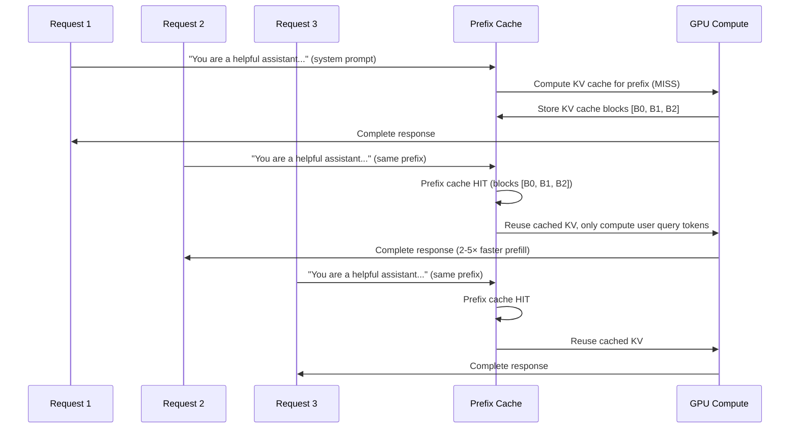

# Transformer Internals

## Overview

Beyond the standard attention formula `Attention(Q,K,V) = softmax(QK^T / √d_k)V`, production transformers require deep kernel-level optimization to run efficiently on modern GPUs. This section covers the internal computational graph of a transformer layer, memory access patterns that determine GPU utilization, and the key optimizations (FlashAttention, PagedAttention, KV compression, prefix caching) that make LLM inference feasible at scale.

> **Interview Angle**: Interviewers at ML infra teams (Meta FAIR infra, Google DeepMind infra, Anthropic, OpenAI) test whether you understand *why* standard attention is slow and *how* kernel-level changes fix it.

## Standard Attention: The Memory Problem

### Naive Attention Computation

```python
def naive_attention(Q, K, V):
    # Q: [batch, heads, seq_len, d_k]
    # K: [batch, heads, seq_len, d_k]
    # V: [batch, heads, seq_len, d_v]
    d_k = Q.shape[-1]
    
    # Step 1: Compute attention scores — O(n²) in seq_len
    scores = torch.matmul(Q, K.transpose(-2, -1)) / math.sqrt(d_k)  # [B, H, N, N]
    
    # Step 2: Softmax — reads and writes full N×N matrix
    attn_weights = F.softmax(scores, dim=-1)  # [B, H, N, N]
    
    # Step 3: Weighted sum — reads full N×N matrix
    output = torch.matmul(attn_weights, V)  # [B, H, N, d_v]
    
    return output
```

### Why This Is Slow

| Phase | Compute | Memory Reads | Memory Writes | Bottleneck |
|---|---|---|---|---|
| QK^T matmul | O(n²d) | Q + K (2nd) | S (n²) | **Memory-bound** for long seq |
| Softmax | O(n²) | S (n²) | P (n²) | **Memory-bound** — reads + writes full n×n |
| PV matmul | O(n²d) | P + V (n² + nd) | O (nd) | **Memory-bound** for long seq |

For long sequences, the intermediate S and P matrices of size n×n dominate memory traffic. With n = 8192 and d = 128, each matrix is 8192 × 8192 × 2 bytes = 128 MB per head per batch element. For 32 heads and batch 32, that's **128 GB** of intermediate materialization — far exceeding GPU HBM.

> **Interview Angle**: "Why is attention memory-bound rather than compute-bound?" Answer: The intermediate n×n attention matrix requires O(n²) memory reads/writes but only O(n²d) FLOPs. For large n and small d, arithmetic intensity (FLOPs/byte) is low, meaning memory bandwidth is the bottleneck, not compute throughput.

## FlashAttention

### Core Idea

FlashAttention (Dao et al., 2022) eliminates materialization of the full n×n attention matrix by computing attention in **tiles** using the GPU's shared memory (SRAM) as a software-managed cache. The key insight is that softmax can be computed incrementally over blocks.

### Tiled Attention with Online Softmax

The softmax computation requires the global max and sum for numerical stability. FlashAttention computes these incrementally:

```python
def flash_attention_tiled(Q, K, V, block_size=128):
    # Q: [N, d], K: [N, d], V: [N, d]
    N, d = Q.shape
    O = torch.zeros_like(Q)  # Output accumulator
    l = torch.zeros(N, 1)    # Running sum (for softmax denominator)
    m = torch.full((N, 1), -float('inf'))  # Running max (for softmax stability)
    
    for j in range(0, N, block_size):  # Iterate over K/V blocks
        K_j = K[j:j+block_size]        # Load K block to SRAM
        V_j = V[j:j+block_size]        # Load V block to SRAM
        
        for i in range(0, N, block_size):  # Iterate over Q blocks
            Q_i = Q[i:i+block_size]        # Load Q block to SRAM
            
            # Compute local attention scores in SRAM
            S_ij = (Q_i @ K_j.T) / math.sqrt(d)
            
            # Online softmax update
            m_ij = S_ij.max(dim=-1, keepdim=True).values
            m_new = torch.maximum(m[i:i+block_size], m_ij)
            
            # Correction factor for previous accumulations
            alpha = torch.exp(m[i:i+block_size] - m_new)
            beta = torch.exp(m_ij - m_new)
            
            P_ij = torch.exp(S_ij - m_new)  # Local softmax
            l[i:i+block_size] = l[i:i+block_size] * alpha + P_ij.sum(dim=-1, keepdim=True) * beta
            
            # Update output with correction
            O[i:i+block_size] = O[i:i+block_size] * alpha + (P_ij @ V_j) * beta
            m[i:i+block_size] = m_new
    
    return O / l  # Final normalization
```

### FlashAttention Memory Hierarchy

```mermaid
graph TD
    subgraph "GPU Memory Hierarchy"
        HBM["HBM (80-192 GB, ~2 TB/s)""]
        SRAM["SRAM (192 KB/SM, ~19 TB/s)""]
        REG["Registers (256 KB/SM, ~80 TB/s)""]
    end
    
    subgraph "FlashAttention Strategy"
        LOAD1["Load Q, K, V blocks from HBM → SRAM""]
        COMPUTE["Compute attention in SRAM (tiled)""]
        WRITEBACK["Write output blocks SRAM → HBM""]
    end
    
    LOAD1 --> COMPUTE --> WRITEBACK
    
    HBM -.->|"Slow reads/writes"| LOAD1
    SRAM -.->|"Fast compute"| COMPUTE
    WRITEBACK -.->|"Minimal writes"| HBM
```

### FlashAttention 2 & 3

| Version | Key Improvement | Speedup over v1 | Speedup over PyTorch |
|---|---|---|---|
| FlashAttention-1 | Tiled attention, no materialization | Baseline | 2-4× |
| FlashAttention-2 | Better work partitioning, interleaved Q/K/V loading | 2× | 4-8× |
| FlashAttention-3 | FP8 support, async ops, Hopper (H100) warp specialization | 1.5-2× | 6-15× |

FlashAttention-3 exploits H100 features: FP8 tensor cores, asynchronous data movement with TMA (Tensor Memory Accelerator), and warp-specialization where different warps handle loading vs. computation.

### FlashAttention vs. Alternative Approaches

| Method | IO Complexity | Exact? | Max Seq Length | Hardware |
|---|---|---|---|---|
| Standard Attention | Θ(n²d + nd²) | ✅ | Any | Any GPU |
| FlashAttention | Θ(n²d/B + nd) | ✅ | ~128K (GPU HBM limited) | Ampere+ |
| Block-Sparse Attention | Θ(n·s·d/B + nd) | ✅ | ~128K | Ampere+ |
| Linear Attention | Θ(nd²) | ❌ (approx) | Unlimited | Any GPU |

> **Interview Angle**: "What is the IO complexity of FlashAttention and why does it matter?" Answer: FlashAttention reduces IO from Θ(n²d + nd²) to Θ(n²d/M + nd²/M + nd) where M is SRAM size. Since GPU HBM bandwidth (2 TB/s) is ~100× lower than SRAM bandwidth (19 TB/s), reducing HBM reads/writes is more important than reducing FLOPs. This is the core insight of the "IO-aware" approach.

## Paged Attention

### Motivation

Standard KV cache allocation pre-reserves memory for the maximum sequence length, causing severe internal fragmentation. If average sequence length is 512 but max is 4096, **87.5%** of KV cache memory is wasted.

### Architecture

PagedAttention (vLLM, Kwon et al. 2023) treats KV cache like virtual memory:

```mermaid
graph TD
    subgraph "Virtual Memory Analogy"
        VP["Virtual Pages (logical KV blocks)""]
        PT["Page Table (block_id → physical block)""]
        PP["Physical Pages (actual GPU memory blocks)""]
    end
    
    VP --> PT --> PP
```

Each KV block stores a fixed number of tokens (typically 16). A page table maps logical block indices to physical GPU memory locations. Blocks are allocated on-demand as tokens are generated.

```python
@dataclass
class PagedKVCache:
    block_size: int = 16        # Tokens per block
    num_blocks: int             # Total physical blocks available
    page_table: Dict[int, int]  # logical_block_id -> physical_block_id
    free_blocks: List[int]      # Pool of available physical blocks
    block_table: List[List[int]]  # Per-sequence: list of logical block IDs
    
    def allocate_block(self) -> int:
        """Allocate a physical block for a new KV block."""
        if not self.free_blocks:
            raise OutOfMemoryError("No free KV blocks")
        return self.free_blocks.pop()
    
    def append_token(self, seq_id: int, kv: Tensor):
        """Append KV for a new token to the sequence's cache."""
        seq_blocks = self.block_table[seq_id]
        token_idx = self._get_seq_len(seq_id)
        logical_block = token_idx // self.block_size
        block_offset = token_idx % self.block_size
        
        if logical_block >= len(seq_blocks):
            # Need a new block
            phys_block = self.allocate_block()
            seq_blocks.append(phys_block)
            self.page_table[len(seq_blocks)-1] = phys_block
        
        # Write KV into the physical block at the correct offset
        phys = self.page_table[logical_block]
        self.kv_cache[phys, :, block_offset, :] = kv
```

### PagedAttention Kernel

The key challenge: attention must gather K/V from non-contiguous physical blocks using the page table. This requires a custom GPU kernel that:

1. Reads the page table for each sequence
2. Gathers K/V from scattered physical blocks into a contiguous buffer in shared memory
3. Computes attention using the gathered buffer
4. Writes output back to HBM

### Copy-on-Write for Shared Prefixes

```mermaid
graph TD
    subgraph "Before Fork"
        P0["Block 0: [sys_prompt tokens] (refcount=3)""]
    end
    
    subgraph "After Fork (Beam Search)"
        P0R["Block 0: shared (refcount=3)""]
        B1["Block 5: beam 1 tokens (refcount=1)""]
        B2["Block 6: beam 2 tokens (refcount=1)""]
        B3["Block 7: beam 3 tokens (refcount=1)""]
    end
    
    P0 --> P0R
    P0R --> B1
    P0R --> B2
    P0R --> B3
```

When sequences share a prefix (beam search, same system prompt), blocks are reference-counted. A block is only physically copied when a sequence diverges and needs to modify a shared block (copy-on-write semantics, identical to fork() in Unix).

## KV Cache Compression

### Multi-Head Latent Attention (MLA)

DeepSeek-V2/V3 compresses KV cache into a low-rank latent representation:

```
Standard:  Store K_t ∈ R^{H_kv × d_k}, V_t ∈ R^{H_kv × d_v}  →  2 × H_kv × d_k tokens

MLA:       Store c_t ∈ R^{d_c} (compressed latent)            →  d_c tokens
           At attention: K_t = W_DK @ c_t, V_t = W_DV @ c_t  (reconstruct on the fly)
```

For DeepSeek-V3: d_c = 512, H_kv = 128, d_k = 128. Standard stores 2 × 128 × 128 = 32,768 values; MLA stores 512 values — a **64× compression**. The reconstruction projections are fused into the attention kernel so the cost is minimal.

### Token Merging and Pruning

| Technique | Mechanism | Quality Impact | Memory Savings |
|---|---|---|---|
| **Token Merging (ToMe)** | Merge similar adjacent tokens using bipartite matching | Minimal for 20-40% merge rate | 1.2-1.7× |
| **H2O** | Evict tokens with lowest cumulative attention weight | Moderate | 2-4× |
| **StreamingLLM** | Keep first 4 (attention sinks) + last W tokens | Low for streaming | Unlimited context |
| **SnapKV** | Compress KV via weighted averaging of important positions | Low | 4-8× |
| **Heavy-Hitter Oracle (H2O)** | Keep tokens with top cumulative attention scores | Low-moderate | 2-4× |

### GQA and MQA: Architectural Compression

Grouped Query Attention (GQA) and Multi-Query Attention (MQA) reduce KV cache by sharing KV heads across query heads at the architecture level:

| Architecture | Q Heads | KV Heads | KV Cache (per token, 32-layer, d=128) | Quality |
|---|---|---|---|---|
| MHA | 32 | 32 | 512 KB | Baseline |
| GQA-8 | 32 | 8 | 128 KB | ~Baseline |
| GQA-4 | 32 | 4 | 64 KB | Slight degradation |
| MQA | 32 | 1 | 16 KB | Noticeable on long-context tasks |
| MLA (DeepSeek) | 32 (latent) | 1 (latent) | ~4 KB | Near-baseline |

> **Interview Angle**: "When would you choose GQA over MQA?" Answer: GQA offers a better quality-efficiency trade-off. MQA's single KV head becomes a bottleneck for models that need to attend to diverse information (long context, complex reasoning). GQA with 4-8 groups retains most of MHA quality while still achieving significant cache reduction. LLaMA 2/3, Mistral, and Gemma all use GQA.

## Prefix Caching

### How Prefix Caching Works



### RadixAttention (SGLang)

SGLang implements prefix caching using a **radix tree** (compressed trie) over token sequences:

```mermaid
graph TD
    ROOT["Root""] 
    ROOT --> SYS[""You are a" (shared by all)""]
    SYS --> SP1[""helpful" (shared)""]
    SYS --> SP2[""friendly" (alternate prefix)""]
    SP1 --> SP1B[""assistant. User: Explain X" (shared)""]
    SP1 --> SP1C[""assistant. User: Write Y" (shared)""]
```

Common prefixes are automatically detected and their KV cache is shared. SGLang reports 2-5× throughput improvement for workloads with shared system prompts.

### vLLM Automatic Prefix Caching

vLLM's `--enable-prefix-caching` computes a hash of each KV block's content. When a new request's prefix matches an existing block hash, the cached block is reused via copy-on-write (reference counting). This is simpler than SGLang's radix tree but less effective for partial prefix matches.

| Approach | Detection Method | Partial Match Support | Implementation Complexity |
|---|---|---|---|
| vLLM | Block content hashing | No (full block match only) | Low |
| SGLang RadixAttention | Radix tree over tokens | Yes (any common prefix) | Medium |
| Custom | Trie-based token matching | Yes | High |

## Attention Variants Comparison

| Variant | Complexity | Context Length | Use Case |
|---|---|---|---|
| Full Attention | O(n²d) | ~128K (with FlashAttn) | General-purpose, short-medium context |
| Sliding Window | O(nwd) | Unlimited (effective window W) | Mistral, streaming applications |
| Sparse Attention | O(n·s·d) | ~128K | Longformer, BigBird (specific patterns) |
| Linear Attention | O(nd²) | Unlimited | approximate, retrieval-augmented models |
| Ring Attention | O(n²d/N) | Virtually unlimited | Distributed inference across GPUs |
| MLA | O(n²d_c) | ~128K | DeepSeek-V2/V3 (compressed KV) |

## Interview Questions

### Q1: Explain FlashAttention at a system level. Why is it faster?
**Answer:** Standard attention materializes the full n×n attention matrix in HBM, which requires O(n²) HBM reads and writes. FlashAttention computes attention in tiles that fit in SRAM (192 KB per SM), where bandwidth is ~19 TB/s vs ~2 TB/s for HBM. It uses an online softmax trick to compute the global softmax incrementally over blocks, so it never needs the full matrix in memory. The result is mathematically identical (exact) but 4-8× faster because memory traffic is reduced from O(n²d) HBM reads/writes to O(n²d/M) where M is SRAM size.

### Q2: How does PagedAttention relate to OS virtual memory?
**Answer:** PagedAttention directly mirrors virtual memory: KV cache is divided into fixed-size pages (blocks of 16 tokens), a page table maps logical block IDs to physical GPU memory addresses, blocks are allocated on-demand, and copy-on-write semantics handle shared prefixes (like fork()). The key benefit is eliminating internal fragmentation — sequences only use as many blocks as they need, enabling 2-4× higher batch sizes on the same GPU memory.

### Q3: What is the trade-off between MLA and GQA for KV cache compression?
**Answer:** MLA (DeepSeek) compresses KV into a low-dimensional latent (d_c=512) and reconstructs K/V on-the-fly during attention. This achieves ~64× compression but requires custom kernels for the fused projection + attention. GQA simply shares KV heads across query groups, achieving 4-8× compression with minimal code changes. GQA is the pragmatic choice for most teams; MLA is worthwhile when pushing context length to 128K+ on constrained hardware.

### Q4: When does prefix caching help and when doesn't it?
**Answer:** Prefix caching helps when multiple requests share common token prefixes — system prompts, few-shot examples, RAG context. It saves prefill compute proportionally to the shared prefix length (e.g., a 500-token system prompt shared across 1000 requests saves 500K tokens of prefill). It doesn't help when prompts are all unique, when the workload is decode-bound (long generations, short prompts), or when prefix variation is too high for radix tree matching.

## Common Mistakes

- ❌ Confusing FlashAttention's compute reduction with its actual benefit (it's about memory IO, not FLOPs)
- ❌ Assuming MLA compresses "for free" — the up-projection cost is non-trivial and requires custom kernels
- ❌ Forgetting that PagedAttention introduces a page table lookup overhead (small but nonzero)
- ❌ Assuming prefix caching works well with all workloads — it's highly workload-dependent
- ❌ Comparing attention methods on FLOPs alone — memory access patterns matter more on GPUs

## Summary

Transformer attention is memory-bound, making kernel-level optimizations critical. FlashAttention tiles computation into SRAM to avoid materializing the n×n matrix. PagedAttention eliminates KV cache fragmentation through OS-style virtual memory. MLA compresses KV into a latent space for aggressive memory savings. Prefix caching avoids redundant prefill compute for shared prompts. Understanding these techniques at the system level — not just the math — is essential for ML infra interviews.

## References

1. Dao et al., "FlashAttention: Fast and Memory-Efficient Exact Attention with IO-Awareness", NeurIPS 2022
2. Dao, "FlashAttention-2: Faster Attention with Better Parallelism and Work Partitioning", 2023
3. Shah et al., "FlashAttention-3: Fast and Accurate Attention with Asynchrony and Low-precision", 2024
4. Kwon et al., "Efficient Memory Management for Large Language Model Serving with PagedAttention", SOSP 2023
5. DeepSeek-AI, "DeepSeek-V2: A Strong, Economical, and Efficient Mixture-of-Experts Language Model", 2024
6. Xiao et al., "Efficient Streaming Language Models with Attention Sinks", ICLR 2024

## Cross-References

- [KV Cache →](../llm-serving/kv-cache.md) Detailed KV cache memory calculations
- [Inference Systems →](inference-systems.md) How these optimizations integrate into serving stacks
- [Training Advanced →](training-advanced.md) Parallelism and memory optimization during training
- [LLM Serving Architecture →](../llm-serving/architecture.md) High-level serving design
