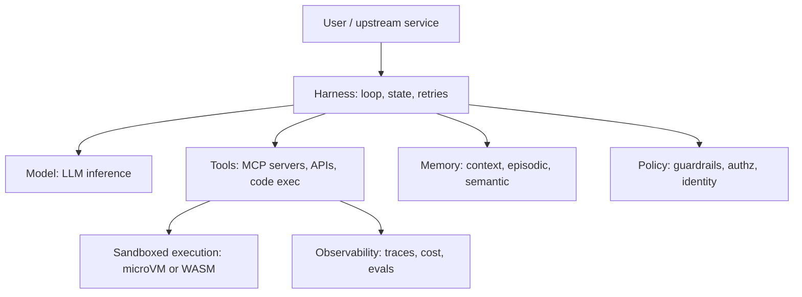
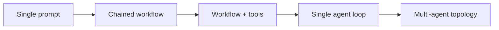

# Agentic Systems in Production

## Overview

This section treats LLM agents as a production systems-engineering problem rather than a prompting problem. It covers the five layers that turn a prototype loop into an operable service: wire protocols (MCP, A2A), identity and delegated authority, sandboxed execution, observability, guardrails, the physical action surfaces (browser, desktop, source tree), long-term memory, and multi-agent topology. Every page here is deliberately complementary to the conceptual material in [src/ml/agents](../../ml/agents/react.md) — read those pages for *what an agent is*, and these pages for *what it takes to run one*.

Interviews for platform, infrastructure, and applied-AI roles increasingly probe this boundary: candidates can usually describe a ReAct loop, but the follow-up questions — who does the tool call authenticate as, what happens if the agent writes a file outside the workspace, how do you debug a run that took 40 tool calls and produced the wrong answer — are what separate a prototype author from a production owner. Each page below ends with interview questions written for that second kind of conversation.

## Anatomy of a Production Agent

A production agent is not a prompt. It is a distributed system with five cooperating components, each of which has its own failure modes and its own engineering literature. The model is the least interesting part of the diagram and the most expensive part of the bill; the harness and the policy layer are where reliability actually comes from.

| Component | Responsibility | Typical production failure | Covered in |
|---|---|---|---|
| Model | Reasoning, tool selection, structured output | Wrong tool, malformed arguments, context overflow | [Agents](../agents.md) |
| Tools | Type-safe capabilities with schemas and descriptions | Schema drift, ambiguous descriptions, tool poisoning | [MCP](../../ml/agents/mcp.md), [Tool Calling](../../ml/agents/tool-calling.md) |
| Memory | Context assembly, persistence across sessions | Stale facts, cross-user leakage, retrieval noise | [Memory](./agent-memory-advanced.md) |
| Harness | The loop: state, checkpointing, retries, compaction | Lost runs on crash, unbounded loops, no resume | [Agent Systems](../advanced/agent-systems.md) |
| Policy | Identity, authorization, guardrails, audit | Confused deputy, prompt injection escalation, silent spend | [Identity](./agent-identity-and-auth.md), [Guardrails](./guardrails.md) |

The harness deserves emphasis because it is the component most teams under-build. An agent loop that lives in a `while` statement inside a request handler dies when the pod restarts, cannot be resumed, and cannot be replayed. Production harnesses checkpoint state after every step — LangGraph's checkpointer, Temporal's event-sourced workflow history — so that a run is durable state, not a live process. This reframing from "a loop in memory" to "a durable workflow that happens to call a model" is the single biggest architectural shift between a demo and a service.

## Workflow vs Agent: the Load-Bearing Decision

The most-cited piece of practitioner guidance in this field, Anthropic's *Building Effective Agents*, argues that most problems want a workflow — a fixed pipeline with one model call per step — and that autonomy should be added only when the task genuinely cannot be decomposed ahead of time. Workflows are cheaper per task, lower variance, trivially debuggable, and fail visibly. Agents buy you the ability to handle tasks whose step sequence is unknown until runtime, and they charge you in non-determinism, cost variance, and a much larger security surface. The escalation path below is a reasonable default posture: start at the bottom, and justify every step up.

Each step up the ladder multiplies the things you must engineer. A chained workflow needs schema validation. A workflow with tools needs input guardrails. A single agent loop needs durable state, sandboxed execution, and full tracing. A multi-agent topology needs inter-agent protocols, budget caps, and topology-level failure analysis. The pages in this section assume you already made that decision consciously and are now paying its engineering tax deliberately.

## Map to the Conceptual Agents Section

The repo keeps a clean split: `src/ml/agents/` explains agent *concepts and patterns* (mostly framework-neutral, prototype-scale), while this directory explains *production agentic engineering*. When studying, pair them: the concept page gives you the vocabulary, the production page gives you the operational consequences.

| Conceptual page (src/ml/agents) | What it covers | Production counterpart here |
|---|---|---|
| [Agent Architecture](../../ml/agents/architecture.md) | Components of an agent, perception-action loop | [README overview](./README.md) — anatomy and harness depth |
| [ReAct](../../ml/agents/react.md) | The Thought-Action-Observation loop | [SWE Agents](./swe-agents.md), [Browser & Computer Use](./browser-and-computer-use.md) — real action surfaces |
| [Tool Calling](../../ml/agents/tool-calling.md) | Function-calling mechanics and schemas | [Agent Protocols](./agent-protocols.md) — MCP and A2A as the wire layer |
| [MCP](../../ml/agents/mcp.md) | MCP primitives and the N×M problem | [Agent Protocols](./agent-protocols.md) — transports, sampling, A2A; [Identity](./agent-identity-and-auth.md) — MCP OAuth |
| [Agent Memory](../../ml/agents/memory.md) | Short-term vs long-term memory basics | [Memory Advanced](./agent-memory-advanced.md) — consolidation, decay, conflict resolution |
| [Multi-Agent Systems](../../ml/agents/multi-agent.md) | Supervisor, pipeline, debate patterns | [Multi-Agent Topologies](./multi-agent-topologies.md) — evidence, failure modes, frameworks |
| [Agent Safety](../../ml/agents/safety.md) | Safety principles and alignment concerns | [Guardrails](./guardrails.md), [Sandboxed Execution](./sandboxed-execution.md) — enforcement mechanisms |
| [Agent Evaluation](../../ml/agents/evaluation.md) | What to measure and how | [Agent Observability](./agent-observability.md) — trace-based evals, replay, cost rollups |
| [Frameworks](../../ml/agents/frameworks.md) | LangChain, CrewAI, AutoGen surveys | [Multi-Agent Topologies](./multi-agent-topologies.md) — framework mapping for production choice |

## Section Taxonomy

| Page | Question it answers | Key systems and standards |
|---|---|---|
| [Agent Protocols](./agent-protocols.md) | How do agents talk to tools and to each other? | MCP, JSON-RPC 2.0, Streamable HTTP, A2A, ANP/ACP |
| [Agent Identity & Auth](./agent-identity-and-auth.md) | Whose credentials does a tool call carry? | OAuth 2.1, PKCE, RFC 8693 token exchange, audience binding |
| [Sandboxed Execution](./sandboxed-execution.md) | How do we run model-written code safely? | Firecracker, gVisor, Kata, WASM/Wasmtime, seccomp |
| [Agent Observability](./agent-observability.md) | How do we see what a run actually did? | OpenTelemetry GenAI semconv, LangSmith, Langfuse, Phoenix |
| [Guardrails](./guardrails.md) | How do we constrain inputs, outputs, and actions? | NeMo Guardrails, Guardrails AI, OPA, PII redaction |
| [Browser & Computer Use](./browser-and-computer-use.md) | How do agents operate GUIs? | Playwright MCP, accessibility trees, pixel-action models |
| [SWE Agents](./swe-agents.md) | How do agents write and validate code? | SWE-agent, SWE-bench, OpenHands, Aider, Claude Code |
| [Agent Memory Advanced](./agent-memory-advanced.md) | How does memory survive and stay correct? | Mem0, Letta/MemGPT, temporal knowledge graphs |
| [Multi-Agent Topologies](./multi-agent-topologies.md) | When do many agents beat one loop? | LangGraph, AutoGen, CrewAI, A2A |

## What Changes from Prototype to Production

Six properties are missing from almost every prototype and present in every system that survives contact with real users. First, **durability**: runs checkpoint and resume instead of dying with the process. Second, **identity**: every tool call carries a scoped, audience-bound token rather than a god-mode key, and side-effecting actions get human consent. Third, **isolation**: model-written code executes in a microVM or WASM sandbox with egress denied by default, never on your host. Fourth, **traceability**: every LLM call, tool call, and retrieval is a span in an OpenTelemetry-compatible trace, so a bad outcome can be reconstructed step by step. Fifth, **evaluation**: offline datasets and online trace-derived evals gate every prompt, model, or tool change, because the failure modes are statistical rather than deterministic. Sixth, **cost control**: per-run token budgets, per-tenant caps, and unit economics (cost per resolved task) tracked as an SLO, not discovered on the invoice.

The OWASP Top 10 for LLM Applications frames the stakes: an agent that reads untrusted content and can act externally turns prompt injection from an information-disclosure bug into something closer to remote code execution. The design rule that follows — Simon Willison's "lethal trifecta" (private data + untrusted content + external communication is unsafe regardless of prompting) — is an *architecture* constraint, not a prompt-engineering note. Several pages here are essentially ways to remove one leg of that triangle: sandboxing removes unrestricted communication, identity scoping limits what the communication can do, guardrails and tool allow-lists shrink the action surface.

## Interview Questions

1. **You have a prototype agent that works in 80% of demo cases. What are the first five things you build before it touches production traffic?** Start with durable state — checkpoint the loop after every step so runs survive restarts and can be replayed. Second, identity: per-tool scoped credentials with audience binding, and a consent gate for side-effecting actions. Third, sandboxed execution for any code or shell tool, with network egress denied by default. Fourth, full tracing to OpenTelemetry GenAI conventions so every step is reconstructable. Fifth, an eval set built from the 20% failure cases, wired to CI. Notice none of the five is a prompt change — the gap between demo and production is infrastructure, not wording.

2. **When is a multi-agent system actually justified over a single agent loop?** Only when you need parallelism across genuinely independent subtasks, or context isolation because one coherent context cannot hold the task — for example a research orchestrator fanning out over 50 sources. The evidence is genuinely mixed: sampling and debate improve some reasoning benchmarks, but multi-agent systems add inter-agent communication as a new failure surface (message degradation, cost blowups, loss of global state). Anthropic's guidance is to prefer a workflow, then a single loop, and treat multi-agent as a measured escalation. If you cannot name the isolation or parallelism benefit concretely, you do not have a multi-agent problem.

3. **A customer asks why your agent platform needs OAuth for its tool calls — "it's an internal system". What do you tell them?** An agent is a new principal that your identity model never planned for: it takes actions on behalf of a user, from server-side infrastructure, with no human in the per-request path. Without audience-bound OAuth tokens per backend, one leaked or misdirected credential is the whole database — the confused-deputy problem. OAuth 2.1 with PKCE plus RFC 8693 token exchange lets the agent present a token that says exactly which user it acts for, which backend it may call, and what scope — and lets each backend verify that independently. "Internal" is precisely where the blast radius is largest.

4. **What is the difference between the way this section treats agents and the way the conceptual section does?** The conceptual pages define the pattern: the ReAct loop, memory types, supervisor topologies, MCP primitives. This section treats those patterns as inputs to an engineering problem: transports and trust boundaries for the protocol, token flows for the identity, isolation levels for the execution, span taxonomies for the observability. The conceptual material answers "what should the agent do"; this material answers "what does the agent do when the model is wrong, the tool is hostile, the pod restarts, and finance asks what the run cost".

## Key Takeaways

- A production agent is five systems: model, tools, memory, harness, policy — the harness and policy layers are where reliability is actually manufactured.
- Escalate deliberately: prompt → workflow → workflow+tools → single agent → multi-agent; each step up multiplies the engineering tax.
- The lethal trifecta (private data + untrusted content + external communication) is an architecture constraint; sandboxing, scoped identity, and guardrails exist to remove legs of it.
- MCP standardizes agent-to-tool connectivity and A2A standardizes agent-to-agent delegation; both ride JSON-RPC and complement, not compete with, vendor function calling.
- Treat an agent run as durable workflow state (checkpointed, resumable, replayable), not as a live loop in a request handler.
- Instrument to OpenTelemetry GenAI semantic conventions so traces, cost rollups, and evals survive framework churn.
- Agent failures are almost never visible in the final output alone — they are visible in the trace: the bad retrieval at step 3, the stale element at step 17, the schema-drifted tool at step 22.

## References

- Anthropic Engineering — *Building Effective Agents*: <https://www.anthropic.com/engineering/building-effective-agents>
- Model Context Protocol documentation: <https://modelcontextprotocol.io/>
- A2A (Agent2Agent) protocol: <https://a2a-protocol.org/latest/>
- OpenTelemetry GenAI semantic conventions: <https://opentelemetry.io/docs/specs/semconv/gen-ai/>
- OWASP Top 10 for LLM Applications: <https://genai.owasp.org/>
- Simon Willison on prompt injection (the lethal trifecta): <https://simonwillison.net/tags/prompt-injection/>
- E2B — sandboxed execution for agents: <https://e2b.dev/docs>
- Temporal — durable execution: <https://docs.temporal.io/>
- LangGraph: <https://langchain-ai.github.io/langgraph/>

## Cross-References

- [LLM Agents in Production](../agents.md) — the section-level overview of agents on this side of the repo
- [Agent Architecture](../../ml/agents/architecture.md) — the conceptual anatomy this page extends
- [Agent Systems (advanced)](../advanced/agent-systems.md) — deep dive on agent internals and control flow
- [LLM Security](../llm-security.md) — the security foundations the guardrails and identity pages build on
- [Tool Poisoning & Deterministic Workflows](../agents/tool-poisoning-workflows.md) — the attack surface analysis behind the policy layer
- [Agent Evaluation](../../ml/agents/evaluation.md) — evaluation concepts referenced throughout the observability page
