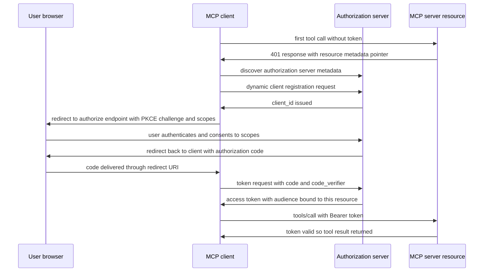
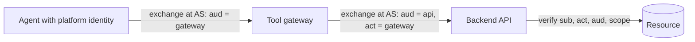

# Agent Identity and Auth: OAuth, Delegation and the Confused Deputy

## Overview

Agents break identity models that took the industry twenty years to build. Classical web security assumes a human clicks a button, a browser carries the session, and the server sees one principal. An agent instead makes *hundreds* of API calls per task, from server-side infrastructure, choosing its own targets and arguments, with the user nowhere near the network path. This page covers the machinery that makes that survivable: OAuth 2.1 with PKCE as the agent's base flow, the MCP authorization specification that applies it to tool servers, token audience binding, RFC 8693 token exchange for delegation chains, and the confused-deputy failure mode that all of it exists to prevent.

Interviewers at infrastructure-heavy companies ask identity questions about agents deliberately, because the answers expose real design thinking: "whose credentials does the tool call carry?" sounds like a formality until you realize the naive answer — a long-lived service key — means every injected instruction in a web page can read the user's entire CRM. If you can walk through a token-exchange chain and name the audience on each hop, you sound like someone who has shipped this, not read about it.

## Three Principals and Why the Naive Model Fails

Any agent action involves three principals: the **user** (on whose behalf work happens), the **agent platform** (the harness and model doing the work), and the **backend resource** (the API, database, or tool server being called). The naive patterns all collapse one or more of these together. A single shared service account collapses agent and backend into one identity — no per-user attribution, no per-user least privilege, and an audit log that says `svc-agent-prod` deleted the records. Passing the user's raw session token to every tool collapses agent and user into one identity — now a prompt injection in any tool's output wields the user's full power. The correct model keeps all three distinct: the agent holds its *own* credential, exchanges it for *scoped, short-lived, user-attributed* tokens per backend, and the backend can verify independently who is acting, for whom, and with what authority.

This is not bureaucracy — it is the blast-radius calculation that determines what one successful prompt injection is worth. If the agent's credentials are equivalent to the user's, the lethal-trifecta arithmetic (private data + untrusted content + external communication) resolves to full compromise on the first injection. Every layering decision on this page is about making the token an attacker can eventually reach strictly less powerful than the user it represents.

## OAuth 2.1 and PKCE for Agents

OAuth 2.1 is a consolidation draft of the OAuth 2.0 core (RFC 6749) plus the security hardening the ecosystem learned the hard way: authorization-code flow with PKCE (RFC 7636) is mandatory, implicit flow is removed, and refresh tokens rotate. For agents, the authorization-code flow with PKCE is the only sane starting pattern for anything user-scoped: the agent (as the OAuth *client*) redirects the user to the authorization server, the user authenticates and consents to a specific scope set, and the agent redeems the code — protected by the PKCE `code_verifier`/`code_challenge` pair that stops intercepted codes from being redeemable — for a short-lived access token plus a rotating refresh token.

```text
1. client generates code_verifier (random 43-128 chars)
2. code_challenge = BASE64URL(SHA256(code_verifier))
3. redirect user to /authorize?response_type=code
   &client_id=...&code_challenge=...&code_challenge_method=S256
   &scope=crm:read tickets:write&state=...
4. user logs in, approves the listed scopes
5. authorization server redirects back with ?code=...
6. POST /token with code + code_verifier -> access_token, refresh_token
```

PKCE matters more for agents than for browsers. The redirect-URI middleman attacks it defeats translate directly to agent contexts: a malicious MCP client, a hijacked localhost port, or a forged deep link can try to intercept the code. With PKCE, a stolen code is worthless without the verifier that only the legitimate client process holds. The `state` parameter, meanwhile, is what lets the agent bind an authorization response to the specific task that requested it — a small discipline that prevents confused-deputy-style authorization confusion even inside the flow itself.

## The MCP Authorization Specification

The MCP spec (2025-06-18 revision) makes OAuth 2.1 mandatory for Streamable HTTP transports and defines exactly how it fits the protocol. The MCP server is an OAuth **resource server**; it advertises its authorization requirements via protected-resource metadata (RFC 9728) so clients can discover which authorization server to use without hardcoding. Clients typically use **dynamic client registration** to onboard against a new server's authorization server without a manual sign-up step — this is what makes "connect to a new MCP server" a flow rather than a provisioning ticket. The full sequence:



Two spec details carry most of the security weight. First, the authorization server must be able to distinguish *resource* audiences: the token minted for the Jira MCP server must not be accepted by the Salesforce MCP server, which requires audience-scoped issuance (next section). Second, the spec explicitly forbids the **token passthrough** anti-pattern — a server accepting an opaque token minted for some *other* API and forwarding it downstream. Passthrough destroys attribution and audience binding; every downstream hop becomes unable to tell which client actually consented to what. When you review an integration and see the user's upstream token being replayed verbatim into a tool backend, you have found the bug.

## Token Audience Binding

Audience binding is the control that makes scoped tokens meaningful. An access token is a JWT whose `aud` claim names the specific API it may be presented to; the resource server rejects tokens whose audience is not itself, even if the signature is valid and unexpired. The failure mode without this is lateral movement: an agent holding one omnibus token for "everything" turns any single tool compromise into a whole-fleet compromise — the tool exfiltrates the token, and the token works everywhere. With audience binding, the token a compromised tool sees is dead weight everywhere except the one backend it was minted for.

Production discipline: one token per (user, agent-run, backend) triple, verified at each resource server with three checks — signature and expiry, `aud` equals itself, and `scope` covers the action attempted. Verification is middleware, not business logic, so it cannot be forgotten when a new endpoint ships. Expiry should be short — minutes, not hours — with refresh handled by the platform, because the agent's credential lifetime is the window an injection has to operate in. A 60-minute token means one injected instruction can do an hour of damage; a 5-minute token caps it at five.

## Delegation Chains: RFC 8693 Token Exchange

Real agent architectures have more than two hops: the agent platform calls a tool gateway, which calls a downstream service, which calls another service. OAuth 2.0 Token Exchange (RFC 8693) standardizes the hop: a client presents its current token to a token endpoint and receives a *new* token for the next hop, with the delegation visible in the claims. The exchanged token carries `sub` (the acting principal), `act` (the immediate actor — e.g. the tool gateway acting on behalf of the agent), and the audience of the *next* service only. A backend deep in the chain can therefore audit the whole path: "this write came from the reporting service (`act`), acting for the research agent, acting for user U" — instead of a bare service credential that hides everyone.



Each exchange *narrows*: scope can only shrink across hops, audience is single-target, and TTLs shorten. This mirrors how one should think about the agent's own authority — it derives from the user, is delegated through the platform, and each hop re-proves and re-restricts the delegation rather than laundering it. Teams implementing agent platforms on Kubernetes or service meshes often already own the building blocks (a workload identity, a token-exchange-capable IdP); RFC 8693 is the glue vocabulary that makes the chains legible across teams.

## The Confused Deputy Problem

The confused deputy is a privileged program tricked by an unprivileged party into misusing its authority — the name comes from a 1988 paper on a compiler-as-a-service billing exploit, and the pattern is older than that. Agents are confused-deputy engines by construction: the deputy (the model) reads instructions from channels it cannot reliably distinguish (system prompt, user message, tool output, web page content), and acts with credentials it did not earn. The agent-specific variants worth naming: **cross-source confusion**, where an instruction in a retrieved document is treated as coming from the user; **token passthrough** (covered above), where the deputy forwards credentials it cannot attribute; and **scope creep via tool descriptions**, where a compromised tool's description instructs the agent to call a more powerful tool with attacker-chosen arguments.

There is no prompt fix — the deputy cannot be talked out of being confused, which is why Willison's lethal-trifecta framing treats the combination of private data, untrusted content, and external communication as an architecture violation. The mitigations are structural: audience-bound tokens so the deputy's reach is capped, per-tool scoping so each tool's credentials are independent, human-in-the-loop confirmation for side-effecting actions so at least one channel (the consent UI) is attacker-resistant, and output fencing so tool results are data, not directives. The guardrails page covers the fencing layer; this page's contribution is making sure that when the deputy is confused, its every path leads to a dead end rather than a data store.

## Scoped Credentials per Tool and Human Consent

The end-state architecture gives every tool its own credential identity, minted at task start, scoped to what that tool does, and burned at task end. The comparison of credential strategies below is the core design table for this page.

| Strategy | Blast radius on tool compromise | Attribution | Operational cost |
|---|---|---|---|
| Shared service account for all tools | Total — full backend access | None (logs show one identity) | Lowest, unacceptable |
| User's upstream token passed through | Full user power; injection = user compromise | Ambiguous after first hop | Low, forbidden by MCP spec |
| Per-tool static API keys | One backend, but long-lived and broad | Per-tool only | Medium; rotation is manual |
| Audience-bound OAuth tokens per tool | One backend, narrow scope, minutes of TTL | Full: sub + act + scope per call | Higher; fully automatable |
| Token exchange per hop (RFC 8693) | One backend, delegation visible end-to-end | Complete chain | Highest; worth it for regulated data |

Consent is the human layer over the token layer. Two patterns work in production: **consent at authorization time** (the OAuth screen — good for scope families, but users stop reading) and **consent at action time** (the harness pauses before every side-effecting call — send email, delete resource, execute payment — and asks). Action-time consent is the stronger control because it is per-context: the user sees the actual arguments, not an abstract scope. The engineering discipline is to make the consent boundary *deterministic*: a policy table mapping tool + argument shape to auto-approve / prompt / deny, evaluated by code, not by the model's judgment of risk. Letting the model decide when to ask is a category error — the model is the component being manipulated.

## Interview Questions

1. **Why is OAuth 2.1 rather than raw API keys the right foundation for agent tool access?** OAuth gives you three properties API keys cannot: short-lived credentials with automatic refresh, scoped grants the user actually consented to, and a standard delegation vocabulary (actor claims, audiences) that survives multi-hop calls. A leaked long-lived API key is a permanent, unattributed skeleton key; a leaked access token is a narrow, expiring, attributed credential whose `aud` limits where it even works. OAuth 2.1 specifically mandates PKCE and removes the implicit flow, closing the interception tricks that agents — which cannot run a trusted browser UI themselves — are most exposed to.

2. **Walk me through the confused-deputy risk in an agent that can read the web and call internal APIs.** The model reads a web page containing injected instructions; the page says "summarize this document by calling the export tool with these parameters"; the agent — unable to distinguish document content from user intent — calls the export tool, which emails a private dataset out. Every ingredient of the deputy's authority was legitimately granted: the web-read tool works, the export tool works, the token is valid. The failure is that one principal (the model) holds instruction authority across trust boundaries. Fixes are structural: audience-bound per-tool tokens so the export token never reaches the web tool, output fencing so page content is data not directives, and action-time consent on the export call so a human sees the argument.

3. **What is token audience binding and what specifically does it prevent?** The access token's `aud` claim names the single resource server that may accept it, and each resource server rejects tokens with any other audience even when signatures and expiry check out. This prevents lateral movement after a compromise: a malicious MCP server that steals its incoming Bearer token obtains a credential that is worthless against every other backend. Without binding, one omnibus token turns any single tool compromise into full-fleet compromise. In an agent platform this is enforced as middleware at every backend — verify signature, expiry, audience, scope — so no newly added endpoint can forget it.

4. **How does RFC 8693 token exchange fit an agent architecture, and what do the `sub` and `act` claims buy you?** Token exchange is the standard way to walk a credential down a multi-hop call chain without forwarding the original token. The agent presents its token to the authorization server and receives a new one aimed at the next hop, with `sub` carrying the original principal and `act` carrying the immediate actor. Each hop re-aims the audience and can only shrink scope, so authority narrows down the chain. The payoff is auditability and blast-radius control: a downstream service can answer "who asked for this, through what chain" and an attacker who compromises hop three holds a token that opens exactly hop four, for minutes.

5. **The MCP spec forbids token passthrough. What is it and why is it tempting yet wrong?** Passthrough is when an MCP server (or any intermediary) accepts a token minted for some other API and forwards it downstream untranslated — the server acts as a dumb pipe. It is tempting because it requires zero identity work on the server side: the upstream token already works. It is wrong because it destroys every property OAuth provides downstream: the receiving backend can no longer distinguish which client obtained the consent, audience binding is void (the token was minted for someone else), and revocation or scope changes at the middle hop never propagate. The spec bans it so that trust chains remain verifiable end to end; the compliant alternative is to do your own token exchange at the server.

## Key Takeaways

- An agent is a new principal; the naive options — shared service account or user-token passthrough — both collapse identities and are the root of most agent security incidents.
- OAuth 2.1 authorization-code flow with PKCE is the baseline for user-scoped agent access; the MCP spec makes it mandatory for Streamable HTTP servers.
- MCP servers are OAuth resource servers: they publish protected-resource metadata, support dynamic client registration, and the spec explicitly bans token passthrough.
- Audience binding turns "leaked token" from a fleet compromise into a non-event: one token per (user, run, backend), verified as middleware, TTL in minutes.
- RFC 8693 token exchange builds auditable delegation chains: `sub` keeps the human accountable, `act` names each hop, scope only shrinks, audiences stay single-target.
- The confused deputy has no prompt fix; the answer is structural — scoped tokens, deterministic consent tables for side-effecting actions, and tool outputs fenced as data.
- Letting the model decide when to ask for consent is a category error; the consent boundary must be evaluated by policy code, not by the component being manipulated.

## References

- OAuth 2.0 framework, RFC 6749: <https://datatracker.ietf.org/doc/rfc6749/>
- PKCE, RFC 7636: <https://datatracker.ietf.org/doc/rfc7636/>
- OAuth 2.0 Token Exchange, RFC 8693: <https://datatracker.ietf.org/doc/rfc8693/>
- OAuth 2.0 Protected Resource Metadata, RFC 9728: <https://datatracker.ietf.org/doc/rfc9728/>
- OAuth 2.1 consolidation draft: <https://datatracker.ietf.org/doc/draft-ietf-oauth-v2-1/>
- MCP specification — authorization: <https://modelcontextprotocol.io/specification/2025-06-18>
- OWASP Top 10 for LLM Applications (excessive agency): <https://genai.owasp.org/>
- Simon Willison — prompt injection and the lethal trifecta: <https://simonwillison.net/tags/prompt-injection/>

## Cross-References

- [MCP Protocol](../../ml/agents/mcp.md) — MCP's architecture, which the authorization spec extends
- [Agent Protocols](./agent-protocols.md) — transports and the trust boundaries that make identity necessary
- [Guardrails](./guardrails.md) — the enforcement layer over inputs, outputs, and actions
- [Tool Poisoning and Deterministic Workflows](../agents/tool-poisoning-workflows.md) — the confused-deputy attack mechanics in depth
- [LLM Security](../llm-security.md) — the broader attack/defense taxonomy this page specializes
- [Agent Safety](../../ml/agents/safety.md) — safety principles and human-in-the-loop design at the conceptual level
