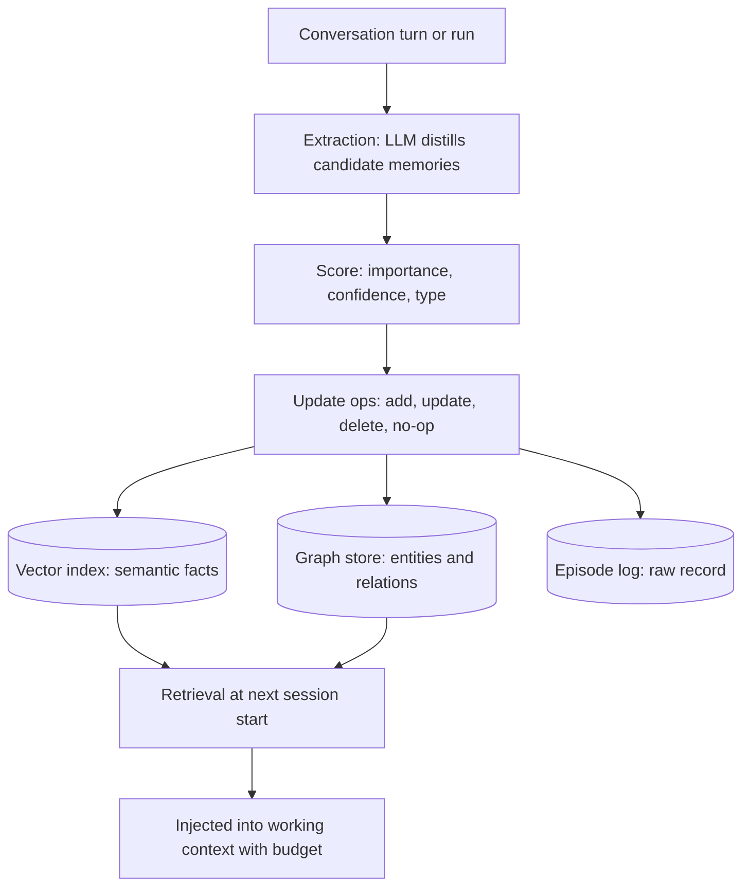

# Agent Memory: Advanced Systems Engineering

## Overview

The basics of agent memory — short-term context, long-term vector stores, episodic records — are covered in [Agent Memory](../../ml/agents/memory.md). This page is the production sequel: the memory types that actually need different engineering (episodic, semantic, procedural), the systems that operationalize them (Mem0's extraction pipeline, Letta/MemGPT's operating-system metaphor, temporal knowledge graphs), the background jobs (consolidation, decay, conflict resolution) that keep memory correct over months rather than sessions, and the multi-tenant scoping rules that keep one user's memories out of another user's context.

Memory is where agent interviews go when they want to distinguish "used a framework" from "operated a system". The follow-ups are unforgiving: "a user got another user's context in their answer — what broke?", "your memory store has grown 40% per month — what is your decay policy?", "the agent contradicts what it told the user last week — how do you resolve conflicts between stored facts?". Each question has an engineering answer, and none of them is "add more context".

## The Taxonomy That Maps to Engineering

The cognitively-flavored taxonomy only earns its keep when each type maps to a distinct storage, retrieval, and lifecycle strategy. That mapping is the table below — the rest of the page implements its rows.

| Type | Content | Storage shape | Retrieval trigger | Lifecycle |
|---|---|---|---|---|
| Working | Current task scratchpad, plan, intermediate results | In-context block, checkpointed state | Always (it is the context) | Dies with the run or persists as run state |
| Episodic | Specific past interactions: what was asked, done, whether it worked | Append-only event log + embeddings | Query similarity to current task | Consolidate into semantics; expire raw episodes |
| Semantic | Distilled facts, preferences, entity attributes | Vector store and/or knowledge graph | Injection at session start; query-time similarity | Long-lived; versioned, conflict-resolved, decaying |
| Procedural | How to do things: successful tool sequences, workflows, playbooks | Skill library; prompted procedures | Task-class match | Slow-changing; promote on repeated success |

Two of these deserve sharpening beyond the basics page. **Episodic memory** is most valuable not as a recallable transcript but as *training material for consolidation* — the raw episodes are the evidence from which semantic facts and procedural playbooks are distilled, which is why the raw layer should be append-only and cheap while the distilled layers are curated. **Procedural memory** is the type most teams skip entirely: an agent that solved "deploy the staging environment" twelve times should not rediscover the tool sequence the thirteenth time. Voyager's skill library (Wang et al., 2023) is the canonical research formulation — verified code skills stored, indexed by description, retrieved and composed for new tasks — and its production analogues are stored playbooks and reusable subagent definitions.

## Write Path: from Conversation to Durable Memory

The engineering core is the write path: deciding, during or after a conversation, what deserves to persist and in what form. The pipeline that has become standard — Mem0 articulates it cleanly, and it descends from the Generative Agents memory stream (Park et al., 2023) — treats memory creation as a *pipeline*, not a side effect of logging:

The **update-ops step is the one most homegrown systems lack**: instead of appending every extracted fact and letting duplicates accumulate, the pipeline compares each candidate against existing memories and issues an explicit operation — add new fact, update existing fact (with the change preserved), delete superseded fact, or no-op. Mem0's implementation exposes exactly these operations; the difference between that and naive "embed and append everything" is the difference between a memory system that stays navigable and one that drowns in near-duplicates within weeks. The extraction step is itself a costed LLM call (or a small fine-tuned model) — budget it, sample it, and treat its prompt as versioned production code.

## Vector Stores, Graph Stores and the OS Metaphor

Vector memory (embed facts, similarity-search at read time) handles "what is relevant to this query" but is weak on structure: it cannot answer "which accounts did this customer mention across all sessions?" without turning every fact into a separate retrieval. Graph memory (entities as nodes, relations as edges, optionally with embeddings attached) handles the structured queries and — in **temporal knowledge graph** implementations like Zep's Graphiti — versioned validity: an edge records "X was true from t1 to t2", so the system can answer with facts *as of a time* rather than facts flattened into timeless assertions. Production systems increasingly run both: vectors for fuzzy relevance, graph for entity-consistent facts, as Mem0's optional graph layer and Zep's architecture both do.

The other structural idea worth internalizing is Letta/MemGPT's **operating-system metaphor** (Packer et al., 2023): the model's context window is *main memory* — scarce, fast, always visible — while external stores are *disk*, visible only through explicit operations. The system then needs a paging discipline, and MemGPT's contribution is that the LLM itself can manage it: the model calls tools like "edit core memory" or "search archival storage", deciding what belongs in context and what gets evicted, with the harness enforcing size limits and handling the interrupts. This reframing — context management as a first-class, self-editing system rather than a prompt template — is the conceptual ancestor of context-compaction features in production agent harnesses, and it is the sharpest single answer to "how do you give an agent unlimited memory with a finite window?".

## Consolidation Jobs

Memory needs janitorial work, and the jobs should run on a schedule, offline, on sampled data — the same batch mindset as data-engineering pipelines. The core jobs: **dedup/merge** (near-duplicate facts within a similarity threshold get merged with source preservation), **summarization** (raw episodes older than N days compress into episode summaries; the raw tier can then be dropped or cold-stored), **reflection** (Generative Agents' contribution: periodically ask "what higher-level facts follow from the last 100 memories?" and store the answers as new semantic entries — this is how "the user asked about pricing three times this month" becomes "user is evaluating our pricing tier"), and **schema promotion** (recurring procedural patterns get promoted into stored playbooks). Each job is an evaluable transformation: run it on a sample, diff before/after, measure fact-loss and hallucination rates with the eval machinery from [Agent Observability](./agent-observability.md).

The scheduling parameter that matters is **when relative to usage**: consolidation offline (nightly batch) keeps read latency predictable and lets you use cheap models, while Letta's "sleep-time compute" explores doing it *during* idle time with the agent's own model so consolidation quality tracks usage patterns. Either is defensible; what is not defensible is no consolidation at all — memory systems without janitorial jobs grow monotonically noisier, and retrieval precision decays with store size until users experience the agent as "getting worse over time", which is the most common way memory features get turned off.

## Forgetting and Decay Policies

Production memory needs a forgetting policy as deliberate as its storage policy. The mechanisms, roughly in order of aggressiveness: **TTL on raw tiers** (episodes expire after N days unless consolidated), **recency-weighted relevance** (the Generative Agents retrieval score multiplies similarity by an exponential recency factor, so old-but-relevant memories still surface but old-irrelevant ones naturally sink), **importance-based retention** (high-importance facts — explicit user statements, corrections — persist regardless of age; low-importance small talk decays fast), and **hard deletion** (GDPR erasure and tenant offboarding require the ability to delete *everything* associated with an identity, including derived facts and embeddings — design the cascade before launch, not after the first legal request). The decay parameters are SLO-adjacent: store size growth, retrieval precision@k over time, and stale-fact rate are the three metrics that tell you whether your policy is right, and all three come from the trace machinery.

Forgetting also has a correctness role beyond hygiene: **contradiction cleanup**. When "user prefers email" and later "user says stop emailing me" coexist, decay alone does not resolve which is current — the conflict-resolution machinery below does, and forgetting exists to retire the *loser* of that resolution rather than leaving both in the store poisoning future retrievals.

## Conflict Resolution and Multi-User Scoping

Conflicts are inevitable — users change, sources disagree, extraction misreads. The resolution policy needs to be explicit and mechanical. The standard hierarchy: **explicit user corrections win** ("actually, I meant the Denver office") over older statements; **more recent loses to more authoritative** — a correction overrides, but a casual mention does not override a contractual fact; **temporal validity** — both facts can be true at different times, and a temporal graph stores the intervals instead of picking a winner; **source reliability** — facts from authenticated user statements outrank facts inferred from behavior. Implement the hierarchy as deterministic code over typed memory records (each carrying timestamp, source, confidence), not as model judgment at read time — the same "the model cannot be its own control plane" principle from the guardrails page. When a conflict is detected at write time, resolve then; when detected at read time (two contradictory facts retrieved together), surface both with provenance rather than silently choosing.

Multi-user scoping is the non-negotiable layer: every memory record is keyed by a namespace triple — **tenant / user (or subject) / agent-scope** — and retrieval filters by namespace *at query time* (a pre-filter in the vector index or graph query), never as a post-filter on results. Post-filtering is the bug behind cross-user leakage incidents: the top-k retrieved *includes* another tenant's memory, and the post-filter merely removes the evidence after the model already saw it. The same discipline extends to derived data — embeddings, graph edges, consolidation outputs must inherit the namespace — and to debugging, where an engineer's read access to memory stores needs its own access model. Getting scoping wrong is not a quality bug; it is a data-breach, which is why this paragraph is the one to internalize verbatim.

## Interview Questions

1. **Your agent's memory store grows 40% per month and retrieval quality is dropping. What do you do?** First, measure the composition: raw episodes, extracted facts, duplicates — the growth is usually the raw tier plus never-deduplicated extractions. Then deploy the janitorial jobs: dedup/merge with a similarity threshold, episode summarization with TTL on raw records, reflection to promote recurring patterns into fewer, higher-value semantic entries. Add recency-weighted retrieval so sinking old low-value memories does not require deleting them. Finally, set the three SLOs — store size, retrieval precision@k, stale-fact rate — and alert on them. The failure you are describing is the classic no-consolidation failure: memory treated as an append-only log rather than a curated store with a decay policy.

2. **How do you prevent one user's memories from appearing in another user's context?** Namespace every record — tenant/user/scope — and filter at query time inside the index or graph engine, never as post-filtering of results. Post-filtering fails catastrophically: the top-k retrieval already surfaced the other tenant's memory into the candidate set, and with embeddings the leakage can reach the model through near-miss similarities. The same inheritance rule applies to derived artifacts — consolidated summaries, graph edges, and embeddings must carry the source namespace. Finally, audit it: a periodic synthetic test that retrieves across two seeded tenants and asserts zero cross-namespace hits, wired into CI.

3. **Explain the MemGPT operating-system metaphor and what it buys you.** MemGPT treats the context window as main memory and external stores as disk, and — the key move — lets the LLM itself manage paging through tool calls: editing its core memory blocks, searching archival storage, deciding what to evict. The harness enforces the size limits and handles interrupts, so the model gets effectively unbounded memory with a finite window and stays in control of what is resident. What it buys: a principled answer to context management (self-editing memory instead of a fixed prompt template), and the architectural ancestor of compaction in production harnesses. The engineering cost is that the model's paging decisions can be wrong, so the harness needs guardrails — size enforcement, audit of every memory edit, and evals over memory-editing behavior.

4. **The agent contradicted what it told the same user last week. Design the fix.** The bug is untyped, unversioned memory: both facts live in the store as flat vectors and retrieval surfaces whichever is more similar. The fix: memory records carry timestamp, source, and confidence; write-time conflict detection compares candidates against existing facts in the same namespace; resolution follows a deterministic hierarchy — explicit corrections win, temporal validity intervals store "true from t1 to t2" rather than picking a winner, source reliability breaks ties. At read time, contradictory retrieved facts are surfaced with provenance rather than silently resolved. Underneath it all, the loser of a conflict gets retired by the forgetting policy so it stops contaminating retrievals.

5. **When do you need a graph store in addition to vectors for agent memory?** When queries are structural rather than fuzzy: "which projects did this customer mention across all sessions?", "who at this account said what, and when?" — multi-hop, entity-consistent questions that vector similarity answers badly because each fact is an isolated embedding. Temporal knowledge graphs add versioned validity, so the system answers with facts as of a time. The pragmatic production shape is both: vectors for relevance-ranked fuzzy retrieval, graph for entity-structured facts, with the write pipeline feeding both (Mem0's graph layer and Zep's Graphiti are the reference architectures). If your memory is mostly preferences and episodic recall, vectors alone are fine — the graph earns its keep when entity relationships and time are load-bearing.

## Key Takeaways

- Memory types earn their keep only when mapped to distinct engineering: episodic (append-only raw + consolidation), semantic (versioned facts, vectors + graph), procedural (skill libraries, playbooks) — plus working memory as checkpointed state.
- The write path is a pipeline, not a log: extraction → scoring → explicit update ops (add/update/delete/no-op) → store; naive embed-and-append drowns in near-duplicates within weeks.
- MemGPT's OS metaphor — context as main memory, stores as disk, model-managed paging — is the conceptual basis for compaction and self-editing memory in production harnesses.
- Consolidation jobs (dedup, summarize, reflect, promote procedures) run offline on a schedule; without them, retrieval precision decays with store size and users experience the agent "getting worse".
- Forgetting is deliberate: TTLs on raw tiers, recency-weighted retrieval, importance-based retention, and GDPR-grade hard deletion with the cascade designed before launch.
- Conflict resolution is deterministic code over typed records (timestamp, source, confidence), with temporal validity as the honest answer when both facts were true at different times.
- Multi-tenant scoping filters by namespace at query time, never post-hoc — post-filtering is the mechanism behind cross-user leakage incidents.
- Observe memory like any subsystem: store size, precision@k, stale-fact rate, and retrieval-hit quality as trace attributes and SLOs.

## References

- MemGPT: Towards LLMs as Operating Systems, Packer et al., 2023: <https://arxiv.org/abs/2310.08560>
- Generative Agents: Interactive Simulacra of Human Behavior, Park et al., 2023: <https://arxiv.org/abs/2304.03442>
- Voyager: An Open-Ended Embodied Agent with Large Language Models, Wang et al., 2023: <https://arxiv.org/abs/2305.16291>
- Mem0 — memory layer source: <https://github.com/mem0ai/mem0>
- Mem0 documentation: <https://docs.mem0.ai/>
- Letta (MemGPT production system) source: <https://github.com/letta-ai/letta>
- Letta documentation: <https://docs.letta.com/>
- Zep: A Temporal Knowledge Graph Architecture for Agent Memory, Rasmussen et al., 2025: <https://arxiv.org/abs/2501.13956>
- LangGraph — checkpointed state as working memory: <https://langchain-ai.github.io/langgraph/>

## Cross-References

- [Agent Memory](../../ml/agents/memory.md) — the basics page: memory types, short-term management, RAG-style recall
- [RAG Systems](../rag-systems.md) — the retrieval machinery memory systems reuse
- [Embeddings](../llm-serving/embeddings.md) — the vector substrate under semantic memory
- [Agent Observability](./agent-observability.md) — retrieval-quality observability and memory SLOs
- [Agent Systems (advanced)](../advanced/agent-systems.md) — harness design for checkpointed working memory
- [Multi-Agent Topologies](./multi-agent-topologies.md) — shared-blackboard state and its scoping pitfalls
