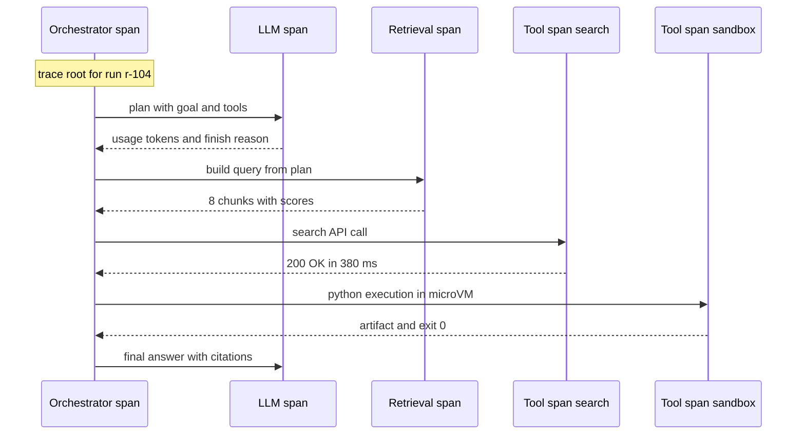

# Agent Observability: Tracing, Cost and Replay

## Overview

An agent run is a long chain of model calls, tool calls, retrievals, and decisions, and the final output almost never shows you where it went wrong. Agent debugging is trace debugging: each run becomes a tree of spans — one per LLM call, tool invocation, retrieval, and agent step — and failures are located by walking that tree. This page covers the standard that makes traces portable (OpenTelemetry GenAI semantic conventions), a span taxonomy for agent systems, cost and latency rollups that turn traces into unit economics, the platform landscape (LangSmith, Langfuse, Phoenix, Braintrust, OpenLLMetry), and how traces connect to evaluation and replay.

Interviews treat observability as the marker between people who have operated agents and people who have prototyped them. "How do you debug an agent that returned the wrong answer after 40 tool calls?" has one serious answer — pull the trace, find the poisoned step — and a dozen non-answers that involve guessing. The verified index for this book puts it in one line: "Agent debugging is trace debugging. Without this you are reading logs and guessing."

## Why Logs Are Not Enough

Print statements and unstructured logs fail for agents for three reasons. First, an agent run is a *tree*, not a line: one user request fans out into sequential and nested calls, and flattening that into a log stream loses the parent-child structure you need to answer "what context did this tool call see?". Second, the unit of analysis is the *run*, not the service: you need to reconstruct one specific run end-to-end, including inputs, outputs, token counts, and timing per step. Third, failures are usually *conditional*: the same task succeeds in 95% of runs, and only a trace diff between a good and bad run reveals the divergent step — a bad retrieval at step 3, a stale element at step 17, a tool whose schema drifted.

A trace solves all three by representing the run as nested spans with shared IDs, typed attributes, and captured inputs/outputs. The engineering habit that pays: treat the trace as the *primary debugging artifact* and logs as its substrate — every alert links to a trace, every trace links to the spans, every span carries the context the step saw. When a customer reports a bad answer, the conversation starts from a trace link, not from a grep.

## OpenTelemetry GenAI Semantic Conventions

The OpenTelemetry GenAI semantic conventions define standard span names and attribute keys for generative AI systems, so that instrumentation from different SDKs and vendors produces comparable traces. The core attributes use the `gen_ai.` namespace: `gen_ai.system` (the vendor, e.g. `openai`), `gen_ai.request.model` and `gen_ai.response.model` (requested vs actually-served model — they differ with routing), `gen_ai.request.temperature` and `gen_ai.request.max_tokens`, `gen_ai.usage.input_tokens` and `gen_ai.usage.output_tokens`, and `gen_ai.response.finish_reasons`. Prompt and completion contents are captured as events rather than span attributes, precisely so they can be enabled, sampled, or redacted independently of the span structure. Agent- and tool-specific conventions add span kinds for agent execution and tool invocation.

```python
with tracer.start_as_current_span(f"chat {model}") as span:
    span.set_attribute("gen_ai.system", "openai")
    span.set_attribute("gen_ai.request.model", model)
    span.set_attribute("gen_ai.request.temperature", 0.2)
    resp = client.chat.completions.create(model=model, messages=messages)
    span.set_attribute("gen_ai.usage.input_tokens", resp.usage.prompt_tokens)
    span.set_attribute("gen_ai.usage.output_tokens", resp.usage.completion_tokens)
    span.set_attribute("gen_ai.response.finish_reasons", [resp.choices[0].finish_reason])
```

Instrument to these conventions rather than to a vendor SDK, for the same reason you standardize on OpenTelemetry generally: the tracing choice is the one observability decision that is hard to reverse. Vendor SDKs lock trace storage to their platform; conventions-based instrumentation means LangSmith, Langfuse, Phoenix, or your own collector can all consume the same spans, and switching backends is a collector config change rather than a rewrite. OpenLLMetry exists to apply exactly this pattern across the popular LLM and agent frameworks.

## Span Taxonomy for Agent Systems

A practical agent trace uses four span types with distinct payloads. Keeping them distinct — rather than dumping everything into one "agent" span — is what makes rollups and diffs computable later.

| Span type | Name pattern | Key attributes | Captures |
|---|---|---|---|
| Agent | `create_agent`, run step spans | agent name, goal, step index, parent run ID | The loop itself: one span per planning step or handoff |
| LLM | `chat {model}` | `gen_ai.system`, model, temperature, usage tokens, finish reason | The inference call with prompt/completion events |
| Tool | `execute_tool {tool}` | tool name, arguments hash, exit status, duration, error class | One span per tool invocation, sandboxed or not |
| Retrieval | `retrieve {index}` | query text (redacted), index, top_k, chunk IDs and scores | RAG lookups, so bad-context failures are visible |

Two attributes matter more than beginners expect. **Arguments hash** on tool spans lets you detect repetition loops (the same tool called with the same arguments many times) without storing full argument payloads everywhere. **Chunk IDs and scores** on retrieval spans turn "the answer was wrong" into "the answer was wrong because the top chunk scored 0.51 and was about a different fiscal year" — which is an actionable finding, cross-referenced against the [RAG evaluation](../llm-serving/evaluation.md) metrics. A fifth pseudo-type worth standardizing internally: a **guardrail span** recording each rail's decision (allowed/blocked/modified) and its latency, so the guardrails page's budget table can be validated against reality.

### The shape of one run



## Cost and Latency Rollups

Because every LLM span carries token usage and every span carries duration, traces become the source of truth for unit economics. The rollup is arithmetic: sum `gen_ai.usage.input_tokens` and `output_tokens` across LLM spans, multiply by the model's per-million price, add per-call costs of paid tools, and you have **cost per run**. Aggregated across runs and sliced by task type, tenant, and outcome, this becomes the number finance actually cares about — cost per resolved task — and the number engineering cares about: which step is burning the budget.

Worked example: a support agent run with three LLM calls totaling 28,000 input and 1,200 output tokens on a $3/M-input, $15/M-output model costs `28,000/1e6 × $3 + 1,200/1e6 × $15 = $0.084 + $0.018 = $0.102` in tokens, plus two paid tool calls at $0.01 — call it **$0.12 per run**. At 10,000 runs/day that is $1,200/day, and the trace-level breakdown shows you the levers: the planning call re-sending 12k tokens of unchanged context every step (fix: context caching or compaction), or a 9k-token retrieval dump for a question that needed 2k (fix: retrieval quality, which the retrieval spans quantify). Latency rolls up the same way from span durations into p50/p95 per step type — and the p95 is usually dominated by one fixable step, not by the model.

The cost page in this section of the repo, [Cost Optimization](../cost-optimization.md), covers the levers (caching, model routing, batch APIs); what observability contributes is *attribution* — without per-span token accounting you can only guess which lever matters.

## Platform Landscape

| Platform | Deployment | Interop stance | Distinctive strength |
|---|---|---|---|
| LangSmith | SaaS | Native LangChain/LangGraph, plus REST | Tight loop from traces to datasets, evals, and prompt versioning |
| Langfuse | Open-source, self-hostable | OTel-compatible API | The self-hosting option when prompts or data cannot leave your infrastructure |
| Phoenix (Arize) | Open-source + cloud | OpenTelemetry-native | Tracing and evals on raw OTel spans, strong retrieval analysis |
| Braintrust | SaaS | API + SDK | Eval-first workflow: datasets, scorers, prompt playground, logging |
| OpenLLMetry | Library (not a backend) | OpenTelemetry instrumentation | Auto-instruments LLM/agent frameworks into standard OTel spans |

The selection logic is short. If you are all-in on the LangChain ecosystem, LangSmith is the path of least resistance and its trace-to-dataset pipeline is genuinely good. If data residency or self-hosting is a requirement, Langfuse or Phoenix — both open-source, both consumable from the same OTel instrumentation, so the choice is not a lock-in decision. If your team's center of gravity is offline evaluation rather than live tracing, Braintrust's eval-first design fits. OpenLLMetry is orthogonal: it is the instrumentation layer you would use with any of these. The one anti-pattern to avoid: letting a vendor's proprietary trace format become load-bearing in your own tooling, which is what the GenAI conventions exist to prevent.

## Eval Integration and Replay

Traces and evals are two halves of one loop. **Traces feed evals**: export failing traces into an eval dataset (the input, the trajectory, the expected result), and your offline suite tests against the *actual* distribution of production failures rather than a hand-written approximation. **Evals feed traces**: run LLM-as-judge or rule-based scorers over sampled production traces and attach the scores as span attributes, so the trace view itself shows quality per run — this is how you monitor a subjective outcome (was the answer actually right?) as an SLO. The conceptual evaluation material lives in [Agent Evaluation](../../ml/agents/evaluation.md); the observability contribution is the plumbing that makes evals run on real trajectories. Inspect AI is the open framework most often used when those evals must withstand scrutiny.

**Replay** is the ability to re-execute a run from a saved state — and its honest engineering status is "partially solvable". Determinism fails at the model (sampling temperature means two runs differ) and at the world (an API returns different data today). What you can build: checkpoint state after every step (LangGraph's checkpointer gives time travel over the state graph; Temporal's event history replays workflow logic deterministically), record tool responses during the original run, and replay with *recorded* tool responses so the re-run is a controlled experiment — change exactly one thing (the prompt, the model, the guardrail config) and diff the trajectory. That one-variable replay is the most powerful debugging tool in this page: it converts "the agent is flaky" into a bisection problem. PII scrubbing happens before trace storage, because replays multiply your copies of whatever the run saw.

## Interview Questions

1. **An agent returned a wrong answer after 40 tool calls. Walk me through your debugging process.** Pull the trace first — I want the span tree, not logs. Diff it against a successful run of the same task to find the first divergent step: usually a retrieval that returned low-scored chunks, a tool that failed and whose error the model misread, or a tool schema drift that made the model's arguments invalid. Then replay from the checkpoint at the divergence point with recorded tool responses, changing one variable (the prompt, the model, the retrieval top_k) to confirm causality. Finally, export both traces into the eval dataset so the failure class is permanently covered. Guessing from the final output is the anti-pattern — the middle of the run, not the end, contains the information.

2. **Why instrument to OpenTelemetry GenAI conventions instead of a vendor SDK?** Because the tracing decision is the hard-to-reverse one. Conventions-based spans — `chat {model}` with `gen_ai.system`, usage tokens, finish reasons — are consumable by LangSmith, Langfuse, Phoenix, or a self-hosted collector, so the backend choice is a config change and framework migrations do not orphan your historical traces. Vendor SDK instrumentation couples trace format to trace storage, and in a fast-moving agent ecosystem you *will* change frameworks. The conventions also standardize the attributes that rollups depend on — token usage per span — which is what makes cost attribution vendor-neutral.

3. **How do you get from traces to a cost-per-task number, and why does it matter?** Every LLM span records input and output tokens; multiply by model price, sum across the trace, add paid tool calls, and you have cost per run. Aggregate and slice by task type and outcome to get cost per *resolved* task — the only cost number that survives a business review. It matters because it makes optimization arguable with data: a trace breakdown showing 12k tokens of re-sent context per step justifies context caching; a retrieval span showing 9k tokens of mostly-irrelevant chunks justifies retrieval work. Without per-span attribution, cost work is folklore.

4. **What can replay realistically guarantee, and how do you build the achievable version?** Full determinism is impossible: model sampling is stochastic and the world's APIs change under you. The achievable version is one-variable experimentation: checkpoint the run state at every step (LangGraph checkpointer or Temporal event history), record tool responses during the original run, and replay with recorded responses so the environment is fixed. Now changing exactly one thing — prompt, model, guardrail config — produces a trajectory diff that isolates the cause. That, plus exporting divergent replays into eval datasets, converts debugging from anecdote to experiment. Scrub PII before storage because every replay multiplies your copies.

5. **Which observability platform would you pick, and what drives the choice?** Start from constraints, not features. Data cannot leave the infrastructure: Langfuse or Phoenix, both open-source and consumable from the same OTel instrumentation. All-in on LangChain/LangGraph with SaaS acceptable: LangSmith, for its trace-to-dataset-to-eval loop. Evaluation-first team: Braintrust. In all cases instrument with OpenTelemetry GenAI conventions (via OpenLLMetry where it fits), so the platform is swappable — the anti-pattern is building internal tooling on a proprietary trace format. My default for new systems: OTel conventions into Phoenix or Langfuse, revisit once the eval workflow is real.

## Key Takeaways

- Agent debugging is trace debugging: represent each run as a tree of spans and start every investigation from the trace, never from the final output.
- Instrument to OpenTelemetry GenAI semantic conventions (`gen_ai.` attributes, `chat {model}` and `execute_tool {tool}` span names) so traces survive framework and vendor changes.
- Use a four-type span taxonomy — agent, LLM, tool, retrieval — plus guardrail spans; keep arguments hashes and retrieval chunk scores so failures become actionable.
- Traces are the source of truth for unit economics: token rollups per span give cost per run, and slicing by outcome gives cost per resolved task.
- Latency p95 is usually one fixable step, visible in the waterfall — parallel tool calls, context caching, and retrieval precision are the common levers.
- Traces and evals form a loop: export failing traces as eval datasets, attach judge scores back as span attributes, monitor quality as an SLO.
- Replay means checkpointed state plus recorded tool responses — not full determinism — and one-variable replay is the most powerful debugging primitive you can build.

## References

- OpenTelemetry GenAI semantic conventions: <https://opentelemetry.io/docs/specs/semconv/gen-ai/>
- OpenTelemetry semantic conventions source: <https://github.com/open-telemetry/semantic-conventions>
- Langfuse — open-source LLM/agent tracing: <https://langfuse.com/docs>
- LangSmith: <https://docs.smith.langchain.com/>
- Phoenix (Arize) — OTel-native tracing and evals: <https://arize.com/docs/phoenix>
- OpenLLMetry — OTel instrumentation for LLM frameworks: <https://github.com/traceloop/openllmetry>
- Braintrust docs: <https://www.braintrust.dev/docs>
- LangGraph — checkpointing and time travel: <https://langchain-ai.github.io/langgraph/>
- Temporal — durable execution and event history: <https://docs.temporal.io/>
- Inspect AI — evaluation framework: <https://inspect.aisi.org.uk/>

## Cross-References

- [Agent Evaluation](../../ml/agents/evaluation.md) — the conceptual evaluation material the trace-eval loop operationalizes
- [LLM Evaluation](../llm-serving/evaluation.md) — model-level metrics referenced by retrieval and judge spans
- [Cost Optimization](../cost-optimization.md) — the levers the cost rollups attribute
- [Agent Systems (advanced)](../advanced/agent-systems.md) — harness and state design that checkpointing depends on
- [Multi-Agent Topologies](./multi-agent-topologies.md) — tracing multi-agent runs: per-agent spans under one root trace
- [Agent Memory Advanced](./agent-memory-advanced.md) — observing retrieval quality in memory systems
