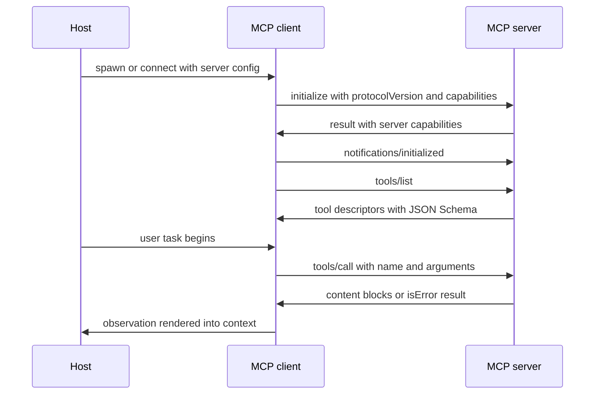
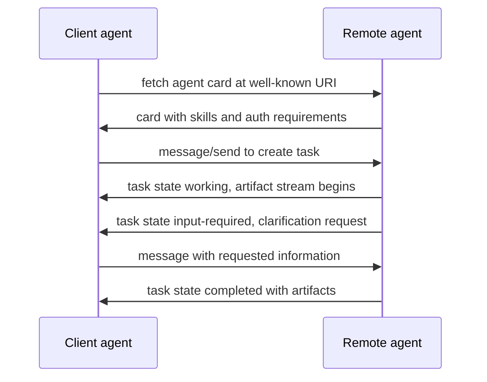

# Agent Protocols: MCP, A2A and the Wire Layer

## Overview

Agents are distributed systems, and distributed systems need protocols. This page covers the wire layer of agentic systems: MCP (Model Context Protocol) as the standard for agent-to-tool connectivity, A2A (Agent2Agent) as the standard for agent-to-agent delegation, and the JSON-RPC 2.0 substrate both ride on. It goes one level deeper than the protocol mechanics in [MCP Protocol](../../ml/agents/mcp.md) — here the focus is transports, session lifecycle, the primitives most integrations miss (sampling, elicitation, roots), and how MCP, A2A, and raw function calling actually compare when you are wiring a production system.

Protocol knowledge is a reliable interview differentiator because it cannot be faked from framework tutorials. "What transport does MCP use and when would you not use stdio?" or "MCP and A2A — competing standards?" have crisp answers that reveal whether someone read the spec or only a wrapper's README. The spec itself is short — a few dozen pages, versioned by date — and is the single highest-yield reading assignment in this section.

## Recap: MCP in One Screen

MCP, introduced by Anthropic in late 2024 and now developed openly with SDKs in Python, TypeScript, Java, Kotlin, C#, Go, and Rust, solves the N×M integration problem: without a protocol, every application × every tool is a custom integration; with one, each side implements once. The architecture has three roles — a **host** (the AI application: an IDE, a desktop app, your backend), one or more **clients** inside the host (each holding a 1:1 session with one server), and **servers** that expose capabilities. The full conceptual treatment, the primitives-as-JSON examples, and the N+M diagram live in [MCP Protocol](../../ml/agents/mcp.md); this page builds on it.

What the conceptual view under-emphasizes is that MCP is a *trust-boundary* specification, not just a plumbing one. A server the host connects to is outside the host's trust domain: it may be written by a third party, it may return hostile content, and its tool descriptions are itself an injection surface read into the model's context. The spec's trust and security section is the part most integrations get wrong — they treat server output like a library return value rather than like untrusted network input. The identity machinery that makes this boundary survivable is covered in [Agent Identity and Auth](./agent-identity-and-auth.md), and the injection analysis in [Tool Poisoning and Deterministic Workflows](../agents/tool-poisoning-workflows.md).

## JSON-RPC 2.0: the Substrate

MCP and A2A are both application protocols over JSON-RPC 2.0, a stateless, transport-agnostic request/response envelope. Every MCP interaction is one of four JSON-RPC shapes: a **request** (has `method`, `params`, `id`), a **response** (has `result` or `error` matched by `id`), a **notification** (request without `id`, no reply expected), and a batch (rarely used in practice). Knowing this shape matters in production: when a tool call hangs, you are debugging a JSON-RPC id mismatch or a lost notification, and every SDK error message will be phrased in these terms.

```json
{
  "jsonrpc": "2.0",
  "id": 1,
  "method": "tools/call",
  "params": {
    "name": "get_ticket",
    "arguments": { "ticket_id": "SUP-1234" }
  }
}
```

The response carries content blocks — text, images, or audio — plus an `isError` flag so tools can return model-readable failure messages instead of throwing. This is a deliberate design choice: a tool that failed *normally* (API 429, file not found) should return an error result the model can reason about and retry differently, while a tool that crashed (transport dropped, malformed response) is a protocol error the harness must handle. Distinguishing the two levels is the difference between an agent that recovers from tool failures and one that burns its iteration budget retrying a dead endpoint.

## Transports: stdio vs Streamable HTTP

The transport question is the first real production decision. MCP standardizes two transports as of the 2025-06-18 specification: **stdio** and **Streamable HTTP**. (The earlier HTTP+SSE transport from the 2024-11-05 revision was replaced by Streamable HTTP in the 2025-03-26 revision — posts and tutorials referencing SSE endpoints are describing a deprecated layout.)

| Property | stdio | Streamable HTTP |
|---|---|---|
| Topology | Server is a child process of the host | Server is a network service |
| Latency | Effectively zero transport overhead | HTTP round-trip per message |
| Authentication | Implicit (process spawn is the auth) | Full OAuth 2.1 flow required by spec |
| Sessions | One session = one process lifetime | `Mcp-Session-Id` header; optional SSE stream for server-initiated messages |
| Scaling | Per-user, per-machine | Centralized, multi-tenant, horizontally scalable |
| Typical use | Local dev tools, CLI agents, IDE plugins | Hosted tool services, remote servers, enterprise SaaS |

stdio is local-first: the host spawns the server process, talks over stdin/stdout with newline-delimited JSON-RPC, and security reduces to "do you trust what you chose to run" — which is why stdio servers fetched from public registries are a supply-chain attack surface. Streamable HTTP makes the server a first-class remote service: the client POSTs JSON-RPC messages to a single endpoint, the server may upgrade the response to an SSE stream for progress notifications and server-initiated requests, and sessions are identified by a header so a load balancer can route correctly. The moment you go remote you inherit every HTTP problem — authentication, authorization, session affinity, replay — which is why the spec mandates OAuth 2.1 there (see [Agent Identity and Auth](./agent-identity-and-auth.md)).

## The Primitives That Separate Deeper Understanding

Most coverage stops at tools. The spec defines three server-side primitives and two client-side capabilities, and the client-side ones are what interviewers probe for.

| Primitive | Direction | What it does | Production note |
|---|---|---|---|
| Tools | Server → model | Model-invoked actions with JSON Schema inputs | The injection surface; validate and fence outputs |
| Resources | Server → host | Read-only context data addressed by URI | App-controlled: the host decides what enters context, not the model |
| Prompts | Server → host | Reusable, user-selected prompt templates | Surface as slash-commands; user-invoked, not model-invoked |
| Sampling | Server → client | Server *requests a completion from the host's model* | Inverts the flow; server gets inference without holding API keys |
| Roots | Client → server | Declares filesystem/URI scope the server may operate in | A hint, not a sandbox; enforce for real at the OS level |

Sampling is the conceptually surprising one: it turns the MCP server into a *client* of the host's model. A database server can ask the model "summarize this query plan" without ever seeing an LLM API key — the request flows through the host, which applies its own policy (consent, model choice, token budget) before fulfilling it. This makes MCP servers dramatically more capable while keeping model credentials entirely host-side. Elicitation (added in the 2025-06-18 revision) goes the other way for *data*: a server can request structured input from the user mid-session through the host, which is how a booking tool asks for a confirmation number without the model improvising one. Both features exist because the protocol's authors kept credentials and consent at the trust boundary where a human or policy engine can see them.

### Session lifecycle

A session is negotiated, not assumed. The client sends `initialize` with the protocol version and its capabilities; the server answers with *its* capabilities; only then may other requests flow. Capability negotiation is why code written against one SDK version can silently degrade against another server — features you assume (sampling, subscriptions) may simply not be in the server's advertised capability set.



## A2A: Agent-to-Agent Delegation

MCP standardizes the agent-to-tool edge; A2A standardizes the agent-to-agent edge. Born at Google in 2025 and donated to the Linux Foundation, A2A lets an agent (a *client*) delegate a task to another agent (a *remote server*) that may be built on a different framework, vendor, or runtime. The two systems agree on nothing except the protocol — no shared memory, no shared tools — which is precisely the point: A2A is how an OpenAI-framework agent hires a LangGraph agent behind another company's firewall.

Three concepts carry the protocol. An **Agent Card** is a JSON discovery document, served at a well-known URI, listing the agent's identity, endpoint, auth requirements, and *skills* — each skill a capability with a name, description, and example prompts, effectively a résumé the client agent reads to route work. A **Task** is the unit of delegation: a stateful object with a lifecycle (`submitted → working → input-required → completed / failed / canceled`) that both parties track across what may be a long-running, multi-turn job. **Artifacts** are the task's outputs — files, structured data, generated media — delivered as the task progresses, optionally over an SSE stream. The `input-required` state is the quietly important one: it lets a remote agent pause and ask the delegating agent (and ultimately a human) for more information, instead of guessing badly, which is what makes A2A usable for real workflows rather than fire-and-forget calls.



## ANP and ACP: the Wider Alphabet Soup

Two other proposals round out the agent-communication landscape and are worth one-line recognition. **ANP (Agentic Network Protocol)** is an open, community-driven proposal building agent identity and discovery on decentralized identifiers (DIDs), aiming at open cross-domain agent networking where agents find and verify each other without a central registry. **ACP (Agent Communication Protocol)**, from the IBM Research/BeeAI lineage, takes a different position: standardized *messaging* between agents with minimal runtime requirements, optimized for agents that cannot share a framework or even a process model. Neither has A2A's vendor consolidation behind it, and none of the three is RFC-grade yet. The interview-safe summary: MCP owns tool connectivity, A2A owns task delegation across trust domains, and ANP/ACP are earlier-stage attempts at the same inter-agent problem with different trust models.

## Function Calling vs MCP vs A2A

These three are frequently presented as rivals; they are layers. Function calling is the *model capability* — the vendor-specific API by which an LLM emits a structured "call this" signal. MCP is the *connectivity layer* that standardizes where those callable functions live, how they are discovered, and over what transport. A2A is the *delegation layer* between peers that are themselves complete agents. A production request can traverse all three: the model function-calls a tool that is backed by MCP, and that MCP server's host agent separately delegates a subtask over A2A to another organization's agent.

| Aspect | Function calling | MCP | A2A |
|---|---|---|---|
| Layer | Model capability | Agent ↔ tools/data | Agent ↔ agent |
| Standardization | Per vendor (OpenAI, Anthropic, Google schemas differ) | Open spec, versioned, multi-vendor SDKs | Linux Foundation project |
| Discovery | Static: tools listed in each request | Dynamic: `tools/list` at runtime, `notifications/tools/list_changed` | Agent Cards at a well-known URI |
| State | Stateless per completion | Sessions with capability negotiation | Long-lived tasks with lifecycle states |
| Direction of power | Model proposes, harness executes | Server exposes tools, resources, prompts; can also request sampling | Peer delegates whole tasks and awaits artifacts |
| Trust model | Harness trusts its own tools | Host must distrust servers (OAuth, consent, output fencing) | Mutual discovery and auth between organizations |
| Failure surface | Schema bugs, malformed arguments | Transport drops, session loss, tool poisoning, rug-pull edits | Task timeout, opaque remote state, card spoofing |

The practical corollary: most agent bugs are tool-schema bugs (mis-typed descriptions, wrong types, missing examples), so the raw function-calling layer is where debugging starts — but most *operational* risk (credential sprawl, third-party trust, transport security) lives in the protocol layer. Frameworks hide the first and expose the second only when something breaks, which is why the index of verified sources for this book advises learning MCP from the spec rather than from a framework's wrapper.

## Choosing an Integration Surface

Given a tool you want an agent to use, the decision tree is short. If the tool is internal to one service used by one model, raw function calling with a clean schema is enough — adding MCP is ceremony. If the tool is or becomes a *shared service* across teams, hosts, or models — a database gateway, a search backend, an internal CRM adapter — promote it to an MCP server so schema, auth, and versioning live in one place; you inherit dynamic discovery and the OAuth story for free. If the "tool" is actually *another autonomous system with its own state and policy*, and especially if it crosses an organizational boundary, that is an A2A conversation, not a tool call. Teams that skip the last branch end up with agents calling other agents' internal endpoints ad hoc — no task semantics, no lifecycle, no auditable delegation — which is precisely the mess the protocol layer exists to prevent.

## Interview Questions

1. **What transport would you pick for an MCP server, and what changes when you pick Streamable HTTP over stdio?** stdio for anything local and single-user: the server is a child process, auth is implicit in the spawn, and there is no network surface. Streamable HTTP the moment the server is remote or shared: you get multi-tenant scaling and centralized versioning, but you now must implement the spec's OAuth 2.1 authorization flow, session management via the `Mcp-Session-Id` header, and load-balancer-aware routing. You also inherit server-initiated notifications over the optional SSE stream, which stdio gives you for free. The decision is really "is this a local capability or a network service", and that decision changes your auth model completely.

2. **Explain MCP sampling. Why is it considered a big deal?** Sampling inverts the usual direction of control: an MCP server can request that the *host* performs an LLM completion on its behalf. The server never holds model API keys; the host mediates every sampling request, applying its own consent, model-selection, and budget policy. This lets a humble file-server or database tool offer AI-flavored capabilities — summarizing a query plan, ranking results — without each tool vendor becoming an LLM customer. It keeps inference credentials at the trust boundary where a human or policy engine can gate them, which is the recurring design theme of the whole protocol.

3. **Are MCP and A2A competitors? Where does each belong?** No — they address different edges of the topology. MCP connects an agent to tools and data; A2A connects agents to other agents for task delegation across trust and framework boundaries. In one architecture an agent uses MCP to read files and query databases, and uses A2A to hand a research subtask to a partner company's agent and receive artifacts back. A2A's task lifecycle — including the `input-required` state for clarification — and its Agent Card discovery model have no analogue in MCP, because a tool is stateless relative to the agent while a delegated task is not.

4. **Why does the MCP spec mandate OAuth 2.1 for HTTP transports but not for stdio?** stdio's security model is process-spawn trust: the host chose to run that binary, so the connection is as trustworthy as the binary — the threat becomes supply-chain vetting, not transport auth. Streamable HTTP turns the server into a network service that anyone who can reach the endpoint may probe, so the spec requires OAuth 2.1 with authorization-server discovery, dynamic client registration, and audience-bound tokens. The requirement exists so that users never paste long-lived API keys into client configs for remote servers, which was the pre-spec pattern and a credential-leak catastrophe.

5. **What breaks in production that never breaks in a demo, at the protocol layer?** Three recurring ones. First, session loss: Streamable HTTP sessions die on load-balancer failover or idle timeout, and harnesses that cache the `tools/list` result across sessions serve stale schemas. Second, schema drift: a server deploy that renames a tool or changes a parameter type silently invalidates the model's learned behavior — subscribe to `notifications/tools/list_changed` and re-fetch. Third, rug-pull edits: a third-party server you trusted at install time pushes an update whose tool descriptions contain injected instructions; pin versions and hash tool descriptors. All three are invisible in a demo because demos are short, single-session, and frozen.

## Key Takeaways

- MCP and A2A are both JSON-RPC 2.0 application protocols; understanding the four message shapes (request, response, notification, error) makes every SDK error message legible.
- The 2025-06-18 spec standardizes stdio and Streamable HTTP; HTTP+SSE from the first revision is deprecated — and Streamable HTTP brings a mandatory OAuth 2.1 story.
- Tools are model-invoked and thus the injection surface; resources are app-controlled context; prompts are user-invoked templates — keeping these three straight is the difference between a safe and an unsafe host design.
- Sampling lets servers request completions from the host's model without holding API keys; elicitation lets servers request structured user input — both keep credentials and consent at the boundary.
- A2A's three load-bearing concepts: Agent Card (discovery), Task (stateful delegation lifecycle), Artifact (streamed output) — with `input-required` making multi-turn clarification first-class.
- Function calling, MCP, and A2A are layers of one stack, not rivals: model capability, tool connectivity, and cross-org delegation respectively.
- Production protocol failures are session loss, schema drift, and rug-pull tool edits — none visible in a short demo, all mitigable with re-discovery and version pinning.

## References

- Model Context Protocol documentation: <https://modelcontextprotocol.io/>
- MCP specification, 2025-06-18 revision: <https://modelcontextprotocol.io/specification/2025-06-18>
- MCP SDKs and reference servers: <https://github.com/modelcontextprotocol>
- MCP reference server implementations: <https://github.com/modelcontextprotocol/servers>
- A2A protocol documentation: <https://a2a-protocol.org/latest/>
- A2A project source: <https://github.com/a2aproject/A2A>
- OpenAI function calling guide: <https://platform.openai.com/docs/guides/function-calling>
- Anthropic Engineering — *Building Effective Agents* (workflow-vs-agent framing): <https://www.anthropic.com/engineering/building-effective-agents>

## Cross-References

- [MCP Protocol](../../ml/agents/mcp.md) — the conceptual MCP page: primitives, N×M problem, first examples
- [Tool Calling](../../ml/agents/tool-calling.md) — the model-capability layer underneath MCP
- [Agent Identity and Auth](./agent-identity-and-auth.md) — OAuth 2.1, PKCE, and token exchange for the transports described here
- [Multi-Agent Topologies](./multi-agent-topologies.md) — how delegation patterns sit on top of A2A-style task semantics
- [Tool Poisoning and Deterministic Workflows](../agents/tool-poisoning-workflows.md) — the attack surface MCP's trust model defends against
- [Agent Frameworks Overview](../../ml/agents/frameworks.md) — how major frameworks adopt these protocols
