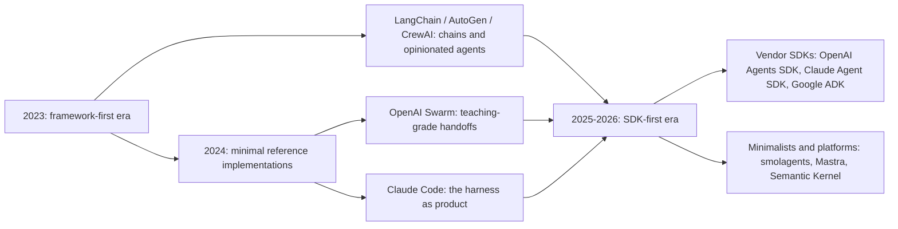
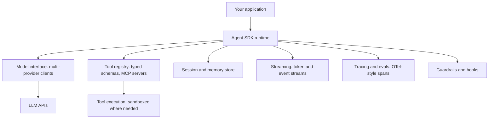
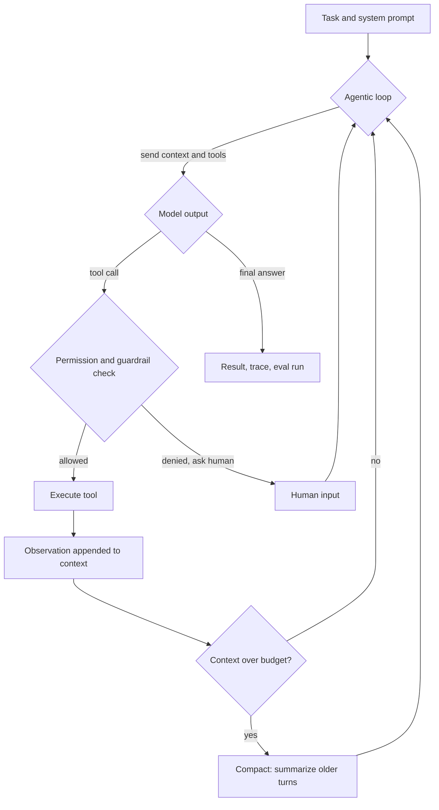

# The Modern Agent SDK Landscape (2026)

## Overview

Between 2023 and 2026, the agent tooling market inverted. The first wave was **framework-first**: LangChain and its peers sold opinionated abstractions (chains, agent executors, memory classes) that you filled with model calls. The current wave is **SDK-first**: the model vendors and a handful of minimalist projects ship small, well-documented primitive sets — agents, tools, handoffs, sessions, guardrails, tracing — and let you compose the loop yourself. This page maps the six SDKs you are most likely to be asked about (OpenAI Agents SDK, Claude Agent SDK, Google ADK, smolagents, Mastra, Semantic Kernel), identifies the architecture they have all converged on, and arms you for the two questions that actually decide interviews: build vs adopt, and why "the harness" matters more than the framework. Cross-reference the framework-era material in [../../ml/agents/frameworks.md](../../ml/agents/frameworks.md) to see what changed.

## From Framework-First to SDK-First

The 2023 generation of frameworks optimized for demo velocity: five lines to an "agent", opinionated defaults, prompt templates hidden inside library calls. That design aged badly in production — hidden prompts are unauditable, abstraction layers fought the model's own function-calling capabilities, and debugging meant reading library source to find out what string was actually sent. Meanwhile the most effective agentic systems (Claude Code being the canonical example) demonstrated that quality comes from a **tuned harness**: the model, a carefully designed tool set, permission gates, context management, and eval loops — not from orchestration abstractions.

What broke in production with framework-first design is worth listing precisely, because interviewers of a certain generation of teams will have lived it:

- **Hidden prompts**: templates inside library calls meant the effective prompt was invisible in code review and impossible to diff — debugging meant reading library source.
- **Abstraction fighting the model**: chain executors and custom output parsers predated (and then duplicated) native function calling, producing brittle JSON-repair logic.
- **Underpowered primitives**: memory, tools, and retries as library classes instead of explicit state you own, so every production concern required forking the framework.
- **Version churn**: breaking changes across minor versions made upgrades riskier than rewriting the thin parts yourself.

The market response was a convergence on SDK-first design, and it happened in public: OpenAI's Swarm (a teaching-grade multi-agent sketch) became the production-oriented OpenAI Agents SDK; Anthropic extracted the Claude Code runtime into the Claude Agent SDK; Google productized its internal agent stack as ADK; and minimalists like Hugging Face's smolagents argued explicitly for ~1,000-line cores.



The historical lineage of the frameworks is still interview-relevant — [../../ml/agents/langchain.md](../../ml/agents/langchain.md) covers chains and the executor model, [../../ml/agents/autogen.md](../../ml/agents/autogen.md) and [../../ml/agents/crewai.md](../../ml/agents/crewai.md) cover conversation- and role-based multi-agent patterns — but the SDK era's vocabulary is what interviews test now.

## OpenAI Agents SDK

The OpenAI Agents SDK (<https://openai.github.io/openai-agents-python/>) is the smallest surface area of the major SDKs, built around four primitives. An **Agent** bundles a model, instructions, and tools. **Handoffs** are the signature idea: transferring control to another agent is modeled as a tool call, so the LLM decides routing through the same mechanism it uses for everything else — no external orchestrator. **Guardrails** run in parallel with the agent, validating input (and output) against separate fast models or classifiers before the main loop proceeds. **Sessions** persist conversation history between runs, and **tracing** is on by default, emitting spans you can inspect in a dashboard or export.

Design takeaways worth stating in interviews: the SDK is deliberately *unopinionated about workflow* — there is no graph, no state machine, no chain abstraction; just a loop, tools, and handoffs. It is largely model-agnostic in practice (other providers can be plugged in via integration layers such as LiteLLM), though its ergonomics are tuned for OpenAI models. The handoff-as-tool-call pattern is a clean answer to "how do you do multi-agent routing without a brittle orchestrator?" — and its limits (no fine-grained permission delegation, routing quality = model quality) are the natural follow-up.

The four primitives in code, so the vocabulary is concrete:

```python
from agents import Agent, Runner, handoff

triage = Agent(
    name="triage",
    instructions="Classify the ticket and hand off.",
    handoffs=[billing_agent, technical_agent],   # handoff targets
    input_guardrails=[pii_guardrail],            # parallel validators
)

result = await Runner.run(triage, "Charged twice for March")
print(result.final_output)   # sessions/tracing wrap this loop by default
```

## Claude Agent SDK

The Claude Agent SDK (<https://platform.claude.com/docs/en/agent-sdk/overview>) is the harness behind Claude Code, exposed as a library — which makes it the best-documented answer to "what does a production agent harness actually contain?". Its components:

- **The agentic loop**: model call → tool call → observation → repeat, with a large, *file-and-shell-first* tool set (Bash, file read/edit/search, web search/fetch) rather than API-specific tools. The lesson: generic, composable tools beat dozens of bespoke API wrappers.
- **Permissions**: every tool invocation passes a permission gate — allowlists, deny rules, and interactive confirmation — because agents that execute shell commands need security boundaries, not just guardrails. This is the policy layer discussed in [./guardrails.md](./guardrails.md).
- **Hooks**: lifecycle callbacks before/after tool calls and other events, letting teams inject policy checks, logging, or custom behavior at exactly the points where automation goes wrong.
- **Subagents**: the main loop can spawn isolated sub-agents with their own context windows for fan-out tasks, reporting results back — a topology covered in [./multi-agent-topologies.md](./multi-agent-topologies.md).
- **MCP-first tool sourcing**: tools come from MCP servers (the Model Context Protocol), so third-party integrations are external processes speaking a standard protocol rather than in-process library plugins — see [./agent-protocols.md](./agent-protocols.md) and [../../ml/agents/mcp.md](../../ml/agents/mcp.md).
- **Context management**: long tasks require compaction (summarizing older history), file-system-backed memory, and careful system-prompt budgeting — the engineering that distinguishes demos from hour-long autonomous runs.

Positioning in interviews: the Claude Agent SDK is opinionated where OpenAI's is neutral — it encodes Anthropic's beliefs about *how agents should work* (files as universal interface, permissioned execution, MCP). Use it when you want that harness; build on lower-level APIs when you don't.

## Google ADK

Google's Agent Development Kit (<https://google.github.io/adk-docs/>) is the most *structured* of the three vendor SDKs, betting that production agents need explicit architecture. Its multi-agent model is a **hierarchy**: `LlmAgent` nodes hold model + tools, while workflow agents (`SequentialAgent`, `ParallelAgent`, `LoopAgent`) compose children deterministically — control flow for the parts you want fixed, model-driven routing for the parts you don't. This is a middle path between framework-era graphs and pure handoff routing, and it maps cleanly onto the organization-scale topologies in [./multi-agent-topologies.md](./multi-agent-topologies.md).

Distinctive capabilities to cite: **model-agnostic execution** (Gemini models natively, other providers via integration layers), built-in **evaluation tooling** (case-based eval runs are a first-class CLI concern, not an afterthought — compare the evals discipline in [./agent-observability.md](./agent-observability.md)), session/state/artifact services that separate conversation state from tool state, callbacks for cross-cutting behavior, and deployment targets (Cloud Run, Agent Engine) that treat agents as deployable services. In interviews ADK is your example of "enterprise-shaped SDK": more concepts up front, better defaults at team scale.

## smolagents: Hugging Face Minimalism

smolagents (<https://github.com/huggingface/smolagents>) is the polemic of the field: the core library is around a thousand lines, and its central argument is that **agents should write code as their action format**. Instead of the model emitting JSON tool-call arguments that the runtime parses and dispatches, a `CodeAgent` emits a Python snippet that calls tools as functions; the runtime executes it in a sandboxed interpreter. A `ToolCallingAgent` variant supports conventional JSON tool calls for comparison.

The claimed advantages are concrete and worth memorizing: code composition is more expressive than nested JSON (variables, loops, conditionals, function reuse), models are heavily trained on Python so action quality improves, and one code block can invoke several tools where a JSON action expresses one. The costs: an execution sandbox becomes mandatory (arbitrary code from a model — see [./sandboxed-execution.md](./sandboxed-execution.md)), and error modes shift from schema violations to runtime exceptions that the loop must recover from. Model-agnostic via many providers, smolagents is the reference answer to "how would you build an agent runtime from scratch?" — because its source fits in one reading session, much like c4 does for compilers.

The signature pattern, compressed:

```python
from smolagents import CodeAgent, DuckDuckGoSearchTool

agent = CodeAgent(tools=[DuckDuckGoSearchTool()], add_base_tools=True)
report = agent.run("Compare EV charging costs in the EU vs US, cite sources")
# the model emits a python block calling search() etc.;
# the runtime executes it in a sandboxed interpreter and feeds back results
```

## Mastra: TypeScript Workflows

Mastra (<https://mastra.ai/>) is the leading TypeScript-native option, built by the Gatsby team and layered on the Vercel AI SDK's model abstractions. Its differentiator is **durable workflows**: graph-based, resumable step functions with suspend/resume and restart semantics, designed for long-running, human-in-the-loop processes — the piece that plain agent loops lack. Around that core: agents with typed tools, integrated memory (working memory plus semantic recall over a vector store), RAG primitives, an evaluation suite, and a local dev server with a playground UI for tracing and iteration.

Interview relevance: Mastra is the answer to "what about Node.js teams?" and to the durability question — if your agentic process spans hours or days (approvals, background research, batch processing), you need persisted, resumable state rather than an in-memory loop. The workflow-first mindset contrasts usefully with the SDK-first loop: Mastra says reliability comes from explicit, typed, resumable steps; the minimalist SDKs say it comes from a good loop plus good tools. Both are defensible; knowing when each applies is the interview point. The rule of thumb I would offer: reach for workflows when the process must survive restarts and involve humans; stay with a plain loop when the whole task fits in one session and the model can course-correct on its own.

## Semantic Kernel: The Enterprise .NET Legacy

Microsoft's Semantic Kernel (<https://learn.microsoft.com/en-us/semantic-kernel/>) predates the SDK wave and shows its enterprise fingerprints: first-class .NET (with Python and Java support), deep Azure integration, and a governance-friendly architecture. Its primitive is the **plugin** — annotated functions the model can call — and its history contains the field's most instructive deprecation: the early **planner** era (Action/Sequential/Stepwise planners doing LLM-driven plan-then-execute) gave way to native function calling, where the model plans implicitly one step at a time. When interviewers ask "do you believe in explicit planning?", Semantic Kernel's trajectory is the empirical answer: the industry converged on loop-with-function-calling, and even SK's newer Process framework models deterministic multi-step processes rather than free-form plans.

The surviving strengths: C# enterprise estates have no comparable first-party option; SK ships process orchestration, filters (cross-cutting middleware around model and function calls), and responsible-AI hooks that compliance-heavy organizations require. The cost is conceptual weight and a .NET/Python/Java API surface that evolves more slowly than the minimalist SDKs. When asked where SK wins, answer honestly: often it is chosen by *default* — Azure pricing agreements, existing .NET teams, Microsoft support contracts — and its job is to make that default defensible with solid governance primitives rather than to compete on minimalism.

## What Every SDK Converges On

Strip the marketing and the six SDKs share one architecture. This convergence is the single most interview-valuable fact on this page: if you can enumerate the shared primitives, you can answer design questions for *any* SDK.

| Primitive | Why it exists | Typical API surface |
|---|---|---|
| Model interface | Swap/add providers without rewriting agents | Client per provider, config-level model choice |
| Tool registry | Typed, schema'd functions the model can call | Decorators/schemas; MCP servers as external sources |
| Session/memory | Continuity across runs; long-task context | Session IDs, history stores, compaction, vector recall |
| Streaming | Token and event streams for UX and observability | Async iterators over typed events |
| Tracing/evals | Debug loops, measure quality regressions | OTel-style spans, eval runners, dashboards |
| Guardrails/hooks | Safety, policy, lifecycle injection | Input/output validators; pre/post-tool callbacks |
| Multi-agent | Divide context, parallelize, route | Handoffs (OpenAI), subagents (Claude), hierarchy (ADK) |



Convergence has a market interpretation as well: once primitives are standard, competition shifts to what surrounds them — model quality, harness polish (permissions, compaction), eval tooling, and price. That is why the 2026 differentiators in the table below are durability, MCP posture, and language ecosystem rather than "does it support tools". Interviewers read fluency in this framing as seniority: the junior answer compares SDKs by feature checklist, the senior one by which primitives they decided to make nonstandard and what that costs you later.

## Side-by-Side: Picking an SDK in One Table

The convergence table above tells you what to look for; this one tells you what differs. Rows are the axes teams actually decide on.

| SDK | Steward | Languages | Multi-agent model | Durability story | MCP posture | Sweet spot |
|---|---|---|---|---|---|---|
| OpenAI Agents SDK | OpenAI | Python (TS port) | Handoffs (tool-call routing) | Sessions (history) | Supported via integrations | Lean product loops, fast iteration |
| Claude Agent SDK | Anthropic | Python, TS | Subagents via Task tool | Harness-grade (compaction, file memory) | First-class, primary tool source | Production harnesses, coding/file agents |
| Google ADK | Google | Python, Java | Hierarchical + workflow agents | Session/state services | Supported | Team-scale structured systems on GCP |
| smolagents | Hugging Face | Python | Basic (code-driven) | None — you own it | Community | Learning, custom runtimes, code actions |
| Mastra | Mastra (Gatsby team) | TypeScript | Agents within workflows | Durable resumable workflows | Supported | Node.js teams, long-running processes |
| Semantic Kernel | Microsoft | .NET, Python, Java | Process framework | Enterprise/Azure backing | Supported | .NET estates, compliance-heavy orgs |

Read the durability column hardest: it is the axis with the least convergence and the highest migration cost, because session and workflow state formats are where lock-in concentrates.

## Multi-Agent Patterns Across SDKs

Every SDK's multi-agent story is one of four patterns, and interviews increasingly ask you to name the pattern, not the product. **Handoff routing** (OpenAI) gives one model the wheel and lets it transfer control via tool calls — flexible, but quality-bound to the model and prone to loops without loop guards. **Subagent fan-out** (Claude Agent SDK) spawns isolated contexts that work in parallel and report back — ideal for search-heavy or verification-heavy work, since each subagent's noise never pollutes the main context. **Deterministic hierarchy** (ADK, and Semantic Kernel's Process framework) fixes the control flow in code and confines the model to steps — the pattern for compliance-sensitive flows. **Role-based conversation** (the CrewAI/AutoGen lineage) has agents talk to each other in assigned roles — expressive for brainstorming, hardest to test deterministically.

Failure modes are pattern-specific and worth volunteering: handoffs loop between agents without cycle detection; subagents burn tokens multiplicatively and can return stale or contradictory results without consolidation steps; hierarchies accumulate orchestration code that competes with the model's actual capability; conversational crews drift into mutual praise loops. The unifying mitigation is observability — every agent-to-agent transfer should emit a span with inputs, outputs, and cost, so topology bugs show up as trace shapes (see [./agent-observability.md](./agent-observability.md) and [./multi-agent-topologies.md](./multi-agent-topologies.md)).

## Evaluation and Observability: The Deciding Layer

The SDK features that decide production success are the least glamorous: tracing and evals. A production agent emits spans for every model call, tool invocation, handoff, and guardrail check, with inputs, outputs, latency, and token cost attached — OTel-style, ideally exportable rather than dashboard-locked. On top of traces sit **eval sets**: recorded task trajectories scored by rubrics, judges, or unit-style assertions on tool calls. Every prompt change, model upgrade, or SDK version bump replays the eval set — this is the regression harness that makes agent iteration safe, and it is exactly the discipline covered in [./agent-observability.md](./agent-observability.md).

SDK differences here are meaningful in interviews. OpenAI Agents SDK ships tracing on by default; ADK makes eval a first-class CLI concern; Mastra bundles an eval suite for TypeScript teams; the Claude Agent SDK exposes the loop so you can instrument it yourself; smolagents leaves it entirely to you. A strong answer frames it as strategy: choose SDKs that emit open telemetry formats, build your eval corpus early (it outlives every SDK), and treat "can I replay and diff a trajectory after a change?" as a hard requirement.

## Choosing in Interviews: Build vs Adopt, and the Harness Argument

The build-vs-adopt question is really about where your differentiation lies. Adopt an SDK when your product value is the application logic — the SDK commoditizes plumbing (retries, streaming, tool dispatch, tracing) that you would otherwise under-engineer. Build (or use raw provider APIs) when the agent loop *is* the product and you need total control over prompts, tool schemas, and permission semantics — or when your runtime constraints (browser, edge, embedded) rule out SDK dependencies. The strongest interview answers give a concrete decision rule: "prototype on a minimal SDK, and be willing to eject once you're editing library internals to change prompts."

The **harness vs framework** argument is the deeper version. Frameworks once claimed agents need orchestration abstractions; the harness school claims agent quality is determined by the model, tool design, context engineering, and eval loops — everything else is plumbing you should own. The evidence to cite: Claude Code and similar systems are largely hand-rolled loops around strong models; framework-heavy systems broke when hidden prompts fought the model; and the SDK wave itself is the market conceding the point. But state the counterargument fairly: deterministic workflow layers (ADK's workflow agents, Mastra workflows) are *not* frameworks in the pejorative sense — they encode control flow you genuinely don't want the model deciding, like compliance steps and approval gates.

Two decision inputs round out the answer. **Cost and model mix**: SDKs that lock the loop to one vendor's models couple your unit economics to their pricing — a model-agnostic loop (or MCP-sourced tools plus raw APIs) keeps provider negotiation leverage. **Operational surface**: an SDK that ships a hosted state store or dashboard (Pulumi-style in spirit) trades portability for day-one convenience — decide consciously which side of that trade your compliance posture allows.



## Migration and Lock-In Realities

Lock-in in the SDK era is rarely about the API calls — those are thin wrappers over HTTP. It lives in three places teams underestimate. **State schemas**: session formats, memory representations, and workflow state are where migration costs concentrate; exporting a conversation is easy, exporting a Mastra workflow's suspend/resume state is not. **Prompt and context conventions**: systems tuned around one SDK's defaults (system-prompt structure, tool descriptions, compaction timing) lose quality when ported, because those defaults were part of the effective prompt. **Tracing/eval assets**: your accumulated eval sets and span-based regression tests are portable only if built on open formats (OTel spans, JSONL eval files) rather than vendor dashboards.

The migration playbook worth reciting: keep tools as MCP servers (they are SDK-neutral by design — see [../../ml/agents/mcp.md](../../ml/agents/mcp.md)), keep evals in portable formats, wrap model calls behind your own thin interface, and version prompts in your repo rather than the SDK's. Teams that follow this can re-platform in weeks; teams that don't re-platform in quarters.

A five-line portability checklist to run before adopting any SDK:

- Can I export every session, memory, and workflow state as JSON I control?
- Do tools live behind MCP or a thin adapter, not in SDK-native plugin classes?
- Are prompts and tool descriptions text in my repo, not defaults I patch at runtime?
- Do traces export as OTel spans, and do evals run from files in CI?
- Is the exit cost documented — i.e., could a competent team leave in one quarter?

## The 2026 Interview Cheat Sheet

Compressed signals to carry into a design round, one line each:

- **OpenAI Agents SDK** — when the interviewer says "minimal primitives" or asks about handoffs; know handoff-as-tool-call and default tracing.
- **Claude Agent SDK** — when the topic is coding agents, permissions, or "what's inside a production harness"; know MCP-first tools and subagent isolation.
- **Google ADK** — when the org is enterprise/GCP or asks about evaluation and deterministic multi-agent structure; know workflow agents and session services.
- **smolagents** — when asked to design a runtime from scratch or about action formats; know code-as-action and the sandbox requirement.
- **Mastra** — when the stack is TypeScript or the process must suspend/resume; know durable workflows.
- **Semantic Kernel** — when the estate is .NET or the history question is about planners; know why explicit planners lost to native function calling.
- **Convergence list** — model interface, tool registry, session/memory, streaming, tracing/evals, guardrails/hooks, multi-agent. Recite it, then map the interviewer's favorite SDK onto it.
- **Harness argument** — agent quality lives in model + tools + context engineering + evals; orchestration is plumbing. Defend it with the Claude Code evidence, concede the deterministic-workflow counterpoint.

## Cross-References

- [Agentic Overview](./README.md) — section index and the base agent-loop vocabulary.
- [SWE Agents](./swe-agents.md) — software-engineering agents, the harness style taken furthest.
- [Multi-Agent Topologies](./multi-agent-topologies.md) — handoffs, hierarchies, and fan-out patterns each SDK implements.
- [Guardrails](./guardrails.md) — the validation layer all six SDKs expose.
- [Sandboxed Execution](./sandboxed-execution.md) — mandatory when agents write and run code (smolagents, Claude Agent SDK Bash tools).
- [Agent Observability](./agent-observability.md) — tracing and evals, the convergence row that decides production readiness.
- [Agent Protocols](./agent-protocols.md) — MCP and the protocol layer under tool sourcing.
- [Agent Frameworks](../../ml/agents/frameworks.md) — the framework-era survey this SDK wave reacted against.
- [LangChain](../../ml/agents/langchain.md) — the framework-first archetype and its lessons.
- [MCP](../../ml/agents/mcp.md) — the protocol that makes tool registries portable.
- [AutoGen](../../ml/agents/autogen.md) — conversation-driven multi-agent, contrasted with handoff routing.
- [CrewAI](../../ml/agents/crewai.md) — role-based crews versus SDK subagents.

## References

- OpenAI Agents SDK documentation: <https://openai.github.io/openai-agents-python/>
- Claude Agent SDK overview: <https://platform.claude.com/docs/en/agent-sdk/overview>
- Google ADK documentation: <https://google.github.io/adk-docs/>
- smolagents — Hugging Face minimal agent library: <https://github.com/huggingface/smolagents>
- Mastra — TypeScript agent framework: <https://mastra.ai/>
- Semantic Kernel documentation: <https://learn.microsoft.com/en-us/semantic-kernel/>

## Interview Questions

1. **What changed between framework-first and SDK-first agent design, and why did it happen?** Framework-first tools (LangChain era) wrapped agents in chains and executors with hidden prompts and opinionated abstractions, which optimized demo speed but fought models' native function calling and made debugging painful. SDK-first design ships small primitive sets — agent, tools, handoffs, sessions, guardrails, tracing — and leaves the loop to you, matching the evidence that quality comes from the harness (model, tools, context management, evals) rather than orchestration. The trigger events were the success of hand-rolled harnesses like Claude Code and the market's own moves: Swarm became the OpenAI Agents SDK, and Claude Code became the Claude Agent SDK.
2. **Explain handoffs in the OpenAI Agents SDK. Why model agent-to-agent transfer as a tool call?** A handoff is a first-class primitive where one agent transfers the conversation to another; internally it is presented to the model as a tool call whose "execution" swaps the active agent, so routing uses the same mechanism as every other action. The elegance: no external orchestrator or router to maintain, and the model's learned tool-calling ability does the planning. Limits to acknowledge: routing quality is bounded by model quality, there is no built-in permission separation between agents, and unstructured handoff graphs can loop — which is why Google ADK instead offers explicit workflow hierarchy for the parts you want deterministic.
3. **What does "the harness" mean in the Claude Agent SDK, and which parts of it matter most for long-running tasks?** The harness is the full production loop behind Claude Code: an agentic loop over a generic file/shell-first tool set, permission gates on every tool call, lifecycle hooks, subagents for isolated context, MCP-based tool sourcing, and context management (compaction, file-backed memory). For long tasks the decisive parts are context management and subagents — a single context window cannot survive hour-long runs, so compaction and fan-out with result consolidation are what keep quality stable. The interview point: these engineering choices, not framework abstractions, are where agent reliability comes from.
4. **Why does smolagents have agents write code instead of JSON tool calls, and what risks does that introduce?** Code is more expressive than nested JSON (variables, loops, conditionals, reuse), models are strongly trained on Python so action quality is higher, and one code block can chain multiple tool invocations — reducing round trips. The risk: the runtime now executes arbitrary model-written code, so a sandboxed execution environment is mandatory, and failure modes shift to runtime exceptions the loop must handle. This makes smolagents the clearest illustration that agent design and execution security are inseparable concerns.
5. **What primitives have all major agent SDKs converged on?** The shared set is: a multi-provider model interface; a typed tool registry (increasingly fed by MCP servers); sessions/memory with history persistence and compaction; streaming of tokens and events; tracing and evals built on span-like models; guardrails/hooks for validation and lifecycle control; and some multi-agent mechanism (handoffs, subagents, or hierarchy). Knowing this list lets you answer design questions SDK-independently and evaluate any new SDK in minutes by checking which primitives are missing or nonstandard.
6. **A team asks whether to build their own agent runtime on raw APIs or adopt an SDK. How do you decide?** Decide by where differentiation lies and how much of the harness you need to own. Adopt when the product value is application logic and the SDK's defaults (permissions, tracing, sessions) are acceptable — you inherit hard-won plumbing. Build when the loop itself is the product, runtime constraints exclude SDKs, or you find yourself forking the library to change prompts. The pragmatic rule I'd give: prototype on a minimal SDK, keep tools as MCP servers and evals in portable formats, and treat ejection as a planned option — lock-in concentrates in state schemas and prompt conventions, not API calls.
7. **What are the realistic lock-in vectors when adopting an agent SDK, and how do you mitigate them?** Three vectors: state schemas (session, memory, and workflow state formats that don't export cleanly), prompt/context conventions (systems tuned to an SDK's system-prompt structure and compaction timing lose quality when ported), and tracing/eval assets (regression tests trapped in a vendor dashboard). Mitigations: keep tools as SDK-neutral MCP servers, store evals and traces in open formats (OTel spans, JSONL), wrap model calls behind a thin internal interface, and version prompts in your own repo. That keeps re-platforming measured in weeks instead of quarters.
8. **Where do deterministic workflows still make sense in an era of autonomous agent loops?** Wherever control flow is a compliance or safety requirement: approval gates, multi-stage processing with SLAs, anything that must suspend for human input and resume days later. ADK's workflow agents (Sequential/Parallel/Loop) and Mastra's durable, resumable workflows encode exactly this — the model acts inside steps, but the step graph is code. The mistake to avoid is putting model-driven routing where determinism is legally or operationally required; the counter-mistake is hard-coding control flow that the model would handle better adaptively.
