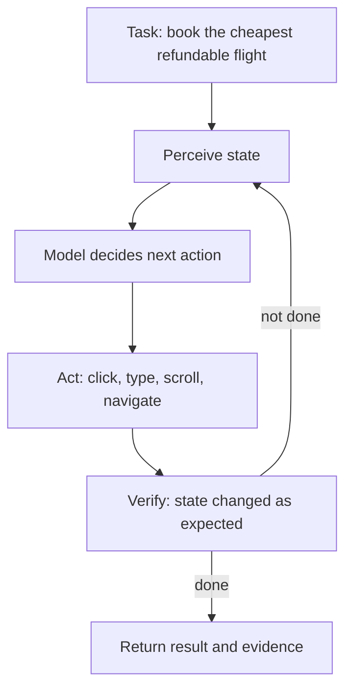
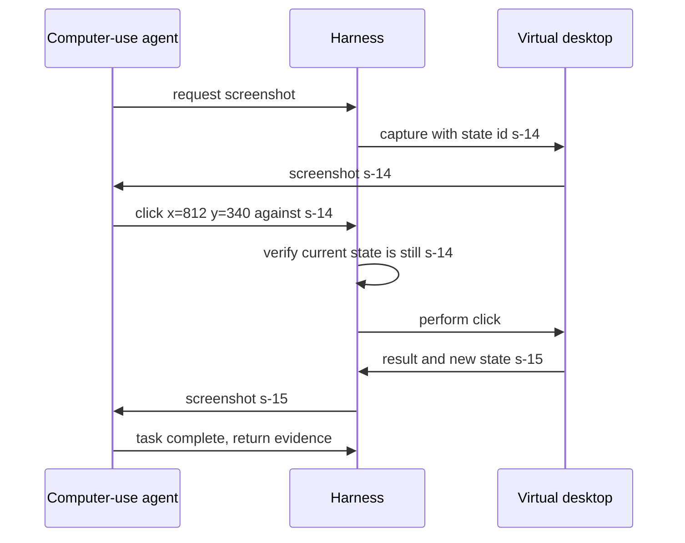

# Browser and Computer Use Agents

## Overview

Some tasks live behind a GUI: booking a flight in a legacy portal, filling a form in a vendor SaaS with no API, checking a dashboard that only renders in a browser. Browser and computer-use agents are the LLM agents that operate those surfaces — reading the screen, deciding on an action, and emitting clicks, keystrokes, and scrolls. This page covers the two families (browser agents that read structured page state, and computer-use models that read pixels), the state-representation choice that dominates their reliability (DOM vs accessibility tree vs screenshots), anchor-tree element addressing, flakiness engineering, and the ethics of CAPTCHAs, credentials, and terms of service.

This is the most *empirical* page in the section: browser agents break in ways that are invisible in architecture diagrams, and interviews probe exactly that gap. The verified index for this book singles out the key design fact — Playwright's MCP server "uses the accessibility tree rather than screenshots — far more reliable than vision-based clicking" — and that single sentence is the thesis of the first half of this page: the perception channel you choose decides most of your success rate before the model is even involved.

## Two Families of GUI Agents

Browser agents drive a real (usually Chromium) browser and perceive **structured** page state: the DOM, the accessibility tree, or a hybrid. Computer-use agents perceive **pixels**: a screenshot goes into a vision-capable model, and coordinate-space actions come out. The distinction matters because it changes everything downstream — error handling, speed, what sites are reachable, and how failures look in a trace.

Both families share this observe-decide-act-verify loop, which is a ReAct loop with a perception layer bolted on (see [ReAct](../../ml/agents/react.md)). The verification step is emphasized here because GUI agents are the setting where it pays most: an agent that re-observes after every action and checks "did the state change the way I intended?" catches most of its own failures early, instead of compounding a missed click through six more steps.

## Browser Agents: DOM vs Accessibility Tree

A browser agent has three candidate perception channels, and the choice is the most consequential decision on the page. **Raw DOM** is complete but enormous and noisy — thousands of nodes, most irrelevant, with layout and scripts polluting the signal. **Screenshots** are compact and faithful to what a human sees, but require a vision model and lose machine-readable structure. The **accessibility tree** is the sweet spot: the browser's own a11y layer — the same structure screen readers use — exposes only *interactive, meaningful* elements with roles, names, and stable references, at a small fraction of DOM size. Playwright's MCP server exposes exactly this: a snapshot of the page as an indexed a11y tree, where the model picks a ref and the harness performs the action — no pixels, no coordinate guessing.

| Channel | Token cost per page | Robustness | Cross-app reach | Failure mode |
|---|---|---|---|---|
| Raw DOM | Very high | Low-median (noise, churn) | Browser only | Context overflow, irrelevant-node confusion |
| Accessibility tree | Low | High (role/name/ref structure) | Browser only | Custom canvas widgets invisible; shadow-DOM quirks |
| Screenshot (vision) | Moderate (image tokens) | Medium (vision errors, small targets) | *Everything on screen* — desktop, native apps, canvas | Coordinate misses, similar-looking buttons |
| Hybrid a11y + screenshot | Highest | Highest | Browser + visual verification | Cost; complexity of merging channels |

The a11y tree's main blind spot is custom-rendered content — canvas-heavy apps and some virtualized lists simply do not populate it — which is why production browser agents increasingly run **hybrid**: a11y tree for action targeting, screenshot for verification ("does the page now show the confirmation?"). The index's browser-use project and Playwright MCP both anchor on the a11y-tree approach, and their docs are the two best reference implementations to read.

## Anchor Trees: Addressing Elements Without Coordinates

The anchor tree is the data structure that makes the a11y channel actionable: each interactive element gets a compact, stable reference (`e12`, `btn-submit-3`), and the model's action is `click e12` or `type e7 "Amsterdam"` — an *address*, not a coordinate. The harness resolves the address through Playwright to a live DOM node, so the click lands even if layout shifted between observation and action. This indirection is why a11y-based agents tolerate dynamic content so much better than coordinate-based ones: the address binds to the element's identity, not its position.

The engineering cost is **staleness**: any navigation or re-render can invalidate addresses, so the harness must detect the case where the referenced element no longer matches the anchor's fingerprint (role + name + position heuristics) and force a re-snapshot before acting. Practical rules that emerge in production: one canonical snapshot per step (never act on an older observation), monotonic ref allocation per page state to prevent the model from hallucinating an ID that "looks right", and immediate re-observe after any action that could mutate the tree. Stale-anchor handling is unglamorous, and it is routinely the difference between 85% and 97% task completion.

## Computer Use: Pixel-Action Models

Computer-use models generalize beyond the browser to the whole desktop: screenshot in, actions out — `click(x, y)`, `type(text)`, `key(combo)`, `scroll(direction, amount)`, plus optional `screenshot` and `wait`. Anthropic's computer use capability (October 2024) and OpenAI's Operator / computer-using-agent pattern (2025) are the reference implementations; both frame the model as a generalist that operates software the way a human does, precisely so that apps with no API and no a11y richness remain automatable. The model reasons over rendered pixels, which means it can — in principle — use *anything*: native apps, terminals, entire virtual desktops.

Pixel perception brings its own failure classes. **Small targets**: toolbar buttons and checkbox hit-boxes are a few pixels, and coordinate prediction errs by pixels; mitigations include setting generous display scaling, zooming before clicking, and preferring keyboard shortcuts over menu navigation where possible. **Ambiguity**: two visually similar buttons need textual context the screenshot may render too small to read — hybrid agents fall back to OCR or DOM when available. **Timing**: screenshots lag the live screen, and acting on a stale frame clicks the wrong thing; the documented discipline is *versioned screenshots* — tag each screenshot with a state ID and reject actions addressed to a stale version, re-shooting after any UI change. The loop below is the canonical computer-use cycle with that guard in place.

## Flakiness Engineering

GUI automation was flaky before agents arrived, and agents inherit every classic disease plus new ones. The deterministic flakiness — animations racing clicks, lazy-loaded content, spinners — falls to harness discipline: wait on *state* (element visible, network idle, spinner gone) rather than fixed sleeps; retry idempotent actions with backoff; treat navigation as a checkpoint (state snapshot + hash) so a crashed step can resume instead of restart. The agent-native flakiness is stochastic — the model picks the wrong element, hallucinates an option that is not there, or loops. Mitigations are again structural: re-observe-and-verify after every action; cap steps and detect loops by action-history hashing (the observability page's arguments-hash trick applies directly); fall back to a narrower channel (a11y over vision, keyboard over mouse) when the rich channel fails twice.

Metrics make flakiness manageable instead of folkloric. Track **task success rate** end-to-end, **steps per task** (regression here catches degraded perception before failures show), **retry and stale-ref rates** per site, and the **human-takeover rate** — the fraction of runs escalated to a person, which is the number that decides whether the product is "automation with a safety net" or "an intern you babysit". All of it rides the same trace machinery as [Agent Observability](./agent-observability.md): one span per observe-decide-act-verify cycle, screenshots stored as artifacts, and the site/page as a span attribute so failures can be sliced per target surface.

## Ethics: CAPTCHAs, Credentials and Terms of Service

GUI agents sit exactly where automation policy gets contested, and vendors have drawn explicit lines worth knowing as an engineer. **CAPTCHAs**: agents should not solve them — they exist to distinguish humans from bots, and both Anthropic's and OpenAI's usage policies block circumvention; the correct agent behavior is to halt and hand off to the human, which doubles as a safety checkpoint. **Credentials**: agents acting on logged-in surfaces need careful identity design — prefer session tokens scoped to the task over the user typing passwords into a prompt, never store screen-captured credentials, and apply the audience-binding and consent machinery from [Agent Identity and Auth](./agent-identity-and-auth.md) to GUI actions the same as API actions. **Terms of service**: many sites prohibit automated interaction regardless of how polite the agent is; production systems maintain per-site policy allowlists, rate limits that respect the target (and robots.txt semantics), and honest user-agent disclosure where feasible. The frame to hold in an interview: the agent's *operator* owns its actions, and "the model decided to" is not a defense — which is why the guardrails page's action-rail pattern applies with full force here.

## Benchmarks: How GUI Agents Are Measured

Two open benchmarks anchor the literature. **WebArena** (Zhou et al., 2023) evaluates agents on realistic self-hosted web apps — shopping, forums, a code site, a content manager — with functional correctness checks against database state rather than string matching; scores for frontier models have climbed from single digits at release toward the 50-70% range in 2025-era reports, which is impressive *and* a long way from deployable autonomy. **OSWorld** (Xie et al., 2024) extends to full operating systems — real Ubuntu VMs with tasks spanning files, office apps, and settings — where success rates for the best published setups remain far lower, reflecting how much harder pixel-space generalization is than browser-structured action. The takeaway for system builders is not the leaderboard but the harness lesson: functional end-state checking (did the order appear in the database?) is the only evaluation that survives, which is also how you should evaluate your own GUI agents in production.

## Interview Questions

1. **Why do production browser agents prefer the accessibility tree over screenshots?** The a11y tree gives the model a compact, structured, machine-readable state: only meaningful interactive elements, each with a role, a name, and a stable reference the harness can click through Playwright — no coordinate guessing, no vision errors on small targets, and an order of magnitude fewer tokens than raw DOM. Screenshots remain useful for *verification* ("does the page show a confirmation?"), which is why the production pattern is hybrid: a11y for targeting, pixels for checking. The a11y channel's blind spot is custom canvas rendering, which is precisely where you fall back to vision.

2. **What is the stale-anchor problem and how do you handle it?** The model acts on element addresses from a snapshot; if the page navigated or re-rendered since, the address may point at nothing or at the wrong element. Handling is threefold: version every observation and reject actions addressed to a non-current state; fingerprint anchors (role + name + structural position) so the harness can detect a mismatch before clicking; and force a fresh snapshot after any action that could mutate the tree. With computer-use the analogous guard is versioned screenshots — every coordinate action names the screenshot it was decided against, and the harness refuses stale ones. This single discipline removes the largest class of GUI-agent failures.

3. **When is computer-use the right tool rather than a browser agent or an API?** Computer-use wins when the surface has no API and no rich a11y tree: legacy desktop apps, remote environments, cross-app workflows that span a spreadsheet and a browser. A browser agent wins inside a normal web app — cheaper, faster, more reliable, structured state. An API wins whenever one exists, by every measure. The decision rule in production is a per-task ladder: API first, browser-a11y second, pixel computer-use last — with the honest acknowledgment that the last rung exists because most enterprise software estates contain a long tail of surfaces where the first two rungs are unavailable.

4. **How do you make a browser agent reliable enough to ship?** Measure first: task success rate, steps per task, retry and stale-ref rates, and human-takeover rate, all sliced per target site. Then engineer the deterministic layer: state-based waits instead of sleeps, idempotent action retries, navigation checkpoints for resumability, one canonical snapshot per step, and re-observe-verify after every action. Then the stochastic layer: action-history hashing to detect loops, step caps, channel fallback (vision to a11y, mouse to keyboard), and a human-takeover path that preserves partial work. Finally, trace everything — one span per observe-decide-act-verify cycle — so reliability work is driven by data rather than vibes.

5. **What are the ethical lines for GUI agents, and how do you enforce them in code?** Three lines: no CAPTCHA circumvention (halt and hand off to a human — both major vendors' policies state this), no credential mishandling (scoped task tokens instead of typed passwords, no secrets in screenshots or prompts, consent gates on logins), and no ToS-violating automation (per-site policy allowlists, respectful rate limits, honest disclosure). Enforcement is code, not policy documents: a guardrail layer in front of every GUI action — the same OPA-policy-and-consent pattern as API tools — plus rate limitters and a blocklist at the harness level. The interview framing that lands: an agent's operator owns its actions, so the ethics layer must be as deterministic as the agent is not.

## Key Takeaways

- GUI agents split into browser agents (structured state: DOM or accessibility tree) and computer-use models (screenshots and coordinates); the perception channel decides most of the reliability budget.
- The accessibility tree is the production sweet spot for browsers: compact, structured, addressable elements — Playwright MCP and browser-use are the reference implementations.
- Anchor trees replace coordinates with stable element addresses; staleness detection and one-canonical-snapshot-per-step are the highest-leverage reliability disciplines.
- Computer-use generalizes to any surface but pays in small-target errors, visual ambiguity, and stale-frame races — mitigated by display scaling, keyboard preferences, and versioned screenshots.
- Flakiness engineering is two layers: deterministic (state waits, retries, checkpoints) and stochastic (loop detection, channel fallback, step caps, human takeover).
- Ethics lines — no CAPTCHA solving, scoped credentials, ToS allowlists — are enforced as code in the action-rail layer, not as documents.
- WebArena and OSWorld define honest evaluation via functional end-state checks; the same standard — verify database reality, not page text — is how to evaluate your own GUI agents.

## References

- Playwright MCP — browser automation via accessibility tree: <https://github.com/microsoft/playwright-mcp>
- browser-use — agents driving a real browser: <https://docs.browser-use.com/>
- browser-use source: <https://github.com/browser-use/browser-use>
- Playwright documentation: <https://playwright.dev/>
- Anthropic — Claude computer use (docs: computer use tool): docs.claude.com
- OpenAI — Operator / computer-using agent: platform.openai.com/docs
- WebArena: A Realistic Web Environment for Building Autonomous Agents, Zhou et al., 2023: <https://arxiv.org/abs/2307.13854>
- OSWorld: Benchmarking Multimodal Agents for Open-Ended Tasks in Real Computer Environments, Xie et al., 2024: <https://arxiv.org/abs/2404.07972>
- Anthropic Engineering: <https://www.anthropic.com/engineering>

## Cross-References

- [ReAct Pattern](../../ml/agents/react.md) — the observe-decide-act loop these agents extend with perception
- [Agent Observability](./agent-observability.md) — the trace machinery GUI-agent reliability work rides on
- [Guardrails](./guardrails.md) — the action-rail pattern applied to GUI actions
- [Agent Identity and Auth](./agent-identity-and-auth.md) — credential scoping for logged-in automation
- [SWE Agents](./swe-agents.md) — the other physical action surface: the source tree
- [Tool Poisoning and Deterministic Workflows](../agents/tool-poisoning-workflows.md) — why web content an agent reads is untrusted input
