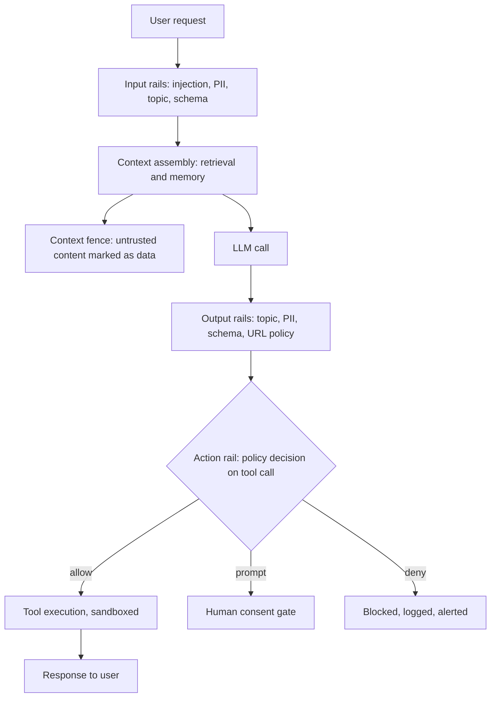

# Guardrails: Constraining Inputs, Outputs and Actions

## Overview

Guardrails are the deterministic safety layer around an agent: code that inspects what comes in, what comes out, and — the agent-specific addition — what the agent is about to *do*, before the model's judgment is the only thing between a request and a consequence. This page covers the taxonomy (input, output, and action rails), the framework landscape (NeMo Guardrails, Guardrails AI, and the moderation/tool-approval patterns from major APIs), policy engines like OPA for tool-call authorization, PII redaction, topic fences and jailbreak classifiers, and the latency budget that decides which rails can run inline.

Guardrails questions in interviews test whether you understand a hard truth: the model cannot be its own control plane. A jailbreak is by definition an input that makes the model abandon its instructions, so "the system prompt says to refuse" is not a defense — the defense is a separate, non-LLM enforcement layer whose decision the model cannot influence. The conceptual safety material is in [Agent Safety](../../ml/agents/safety.md) and [LLM Security](../llm-security.md); this page is about the enforcement machinery.

## The Three Rail Types and Where They Run

Guardrails fall into three classes by what they inspect. **Input rails** examine the user request and assembled context: injection-pattern detection, PII discovery, topic fencing, and schema validation of user-supplied parameters. **Output rails** examine what the model produced before it reaches the user or another system: topic compliance, PII leakage, structured-output validation, and link/URL policy. **Action rails** — the class that makes agents different from chatbots — examine tool calls *before execution*: is this tool allowed for this user, are these arguments in policy, does a side-effecting action need human consent. A chatbot can be reasonably safe with input and output rails; an agent with tool calls and sandbox execution needs action rails, because that is where injected instructions become real-world effects.

The deployment question is *where* rails run: inline in the request path (adds latency, catches everything), parallel to generation (input rails run while the model starts, decisions race the first token), or async post-hoc (cheap coverage, late blocking — only acceptable for monitoring, not enforcement). The architecture below is the layered-defense shape most production systems converge on, and each layer's design rationale is elaborated in the pages cross-referenced at the bottom.



## The Framework Landscape

Three toolkits dominate, and they solve different problems — a frequent interview trap is treating them as interchangeable.

| Framework | Model | What it enforces best | Extension point |
|---|---|---|---|
| NeMo Guardrails (NVIDIA) | Programmable rails in Colang, wrapping the dialogue | Topical fences, dialogue flows, *action rails* on tool calls | Custom rails in Python; LLM-driven rail logic |
| Guardrails AI | Validator hub around structured output | Output validation: schema, format, safety validators with retry/reask | Hub validators or write-your-own |
| API-native patterns (moderation endpoints, tool pre-approval) | Provider services + harness features | Content moderation classification; deterministic tool allow/deny in the harness | Provider models; harness middleware |

NeMo Guardrails' distinctive idea is rails as a *program* — Colang flows describe canonical and exception dialogue patterns, topical rules ("the bot must not discuss competitors"), and action rails that gate tool execution with human confirmation. It is the right fit when the enforcement is conversational in shape. Guardrails AI inverts the emphasis: wrap a model call in a `Guard` with named validators (schema, no PII, no toxic content), each with an `on_fail` action — `exception`, `reask` (feed the failure back and let the model retry), `fix` (deterministic repair). It is the right fit when the contract is structured output. API-native patterns are the pragmatic baseline: a moderation classifier on the input and output ends, plus harness-level tool approval (the pattern OpenAI's Agents SDK and Anthropic's Claude Code both implement — every tool call passes a permission check, with configurable allowlists). Most serious systems end up combining: API moderation for cheap content screening, Guardrails AI for output contracts, NeMo-style action rails or a policy engine for the tool layer.

## Policy Engines: OPA and Declarative Authorization

When action rails grow beyond a handful of rules, the rules belong in a policy engine — OPA (Open Policy Agent) being the standard — rather than in Python `if`-statements scattered through the harness. The argument is the same one that made OPA standard in Kubernetes and service meshes: policy is *data and code with its own lifecycle* — versioned, tested, reviewed by the security team, deployed independently of application code. A Rego policy for an agent's tool layer reads like a threat model you can execute:

```rego
package agent.authz

default allow = false

# read-only tools are fine for any authenticated analyst
allow {
    input.tool == "search_docs"
    input.user.role == "analyst"
}

# destructive tools: never in production, and require elevation
deny[msg] {
    startswith(input.tool, "delete_")
    input.environment == "production"
    msg := sprintf("destructive tool %v blocked in production", [input.tool])
}
```

The harness evaluates the policy on every tool call with a structured input — tool name, normalized arguments, user identity, environment, run ID — and gets an `allow`/`deny` with reasons that go straight into the audit log. Because the policy is deterministic, it is unit-testable: you write test cases for the exact confusion-deputy scenarios you fear (a `delete_*` call with arguments sourced from a web page, a payment tool invoked outside business scope) and gate deploys on them. This is the enforcement backbone for the consent tables described in [Agent Identity and Auth](./agent-identity-and-auth.md) — the token says *who the agent is*; the policy engine says *what that identity may do right now*.

## PII Redaction

Agents touch PII twice: they ingest it (user messages, retrieved documents, tool results) and they emit it (answers, logs, traces, model calls to third-party APIs). The standard toolkit is Microsoft's Presidio — recognizer-based detection (names, phones, emails, IDs, custom patterns) plus pluggable anonymization. The architectural pattern that works: **redact at the boundary, pseudonymize in flight, re-hydrate at the last mile**. Inbound, detect and replace PII with reversible placeholders (`<PERSON_1>`, `<PHONE_1>`) so the model works with de-identified text; the mapping lives outside the model context. When the final answer goes back to the *authorized* user, restore the real values; when the output goes anywhere else — logs, traces, another tenant, a third-party model API — the placeholders stay.

Three engineering notes decide whether this actually works. First, **redaction is per-destination**: "can the model see it" and "can the log store see it" are different questions with different answers, so redaction runs at each egress point, not once globally. Second, **false negatives are the risk**: recognizer recall is imperfect (names in unusual scripts, PII embedded in code blocks), so redaction reduces exposure rather than eliminating it — which is why it layers with the access controls from the identity page rather than replacing them. Third, **trace storage inherits the problem**: every span that captures prompt or completion content is a PII copy, which is why the observability page insists on scrubbing before storage and on capture events that can be toggled per environment.

## Topic Fences and Jailbreak Classifiers

Topic fences keep the agent in-domain: an HR assistant must not give legal advice, a banking agent must not discuss anything but the customer's accounts. Cheap fences are deterministic — classifiers or even embedding-similarity checks against the allowed topic set — and run in milliseconds. Jailbreak classifiers are the adversarial version: models trained (or fine-tuned) to classify an input/output pair as safe or unsafe, with Llama Guard (Meta) being the canonical open example — a Llama derivative fine-tuned into a safety classifier over a taxonomy of hazard categories, usable on both prompts and responses. Moderation endpoints from the major APIs play the same role as a service.

The honest engineering position is that these classifiers *raise cost for the attacker, they do not close the attack*. Gradient-based attacks like GCG suffixes and long-running manual jailbreaks regularly defeat classifiers, and classifiers bring their own failure mode: false positives that block legitimate requests, which in a customer-facing product can cost more than the attacks. Two disciplines follow. First, **test the deployed system, not the model**: garak runs probe families (including tool-abuse probes) against your endpoint, PyRIT orchestrates automated red-teaming with converters — run them in CI against a staging deployment, and track the pass rate over time as a regression metric. Second, **layer with a deterministic backstop**: even a 95%-recall jailbreak classifier is fine if the action layer beneath it (OPA policy, consent gate, sandbox) makes the would-be harmful action impossible anyway. Classifiers are the top layer of defense in depth, never the whole thing.

## The Latency Budget

Every rail spends milliseconds the user is waiting for, so the design conversation is a budget conversation. The table below is the planning numbers for the rails on this page; validate against your own deployment, because classifier latency depends on model size and hardware.

| Rail | Typical added latency | Runs | Strategy |
|---|---|---|---|
| Schema / allowlist / regex checks | Under 1 ms | Inline | Always; free |
| OPA policy decision (cached) | 1-10 ms | Inline | Always; local eval, no network |
| PII detection (Presidio-style) | 5-50 ms | Inline | Serial; required before egress |
| Injection-pattern classifier | 10-50 ms | Inline | Serial on inputs |
| Moderation / topic classifier | 20-100 ms | Inline or parallel | Parallel with generation; block before first token ships |
| Small safety classifier (Llama-Guard-class) | 50-300 ms | Parallel | On outputs before delivery |
| LLM-as-judge guardrail | 300-2000+ ms | Async / sampled | Post-hoc on samples; never in the hot path |

Two patterns reconcile safety with latency. **Race the rails**: start generation immediately while input classifiers run in parallel, and cancel or withhold the stream if a rail trips — the common case pays zero, the rare case pays a few hundred ms. **Tier by risk**: cheap deterministic rails inline on everything; expensive probabilistic rails on the subset that matters (first-time users, flagged accounts, side-effecting actions); LLM-judge rails sampled asynchronously for monitoring and eval rather than enforcement. The anti-patterns are symmetrical: putting an LLM judge on every call in the hot path (300 ms × every step of a 40-step run is a product-killer), and the opposite failure — shipping with no rails because "the latency budget is tight", which lasts until the first incident report.

## Interview Questions

1. **Why can't the model's own system prompt serve as the guardrail?** A jailbreak is, by definition, an input that causes the model to disregard its instructions — so an instruction is exactly the thing the attack defeats. Enforcement must live in a component the model cannot influence: deterministic validators, policy engines, and classifiers that run as separate code. The system prompt still matters — it shapes behavior for the 99% of inputs that are not adversarial — but its security role is defense in depth's innermost layer, not the control plane. When someone tells you "we prompt it to be safe", the follow-up question is "what code blocks the action when the prompt is ignored", and the honest answer had better be a policy engine plus a sandbox.

2. **Design the guardrail stack for an agent that reads tickets and can email customers.** Input rails: injection-pattern classifier on ticket content (the ticket body is untrusted user content), PII discovery at ingest. Context fence: ticket content enters the prompt marked as data, never as instructions. Output rails: moderation classifier, tone/template policy for customer-facing text, PII re-hydration only for the authorized recipient. Action rails: the send-email tool sits behind an OPA policy (allowlist of templates, recipient-domain checks, rate caps) plus a human consent gate showing the exact outbound content — since an email is irreversible, consent is deterministic policy, not model judgment. Sandbox isn't needed here (no code exec), but the email tool's credentials are audience-bound per the identity page. The stack's principle: every irreversible action has a non-LLM decision point in front of it.

3. **How do you allocate a latency budget across guardrails?** Tier by cost and risk. Free deterministic checks (schema, allowlists, OPA with cached policies) run inline on everything. Cheap classifiers (PII, injection patterns) run inline serially — 50 ms total is affordable. Expensive classifiers race generation in parallel and can cancel before the first token ships, so the common case pays nothing. LLM-judge rails never run in the hot path; they run sampled and async for monitoring, feeding the eval loop. Then validate the budget against traces — the observability page's guardrail spans record each rail's decision and latency, so the budget is a measured SLO rather than a slide.

4. **A jailbreak classifier blocks 3% of legitimate traffic. What do you do?** Treat it as a precision/recall tuning problem with a business cost attached. First, segment: check whether the false positives concentrate in specific topics, languages, or phrasings — classifiers trained on English safety data routinely over-block non-English text, which is both a fairness and a cost problem. Second, tier: route high-confidence-unsafe to hard block, borderline to a human review queue or a reask instead of a silent refusal. Third, measure the asymmetric costs explicitly — one successful jailbreak's cost versus 3% of users degraded — and tune the threshold where the marginal costs balance. Fourth, keep the deterministic action layer beneath the classifier: if the worst a jailbroken request can do is already-blocked-by-policy, the classifier threshold can afford to favor recall of legitimate traffic.

5. **What's the difference between NeMo Guardrails and Guardrails AI, and when do you use each?** NeMo Guardrails programs the *conversation*: Colang flows define topical fences, dialogue patterns, and action rails that can demand human confirmation before tool calls — it fits when enforcement is conversational and agentic. Guardrails AI wraps a *model call* in named output validators with on-fail actions like reask and fix — it fits when the contract is structured output and format safety. They compose: Guardrails AI validating an agent's JSON output, NeMo rails gating which tools may run. The common mistake is treating them as competitors; the real design decision is which layer each rail belongs to — input, output, or action — and picking the tool per layer rather than picking a vendor and hoping it covers everything.

## Key Takeaways

- Guardrails come in three classes — input, output, and *action* rails — and agents uniquely need the third: a deterministic decision point in front of every tool call.
- The model cannot be its own control plane; enforcement lives in code the model cannot influence (validators, OPA, classifiers, sandboxes).
- NeMo Guardrails programs dialogue and action rails (Colang); Guardrails AI validates structured outputs with reask/fix; API moderation plus harness-level tool approval is the pragmatic baseline — they compose rather than compete.
- Move action policy out of ad-hoc ifs and into OPA: versioned, unit-tested policies evaluated on every tool call, with decisions in the audit log.
- PII handling is redact-at-boundary, pseudonymize-in-flight, re-hydrate-at-last-mile — per destination, because logs, traces, and third-party model calls are separate egress points.
- Classifiers (moderation, Llama Guard-class) raise attacker cost but do not close the attack; test the deployed system with garak and PyRIT and keep a deterministic backstop beneath.
- Spend the latency budget by tier: deterministic rails inline, cheap classifiers serial, expensive classifiers racing generation, LLM judges sampled async — and measure the budget with guardrail spans, not assumptions.

## References

- NeMo Guardrails documentation: <https://docs.nvidia.com/nemo/guardrails/latest/index.html>
- NeMo Guardrails source: <https://github.com/NVIDIA/NeMo-Guardrails>
- Guardrails AI documentation: <https://www.guardrailsai.com/docs>
- Guardrails AI source: <https://github.com/guardrails-ai/guardrails>
- Open Policy Agent source: <https://github.com/open-policy-agent/opa>
- Microsoft Presidio — PII detection and anonymization: <https://github.com/microsoft/presidio>
- OWASP Top 10 for LLM Applications: <https://genai.owasp.org/>
- MITRE ATLAS — adversarial threat taxonomy for AI systems: <https://atlas.mitre.org/>
- garak — LLM vulnerability scanner: <https://github.com/NVIDIA/garak>
- PyRIT — automated red-teaming: <https://azure.github.io/PyRIT/>
- NIST AI Risk Management Framework: <https://www.nist.gov/itl/ai-risk-management-framework>
- Llama Guard: LLM-based Input-Output Safeguard for Human-AI Conversations, Inan et al., Meta, 2023: <https://arxiv.org/abs/2312.06674>
- Universal and Transferable Adversarial Attacks on Aligned Language Models (GCG), Zou et al., 2023: <https://arxiv.org/abs/2307.15043>

## Cross-References

- [Agent Safety](../../ml/agents/safety.md) — the conceptual safety principles these mechanisms enforce
- [LLM Security](../llm-security.md) — the attack taxonomy behind input and output rails
- [Tool Poisoning and Deterministic Workflows](../agents/tool-poisoning-workflows.md) — the attack class action rails are built for
- [Agent Identity and Auth](./agent-identity-and-auth.md) — consent tables and scoped tokens beneath the policy layer
- [Sandboxed Execution](./sandboxed-execution.md) — the execution boundary that makes action rails enforceable
- [Prompt Engineering](../prompt-engineering.md) — the innermost (and weakest-alone) layer: instruction design
