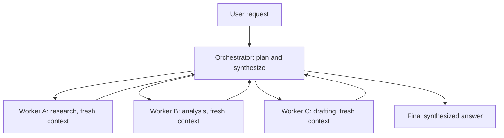
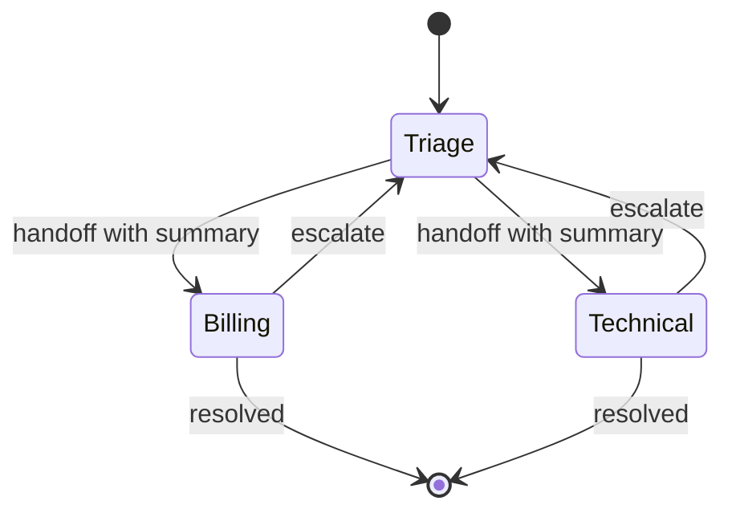

# Multi-Agent Topologies in Production

## Overview

Multi-agent systems connect several LLM agents — each with its own context, tools, and role — into one topology: an orchestrator delegating to workers, agents handing tasks to peers, a hierarchy of teams, a debate panel, or collaborators writing to a shared blackboard. The conceptual patterns are covered in [Multi-Agent Systems](../../ml/agents/multi-agent.md); this page is the production treatment: when the evidence says multi-agent actually helps (mixed — and stated honestly), the topology catalog with its failure modes, the context-isolation math that is the real reason multi-agent sometimes wins, and the framework mapping for building one.

The honest headline, stated up front: **the evidence that multi-agent beats a well-built single loop is mixed**, and the strongest practitioner guidance runs the other way by default. Anthropic's *Building Effective Agents* argues most problems want a workflow and that complexity must be justified per step; Cognition's "Don't Build Multi-Agents" argues from production experience that subagents fragment context and multiply failure surfaces. Yet sampling-and-voting results, debate benchmarks, and real orchestrator deployments (research systems, coding fan-out) show genuine wins in specific regimes. The engineering skill is knowing which regime you are in — not having an opinion.

## Does Multi-Agent Beat a Single Loop? Reading the Evidence Honestly

The evidence sorts into three camps. **Camp one — helps:** "More Agents Is All You Need" (Li et al., 2024) shows simple sampling-and-voting across many LLM instances scales accuracy with budget on a range of benchmarks; multi-agent debate (Du et al., 2023) improves factuality and reasoning on math and factual tasks; orchestration research systems (Anthropic's multi-agent research write-up, MetaGPT's software company simulation) demonstrate real capability on tasks too broad for one context. **Camp two — costs:** "Are More LLM Calls All You Need?" (Chen et al., 2024) shows compound-system scaling curves vary sharply by task complexity — more calls help some tasks and actively hurt others; the MAST taxonomy study "Why Do Multi-Agent LLM Systems Fail?" (Cemri et al., 2025) catalogs how multi-agent runs fail at *coordination*, not just reasoning. **Camp three — practitioner priors:** workflow-first guidance and the context-fragmentation argument from Cognition, plus the universal observation that multi-agent systems are harder to debug, trace, and budget.

The synthesis that survives contact with production: multi-agent wins are concentrated where you get **parallelism across independent subtasks** (fan-out research, batch evaluation), **context isolation** (the task's working set genuinely exceeds one window), or **independent verification** (debate/voting where errors are uncorrelated). It loses where subtasks are strongly sequential and state-dependent — precisely where handoff compression loses information and the system becomes a telephone game. Before building one, answer the question "what does the second agent see that the first could not?" — if the honest answer is "nothing, just a different prompt", you are paying the topology tax for nothing.

## Orchestrator-Worker: the Default Production Topology

Orchestrator-worker is the topology that survives production contact most often: one orchestrator plans, delegates subtasks, and synthesizes; workers execute in isolated contexts with narrow tools; results return as structured summaries. It is the shape of OpenAI's Agents SDK supervisor patterns, LangGraph supervisor graphs, and the research-system deployments cited above. The reason it works is the isolation math below; the reason it is manageable is that all coordination flows through one auditable point, which is exactly where you put the tracing, budgets, and policy.

**The context-isolation math.** Suppose a research task must read 50 sources at ~10k tokens each. A single loop must hold up to 500k tokens of working context — beyond most usable windows, and expensive even with a big window, since every step re-sends the accumulated context. The orchestrator-worker version: five workers each read ten sources in a fresh 100k-token context and return a 500-token structured summary; the orchestrator holds 2.5k tokens of summaries and synthesizes. Total token spend drops by an order of magnitude, each worker's attention is undiluted by the other forty sources, and a poisoned source contaminates one worker's context instead of the whole run — the isolation also *contains* the prompt-injection blast radius from [Tool Poisoning and Deterministic Workflows](../agents/tool-poisoning-workflows.md). This math, not "agents collaborating", is the actual value proposition; it is also the test for whether you need the topology at all — if the working set fits one window, one loop wins on simplicity.

## Swarm and Handoffs: Peer-to-Peer Delegation

The swarm/handoff pattern removes the fixed orchestrator: agents are peers, and any agent can *hand off* the active conversation to a more appropriate one, transferring context and control. OpenAI's Agents SDK makes handoffs a first-class primitive; the customer-support architecture it documents — triage agent routes to billing or technical specialists, who may escalate back — is the canonical example. Handoffs shine when the *domain expertise needed changes mid-task* in ways you cannot predict statically: the triage agent cannot know at turn one whether a ticket is billing or bug.

The failure mode is built into the design: each handoff is a **lossy compression** — the receiving agent sees a summary of the prior context, not the context itself. One handoff is fine; four handoffs in a chain is the telephone game, where the original constraint ("must use the corporate rate plan") has quietly vanished. Production disciplines: pass *structured* state (typed fields, not prose summaries) wherever possible, bound handoff chains and route back to a human past the bound, and trace every handoff as an explicit span so "which agent lost the constraint" is a query, not an archaeology project. Handoffs also need the identity machinery from [Agent Identity and Auth](./agent-identity-and-auth.md) — the receiving agent inherits delegated authority, and that delegation should be visible in the token chain, not just in the application log.

## Hierarchies, Debate and Blackboards

Three further topologies cover the remaining legitimate use cases. **Hierarchical crews** (CrewAI's native model, MetaGPT's software-company simulation) compose manager-of-managers: a director delegates to leads, leads to workers. The benefit is scale — you can map a genuinely large work decomposition onto an org-chart-like structure; the cost is that every intermediate layer is a compression-and-relay hop, so hierarchy amplifies the telephone game and the failure taxonomy of [Multi-Agent Systems](../../ml/agents/multi-agent.md). Use it when the decomposition is deep *and* each level adds real information (filtering, verification, resource allocation), not as decoration.

**Debate** puts agents in adversarial or multi-perspective argument — N agents propose, critique, and revise, with a judge or vote resolving (Du et al., 2023; earlier multi-persona work like CAMEL). The honest evaluation: measurable gains on math and factual-accuracy benchmarks, and the follow-up literature ("Should we be going MAD?", Smit et al., 2024) shows the gains shrink against well-tuned single-agent baselines — the improvement is often just "more compute", achievable more cheaply by sampling one agent. Debate is worth deploying where **independent perspectives are genuinely uncorrelated** — red-team/blue-team safety review, high-stakes decision memos — and not as a generic accuracy knob. **Blackboard** architectures (the oldest pattern here, from 1970s AI) give agents a shared structured workspace they read and write; LangGraph's shared-state graphs are the modern implementation shape. Blackboards minimize message-passing loss (state is authoritative, not relayed) but introduce write-conflict and consistency problems — the memory page's conflict-resolution machinery applies directly, and the scoping rules matter the moment the blackboard crosses tenants.

## Failure Modes: What Actually Breaks

The MAST taxonomy (Cemri et al., 2025) found most multi-agent failures are *systemic* — specification and inter-agent coordination issues — rather than model failures. The recurring ones, with their engineering counters:

| Failure mode | Mechanism | Countermeasure |
|---|---|---|
| Telephone game | Each hop summarizes; constraints and nuances decay | Structured state transfer; bound handoff chains; verify constraints at delivery |
| Cost blowups | n agents × rounds × growing contexts; pairwise chatter scales as n² | Budget caps per run and per agent; trace-level token rollups; fan-out limits |
| Loss of global state | No agent holds the whole picture; conflicting assumptions diverge | Blackboard or orchestrator-owned source of truth; state versioning |
| Loops and livelock | Agents ping-pong a task ("you do it") or retry forever | Hop counts, loop detection over action hashes, escalation to human |
| Specification drift | Subagents optimize their prompt's wording, not the task's intent | Verifiable subtask contracts with testable outputs, not prose instructions |
| Compounding error | Reliability multiplies down the chain: 0.9 per stage → 0.59 over five | Fewer stages; verification gates between stages; parallel voting instead of chains |

The compounding row deserves emphasis because it is the quiet killer: if each stage is 90% reliable, a five-stage chain is ~59% reliable end-to-end — worse than one 80%-reliable agent. Multi-agent design must *raise* per-stage reliability (narrow, verifiable subtasks do) faster than it *adds* stages. This is the quantitative core of the honest answer to "should we go multi-agent": count the stages, estimate per-stage reliability from your traces, multiply, and compare against the single-loop baseline — [Agent Observability](./agent-observability.md) gives you every number in that product.

## Framework Mapping

| Framework | Topology fit | Coordination model | Production notes |
|---|---|---|---|
| LangGraph | Orchestrator-worker, blackboard, arbitrary graphs | Explicit state graph, edges as control flow | Checkpointing, interrupts, time travel — the operability features |
| OpenAI Agents SDK | Handoffs (swarm), supervisor patterns | Native handoff primitive; guardrails as first-class | Small surface; tracing built in |
| AutoGen | Conversation-based teams, debate | Event-driven group chat; programmable speakers | Most research-grounded; papers accompany the design |
| CrewAI | Hierarchical crews | Role/task/process abstractions | Fastest path to role-based teams; less control over control flow |
| A2A (protocol) | Cross-organization delegation | Agent Cards, task lifecycle, artifacts | The inter-org wire layer — see [Agent Protocols](./agent-protocols.md) |

The selection logic mirrors the single-agent case: prefer the framework whose coordination model *is* your topology rather than the most popular one. If you need durable state and human interrupts, LangGraph's checkpointer is the feature that matters. If you need peer handoffs, the Agents SDK's primitive beats improvising one. If the topology crosses an organizational boundary, no framework's in-process abstraction applies — that is A2A territory. And in every case, the multi-agent run must land in the same observability plane as single-agent runs: one root trace per user request, per-agent spans beneath it, budgets enforced at the orchestrator — because the failure modes above are only detectable with per-agent, per-hop telemetry.

## Interview Questions

1. **When does multi-agent actually beat a single agent loop — and when is it a mistake?** Beats it in three regimes: parallelism across genuinely independent subtasks (fan-out research, batch evaluation), context isolation when the working set exceeds one window (50 sources at 10k tokens each), and independent verification (voting or debate where errors are uncorrelated). It is a mistake for sequential, state-dependent work, where every handoff is a lossy compression and reliability compounds down the chain — five 90%-reliable stages yield ~59% end-to-end. The test: name what the second agent sees that the first could not. If the answer is "a different prompt", keep one loop and invest in tools.

2. **Explain the context-isolation argument with numbers.** Reading 50 sources of 10k tokens each in one loop means up to 500k tokens of accumulated context, re-sent and re-attended every step — expensive and attention-diluting. Orchestrator-worker with five fresh-context workers of ten sources each costs five 100k contexts that each return a ~500-token summary, so the orchestrator synthesizes from ~2.5k tokens — an order-of-magnitude reduction in carried context, undiluted attention per source, and a blast-radius benefit: a poisoned source contaminates one worker, not the run. This arithmetic is the actual justification for the topology; collaboration rhetoric is not.

3. **What is the telephone game and how do you engineer against it?** Each agent-to-agent hop summarizes the prior context, and summaries lose constraints and nuance — by hop four, "use the corporate rate plan" has often vanished. Counters: transfer structured, typed state instead of prose summaries wherever possible; bound handoff chains with automatic human escalation past the bound; put verification at delivery (does the final agent's plan still satisfy the original constraints?); and trace every handoff as a span so the lossy hop is identifiable. The deeper principle: information that must survive the pipeline should live in shared state or structured artifacts, not in relayed prose.

4. **Your multi-agent prototype costs 8x a single loop and is no more accurate. Diagnose.** Measure before redesigning: pull the trace rollups and check three things. First, topology fit — is the task sequential? If so, workers add hops, not value, and compounding reliability (~0.9^stages) explains the accuracy parity. Second, cost shape — pairwise agent chatter or re-sent context across hops shows up as token rollups; orchestrator summaries and worker context caps attack it. Third, verification value — if agents are not actually catching each other's errors (correlated mistakes), debate-style layouts add calls without adding signal. The likely verdict: collapse to an orchestrator with fewer workers, or to a single loop with better tools — the workflow-first principle applied.

5. **Which framework would you pick for a multi-agent production system, and why?** Match the framework's coordination model to the topology rather than following popularity. Durable, interruptible orchestration with real state: LangGraph — checkpointing and time travel are the operability features that matter in production. Peer handoffs with guardrails: OpenAI Agents SDK, whose handoff primitive is native. Research-flavored conversational teams and debate: AutoGen, the most research-grounded. Role-based crews fast: CrewAI. If agents cross an organizational boundary, none of the in-process abstractions apply — use A2A for the wire. In all cases: one root trace per request, per-agent spans, and budget caps at the orchestrator, because the topologies' failure modes are invisible without that telemetry.

## Key Takeaways

- The evidence is genuinely mixed: sampling/voting and debate help specific benchmark regimes, but practitioner guidance is workflow-first, and MAST-class studies show multi-agent failures are mostly coordination failures, not model failures.
- Multi-agent wins concentrate in three regimes: parallelism over independent subtasks, context isolation when the working set exceeds one window, and verification via uncorrelated perspectives.
- The context-isolation math is the real value proposition: five workers each reading ten sources return ~500-token summaries, cutting carried context by an order of magnitude versus one 500k-token loop.
- Orchestrator-worker is the default production topology — one auditable coordination point; handoffs/swarm fit unpredictable domain shifts; hierarchy scales decomposition but amplifies relay loss; debate needs genuinely uncorrelated perspectives.
- The telephone game, cost blowups, lost global state, livelock, specification drift, and compounding error are the named failure modes — each has a structural countermeasure, none has a prompt fix.
- Reliability compounds: five 90% stages ≈ 59% end-to-end; count stages and multiply per-stage reliability from your traces before choosing the topology.
- Match the framework's coordination model to the topology — LangGraph for durable graphs, Agents SDK for handoffs, AutoGen for conversation teams, CrewAI for crews, A2A across organizations — and land every run in the same trace plane with budgets at the orchestrator.

## References

- Anthropic Engineering — *Building Effective Agents* (workflow-first guidance): <https://www.anthropic.com/engineering/building-effective-agents>
- More Agents Is All You Need, Li et al., 2024: <https://arxiv.org/abs/2402.05120>
- Are More LLM Calls All You Need? Towards Scaling Laws of Compound Inference Systems, Chen et al., 2024: <https://arxiv.org/abs/2403.02419>
- Improving Factuality and Reasoning in Language Models through Multiagent Debate, Du et al., 2023: <https://arxiv.org/abs/2305.14325>
- Why Do Multi-Agent LLM Systems Fail? (MAST taxonomy), Cemri et al., 2025: <https://arxiv.org/abs/2503.13657>
- MetaGPT: Meta Programming for a Multi-Agent Collaborative Framework, Hong et al., 2023: <https://arxiv.org/abs/2308.00352>
- AutoGen: Enabling Next-Gen LLM Applications via Multi-Agent Conversation, Wu et al., 2023: <https://arxiv.org/abs/2308.08155>
- LangGraph — state graphs, checkpointing, interrupts: <https://langchain-ai.github.io/langgraph/>
- OpenAI Agents SDK — handoffs and guardrails: <https://openai.github.io/openai-agents-python/>
- AutoGen documentation: <https://microsoft.github.io/autogen/>
- CrewAI documentation: <https://docs.crewai.com/>
- A2A protocol — cross-organization task delegation: <https://a2a-protocol.org/latest/>
- Cognition — "Don't Build Multi-Agents" (practitioner essay, 2025): cognition.ai blog
- Should we be going MAD? A Systematic Review of Multi-Agent Debate Strategies (Smit et al., 2024) — cited by title; see OpenReview

## Cross-References

- [Multi-Agent Systems](../../ml/agents/multi-agent.md) — the conceptual patterns: supervisor, pipeline, debate, blackboard
- [CrewAI](../../ml/agents/crewai.md) and [AutoGen](../../ml/agents/autogen.md) — framework deep dives for two coordination models
- [Agent Protocols](./agent-protocols.md) — A2A's task lifecycle as the cross-org delegation layer
- [Agent Observability](./agent-observability.md) — per-agent spans and budget rollups that make the failure modes detectable
- [Agent Memory Advanced](./agent-memory-advanced.md) — shared-blackboard state, conflict resolution, and scoping
- [Tool Poisoning and Deterministic Workflows](../agents/tool-poisoning-workflows.md) — how topology choices contain or amplify injection blast radius
