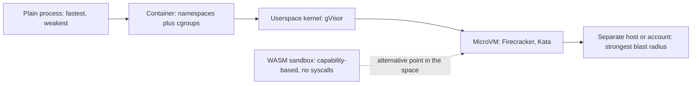
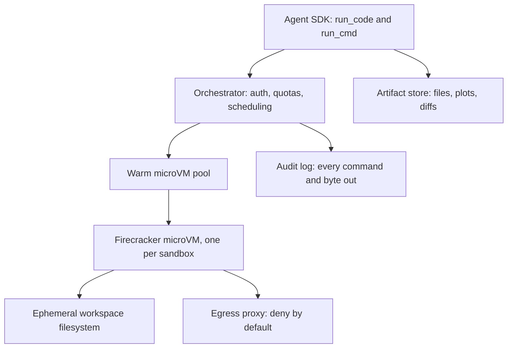

# Sandboxed Execution for Agents

## Overview

The moment an agent can execute code — a Python tool, a shell command, a notebook, a build system — it can execute *attacker-chosen* code, because untrusted content can steer the model that writes the code. Sandboxed execution is the discipline of running model-generated programs inside isolation boundaries whose compromise costs you nothing: ephemeral machines with no credentials, no network by default, and a filesystem that is thrown away. This page covers the isolation options (containers, userspace kernels, microVMs, WASM), the kernel-level controls underneath them (seccomp, namespaces, cgroups, egress policy), the cold-start versus density trade-off, and the E2B-style architecture that has become the reference pattern for agent code execution.

This is not an optional hardening step. The verified sources for this book are blunt about it: "if your agent executes code it wrote, it needs one of these — not optional", and "there is no safe version of running model-written code on your own machine". Interviews probe the trade-off space — "why microVMs instead of containers?", "what does WASM buy you, and what does it cost?" — because the answers require real systems knowledge rather than framework familiarity. The OS-level building blocks have their own deep-dive pages in this repo: [Seccomp Deep Dive](../../os/advanced/seccomp-bpf.md), [Namespaces](../../os/containers/namespaces.md), and [Cgroups](../../os/containers/cgroups.md).

## Threat Model: Why Code-Exec Tools Need Isolation

The attack chain is short. A document, web page, or tool output contains instructions; the agent's model incorporates them; the agent writes a shell or Python command implementing them; the host runs it with the agent's privileges. Unlike a plain prompt-injection leak, code execution reaches the *machine*: exfiltrate environment variables (API keys, database URLs), scan the internal network, encrypt or corrupt files, install a crypto miner, or pivot into adjacent services. OWASP's LLM Top 10 names the categories — insecure output handling (model output passed to interpreters) and excessive agency (permissions beyond what the task needs) — and both resolve to the same root cause: the execution boundary equals the trust boundary, when it must be strictly smaller.

Two design rules follow. First, **isolation must not depend on model behavior**: no prompt, system message, or classifier can be the thing that keeps malicious code in — the boundary is enforced by the kernel or the hypervisor, mechanically. Second, **assume the sandbox is hostile**: it has no secrets in its environment, no network route by default, no persistent state worth stealing, and every byte it emits is treated as untrusted tool output. Under those assumptions, a fully compromised sandbox is an incident of type "bad result", not "breach".

## The Isolation Spectrum

Isolation technology is a spectrum from cheap-and-porous to expensive-and-solid, and the right choice depends on what the code needs to do (full Python with native wheels? a 20 ms data transform?) and what it must not be able to do.



| Option | Isolation mechanism | Boot / instantiation | Compatibility | Where it shows up |
|---|---|---|---|---|
| Container (runc) | Namespaces + cgroups + capabilities | ~100-500 ms | Full Linux syscalls | Default tool sandboxing; weakest link is the shared kernel |
| gVisor | Userspace application kernel intercepting syscalls | Container-like start | Most of Linux surface; some gaps | Google App Engine, Cloud Run, AI notebooks |
| Kata Containers | Lightweight VM per container (OCI-compatible) | Sub-second to ~2 s | Full kernel per sandbox | Kubernetes-native agent runtimes |
| Firecracker microVM | KVM microVM per sandbox, minimal device model | Under ~125 ms, under ~5 MiB overhead | Linux guest, chosen distro | E2B, AWS Lambda/Fargate heritage |
| WASM (Wasmtime/WASI) | Capability-based imports; no syscalls at all | Single-digit ms | Only what WASI/component model provides | Edge sandboxes, plugins, cheap per-call isolation |
| Separate host / cloud account | Full administrative boundary | Seconds-minutes | Everything | Highest-assurance evals and red-team runs |

## Containers vs MicroVMs: gVisor, Kata, Firecracker

Containers give you process-level walls but share the host kernel — the single largest attack surface in the stack. Kernel escape bugs are found regularly, and a sandbox whose security depends on zero kernel 0-days is a weak sandbox for hostile code. Three systems attack that shared-kernel problem differently. **gVisor** (Google) implements a Linux-compatible kernel in userspace: the sandboxed process makes syscalls to an interceptor (the Sentry) that re-implements them safely in Go, so hostile syscalls never reach the real kernel. The cost is syscall overhead — syscall-heavy workloads run measurably slower — and occasional compatibility gaps, but the model is battle-tested across Google's serverless fleet. **Kata Containers** wraps each container in a lightweight VM with its own kernel, so it slots into existing Kubernetes/OCI tooling while upgrading the boundary to a hardware hypervisor. **Firecracker** (AWS) strips the VM monitor down to the minimum: a KVM microVM with a tiny virtual device model, booting in under ~125 ms with under ~5 MiB of overhead per instance — fast enough to give *every agent tool call its own machine* and throw it away, which is exactly what E2B and similar services build on.

The engineering question is not "which is strongest" (separate host wins, microVM second) but "which strength do you need at which latency and price". A code-interpreter for a data-analysis agent wants Firecracker-class isolation with sub-200 ms provisioning. A plugin system inside an existing product might prefer gVisor to keep container UX. A WASM workload that only needs pure computation gets near-process speed with stronger-than-container guarantees — when its runtime is correct.

## WASM Sandboxes: Wasmtime and WASI

WebAssembly offers isolation by construction rather than by inspection: a `.wasm` module is a typed instruction set with *no* operating system underneath. It cannot open a file, read a clock, or touch a socket unless the host explicitly hands it an import — security is a capability list, not a filter over syscalls. Wasmtime (Bytecode Alliance) is the reference runtime: compilation via Cranelift, sandboxing that treats every memory access and indirect call as checked, and instantiation in single-digit milliseconds. WASI supplies the POSIX-shaped, capability-based system interface: preopen a directory and the module can read exactly that directory — and nothing else — with no path traversal reaching the host. The repo's [WASI page](../../cs-theory/wasi.md) covers the design in depth.

```bash
# A WASI sandbox: the module may touch ./workspace and nothing else
wasmtime run --dir=workspace --env AGENT_TASK=transform worker.wasm
```

The trade is compatibility and ergonomics. A data-science agent needs pandas, numpy, scipy — real native wheels — and while Python-on-WASM progresses, the friction is real: extension modules, subprocess spawning, and some socket semantics are exactly what WASI restricts or does not yet standardize (WASI Preview 2's component model improves this; async and sockets remain the rough edges). The pragmatic split seen in production: WASM for the high-volume, low-trust tier (parsing, formatting, per-user plugins, anything at the edge), microVMs for the full-fidelity tier (arbitrary Python with native packages). Treating these as two shelves of one execution service, chosen per call, is the architecture most likely to survive.

## Kernel Controls: seccomp, Namespaces, Cgroups, Network Policy

Whatever the outer boundary, the inner controls are standard Linux hardening, and each has a deep-dive page in this repo. **Seccomp-BPF** installs a per-thread syscall filter: a code-exec sandbox gets a profile allowing only what the interpreter needs (mmap, futex, read, write, clock, a short list) and kills the process on anything else — this is how a container becomes a sieve rather than an open kernel. **Namespaces** (pid, mount, net, user, ipc, uts) make the sandbox see its own process tree, filesystem, and network stack; **user namespaces** in particular let the sandbox run as UID 0 inside while mapping to an unprivileged UID outside. **Cgroups** cap CPU, memory, and pids so a runaway `while True` or fork bomb cannot take the host down — set a hard memory limit and a pids limit on every sandbox, always.

Network is the control most often skipped and most often regretted. Egress must be **deny by default**: a sandbox that can reach the internet can exfiltrate whatever it holds and call home for stage-two payloads. The pattern is an egress proxy with an allowlist of the specific domains the task needs (PyPI for installs, the task's target API), DNS resolution constrained to the proxy, and TLS inspected or at least domain-pinned. The repo's [seccomp deep dive](../../os/advanced/seccomp-bpf.md) shows the filter mechanics; the pattern below is the minimal container profile that combines these controls.

```bash
docker run --rm \
  --network=none \
  --cap-drop=ALL --security-opt=no-new-privileges \
  --security-opt seccomp=profiles/code-exec.json \
  --read-only --tmpfs /tmp:rw,size=64m \
  --memory=1g --pids-limit=128 \
  agent-sandbox:latest
```

## Cold Start vs Density: the Central Trade-off

Every isolation choice trades startup latency against per-host density and strength. The table below is the design heart of this page; numbers are order-of-magnitude figures from vendor documentation and public benchmarks, good for reasoning rather than procurement.

| Isolation | Typical cold start | Density per host | Strength against hostile code | Cost shape |
|---|---|---|---|---|
| Warm container pool | ~1-10 ms (pre-forked) | Hundreds | Container-level | Cheapest; warm pool = idle cost |
| runc container, cold | ~100-500 ms | Hundreds | Container-level | Low |
| gVisor container | Container-like + syscall tax | Hundreds, some overhead | Userspace kernel | Low-medium |
| Kata VM | ~0.5-2 s | Tens | Hardware VM boundary | Medium |
| Firecracker microVM | Under ~125 ms | Hundreds to thousands | Hardware VM boundary, tiny TCB | Medium; snapshot/restore amortizes |
| Wasmtime (WASI) | ~1-10 ms | Thousands to tens of thousands | Capability-based, no syscalls | Lowest for pure compute |

The practical engineering answers to cold start are pooling and snapshotting. A **warm pool** keeps N pre-started sandboxes per tenant/shape and hands them out like connections, paying steady-state cost to hide latency; the hygiene requirement is that a reused sandbox is *scrubbed or discarded* after use — E2B-style services prefer one sandbox per run and scale the pool instead. **Snapshot/restore** (Firecracker supports VM snapshots; WASM runtimes support pre-instantiated modules) freezes an initialized sandbox — interpreter booted, packages imported — and clones it, cutting tail latency to milliseconds while keeping a fresh boundary per call. For agent workloads where a run may need 30 sequential executions, the difference between 150 ms and 8 s of aggregate provisioning overhead is the difference between a snappy tool and a product-killing one.

## E2B-Style Architecture

E2B is the reference architecture for "sandboxed execution as a service" and is Firecracker-backed by design. The shape generalizes: an SDK the agent calls; an orchestrator that provisions, pools, and accounts for sandboxes; a fleet of microVMs with one sandbox per VM; a file bridge for workspace artifacts; an egress proxy enforcing the network allowlist; and artifact storage for anything the run produced. OpenHands — the open-source coding agent — implements the same shape with its own sandboxed runtime and is a readable second reference implementation.



The audit log deserves its box. A production execution service records every command, every exit code, every network destination, and every artifact hash — because "what did the agent actually run?" is a question you will be asked by security, by the customer, and by the eval pipeline, and the only good answer is a query. This is also where observability meets isolation: the sandbox emits a span per execution (see [Agent Observability](./agent-observability.md)), and the execution service's logs join to the trace by run ID.

## Filesystem and Workspace Isolation

Code-exec sandboxes should see a **per-run workspace** and nothing else: a fresh directory (or overlayfs upper layer over a read-only base image) that is mounted into the sandbox, writable, and destroyed after the run. No host mounts, no docker socket (the classic container-escape shortcut), no home directory with dotfiles, and *no secrets in the environment* — if the sandboxed code needs a credential to call an API, inject it through a broker at call time (a proxy that adds the Authorization header) rather than as an env var the code can print. The base image stays read-only so the attack "modify your own runtime and persist" dies.

For coding agents that edit real repositories, the workspace pattern becomes git-native: clone the repo into the sandbox at the task's base commit, let the agent mutate it freely inside the boundary, and extract the result as a **patch** (`git diff`) rather than a mutated directory. The patch is small, reviewable, hashable, and exactly what the evaluation harness needs to replay tests — the SWE-bench harness works in precisely this shape (see [SWE Agents](./swe-agents.md)). Workspace isolation and patch extraction together give you the strongest property in this page: the agent's entire effect on the world is a diff you can inspect before it merges.

## Interview Questions

1. **Why are containers considered insufficient for running hostile model-generated code?** Containers isolate with namespaces and cgroups but share the host kernel, and the kernel is a huge attack surface with a steady supply of escape bugs. Hostile code — which model-generated code must be assumed to be, given prompt injection — can attack the kernel directly via crafted syscalls. gVisor moves the boundary by implementing the syscall surface in userspace, Kata and Firecracker move it into a hardware VM with its own kernel. Containers remain fine for running code you wrote and vetted; the bar rises to microVM (or WASM) when the code's author is the model steered by untrusted input.

2. **Walk me through the cold-start vs density trade-off and how production systems square it.** Stronger isolation costs startup time: containers ~100-500 ms, Firecracker under ~125 ms but with orchestration overhead, Kata near a second, WASM single-digit milliseconds but restricted compatibility. Squaring it is pooling and snapshotting: keep warm microVM pools per tenant-shape so handing out a sandbox is a millisecond operation, and use Firecracker snapshots or pre-instantiated WASM modules to clone an initialized state instead of booting from scratch. The density side of the ledger — thousands of Firecracker microVMs or tens of thousands of WASM instances per host — is what keeps the warm-pool steady-state cost affordable.

3. **What does WASM buy you over a microVM, and what does it cost?** It buys capability-based security by construction (no syscalls; the module can only touch what the host explicitly imports), near-process instantiation in milliseconds, and enormous density — ideal for per-call, per-user plugin execution. It costs compatibility: no native extension modules in practice (so no pandas-with-C-speedups class of workloads without porting), a still-stabilizing WASI standard (Preview 2's component model helped; async and sockets are the rough edges), and a different debugging experience. Production systems use WASM for the high-volume low-trust tier and microVMs for full-fidelity Python; the execution service picks a shelf per call.

4. **Design the network policy for an agent code-execution sandbox.** Deny by default at the VM or network-namespace boundary; route any allowed egress through a proxy that enforces an allowlist (PyPI during install phases, the task's target API), constrain DNS to the proxy so hostname-based rules are meaningful, and log every allowed and denied connection with the run ID. Secrets never enter the sandbox environment; if the code must call an authenticated API, a broker proxy attaches the credential so the sandbox never sees it. The reasoning: a sandbox's contents are assumed compromised, so the network is the exfiltration channel, and deny-by-default turns "what can it leak to" from "anything" into a finite audited list.

5. **What should and should not exist inside a code-exec sandbox's filesystem?** Inside: a per-run workspace directory (writable), a read-only base image, and a small tmpfs for scratch. Outside the sandbox entirely: host mounts, the container runtime socket, long-lived credentials, and anything stateful you cannot afford to lose. If sandboxed code needs to authenticate, inject via call-time broker rather than env vars. For coding agents, keep the repo clone in the workspace and extract results as a git patch — the diff is reviewable, and the sandbox's whole effect on the world reduces to bytes you inspect before use.

## Key Takeaways

- Model-written code must be assumed attacker-written: prompt injection turns a code-exec tool into an RCE primitive unless execution happens inside a boundary enforced by the kernel or hypervisor.
- The isolation spectrum is process → container → userspace kernel (gVisor) → microVM (Kata, Firecracker) → separate host; WASM is a parallel point with capability-based isolation and no syscalls at all.
- Firecracker's numbers are what make per-call microVMs economical: under ~125 ms boot and under ~5 MiB overhead, with snapshot/restore amortizing further.
- Seccomp filters, user namespaces, cgroup limits, and deny-by-default egress are the non-negotiable inner controls regardless of the outer boundary.
- Cold start is solved with warm pools and snapshot/restore; density is what pays for the pools — pick the isolation tier per call, not per company.
- E2B-style architecture = SDK + orchestrator + warm microVM pool + egress proxy + artifact store + audit log; OpenHands is the open reference implementation.
- Workspace isolation plus patch extraction (git diff out of a per-run clone) makes the agent's entire effect inspectable — the property evals and security both depend on.

## References

- E2B — Firecracker-backed sandboxes for agent code: <https://e2b.dev/docs>
- E2B source: <https://github.com/e2b-dev/E2B>
- gVisor — userspace kernel syscall interception: <https://github.com/google/gvisor>
- Firecracker microVMs: <https://firecracker-microvm.github.io/>
- Kata Containers: <https://github.com/kata-containers/kata-containers>
- Wasmtime runtime (Bytecode Alliance): <https://github.com/bytecodealliance/wasmtime>
- OpenHands — open coding agent with sandboxed runtime: <https://github.com/All-Hands-AI/OpenHands>
- Modal — serverless containers with fast cold starts: <https://modal.com/docs>
- OWASP Top 10 for LLM Applications: <https://genai.owasp.org/>

## Cross-References

- [Seccomp Deep Dive](../../os/advanced/seccomp-bpf.md) — the syscall-filter mechanics behind sandbox profiles
- [Namespaces](../../os/containers/namespaces.md) and [Cgroups](../../os/containers/cgroups.md) — the container primitives the spectrum builds on
- [WASI](../../cs-theory/wasi.md) — the capability-based system interface that makes WASM sandboxing work
- [Tool Poisoning and Deterministic Workflows](../agents/tool-poisoning-workflows.md) — the attack model sandboxing defends against
- [SWE Agents](./swe-agents.md) — the git-patch workspace pattern applied to coding agents
- [Agent Observability](./agent-observability.md) — how sandbox executions join the trace
