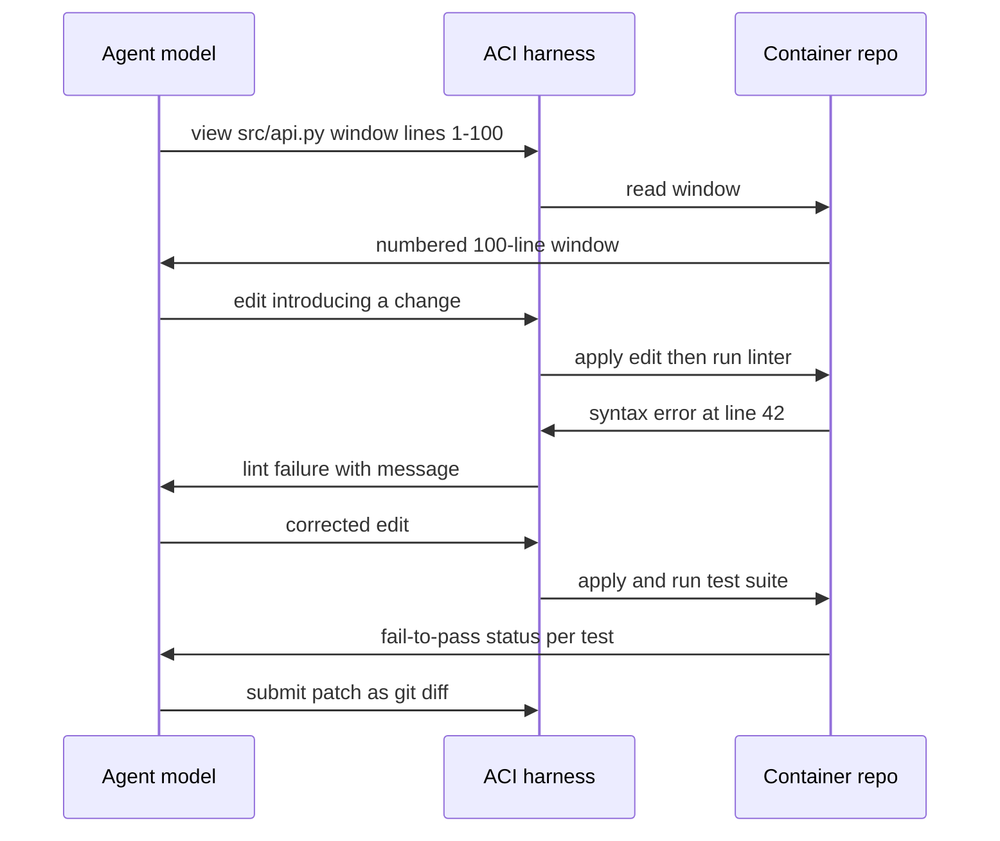

# SWE Agents: Coding Agents and Their Harnesses

## Overview

Software-engineering agents are the most mature agentic systems in production — the setting where the agent loop, tool design, sandboxing, and evaluation discipline have all been sharpened against a measurable objective: given a real GitHub issue, produce a patch that makes the failing tests pass without breaking the passing ones. This page covers the task shape and the SWE-bench family that defines it, SWE-agent and the agent-computer-interface (ACI) argument that tool design beats prompt design, the open implementations (OpenHands), the UX spectrum from Aider to Cursor to Claude Code, patch validation loops, and the economics of cost per resolved issue.

Coding agents matter to interview preparation disproportionately: they are the agent systems most candidates have personally used, so questions go deep — "why did SWE-agent redesign its file viewer?", "what does SWE-bench Verified actually verify?", "why is a git patch the right output contract?" — and the answers require the systems view this section has been building: the repo page in [Sandboxed Execution](./sandboxed-execution.md), the loop in [ReAct](../../ml/agents/react.md), the schema discipline in [Tool Calling](../../ml/agents/tool-calling.md).

## The Task Shape: Issue → Patch → Tests

The canonical coding-agent task has four artifacts. An **issue** (natural language, sometimes with reproduction steps) defines the work. A **repository state** pinned at the parent commit of the real fix defines the starting point. The agent produces a **patch** — ideally a git diff, and nothing else. An **evaluation harness** applies the patch to the pinned repo and runs tests, classifying them into **fail-to-pass** (the tests that were failing because of the bug and must now pass) and **pass-to-pass** (the tests that must stay green). Resolution is mechanical: all fail-to-pass pass, no pass-to-pass regress. This definition is the reason coding agents are the best-evaluated agents in existence — the reward is executable, reproducible, and (in principle) ungameable, unlike a judged chat answer.

The same shape is the right template for production use even outside benchmarks: give the agent a containerized repo, let it work inside a per-run workspace, and extract the effect as a patch that CI validates. The agent's whole world becomes inspectable — see the workspace-isolation pattern in [Sandboxed Execution](./sandboxed-execution.md).

## SWE-bench and Its Variants

SWE-bench (Jimenez et al., 2023) assembled 2,294 task instances from real issues and merged PRs across 12 widely used Python repositories — Django, scikit-learn, matplotlib, sympy and peers — by collecting the issue text, the gold patch, and the tests from each merged PR. The variants are different benchmarks and get conflated constantly, which the verified index for this book flags explicitly: "Verified, Lite and Full are different benchmarks. Scores get quoted without saying which — always check."

| Variant | Size | Selection | What it is good for |
|---|---|---|---|
| SWE-bench (Full) | 2,294 tasks | All collected instances | Historical comparisons; hardest mix |
| SWE-bench Lite | 300 | Smaller, more self-contained subset | Fast iteration; cheaper eval runs |
| SWE-bench Verified | 500 | Human-validated subset (OpenAI, 2024) | The credibility standard: tasks with correct issue/patch/test alignment |

Verified exists because Full contained tasks where the issue was ambiguous, the gold patch was entangled with unrelated changes, or the tests were flaky — human review removed most of that noise, making Verified the subset worth quoting in 2024-and-later comparisons. The harness itself is as instructive as the dataset: each task runs in a Docker container pinned to the base commit, with the repo's actual test runner invoked against the agent's patch — a worked example of the sandboxed-eval pattern this section keeps returning to. Two caveats belong in any serious discussion: **contamination** (the gold patch and tests are public on GitHub, so training data overlap is plausible and vendors' huge Verified gains should be read with that in mind) and **saturation** (the leaderboard is crowded enough that the field increasingly turns to harder, less-gamed suites like [Terminal-Bench](https://www.tbench.ai/) for real terminal work).

## SWE-agent and the ACI Argument

SWE-agent (Yang et al., Princeton, 2024) contributed the conceptual result this page is named for: performance depends more on the **agent-computer interface** — the tools, their outputs, and their interaction affordances — than on prompting. The paper's design choices are concrete and teachable. The file viewer shows only **100 lines at a time**, because unbounded file dumps waste context and scatter the model's attention. The edit interface is **guarded by a linter**: an edit that introduces a syntax error is rejected with the error message, so the model learns immediately rather than discovering the breakage three steps later at test time. Search tools return bounded, structured results. Each choice costs nothing in expressiveness and buys reliability — and the ablations showed meaningful resolution-rate changes purely from interface variants with the same model.

The ACI framing generalizes beyond coding: design the tool surface *for the model*, not for the human. Humans benefit from GUIs that show everything; models benefit from narrow windows, numbered lines, error messages that suggest the next action, and hard guardrails that convert mistakes into immediate, local feedback. The loop below is the ACI in motion — note how every harness response is shaped feedback, not a raw dump.

## OpenHands and the Open Implementations

OpenHands (formerly OpenDevin) is the reference open-source coding agent: an event-stream architecture where the agent emits actions (code, shell, browse, edit) that execute in a **sandboxed runtime** — a Docker container per session with its own filesystem and process space — and observations stream back into the agent's state. Its docs and repo are worth reading precisely because nothing is hidden: the runtime isolation design, the action/observation event log, and the evaluation integration with SWE-bench are all inspectable, making it the best self-study companion to this page. Alongside it, the ecosystem's progression — SWE-agent for the ACI ideas, OpenHands for the platform shape, and the vendor agents below for the UX ideas — covers essentially the whole design space for coding agents.

## UX Patterns: Aider vs Cursor vs Claude Code

The same underlying loop ships in three interaction models, and their differences are deliberate engineering positions, not fashion.

| System | Interaction model | Context strategy | Guardrail posture | Best-fit use |
|---|---|---|---|---|
| Aider | Terminal chat pair-programmer | Repo map via tree-sitter: ranked code-outline summary fits large repos in small context | Git-native: auto-commit each change, `/undo`, diffs always visible | Multi-file edits in big existing repos; users who live in git |
| Cursor | IDE-inline assistant + agent mode | File embeddings + apply-model that rewrites edits into your editor | Shadow workspace concept: preview changes before applying | Interactive development where humans steer every step |
| Claude Code | Terminal agentic harness | Agentic search and compaction; subagents for isolated subtasks | Explicit permission prompts, hooks, tool allowlists, headless mode | Delegated multi-step tasks; CI automation via the Agent SDK |

The repo map is the idea most worth stealing: rather than stuffing files into context, Aider builds a tree-sitter-derived outline of the whole repository (signatures, docstrings, structure) and lets the model *request* the details it needs — a retrieval strategy for code that scales to repos far larger than any context window. Claude Code's hooks and permissions are the production answer to "how do you let an agent act without letting it act freely": deterministic, user-configurable gates around every tool call, which is the action-rail pattern from [Guardrails](./guardrails.md) shipped as a product. Cursor's apply-model acknowledges a different constraint — the diff the model produced is not the diff you want in your buffer; a second model adapts edits to local code reality.

## Patch Validation Loops

Reliable coding agents are built around validation, not generation. The loop that works: **lint immediately** after every edit (the SWE-agent lesson — reject bad edits at edit time, not test time); **run targeted tests** after every coherent change, not just at the end; **self-review the diff** before submission (a second model pass that asks "does this diff actually address the issue? is there dead code?"); and finally **CI-grade validation** in a fresh container — apply the patch to a clean checkout, run the full suite, check fail-to-pass and pass-to-pass, exactly like the benchmark harness. Each stage is cheaper than the next, so ordering them cheapest-first minimizes wasted spend: linting costs microseconds and catches syntax errors; unit tests cost seconds and catch logic errors; full CI catches integration regressions.

Two structural choices make the loop trustworthy. The **git-patch output contract**: the agent's deliverable is a diff, not a mutated workspace — reviewable, hashable, replayable, and identical in shape to what the eval harness consumes. The **fresh-container validation**: validation runs on a clean checkout so "works in my sandbox" (with accumulated intermediate state) cannot masquerade as "works". Teams extending this pattern add deterministic static analysis (type checkers, security linters) as additional rails — the guardrails page's layered-defense shape applied to code.

## Economics: Cost per Resolved Issue

Because every step is a traced LLM call (see [Agent Observability](./agent-observability.md)), cost per resolved issue is computable rather than estimated. A worked example with a $3/M-input, $15/M-output model: an agent resolving a moderately hard issue takes ~30 turns, with the growing conversation re-sent each turn — roughly 2.4M cumulative input tokens and 15k output tokens. Cost = `2.4M/1e6 × $3 + 15k/1e6 × $15 ≈ $7.20 + $0.23 ≈ **$7.40** per attempt`. If the agent resolves the issue in, say, one of two attempts (the rest abandoned or fixed by a human after review), the effective cost per *resolved* issue is ~$15 plus human review time. Prompt-caching the unchanged prefix and compacting context can cut the input-token bill substantially — the cost-optimization levers in [Cost Optimization](../cost-optimization.md) apply directly, and the trace's token rollup tells you which lever dominates.

The comparison that makes the economics interesting: a human engineer spends 30-90 minutes on a comparable issue — $50-150 fully loaded — so the agent is an order of magnitude cheaper *when it succeeds*, and the engineering problem is the success rate and the review burden. That framing — agent cost + human review cost + failure retry cost — is the correct unit-economics model, and it explains why the industry's near-term product shape is "agent drafts, human reviews, CI validates" rather than unsupervised autonomy.

## Interview Questions

1. **What exactly does SWE-bench Verified verify, and why do the variants matter?** Each task is a real GitHub issue with the repo pinned at the pre-fix commit, a gold patch, and tests split into fail-to-pass (must newly pass) and pass-to-pass (must not regress). Verified is the 500-task subset human-validated in 2024 to remove ambiguous issues, entangled gold patches, and flaky tests — so it measures what the name implies, while Full (2,294 tasks) and Lite (300) carry noise of different amounts. Quoting a score without naming the variant is meaningless, and contamination is a standing caveat: the patches and tests are public, so training-data overlap is possible. The harness itself — Dockerized repo, real test runner, mechanical pass/fail — is the transferable idea for evaluating your own coding agents.

2. **What is the ACI argument, and what are concrete examples of interface decisions that changed outcomes?** SWE-agent's finding: agent performance depends more on the agent-computer interface than on prompt wording. Concrete decisions: a file viewer showing 100-line windows instead of whole files (focus + token economy), edits guarded by a linter so syntax errors are rejected at edit time with the error text (immediate, local feedback instead of distant test failure), and bounded, structured search output. The generalization: design tools for the model — narrow windows, numbered context, error messages that suggest the next action — rather than mirroring human-facing tooling. When your agent fails, fix the tools and their feedback before rewriting the system prompt.

3. **Why is a git patch the right output contract for a coding agent?** A patch is the smallest reviewable unit of the agent's effect: it is diffable in code review, hashable for audit logs, replayable against any checkout, and exactly the format the eval harness and CI consume. Working against a per-run workspace with patch extraction also enforces the security property from sandboxed execution — the agent's entire world-changing output is bytes you inspect before applying. Contrast with "let the agent push directly": you lose reviewability, contaminate the workspace with intermediate state, and break the fresh-container validation that makes "tests pass" mean anything.

4. **Walk through the validation loop you would build around a production coding agent.** Cheapest check first, in strict order: lint on every edit (reject at edit time with the linter message), targeted unit tests after each coherent change, a self-review pass over the diff (does the change address the issue? dead code? scope creep?), then full validation in a fresh container: apply the patch to a clean checkout, run the whole suite, and check fail-to-pass and pass-to-pass mechanically. Add static analysis rails (types, security linters) as needed. Every step emits spans — edit, lint result, test result — so failures are debuggable and cost per resolution is measurable. The design principle: the tests are the reward model, so the loop's job is to reach the tests with the fewest wasted tokens and no false confidence.

5. **Is an agent cheaper than a junior engineer for bug fixes? Give the real cost model.** Token cost per attempt is computable from traces: with a $3/M-input, $15/M-output model, a 30-turn run sending ~2.4M cumulative input and 15k output tokens costs roughly $7.40, dominated by re-sent context — which caching and compaction attack. But the honest model is: attempts × token cost + human review time per patch + human fix time for failed attempts + infrastructure. Against a human's $50-150 for the same issue, the agent is far cheaper when it succeeds and review burden is manageable; the product question is success rate and how much human verification each patch needs. That is why the shipped pattern is agent-drafts-human-reviews-CI-validates, not autonomy.

## Key Takeaways

- The coding-agent task is issue → patch → mechanical test verdict (fail-to-pass / pass-to-pass); executable rewards are what make coding agents the best-evaluated agents in the field.
- SWE-bench Full (2,294), Lite (300), and Verified (500, human-validated) are different benchmarks — always ask which, and always ask about contamination.
- SWE-agent's ACI result: tool and interface design moves resolution rates as much as models do — 100-line file windows, lint-guarded edits, bounded search output.
- Design the interface for the model: narrow windows, numbered context, error messages that suggest the next action, immediate local feedback.
- OpenHands is the open reference platform — sandboxed per-session runtime, event-stream architecture, SWE-bench integration; read its runtime before building one.
- Aider's tree-sitter repo map, Cursor's apply-model, and Claude Code's hooks/permissions are three transferable ideas: outline-based context, diff adaptation, and deterministic tool gating.
- The validation loop is the product: lint → targeted tests → self-review → fresh-container full suite, with the git patch as the reviewable output contract.
- Unit economics: ~$7 per 30-turn attempt on mid-tier frontier pricing, dominated by re-sent context — cost per *resolved* issue includes retries and human review, which is why the shipped pattern is agent-drafts, human-reviews, CI-validates.

## References

- SWE-bench: Can Language Models Resolve Real-World GitHub Issues?, Jimenez et al., 2023: <https://arxiv.org/abs/2310.06770>
- SWE-bench site and leaderboard: <https://www.swebench.com/>
- SWE-bench harness and datasets: <https://github.com/SWE-bench/SWE-bench>
- SWE-agent: Agent-Computer Interfaces Enable Automated Software Engineering, Yang et al., 2024: <https://arxiv.org/abs/2405.15793>
- SWE-agent documentation: <https://swe-agent.com/latest/>
- SWE-agent source: <https://github.com/SWE-agent/SWE-agent>
- OpenHands documentation: <https://docs.all-hands.dev/>
- OpenHands source: <https://github.com/All-Hands-AI/OpenHands>
- Aider documentation (repo map, git integration): <https://aider.chat/docs/>
- Claude Code documentation (hooks, permissions, Agent SDK): <https://docs.claude.com/en/docs/claude-code/overview>
- Claude Agent SDK: <https://docs.claude.com/en/api/agent-sdk/overview>
- tree-sitter — parsing layer under repo maps: <https://tree-sitter.github.io/tree-sitter/>
- Terminal-Bench — real-terminal agent benchmark: <https://www.tbench.ai/>
- Berkeley Function-Calling Leaderboard: <https://gorilla.cs.berkeley.edu/leaderboard.html>

## Cross-References

- [Sandboxed Execution](./sandboxed-execution.md) — per-run workspaces, patch extraction, and the isolation coding agents require
- [Agent Observability](./agent-observability.md) — the token rollups and traces behind cost-per-resolved-issue
- [Tool Calling](../../ml/agents/tool-calling.md) — schema discipline that the ACI argument refines
- [Agent Systems (advanced)](../advanced/agent-systems.md) — loop and state design for long multi-step runs
- [Multi-Agent Topologies](./multi-agent-topologies.md) — when coding work fans out across agents and how it fails
- [Agent Evaluation](../../ml/agents/evaluation.md) — evaluation concepts instantiated by the SWE-bench harness
