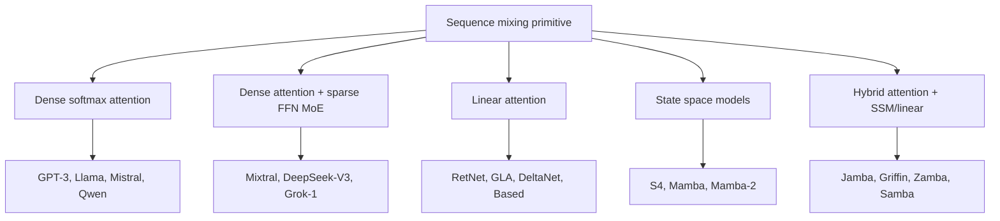
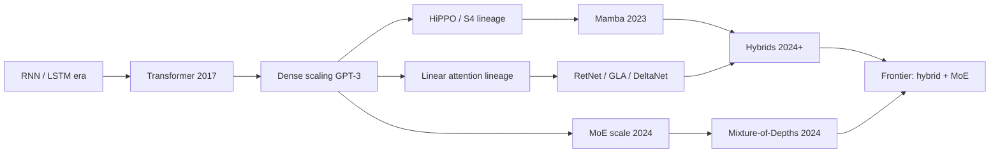
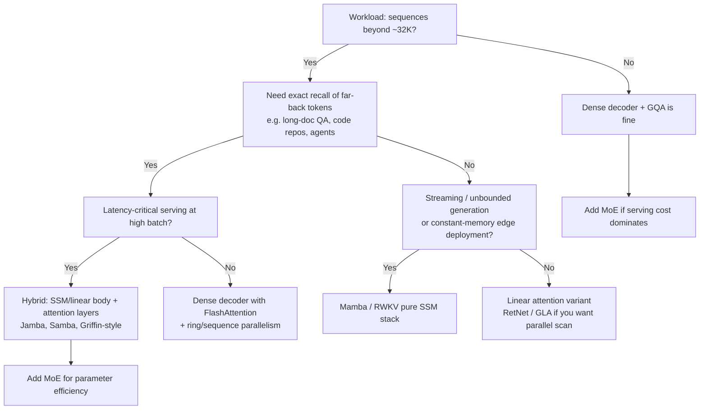

# LLM Architectures

## Overview

This section is about **how models are built**: the sequence-mixing primitive (softmax attention, linear attention, state space models, hybrids), how compute is allocated across depth (Mixture-of-Depth, early exit), how parameters are combined (model merging), and how non-text modalities are wired into a language backbone (vision-language architectures). It deliberately excludes serving engines (covered in `llm-serving/`), kernel-level attention optimization (covered in `advanced/`), and fine-tuning recipes (covered in `advanced/lora.md` and `advanced/qlora.md`). In 2024-2026 interviews, "draw a Mamba block" or "when would you choose a hybrid over a dense transformer?" are now standard questions at frontier labs and infra teams alike — the assumption is no longer that softmax attention is the only answer.

> **Interview Angle**: Expect architecture-choice questions from research-leaning teams (Meta FAIR, DeepMind, Mistral, AI21, Cohere) and efficiency questions from inference teams (vLLM, SGLang, Together, Fireworks). The strongest answers compare architectures on *mechanism* (what state is carried per token, what is recomputed) rather than on benchmark folklore.

## The Architecture Landscape at a Glance

Every autoregressive LLM must answer one question repeatedly: **when producing token `t`, how does it pull information from tokens `1..t-1`?** The five dominant families differ in what state they keep, how that state grows, and how much of the computation parallelizes across the sequence.

### Taxonomy Table

| Family | Sequence mixing | State per token | Prefill compute | Decode cost | Representative models |
|---|---|---|---|---|---|
| Dense decoder | Full softmax attention, O(N²) | KV cache, O(N) growth | O(N²d) | O(N) reads per token | GPT-3, Llama 1/2/3, Mistral, Qwen |
| MoE decoder | Softmax attention + sparse FFN | KV cache + expert routing | O(N²d), FFN ~constant | O(N) reads, FFN ~constant | Mixtral 8x7B, DeepSeek-V3, Grok-1 |
| Linear attention | Kernelized QKᵀV, O(N) | Fixed-size matrix S (d×d) | O(Nd²) | O(d²) per token | RetNet, GLA, DeltaNet, Based |
| SSM (selective) | Input-dependent recurrence, O(N) | Fixed-size hidden h (d_state) | O(Nd·d_state), scan | O(d·d_state) per token | S4, Mamba, Mamba-2 |
| Hybrid | Attention layers interleaved with SSM/linear | Mixed: KV cache on few layers, fixed state on rest | O(N²d/r) for attention ratio 1/r | Much smaller KV cache | Jamba, Griffin/Hawk, Zamba, Samba |

The key structural distinction: attention stores an **unbounded, per-token state** (the KV cache — perfect fidelity, linear memory growth), while linear attention and SSMs keep a **fixed-size compressed state** (constant memory, but lossy for far-back information). MoE is orthogonal — it changes the *FFN* dimension of the trade-off, not sequence mixing, which is why it composes with everything else.

## Timeline: How We Got Here

| Year | Milestone | Why it mattered |
|---|---|---|
| 2017 | Transformer (Vaswani et al.) | Softmax self-attention + FFN stack; fully parallel training |
| 2018-2020 | GPT-1/2/3 scale dense decoders | Showed scale on the dense recipe was the dominant factor |
| 2020 | HiPPO framework (Gu et al.) | Polynomial-projection memory; foundation for S4 |
| 2021 | S4 (Gu et al.) | Structured state spaces solve LRA; first credible post-RNN recurrence |
| 2020 | Linear Transformers (Katharopoulos et al.) | QKᵀV kernelization → O(N); "attention as RNN" |
| 2023 | RWKV (Peng et al.) | Production-grade attention-RNN hybrid, community-trained open models |
| 2023 | RetNet, StreamingLLM, YaRN | Retention as parallelizable recurrence; streaming + context extension mature |
| Dec 2023 | Mamba (Gu & Dao) | Selective SSM + hardware-aware scan; matches transformers at ≤7B scale |
| 2024 | Jamba, Griffin/Hawk, Zamba, Samba | Hybrid designs dominate the long-context throughput frontier |
| 2024 | Mamba-2 / SSD (Dao & Gu) | Proves SSM-attention duality; scalar-times-identity form is 2-8× faster |
| 2024 | Mixture-of-Depths (Meta) | Compute allocation across *depth* joins MoE's allocation across *width* |
| 2024-2025 | DeepSeek-V3, Llama 3.x, Qwen 2.5, Gemma 2/3 | MoE at production scale; hybrid local/global attention in Gemma 3 |

## The Five Families in One Paragraph Each

**Dense decoders** remain the default: Llama-class models are stack of (RoPE-MHA/GQA attention → SwiGLU FFN) blocks with RMSNorm. They are the quality benchmark, scale superbly, and have the deepest tooling. Their weaknesses are quadratic prefill and a KV cache that grows linearly per token — the pain points every other family attacks.

**MoE decoders** (see `../advanced/mixture-of-experts.md` and `../moe/architecture.md`) replace the dense FFN with a router that activates k of E experts per token. Mixtral 8x7B activates ~13B of 47B parameters per token; DeepSeek-V3 activates 37B of 671B. Sequence mixing is untouched, so MoE trades memory-footprint complexity for FLOP efficiency.

**Linear attention** rewrites attention as a recurrence over a matrix-valued state `S_t = S_{t-1} + v_t k_tᵀ`, making softmax-free O(N) computation possible. Pure linear attention loses expressive power (no softmax normalization), so the productive variants (RetNet, GLA, DeltaNet, Based) add decay gates, delta-rule updates, or low-rank sketches — covered in `linear-attention-variants.md`.

**State space models** parameterize a linear recurrence `h_t = Ā h_{t-1} + B̄ x_t` whose dynamics are *input-dependent* in Mamba (selective scan). Mamba-2 reframes the whole thing as a form of semi-separable matrix attention (SSD), unifying the two families — covered in `mamba-ssm.md` and `rwkv.md` for the RWKV branch of the same idea.

**Hybrids** interleave the two regimes: a few full-attention layers for precise recall, many SSM/linear layers for cheap long-range mixing. Jamba (AI21) uses a 1:7 attention:Mamba ratio plus MoE; Griffin (DeepMind) mixes gated linear recurrences with local attention; Gemma 3 uses a 5:1 local:global attention ratio. They currently dominate throughput-at-quality on long contexts — covered in `hybrid-architectures.md`.

## Decision Guide: Which Architecture When

Rules of thumb distilled from the 2024-2025 hybrid literature:

- **Quality ceiling**: dense softmax attention still wins on associative recall and copying tasks; pure SSMs/linear models show measurable gaps (see `ssm-vs-attention.md`).
- **Throughput**: hybrids win at long context because most layers have O(1) state; Jamba's MoE variant reports up to 3× throughput on long contexts vs Mixtral-class models, and Griffin-class models cut KV cache by large ratios.
- **Tooling**: dense + FlashAttention + PagedAttention is the most mature stack; Mamba and RWKV now ship in Hugging Face Transformers and vLLM, but debugging/quantization tooling is thinner.
- **Uncertainty about scale**: SSM and linear-attention results are solid at 0.5-8B and in the 14-70B range via hybrids; pure-SSM frontier-scale (100B+) results remain sparse in public literature.

## How to Read This Section

| Page | Question it answers |
|---|---|
| [mamba-ssm.md](./mamba-ssm.md) | How do selective SSMs work, and where do they beat/lose to transformers? |
| [rwkv.md](./rwkv.md) | What is the WKV operator and how does RWKV get transformer quality from an RNN? |
| [linear-attention-variants.md](./linear-attention-variants.md) | RetNet vs GLA vs DeltaNet vs Based — and why softmax still won scaling |
| [long-context-strategies.md](./long-context-strategies.md) | How do models stretch from 4K to 1M+ tokens (RoPE scaling, sinks, memory)? |
| [hybrid-architectures.md](./hybrid-architectures.md) | Why do Jamba/Griffin/Zamba/Samba interleave layers, and in what ratios? |
| [mixture-of-depths.md](./mixture-of-depths.md) | How do models skip compute per-token (MoD, LayerSkip, CALM)? |
| [model-merging.md](./model-merging.md) | When can you average/tie/slerp weights of two fine-tunes? |
| [vision-language-architectures.md](./vision-language-architectures.md) | How are vision encoders wired into LLMs (LLaVA, Flamingo, Fuyu, Qwen2-VL)? |
| [ssm-vs-attention.md](./ssm-vs-attention.md) | The decision page: complexity, recall gaps, throughput, and a decision tree |

## Interview Questions

1. **Why did the field not simply abandon softmax attention once O(N) alternatives existed?**
   Three reasons persisted through 2024. First, exact softmax attention has perfect fidelity: the KV cache stores every token's representation losslessly, while SSMs/linear attention compress history into a fixed-size state, which measurably hurts associative recall and copying (the MQAR and "Repeat After Me" results). Second, kernel engineering (FlashAttention) kept closing the practical gap by making O(N²) attention memory-efficient in SRAM. Third, hybrids captured most O(N) wins at a fraction of the quality risk by only replacing some layers. The productive answer acknowledges O(N) families as complements in specific regimes rather than replacements.

2. **What is the difference between Mixture-of-Experts and Mixture-of-Depth?**
   MoE allocates *FFN parameters* per token: a router picks k of E expert FFNs, so total parameters exceed active parameters (Mixtral: 47B total, ~13B active). MoD allocates *depth* per token: a router decides whether a token passes through a block or skips it via a residual connection, so total compute shrinks while parameters stay fixed. MoE varies width, MoD varies depth; they compose. Both use top-k routing and both must solve the same training problem: routing decisions are discrete and need auxiliary losses or careful top-k selection to keep load balanced and gradients flowing.

3. **If asked to design a 1M-token-context model today, what architecture would you pick and why?**
   The defensible default is a hybrid: mostly SSM or linear-attention layers with roughly 10-15% full-attention layers (Jamba's 1:7, Samba's SWA+Mamba+SWA+attention pattern), GQA on the attention layers, and continued pretraining with RoPE scaling on the attention layers. The SSM body gives constant-memory decode and linear prefill; the sparse attention layers restore exact long-range recall for retrieval-style tasks; the small KV cache (only 1/8 of layers) makes 1M-token serving economically viable. Cite Jamba (9B/16B active, 52B total) and Griffin/RecurrentGemma as existence proofs.

4. **What makes a "hybrid" model different from just making attention cheaper with FlashAttention?**
   They attack different cost terms. FlashAttention reduces the *constant* of O(N²) compute and removes O(N²) HBM traffic during prefill, but decode still reads a KV cache that grows O(N) per token and every layer still holds full history. A hybrid changes the asymptotics: 7 of every 8 layers carry fixed-size state, so KV cache size, decode memory bandwidth, and prefill cost all drop by construction. For a 128K-token context, FlashAttention gives you a faster quadratic; a Jamba-style ratio gives you roughly 8× less cache and near-constant decode state.

5. **Where does model merging fit into an architecture roadmap?**
   Merging is a parameter-space technique orthogonal to the sequence-mixer choice, and it is most valuable post-training: combining multiple LoRA or full fine-tunes of one base model (task arithmetic, TIES, DARE) to get multi-skill checkpoints without multi-skill training cost. It works when models share a base and live in the same loss basin (linear mode connectivity); it fails across different pretraining runs. Interviewers like it as a test of whether you understand that fine-tuned weights are approximately base + low-rank deltas, so addition/interpolation is meaningful.

6. **What changed in 2024 that made vision-language a story about the *language model's* architecture?**
   Early VLMs bolted a vision encoder onto a frozen LLM with a small projection (LLaVA). The 2024-2025 generation moves modality handling into the architecture itself: Qwen2-VL uses dynamic resolution with multimodal RoPE so image tokens vary with input size; Fuyu feeds raw patches directly into the decoder with no separate vision encoder; Chameleon and GPT-4o-style models use early fusion, training a single mixed-modal token stream from scratch. The interview-relevant point is the design space — projection vs cross-attention vs native tokens — and its trade-off between training cost, resolution fidelity, and inference overhead.

## Key Takeaways

- All LLM architectures answer one question: what state carries information from past tokens, and what does it cost to update and read it.
- Dense attention: unbounded per-token state (KV cache) — highest fidelity, linear memory growth, quadratic prefill.
- MoE is orthogonal to sequence mixing: it allocates FFN parameters, not sequence state; it composes with every family.
- Linear attention and SSMs keep fixed-size state — constant memory, O(N) time — but compress, which shows up on recall-heavy tasks.
- Mamba's contribution is input-dependent (selective) dynamics plus a hardware-aware parallel scan; Mamba-2 proves the duality with attention.
- Hybrids (Jamba, Griffin, Zamba, Samba, Gemma 3-style local/global) are the pragmatic frontier: mostly-O(N) body, sparse full attention for recall.
- Compute allocation now varies across width (MoE) and depth (Mixture-of-Depths, early exit), not just sequence.
- Vision-language architecture is a spectrum from frozen-encoder adapters (LLaVA) to cross-attention (Flamingo) to native early fusion (Chameleon, GPT-4o-style).

## References

- Vaswani et al., "[Attention Is All You Need](https://arxiv.org/abs/1706.03762)" (NeurIPS 2017)
- Gu et al., "[HiPPO: Recurrent Memory with Optimal Polynomial Projections](https://arxiv.org/abs/2008.07669)" (NeurIPS 2020)
- Gu et al., "[Efficiently Modeling Long Sequences with Structured State Spaces](https://arxiv.org/abs/2111.00396)" (ICLR 2022) — S4
- Katharopoulos et al., "[Transformers are RNNs: Fast Autoregressive Transformers with Linear Attention](https://arxiv.org/abs/2006.16236)" (ICML 2020)
- Peng et al., "[RWKV: Reinventing RNNs for the Transformer Era](https://arxiv.org/abs/2305.13048)" (EMNLP 2023 Findings)
- Sun et al., "[Retentive Network: A Successor to Transformer for Large Language Models](https://arxiv.org/abs/2307.08621)" (NeurIPS 2023)
- Gu & Dao, "[Mamba: Linear-Time Sequence Modeling with Selective State Spaces](https://arxiv.org/abs/2312.00752)" (COLM 2024)
- Dao & Gu, "[Transformers are SSMs: Generalized Models and Efficient Algorithms Through Structured State Space Duality](https://arxiv.org/abs/2405.21060)" (ICML 2024) — Mamba-2/SSD
- Lieber et al., "[Jamba: A Hybrid Transformer-Mamba Language Model](https://arxiv.org/abs/2403.19887)" (AI21 Labs, 2024)
- De et al., "[Griffin: Mixing Gated Linear Recurrences with Local Attention for Efficient Language Models](https://arxiv.org/abs/2402.19427)" (DeepMind, 2024)
- Raposo et al., "[Mixture of Depths: Dynamically Deallocating Compute in Transformer-Based Language Models](https://arxiv.org/abs/2404.02258)" (Meta, 2024)
- Hoffmann et al., "[Training Compute-Optimal Large Language Models](https://arxiv.org/abs/2203.15556)" (2022) — Chinchilla
- Wortsman et al., "[Model soups: averaging weights of multiple fine-tuned models improves accuracy](https://arxiv.org/abs/2203.05482)" (ICML 2022)
- Radford et al., "[Learning Transferable Visual Models From Natural Language Supervision](https://arxiv.org/abs/2103.00020)" (ICML 2021) — CLIP
- Liu et al., "[Visual Instruction Tuning](https://arxiv.org/abs/2304.08485)" (2023) — LLaVA

## Cross-References

- [Transformer Internals](../advanced/transformer-internals.md) — the dense baseline this section compares against; kernel-level attention details
- [Mixture of Experts](../advanced/mixture-of-experts.md) — width-dimension compute allocation, complementary to MoD
- [Position Encoding (RoPE, ALiBi)](../advanced/position-encoding.md) — required background for the long-context strategies page
- [FlashAttention](../advanced/flash-attention.md) — why "just make attention faster" was a viable counter-strategy to O(N) architectures
- [Ring Attention](../advanced/ring-attention.md) — the distributed alternative for near-infinite context on dense models
- [MoE Architecture](../moe/architecture.md) — DeepSeek/Mixtral-style sparse FFN internals
- [VLMs (multimodal)](../multimodal/vlm.md) — task/training view of vision-language models; this section covers the architecture view
