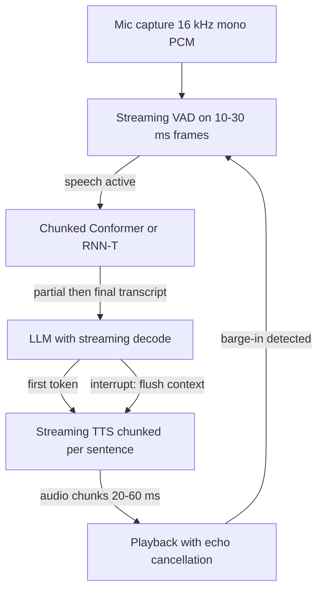
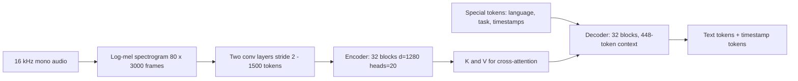
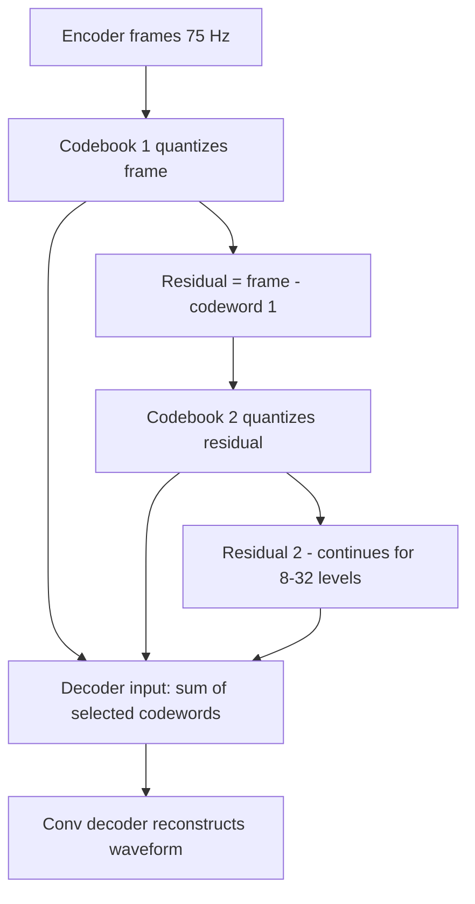

# Audio & Speech Model Architectures

## Overview

Speech is the last modality where latency, not scale, is the binding constraint: a voice agent that takes 2 seconds to reply feels broken even if every word is right. This page covers the architectures that meet that constraint — Whisper's encoder-decoder design and why it is fundamentally non-streaming, chunked Conformer and RNN-T transducers that are, the TTS family from FastSpeech to VALL-E-style codec language models, and the native speech LLMs (GPT-4o Realtime, Moshi) that eliminate the cascade. The task-level survey of audio models, datasets, and usage code lives in [Audio Models](../multimodal/audio.md); this page is the internals and latency-engineering view.

> **Interview Angle**: The canonical question is "design a sub-second voice agent." A strong answer walks the latency budget table below, explains *where* the milliseconds go (VAD, ASR partials, LLM first token, TTS first audio), and lands on the cascade-vs-native trade: three pipelined models sum their latencies, one early-fusion model like GPT-4o or Moshi removes handoffs but costs full-pretraining scale — the same spectrum argument made for images in [Vision-Language Architectures](./vision-language-architectures.md).

## A Streaming Voice-Agent Loop

Every arrow above is a place to shave milliseconds, and each stage is a separate model with its own buffering. The loop is *duplex*: while the agent speaks, the VAD keeps running so the user can interrupt (barge-in), which forces the TTS to stop mid-utterance and the LLM context to be truncated at the interrupt point. Cascade systems handle this with careful session state; native full-duplex models like Moshi learn the behavior instead.

## Whisper: Encoder-Decoder Internals

Whisper (Radford et al., 2022) is weakly-supervised ASR at scale: a standard encoder-decoder Transformer trained on 680,000 hours of audio (about 117,000 hours covering 96 non-English languages), which is why it behaves like a zero-shot-ish transcription system rather than an acoustic model tuned per domain.

### The log-mel frontend and the 30-second window

- **Input**: 16 kHz mono, resampled and padded into fixed **30-second windows**. The STFT uses a 400-sample FFT with 160-sample hop (10 ms), producing 3,000 frames collapsed onto **80 mel bins** (128 bins in large-v3), log-scaled and normalized to zero mean per sample. This frontend is deterministic — Whisper has no learned feature extractor.
- **Encoder stem**: two 1D convolutions with stride 2 halve the sequence 3,000 → 1,500 tokens, each with a learned positional embedding and GELU. At 1,500 tokens × 32 layers, the encoder is a full self-attention transformer over the *entire* 30 s window — global context is the source of Whisper's accuracy, and the reason it cannot stream.
- **Fixed-window consequence**: audio longer than 30 s must be *sliced and re-transcribed* with sliding windows and overlap logic (the `openai/whisper` reference implementation does greedy sequential decoding with a 1-second overlap by default). Each slice pays full encoder cost, and transcription quality at slice boundaries depends on padding heuristics — a real production pain point that streaming ASR architectures exist to remove.

### Special tokens, timestamps, and multilingual control

The decoder vocabulary (51,865) is a byte-level BPE vocabulary extended with control tokens that make Whisper multitask: `<|startoftranscript|>`, a language token for ~100 languages (auto-detected from the first 30 s or forced), a task token (`<|transcribe|>` or `<|translate|>` for X→English), and **timestamp tokens** `<|0.00|>` … `<|30.00|>` at 20 ms granularity. Decoding is standard autoregression over 448 decoder positions, so timestamps are just tokens the model was trained to emit at utterance boundaries. Word-level timestamps go further by applying dynamic-time-warping over the cross-attention heads (the whisperX technique), aligning each emitted token to the encoder frames it attends to.

### Model sizes (architecture dimensions)

| Model | d_model | Layers | Heads | Params | Notes |
|---|---|---|---|---|---|
| tiny | 384 | 4 | 6 | 39 M | edge devices, ~32× realtime on CPU-class |
| base | 512 | 6 | 8 | 74 M | common default for prototyping |
| small | 768 | 12 | 12 | 244 M | ~6× realtime |
| medium | 1024 | 24 | 16 | 769 M | ~2× realtime |
| large-v2/v3 | 1280 | 32 | 20 | 1,550 M | 80 mels (v2), 128 mels (v3) |

All sizes share the 1,500-token encoder context and 448-token decoder context; only width and depth change. The large-v2 checkpoint reaches roughly 1.8% WER on LibriSpeech clean — near the human recording-noise floor — while remaining one model for 99 languages, translation, and language ID.

## Streaming ASR: Chunked Conformer and RNN-T

Whisper's design assumes the full utterance is available. Production voice agents need hypotheses while the user is still talking, which means the encoder must be causal or near-causal and the decoding head must not depend on full-sequence attention.

### Conformer blocks

Conformer (Gulati et al., 2020) is the dominant ASR encoder because it combines the two inductive biases speech needs: **self-attention** for long-range linguistic context and **depthwise-separable convolution** (kernel 31) for local acoustic patterns. Each block is a "macaron" — FFN-half → multi-head self-attention with relative positional encoding → conv module (pointwise → GLU → depthwise conv → BatchNorm → Swish → pointwise) → FFN-half → LayerNorm — with the FFN half-step residual weight of 0.5. Attention models *what* was said over seconds; the conv models *how* it sounds at the 10-100 ms scale, and neither alone matches the combination on benchmarks.

### Chunked attention for streaming

A bidirectional encoder cannot run online. Streaming Conformers use **chunked attention**: the sequence is processed in chunks (e.g., 320 ms) where each chunk attends to its own frames, a bounded left context (e.g., 64 past chunks), and a small right lookahead (0-6 future chunks). Right-context lookahead is the accuracy/latency dial: 640 ms of lookahead recovers most of full-context accuracy while bounding added latency. Emformer-style memory tokens carry compressed past-chunk state forward so context grows without growing compute per chunk.

### Transducer heads: RNN-T vs CTC vs attention

| Head | Mechanism | Streaming | Weakness |
|---|---|---|---|
| CTC | per-frame label + blank, collapse repeats | Yes | conditional independence: no language modeling between labels |
| RNN-T (transducer) | encoder × prediction network (token history) fused in a joint network; marginalizes over all alignments | Yes | joint network is compute-heavy; blank-heavy training |
| Attention encoder-decoder | Whisper-style cross-attention | No (full context) | best accuracy, highest latency |

RNN-T (Graves, 2012) keeps the language-modeling ability CTC lacks — a small prediction network consumes the emitted token history — while remaining emit-when-ready streamable, which is why it powered production systems (Google's on-device ASR, NVIDIA Parakeet/NeMo stacks, Zipformer variants). The loss marginalizes over monotone alignments: \\( \log p(\mathbf{y} \mid \mathbf{x}) = \log \sum_{\mathbf{a}} p(\mathbf{a} \mid \mathbf{x}) \\) over all blank/label paths, computed with a dynamic-programming lattice. The interview-relevant contrast: **Whisper trades streaming for accuracy and simplicity; RNN-T trades a bit of accuracy for emit-as-you-hear decoding.**

## Neural TTS Architectures

TTS converts text to waveform through two sub-problems that modern architectures fuse or factor differently.

### FastSpeech 2: non-autoregressive with explicit prosody

FastSpeech 2 (Ren et al., 2021) generates all mel frames **in parallel**: a phoneme encoder, a variance adaptor that predicts duration, pitch, and energy per phoneme (supervised with forced alignment and wavelet-transformed F0), a length regulator that expands phoneme encodings to frame count, and a transformer decoder producing mel spectrograms for a vocoder (WaveGlow/HiFi-GAN). Removing the autoregressive decoder of Tacotron 2 eliminated attention-misalignment failures and made inference ~50× faster than autoregressive TTS. The cost is external dependency: durations must come from an aligner (MFA or a pre-trained autoregressive teacher), which is why the original FastSpeech needed a two-stage distillation pipeline.

### VITS: end-to-end variational + adversarial

VITS (Kim et al., 2021) fuses text-to-mel and vocoder into one model trained end-to-end: a conditional VAE where a posterior encoder infers latents from real audio during training, a normalizing-flow decoder transforms them into waveforms through a HiFi-GAN generator, an adversarial loss on waveforms, and a **stochastic duration predictor** so prosody varies across runs. At inference the prior (text encoder) replaces the posterior — a single forward pass from phonemes to waveform. VITS remains the strongest open multi-speaker baseline when you need naturalness without a separate vocoder stage.

### Flow-matching TTS and codec LMs

Two recent families matter for interviews:

- **Flow-matching TTS (Voicebox, Meta 2023)**: non-autoregressive mel generation with a **flow-matching objective** (the same math as [Diffusion Transformers](./diffusion-transformers.md): regress the velocity \\( v_\theta(x_t, t) \\approx x_1 - x_0 \\) along a linear interpolation path between noise and mel). One model does zero-shot voice cloning, denoising, editing, and TTS at quality above VITS-class systems, with parallel sampling in ~16 steps.
- **Codec language models (VALL-E, 2023)**: instead of predicting mel frames, predict **audio codec tokens** (EnCodec's RVQ codes). VALL-E does autoregressive generation of the first codebook stream, then non-autoregressive parallel generation of the remaining 7 codebooks, conditioned on a 3-second voice prompt — zero-shot cloning as *in-context learning over audio tokens*. This reframes TTS as language modeling and directly inherits LLM serving tricks (KV cache, speculative decoding) and LLM failure modes (hallucinated audio, repetition loops).

## Neural Audio Codecs: RVQ

Every token-based speech model depends on a neural codec that compresses waveforms into discrete token streams. SoundStream (Zeghidour et al., 2021) and EnCodec (Défossez et al., 2022) share the blueprint: a convolutional encoder downsamples audio to ~50-75 frames/s, a **residual vector quantizer** discretizes each frame into a stack of codebook entries, and a convolutional decoder reconstructs audio, trained with reconstruction plus adversarial losses.

- **The math**: with 8 codebooks × 1024 entries × 75 Hz, each codeword is 10 bits, giving **6 kbps** at near-transparent quality — and a token stream a language model can predict. Quantization is residual because the first codebook carries the coarse spectral envelope and later codebooks add fine detail; dropping trailing codebooks gives graceful bitrate scaling (EnCodec supports 1.5-24 kbps by truncation).
- **Why speech LLMs care**: token rate is the "sequence length" of audio. 75 Hz × 8 codebooks = 600 tokens per second of audio is too many for a dialogue model, so Moshi's Mimi codec compresses to **12.5 Hz** with one semantic codebook distilled from a text-embedding teacher and split acoustic codebooks — about 12.5 tokens/s for the LM, an order of magnitude reduction that makes real-time generation feasible.

## Speech LLMs and Full-Duplex Dialogue

### Cascade vs native

The cascade (ASR → LLM → TTS) is the default because each component is independently good and the text LLM is untouched. Its costs are additive latency (each handoff buffers), loss of paralinguistics (the ASR text throws away emotion, laughter, hesitation that the LLM could have used), and brittle barge-in (each model needs interrupt plumbing). Native speech-to-speech models ingest audio tokens directly and emit audio tokens, removing handoffs.

### GPT-4o Realtime and Moshi

- **GPT-4o Realtime** (OpenAI, 2024) is the productized native model: an early-fusion multimodal transformer consuming text, image, and audio tokens, exposed through a realtime API with speech-to-speech latency of ~232 ms minimum and ~320 ms average on voice conversations — roughly human turn-taking speed. Early fusion is what buys the latency: there is no transcript handoff to pay.
- **Moshi** (Kyutai, 2024, arXiv:2410.00037) is the reference open full-duplex design. It runs **parallel token streams**: the user's audio (Mimi codes), Moshi's own audio, and an "inner monologue" text stream that the model generates *alongside* its speech (text tokens at 12.5 Hz are easier for the LLM to model and stabilize generation). A **RQ-Transformer** handles the token hierarchy — a temporal transformer over timesteps and a small depth transformer over the Mimi codebooks within each timestep. Full duplex means Moshi speaks while listening: overlapping turns, backchannels ("mm-hmm"), and mid-sentence interruption are modeled, not bolted on.

## Latency Budgets for Voice Agents

The numbers that decide whether a voice product feels conversational. Humans perceive gaps over ~1 s as awkward; natural human turn-taking gaps are ~200 ms.

| Stage | Budget | Technique | Notes |
|---|---|---|---|
| Capture + echo cancel | 10-20 ms | AEC at the audio driver | usually fixed hardware cost |
| VAD / endpointing | 20-100 ms | NN VAD on 10-30 ms frames | aggressive end-of-turn detection risks clipping |
| ASR partial → final | 150-400 ms | chunked Conformer / RNN-T, 0-640 ms lookahead | partials stream to the LLM before finalization |
| LLM time-to-first-token | 200-500 ms | streaming decode, prefill overlap, speculative decoding | dominates cascade budget; see [KV Cache](../llm-serving/kv-cache.md) |
| TTS first audio | 100-300 ms | sentence-chunked streaming TTS, incremental vocoder | first sentence starts before full answer exists |
| Barge-in cancel | < 200 ms | client-side ducking or native duplex | cascade needs explicit interrupt protocol |
| **Cascade end-to-end** | **1.0-2.5 s** | pipeline above | feels robotic at the high end |
| **Native speech-to-speech** | **0.3-0.8 s** | GPT-4o Realtime, Moshi-class | no handoff buffers |

## Interview Questions

1. **Why is Whisper architecturally incapable of true streaming, and what do people do about it?**
   Whisper's encoder is a 32-layer bidirectional self-attention stack over a fixed 3,000-frame (30 s) log-mel window, and the decoder cross-attends to *all* encoder positions — the model is defined only when the whole window exists. Longer audio is sliced into 30 s windows and re-transcribed with overlaps, paying full encoder cost per slice and adding boundary heuristics. Workarounds: chunk the audio and accept 1-2 s extra latency; run small models per window; or switch to a genuinely streaming architecture — a chunked Conformer or RNN-T transducer that emits tokens as frames arrive. The trade is accuracy and simplicity (one checkpoint, 99 languages) versus latency.
2. **Compare CTC, RNN-T, and attention encoder-decoder heads for ASR.**
   CTC predicts one label or blank per frame and collapses repeats — perfectly streamable but conditionally independent across labels, so it cannot model inter-token language effects and needs an external LM to compensate. RNN-T adds a prediction network over the emitted token history fused with the encoder in a joint network, marginalizing over monotone alignments; it keeps streaming while restoring language modeling, at the cost of an expensive joint computation — the production default. Attention encoder-decoders (Whisper) cross-attend over the full utterance: highest accuracy, no streaming, and no alignment constraint. Latency requirements select the head, not accuracy alone.
3. **Explain residual vector quantization and why token rate matters for speech language models.**
   RVQ quantizes each encoder frame with a first codebook, computes the residual, quantizes that with a second codebook, and iterates over 8-32 levels — coarse-to-fine discretization where trailing codebooks can be dropped for lower bitrate. EnCodec at 24 kHz yields 75 frames/s × 8 codebooks × 10 bits = 6 kbps. For a speech LLM, the token stream *is* the sequence: 600 audio tokens per second would blow any context and KV budget, so models like Moshi use the 12.5 Hz Mimi codec and hierarchical decoding (temporal transformer over frames, depth transformer over codebooks) to make real-time generation tractable. Token rate is audio's sequence-length economics.
4. **Design a voice agent with sub-second perceived latency. Which numbers do you budget, and where do you cheat?**
   Budget: VAD decision 20-100 ms; ASR partial transcripts streaming from ~150 ms with a chunked transducer; LLM time-to-first-token 200-500 ms (prefill overlap, small fast model, streaming); TTS first-audio 100-300 ms by starting synthesis on the first complete sentence rather than the whole reply — total ~0.5-1.0 s. Where you cheat: speak a fill-in ("let me check...") while the real answer generates; send partial ASR to the LLM before endpointing; prefetch the TTS vocoder; use barge-in so the user's interrupt costs nothing. If the target is < 500 ms reliably, the cascade's summed handoffs stop fitting and native speech-to-speech (GPT-4o Realtime ~320 ms average, Moshi-class) becomes the architecture.
5. **What does full-duplex mean in Moshi, and what architectural pieces enable it?**
   Full duplex means the model listens and speaks simultaneously with overlapping, interruptible turns — not the walkie-talkie half-duplex of cascades. Enablers: Mimi's 12.5 Hz codec tokenizing both user and model audio into parallel streams; an inner-monologue text stream generated alongside audio (text is easier to model and grounds the acoustics); and the RQ-Transformer decomposing the huge joint token space into a temporal transformer plus per-frame depth transformer over codebooks. Training data pairs natural conversations with aligned transcriptions so the model learns backchannels and interruption semantics. The cascade alternative must implement interruption as explicit session-state surgery across three models.
6. **Why did TTS move from mel-spectrogram pipelines to codec-token language models?**
   Mel pipelines (FastSpeech 2 → vocoder) factor duration/prosody prediction from waveform synthesis and are fast and stable, but each stage is trained separately and prosody control is indirect. Codec LMs (VALL-E) generate EnCodec RVQ tokens autoregressively (first codebook) then in parallel (rest), conditioned on a 3-second prompt — zero-shot cloning becomes in-context learning, and the entire LLM toolchain (KV cache, sampling controls, serving stacks) transfers. Flow-matching TTS (Voicebox) is the third path: parallel, iterative mel generation with a velocity-regression objective, giving VITS-beating quality without autoregression. The codec-LM route wins on promptability; flow matching wins on parallelism and stability.

## Key Takeaways

- Whisper = 80-mel log frontend → conv stem (3,000 → 1,500 tokens) → 32-layer bidirectional encoder → 32-layer decoder with language/task/timestamp special tokens; fixed 30 s windows make it non-streaming by construction.
- Streaming ASR = chunked attention in the Conformer encoder (bounded left context + small right lookahead) + a transducer head (RNN-T) that emits when frames arrive; CTC trades language modeling for simplicity.
- TTS evolution: Tacotron 2 (autoregressive mel) → FastSpeech 2 (parallel, explicit duration/pitch/energy) → VITS (end-to-end VAE + adversarial) → Voicebox (flow matching) and VALL-E (codec-token LM, zero-shot cloning).
- Neural codecs (SoundStream, EnCodec) compress audio via conv encoder + residual VQ: 8 codebooks × 10 bits × 75 Hz = 6 kbps, and token rate (75 → 12.5 Hz for Mimi) is the binding constraint for speech LLMs.
- Native speech LLMs (GPT-4o Realtime ~320 ms average voice-to-voice; Moshi with inner monologue + RQ-Transformer) remove cascade handoffs and model full-duplex turn-taking natively.
- Voice-agent latency is a budget across VAD (20-100 ms), ASR partials (150-400 ms), LLM TTFT (200-500 ms), TTS first audio (100-300 ms); cascades sum to 1.0-2.5 s, natives fit 0.3-0.8 s.
- Barge-in and interrupt handling are architecture properties: cascades bolt them on across three models; full-duplex models learn them from data.

## References

- Radford et al., "[Robust Speech Recognition via Large-Scale Weak Supervision](https://arxiv.org/abs/2212.04356)" (ICML 2023) — Whisper; 680k training hours, architecture dims, WER tables.
- OpenAI Whisper repository: [github.com/openai/whisper](https://github.com/openai/whisper) — reference implementation, window slicing, timestamp decoding.
- Gulati et al., "[Conformer: Convolution-augmented Transformer for Speech Recognition](https://arxiv.org/abs/2005.08100)" (ICLR 2021) — macaron blocks, depthwise conv k=31, relative positions.
- Graves, "[Sequence Transduction with Recurrent Neural Networks](https://arxiv.org/abs/1211.3711)" (2012) — the RNN-T transducer loss.
- Ren et al., "[FastSpeech 2: Fast and High-Quality End-to-End Text to Speech](https://arxiv.org/abs/2006.04558)" (2021) — variance adaptor, non-autoregressive mel decoding.
- Kim et al., "[Conditional Variational Autoencoder with Adversarial Learning for End-to-End Text-to-Speech](https://arxiv.org/abs/2106.06103)" (ICML 2021) — VITS.
- Wang et al., "[Neural Codec Language Models are Zero-Shot Text to Speech Synthesizers](https://arxiv.org/abs/2301.02111)" (2023) — VALL-E.
- Le et al., "[Voicebox: Text-Guided Multitask Speech Generation at Scale](https://arxiv.org/abs/2306.15687)" (2023) — flow-matching TTS.
- Zeghidour et al., "[SoundStream: An End-to-End Neural Audio Codec](https://arxiv.org/abs/2107.03312)" (2021).
- Défossez et al., "[High Fidelity Neural Audio Compression](https://arxiv.org/abs/2210.13438)" (2022) — EnCodec, RVQ rates.
- Défossez et al., "[Moshi: a speech-text foundation model for real-time dialogue](https://arxiv.org/abs/2410.00037)" (2024) — full duplex, Mimi, RQ-Transformer.
- OpenAI, GPT-4o announcement (2024): [openai.com/index/hello-gpt-4o/](https://openai.com/index/hello-gpt-4o/) — 232/320 ms voice-to-voice figures; Realtime API docs: [platform.openai.com/docs/guides/realtime](https://platform.openai.com/docs/guides/realtime).

## Cross-References

- [Audio Models (task survey)](../multimodal/audio.md) — datasets, model zoo, and usage-level code complementing this architecture view
- [Vision-Language Architectures](./vision-language-architectures.md) — the same cascade-vs-early-fusion spectrum for images
- [Diffusion Transformers](./diffusion-transformers.md) — flow-matching math shared with Voicebox-class TTS
- [KV Cache](../llm-serving/kv-cache.md) — why LLM time-to-first-token dominates the cascade budget
- [Batching](../llm-serving/batching.md) — serving economics for the LLM stage of a voice agent
- [CLIP](../vision/clip.md) — the contrastive-encoder pattern behind audio-text models like CLAP
