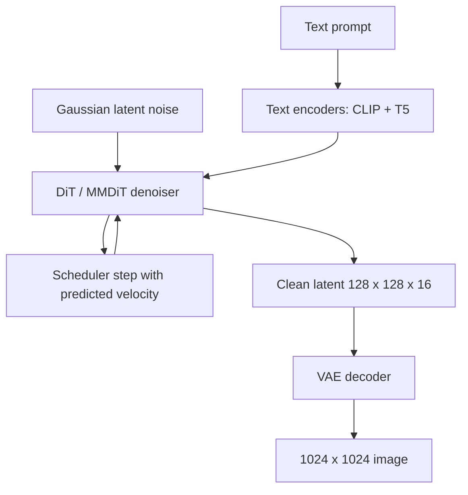

# Diffusion Transformers & Flow Matching

## Overview

For a decade the UNet was the default denoiser; DiT (Diffusion Transformer, Peebles & Xie 2022) replaced it with a plain transformer over patch tokens and, combined with the flow-matching objective, became the backbone of Stable Diffusion 3, Flux, and Sora. This page is the architecture-internals view: patchification, adaLN-zero conditioning, the conditional flow matching objective, sampling schedules, and the serving/distillation economics that decide whether image generation costs 50 model calls or 4. The DDPM/latent-diffusion primer and classic sampler code live in [Diffusion Models](../vision/diffusion.md) — read that first if the ε-prediction loss is unfamiliar; this page builds directly on it.

> **Interview Angle**: The sharp questions are comparative: "why did the field swap UNet for transformer?" (predictable scaling, flexible conditioning, video-ready token streams), "derive the flow matching loss" (it is the rectified-flow velocity regression, and it reduces to the ε-MSE you already know), and "how do you serve a DiT at interactive latency?" (fewer steps via solvers and distillation, not smaller networks). Video generation is the scaling-law punchline: spacetime patches turn a video into exactly the token stream a transformer wants.

## From DDPM to Latent Diffusion

Recap of the setup (full derivation in [Diffusion Models](../vision/diffusion.md)): a forward process corrupts data \\( x_0 \\) toward Gaussian noise over \\( T \\) steps with the closed form \\( x_t = \sqrt{\bar\alpha_t}\,x_0 + \sqrt{1-\bar\alpha_t}\,\epsilon \\), and a network learns to predict the noise \\( \epsilon \\) with an MSE loss, then samples by reversing the chain. Two structural facts set up everything on this page. First, pixel space is wasteful: a 512×512×3 image lives in a 786K-dimensional space where most dimensions encode imperceptible detail. Second, the denoiser is called 20-1000 times per image, so its per-call cost is multiplied by step count — the economics that motivate both latent space and few-step solvers.

Latent diffusion (Rombach et al., 2022) factors the problem: a **VAE** with a downsampling factor of 8 compresses pixels into latents (512×512×3 → 64×64×4, ~48× fewer dimensions), and diffusion runs entirely there; the frozen VAE decoder reconstructs pixels at the end. SD3 pushed the idea further with a **16-channel** VAE (128×128×16 for 1024×1024 images) — fewer spatial positions, more channels, better at rendering text and fine detail.

## DiT: The Transformer Replaces the UNet

DiT (Peebles & Xie, 2022) applied the ViT recipe to diffusion on ImageNet class-conditional generation. The design has three moves:

1. **Patchify**: the noisy latent (e.g., 32×32×4) is cut into patches (patch size 2 → 256 tokens... in DiT's ImageNet setup, latent 32×32 with p=2 gives 256 tokens; p=4 gives 64) and linearly embedded, exactly like ViT patches pixels. Positional information enters as standard 2D sinusoidal embeddings; timestep as a sinusoidal vector added to conditioning.
2. **Condition via adaLN-zero**: instead of cross-attention to class/text embeddings, the conditioning vector regresses **scale, shift, and gate parameters** for every LayerNorm and residual branch in each block. The "-zero" variant initializes the gate to zero so every block is the identity at init — the same "start as identity" stability trick as Flamingo's gated cross-attention in [Vision-Language Architectures](./vision-language-architectures.md). A final adaLN block + linear head predicts noise (or velocity).
3. **Scale cleanly**: DiT-B/L/XL (130M/450M/675M) × patch 8/4/2 sweep showed FID decreasing monotonically with model GFLops — transformer scaling laws applied to diffusion. DiT-XL/2 (675M) reached FID 2.27 on ImageNet 256×256, beating every UNet-class adversarial or likelihood model trained on the same budget.

Why the transformer wins as a *base architecture*: global attention over patch tokens (no hand-designed UNet down/up path to tune), parameter count and FLOPs map directly to quality, arbitrary token streams (text tokens, class tokens, video spacetime patches) fit the same interface, and the entire LLM systems stack — fused kernels, sequence parallelism, quantization — transfers. The UNet's convolutional bias helps at small scale but its growth curve saturates: UNet FID improvements taper while DiT's track GFLops across two orders of magnitude.

| Axis | UNet (SD 1.5 / SDXL) | DiT (patch transformer) |
|---|---|---|
| Spatial mixing | conv down/up blocks + mid-block attention | global self-attention over all patch tokens |
| Conditioning | cross-attention (+ concat channels) | adaLN-zero modulation or in-context tokens |
| Scaling | saturates; architecture redesign needed | predictable: FID tracks GFLops |
| Token count (SDXL 1024px, f8) | attention only at some scales | 16K patch tokens every layer |
| Reference params | SD 1.5 UNet ~860M | DiT-XL/2 675M; Flux 12B |

## Flow Matching and Rectified Flow

Diffusion with ε-prediction works, but its reverse trajectories are curved and its schedules are a tuning surface. **Flow matching** (Lipman et al., 2022) reformulates generation as learning a velocity field that transports a simple distribution to the data distribution along *chosen* probability paths — and **rectified flow** (Liu et al., 2022) chooses the straightest possible paths: interpolate linearly between noise and data.

Define \\( x_t = (1-t)\,x_0 + t\,x_1 \\) where \\( x_0 \sim q \\) is data (or noise — convention varies; SD3 uses \\( t=0 \\) noise, \\( t=1 \\) data), \\( x_1 \sim \mathcal{N}(0, I) \\), and \\( t \sim U[0,1] \\). The conditional flow matching objective regresses the endpoint difference:

\\[ \mathcal{L}_{\mathrm{CFM}}(\theta) \;=\; \mathbb{E}_{t,\; x_0,\; x_1}\; \big\| v_\theta(x_t,\, t) - (x_1 - x_0) \big\|^2 \\]

Three properties make this the industry default:

- **Simulation-free**: no ODE solving during training — sample a triple \\( (t, x_0, x_1) \\), interpolate, regress. Same training cost as DDPM's ε-MSE.
- **It is the same loss in disguise**: with this parameterization, \\( v_\theta = (x_1 - x_0) \\) is linearly related to the ε-prediction target, so flow matching inherits diffusion's known training behavior while using an ODE (not SDE) sampler at inference.
- **Straight paths compress the step count**: linear interpolation means the exact ODE solution is a straight line for independent Gaussian-data pairs, so few Euler steps (8-16) land close to the data distribution — and the *reflow* procedure (retrain on pairs generated by the model itself) straightens paths further toward 1-2-step sampling.

Intuition for interviews: ε-prediction learns "what noise was mixed in"; velocity prediction learns "which direction and speed to move *right now* to reach data." The second framing makes timestep schedules and distillation substantially easier to reason about, which is why SD3's authors cite simulation-free training, straight paths, and reflow as the reason rectified flow beat their own diffusion and EDM baselines.

## SD3, Flux, Sora

- **Stable Diffusion 3** (Esser et al., 2024): rectified flow + **MMDiT** — a two-stream transformer where text tokens and image patch tokens keep *separate* weights (separate QKV projections) and join only at attention, because the two modalities need different capacity (text embeddings are information-dense; patches are redundant). Improvements over vanilla DiT: logit-normal timestep sampling (weight the middle timesteps where rectified-flow loss is hardest), QK-norm for stability at 8B scale, and the 16-channel VAE. Sizes: 2B and 8B MMDiT.
- **Flux** (Black Forest Labs, 2024): 12B rectified-flow transformer with rotary positional embeddings ([Position Encoding](../advanced/position-encoding.md)), double-stream blocks (MMDiT-style parallel streams) transitioning into single-stream blocks (shared weights — compute-efficient late-stage fusion), and **guidance distillation** so the guidance scale is a model input rather than a doubled batch. Flux [schnell] ships as a 4-step Apache-2.0 model.
- **Sora** (OpenAI, 2024): the video proof. A video compression network (a VAE over space *and* time) turns clips into latents, which are cut into **spacetime patches** — the same patchify move, one dimension larger — and a DiT is trained on variable durations, resolutions, and aspect ratios by packing different token grids in one batch. The technical report attributes emergent capabilities (persistent objects, camera motion, 3D consistency) to compute scaling on this representation; no FLOPs table was published, but the pattern — quality jumps with transformer scale — is the DiT result restated for video.

## Sampling Schedules

The denoiser is a fixed-point function; the solver decides how many times you call it. Cost is measured in NFEs (network function evaluations) = steps × (2 if naive classifier-free guidance, since conditional and unconditional passes are batched).

| Solver | Typical steps | Deterministic | Order | Notes |
|---|---|---|---|---|
| DDPM (ancestral) | 1000 | No | 1st (SDE) | reference quality, reference slowness |
| DDIM | 20-50 | η=0 yes | 1st (ODE) | SD 1.5 default; deterministic edits |
| Euler | 8-25 | configurable | 1st (ODE) | the flow-matching default (Flux, SD3) |
| Heun | 20-30 | yes | 2nd | 2 NFEs per step; better curvature handling |
| DPM-Solver++ | 10-20 | yes | multistep | SDXL standard; analytic exponential integrator |
| UniPC | 5-15 | yes | predictor-corrector | aggressive step reduction |
| LCM / Turbo / distilled | 1-4 | yes | distilled | real-time UIs; quality ceiling slightly lower |

Practical reading of the table: training objective and solver interact — rectified-flow models are designed for plain Euler with few steps, while ε-predicting UNets rely on higher-order multistep solvers to reach 20-30 steps. Distillation (next section) is now the dominant way to buy latency rather than exotic solvers.

## Serving Diffusion Transformers

Diffusion serving differs from LLM serving in one decisive way: **there is no KV cache to reuse across steps** — every step recomputes attention over all patch tokens with a new \\( x_t \\), so the "state" you amortize is the batch, not the cache.

- **NFE arithmetic dominates latency**: a 50-step SDXL generation with CFG is 100 UNet calls; a 4-step distilled Flux schnell with embedded guidance is 4 DiT calls. Step count and CFG elimination are worth more than kernel optimizations — usually by an order of magnitude.
- **Batching is throughput-fatal, latency-friendly**: unlike LLM decode (memory-bound), denoiser steps are compute-bound matmuls, so batching 8-16 concurrent requests raises GPU utilization nearly linearly. Interactive endpoints run batch 1-2 with few-step models; bulk pipelines (stock image gen, video rendering farms) batch aggressively. [Inference Systems](../advanced/inference-systems.md) covers the scheduling machinery.
- **Distillation is the step-count lever**: Latent Consistency Models (Luo et al., 2023) learn to map any noise level directly to \\( x_0 \\) in 1-4 steps; Adversarial Diffusion Distillation (Sauer et al., 2023, the "Turbo" recipe) adds a discriminator so 1-4 steps land in the teacher's quality band; Flux applies guidance distillation so the model never needs the unconditional pass. Quality tax exists — 1-step models lose texture diversity — but 4 steps is usually visually indistinguishable.
- **Memory and kernels**: 16K patch tokens at 1024px make attention quadratic cost the headline (SD3 8B: ~16K tokens × 8B params); FlashAttention and sequence/circle parallelism ([Flash Attention](../advanced/flash-attention.md)) are load-bearing. Quantization to FP8/int8 for the DiT and offloading the T5-XXL text encoder (4.7B params, idle after conditioning precompute) are standard.
- **Precompute conditioning**: text encodings are deterministic per prompt — cache them ([Prompt Caching](../prompting/prompt-caching.md) pattern applied to diffusion); image-to-image reuses VAE encodings the same way.

## The Moat: Why Video Generation Needs DiT Scaling

Video multiplies the token budget by time: 1080p × 24 fps × 1 min at f8 patching is on the order of hundreds of thousands of spacetime tokens per clip — attention over that is exactly the workload a transformer scaling story addresses and a conv stack drowns in. Three structural reasons DiT is the moat:

1. **Token streams are uniform**: spacetime patches turn variable-duration, variable-resolution video into variable-length token sequences; one architecture, one training loop, one packing scheme. The UNet's fixed multi-scale pyramid fights variable shape; DiT absorbs it (Sora's variable-aspect-ratio training is only natural in patch space).
2. **Scaling laws are the product**: the DiT FID-vs-GFLOPs curve showed quality tracking compute predictably; Sora's report claims the same monotonic relationship for video fidelity. Predictability is what justifies billion-dollar training runs — you can extrapolate quality before you spend.
3. **Data and systems transfer**: interleaved text/image/video token streams (the [early-fusion](./vision-language-architectures.md) recipe) let a single model learn shared physics across modalities, and every LLM systems investment — attention kernels, expert parallelism, checkpoint sharding — applies unchanged.

The honest caveats an interviewer will push on: tokenizer/VAE quality caps detail (the 16-channel VAE is doing quiet heavy lifting), physical consistency remains data-limited more than architecture-limited, and inference cost per video keeps sampling speed research (few-step + sparse attention) economically essential.

## Interview Questions

1. **State the conditional flow matching objective and relate it to DDPM's ε-MSE.**
   Sample \\( t \sim U[0,1] \\), data \\( x_0 \\), noise \\( x_1 \\); form the linear interpolation \\( x_t = (1-t)x_0 + t x_1 \\); regress \\( v_\theta(x_t, t) \\) toward the constant velocity \\( (x_1 - x_0) \\) with an MSE loss. Because \\( x_t \\) is an affine function of \\( x_0 \\) and \\( x_1 \\), the velocity target is a linear reparameterization of the ε-target used by DDPM — the two losses train the same function family with different parameterizations. The advantage is conceptual and practical: the velocity view gives straight probability paths, an ODE sampler, and Euler sampling that works well at 8-16 steps, while ε-prediction's curved paths needed 20-50 DDIM steps or higher-order solvers for comparable quality.
2. **What is adaLN-zero and why did DiT prefer it over cross-attention conditioning?**
   adaLN-zero replaces every LayerNorm in the transformer with an adaptive one whose scale and shift — plus a gate on each residual branch — are regressed from the conditioning embedding (timestep + class or pooled text). Zero-initializing the gates makes each block an exact identity at initialization, so training starts from a stable function and conditioning influence grows only as gradients justify it. DiT's ablations found adaLN-zero clearly beat both in-context conditioning (appending the embedding as a token) and cross-attention on FID, at negligible parameter cost, because modulation injects global conditioning into *every* layer without spending attention capacity on it. Token-level text conditioning in SD3 returns to attention — but keeps adaLN-style timestep modulation.
3. **Why does SD3 use a two-stream (MMDiT) block instead of one shared transformer?**
   Text tokens and image patches have wildly different redundancy and information density; sharing all weights forces one capacity profile on both, and DiT-style in-context conditioning underweights the text path. MMDiT gives each modality its own QKV/MLP weights and joins them only in the attention operation, so image tokens attend to text tokens with full bidirectional interaction while each stream keeps specialized parameters. Ablations in the SD3 paper show the two-stream design improving text-following (typography, layout) over DiT-style in-context conditioning at equal parameter count. Later in the network, designs like Flux collapse into single-stream blocks once representations are aligned — trading some specialization back for compute efficiency.
4. **How would you get a 50-step diffusion model to interactive latency? Give the ordered levers.**
   Order by impact per engineering dollar: (1) switch to a rectified-flow model with Euler sampling at 8-16 steps; (2) apply step distillation — LCM or adversarial distillation (Turbo) — to reach 2-4 steps, typically an order-of-magnitude NFE cut with modest quality tax; (3) eliminate CFG passes via guidance distillation (Flux-style embedded guidance), halving NFEs; (4) precompute and cache text-encoder outputs and reuse VAE latents for img2img; (5) only then micro-optimize kernels: FlashAttention, torch.compile, FP8, sequence parallelism. Solvers and distillation attack the multiplier (steps × CFG), which is larger than any single-kernel win.
5. **Why is video generation a "DiT scaling" story rather than a better-UNet story?**
   Video's defining problem is token count: minutes of footage at pixel or even latent resolution explode the sequence, and spacetime patchification converts arbitrary-duration/resolution clips into variable-length token streams — the input format transformers scale on and conv pyramids don't. DiT established that FID tracks transformer GFLOPs monotonically, which turns generation quality into a predictable function of compute; Sora's report claims the same monotonic compute-quality relationship for video, which is what makes the training investment rational. Additionally, uniform tokens let one model train across images and video (early fusion), sharing physical priors. The UNet path has no comparable, predictable scaling law — that predictability, not raw quality, is the moat.
6. **Where does a diffusion model "spend" compute at inference, and how does that shape serving architecture?**
   All spend is repeated full-network evaluations: steps × (1 or 2 for CFG) forward passes over every patch token, with no KV cache reuse across steps because \\( x_t \\) changes each call. Consequences: batching raises throughput almost linearly (compute-bound), so interactive services run tiny batches with distilled few-step models while bulk pipelines batch 8-16; conditioning precompute (T5/CLIP encodings) is cached because it is per-prompt deterministic; and cost scales with steps × tokens², making attention efficiency and token count (VAE downsampling factor, patch size) first-order economic knobs rather than details.

## Key Takeaways

- Latent diffusion = frozen VAE (f8, or 16-channel in SD3) + a denoiser in compressed space; the latent space, not the sampler, is the biggest single cost reduction (48× fewer dimensions at 512px).
- DiT replaces the UNet with a ViT over patch tokens; conditioning via adaLN-zero (scale/shift/gate regressed from conditioning, zero-init gates) beat cross-attention and in-context conditioning on ImageNet FID.
- DiT-XL/2 (675M) reached FID 2.27 on ImageNet 256; its headline result is monotonic quality-vs-GFLOPs scaling — the property that justified scaling diffusion to billions of parameters.
- Flow matching / rectified flow: \\( \mathcal{L} = \|v_\theta(x_t,t) - (x_1 - x_0)\|^2 \\) on linear interpolation paths — same training economics as DDPM, straight ODE paths, 8-16 step Euler sampling, reflow for further step reduction.
- SD3 = rectified flow + MMDiT (separate text/image weights joined at attention) + logit-normal timestep sampling + QK-norm; Flux = 12B, RoPE, double→single-stream, guidance distillation, 4-step schnell; Sora = spacetime patches over a video VAE, variable-resolution DiT training.
- Serving math: NFEs = steps × CFG passes; no KV cache across steps; distillation (LCM, ADD/Turbo) buys the order-of-magnitude latency, batching buys throughput.
- Video is where DiT scaling pays: spacetime patches give uniform token streams with predictable quality-vs-compute, the same pattern as LLM scaling laws.

## References

- Ho, Jain, Abbeel, "[Denoising Diffusion Probabilistic Models](https://arxiv.org/abs/2006.11239)" (NeurIPS 2020) — DDPM.
- Rombach et al., "[High-Resolution Image Synthesis with Latent Diffusion Models](https://arxiv.org/abs/2112.10752)" (CVPR 2022) — latent diffusion / Stable Diffusion.
- Peebles & Xie, "[Scalable Diffusion Models with Transformers](https://arxiv.org/abs/2212.09748)" (ICCV 2023) — DiT, adaLN-zero.
- Lipman et al., "[Flow Matching for Generative Modeling](https://arxiv.org/abs/2210.02747)" (ICLR 2023).
- Liu, Gong, Liu, "[Rectified Flow: A Bridge Between Non-Autoregressive Generative Models and Optimal Transport](https://arxiv.org/abs/2209.03003)" (ICLR 2023).
- Esser et al., "[Scaling Rectified Flow Transformers for High-Resolution Image Synthesis](https://arxiv.org/abs/2403.03206)" (2024) — Stable Diffusion 3, MMDiT.
- Song, Meng, Ermon, "[Denoising Diffusion Implicit Models](https://arxiv.org/abs/2010.02502)" (ICLR 2021) — DDIM.
- Ho & Salimans, "[Classifier-Free Diffusion Guidance](https://arxiv.org/abs/2207.12598)" (2021).
- Lu et al., "[DPM-Solver: A Fast ODE Solver for Diffusion Probabilistic Model Sampling](https://arxiv.org/abs/2206.00927)" (NeurIPS 2022).
- Luo et al., "[Latent Consistency Models: Synthesizing High-Resolution Images with Few-Step Inference](https://arxiv.org/abs/2310.04378)" (2023).
- Sauer et al., "[Adversarial Diffusion Distillation](https://arxiv.org/abs/2311.17013)" (2023) — the SDXL Turbo recipe.
- Black Forest Labs, Flux repository: [github.com/black-forest-labs/flux](https://github.com/black-forest-labs/flux).
- OpenAI, "Video generation models as world simulators" (technical report, 2024) — Sora, spacetime patches (no stable URL; search the title).
- Hugging Face Diffusers documentation: [huggingface.co/docs/diffusers/index](https://huggingface.co/docs/diffusers/index) — schedulers and pipeline implementations.

## Cross-References

- [Diffusion Models](../vision/diffusion.md) — DDPM math, UNet structure, and sampler code this page builds on
- [Vision-Language Architectures](./vision-language-architectures.md) — early-fusion token streams that video DiTs share; gated-zero-init trick paralleled by adaLN-zero
- [ViT](../../ml/transformers/vit.md) — patchification origin inherited by DiT
- [Position Encoding](../advanced/position-encoding.md) — RoPE as used by Flux for patch positions
- [Flash Attention](../advanced/flash-attention.md) — the kernel behind 16K-token patch attention
- [Inference Systems](../advanced/inference-systems.md) — batching and scheduling for compute-bound generation workloads
