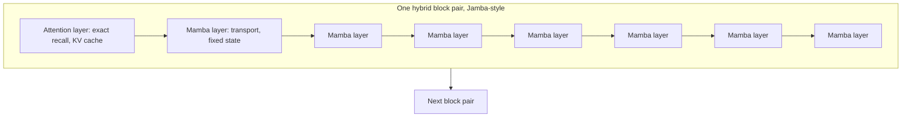

# Hybrid Architectures (Jamba, Griffin/Hawk, Zamba, Samba)

## Overview

Hybrid architectures interleave full-attention layers with fixed-state sequence mixers (SSMs, gated linear recurrences) — and increasingly with MoE FFNs — to get attention's exact recall where it matters and O(N)/constant-state efficiency everywhere else. Between late 2023 and 2025 this stopped being a research curiosity: AI21 shipped Jamba (Mamba + attention + MoE), DeepMind shipped Griffin/Hawk and then RecurrentGemma, NVIDIA shipped Samba and Hymba, Zyphra shipped Zamba, and Google's Gemma 3 adopted a local:global attention ratio — the same design pattern without any SSM at all. The consistent finding: at matched quality, hybrids deliver substantially smaller KV caches and higher long-context throughput than dense transformers.

> **Interview Angle**: The question behind the question is "how many attention layers would you keep and why?" Have the 1:7 to 1:9 attention:mixer ratios, the KV-cache arithmetic, and the "attention as precision layer, SSM as bandwidth layer" framing ready.

## Why Hybrids Win: The Two-Regime Argument

Attention and SSM/linear layers fail in complementary places:

- **Attention** keeps lossless, unbounded state (KV cache): perfect associative recall, but memory and decode bandwidth grow linearly with context, and prefill is quadratic.
- **SSM/linear layers** keep compressed, fixed-size state: O(N) prefill, constant decode cost — but recall fidelity is bounded by state capacity.

The hybrid bet: a minority of attention layers restores exact long-range recall (the *routing* function — "which past token matters?"), while the SSM majority does the heavy *moving* of information across long spans (the *transport* function). Because attention layers can "see" anything the SSM body has transported to the residual stream, you do not need attention at every depth.

### The KV-cache arithmetic (the number to memorize)

KV cache bytes per token = \\( 2 \times L_{attn} \times n_{kv} \times d_h \times \mathrm{bytes} \\). Only attention layers contribute. If 1 of every 8 layers is attention, the cache is 8× smaller than an all-attention model at the same width — at 128K context that is the difference between a 40 GB and a 5 GB cache for a 7B-class model, which is what makes long-context batching economically viable. Decode memory bandwidth per token drops proportionally, so throughput rises even before any SSM-kernel advantage.

## Jamba: Mamba + Attention + MoE

Jamba (AI21 Labs, 2024) is the flagship proof of composition: a hybrid of **Mamba blocks, attention blocks, and MoE FFNs** in one transformer-shaped stack. Public details from the paper:

- **Layout**: 1 attention layer per 8 total "throughput" layers (ratio 1:7 attention:Mamba), with attention every 4-8 layers across the depth; SwiGLU MoE FFN with 16 experts, top-2 routing, applied to some layers (every 2nd block in the released 52B model).
- **Sizes**: Jamba-1.5 family totals ~52B params with ~9B/12B active (MoE); long-context versions target 256K context.
- **Serving profile**: 3× throughput on 128K contexts vs a Mixtral-8x7B-class baseline and dramatically smaller KV cache (paper reports fitting 140K context on a single 80 GB GPU with the 9B-active variant); 69% smaller KV cache at 128K vs Mixtral-class attention-only layers.
- **Quality**: matches or beats Mixtral-class and Llama-2-70B-class models on standard benchmarks at equal active-parameter budgets; attention layers use RoPE (so long-context recipes apply to the sparse attention subset only).

Jamba's most quotable lesson: MoE and SSM-hybridization are *orthogonal* — MoE cuts FLOPs per token, the Mamba body cuts state per token, and the two stack multiplicatively in serving economics.

## Griffin and Hawk: Gated Linear Recurrence + Local Attention

Griffin/Hawk (De et al., DeepMind, 2024) take the hybrid route with **RG-LRU** (Real-Gated Linear Recurrence Unit) instead of Mamba:

- **RG-LRU**: a linear recurrence \\( s_t = a_t s_{t-1} + x_t \\) where both the gate \\( a_t \\) and input are gated by \\( \sigma(\cdot) \\) activations, \\( a_t = a\,\sigma(\Lambda_t x_t)^{1/Q} \\) with per-parameter forget factor — input-dependent, stability-preserving gating.
- **Mixer layout (Griffin-7B/14B)**: each block is **one local attention layer (window 1024)** followed by **four RG-LRU layers** — a 1:4 ratio, with the attention deliberately *local-window* rather than global.
- **Hawk** is the pure-recurrence variant (all RG-LRU); **RecurrentGemma** (2024) is the open-weights Griffin-class release (2B/9B), reporting Griffin-2B matching a strong Llama-2-style 2B transformer at similar quality with up to ~3× less peak memory and larger effective batch on long contexts.
- The paper's scaling claim: Griffin/Hawk hold the transformer's scaling curve (trained 141M→14B, Chinchilla-style) while halving training FLOPs-per-token cost growth vs quadratic attention at long lengths.

Griffin's design point matters conceptually: the attention layers do **not** need to be global. Local windows handle the high-frequency, adjacent-token interactions; the recurrence layers transport the global state. That is why Gemma 3's local:global 5:1 attention ratio (no SSM at all) delivers much of the same KV savings — the ratio of precise layers is the load-bearing decision.

## Zamba and Samba: Two More Points in Design Space

**Zamba (Zyphra, 2024)** — a 7B Mamba-hybrid with an unusual twist: instead of one attention layer per group, it uses a **single shared attention block** referenced at multiple depths (Mamba layers, then a shared attention module with per-position LoRA-like conditioning). Rationale: attention parameters are expensive and low-bandwidth; sharing one attention block cuts parameters while preserving periodic exact-recall access. Zamba2 (2024) refined the interleaving (2 shared attention blocks, alternating Mamba-2 and attention).

**Samba (Microsoft, 2024)** — a 4-layer motif repeated through the stack: **SWA (sliding window 2048) → Mamba-1 → SWA → attention**. The sliding windows give fine-grained recency verbatim (free recall within 2K), Mamba layers carry the global compressed gist, and the sparse full-attention layers do exact global routing. Trained to 3.8B tokens scale 1.5B-3.8B params, Samba matches or exceeds Llama-3/Phi-3-class quality while reporting *infinite-context* extrapolation behavior: near-perfect perplexity continuation to 1M tokens on PG19-style data and strong throughput vs full-attention baselines.

### Model comparison table

| Model | Institution | Non-attention mixer | Attention ratio / pattern | MoE | Reported numbers |
|---|---|---|---|---|---|
| Jamba (1.5) | AI21 | Mamba (1:7 vs attention) | RoPE global, 1-in-8 | Yes (16 experts, top-2; 52B/9B active) | 3× throughput vs Mixtral at 128K; 69% smaller KV |
| Griffin / RecurrentGemma | DeepMind | RG-LRU (4 per block) | Local window 1024, 1-in-5 | No | Matches transformer scaling; ~2-3× less memory at 8K+ |
| Zamba / Zamba2 | Zyphra | Mamba-1 / Mamba-2 | Single shared attention block(s), 7B | No | 7B quality near same-size dense; params cut via shared attention |
| Samba | Microsoft | Mamba-1 | SWA + full attention motif (SWA→Mamba→SWA→Attn) | No | 1M-token perplexity continuation; beats Llama-3 8B per-param on long ranges |
| Hymba | NVIDIA | SSM heads fused *inside* attention heads | Full + SWA (meta tokens) | No | 1.5B-class; reports beating larger 7B models on some suites |
| Gemma 3 | Google | None (pure attention) | Local:global 5:1 | No | Hybrid pattern *without* SSM; KV cache cut ~3-6× vs all-global |
| MiniMax-01 | MiniMax | Lightning attention (linear) in most layers, softmax ~1-in-8 | Global | Yes (456B total/45.9B active) | Up to 1M-context training; linear-attention body at production scale |

## Interleaving Ratios: What Works

Across these papers the ratio cluster is tight:

- **Jamba / MiniMax-01 / Mamba-hybrids in NVIDIA's study**: 1 attention layer in ~8 (12.5%).
- **Griffin**: 1 in 5 (20%), but local-window.
- **Gemma 3 (attention-only hybrid)**: 1 global in 6 (≈17%).
- **NVIDIA empirical Mamba study (2024)**: attention every 5-6 layers restored MMLU/recall parity at 8B.

The pattern: **10-20% of layers carrying exact state is enough** for recall parity on current benchmarks; below ~10%, needle-style tasks degrade; above ~25% you forfeit most cache savings. The remaining design freedom is *which* attention (global RoPE vs local window) and *where* (uniform spacing appears sufficient; Samba's SWA-paired motif is the main counterexample to pure uniformity).

## Throughput and Latency: Why Long Context Flips the Economics

At short context, hybrids ≈ dense transformers in speed (the FFN dominates FLOPs for both). The divergence is in three decode/prefill terms:

1. **Decode bandwidth**: reading the KV cache dominates transformer decode; with 1/8 attention layers, the cache read is 1/8 — per-token latency and batch-size ceilings improve ~proportionally.
2. **Prefill**: quadratic attention is 1/8 of layers' cost; SSM layers run a linear scan. Jamba's 3× and Samba's ~2-5× long-context throughput claims are mostly this plus the cache effect.
3. **Memory ceiling**: fitting 256K contexts on one node is a cache problem first, a compute problem second.

Numbers to anchor: Jamba-1.5-large reports **3× throughput at 128K** and serving **256K on a single 80 GB GPU**; RecurrentGemma-9B reports **~2-3× lower peak memory** at 8K+ with higher effective batch; Samba reports **constant per-token cost to 1M tokens** where dense transformers degrade. All three gains share one cause: most layers stopped growing state with context.

## When NOT to Choose a Hybrid

- **Workloads dominated by ≤8K contexts with high concurrency**: KV quantization + GQA + PagedAttention already make dense serving cheap; hybrid tooling/quantization maturity is lower.
- **Maximum single-model quality at frontier scale**: the strongest public pure-transformer models still top knowledge-heavy leaderboards; hybrid evidence at 100B+ active remains thin (Jamba and MiniMax-01 are the main public datapoints).
- **Ecosystem constraints**: LoRA/PEFT paths, serving integrations (TensorRT-LLM, some vLLM paths), and eval harnesses assume attention-first models; hybrids need validated forks.
- **Compliance/explainability requirements** on attention maps: fewer attention layers means sparser interpretable signal (a weak but real consideration in some enterprise settings).

## Interview Questions

1. **Why do hybrid models keep 10-20% attention layers instead of zero or all?**
   Zero attention forfeits exact recall: fixed-state layers compress history, and needle-style retrieval, copying, and some ICL tasks measurably degrade (MQAR-class evidence). All attention forfeits the serving economics: the KV cache grows linearly and decode becomes cache-bandwidth-bound at long context. The empirical cluster — Jamba 1:8, Griffin 1:5 (local), Gemma 3 1:6 global, NVIDIA's study 1:5-6 — is that ~12-20% attention restores quality parity while cutting cache by 4-8×. Attention layers act as precision routing; the fixed-state layers do bulk transport.

2. **Walk through the KV-cache savings of a Jamba-style 1:7 model at 128K context vs Llama-class GQA.**
   KV bytes per token = 2 · L_attn · n_kv · d_h · bytes. With 1-in-8 attention, L_attn is 8× smaller, so the cache is 8× smaller at equal width/head config. For a 7B-class model with GQA-8 (n_kv=8, d_h=128, 32 layers, fp16): dense is 2·32·8·128·2B ≈ 131 KB/token ≈ 17 GB at 128K; the hybrid's ~4 attention layers give ≈ 16 KB/token ≈ 2 GB. That difference is what lets Jamba serve 256K on one 80 GB GPU and why decode throughput scales ~3× at 128K — bandwidth-bound decode reads a fraction of the state.

3. **What is RG-LRU and how does Griffin mix it with attention?**
   RG-LRU is a gated linear recurrence unit: s_t = a_t·s_{t-1} + x_t with input-dependent, sigmoid-parameterized gates a_t designed to stay in (0,1) for stability, plus a per-parameter forget factor. Griffin's block is one local-attention layer (window 1024) followed by four RG-LRU layers — recurrence does global transport, local attention does fine-grained adjacent-token interactions, and no global attention exists at all. Griffin/Hawk held transformer scaling curves from 141M to 14B; RecurrentGemma shipped open weights with ~2-3× lower memory at long context.

4. **What does Samba's SWA→Mamba→SWA→attention motif buy over uniform interleaving?**
   Samba pairs each Mamba layer with a sliding-window attention layer: SWA provides cheap *verbatim* recency (perfect recall within 2048 tokens — where most linguistic dependencies live), Mamba carries the compressed long-range gist, and periodic full attention provides exact global routing. The window layers cost O(N) like the SSM, so the model keeps hybrid economics while giving every depth a verbatim-recency channel. Result: quality matching Llama-3-class at 1.5-3.8B scale and near-flat perplexity/throughput behavior out to 1M tokens.

5. **Where do hybrids lose to dense transformers today?**
   Three places. Short-context high-concurrency serving, where dense + GQA + KV quantization + PagedAttention is a mature, well-quantized stack and hybrid kernels/tooling are thinner. Frontier-scale knowledge tasks, where the strongest public dense/MoE transformers still lead and hybrid evidence above ~50B total is limited to a few releases. And fine-tuning/experimentation ergonomics — PEFT recipes, serving integrations, and eval harnesses are attention-first, so teams pay integration tax. Also note recall-heavy agentic workloads push you to keep *more* attention layers than the minimum ratio.

## Key Takeaways

- Hybrids interleave exact-state (attention) with fixed-state (SSM/linear) layers; the design axis is the ratio, the attention locality, and whether FFNs are MoE.
- The 2024-2025 empirical cluster is 1 attention per 5-8 layers (12-20%) — enough for recall parity, enough savings for 4-8× smaller KV caches.
- Jamba = Mamba(1:7) + MoE; its headline numbers: 3× throughput at 128K, 256K context on one 80 GB GPU, 52B total/9B active params.
- Griffin/Hawk = RG-LRU recurrence + local attention (1:4 within block); proves the attention layers can be local-window only; RecurrentGemma is the open release.
- Zamba shares a single attention block across depths; Samba's SWA→Mamba→SWA→attention motif adds verbatim recency per depth; Gemma 3 gets similar savings with a pure 5:1 local:global attention ratio.
- The KV-cache formula explains everything: only attention layers contribute, so cache and decode bandwidth shrink proportionally to the attention ratio.
- The two-regime framing wins interviews: attention = routing/precision, SSM/linear = transport/bandwidth; hybrids buy the best of both with a sparse budget of the expensive layer.

## References

- Lieber et al., "[Jamba: A Hybrid Transformer-Mamba Language Model](https://arxiv.org/abs/2403.19887)" (AI21 Labs, 2024)
- De et al., "[Griffin: Mixing Gated Linear Recurrences with Local Attention for Efficient Language Models](https://arxiv.org/abs/2402.19427)" (DeepMind, 2024)
- Griffin team, "[RecurrentGemma: Moving Past Transformers for Efficient Open Language Models](https://arxiv.org/abs/2404.10190)" (DeepMind, 2024)
- Wang et al., "[Zamba: A Compact 7B SSM Hybrid Model](https://arxiv.org/abs/2405.16712)" (Zyphra, 2024)
- Ren et al., "[Samba: Simple Hybrid State Space Models for Efficient Unlimited Context Language Modeling](https://arxiv.org/abs/2406.07522)" (Microsoft, 2024)
- Waleffe et al., "[An Empirical Study of Mamba-based Language Models](https://arxiv.org/abs/2406.07887)" (NVIDIA, NeurIPS 2024)
- Wang et al., "[Hymba: A Hybrid-head Architecture for Small Language Models](https://arxiv.org/abs/2411.13676)" (NVIDIA, 2024)
- MiniMax, "[MiniMax-01: Scaling Foundation Models with Lightning Attention](https://arxiv.org/abs/2501.08313)" (2025)
- Gemma Team, "[Gemma 3 Technical Report](https://arxiv.org/abs/2503.19786)" (Google, 2025)
- Gu & Dao, "[Mamba: Linear-Time Sequence Modeling with Selective State Spaces](https://arxiv.org/abs/2312.00752)" (COLM 2024)

## Cross-References

- [Mamba / SSM](./mamba-ssm.md) — the fixed-state block that hybrids deploy at scale
- [Linear Attention Variants](./linear-attention-variants.md) — GLA/DeltaNet bodies used in later hybrids
- [SSM vs Attention](./ssm-vs-attention.md) — the decision framework hybrids resolve by splitting the difference
- [Transformer Internals](../advanced/transformer-internals.md) — KV-cache arithmetic behind the 8× savings
- [Mixture of Experts](../advanced/mixture-of-experts.md) — the width-axis allocation Jamba stacks on top of mixing
- [Long-Context Strategies](./long-context-strategies.md) — sliding windows and position scaling as hybrid ingredients
