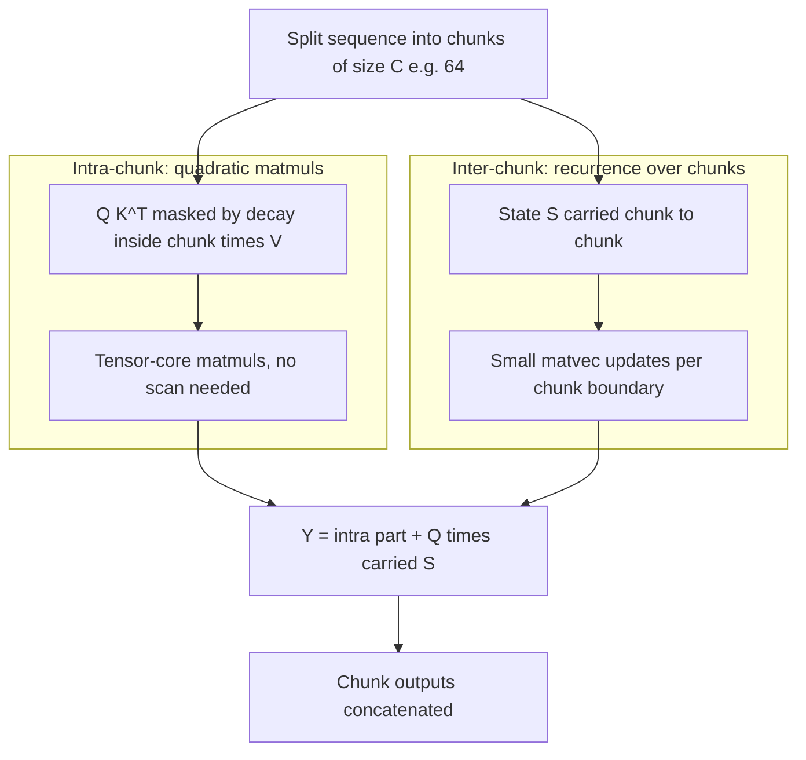

# Linear Attention Variants (RetNet, GLA, DeltaNet, Based)

## Overview

Linear attention is the family of sequence mixers that replace softmax(QKᵀ)V with a kernelized form computable as a **recurrence over a matrix-valued state** — O(N) time, O(1) state per layer — while remaining trainable in parallel. The 2023-2024 wave (RetNet, Gated Linear Attention, DeltaNet, Based) is less a competition of formulas and more a search for the right *gating* and *update rule* on one shared state equation. This page covers the shared machinery (the chunked parallel form is the engineering crux), the four headline variants, the polynomial-attention trick for recall, and the sobering reason Chinchilla-style scaling studies kept recommending softmax attention.

> **Interview Angle**: Expect "why did linear attention underperform its complexity promise?" The answer has two halves: expressivity (no softmax normalization, fixed state) and training economics (Chinchilla-optimal runs use short contexts where O(N²) barely hurts, so softmax keeps winning at equal compute).

## The Shared Machinery: From Softmax to Fast Weights

Katharopoulos et al. (2020) observed that with feature maps \\( \phi(\cdot) \\):

\\[ \mathrm{Attn}(Q,K,V) \approx \frac{\phi(Q)(\phi(K)^\top V)}{\phi(Q)\phi(K)^\top \mathbf{1}} \\]

Reordering the products turns the \\( N \times N \\) matrix into an accumulating **fast-weight matrix**:

\\[ S_t = S_{t-1} + v_t k_t^\top, \qquad y_t = \frac{\phi(q_t)^\top S_t}{\phi(q_t)^\top z_t}, \qquad z_t = z_{t-1} + \phi(k_t) \\]

This is a linear RNN whose state is a \\( d \times d \\) matrix: train in parallel (scan or chunked matmul), infer with O(1) state. Every variant on this page is this equation plus a modification:

| Variant | Modification to the state equation | Motivation |
|---|---|---|
| Linear Transformer (2020) | none (plain sum) | Baseline; softmax removed, quality drops |
| RetNet (2023) | \\( S_t = \gamma\, S_{t-1} + v_t k_t^\top \\) (per-head scalar decay γ) | Stability + parallel recurrence form; positional decay |
| GLA (2023) | \\( S_t = \mathrm{diag}(\alpha_t)\, S_{t-1} + k_t v_t^\top \\), α data-dependent per channel | Selective forgetting; hardware-efficient chunked kernel |
| DeltaNet (2021/2024) | \\( S_t = S_{t-1} - \beta_t (S_{t-1}^\top k_t)^\top? \to S_t = S_{t-1}(I - \beta_t k_t k_t^\top) + \beta_t v_t k_t^\top \\) | Replace *additive* writes with *error-correcting* (delta-rule) writes |
| Based (2024) | Quadratic feature map \\( \phi(x) = [x, x \otimes x] / \sqrt d \\) | Boost recall capacity with a rank-2 sketch, keep O(N) |
| Mamba-2 / SSD (2024) | Scalar decay + identity: SSD duality | Unify with attention; tensor-core matmuls |

(The DeltaNet update, written cleanly: \\( S_t = S_{t-1}(I - \beta_t k_t k_t^\top) + \beta_t v_t k_t^\top \\) — it *overwrites* similar past keys instead of accumulating them, exactly like gradient descent on associative memory.)

## RetNet: Retention as Parallel Recurrence

Retentive Network (Sun et al., Microsoft, NeurIPS 2023) defines **retention**: \\( S_t = \gamma S_{t-1} + k_t^\top v_t \\) with a fixed per-head decay \\( \gamma \\) (e.g., \\( \gamma = 1 - 2^{-5 - h} \\) across heads h) and a positional factor \\( \theta_m = e^{im\omega} \\) absorbed as complex rotations — a RoPE-like decayed relative position. Three computation modes:

- **Parallel**: full-sequence training with a \\( QK^\top \odot D \\) chunk form, where \\( D_{ij} = \gamma^{t-i} \\) is the decay mask — literally attention-shaped without softmax.
- **Recurrent**: O(1) state for decode.
- **Chunkwise**: chunk-parallel training form; the paper reports ~7× speedup over transformers at 8K context and 3.5× memory reduction at 2.5× the scale in its latency tables.

RetNet's legacy is less its benchmarks than its framing: **"parallelism + low-cost inference are simultaneously achievable"**, which the entire subsequent literature (GLA, Mamba-2's chunk-parallel algorithm) adopted.

## GLA: Gated Linear Attention

GLA (Yang et al., ICML 2024) makes the decay **data-dependent and per-channel**: \\( S_t = \mathrm{diag}(\alpha_t) S_{t-1} + k_t v_t^\top \\), with \\( \alpha_t = \sigma(\text{small MLP}(x_t)) \\) or \\( \sigma(q_t k_t^\top / \sqrt d) \\)-flavored gates. Its engineering contribution is the **hardware-efficient chunked form**: within a chunk, compute the \\( QK^\top V \\)-shaped quadratic form (matmuls, tensor cores); across chunks, update states recurrently (small matrix ops). With careful partial-sum bookkeeping and log-space gate cumulation for stability, GLA reaches FlashAttention-2-class training speed at 2K context on H100 for 1.3B/2.7B models while beating the plain linear transformer and RetNet-style baselines on the same data.

## DeltaNet: Error-Correcting Writes

Plain additive state has a failure mode: writing many similar key-value pairs *accumulates* them, blurring recall (interference). The delta rule (Schlag et al., 2021) treats \\( S \\) as an associative memory trained with one gradient step per token:

\\[ S_t = S_{t-1} + \beta_t\, v_t k_t^\top - \beta_t\, (S_{t-1} k_t)\, k_t^\top \\]

i.e., retrieve what key \\( k_t \\) currently maps to (\\( S_{t-1}k_t \\)), subtract it, write the new value — a *replace*, not an *add*. This sharply improves key-collision handling and multi-association tasks. The catch: the update is a matrix product per token, which is why DeltaNet was recurrent-only until **Yang et al. (2024)** parallelized the delta rule over sequence length with a WY-representation-based chunked algorithm ("Parallelizing Linear Transformers with the Delta Rule over Sequence Length"), reaching ~6× training speedup over the recurrent form and hybrid-model quality parity at 1.3B-7B scale. DeltaNet-style state updates now appear in RWKV-7 ("generalized delta rule") and 2025 linear-attention stacks.

## Based: Polynomial Attention for Recall

Based (Arora et al., ICML 2024) attacks the recall problem head-on. The Zoology benchmark line (Arora et al., 2023-2024) showed that on **multi-query associative recall (MQAR)** — "here are some key-value pairs in the prompt; answer queries about them" — the quality of a linear/SSM model is governed by the **rank of its feature map**: \\( \phi(q)^\top \phi(k) \\) with linear \\( \phi \\) gives rank-\\( d \\) memory; recall needs more. Based uses a **quadratic (degree-2) sketch** \\( \phi(x) = [x, x \otimes x]/\sqrt d \\) (rank ~d²) plus local sliding-window attention for fine-grained recency. Results from the paper (1.3B, on-par-with-transformer quality regime): Based's linear-attention path delivers ~8× higher token throughput than a transformer of matched quality at long context (the paper's combined-mode tables show up to ~8-14× vs strong dense baselines at 8K+), and Based+local hybrid matches dense quality on MQAR where pure linear fails.

## The Chunked Parallel Form (What All of Them Actually Run)

The unifying training algorithm — worth reproducing once, since every variant (GLA, DeltaNet, Mamba-2, RWKV-6 chunk kernels) is a bookkeeping variation:



```python
def chunkwise_linear_attention(q, k, v, decay):
    # q,k,v: (num_chunks, C, D); decay: cumulative per-position decay
    S = torch.zeros(D, D)                       # carried fast-weight state
    out = []
    for c in range(num_chunks):
        inner = (q[c] @ k[c].T) * decay_mask    # (C, C) within-chunk scores
        out.append(inner @ v[c] + q[c] @ S)     # tensor cores for the big part
        S = decay[-1] * S + k[c].T @ v[c]       # O(C d^2) state update per chunk
    return torch.cat(out)
```

Intra-chunk work is \\( O(C^2 d) \\) per chunk of matmuls (compute-friendly); inter-chunk is \\( O(N d^2 / C) \\) with constant memory. Choose \\( C \approx 64{-}128 \\) to saturate tensor cores. This is the *same* decomposition Mamba-2's SSD uses — the 2024 insight was that "SSM vs linear attention" is largely a choice of decay mask and normalization on this template.

## Trade-off Table and Why Softmax Attention Won Scaling

| Method | Train compute | Decode state | Recall (MQAR/copy) | Training parallelism | Kernel maturity (2025) |
|---|---|---|---|---|---|
| Softmax attention | O(N²d) | KV cache O(N) | Exact | Full (FlashAttention) | Excellent |
| Linear Transformer | O(Nd²) | d×d matrix | Poor | Full (scan/chunks) | Historic |
| RetNet | O(Nd²) | d×d, fixed decay | Moderate | Chunked | Research code |
| GLA | O(Nd²) | d×d, gated | Moderate-good | Chunked, fast kernels | Good (FLA library) |
| DeltaNet (parallel) | O(Nd²), heavier inner | d×d, delta writes | Good on collisions | Chunked (WY-based) | Good (FLA library) |
| Based | O(Nd²) sketch + local attn | sketch state | Good (rank-2 sketch) | Chunked | Research code |

The Chinchilla question. Hoffmann et al. (2022) compared attention variants under compute-optimal training and found softmax attention the efficient choice — how, given O(N²)? Three structural reasons, all still cited in 2025:

1. **Training context is short.** Compute-optimal runs train at 1K-8K context, where \\( N^2 d \\) with \\( N \le 8K \\) is comparable to or cheaper than the \\( d^2 \\)-scale recurrence bookkeeping, and softmax's exactness wins the quality-per-FLOP race. The linear families' advantage only materializes at long N — which compute-optimal *training* rarely visits (even if *deployment* does).
2. **Lossless vs compressed state.** The KV cache is lossless; fixed-size state discards information by construction. On Pile-style scaling, transformers convert those FLOPs into lower loss.
3. **Kernel economics.** FlashAttention made softmax attention *IO-optimal* — the n² materialization problem gone — so the practical gap at ≤8K narrowed further.

The honest 2025 summary: pure linear attention is a *deployment* win (long context, streaming) and a *training* loss (short-context compute-optimal regimes), which is precisely why hybrids — a small number of softmax layers embedded in a linear/SSM body — became the production compromise.

## Interview Questions

1. **Derive why linear attention admits an O(1)-state recurrence while softmax does not.**
   Linear attention replaces softmax(QK^T)V with φ(Q)(φ(K)^T V) / normalizer. Because φ(K)^T V does not involve the query, it can be accumulated as S_t = S_{t-1} + v_t φ(k_t)^T and the normalizer as a vector sum; the query then reads the state at each step. Softmax's weight w_ij = exp(q_i·k_j)/Σ exp(q_i·k_l) couples the query with every key inside a normalization, so the "sum over keys so far" cannot be finalized before the query arrives — no accumulator exists, hence O(N) KV state. That query-independence is the entire dividing line.

2. **What problem does the delta rule solve that plain additive state cannot, and what did parallelizing it require?**
   Additive writes accumulate: if the same key is written twice, both values blur into one memory, and near-collisions interfere. The delta rule performs one step of gradient descent on the associative memory S with respect to key k_t: subtract S_{t-1}k_t's projection on k_t, then write v_t — an overwrite. This fixes key-collision recall (multi-association tasks). Parallelizing it required expressing the product of successive non-commuting updates as a WY representation so chunks can be computed with matmuls instead of step-by-step matrix products — Yang et al. 2024 got ~6× training speedup this way.

3. **Why did Chinchilla-style compute-optimal scaling favor softmax attention despite its O(N²) cost?**
   Because compute-optimal training happens at short context (1-8K), where N²d attention costs are modest and softmax's exactness buys lower loss per FLOP; linear models pay d²-scale recurrence costs that only amortize at long N. Plus the KV cache is lossless while linear states compress, and FlashAttention removed softmax's practical IO bottleneck. The linear families are deployment-long-context wins and training-short-context losses — which is why hybrids, not pure replacements, became the 2024 answer.

4. **Explain the chunked parallel form and why it dominates these architectures' training kernels.**
   Split the sequence into chunks of C≈64-128. Within a chunk, the decayed linear attention is a C×C masked quadratic form — plain matmuls that saturate tensor cores. Across chunks, the state S is updated recurrently (k^T v products, small matrices), and each chunk's output adds q_c·S_carried. This splits O(N²) sequential dependence into matmul-friendly local blocks plus cheap inter-chunk recurrence, keeping FLOPs at O(Nd²) with full hardware utilization. GLA, DeltaNet-parallel, Mamba-2 SSD, and RWKV-6 chunk kernels are all this template with different gates/decays.

5. **You must ship a 1M-context model on a fixed serving budget. Rank: dense, RetNet-style linear, GLA/DeltaNet hybrid. Justify.**
   Rank: hybrid first, dense second, pure linear last for quality-critical products. The hybrid (e.g., GLA/DeltaNet body + ~10-15% softmax layers) keeps most layers at O(1) state — decode memory and bandwidth stay flat at 1M tokens — while the few softmax layers restore exact recall for retrieval-style queries; Jamba/Griffin-class results support this. Dense at 1M needs heroic KV management (ring attention, GQA, quantization) and pays quadratic prefill. Pure linear/RetNet has the best cost curve but unbounded recall degradation — acceptable only if the workload tolerates fuzzy memory (summarization, streaming), not needle-retrieval.

## Key Takeaways

- All linear-attention variants share one state equation S_t = gate · S_{t-1} + (update); variants differ in gate (fixed γ / gated α / delta rule) and feature map (linear / polynomial sketch).
- Query-independent weights are what make O(1)-state inference possible; softmax's query-coupled normalization is the fundamental blocker.
- RetNet's contribution is the three-mode framing (parallel/recurrent/chunkwise); GLA's is data-dependent gating plus hardware-efficient chunk kernels; DeltaNet's is error-correcting writes; Based's is rank-2 sketches to buy recall back.
- The chunked parallel form — intra-chunk matmuls, inter-chunk recurrence — is the universal training kernel; Mamba-2's SSD is the same decomposition proved as an attention duality.
- Chinchilla-scaling favored softmax because compute-optimal training is short-context; linear families win at long-context deployment, hence the hybrid compromise.
- Recall is governed by state rank/capacity: MQAR results predict quality gaps before you train.

## References

- Katharopoulos et al., "[Transformers are RNNs: Fast Autoregressive Transformers with Linear Attention](https://arxiv.org/abs/2006.16236)" (ICML 2020)
- Schlag, Irie, Schmidhuber, "[Linear Transformers Are Secretly Fast Weight Programmers](https://arxiv.org/abs/2102.11174)" (ICML 2021) — delta rule
- Sun et al., "[Retentive Network: A Successor to Transformer for Large Language Models](https://arxiv.org/abs/2307.08621)" (NeurIPS 2023)
- Yang et al., "[Gated Linear Attention Transformers with Hardware-Efficient Training](https://arxiv.org/abs/2312.06635)" (ICML 2024)
- Yang et al., "[Parallelizing Linear Transformers with the Delta Rule over Sequence Length](https://arxiv.org/abs/2406.06484)" (NeurIPS 2024)
- Arora et al., "[Simple linear attention language models balance the recall-throughput tradeoff](https://arxiv.org/abs/2402.18668)" (ICML 2024) — Based
- Arora et al., "[Zoology: Measuring and Improving Recall in Efficient Language Models](https://arxiv.org/abs/2312.04927)" (2023) — MQAR
- Hoffmann et al., "[Training Compute-Optimal Large Language Models](https://arxiv.org/abs/2203.15556)" (2022) — Chinchilla
- Dao & Gu, "[Transformers are SSMs](https://arxiv.org/abs/2405.21060)" (ICML 2024) — SSD duality
- Flash Linear Attention library (GLA/DeltaNet kernels): [github.com/fla-org/flash-linear-attention](https://github.com/fla-org/flash-linear-attention)

## Cross-References

- [Mamba / SSM](./mamba-ssm.md) — the selective scan as the SSM branch of the same state equation
- [RWKV](./rwkv.md) — the WKV operator as an independent arrival at gated matrix state
- [SSM vs Attention](./ssm-vs-attention.md) — MQAR, copying, and the decision tree for picking a family
- [Transformer Internals](../advanced/transformer-internals.md) — the softmax baseline's kernel economics
- [FlashAttention](../advanced/flash-attention.md) — why IO-optimality kept softmax competitive at ≤8K
- [Hybrid Architectures](./hybrid-architectures.md) — how many softmax layers to keep and why
