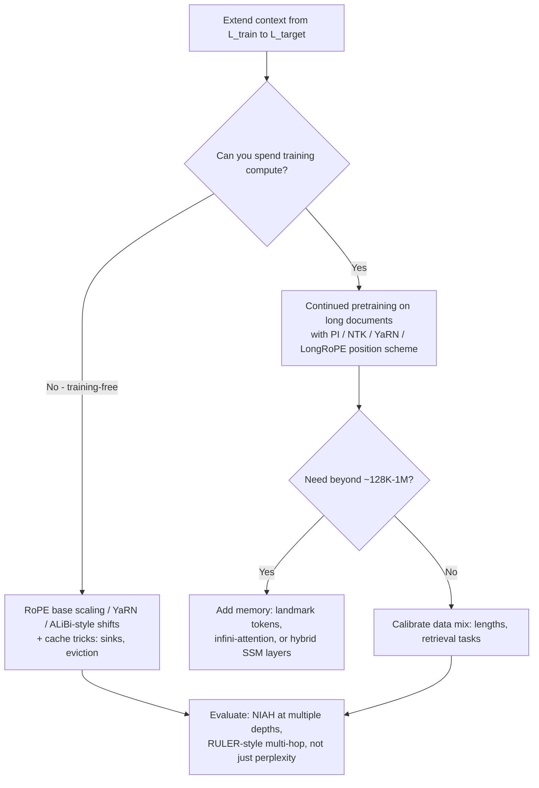
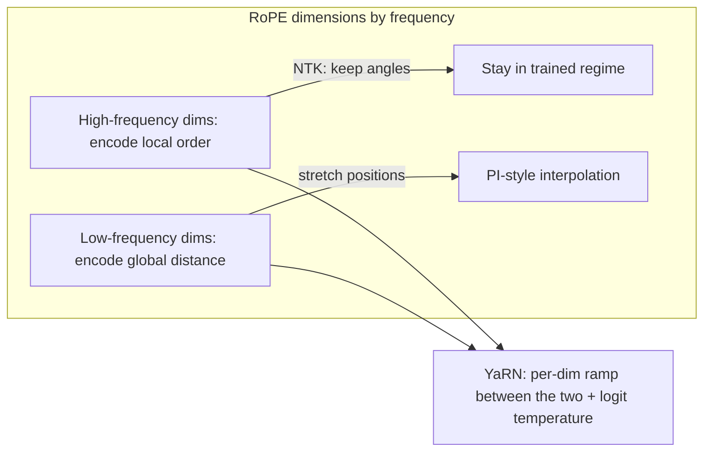
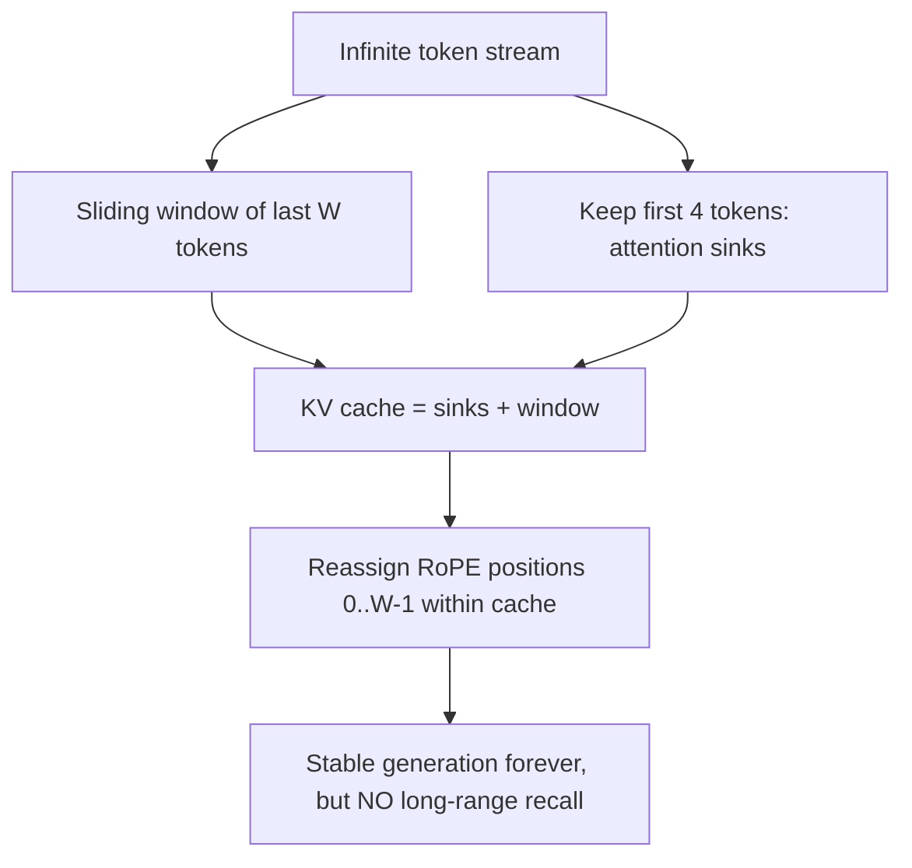

# Long-Context Strategies

## Overview

Getting a model that was trained at 4K tokens to work at 128K or 1M is an architecture problem in three layers: the **position representation** (RoPE frequencies were learned for a bounded range), the **attention pattern** (full attention costs O(N²) and an O(N) KV cache), and the **data recipe** (long-range behavior must be learned, not just enabled). This page covers the extension toolbox — position interpolation, NTK-aware scaling, YaRN, ALiBi's extrapolation trick, sliding-window attention with attention sinks, and KV memory compression — plus the evaluation phenomenon that judges them all ("lost in the middle"). The angle here is *strategy and trade-offs*; the RoPE mechanics themselves are in [Position Encoding](../advanced/position-encoding.md).

> **Interview Angle**: The classic question is "your Llama-2-7B checkpoint is trained at 4K; how do you get usable 64K?" Interviewers want the decision path: training-free quick fix vs continued pretraining, what breaks (needle recall, instruction following at depth), and what each method costs.

## Why Context Extension Is Hard

Three failure modes appear when you simply run a RoPE model beyond its training length:

1. **RoPE spectrum collapse.** RoPE assigns each dimension pair a frequency \\( \theta_i = \mathrm{base}^{-2i/d} \\). Dimensions with high frequency complete many rotations within the training range and are well-learned; beyond it, unseen angles extrapolate poorly. Perplexity diverges sharply past the training horizon.
2. **Unseen attention patterns.** Full attention at 64K means every pair of tokens participates — patterns at distances never seen in training have uncalibrated logits.
3. **Distribution shift in supervision.** Even with valid positions, models show degraded retrieval at depth: relevant information buried mid-context is systematically under-used (Liu et al., TACL 2024 — U-shaped accuracy curves; Needle-in-a-Haystack hit rates drop for middle placements on un-tuned models).

## RoPE Scaling: PI, NTK-aware, YaRN

All three target the same object — the rotation angles \\( i\,\theta_j \\) — by mapping a target position \\( i \in [0, L_{target}) \\) into the well-trained range.

| Method | Idea | Rescaling rule | Training needed | Notes |
|---|---|---|---|---|
| Position Interpolation (PI, Meta 2023) | Compress positions linearly into the trained range | \\( i \to i \cdot L_{train}/L_{target} \\) | ~1000 steps light fine-tune | All frequencies squeezed; local detail (adjacent-token discrimination) is degraded; Llama-2-7B 4K→32K |
| NTK-aware scaling (community, 2023) | Interpolate *low* frequencies, let high frequencies keep resolution | Replace base: \\( \mathrm{base}' = \mathrm{base} \cdot s^{d/(d-2)} \\) for scale s | None (some gain from a little tuning) | Preserves local relative distances; "RoPE ABF" (base-frequency scaling) is the trained variant used by Llama 3.1-style long-context runs |
| YaRN (2023) | Per-frequency interpolation ramp + attention temperature \\( \sqrt{1/t} \\) on logits | Frequency-dependent blend of PI and NTK across the spectrum | ~400-1000 steps | Best quality-per-step of the family; interpolation boundary chosen so high-freq dims stay NTK-like, low-freq dims get PI |

Intuition worth quoting in interviews: PI treats all dimensions equally and therefore blurs the high-frequency dimensions that encode local word order; NTK-aware treats the RoPE spectrum like a Nyquist problem — stretch the long-wavelength dimensions (they never got enough training signal anyway), leave the short-wavelength ones alone. YaRN is the principled interpolation between the two, plus a temperature that corrects for the logit-magnitude drift as distances grow.

### Spectrum picture

## ALiBi: Extrapolation by Construction

ALiBi (Press et al., ICLR 2022) removes position embeddings entirely and subtracts a linear distance penalty from attention logits: \\( \mathrm{score}_{ij} = q_i^\top k_j - m_h \cdot |i-j| \\), with head-specific slopes \\( m_h \\) (geometric sequence like 1/2, 1/4, ...). Because the bias is defined for any distance, models extrapolate to sequences longer than trained — BLOOM and MPT shipped with it. The trade-offs:

- **Pro**: zero-parameter, monotone locality prior, graceful perplexity extrapolation.
- **Con**: the hard locality prior underperforms RoPE at *training* length on some tasks; and ALiBi models still show "lost in the middle"-style degradation, since extrapolation ≠ retrieval competence. Modern frontier models mostly stayed with RoPE + scaling, but ALiBi remains the textbook answer for "extrapolate without touching weights."

## Sliding Window + Attention Sinks (StreamingLLM)

StreamingLLM (Xiao et al., ICLR 2024) addresses *infinite streaming*, not long-context recall. Two findings:

1. **Attention sinks**: the first 1-4 tokens receive disproportionately large attention regardless of relevance — softmax must allocate mass somewhere, and early tokens are the safe sink. Evicting them collapses quality catastrophically; keeping them restores it.
2. **Absolute positions of the window matter less than sink preservation**: restarting RoPE positions at each sliding window (cache = first 4 tokens + most recent W-4) yields stable perplexity to 4M+ tokens.

The catch: tokens evicted from the window are gone — StreamingLLM preserves fluency, not memory. It pairs naturally with an external retrieval layer (RAG) rather than replacing it. Local sliding-window attention as a *trained* pattern (Mistral's 4K window, Gemma 2/3's local-global mixes) is the static cousin: see [Transformer Internals](../advanced/transformer-internals.md) and [Hybrid Architectures](./hybrid-architectures.md) for how many local vs global layers to keep.

## KV Memory Compression for Long Context

When the goal is *recall* at bounded memory, the architecture must decide what to keep:

| Technique | Mechanism | What it preserves | Cost |
|---|---|---|---|
| GQA/MQA (architectural) | Share KV heads | Everything, at lower fidelity per-head | Near-free; Llama-2/3, Mistral standard |
| KV quantization (int8/int4) | Lower-precision cache | Everything approximately | Kernel support; see [KV cache page](../llm-serving/kv-cache.md) |
| StreamingLLM sinks + window | Evict middle | Recency + sink tokens | No long-range recall |
| H2O / SnapKV eviction | Keep tokens with top accumulated attention | Heuristically important tokens | Editable-state drift; needs calibration |
| Landmark attention (Mohtashami & Jaggi, 2023) | Landmark tokens between chunks; retrieval head attends to them first | Any chunk reachable via landmarks | Needs training; random-access to full context |
| Infini-attention (Munkhdalai et al., 2024) | Compressive memory matrix + local attention per segment | Bounded summary of all prior segments | Trained; quality on deep recall contested |
| MLA (DeepSeek-V2/V3) | Low-rank latent KV | Everything at d_c=512 rank | Custom kernels; see [internals page](../advanced/transformer-internals.md) |
| Hybrid SSM layers | Replace most attention with fixed-state layers | Global gist, not verbatim | Recall ceiling of SSMs |

## Lost in the Middle

Liu et al. (2023, TACL 2024) placed the answer-carrying "needle" at varying depths in long contexts and found U-shaped accuracy: models retrieve well from the *beginning* (primacy) and *end* (recency) but poorly from the middle — even for models advertised as 32K/128K context. Practical consequences interviewers probe:

- **RAG system design**: put the most relevant passages at the prompt edges; k-best-first ordering beats chronological ordering (see [RAG systems](../rag-systems.md)).
- **Evaluation discipline**: perplexity at long context does not imply retrieval competence. Test with multi-depth needle tasks (NIAH variants, RULER-style multi-hop and aggregation) — several 2024 papers found "passed NIAH, failed everything harder."
- **Training fixes**: continued pretraining/instruction tuning with documents where the *relevant* content sits mid-context; loss weighting on middle-context spans; retrieval-style synthetic tasks.

## Trained Extension: What Production Models Did

| Model family | Advertised context | Position scheme | How it was trained |
|---|---|---|---|
| Llama 2 | 4K (32K via PI fine-tune) | RoPE base 10K | PI: ~1000-step fine-tune to 32K (Chen et al. 2023) |
| Mistral 7B | 8K, 32K via sliding window config | RoPE + 4K sliding window | Window trained in; long contexts via SWA composition |
| Llama 3.1 | 128K | RoPE base raised to 500K (ABF-style) + YaRN-grade recipes | Staged continued pretraining up to 128K on long data |
| Qwen 2.5 | 32K-128K (1M variant) | RoPE + ABF + dual-chunk attention variants | Long-context continued pretraining + synthetic retrieval data |
| Gemini 1.5 | up to 10M tokens reported | Not fully disclosed; reportedly mixed local/global attention + long training | Massive long-data curriculum (report: 2403.05530) |
| GPT-4 Turbo | 128K | Undisclosed | Undisclosed |

Rules of thumb for a training-budgeted extension: (1) raise the RoPE base (ABF) rather than pure PI; (2) extend in stages (4K→16K→64K→128K), adapting data length distribution each stage; (3) include needle/retrieval synthetic tasks, not just long natural documents; (4) expect ~0.5-2B tokens of long-data exposure for a 7B-class model to hold quality; (5) re-evaluate with depth-aware benchmarks, not perplexity alone. LongRoPE (Microsoft, 2024) pushes to 2M tokens by searching non-uniform per-dimension interpolation factors plus a short fine-tune — the current public-art representative of "search the spectrum, don't hand-tune it."

## Interview Questions

1. **Your 4K-trained Llama checkpoint must handle 64K with a two-day budget. What do you do?**
   Training-free first: NTK-aware base scaling (or YaRN with ~500-1000 step tuning if any GPU-hours exist), evaluate with multi-depth needle and RULER-style tasks, not perplexity. If quality must hold for retrieval-style workloads, run staged continued pretraining: raise the RoPE base (ABF-style), continue on 16K→64K long documents with some synthetic retrieval tasks — roughly 0.5-2B tokens for a 7B model. Add GQA/quantized KV serving to keep the 64K cache affordable. PI alone is the fallback if using an off-the-shelf recipe, but expect local-order blurring vs ABF/YaRN.

2. **Why does StreamingLLM need "attention sink" tokens, and what happens without them?**
   Softmax must sum to one; the model learns to park excess probability on early tokens that are always available — they act as a learned bias/sink rather than information. StreamingLLM found that when the cache slides and the first tokens are evicted, the distribution's sink vanishes, softmax renormalizes over uncalibrated tokens, and perplexity explodes (often past 10^3) within a few hundred steps. Keeping the first 4 tokens plus a sliding window, with RoPE positions restarted inside the cache, keeps perplexity flat for millions of tokens — but evicted history is unrecoverable, so this is fluency-preserving streaming, not long-term memory.

3. **Explain the difference between PI and NTK-aware scaling and when each is preferable.**
   PI maps every target position linearly into the trained range — all RoPE frequencies compress together, so adjacent-token angular separation shrinks and local-order discrimination degrades; it is the safest for modest extensions and needs a light fine-tune. NTK-aware scaling raises the base so low-frequency (long-wavelength) dimensions stretch while high-frequency dimensions keep their local resolution — better out-of-the-box extrapolation and the base for trained long-context runs (ABF, Llama-3.1's 500K base). Prefer PI when you can fine-tune and want a short, predictable recipe; prefer NTK/ABF/YaRN when preserving local fidelity matters or when continuing training.

4. **What is "lost in the middle" and what three concrete mitigations would you apply in a RAG pipeline?**
   It is the U-shaped accuracy curve for information placed at different depths in context: retrieval is strong at the beginning and end, weak in the middle, independent of claimed context length. Mitigations: (1) order retrieved passages by relevance with the best at the edges (k-best-first ordering), (2) cap the context to what the model demonstrably uses well rather than its maximum window — sometimes 32K beats 128K for accuracy per token, (3) include depth-varied retrieval tasks in fine-tuning, and evaluate with depth-controlled benchmarks rather than assuming window size equals usable context.

5. **How do attention sinks, GQA, and KV eviction differ in what they give up?**
   Sinks + sliding window give *unbounded streaming* at fixed memory but evict all middle history — no long-range recall. GQA gives *lossy-but-complete* history: every token stays cached, at reduced per-head fidelity, with near-zero quality cost — the default architectural choice. Eviction (H2O/SnapKV) keeps a bounded cache but chooses *which tokens matter* by attention statistics — good when importance is concentrated, risky when the needle was low-attention at write time. They compose: GQA + int8 + eviction is a standard serving stack (see the KV cache page), while sinks solve a different failure (streaming stability).

6. **When do you reach for memory mechanisms (landmarks, infini-attention) vs just scaling RoPE and training longer?**
   RoPE scaling + long continued pretraining covers to ~128K-1M reliably and is the cheapest engineering path with known recipes (Llama 3.1, Qwen). Memory mechanisms enter when context is *unbounded* (infinite streams), when you cannot afford the KV cache (1M+ serving economics), or when random access to full history must survive bounded memory (landmark attention's retrieval head). The trade is added architecture complexity and training difficulty against asymptotic memory — and post-2024 the hybrid-SSM route (fixed-state layers + sparse attention) often dominates pure bolt-on memory designs.

## Key Takeaways

- Context extension touches three layers: position scheme (RoPE scaling), attention/cache budget (windows, eviction, compression), and training data (long + retrieval tasks).
- PI compresses all frequencies (safe, blurs local order); NTK-aware/ABF stretches low frequencies (better extrapolation); YaRN interpolates per-dimension plus a logit temperature — the best quality-per-step recipe.
- ALiBi buys extrapolation by construction with a linear distance bias; strong locality prior, but extrapolation does not equal deep retrieval.
- StreamingLLM: keep attention sinks + sliding window for infinite fluent streaming with zero long-range memory.
- Bounded-memory recall requires explicit memory mechanisms (landmarks, compressive memory) or hybrid fixed-state layers.
- Lost in the middle is a data/training phenomenon with U-shaped depth curves — evaluate with depth-aware benchmarks; order RAG context by relevance.
- Production reference points: Llama 3.1's 500K RoPE base + staged 128K pretraining; Qwen ABF + long-data curriculum; Gemini 1.5's multi-million-token regime via local/global mixes.

## References

- Su et al., "[RoFormer: Enhanced Transformer with Rotary Position Embedding](https://arxiv.org/abs/2104.09864)" (Neurocomputing 2021)
- Chen et al., "[Extending Context Window of Large Language Models via Positional Interpolation](https://arxiv.org/abs/2306.15595)" (2023)
- Peng et al., "[YaRN: Efficient Context Window Extension of Large Language Models](https://arxiv.org/abs/2309.00071)" (ICLR 2024)
- Press, Smith, Lewis, "[Train Short, Test Long: Attention with Linear Biases Enables Input Length Extrapolation](https://arxiv.org/abs/2108.12409)" (ICLR 2022) — ALiBi
- Xiao et al., "[Efficient Streaming Language Models with Attention Sinks](https://arxiv.org/abs/2309.17453)" (ICLR 2024) — StreamingLLM
- Liu et al., "[Lost in the Middle: How Language Models Use Long Contexts](https://arxiv.org/abs/2307.03172)" (TACL 2024)
- Mohtashami & Jaggi, "[Landmark Attention: Random-Access Infinite Context Length for Transformers](https://arxiv.org/abs/2305.16300)" (NeurIPS 2023)
- Munkhdalai et al., "[Leave No Context Behind: Efficient Infinite Context Transformers with Infini-attention](https://arxiv.org/abs/2404.07143)" (Google, 2024)
- Ding et al., "[LongRoPE: Extending LLM Context Window Beyond 2 Million Tokens](https://arxiv.org/abs/2402.13753)" (Microsoft, 2024)
- Team Gemini, "[Gemini 1.5: Unlocking Multimodal Understanding Across Millions of Tokens of Context](https://arxiv.org/abs/2403.05530)" (2024)
- Hsieh et al., "[RULER: What's the Real Context Size of Your Long-Context Language Models?](https://arxiv.org/abs/2404.06654)" (NVIDIA, COLM 2024)

## Cross-References

- [Position Encoding (RoPE, ALiBi)](../advanced/position-encoding.md) — the mechanics of the position schemes scaled on this page
- [Transformer Internals](../advanced/transformer-internals.md) — KV cache sizes and GQA/MLA compression details
- [Ring Attention](../advanced/ring-attention.md) — the distributed route to long context without changing the model
- [KV Cache (serving)](../llm-serving/kv-cache.md) — serving-side memory math for extended contexts
- [Hybrid Architectures](./hybrid-architectures.md) — the architectural alternative: fixed-state layers + local/global attention
- [SSM vs Attention](./ssm-vs-attention.md) — when to abandon the KV cache entirely
